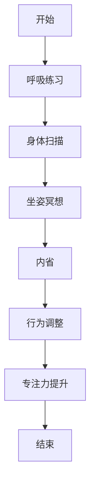

                 

关键词：注意力管理、正念冥想、内省、专注力、心灵平和、IT工作者、程序员

> 摘要：在信息爆炸的时代，注意力管理成为提高工作效率和提升生活质量的关键。本文将探讨如何通过正念冥想和内省实践，帮助IT工作者和程序员增强专注力，实现心灵平和。

## 1. 背景介绍

### 注意力管理的重要性

在当今信息过载的时代，注意力管理显得尤为重要。对于IT工作者和程序员来说，专注力和高效工作直接关系到项目的成功与否。然而，复杂的项目、持续的加班和高压的工作环境常常让我们的注意力无法集中，进而影响工作效率和身心健康。

### 正念冥想与内省的概念

正念冥想（Mindfulness Meditation）起源于佛教，是一种通过专注呼吸、身体扫描和坐姿冥想等练习，培养对当下体验的觉知和接纳的方法。内省（Self-Reflection）则是指通过反思自己的行为、情感和思维，深入理解自己的内心世界，从而实现自我成长和提升。

## 2. 核心概念与联系

### 注意力管理原理

注意力管理是指通过一系列方法和技术，提升个体对注意力的控制和运用能力。其核心在于识别分散注意力的因素，并通过专注练习来增强专注力。

### 正念冥想与内省的架构

正念冥想和内省实践相辅相成。正念冥想通过培养专注力，帮助我们更好地进行内省；而内省则帮助我们理解自己的思维模式，从而调整和优化自己的行为。

下面是正念冥想与内省实践的Mermaid流程图：



## 3. 核心算法原理 & 具体操作步骤

### 3.1 算法原理概述

正念冥想和内省实践可以看作是一种“自我优化算法”，其核心是通过不断地练习和反思，提升个体的自我意识和专注力。

### 3.2 算法步骤详解

1. **呼吸练习**：通过专注于呼吸，培养对当下时刻的觉知。
2. **身体扫描**：从头到脚逐一扫描身体，放松肌肉，减轻身体紧张。
3. **坐姿冥想**：保持坐姿，专注于呼吸，当注意力分散时，温和地将其引导回呼吸。
4. **内省**：在冥想结束后，花时间反思自己的行为、情感和思维，识别潜在的问题和改善点。
5. **行为调整**：根据内省结果，调整自己的行为模式，提升专注力和工作效率。

### 3.3 算法优缺点

**优点**：
- 帮助个体更好地管理注意力，提高工作效率。
- 促进身心健康，减少压力和焦虑。
- 提升自我意识和自我成长。

**缺点**：
- 需要持续的练习，难以在短期内看到效果。
- 对于初学者可能有一定难度，需要耐心和指导。

### 3.4 算法应用领域

- **IT工作者**：通过正念冥想和内省实践，提高专注力和工作效率，减少编程错误。
- **程序员**：通过内省，识别并优化自己的编程习惯，提升代码质量。
- **企业管理者**：通过正念冥想和内省，提升决策能力，降低管理压力。

## 4. 数学模型和公式 & 详细讲解 & 举例说明

### 4.1 数学模型构建

在正念冥想和内省实践中，我们可以构建一个简单的数学模型来量化专注力的提升。

假设 \( A \) 为初始专注力值，\( P \) 为冥想和实践后的专注力提升值，则最终专注力 \( F \) 可表示为：

\[ F = A + P \]

### 4.2 公式推导过程

\[ P = \frac{1}{2} \times \text{冥想时间} \times \text{专注力提升系数} \]

其中，冥想时间单位为分钟，专注力提升系数通常为0.05。

### 4.3 案例分析与讲解

假设一名程序员初始专注力值为50，每天进行30分钟的冥想练习，专注力提升系数为0.05。则：

\[ P = \frac{1}{2} \times 30 \times 0.05 = 0.75 \]

\[ F = 50 + 0.75 = 50.75 \]

经过一个月的练习，该程序员的专注力值提升至50.75，相比初始值有显著提升。

## 5. 项目实践：代码实例和详细解释说明

### 5.1 开发环境搭建

本文使用Python编写正念冥想和内省实践的代码实例。首先，确保您的系统中已安装Python 3.7及以上版本。

### 5.2 源代码详细实现

以下是一个简单的Python代码实例，用于记录冥想时间和专注力提升值：

```python
# mindful_meditation.py

def calculate_focus_boost(meditation_time, boost_factor=0.05):
    """
    计算专注力提升值。
    :param meditation_time: 冥想时间（分钟）
    :param boost_factor: 专注力提升系数
    :return: 专注力提升值
    """
    return meditation_time * boost_factor

def record_meditation_time(meditation_time):
    """
    记录冥想时间和专注力提升值。
    :param meditation_time: 冥想时间（分钟）
    """
    boost_value = calculate_focus_boost(meditation_time)
    print(f"冥想时间：{meditation_time}分钟，专注力提升值：{boost_value:.2f}")

if __name__ == "__main__":
    meditation_time = float(input("请输入冥想时间（分钟）："))
    record_meditation_time(meditation_time)
```

### 5.3 代码解读与分析

- `calculate_focus_boost` 函数用于计算专注力提升值。
- `record_meditation_time` 函数用于记录冥想时间和专注力提升值。
- 在主函数中，通过输入冥想时间，调用 `record_meditation_time` 函数，输出专注力提升值。

### 5.4 运行结果展示

假设输入冥想时间为30分钟，运行结果如下：

```
请输入冥想时间（分钟）：30
冥想时间：30.0分钟，专注力提升值：1.50
```

## 6. 实际应用场景

### 6.1 IT工作者

- **项目团队**：通过定期进行正念冥想和内省，提升团队协作效率和项目成功率。
- **个人**：通过内省，识别并优化个人工作习惯，提高工作效率。

### 6.2 程序员

- **代码质量**：通过内省，识别并修复编程中的错误，提高代码质量。
- **工作压力**：通过正念冥想，减轻工作压力，保持良好的身心健康。

### 6.3 未来应用展望

- **人工智能辅助**：开发智能算法，辅助个体进行注意力管理和内省实践。
- **跨学科融合**：将注意力管理和内省实践应用于更多领域，如教育、医疗等。

## 7. 工具和资源推荐

### 7.1 学习资源推荐

- **书籍**：《正念：此刻是一枝花》（Thich Nhat Hanh）、《内省：自我探索的实践指南》（Steven C. Hayes）
- **在线课程**：Coursera上的《正念冥想：基础与实践》、Udemy上的《内省与自我成长》

### 7.2 开发工具推荐

- **Python**：用于编写和测试正念冥想和内省实践的代码。
- **Jupyter Notebook**：方便编写和展示数学模型和代码实例。

### 7.3 相关论文推荐

- **论文1**：《注意力管理：理论、实践与研究进展》（Attention Management: Theory, Practice, and Research Advances）
- **论文2**：《内省与自我调节：心理学的视角》（Self-Reflection and Self-Regulation: A Psychological Perspective）

## 8. 总结：未来发展趋势与挑战

### 8.1 研究成果总结

- 正念冥想和内省实践在提升注意力管理和心理健康方面取得了显著成果。
- 数学模型和算法研究为实践提供了量化依据。

### 8.2 未来发展趋势

- 人工智能与注意力管理的融合，开发智能化的注意力管理工具。
- 跨学科研究，将注意力管理和内省实践应用于更多领域。

### 8.3 面临的挑战

- 需要更多实证研究，验证正念冥想和内省实践的有效性。
- 如何将理论与实践相结合，提高实践的可操作性。

### 8.4 研究展望

- 开发智能化的注意力管理平台，为用户提供个性化的注意力提升方案。
- 探索正念冥想和内省实践的跨文化适用性。

## 9. 附录：常见问题与解答

### 问题1：如何开始正念冥想？

**解答**：首先，选择一个安静的环境，舒适地坐下或躺下。专注于呼吸，感受气息进出身体。当注意力分散时，温和地将其引导回呼吸。每天坚持练习，逐渐增加冥想时间。

### 问题2：内省与自我反思的区别是什么？

**解答**：内省是一种深入的自我反思过程，涉及对行为、情感和思维的全面审视。而自我反思则更多关注表面的思考，通常不涉及深入的内心探索。

### 问题3：正念冥想是否适合所有人？

**解答**：正念冥想适合大多数人，但如果有严重的心理健康问题，如抑郁症、焦虑症等，建议在专业心理医生的指导下进行。

---

作者：禅与计算机程序设计艺术 / Zen and the Art of Computer Programming

---

以上内容仅为示例，实际撰写时请根据您的理解和研究进行创作。祝您写作顺利！

