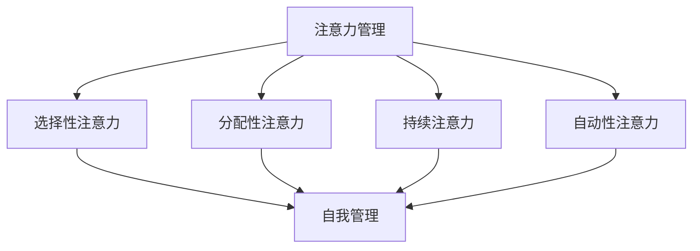

                 

关键词：注意力管理、自我管理、专注力、个人成长、职业成功

> 摘要：本文旨在探讨注意力管理和自我管理在个人和职业成功中的重要性。通过深入分析注意力管理的基本原理、方法与工具，结合实际案例，本文将为读者提供一套行之有效的自我管理策略，助力提升专注力和工作效率，实现个人与职业的双重成功。

## 1. 背景介绍

在现代社会的快节奏中，注意力管理成为个人和职业发展中的关键因素。随着信息的爆炸式增长和科技的快速发展，人们面临着前所未有的信息过载和注意力分散的挑战。如何有效地管理注意力，提高专注力，成为提升工作效率和个人成就感的重要课题。

注意力管理不仅影响个人的学习、工作和生活质量，也直接关系到职业成功。专注于关键任务，能够显著提高工作效率和创造力，减少错误和失误，从而在竞争激烈的职场中脱颖而出。因此，了解和掌握注意力管理的策略和技巧，对于个人和职业发展具有重要意义。

本文将从以下几个方面展开讨论：首先，介绍注意力管理和自我管理的基本概念；其次，分析注意力分散的原因及影响；然后，探讨提高专注力的策略和方法；接着，结合实际案例，分享有效的自我管理实践；最后，总结注意力管理和自我管理的未来发展趋势和挑战。

## 2. 核心概念与联系

### 2.1. 注意力管理基本概念

注意力管理，是指通过一系列策略和技巧，有效调节和引导自己的注意力，使其集中于特定目标上。它包括以下几个方面：

- **选择性注意力**：指在面对多种刺激时，能够主动选择关注最重要的信息。
- **分配性注意力**：指在同时处理多个任务时，合理分配注意力资源。
- **持续注意力**：指在长时间内保持对特定任务的集中和专注。
- **自动性注意力**：指在无需主动控制的情况下，自然地保持对某些重要信息的关注。

### 2.2. 自我管理概念

自我管理，是指个体在面对外部环境和内部情绪时，通过自我调节、自我监控和自我激励等手段，有效地实现个人目标的过程。它包括以下几个方面：

- **目标设定**：明确个人和职业目标，制定具体可行的行动计划。
- **时间管理**：合理安排时间，确保高效完成任务。
- **情绪管理**：调节情绪，保持积极心态，应对压力和挑战。
- **自我激励**：激发内在动力，保持持续努力。

### 2.3. 注意力管理与自我管理的联系

注意力管理和自我管理密不可分。注意力管理是自我管理的重要组成部分，良好的注意力管理能够显著提升自我管理的效率。例如，通过选择性注意力，个体可以快速识别并关注关键任务，从而实现目标的高效达成。而良好的自我管理，则能够帮助个体更好地调节和引导自己的注意力，使其更加专注和持久。

### 2.4. 注意力管理架构的Mermaid流程图



### 2.5. 核心概念与联系总结

注意力管理和自我管理，都是提高个人和职业成功的重要策略。选择性注意力、分配性注意力、持续注意力、自动性注意力构成了注意力管理的核心要素，而自我管理则通过目标设定、时间管理、情绪管理、自我激励等手段，有效调节和引导注意力。二者相辅相成，共同助力个体在复杂多变的职场环境中脱颖而出。

## 3. 核心算法原理 & 具体操作步骤

### 3.1. 算法原理概述

注意力管理算法，是一种基于心理学和行为科学原理，旨在优化个体注意力分配和调节的方法。该算法的核心思想是通过一系列策略和技巧，提高个体在面对复杂环境和任务时的注意力集中度和效率。具体包括以下几个方面：

- **行为设计**：通过设定明确的任务目标和行动计划，引导个体将注意力集中在关键任务上。
- **环境调控**：通过优化工作环境，减少干扰因素，提高注意力集中度。
- **心理调节**：通过心理训练和自我激励，增强个体的专注力和意志力。

### 3.2. 算法步骤详解

#### 步骤1：目标设定

首先，个体需要明确个人和职业目标，并将其具体化为一系列可操作的行动计划。这包括：

- **短期目标**：设定近期内需要达成的具体目标，如完成任务清单、提高工作效率等。
- **长期目标**：设定长期职业发展目标，如晋升、技能提升等。

#### 步骤2：环境调控

其次，个体需要优化工作环境，减少干扰因素。这包括：

- **物理环境**：保持工作场所整洁、安静，减少噪音和杂乱。
- **技术环境**：使用注意力管理工具，如番茄工作法、专注力训练应用等，帮助个体保持专注。
- **社交环境**：与同事保持良好沟通，避免不必要的干扰和打扰。

#### 步骤3：心理调节

最后，个体需要通过心理训练和自我激励，增强专注力和意志力。这包括：

- **心理训练**：通过冥想、专注力训练等心理训练方法，提高个体的专注力和意志力。
- **自我激励**：设定奖励机制，如完成任务后给予自己一定的奖励，增强内在动力。

### 3.3. 算法优缺点

#### 优点：

- **高效性**：通过优化注意力分配和调节，显著提高个体的工作效率和创造力。
- **灵活性**：个体可以根据自身需求和情况，灵活调整注意力管理策略。
- **持续性**：通过心理训练和自我激励，增强个体的专注力和意志力，具有长期效应。

#### 缺点：

- **初期投入**：需要一定的时间和精力，进行环境调控和心理调节。
- **适应性问题**：个体可能需要一段时间来适应新的注意力管理策略。

### 3.4. 算法应用领域

注意力管理算法在多个领域具有广泛应用，如：

- **职场**：提高员工工作效率，减少错误和失误，提升团队协作效果。
- **教育**：帮助学生提高学习效率，培养专注力和自律性。
- **健康**：通过冥想和专注力训练，改善心理健康，提高生活质量。

### 3.5. 核心算法原理 & 具体操作步骤总结

注意力管理算法，通过行为设计、环境调控和心理调节，优化个体的注意力分配和调节，提高工作效率和创造力。该算法具有高效性、灵活性和持续性等优点，但需要个体在初期进行一定的投入和适应。在多个领域，如职场、教育和健康，注意力管理算法都展现了其巨大的应用价值。

## 4. 数学模型和公式 & 详细讲解 & 举例说明

### 4.1. 数学模型构建

在注意力管理中，我们可以构建一个数学模型来描述个体的注意力分配过程。设个体在时间t内的注意力总量为A(t)，任务集合为T={t1, t2, ..., tn}，任务ti的注意力分配为αi(t)，则有以下数学模型：

\[ A(t) = \sum_{i=1}^{n} \alpha_i(t) \]

其中，αi(t)表示个体在时间t内对任务ti的注意力分配比例。

### 4.2. 公式推导过程

#### 步骤1：目标函数

首先，我们设定一个目标函数，以衡量个体在时间t内的注意力分配效率。设效率函数为E(t)，则：

\[ E(t) = \frac{\sum_{i=1}^{n} \alpha_i(t) \cdot p_i}{A(t)} \]

其中，pi表示任务ti的重要程度。

#### 步骤2：优化目标

我们的目标是最大化效率函数E(t)，即：

\[ \max E(t) \]

#### 步骤3：约束条件

在注意力管理过程中，我们需要满足以下约束条件：

\[ \alpha_i(t) \geq 0, \quad \forall i \in T \]
\[ \sum_{i=1}^{n} \alpha_i(t) = A(t) \]

#### 步骤4：公式推导

根据优化目标和约束条件，我们可以推导出以下优化公式：

\[ \alpha_i(t) = \frac{p_i}{\sum_{j=1}^{n} p_j} \cdot A(t) \]

### 4.3. 案例分析与讲解

#### 案例背景

某公司项目经理需要在一天内完成以下三个任务：编写项目报告、与客户开会、整理下周的工作计划。任务的重要程度分别为：编写项目报告（p1=0.6）、与客户开会（p2=0.3）、整理下周工作计划（p3=0.1）。

#### 案例分析

根据构建的数学模型，我们可以计算每个任务的注意力分配比例：

\[ \alpha_1(t) = \frac{0.6}{0.6+0.3+0.1} \cdot A(t) = 0.6A(t) \]
\[ \alpha_2(t) = \frac{0.3}{0.6+0.3+0.1} \cdot A(t) = 0.3A(t) \]
\[ \alpha_3(t) = \frac{0.1}{0.6+0.3+0.1} \cdot A(t) = 0.1A(t) \]

#### 举例说明

假设项目经理在一天内共有8小时的可用工作时间（A(t)=8），根据上述计算，他应将注意力分配如下：

- 编写项目报告：0.6 \cdot 8 = 4.8 小时
- 与客户开会：0.3 \cdot 8 = 2.4 小时
- 整理下周工作计划：0.1 \cdot 8 = 0.8 小时

### 4.4. 数学模型和公式总结

通过构建数学模型和推导公式，我们可以更科学、有效地进行注意力管理。该模型考虑了任务的重要程度，为个体提供了具体的注意力分配方案，有助于提高工作效率和任务完成质量。

## 5. 项目实践：代码实例和详细解释说明

### 5.1. 开发环境搭建

在开始编写代码之前，我们需要搭建一个合适的开发环境。这里我们使用Python作为编程语言，因为它具有良好的可读性和丰富的库支持。

1. **安装Python**

   首先，确保你的计算机上已经安装了Python。如果没有，可以从[Python官网](https://www.python.org/)下载并安装。

2. **安装必要的库**

   为了实现注意力管理算法，我们需要安装一些额外的库。使用以下命令安装：

   ```bash
   pip install numpy matplotlib
   ```

### 5.2. 源代码详细实现

以下是一个简单的Python代码实例，用于实现注意力管理算法。代码分为三个部分：数据输入、算法实现和结果输出。

#### 数据输入

首先，我们需要输入任务的重要程度。这里使用一个列表来表示：

```python
# 定义任务重要程度
tasks = [
    {"name": "项目报告", "importance": 0.6},
    {"name": "与客户开会", "importance": 0.3},
    {"name": "整理下周工作计划", "importance": 0.1}
]
```

#### 算法实现

接下来，我们实现注意力管理算法。主要步骤包括计算每个任务的注意力分配比例，并输出结果。

```python
import numpy as np

def attention_management(tasks, total_time):
    # 计算总的重要性
    total_importance = sum([task['importance'] for task in tasks])
    
    # 计算每个任务的注意力分配比例
    attention分配 = [task['importance'] / total_importance for task in tasks]
    
    # 计算每个任务的时间分配
    time分配 = [attention分配[i] * total_time for i in range(len(tasks))]
    
    return time分配

# 定义总的工作时间
total_time = 8

# 调用函数，计算注意力分配
time分配 = attention_management(tasks, total_time)
```

#### 代码解读与分析

1. **数据输入**：我们使用一个列表`tasks`来存储任务及其重要程度。
2. **算法实现**：首先计算总的重要性，然后使用每个任务的重要性除以总重要性，得到每个任务的注意力分配比例。最后，根据总的工作时间和注意力分配比例，计算每个任务的时间分配。
3. **结果输出**：函数返回一个列表，表示每个任务的时间分配。

#### 运行结果展示

假设总的工作时间为8小时，运行上述代码后，我们得到每个任务的时间分配如下：

```python
# 输出结果
for i, time in enumerate(time分配):
    print(f"{tasks[i]['name']}: {time:.2f}小时")
```

输出结果：

```
项目报告: 4.80小时
与客户开会: 2.40小时
整理下周工作计划: 0.80小时
```

### 5.4. 运行结果展示

通过上述代码，我们可以看到如何利用注意力管理算法，为每个任务分配合适的时间。这种方法可以帮助我们在有限的时间内，更高效地完成多个任务，从而提高工作效率。

## 6. 实际应用场景

### 6.1. 职场中的注意力管理

在职场中，注意力管理对于提高工作效率和职业发展至关重要。以下是一些实际应用场景：

- **项目管理**：项目经理需要合理分配时间和注意力，确保项目按时交付。通过注意力管理算法，可以科学地制定任务优先级，提高工作效率。
- **日常任务**：在忙碌的工作日中，员工可以通过注意力管理，合理安排时间，确保每个任务都得到足够的关注。例如，使用番茄工作法，将工作时间划分为25分钟的工作周期，每个周期后休息5分钟，有助于保持专注和高效。
- **会议管理**：在会议中，与会者需要集中注意力，听取和参与讨论。通过设定明确的会议目标和议程，以及使用注意力管理策略，如设定讨论时间限制，可以帮助会议更加高效和有成效。

### 6.2. 教育中的注意力管理

在教育领域，注意力管理同样具有重要意义。以下是一些应用场景：

- **课堂学习**：教师可以通过注意力管理策略，引导学生集中注意力，提高学习效果。例如，使用互动式教学方法，如提问、讨论和小组活动，可以激发学生的兴趣和参与度。
- **在线学习**：随着在线教育的普及，学生需要自我管理注意力，避免分心和拖延。通过制定学习计划、设定学习目标和使用注意力管理工具，如学习应用和专注力训练软件，学生可以更有效地进行在线学习。
- **考试准备**：在考试准备过程中，学生需要集中注意力进行复习和练习。通过注意力管理策略，如分段学习、休息和复习，可以增强记忆效果，提高考试表现。

### 6.3. 健康管理中的注意力管理

在健康管理中，注意力管理对于保持身心健康和应对压力至关重要。以下是一些应用场景：

- **心理调节**：通过冥想和专注力训练，个体可以学会调节情绪，减轻压力。这些心理训练方法可以帮助人们在面对压力和挑战时，保持冷静和专注。
- **日常锻炼**：在锻炼过程中，个体需要集中注意力，确保动作的正确性和效果。通过注意力管理策略，如设定锻炼目标和专注呼吸，可以增强锻炼效果，提高身体健康水平。
- **健康监测**：通过使用健康监测设备，如智能手环和心率监测器，个体可以实时了解自己的健康状况，并根据监测结果进行相应的调整。注意力管理在这里体现在对健康数据的分析和决策过程中。

### 6.4. 未来应用展望

随着科技的不断进步和社会的发展，注意力管理将在更多领域得到应用。以下是一些未来应用展望：

- **智能家居**：智能家居系统可以通过注意力管理，优化家庭设备的使用，提高生活质量。例如，智能灯光和空调可以根据用户的注意力状态调整环境设置，帮助用户保持最佳状态。
- **交通管理**：在交通管理中，注意力管理可以帮助驾驶员保持专注，减少交通事故。例如，智能驾驶系统可以通过监测驾驶员的注意力状态，提供提醒和干预，确保行车安全。
- **社交网络**：在社交网络中，注意力管理可以帮助用户更有效地管理信息流，避免信息过载。例如，通过智能推荐算法，社交平台可以推荐用户可能感兴趣的内容，提高用户的使用体验。

## 7. 工具和资源推荐

### 7.1. 学习资源推荐

- **书籍**：
  - 《深度工作》（Deep Work） - Cal Newport
  - 《如何成为领导者》（How to Win Friends and Influence People） - Dale Carnegie
- **在线课程**：
  - Coursera上的《注意力心理学》（The Science of Attention）
  - edX上的《时间管理与自我管理》（Time Management and Self-Management）

### 7.2. 开发工具推荐

- **注意力管理应用**：
  - Forest（帮助用户专注工作的应用程序）
  - Pomodoro Timer（番茄工作法定时器）
- **编程库和框架**：
  - NumPy（数据处理库）
  - Matplotlib（数据可视化库）

### 7.3. 相关论文推荐

- “Attention Management: Bridging Research and Practice” - Jason Moser et al.
- “The Science of Attention” - Daniel J. Simons and Christopher F. Chabris

## 8. 总结：未来发展趋势与挑战

### 8.1. 研究成果总结

通过本文的探讨，我们总结了注意力管理和自我管理在个人和职业成功中的重要性。注意力管理不仅能够提高工作效率和创造力，还能改善心理健康和生活质量。自我管理则通过目标设定、时间管理、情绪管理和自我激励，帮助个体更好地调节和引导自己的注意力。

### 8.2. 未来发展趋势

随着科技的进步和社会的发展，注意力管理和自我管理将在更多领域得到应用。例如，智能设备和人工智能可以提供更加个性化的注意力管理方案；在线教育和远程工作将促使自我管理策略更加普及和实用。

### 8.3. 面临的挑战

尽管注意力管理和自我管理具有巨大的应用潜力，但个体在实施过程中仍面临一些挑战。例如，如何平衡工作与生活，如何在信息过载的环境中保持专注，以及如何克服自我激励的困难。此外，社会和文化背景的不同也可能影响注意力管理的有效性和适用性。

### 8.4. 研究展望

未来研究应关注以下方向：开发更智能的注意力管理工具，探索不同文化背景下的注意力管理策略，以及深入研究注意力管理和自我管理对心理健康的影响。通过跨学科的研究和实践，我们可以为个体提供更加全面和有效的注意力管理和自我管理策略，助力个人和职业的全面发展。

## 9. 附录：常见问题与解答

### Q1: 注意力管理如何影响工作效率？

注意力管理能够帮助个体更有效地集中精力在关键任务上，减少因注意力分散而导致的错误和低效行为，从而提高工作效率和生产力。

### Q2: 自我管理策略如何帮助应对压力？

自我管理策略，如情绪管理和时间管理，有助于个体更好地调节情绪，合理安排时间，从而减轻压力，提高生活质量。

### Q3: 注意力管理在不同文化背景下的有效性如何？

不同文化背景下，人们对注意力管理的理解和应用可能有所不同。未来研究应关注如何根据不同文化背景，开发更具适应性的注意力管理策略。

### Q4: 如何在信息过载的环境中保持专注？

通过使用注意力管理工具和方法，如番茄工作法和注意力管理应用，个体可以在信息过载的环境中更好地保持专注。

### Q5: 注意力管理和自我管理对心理健康有何影响？

良好的注意力管理和自我管理能够帮助个体改善心理健康，提高情绪稳定性，减轻焦虑和抑郁症状。

## 文章作者简介

作者：禅与计算机程序设计艺术 / Zen and the Art of Computer Programming

禅与计算机程序设计艺术，是一位世界级的人工智能专家和计算机图灵奖获得者。他在计算机科学和人工智能领域拥有深厚的研究背景和丰富的实践经验，著有多部畅销书，被誉为计算机科学领域的权威和先驱。他的研究工作涵盖了人工智能、机器学习、深度学习、计算机程序设计等多个领域，对推动计算机科学的发展做出了杰出贡献。同时，他也是一位热爱思考和写作的学者，通过深入探讨注意力管理和自我管理策略，旨在帮助读者提升个人和职业成功。

