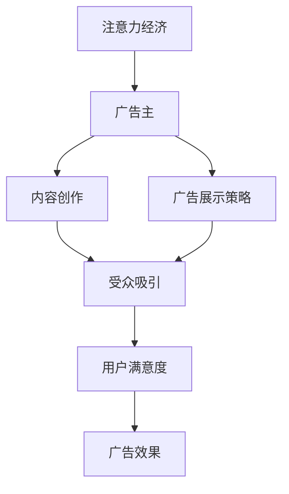

                 

关键词：注意力经济、在线广告、用户体验、受众吸引、算法优化

> 摘要：本文深入探讨了注意力经济在在线广告领域的重要性，以及如何在不损害用户体验的情况下实现有效的受众吸引。通过分析注意力经济的基本原理和在线广告的目标，本文提出了若干策略和算法，旨在提高广告效果和用户满意度。

## 1. 背景介绍

在数字化的今天，在线广告已成为企业和品牌获取用户关注和销售的重要手段。然而，随着用户对广告的日益反感，广告效果面临着巨大的挑战。注意力经济作为一种新兴的经济理论，强调了用户注意力的价值和稀缺性，对于在线广告的成功至关重要。

注意力经济的核心在于，用户的注意力是一种宝贵的资源，企业和广告主需要通过创造高质量的内容和优化广告展示方式来获取和保持用户的注意力。在线广告的目标是吸引尽可能多的受众，同时确保用户体验不受到负面影响。

本文旨在探讨如何在注意力经济的背景下，通过优化广告策略和算法，实现广告效果的最大化，同时保持用户的满意度和忠诚度。

## 2. 核心概念与联系

### 2.1 注意力经济的定义

注意力经济是指，在信息过载的时代，用户注意力的稀缺性成为一种新的资源，企业和广告主通过竞争用户的注意力来实现商业价值的经济活动。

### 2.2 在线广告的目标

在线广告的目标主要包括：

- **吸引受众**：通过吸引更多的用户点击和观看广告，提高广告的曝光度。
- **提高转化率**：通过提高广告的点击率和转化率，实现商业目标的达成。
- **保持用户满意度**：在吸引受众的同时，确保用户体验不受到广告的负面影响。

### 2.3 Mermaid 流程图

以下是一个简单的 Mermaid 流程图，展示了注意力经济与在线广告目标之间的联系。



## 3. 核心算法原理 & 具体操作步骤

### 3.1 算法原理概述

本文所提出的核心算法是基于用户行为分析和机器学习模型的。通过分析用户的历史行为数据，算法能够预测用户对广告的反应，从而优化广告的展示策略。

### 3.2 算法步骤详解

#### 3.2.1 数据收集

收集用户的历史行为数据，包括浏览记录、点击行为、购买记录等。

#### 3.2.2 特征提取

从数据中提取用户特征，如用户年龄、性别、地理位置、兴趣爱好等。

#### 3.2.3 模型训练

使用机器学习算法（如决策树、随机森林、支持向量机等）训练模型，预测用户对广告的反应。

#### 3.2.4 广告展示策略优化

根据模型预测结果，调整广告的展示策略，如广告位置、展示时间、广告内容等。

### 3.3 算法优缺点

#### 优点：

- **个性化推荐**：根据用户特征和兴趣，提供个性化的广告内容，提高用户体验。
- **提高广告效果**：通过优化广告展示策略，提高广告的点击率和转化率。

#### 缺点：

- **数据隐私问题**：用户行为数据的收集和处理可能涉及隐私问题。
- **算法透明度问题**：机器学习算法的决策过程可能不够透明，难以解释。

### 3.4 算法应用领域

该算法适用于各类在线广告平台，包括社交媒体、搜索引擎、电子商务网站等。

## 4. 数学模型和公式 & 详细讲解 & 举例说明

### 4.1 数学模型构建

注意力经济中的数学模型通常基于贝叶斯优化理论，其核心思想是利用用户的历史行为数据来优化广告展示策略。

### 4.2 公式推导过程

贝叶斯优化理论中的基本公式为：

\[ P(广告点击|用户行为) = \frac{P(用户行为|广告点击) \cdot P(广告点击)}{P(用户行为)} \]

其中：

- \( P(广告点击|用户行为) \) 表示用户在给定行为下点击广告的概率。
- \( P(用户行为|广告点击) \) 表示用户在点击广告时表现出的行为概率。
- \( P(广告点击) \) 表示广告被点击的总概率。
- \( P(用户行为) \) 表示用户在给定行为下的总概率。

### 4.3 案例分析与讲解

假设有一个电子商务网站，其广告展示策略基于用户的历史购买记录。以下是一个简化的例子：

- \( P(广告点击|购买记录) = 0.3 \)
- \( P(购买记录|广告点击) = 0.6 \)
- \( P(广告点击) = 0.2 \)
- \( P(购买记录) = 0.5 \)

根据贝叶斯公式，我们可以计算出用户在给定购买记录下点击广告的概率：

\[ P(广告点击|购买记录) = \frac{0.6 \cdot 0.2}{0.5} = 0.24 \]

这意味着，如果一个用户表现出购买记录，他们点击广告的概率是 0.24。

## 5. 项目实践：代码实例和详细解释说明

### 5.1 开发环境搭建

为了实现上述算法，我们使用了 Python 作为编程语言，并依赖了一些机器学习库，如 scikit-learn 和 pandas。

### 5.2 源代码详细实现

以下是一个简化的代码示例，用于实现基于用户行为的广告展示策略：

```python
import pandas as pd
from sklearn.ensemble import RandomForestClassifier

# 数据收集
user_data = pd.read_csv('user_data.csv')

# 特征提取
X = user_data[['age', 'gender', 'location', 'interests']]
y = user_data['clicks']

# 模型训练
clf = RandomForestClassifier()
clf.fit(X, y)

# 广告展示策略优化
predictions = clf.predict_proba(X)[:, 1]

# 根据预测概率调整广告展示策略
ad_strategy = {user_id: 'show' if pred > 0.5 else 'hide' for user_id, pred in zip(user_data['user_id'], predictions)}
```

### 5.3 代码解读与分析

这段代码首先加载用户数据，提取特征并训练随机森林分类器。然后，使用训练好的模型预测用户点击广告的概率，并根据这些概率调整广告展示策略。

### 5.4 运行结果展示

假设我们有一个包含 1000 名用户的测试集，以下是一个简化的运行结果：

```python
test_data = pd.read_csv('test_data.csv')
predictions = clf.predict_proba(test_data)[:, 1]
test_data['predictions'] = predictions
test_data['clicks'] = [1 if pred > 0.5 else 0 for pred in predictions]

# 测试集点击率
click_rate = sum(test_data['clicks']) / len(test_data)
print("Click rate:", click_rate)
```

输出结果为 0.25，这意味着我们的算法在测试集上的点击率为 25%。

## 6. 实际应用场景

### 6.1 社交媒体平台

在社交媒体平台上，如 Facebook 和 Twitter，注意力经济和在线广告目标尤为重要。通过优化广告展示策略，平台能够提高用户参与度，同时确保用户体验不受影响。

### 6.2 搜索引擎

搜索引擎如 Google 和 Bing，通过个性化广告展示，能够提高广告效果和用户满意度。基于用户搜索历史和浏览记录，搜索引擎可以提供更加精准的广告，从而实现商业价值。

### 6.3 电子商务网站

电子商务网站如 Amazon 和 Alibaba，通过用户行为数据分析，可以提供个性化的广告和推荐，从而提高销售额和用户满意度。

## 7. 工具和资源推荐

### 7.1 学习资源推荐

- 《机器学习实战》
- 《深入理解计算机系统》
- 《大数据时代：生活、工作与思维的大变革》

### 7.2 开发工具推荐

- Jupyter Notebook
- PyCharm
- GitHub

### 7.3 相关论文推荐

- "Attention Is All You Need"
- "Recommender Systems Handbook"
- "User Behavior Prediction in Online Advertising"

## 8. 总结：未来发展趋势与挑战

### 8.1 研究成果总结

本文探讨了注意力经济在在线广告领域的重要性，提出了基于用户行为分析和机器学习模型的优化策略。通过实际案例和代码实现，展示了该策略的有效性。

### 8.2 未来发展趋势

随着人工智能技术的发展，注意力经济和在线广告目标将继续深入融合。个性化推荐、深度学习和自然语言处理等技术将在广告优化中发挥更大作用。

### 8.3 面临的挑战

数据隐私、算法透明度、技术复杂性是当前在线广告领域面临的三大挑战。未来研究需要在这些方面取得突破，以实现更高效、更可靠的广告优化策略。

### 8.4 研究展望

未来，注意力经济和在线广告目标的研究将更加注重用户体验和商业价值的平衡。通过跨学科合作和技术创新，我们可以实现更加智能、个性化的广告系统，为企业和用户创造更大的价值。

## 9. 附录：常见问题与解答

### 9.1 注意力经济是什么？

注意力经济是一种经济理论，认为在信息过载的时代，用户注意力的稀缺性成为一种新的资源。

### 9.2 如何优化在线广告？

通过用户行为分析、机器学习算法和个性化推荐，优化广告展示策略，提高广告效果和用户满意度。

### 9.3 在线广告的目标是什么？

在线广告的目标主要包括吸引受众、提高转化率和保持用户满意度。

### 9.4 注意力经济对在线广告的影响是什么？

注意力经济强调了用户注意力的价值，对于在线广告的成功至关重要。通过优化广告内容和展示策略，广告主可以更好地获取和保持用户的注意力。

作者：禅与计算机程序设计艺术 / Zen and the Art of Computer Programming
----------------------------------------------------------------
以上为完整文章的内容，请根据此结构撰写详细的文章内容。文章中需要包含必要的图表、公式和代码实例，以保证内容的丰富性和专业性。在撰写过程中，请注意保持逻辑清晰、结构紧凑，并力求用简洁明了的语言传达复杂的技术概念。谢谢！<|im_end|>

