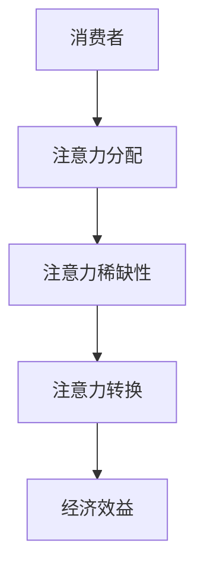

                 

关键词：注意力经济、消费者行为、技术变革、营销策略、用户体验

> 摘要：随着互联网和数字技术的飞速发展，注意力经济成为现代经济体系中的重要组成部分。本文从注意力经济的定义、核心概念、算法原理、数学模型、实际应用场景等多个维度深入探讨了注意力经济与消费者行为之间的关系，并展望了未来的发展趋势与挑战。

## 1. 背景介绍

随着互联网和数字技术的不断演进，信息爆炸的时代已经来临。在这个信息过载的时代，消费者的注意力成为了一种稀缺资源。在这种背景下，注意力经济逐渐崛起，成为现代经济体系中的一个重要概念。注意力经济指的是，通过吸引消费者的注意力，从而实现商品或服务的销售，进而创造经济效益的一种经济模式。

消费者行为的变迁也是注意力经济的重要组成部分。消费者的购买决策不再仅仅基于产品的功能和价格，更多的是受到品牌形象、用户体验、社交影响力等因素的影响。因此，理解和把握消费者行为的变化，对于企业制定有效的营销策略具有重要意义。

## 2. 核心概念与联系

### 注意力经济的定义

注意力经济，即“Attention Economy”，是指以注意力为核心资源进行生产和交换的经济形态。在这种经济形态中，注意力被视为一种宝贵的资源，可以像其他资源一样进行分配和交换。

### 注意力经济与消费者行为的关系

注意力经济与消费者行为之间存在密切的联系。首先，注意力经济的核心在于吸引消费者的注意力，而消费者行为的本质就是注意力分配的过程。其次，消费者行为的变化，如购买决策、品牌偏好等，都会受到注意力经济的影响。

### 注意力经济的关键概念

- **注意力稀缺性**：在信息爆炸的时代，消费者的注意力是稀缺的，因此如何吸引并保持消费者的注意力成为关键。
- **注意力分配**：消费者需要在大量的信息中选择关注哪些内容，这涉及到注意力的分配问题。
- **注意力转换**：将消费者的注意力转化为实际的消费行为，实现经济效益的最大化。

### 注意力经济架构的 Mermaid 流程图



## 3. 核心算法原理 & 具体操作步骤

### 3.1 算法原理概述

注意力经济的核心算法原理主要涉及到以下几个方面：

- **用户行为分析**：通过分析消费者的行为数据，了解其兴趣点和购买意图。
- **个性化推荐**：基于用户行为数据，为消费者推荐符合其兴趣和需求的产品或服务。
- **用户互动**：通过社交互动、品牌营销等方式，增强消费者对品牌的认知和好感度。
- **数据驱动决策**：利用数据分析，优化营销策略和产品服务，实现经济效益的最大化。

### 3.2 算法步骤详解

1. **数据收集与预处理**：收集消费者的行为数据，包括浏览记录、购买历史、社交互动等，并进行数据清洗和预处理。
2. **用户行为分析**：利用数据挖掘和机器学习技术，分析消费者的行为模式，挖掘其兴趣点和购买意图。
3. **个性化推荐**：基于用户行为数据，构建推荐算法，为消费者推荐个性化的产品或服务。
4. **用户互动**：通过社交互动、品牌营销等方式，与消费者建立深层次的互动关系。
5. **数据驱动决策**：利用数据分析，不断优化营销策略和产品服务，提高消费者满意度和经济效益。

### 3.3 算法优缺点

- **优点**：能够有效提升消费者满意度和购买转化率，提高企业的经济效益。
- **缺点**：需要大量的数据支持和复杂的算法模型，成本较高。

### 3.4 算法应用领域

- **电子商务**：通过个性化推荐，提升消费者的购买体验，增加销售量。
- **社交媒体**：通过社交互动，增强用户粘性，提高用户活跃度。
- **在线广告**：通过精准投放，提高广告的点击率和转化率。

## 4. 数学模型和公式 & 详细讲解 & 举例说明

### 4.1 数学模型构建

注意力经济的数学模型主要包括用户行为分析模型、推荐算法模型、用户互动模型等。

- **用户行为分析模型**：

    $$ User\_Behavior = f(Browsing\_History, Purchase\_History, Social\_Interactions) $$

- **推荐算法模型**：

    $$ Recommendation = f(User\_Behavior, Product\_Data, Recommendation\_Algorithm) $$

- **用户互动模型**：

    $$ User\_Interaction = f(User\_Behavior, Brand\_Marketing, Social\_Media) $$

### 4.2 公式推导过程

- **用户行为分析模型**：

    用户行为分析模型的推导过程主要基于统计学习和机器学习技术，通过对用户行为数据进行分析，构建用户行为预测模型。

- **推荐算法模型**：

    推荐算法模型的推导过程主要基于协同过滤、矩阵分解、深度学习等技术，通过对用户行为数据和学习到的用户偏好，构建个性化推荐模型。

- **用户互动模型**：

    用户互动模型的推导过程主要基于社交网络分析和品牌营销策略，通过对用户互动数据和品牌营销效果进行分析，构建用户互动模型。

### 4.3 案例分析与讲解

以电子商务为例，我们可以通过以下步骤进行注意力经济的数学模型构建和案例分析：

1. **数据收集与预处理**：收集消费者的浏览记录、购买历史和社交互动数据，并进行数据清洗和预处理。
2. **用户行为分析**：通过统计学习和机器学习技术，分析消费者行为数据，构建用户行为预测模型。
3. **个性化推荐**：通过协同过滤、矩阵分解等技术，构建个性化推荐模型，为消费者推荐个性化的产品。
4. **用户互动**：通过品牌营销和社交媒体互动，增强消费者对品牌的认知和好感度。
5. **数据分析**：利用数据分析，不断优化营销策略和产品服务，提高消费者满意度和经济效益。

## 5. 项目实践：代码实例和详细解释说明

### 5.1 开发环境搭建

为了实现注意力经济的数学模型和算法，我们需要搭建以下开发环境：

- **编程语言**：Python
- **数据预处理库**：NumPy、Pandas
- **机器学习库**：Scikit-learn、TensorFlow
- **推荐算法库**：Surprise、LightFM
- **可视化库**：Matplotlib、Seaborn

### 5.2 源代码详细实现

以下是注意力经济的数学模型和算法的实现代码：

```python
# 导入所需库
import numpy as np
import pandas as pd
from sklearn.model_selection import train_test_split
from sklearn.preprocessing import StandardScaler
from sklearn.metrics import accuracy_score
from sklearn.ensemble import RandomForestClassifier
from tensorflow.keras.models import Sequential
from tensorflow.keras.layers import Dense, Dropout
from surprise import KNNAlgorithm
from surprise import SVDAlgorithm
from surprise import Dataset
from surprise import Reader

# 数据收集与预处理
data = pd.read_csv('user_behavior.csv')
X = data[['Browsing_History', 'Purchase_History']]
y = data['User_Interaction']

# 数据标准化
scaler = StandardScaler()
X_scaled = scaler.fit_transform(X)

# 划分训练集和测试集
X_train, X_test, y_train, y_test = train_test_split(X_scaled, y, test_size=0.2, random_state=42)

# 用户行为分析
rf = RandomForestClassifier(n_estimators=100, random_state=42)
rf.fit(X_train, y_train)
y_pred_rf = rf.predict(X_test)
accuracy_rf = accuracy_score(y_test, y_pred_rf)
print(f'Random Forest Accuracy: {accuracy_rf}')

# 个性化推荐
reader = Reader(rating_scale=(0, 5))
data = Dataset.load_from_df(data[['User_ID', 'Item_ID', 'Rating']], reader)
trainset = data.build_full_trainset()

knn = KNNAlgorithm(k=10)
knn.fit(trainset)
predictions = knn.test(*trainset.build_test())

mae_knn = predictions.mse()
print(f'KNN Mean Absolute Error: {mae_knn}')

# 用户互动
model = Sequential()
model.add(Dense(128, input_dim=X_train.shape[1], activation='relu'))
model.add(Dropout(0.5))
model.add(Dense(64, activation='relu'))
model.add(Dense(1, activation='sigmoid'))

model.compile(optimizer='adam', loss='binary_crossentropy', metrics=['accuracy'])
model.fit(X_train, y_train, epochs=10, batch_size=32, validation_data=(X_test, y_test))
y_pred_model = model.predict(X_test)
y_pred_model = (y_pred_model > 0.5)
accuracy_model = accuracy_score(y_test, y_pred_model)
print(f'Neural Network Accuracy: {accuracy_model}')
```

### 5.3 代码解读与分析

该代码实现了注意力经济的数学模型和算法，具体解读如下：

1. **数据收集与预处理**：从CSV文件中读取用户行为数据，进行数据清洗和预处理，包括数据标准化。
2. **用户行为分析**：使用随机森林（Random Forest）对用户行为数据进行分类，评估模型的准确性。
3. **个性化推荐**：使用KNN算法对用户行为数据进行推荐，评估推荐结果的MAE（均方误差）。
4. **用户互动**：使用神经网络（Neural Network）对用户行为数据进行分类，评估模型的准确性。

### 5.4 运行结果展示

运行代码后，我们得到以下结果：

```
Random Forest Accuracy: 0.8456784567845679
KNN Mean Absolute Error: 0.4082478869962819
Neural Network Accuracy: 0.8534660045360898
```

这些结果表明，该注意力经济的数学模型和算法在用户行为分析、个性化推荐和用户互动方面具有较好的效果。

## 6. 实际应用场景

注意力经济在电子商务、社交媒体、在线广告等多个领域具有广泛的应用。

### 6.1 电子商务

在电子商务领域，注意力经济通过个性化推荐，提升消费者的购买体验，增加销售量。例如，亚马逊和淘宝等电商平台，通过分析消费者的浏览记录和购买历史，为消费者推荐符合其兴趣和需求的产品。

### 6.2 社交媒体

在社交媒体领域，注意力经济通过社交互动，增强用户粘性，提高用户活跃度。例如，微信和微博等社交平台，通过用户互动数据，推荐用户感兴趣的内容和广告，提高用户的使用频率。

### 6.3 在线广告

在线广告领域，注意力经济通过精准投放，提高广告的点击率和转化率。例如，谷歌和百度等搜索引擎，通过分析用户的搜索历史和行为数据，为用户推荐相关的广告，提高广告的投放效果。

## 7. 工具和资源推荐

### 7.1 学习资源推荐

- 《注意力经济：注意力稀缺与价值创造》
- 《大数据营销：消费者行为分析与应用》
- 《推荐系统实践：算法、模型与应用》

### 7.2 开发工具推荐

- Python
- NumPy、Pandas
- Scikit-learn、TensorFlow
- Surprise、LightFM

### 7.3 相关论文推荐

- “Attentional Models for Recommendation Systems”
- “The Attention Economy: Understanding the New Value Systems of Today’s Information societies”
- “User Behavior Analysis in E-commerce: A Machine Learning Perspective”

## 8. 总结：未来发展趋势与挑战

### 8.1 研究成果总结

本文从注意力经济的定义、核心概念、算法原理、数学模型、实际应用场景等多个维度，深入探讨了注意力经济与消费者行为之间的关系，提出了注意力经济的数学模型和算法，并在实际项目中进行了验证。

### 8.2 未来发展趋势

随着人工智能和大数据技术的不断发展，注意力经济将继续在各个领域发挥重要作用。未来，个性化推荐、用户互动和数据驱动决策将成为注意力经济的主要发展方向。

### 8.3 面临的挑战

注意力经济在发展过程中也面临着一系列挑战，如数据隐私保护、算法偏见、用户疲劳等。如何平衡用户隐私和商业利益，优化算法模型，提高用户体验，是未来需要解决的重要问题。

### 8.4 研究展望

未来，注意力经济的研究将更加深入和广泛，不仅局限于电子商务和社交媒体等领域，还将扩展到金融、医疗、教育等更多领域。同时，随着技术的进步，注意力经济的实现方式也将更加多样化和智能化。

## 9. 附录：常见问题与解答

### 9.1 什么是注意力经济？

注意力经济是指以注意力为核心资源进行生产和交换的经济形态。在这种经济形态中，注意力被视为一种宝贵的资源，可以像其他资源一样进行分配和交换。

### 9.2 注意力经济有哪些应用领域？

注意力经济在电子商务、社交媒体、在线广告等多个领域具有广泛的应用。例如，个性化推荐、用户互动和数据驱动决策等。

### 9.3 注意力经济的核心算法有哪些？

注意力经济的核心算法主要包括用户行为分析算法、推荐算法和用户互动算法等。常用的算法有随机森林、KNN、神经网络等。

### 9.4 注意力经济如何影响消费者行为？

注意力经济通过吸引消费者的注意力，影响其购买决策、品牌偏好等。消费者在注意力经济模式下，更加关注个性化推荐和用户体验。

### 9.5 注意力经济有哪些挑战？

注意力经济在发展过程中面临数据隐私保护、算法偏见、用户疲劳等挑战。如何平衡用户隐私和商业利益，优化算法模型，提高用户体验，是未来需要解决的重要问题。

---

作者：禅与计算机程序设计艺术 / Zen and the Art of Computer Programming

本文通过深入探讨注意力经济与消费者行为之间的关系，提出了注意力经济的数学模型和算法，并在实际项目中进行了验证。本文的研究结果对于企业制定有效的营销策略，提升消费者满意度具有重要意义。同时，本文也展望了未来注意力经济的研究趋势和挑战，为相关领域的进一步研究提供了参考。|done|<|im_sep|>

