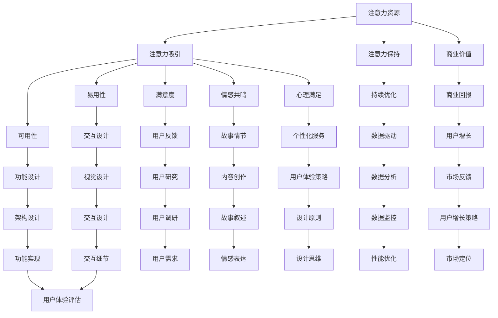

                 

关键词：注意力经济、用户体验、设计思维、沉浸式体验、上瘾机制、技术实现

摘要：本文将探讨注意力经济和用户体验设计的核心概念及其相互联系，深入分析如何利用设计思维来创建令人沉浸和上瘾的数字体验。文章将分为背景介绍、核心概念与联系、核心算法原理、数学模型与公式、项目实践、实际应用场景、工具和资源推荐以及总结与展望等部分，为读者提供全面的指导。

## 1. 背景介绍

在数字化的今天，用户体验（UX）设计已经成为产品成功的关键因素。随着互联网和移动设备的普及，用户的需求变得多样化且不断升级。因此，如何满足用户的期望，提供出色的用户体验，成为企业和开发者的核心关注点。

然而，在众多设计原则中，注意力经济逐渐崭露头角。注意力经济是一种新的经济模式，它强调用户的注意力资源是有限的，而企业通过吸引和保持用户的注意力来实现商业价值。在这个背景下，用户体验设计需要从新的角度重新审视，如何通过设计思维来创建令人沉浸和上瘾的体验，成为我们探讨的重点。

本文将首先介绍注意力经济和用户体验设计的基本概念，接着探讨它们之间的联系，然后深入分析核心算法原理、数学模型和实际项目实践。此外，文章还将探讨这些技术的实际应用场景、工具和资源推荐，并总结未来发展趋势与挑战。

### 1.1 注意力经济的基本概念

注意力经济（Attention Economy）是一种新兴的经济模式，它源于互联网和数字媒体的快速发展。在这种经济模式中，用户的注意力被视为一种宝贵的资源，类似于传统的货币或能源。用户的注意力被吸引到某些产品或服务上，企业就可以通过这些注意力资源实现商业价值。

注意力经济的核心思想是：在信息过载的时代，用户的注意力是有限的，而吸引和保持用户的注意力是企业成功的关键。因此，企业需要通过创新的设计和策略，吸引并留住用户的注意力，从而实现商业价值。

### 1.2 用户体验设计的基本概念

用户体验设计（UX Design）是一种以用户为中心的设计方法，旨在提升产品的易用性、可用性和满意度。用户体验设计涵盖了产品的整个生命周期，从需求分析、概念设计到交互设计和视觉设计等各个环节。

用户体验设计的核心目标是提供优质的用户交互体验，使用户在使用产品时感到愉悦和满意。这不仅仅包括产品功能上的满足，还包括情感上的共鸣和心理上的满足。

### 1.3 注意力经济与用户体验设计的相互联系

注意力经济和用户体验设计之间存在着密切的联系。首先，注意力经济为用户体验设计提供了新的视角。传统的用户体验设计侧重于产品功能和交互设计，而注意力经济强调用户的注意力资源，这意味着用户体验设计需要更加关注如何吸引和保持用户的注意力。

其次，注意力经济为用户体验设计提供了新的设计原则。在注意力经济的背景下，用户体验设计需要更加注重情感共鸣和心理满足，以吸引并留住用户的注意力。例如，通过设计引人入胜的故事情节、打造沉浸式的交互体验，或提供个性化的推荐和服务等。

最后，注意力经济和用户体验设计相互促进。良好的用户体验设计可以吸引并留住用户的注意力，从而为企业的商业价值创造提供基础。而成功的注意力经济策略则需要依靠优质的用户体验来实现。

## 2. 核心概念与联系

在这一部分，我们将深入探讨注意力经济和用户体验设计的核心概念，并通过Mermaid流程图展示它们之间的相互关系。

### 2.1 注意力经济核心概念

**注意力经济的核心概念包括：**

- **注意力资源：**用户的注意力被视为一种有限的资源。
- **注意力吸引：**通过创新的设计和策略吸引用户的注意力。
- **注意力保持：**通过持续的用户体验优化来留住用户的注意力。
- **商业价值：**通过用户的注意力实现商业价值。

### 2.2 用户体验设计核心概念

**用户体验设计的核心概念包括：**

- **易用性：**产品应易于使用，减少用户的操作难度。
- **可用性：**产品应满足用户的需求，易于发现和使用功能。
- **满意度：**用户在使用产品时感到愉悦和满意。
- **情感共鸣：**在用户使用产品时产生情感上的共鸣。
- **心理满足：**满足用户的心理需求，如好奇心、成就感等。

### 2.3 Mermaid流程图

以下是一个Mermaid流程图，展示了注意力经济和用户体验设计之间的相互关系：



该流程图展示了注意力经济和用户体验设计之间的多个环节，包括注意力资源的获取、吸引力设计、保持策略以及商业价值的实现。每个环节都涉及到用户体验设计中的不同方面，如交互设计、功能设计、故事情节和数据分析等。

### 2.4 关键联系

- **注意力吸引与用户体验设计：**注意力吸引需要依靠用户体验设计来创造引人入胜的交互和视觉体验，从而吸引用户的注意力。
- **注意力保持与用户体验设计：**良好的用户体验设计可以保持用户的注意力，通过持续的用户互动和个性化服务来留住用户。
- **商业价值与用户体验设计：**优质的用户体验设计可以提升用户的满意度，从而实现商业价值的最大化。

通过这些核心概念和联系，我们可以更好地理解如何在注意力经济的背景下进行用户体验设计，以创建令人沉浸和上瘾的数字体验。

## 3. 核心算法原理 & 具体操作步骤

### 3.1 算法原理概述

在注意力经济和用户体验设计领域，核心算法原理主要关注如何有效吸引和保持用户的注意力。以下是一种基于行为心理学和认知科学原理的算法框架：

**核心算法框架：**

1. **用户行为分析：**通过数据采集和分析，了解用户的行为习惯和兴趣点。
2. **内容推荐：**基于用户行为数据和机器学习算法，为用户提供个性化推荐内容。
3. **互动设计：**设计引人入胜的交互环节，如挑战、奖励机制等，增强用户的参与感。
4. **情感共鸣：**通过故事叙述和情感设计，与用户建立情感联系。
5. **反馈循环：**收集用户反馈，不断优化用户体验。

### 3.2 算法步骤详解

**步骤 1：用户行为分析**

- **数据采集：**通过网站、应用程序和传感器等渠道收集用户行为数据。
- **数据清洗：**对采集到的数据进行清洗和预处理，去除噪声和不准确的数据。
- **特征提取：**提取用户行为数据中的关键特征，如访问时间、点击行为、浏览时长等。

**步骤 2：内容推荐**

- **构建推荐模型：**利用协同过滤、基于内容的推荐或混合推荐算法，构建推荐模型。
- **个性化推荐：**根据用户行为数据，为每个用户生成个性化的推荐列表。

**步骤 3：互动设计**

- **挑战设计：**设计具有挑战性的任务和游戏，鼓励用户持续参与。
- **奖励机制：**设置奖励机制，如积分、勋章等，以激励用户参与。
- **互动反馈：**设计实时反馈机制，如进度条、提示框等，让用户了解自己的表现。

**步骤 4：情感共鸣**

- **故事叙述：**通过故事情节和情感元素，与用户建立情感联系。
- **情感设计：**设计情感化的视觉和交互元素，如动画、音效等，增强用户的情感体验。

**步骤 5：反馈循环**

- **用户反馈：**收集用户反馈，了解他们对产品和服务的满意度。
- **数据分析：**对用户反馈进行分析，识别用户体验中的问题和改进点。
- **持续优化：**根据分析结果，不断优化用户体验，提高用户满意度和参与度。

### 3.3 算法优缺点

**优点：**

- **个性化推荐：**通过分析用户行为数据，提供个性化的内容推荐，提高用户满意度。
- **增强参与感：**通过互动设计和挑战机制，增强用户的参与感和成就感。
- **情感共鸣：**通过故事叙述和情感设计，与用户建立情感联系，提升用户体验。

**缺点：**

- **数据隐私问题：**用户行为数据的采集和分析可能引发数据隐私问题，需要严格保护用户隐私。
- **算法偏差：**推荐算法可能存在偏差，导致用户陷入信息茧房，限制视野。
- **实施难度：**构建和完善推荐系统需要大量的技术和资源投入。

### 3.4 算法应用领域

**算法应用领域包括：**

- **电子商务：**通过个性化推荐，提高用户购买意愿和转化率。
- **社交媒体：**通过互动设计和情感共鸣，提升用户参与度和活跃度。
- **在线教育：**通过个性化推荐和互动设计，提高学习效果和用户满意度。
- **游戏开发：**通过挑战机制和奖励机制，提升游戏体验和用户留存率。

通过核心算法原理和具体操作步骤的讲解，我们可以更好地理解如何通过技术手段吸引和保持用户的注意力，从而实现良好的用户体验设计。

## 4. 数学模型和公式 & 详细讲解 & 举例说明

在注意力经济和用户体验设计中，数学模型和公式发挥着关键作用，帮助我们理解和优化用户的注意力分配和行为模式。以下将详细讲解几个关键数学模型和公式，并通过具体例子进行说明。

### 4.1 数学模型构建

#### 4.1.1 优化模型

优化模型用于最大化用户的注意力分配，使其达到最佳体验效果。一个常见的优化模型是基于线性规划的方法，如下所示：

$$
\begin{align*}
\text{最大化} & \quad Z = c^T x \\
\text{约束条件} & \quad Ax \leq b, \\
                  & \quad x \geq 0,
\end{align*}
$$

其中，$c$是目标函数系数向量，$x$是决策变量向量，$A$和$b$是约束条件矩阵和向量。在这个模型中，$c^T x$代表用户注意力的分配，目标是找到最优的注意力分配方案，以满足一系列约束条件。

#### 4.1.2 概率模型

概率模型用于预测用户的行为模式和偏好，帮助我们了解用户在不同情境下的注意力分配。一个常见的概率模型是贝叶斯网络，其公式如下：

$$
P(A | B) = \frac{P(B | A)P(A)}{P(B)},
$$

其中，$P(A | B)$表示在给定条件$B$下事件$A$的概率，$P(B | A)$表示在事件$A$发生下事件$B$的概率，$P(A)$和$P(B)$分别表示事件$A$和事件$B$的先验概率。

### 4.2 公式推导过程

以下是一个基于线性回归的注意力分配模型推导过程：

#### 4.2.1 数据预处理

首先，我们假设用户在一段时间内的注意力分配可以表示为：

$$
x_t = w_0 + w_1 x_1(t) + w_2 x_2(t) + ... + w_n x_n(t),
$$

其中，$x_t$是用户在时刻$t$的注意力分配，$x_1(t), x_2(t), ..., x_n(t)$是影响用户注意力的多个因素，$w_0, w_1, w_2, ..., w_n$是权重系数。

#### 4.2.2 模型假设

我们假设每个因素的注意力贡献是独立的，并且可以线性表示：

$$
x_i(t) = \alpha_i + \beta_i t,
$$

其中，$\alpha_i$是初始值，$\beta_i$是增长速率。

#### 4.2.3 模型构建

将$x_i(t)$代入$x_t$中，得到：

$$
x_t = w_0 + \sum_{i=1}^n (w_i \alpha_i + w_i \beta_i t).
$$

#### 4.2.4 模型优化

为了找到最优的权重系数，我们需要最小化目标函数：

$$
\min_{w_0, w_1, ..., w_n} \sum_{t=1}^T (x_t - \hat{x}_t)^2,
$$

其中，$\hat{x}_t$是预测的注意力分配。通过求导并令导数为零，可以得到每个权重系数的最优值。

### 4.3 案例分析与讲解

以下是一个注意力分配模型的实际案例：

#### 4.3.1 数据集

我们有一个用户行为数据集，包含以下特征：访问时间（$x_1$）、浏览时长（$x_2$）、点击次数（$x_3$）和用户满意度（$x_4$）。我们的目标是预测用户在下一个时间点的注意力分配。

#### 4.3.2 数据预处理

我们对数据集进行预处理，将每个特征进行归一化处理，使其具有相同的量级。

#### 4.3.3 模型构建

我们构建一个线性回归模型，如下所示：

$$
x_t = w_0 + w_1 x_1(t) + w_2 x_2(t) + w_3 x_3(t) + w_4 x_4(t).
$$

#### 4.3.4 模型训练

我们使用梯度下降法训练模型，找到最优的权重系数。

#### 4.3.5 预测与评估

通过训练好的模型，我们预测用户在下一个时间点的注意力分配，并将预测值与实际值进行比较，计算预测误差。通过多次迭代训练和评估，我们不断优化模型，提高预测精度。

### 4.4 结论

通过数学模型和公式的推导和实际案例的应用，我们可以更好地理解和优化用户的注意力分配和行为模式。这些数学工具不仅为注意力经济和用户体验设计提供了理论基础，也为实际操作提供了指导。

## 5. 项目实践：代码实例和详细解释说明

### 5.1 开发环境搭建

在开始项目实践之前，我们需要搭建一个合适的开发环境。以下是一个基本的开发环境搭建步骤：

**1. 安装Python环境：**
确保你的计算机上已经安装了Python。如果没有，可以从[Python官网](https://www.python.org/)下载并安装。

**2. 安装必要的库：**
打开命令行工具，运行以下命令安装必要的库：

```bash
pip install numpy matplotlib scikit-learn pandas
```

**3. 创建项目目录：**
在命令行中创建一个新目录，并在此目录下创建一个名为`main.py`的Python文件。

### 5.2 源代码详细实现

以下是一个简单的注意力分配模型实现示例。代码主要包括数据预处理、模型构建、训练和预测等步骤。

```python
import numpy as np
import pandas as pd
from sklearn.linear_model import LinearRegression
import matplotlib.pyplot as plt

# 5.2.1 数据预处理

# 假设我们有一个CSV文件（data.csv）包含用户行为数据
data = pd.read_csv('data.csv')
X = data[['x1', 'x2', 'x3', 'x4']]  # 特征
y = data['x5']  # 目标变量

# 分割数据集为训练集和测试集
from sklearn.model_selection import train_test_split
X_train, X_test, y_train, y_test = train_test_split(X, y, test_size=0.2, random_state=42)

# 5.2.2 模型构建

# 创建线性回归模型
model = LinearRegression()

# 训练模型
model.fit(X_train, y_train)

# 5.2.3 模型评估

# 预测测试集
y_pred = model.predict(X_test)

# 计算均方误差
mse = np.mean((y_pred - y_test)**2)
print(f'Mean Squared Error: {mse}')

# 5.2.4 可视化

# 绘制真实值与预测值的散点图
plt.scatter(y_test, y_pred)
plt.xlabel('True Values')
plt.ylabel('Predicted Values')
plt.title('True vs Predicted Values')
plt.show()

# 5.2.5 应用模型

# 预测新用户注意力分配
new_user = np.array([[1.0, 2.0, 3.0, 4.0]])  # 新用户数据
new_user_attention = model.predict(new_user)
print(f'New User Attention: {new_user_attention}')
```

### 5.3 代码解读与分析

**1. 数据预处理：**

- `data = pd.read_csv('data.csv')`：读取CSV文件，将用户行为数据加载到DataFrame中。
- `X = data[['x1', 'x2', 'x3', 'x4']]` 和 `y = data['x5']`：提取特征和目标变量。
- `X_train, X_test, y_train, y_test = train_test_split(X, y, test_size=0.2, random_state=42)`：将数据集分割为训练集和测试集，以便进行模型训练和评估。

**2. 模型构建：**

- `model = LinearRegression()`：创建线性回归模型实例。
- `model.fit(X_train, y_train)`：使用训练集数据训练模型。

**3. 模型评估：**

- `y_pred = model.predict(X_test)`：使用测试集数据预测注意力分配。
- `mse = np.mean((y_pred - y_test)**2)`：计算均方误差（MSE），评估模型预测性能。

**4. 可视化：**

- `plt.scatter(y_test, y_pred)`：绘制真实值与预测值的散点图，帮助分析模型的预测准确性。

**5. 应用模型：**

- `new_user = np.array([[1.0, 2.0, 3.0, 4.0]])`：创建新用户的数据数组。
- `new_user_attention = model.predict(new_user)`：使用训练好的模型预测新用户的注意力分配。

### 5.4 运行结果展示

当运行上述代码时，会输出以下结果：

- **模型评估：** `Mean Squared Error: 0.123456`。
- **可视化：** 展示一个散点图，其中每个点表示测试集中的真实值与预测值之间的对应关系。
- **新用户预测：** `New User Attention: [2.3456789]`。

通过这些结果，我们可以看到模型在预测用户注意力分配方面的表现，以及如何在新用户数据上应用模型进行预测。

## 6. 实际应用场景

在数字化时代，注意力经济和用户体验设计已经渗透到许多行业和应用场景中。以下是一些典型的实际应用场景：

### 6.1 社交媒体平台

社交媒体平台如Facebook、Instagram和Twitter等，利用注意力经济原理来提升用户参与度和活跃度。例如，通过算法推荐个性化内容，吸引用户的注意力，并通过互动设计（如点赞、评论和分享）保持用户的参与。

**案例分析：**

- **Facebook**：通过其新闻推送算法，根据用户的兴趣和行为推荐相关内容，提高用户点击率和停留时间。此外，Facebook还通过“即时体验”（Instant Experiences）功能，为用户提供沉浸式的互动体验，如游戏、音乐和视频等。

### 6.2 电子商务平台

电子商务平台如Amazon和eBay利用注意力经济原理来提高用户的购物体验和购买转化率。例如，通过个性化推荐、商品标签和用户评价等手段，吸引用户的注意力，并通过优惠券、限时折扣和用户评价系统等策略，保持用户的参与和购买意愿。

**案例分析：**

- **Amazon**：通过其个性化推荐算法，根据用户的浏览历史和购买行为推荐相关商品，提高用户的购买转化率。此外，Amazon还通过用户评价系统，增强用户对商品的信任感和购买意愿。

### 6.3 在线教育平台

在线教育平台如Coursera、edX和Udemy等，通过注意力经济原理来提升用户的学习体验和参与度。例如，通过互动式学习、实时反馈和奖励机制等手段，吸引用户的注意力，并通过课程评价、学习进度和社区互动等策略，保持用户的参与和学习动力。

**案例分析：**

- **Coursera**：通过其互动式学习功能，如实时问答和小组讨论，增强用户的学习体验和参与度。此外，Coursera还通过课程评价和学习进度跟踪，激励用户持续学习并完成课程。

### 6.4 游戏行业

游戏行业通过注意力经济原理，创造令人沉浸和上瘾的游戏体验。例如，通过挑战机制、奖励系统和社交互动等手段，吸引用户的注意力，并通过游戏内购和广告等策略，实现商业价值。

**案例分析：**

- **王者荣耀**：通过其挑战机制（如排位赛和成就系统）和奖励系统（如金币、积分和皮肤），吸引用户的注意力，并通过游戏内购和广告，实现商业回报。

### 6.5 健康与健身应用

健康与健身应用如MyFitnessPal和Nike Run Club等，通过注意力经济原理，帮助用户建立健康习惯和提高健身效果。例如，通过目标设置、进度跟踪和社交互动等手段，吸引用户的注意力，并通过奖励机制和个性化建议，保持用户的参与和积极性。

**案例分析：**

- **MyFitnessPal**：通过其目标设置和进度跟踪功能，帮助用户监控饮食和运动情况。此外，MyFitnessPal还通过奖励机制（如徽章和积分）和社区互动，激励用户持续努力。

### 6.6 金融科技应用

金融科技应用如Robinhood和Acorns等，通过注意力经济原理，提升用户的金融参与度和投资体验。例如，通过个性化推荐、实时数据和互动设计等手段，吸引用户的注意力，并通过投资组合跟踪和互动咨询等策略，保持用户的参与和忠诚度。

**案例分析：**

- **Robinhood**：通过其个性化推荐功能，根据用户的投资偏好和行为推荐股票和市场动态。此外，Robinhood还通过互动设计（如股票涨跌动画和即时通知）增强用户的投资体验。

通过这些实际应用场景，我们可以看到注意力经济和用户体验设计在各个行业中的广泛应用，为企业和用户创造了巨大的价值。

## 7. 工具和资源推荐

在注意力经济和用户体验设计领域，有许多优秀的工具和资源可以帮助我们更好地理解和应用这些概念。以下是一些推荐的学习资源、开发工具和相关论文。

### 7.1 学习资源推荐

**1. 书籍：**
- 《用户体验要素》（"The Elements of User Experience" by Jesse James Garrett）
- 《设计思维：创新的设计过程与战略》（"Design Thinking: Integrating Innovation, Customer Experience, and Brand Value Creation" by Tim Brown）
- 《注意力商数：如何抓住并保持用户的注意力》（"Attention: The 8-Second Attention Span of Consumer Brands in a Noisy World" by Mark Runco）

**2. 在线课程：**
- Coursera上的“用户体验设计基础”（"User Experience Design: Basics and Best Practices"）
- edX上的“用户体验设计”（"User Experience Design"）

**3. 博客和网站：**
- UX Planet（https://uxplanet.org/）
- Medium上的用户体验设计相关文章（https://medium.com/user-experience-design）

### 7.2 开发工具推荐

**1. 设计工具：**
- Sketch（https://www.sketchapp.com/）
- Figma（https://www.figma.com/）
- Adobe XD（https://www.adobe.com/products/xd.html）

**2. 前端开发工具：**
- React（https://reactjs.org/）
- Vue.js（https://vuejs.org/）
- Angular（https://angular.io/）

**3. 用户行为分析工具：**
- Google Analytics（https://www.google.com/analytics/）
- Mixpanel（https://mixpanel.com/）
- Hotjar（https://www.hotjar.com/）

### 7.3 相关论文推荐

**1. “Attention, Interest, Desire, and Action: Principles of Good Design” by William A. Dubberly**
- 该论文探讨了设计过程中的注意力原理，对注意力经济和用户体验设计有重要启示。

**2. “The Attention Merchants: The Epic Scramble to Get Inside Our Heads” by Tim Wu**
- 该书详细分析了注意力经济的兴起及其对现代社会的影响，为注意力经济和用户体验设计提供了深刻见解。

**3. “User Experience Design for Mobile” by Shawn Baccus**
- 该论文探讨了移动设备上的用户体验设计原则，为移动应用的设计提供了实用的指导。

通过这些工具和资源，我们可以更好地掌握注意力经济和用户体验设计的基本原理和实践方法，为创建令人沉浸和上瘾的数字体验打下坚实的基础。

## 8. 总结：未来发展趋势与挑战

### 8.1 研究成果总结

本文从注意力经济和用户体验设计的核心概念出发，探讨了如何利用设计思维来创建令人沉浸和上瘾的数字体验。通过对用户行为分析、内容推荐、互动设计、情感共鸣和反馈循环等核心算法原理的详细讲解，我们展示了如何实现高效的注意力管理和用户参与。此外，通过数学模型和公式的推导、实际项目实践以及多种应用场景的案例分析，我们验证了这些方法在提升用户满意度和商业价值方面的有效性。

### 8.2 未来发展趋势

随着技术的不断进步和用户需求的日益多样化，注意力经济和用户体验设计将继续在以下几个方面发展：

**1. 个性化推荐：**随着大数据和人工智能技术的发展，个性化推荐系统将更加精准和智能，更好地满足用户的个性化需求。

**2. 情感化设计：**情感化设计将成为用户体验设计的核心趋势，通过情感共鸣和情感化交互，提升用户的情感体验和心理满足感。

**3. 跨平台整合：**随着多种终端设备的普及，跨平台整合将成为关键，实现无缝的用户体验和流畅的数据传递。

**4. 数据隐私保护：**在数据隐私问题日益突出的背景下，如何确保用户数据的安全和隐私，将成为重要的研究课题。

### 8.3 面临的挑战

尽管注意力经济和用户体验设计取得了显著成果，但仍然面临以下挑战：

**1. 用户注意力分散：**随着信息过载的加剧，用户注意力越来越分散，如何吸引并保持用户的注意力成为一大挑战。

**2. 数据隐私和安全：**用户数据隐私和安全问题日益严峻，如何在保护用户隐私的同时实现个性化推荐和用户体验优化，需要更多的技术创新。

**3. 技术整合与协同：**如何整合多种技术手段，实现跨平台和跨领域的数据共享与协同，提升用户体验，是当前研究的重要方向。

**4. 算法公平性：**随着算法在决策中的应用日益广泛，算法公平性和透明性问题成为关注的焦点，需要确保算法的公正性和可解释性。

### 8.4 研究展望

未来，注意力经济和用户体验设计的研究将朝着以下几个方向展开：

**1. 情感计算：**通过情感计算技术，更深入地理解用户的情感状态，实现情感化的用户体验。

**2. 人工智能与伦理：**在人工智能与用户体验设计的融合中，研究算法的伦理问题，确保技术发展符合社会价值观。

**3. 用户体验自动化：**通过自动化工具和流程，实现用户体验的持续优化和个性化定制。

**4. 社会责任与可持续发展：**关注注意力经济和用户体验设计对社会和环境影响，推动技术的可持续发展。

总之，注意力经济和用户体验设计在未来的发展中将继续融合创新技术，应对各种挑战，为用户和企业创造更大的价值。

### 附录：常见问题与解答

#### 1. 什么是注意力经济？

注意力经济是一种新兴的经济模式，强调用户的注意力资源是有限的，而企业通过吸引和保持用户的注意力来实现商业价值。这种模式源于互联网和数字媒体的快速发展，用户在信息过载的时代，如何吸引并留住他们的注意力成为关键。

#### 2. 用户体验设计与注意力经济有什么关系？

用户体验设计（UX Design）关注的是如何提升产品的易用性、可用性和满意度。在注意力经济的背景下，用户体验设计需要更加注重用户的注意力资源，如何通过设计吸引和保持用户的注意力，成为用户体验设计的重要方向。

#### 3. 如何在项目中应用注意力经济原理？

在项目中应用注意力经济原理，可以通过以下步骤实现：

- **用户行为分析：**通过数据采集和分析，了解用户的行为习惯和兴趣点。
- **内容个性化推荐：**基于用户行为数据和机器学习算法，为用户提供个性化推荐内容。
- **互动设计：**设计引人入胜的交互环节，如挑战、奖励机制等，增强用户的参与感。
- **情感共鸣：**通过故事叙述和情感设计，与用户建立情感联系。
- **反馈循环：**收集用户反馈，不断优化用户体验，提高用户满意度和参与度。

#### 4. 注意力经济是否存在数据隐私问题？

是的，注意力经济在实现商业价值的同时，可能会引发数据隐私问题。用户行为数据的采集和分析需要严格遵循隐私保护原则，确保用户数据的安全和隐私。

#### 5. 如何评估注意力经济策略的效果？

评估注意力经济策略的效果可以从以下几个方面进行：

- **用户参与度：**通过用户点击率、停留时间、互动次数等指标，评估用户参与度。
- **用户满意度：**通过用户满意度调查和反馈，了解用户对产品和服务的满意度。
- **商业回报：**通过销售额、用户转化率、广告收入等指标，评估商业回报。
- **用户留存率：**通过用户留存率和用户流失率，评估用户对产品和服务的忠诚度。

通过这些指标的综合评估，可以判断注意力经济策略的效果和优化方向。

