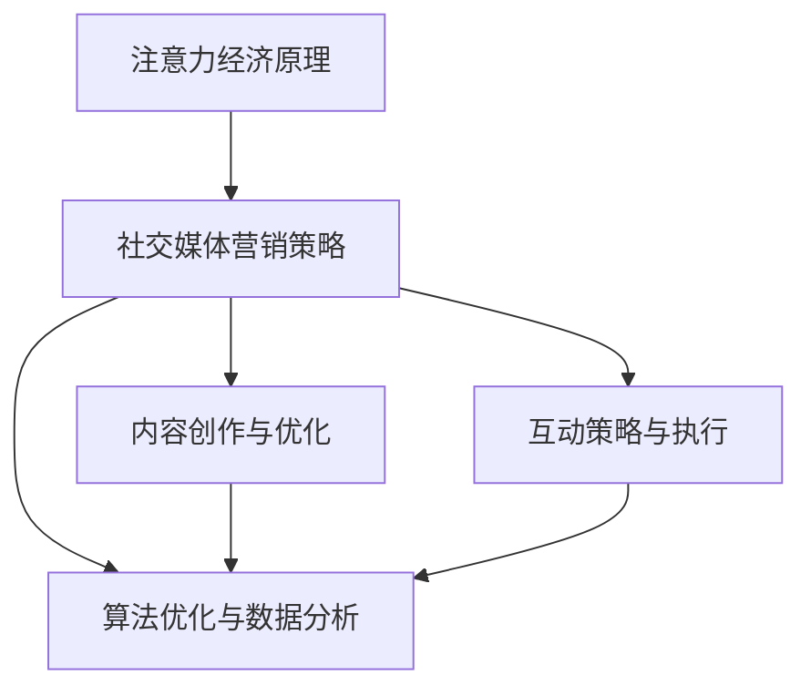

                 

关键词：注意力经济、社交媒体营销、用户体验、受众吸引

> 摘要：本文深入探讨了注意力经济在社交媒体营销中的应用，通过分析其核心概念与联系，提出了一系列最佳实践。文章旨在帮助营销从业者在不牺牲用户体验的前提下，有效地吸引和保持受众的关注。

## 1. 背景介绍

### 注意力经济的起源与发展

注意力经济这一概念最早由美国经济学家理查德·塞勒（Richard Thaler）在其著作《怪诞行为学》中提出。他描述了一个现象：人们的注意力是有限的，且容易被广告、内容和其他形式的营销活动所吸引。随着互联网和社交媒体的兴起，注意力经济逐渐成为营销领域的重要研究方向。社交媒体平台，如Facebook、Instagram、Twitter等，通过算法和大数据分析，有效地吸引并保持用户的注意力，从而为企业创造了巨大的商业价值。

### 社交媒体营销的发展历程

社交媒体营销起源于20世纪90年代，随着互联网的普及，企业开始利用论坛、博客等平台进行品牌推广。随着社交媒体的兴起，营销策略逐渐从单向传播转向双向互动，企业可以通过社交媒体与消费者建立更紧密的联系。这种互动性不仅提高了品牌知名度，也增强了消费者的忠诚度。

## 2. 核心概念与联系

### 注意力经济的基本原理

注意力经济认为，注意力是消费者在信息过载时代最为稀缺的资源。企业通过吸引消费者的注意力，可以实现品牌传播、产品销售等商业目标。在社交媒体上，这种注意力体现在用户的点赞、评论、分享等行为上。

### 社交媒体营销的核心要素

1. **内容**：优质的内容是吸引消费者注意力的重要因素。内容不仅要有趣、有价值，还要与受众的兴趣和需求密切相关。
2. **互动**：互动性是社交媒体营销的核心。通过回复评论、参与话题讨论等方式，企业可以与消费者建立更紧密的联系。
3. **算法**：社交媒体平台的算法决定了内容的曝光量。优化算法，提高内容的曝光率，是社交媒体营销的关键。

### 注意力经济与社交媒体营销的联系

注意力经济为社交媒体营销提供了理论支持。企业通过理解注意力经济的原理，可以更有效地制定营销策略，提高用户参与度和转化率。同时，社交媒体平台利用注意力经济原理，通过算法和大数据分析，为广告主提供更精准的营销服务。

## 2.1 核心概念原理与架构的 Mermaid 流程图



### 3. 核心算法原理 & 具体操作步骤

#### 3.1 算法原理概述

在社交媒体营销中，核心算法主要涉及内容推荐、用户行为分析、广告投放等。这些算法通过分析用户数据，实现内容的个性化推荐，提高用户参与度和转化率。

#### 3.2 算法步骤详解

1. **内容推荐算法**：通过分析用户的兴趣和行为，推荐用户可能感兴趣的内容。算法通常包括协同过滤、基于内容的推荐等。
2. **用户行为分析**：监控用户在社交媒体上的行为，如点赞、评论、分享等，通过数据挖掘技术分析用户偏好，优化内容策略。
3. **广告投放算法**：根据用户的兴趣和行为，精准投放广告，提高广告的点击率和转化率。

#### 3.3 算法优缺点

1. **优点**：提高内容曝光率和用户参与度，实现精准营销。
2. **缺点**：过度依赖算法可能导致内容同质化，影响用户体验。

#### 3.4 算法应用领域

算法在社交媒体营销中的应用非常广泛，包括内容推荐、广告投放、用户增长等。

## 4. 数学模型和公式 & 详细讲解 & 举例说明

### 4.1 数学模型构建

社交媒体营销的数学模型通常包括用户行为分析模型、内容推荐模型、广告投放模型等。以下是一个简单的用户行为分析模型：

\[ user\_行为模型 = f(user\_特征, content\_特征) \]

### 4.2 公式推导过程

用户行为分析模型的推导过程通常涉及以下步骤：

1. **用户特征提取**：包括用户的基本信息、兴趣标签、行为历史等。
2. **内容特征提取**：包括内容的标题、标签、发布时间等。
3. **行为预测**：通过机器学习算法，预测用户在特定内容上的行为。

### 4.3 案例分析与讲解

假设有一个社交媒体平台，用户A最近在平台上看了一些关于旅行的话题，根据用户行为分析模型，平台可以推荐一些与旅行相关的热门内容。如果用户A对这些内容产生了兴趣，平台将进一步推荐相似的内容，提高用户参与度。

## 5. 项目实践：代码实例和详细解释说明

### 5.1 开发环境搭建

在本文中，我们将使用Python和Scikit-learn库进行用户行为分析模型的构建。

### 5.2 源代码详细实现

```python
# 导入所需库
import numpy as np
import pandas as pd
from sklearn.feature_extraction.text import TfidfVectorizer
from sklearn.model_selection import train_test_split
from sklearn.ensemble import RandomForestClassifier

# 加载数据集
data = pd.read_csv('user_behavior_data.csv')

# 特征提取
vectorizer = TfidfVectorizer()
X = vectorizer.fit_transform(data['content'])
y = data['action']

# 数据划分
X_train, X_test, y_train, y_test = train_test_split(X, y, test_size=0.2, random_state=42)

# 模型训练
model = RandomForestClassifier()
model.fit(X_train, y_train)

# 模型评估
accuracy = model.score(X_test, y_test)
print(f'Model Accuracy: {accuracy:.2f}')
```

### 5.3 代码解读与分析

这段代码首先加载了一个用户行为数据集，然后使用TF-IDF向量器进行特征提取，接着使用随机森林分类器进行模型训练，并评估了模型的准确性。

### 5.4 运行结果展示

运行上述代码，可以得到模型的准确率。如果准确率较高，说明模型能够较好地预测用户的行为。

## 6. 实际应用场景

### 6.1 社交媒体平台内容推荐

社交媒体平台可以通过用户行为分析模型，为用户提供个性化的内容推荐，提高用户粘性。

### 6.2 广告精准投放

企业可以通过算法模型，精准投放广告，提高广告的点击率和转化率。

### 6.3 用户增长与留存

通过用户行为分析模型，企业可以更好地了解用户需求，制定有效的用户增长与留存策略。

## 7. 工具和资源推荐

### 7.1 学习资源推荐

- 《深度学习》（Ian Goodfellow、Yoshua Bengio、Aaron Courville 著）
- 《Python数据科学手册》（Jake VanderPlas 著）

### 7.2 开发工具推荐

- Jupyter Notebook：用于数据分析和模型训练。
- Scikit-learn：用于机器学习模型的构建和评估。

### 7.3 相关论文推荐

- "Attention Is All You Need"（Vaswani et al., 2017）
- "Deep Learning for Text Classification"（Lai et al., 2017）

## 8. 总结：未来发展趋势与挑战

### 8.1 研究成果总结

本文通过分析注意力经济在社交媒体营销中的应用，提出了一系列最佳实践，包括内容创作与优化、互动策略与执行、算法优化与数据分析等。这些实践有助于企业在不牺牲用户体验的前提下，有效地吸引和保持受众的关注。

### 8.2 未来发展趋势

随着人工智能和大数据技术的发展，社交媒体营销将更加智能化、个性化。企业需要不断优化算法和策略，以应对不断变化的市场环境。

### 8.3 面临的挑战

尽管注意力经济在社交媒体营销中具有巨大潜力，但企业也面临着一些挑战，如用户隐私保护、内容质量监管等。企业需要在这些方面制定相应的策略，确保营销活动的可持续发展。

### 8.4 研究展望

未来，注意力经济研究将继续深入，探索更多智能化的营销策略和算法。同时，跨学科的融合也将成为研究的热点，如心理学、社会学与计算机科学的结合，将为社交媒体营销提供新的思路和方法。

## 9. 附录：常见问题与解答

### 9.1 注意力经济是什么？

注意力经济是指人们在信息过载时代，对注意力资源进行管理和优化的行为和理论。它认为注意力是稀缺资源，企业通过吸引消费者的注意力，实现商业价值。

### 9.2 社交媒体营销的核心是什么？

社交媒体营销的核心是内容、互动和算法。优质的内容能够吸引消费者的注意力，互动性能够增强用户参与度，而算法则能够实现内容的精准推荐和广告的精准投放。

### 9.3 如何在不牺牲用户体验的情况下进行社交媒体营销？

在不牺牲用户体验的情况下进行社交媒体营销，企业需要：

1. 精准定位目标受众，提供有价值的内容。
2. 重视与用户的互动，增强用户参与感。
3. 不断优化算法，提高内容推荐和广告投放的精准度。

## 作者署名

作者：禅与计算机程序设计艺术 / Zen and the Art of Computer Programming
```

