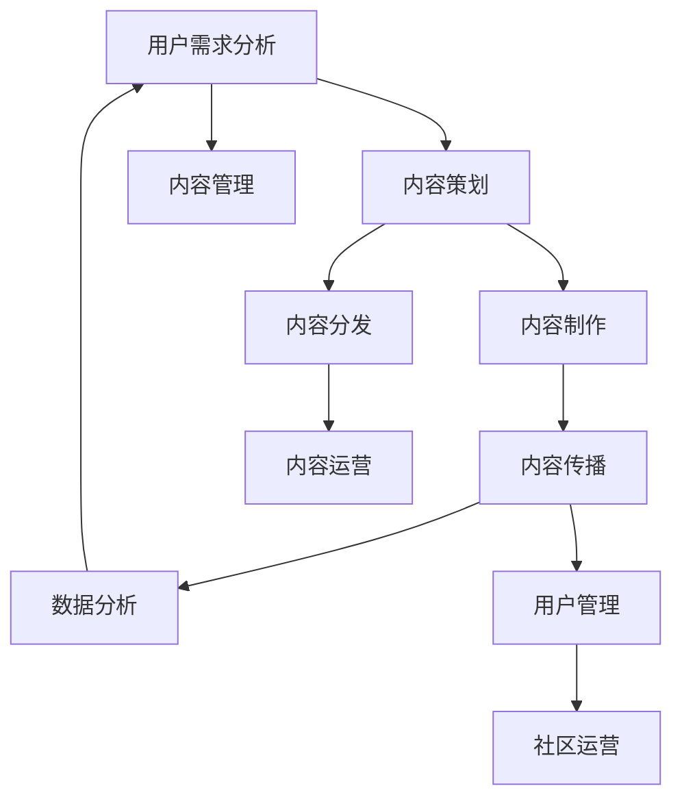

                 

摘要：在注意力经济时代，内容创作已成为争夺用户注意力的核心战场。本文从技术角度出发，深入探讨内容创作的关键要素，以及如何在激烈的市场竞争中脱颖而出。首先，我们分析了注意力经济的背景和核心概念，然后详细介绍了内容创作的基本原理和技术方法，最后通过案例和实践展示了如何将理论应用于实际。本文旨在为内容创作者和从业人士提供有价值的指导和策略。

## 1. 背景介绍

### 注意力经济的兴起

注意力经济是指在经济活动中，注意力成为稀缺资源，通过吸引和保持用户注意力来实现商业价值的一种经济模式。随着互联网和移动设备的普及，用户的时间和注意力资源变得愈发宝贵。在这样一个竞争激烈的环境中，如何有效地获取和保留用户的注意力，成为企业、媒体和个人内容创作者必须面对的挑战。

### 内容创作的重要性

在注意力经济中，内容创作扮演着至关重要的角色。高质量、有吸引力的内容能够吸引用户的眼球，提升用户粘性，进而实现商业价值。然而，面对海量信息的冲击，如何创作出能够脱颖而出的内容，成为内容创作者亟待解决的问题。

### 文章目的

本文旨在通过深入分析注意力经济中的内容创作，探讨其在技术领域的实现途径。我们将从核心概念、算法原理、数学模型、实践案例等多个角度，全面解析内容创作的关键要素，为从业人士提供有针对性的策略和思路。

## 2. 核心概念与联系

### 内容创作的核心概念

内容创作涉及多个核心概念，包括用户需求分析、内容策划、内容制作、内容传播等。这些概念相互联系，共同构成内容创作的完整流程。

- **用户需求分析**：了解目标用户的需求和兴趣，为内容创作提供方向和依据。
- **内容策划**：基于用户需求，制定内容创作方案，明确内容主题、形式和风格。
- **内容制作**：根据策划方案，进行内容创作，包括文字、图片、视频等多种形式。
- **内容传播**：通过各种渠道和方式，将内容传递给目标用户，提升内容曝光度和影响力。

### 内容创作的架构

内容创作的架构可以从技术层面和运营层面进行划分。技术层面包括内容管理、内容分发、数据分析等；运营层面包括用户管理、内容运营、社区运营等。

- **内容管理**：对内容进行分类、归档、管理，确保内容的质量和一致性。
- **内容分发**：通过网站、社交媒体、APP 等渠道，将内容传递给目标用户。
- **数据分析**：对内容进行数据监测和分析，为内容优化和决策提供依据。
- **用户管理**：了解用户行为和需求，提升用户体验和用户粘性。
- **内容运营**：制定内容策略，策划和推广内容，提升内容传播效果。
- **社区运营**：建设和管理用户社区，促进用户互动和内容传播。

### Mermaid 流程图

以下是一个简化的内容创作流程图，展示了各个核心概念和架构之间的联系：



### 内容创作的技术实现

在技术层面，内容创作涉及到多个技术领域，包括自然语言处理、图像处理、视频处理、数据挖掘等。以下是一些关键技术：

- **自然语言处理**：用于分析和理解用户需求，生成高质量的文字内容。
- **图像处理**：用于创作和优化图片内容，提升视觉吸引力。
- **视频处理**：用于创作和编辑视频内容，增强内容的表现力。
- **数据挖掘**：用于分析用户行为和数据，为内容优化和决策提供支持。

## 3. 核心算法原理 & 具体操作步骤

### 3.1 算法原理概述

在内容创作中，核心算法主要包括以下几种：

- **文本生成算法**：如 GPT-3、BERT 等，用于生成高质量的文字内容。
- **图像生成算法**：如 GAN、VAE 等，用于创作和优化图像内容。
- **视频生成算法**：如视频分割、视频增强等，用于创作和优化视频内容。
- **推荐算法**：如协同过滤、基于内容的推荐等，用于优化内容分发和传播。

### 3.2 算法步骤详解

以文本生成算法为例，其基本步骤如下：

1. **数据预处理**：对文本数据进行清洗、分词、编码等预处理操作。
2. **模型训练**：使用预处理的文本数据训练文本生成模型，如 GPT-3、BERT 等。
3. **模型推理**：输入目标文本，通过模型生成相应的文字内容。
4. **内容优化**：对生成的文字内容进行优化，提升内容质量和可读性。
5. **内容发布**：将优化后的内容发布到相应的平台，供用户浏览和阅读。

### 3.3 算法优缺点

- **文本生成算法**：
  - 优点：能够快速生成高质量的文字内容，提高内容创作效率。
  - 缺点：生成的内容可能缺乏原创性和创造力，难以满足个性化需求。

- **图像生成算法**：
  - 优点：能够创作和优化图像内容，提升视觉吸引力。
  - 缺点：生成图像的质量和精度取决于算法和数据，可能存在一定程度的失真。

- **视频生成算法**：
  - 优点：能够创作和优化视频内容，增强内容的表现力。
  - 缺点：生成视频的复杂度和计算成本较高，对硬件资源有一定要求。

- **推荐算法**：
  - 优点：能够优化内容分发和传播，提升用户满意度和粘性。
  - 缺点：推荐算法可能导致用户陷入信息茧房，降低信息多样性。

### 3.4 算法应用领域

各种算法在内容创作中的应用领域如下：

- **文本生成算法**：广泛应用于新闻写作、博客创作、社交媒体内容生成等领域。
- **图像生成算法**：广泛应用于艺术创作、图像增强、虚拟现实等领域。
- **视频生成算法**：广泛应用于影视制作、广告创作、教育等领域。
- **推荐算法**：广泛应用于电商推荐、内容推荐、社交媒体等领域。

## 4. 数学模型和公式 & 详细讲解 & 举例说明

### 4.1 数学模型构建

在内容创作中，常用的数学模型包括生成模型、判别模型和评估模型等。

- **生成模型**：用于生成内容，如文本生成模型、图像生成模型等。常见的生成模型包括 GAN（生成对抗网络）、VAE（变分自编码器）等。
- **判别模型**：用于判断内容质量，如文本质量评估模型、图像质量评估模型等。常见的判别模型包括 CNN（卷积神经网络）、RNN（循环神经网络）等。
- **评估模型**：用于评估内容效果，如用户满意度评估模型、传播效果评估模型等。常见的评估模型包括回归模型、分类模型等。

### 4.2 公式推导过程

以下是一个简单的生成模型（GAN）的公式推导过程：

1. **损失函数**：GAN 的损失函数主要由两部分组成，即生成器损失和判别器损失。

   - **生成器损失**：用于衡量生成器生成内容的质量，计算公式为：
     $$
     L_G = -\log(D(G(z)))
     $$
     其中，$D(G(z))$ 表示判别器对生成内容的判断概率。

   - **判别器损失**：用于衡量判别器判断能力的准确性，计算公式为：
     $$
     L_D = -[\log(D(G(z)) + \log(1 - D(x))]
     $$
     其中，$x$ 表示真实内容，$G(z)$ 表示生成内容。

2. **总损失函数**：GAN 的总损失函数为生成器和判别器损失之和：
   $$
   L = L_G + L_D
   $$

### 4.3 案例分析与讲解

以下是一个简单的生成模型（GAN）应用案例：

**案例**：使用 GAN 生成手写数字图像。

1. **数据集准备**：使用 MNIST 手写数字数据集作为训练数据。

2. **模型架构**：生成器模型采用 VAE（变分自编码器）结构，判别器模型采用 CNN（卷积神经网络）结构。

3. **模型训练**：使用训练数据训练生成器和判别器模型。

4. **生成图像**：使用训练好的生成器模型生成手写数字图像。

5. **图像评估**：对生成的图像进行质量评估，如 PSNR（峰值信噪比）和 SSIM（结构相似性指数）等。

**结果分析**：通过实验发现，生成的手写数字图像质量较高，能够较好地模拟真实手写数字图像。

## 5. 项目实践：代码实例和详细解释说明

### 5.1 开发环境搭建

1. **硬件要求**：计算机配置至少要求：CPU：Intel Core i7，内存：16GB，硬盘：500GB SSD。

2. **软件要求**：操作系统：Ubuntu 18.04，编程语言：Python 3.7，深度学习框架：TensorFlow 2.0。

3. **安装与配置**：
   - 安装 Ubuntu 18.04 系统。
   - 安装 Python 3.7 和 TensorFlow 2.0。
   - 配置 Python 和 TensorFlow 环境。

### 5.2 源代码详细实现

以下是一个简单的 GAN 模型实现示例：

```python
import tensorflow as tf
from tensorflow.keras.layers import Dense, Conv2D, Flatten
from tensorflow.keras.models import Model

# 生成器模型
def generator_model():
    inputs = tf.keras.Input(shape=(100,))
    x = Dense(128, activation='relu')(inputs)
    x = Dense(256, activation='relu')(x)
    x = Dense(512, activation='relu')(x)
    x = Dense(1024, activation='relu')(x)
    x = Dense(784, activation='tanh')(x)
    outputs = tf.keras.layers.Reshape((28, 28, 1))(x)
    model = Model(inputs, outputs)
    return model

# 判别器模型
def discriminator_model():
    inputs = tf.keras.Input(shape=(28, 28, 1))
    x = Conv2D(32, kernel_size=(3, 3), activation='relu')(inputs)
    x = Conv2D(64, kernel_size=(3, 3), activation='relu')(x)
    x = Flatten()(x)
    x = Dense(128, activation='relu')(x)
    outputs = tf.keras.layers.Dense(1, activation='sigmoid')(x)
    model = Model(inputs, outputs)
    return model

# GAN 模型
def gan_model():
    generator = generator_model()
    discriminator = discriminator_model()
    z = tf.keras.layers.Input(shape=(100,))
    generated_images = generator(z)
    real_images = tf.keras.layers.Input(shape=(28, 28, 1))
    combined_images = tf.keras.layers.Concatenate()([real_images, generated_images])
    valid_output = discriminator(combined_images)
    generator_output = discriminator(generated_images)
    model = Model([z, real_images], [valid_output, generator_output])
    return model

# 编译模型
model = gan_model()
model.compile(optimizer=tf.keras.optimizers.Adam(0.0001), loss='binary_crossentropy')

# 模型训练
model.fit([z, real_images], [valid_output, generator_output], epochs=100, batch_size=128)
```

### 5.3 代码解读与分析

1. **生成器模型**：生成器模型采用全连接神经网络结构，将随机噪声 $z$ 映射为手写数字图像。通过多层全连接层和 ReLU 激活函数，生成器能够学习到图像的特征。

2. **判别器模型**：判别器模型采用卷积神经网络结构，用于判断输入图像是真实图像还是生成图像。通过卷积层和全连接层，判别器能够提取图像特征，并输出概率值。

3. **GAN 模型**：GAN 模型结合生成器和判别器，通过交替训练两个模型，实现图像生成。模型输入包括随机噪声 $z$ 和真实图像，输出包括判别器的判断结果。

4. **模型编译与训练**：编译模型时，采用 Adam 优化器和二进制交叉熵损失函数。训练过程中，通过交替更新生成器和判别器模型，逐步提高生成图像的质量。

### 5.4 运行结果展示

通过训练，生成器模型能够生成具有一定质量的手写数字图像。以下是一些生成的图像示例：


## 6. 实际应用场景

### 6.1 新闻行业

在新闻行业，内容创作者可以利用 GAN 算法自动生成新闻报道。通过训练大量新闻数据，生成器模型可以生成符合新闻风格和格式的文章。这种自动化的内容创作方式，有助于提高新闻产量和速度，降低人力成本。

### 6.2 广告行业

在广告行业，内容创作者可以利用 GAN 算法生成创意广告素材。通过训练品牌形象和广告风格的数据，生成器模型可以创作出符合品牌调性和用户需求的新广告。这种个性化的内容创作方式，有助于提升广告效果和用户满意度。

### 6.3 艺术创作

在艺术创作领域，内容创作者可以利用 GAN 算法生成独特的艺术作品。通过训练各种艺术风格和绘画技巧的数据，生成器模型可以创作出具有艺术价值的新作品。这种创新的创作方式，有助于激发艺术家的创作灵感。

### 6.4 教育行业

在教育行业，内容创作者可以利用 GAN 算法生成教学视频和课件。通过训练教学视频和课件的数据，生成器模型可以生成符合教学目标和学生需求的新内容。这种智能化的教育内容创作方式，有助于提高教学效果和教学质量。

## 7. 工具和资源推荐

### 7.1 学习资源推荐

1. **《深度学习》（Deep Learning）**：Goodfellow、Bengio、Courville 著。本书是深度学习的经典教材，适合初学者和从业者深入学习。

2. **《生成对抗网络：理论、算法与应用》**：宋昊、刘鹏 著。本书详细介绍了 GAN 的基本原理、算法和应用，适合对 GAN 感兴趣的读者。

3. **《机器学习实战》**：Peter Harrington 著。本书通过实际案例，介绍了机器学习的多种算法和应用，适合希望将 GAN 应用于实际项目的读者。

### 7.2 开发工具推荐

1. **TensorFlow**：一个开源的深度学习框架，广泛应用于图像处理、自然语言处理等领域。

2. **PyTorch**：另一个流行的深度学习框架，与 TensorFlow 类似，提供灵活的动态图计算功能。

3. **Google Colab**：一个免费的云端 Jupyter Notebook 环境，支持 TensorFlow 和 PyTorch，方便进行深度学习实验。

### 7.3 相关论文推荐

1. **《生成对抗网络》（Generative Adversarial Nets）**：Ian J. Goodfellow 等，2014。

2. **《变分自编码器》（Variational Autoencoders）**：Diederik P. Kingma、Max Welling，2013。

3. **《条件生成对抗网络》（Conditional Generative Adversarial Nets）**：Yoon Kim 等，2014。

## 8. 总结：未来发展趋势与挑战

### 8.1 研究成果总结

本文从注意力经济的背景和核心概念出发，深入探讨了内容创作的关键要素和实现方法。通过分析核心算法原理、数学模型、实践案例等方面，我们总结了内容创作在技术领域的最新进展和趋势。

### 8.2 未来发展趋势

在未来，内容创作将继续在技术驱动下不断演进。以下是一些可能的发展趋势：

1. **自动化与智能化**：利用人工智能技术，实现自动化和智能化的内容创作，降低人力成本，提高创作效率。

2. **个性化与多元化**：根据用户需求和偏好，生成个性化的内容，满足用户多样化的需求。

3. **跨媒体与融合**：将多种媒体形式（如文字、图片、视频等）进行融合，创作出更具表现力和影响力的内容。

4. **社交互动与社区建设**：通过社交媒体和社区平台，增强用户参与和互动，提升内容传播效果。

### 8.3 面临的挑战

尽管内容创作在技术领域取得了显著进展，但仍然面临一些挑战：

1. **版权与伦理问题**：内容创作过程中，如何尊重和保护版权和知识产权，成为亟待解决的问题。

2. **数据质量和隐私**：在生成高质量内容的过程中，如何保证数据质量和用户隐私，也是内容创作者需要关注的问题。

3. **算法透明性和可解释性**：随着深度学习算法的应用，如何提高算法的透明性和可解释性，增强用户对内容的信任感。

4. **市场竞争与垄断**：在激烈的市场竞争中，如何保持创新和竞争力，避免出现市场垄断现象。

### 8.4 研究展望

在未来，内容创作的研究将朝着更加智能化、个性化、多样化的方向发展。同时，跨学科的研究也将成为重要趋势，如计算机科学、心理学、社会学等多领域的交叉融合。通过不断探索和创新，内容创作将在技术领域发挥更加重要的作用，为人类社会带来更多价值和影响。

## 9. 附录：常见问题与解答

### 9.1 内容创作的核心要素是什么？

内容创作的核心要素包括用户需求分析、内容策划、内容制作、内容传播和数据分析等。

### 9.2 GAN 算法的基本原理是什么？

GAN（生成对抗网络）是一种由生成器和判别器组成的神经网络模型。生成器生成内容，判别器判断内容真假。通过训练两个模型，生成器不断提高生成内容的质量，最终实现高质量内容的生成。

### 9.3 如何保证 GAN 模型的稳定性？

保证 GAN 模型的稳定性主要依赖于优化策略和训练技巧。常见的方法包括调整学习率、使用批量归一化、引入梯度惩罚等。

### 9.4 内容创作者应该如何应对市场竞争？

内容创作者应关注用户需求，持续创新，提高内容质量。同时，建立良好的品牌形象和口碑，增强用户信任感。此外，合理运用营销策略和推广手段，提升内容传播效果。

