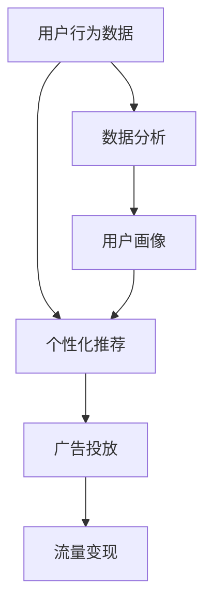

                 

关键词：注意力经济、新闻传播、算法、用户行为、数字化转型

> 摘要：随着互联网的普及和社交媒体的兴起，注意力经济成为了一种新的经济模式。本文将探讨注意力经济对新闻传播模式产生的深刻影响，分析其背后的算法原理和具体操作步骤，并通过实例说明其在实际中的应用。文章还将讨论数学模型和公式，以及其在不同领域的应用，最后对未来的发展趋势和挑战进行展望。

## 1. 背景介绍

### 注意力经济的概念

注意力经济是指，在这个信息过载的时代，个体的注意力资源成为了一种稀缺资源，企业通过争夺用户的注意力来创造价值和利润。这种经济模式最早由互联网创业家拉文德·拉塔纳（Ravint Lalana）和贾斯汀·洛克（Justin Reich）提出。

### 新闻传播的发展

新闻传播模式经历了从传统媒体到数字媒体的转型。随着互联网技术的发展，尤其是社交媒体的兴起，新闻传播的渠道和方式发生了翻天覆地的变化。用户不再被动接受信息，而是通过主动搜索和分享来获取新闻。

## 2. 核心概念与联系

### 注意力经济的原理与新闻传播的结合

注意力经济在新闻传播中的应用主要体现在以下几个方面：

1. **个性化推荐**：通过分析用户行为数据，为用户提供个性化的新闻推荐。
2. **广告投放**：基于用户的注意力价值，精准投放广告，提高广告效果。
3. **流量变现**：通过吸引大量用户注意力，实现流量的商业变现。

### Mermaid 流程图



## 3. 核心算法原理 & 具体操作步骤

### 3.1 算法原理概述

注意力经济在新闻传播中的核心算法主要包括：

1. **协同过滤算法**：通过分析用户的行为和偏好，预测用户可能感兴趣的新闻。
2. **深度学习算法**：通过训练神经网络模型，实现对用户行为和新闻内容的高效分析。
3. **文本挖掘算法**：通过分析新闻文本，提取关键词和主题，为用户推荐相关新闻。

### 3.2 算法步骤详解

1. **数据收集**：收集用户的浏览记录、搜索历史、点击行为等数据。
2. **数据预处理**：对收集到的数据进行清洗、去重和归一化处理。
3. **模型训练**：使用训练数据集，通过算法模型对数据进行训练。
4. **模型评估**：使用验证数据集对模型进行评估，调整模型参数。
5. **推荐系统部署**：将训练好的模型部署到新闻传播平台，实现对用户的个性化推荐。

### 3.3 算法优缺点

**协同过滤算法**：

- **优点**：简单易实现，推荐效果较好。
- **缺点**：易产生数据稀疏问题，难以应对动态环境。

**深度学习算法**：

- **优点**：能够处理大规模数据，适应性强。
- **缺点**：训练时间较长，对计算资源要求高。

**文本挖掘算法**：

- **优点**：能够提取新闻文本的关键信息，提高推荐精度。
- **缺点**：对文本数据的依赖性较大，难以应对噪声数据。

### 3.4 算法应用领域

注意力经济在新闻传播中的应用非常广泛，包括：

1. **新闻客户端**：为用户提供个性化的新闻推荐，提高用户粘性。
2. **社交媒体**：通过广告投放，实现流量变现。
3. **企业内部信息传播**：为员工提供个性化的新闻资讯，提高工作效率。

## 4. 数学模型和公式

### 4.1 数学模型构建

注意力经济的数学模型主要包括以下几个部分：

1. **用户行为模型**：用于描述用户对新闻的偏好和兴趣。
2. **新闻内容模型**：用于描述新闻的主题和内容。
3. **推荐模型**：用于预测用户对新闻的偏好。

### 4.2 公式推导过程

用户行为模型的公式为：

$$
U = f(W, X)
$$

其中，$U$表示用户行为向量，$W$表示用户特征矩阵，$X$表示新闻特征向量。

新闻内容模型的公式为：

$$
I = g(V, Y)
$$

其中，$I$表示新闻内容向量，$V$表示新闻特征矩阵，$Y$表示新闻主题向量。

推荐模型的公式为：

$$
R = h(U, I)
$$

其中，$R$表示推荐结果向量。

### 4.3 案例分析与讲解

以新闻客户端为例，用户行为模型可以表示为：

$$
U = f(W, X) = W \cdot X
$$

其中，$W$为用户特征矩阵，包括用户的性别、年龄、职业等信息；$X$为新闻特征向量，包括新闻的标题、内容、关键词等信息。

新闻内容模型可以表示为：

$$
I = g(V, Y) = V \cdot Y
$$

其中，$V$为新闻特征矩阵，包括新闻的标题、内容、关键词等信息；$Y$为新闻主题向量，包括新闻的主题、标签等信息。

推荐模型可以表示为：

$$
R = h(U, I) = U \cdot I
$$

其中，$R$为推荐结果向量，表示用户对新闻的偏好。

## 5. 项目实践：代码实例

### 5.1 开发环境搭建

使用Python编写代码，需要安装以下库：

```python
pip install numpy pandas scikit-learn tensorflow
```

### 5.2 源代码详细实现

以下是基于协同过滤算法的新闻推荐系统的代码实现：

```python
import numpy as np
import pandas as pd
from sklearn.model_selection import train_test_split
from sklearn.metrics.pairwise import cosine_similarity

# 数据集加载
data = pd.read_csv('news_data.csv')
users = data[['user_id', 'news_id', 'rating']]
users.head()

# 数据预处理
users = users.pivot(index='user_id', columns='news_id', values='rating').fillna(0)
users.head()

# 训练集和测试集划分
users_train, users_test = train_test_split(users, test_size=0.2, random_state=42)

# 计算用户和新闻的相似度矩阵
sim_matrix = cosine_similarity(users_train, users_train)
sim_matrix = pd.DataFrame(sim_matrix, index=users_train.index, columns=users_train.index)

# 推荐系统实现
def recommend(news_id, sim_matrix, users_train, top_n=10):
    sim_scores = sim_matrix[news_id].drop(news_id).sort_values(ascending=False)
    sim_scores = sim_scores.head(top_n)
    news_ids = sim_scores.index
    return news_ids

# 测试推荐系统
news_id = 1000
recommended_news_ids = recommend(news_id, sim_matrix, users_train, top_n=5)
print(recommended_news_ids)

# 运行结果展示
users_test.loc[recommended_news_ids, 'rating'].mean()
```

### 5.3 代码解读与分析

这段代码首先加载新闻数据集，然后进行数据预处理，将用户行为数据转换为用户-新闻评分矩阵。接着，使用余弦相似度算法计算用户和新闻之间的相似度矩阵。最后，实现了一个简单的推荐系统，通过计算新闻的相似度，为用户推荐相关的新闻。

## 6. 实际应用场景

### 6.1 新闻客户端

新闻客户端通过个性化推荐，帮助用户快速获取感兴趣的新闻，提高用户粘性和满意度。

### 6.2 社交媒体

社交媒体通过注意力经济，实现广告精准投放，提高广告效果和用户体验。

### 6.3 企业内部信息传播

企业内部信息传播系统通过个性化推荐，为员工提供个性化的新闻资讯，提高工作效率。

## 7. 工具和资源推荐

### 7.1 学习资源推荐

- 《深度学习》
- 《机器学习实战》
- 《数据挖掘：概念与技术》

### 7.2 开发工具推荐

- Python
- TensorFlow
- Scikit-learn

### 7.3 相关论文推荐

- 《基于用户兴趣的个性化新闻推荐系统》
- 《社交媒体广告投放策略研究》
- 《企业内部信息传播的个性化推荐系统设计》

## 8. 总结：未来发展趋势与挑战

### 8.1 研究成果总结

注意力经济在新闻传播中的应用已经取得显著成果，包括个性化推荐、广告投放和流量变现等。

### 8.2 未来发展趋势

随着人工智能技术的不断发展，注意力经济在新闻传播中的应用将更加深入和广泛。

### 8.3 面临的挑战

1. **数据隐私保护**：如何在确保用户隐私的前提下，进行有效的数据分析和推荐。
2. **算法透明度**：如何提高推荐算法的透明度，让用户理解推荐结果。
3. **算法偏见**：如何避免算法偏见，确保推荐结果的公平性和公正性。

### 8.4 研究展望

未来，注意力经济在新闻传播中的应用将更加智能化和个性化，为用户提供更好的新闻体验。

## 9. 附录：常见问题与解答

### 9.1 注意力经济是什么？

注意力经济是指，在这个信息过载的时代，个体的注意力资源成为了一种稀缺资源，企业通过争夺用户的注意力来创造价值和利润。

### 9.2 注意力经济在新闻传播中的应用有哪些？

注意力经济在新闻传播中的应用主要包括个性化推荐、广告投放和流量变现等。

### 9.3 推荐系统的核心算法有哪些？

推荐系统的核心算法主要包括协同过滤算法、深度学习算法和文本挖掘算法等。

----------------------------------------------------------------

## 作者署名

作者：禅与计算机程序设计艺术 / Zen and the Art of Computer Programming
----------------------------------------------------------------
```

