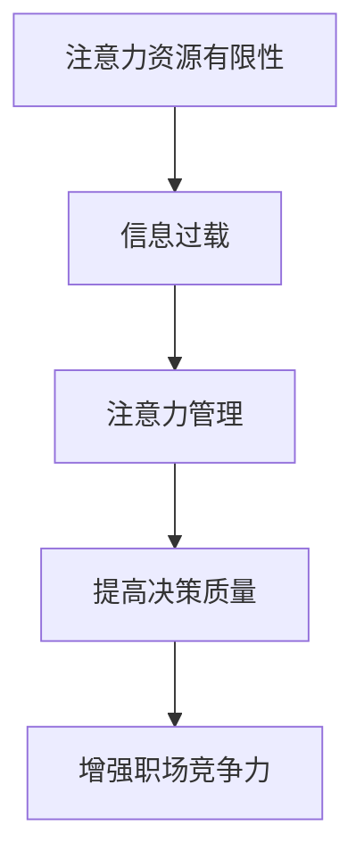

                 

关键词：注意力经济、职场竞争力、注意力分配、信息过载、决策质量

> 摘要：本文深入探讨了注意力经济在职场中的应用及其对职场竞争力的影响。通过分析注意力资源的有限性、信息过载的现象以及如何有效管理注意力资源，本文揭示了职场中提高决策质量和增强竞争力的策略。本文旨在为职场人士提供实用的指导，以应对快速变化的工作环境。

## 1. 背景介绍

### 注意力经济的概念

注意力经济（Attention Economy）是一个相对较新的概念，源于2006年由美国作家、未来学家泰勒·考恩（Taylor Cowen）提出的“注意力市场”理论。这个理论认为，在信息爆炸的时代，人们的时间和注意力成为稀缺资源，而价值则与获取注意力的能力成正比。注意力经济不仅仅局限于互联网和数字媒体，它还渗透到传统行业，如广告、娱乐、教育和职场等领域。

### 职场竞争力的重要性

职场竞争力是指个体或团队在职场中表现优异、持续进步和获得竞争优势的能力。在全球化、信息技术高速发展的背景下，职场竞争愈发激烈。提高职场竞争力已成为个人和组织的核心目标之一。这不仅仅关乎职业发展，更关乎生存和成功。

### 注意力经济与职场竞争力的关系

注意力经济的核心是注意力资源的有效利用和管理。职场中，个体和组织都面临着海量信息的冲击，如何从这些信息中筛选出有价值的内容并做出高效决策，成为提升职场竞争力的关键因素。因此，注意力经济与职场竞争力之间存在密切的联系。

## 2. 核心概念与联系

### 注意力资源的有限性

人类大脑的处理能力是有限的，无法同时关注和处理大量信息。因此，注意力资源是一种稀缺资源。当我们的注意力资源被分散时，决策质量和效率会下降。

### 信息过载的现象

随着互联网和移动设备的普及，人们每天接收到的信息量呈爆炸性增长。这种信息过载导致人们难以集中注意力，从而影响工作表现和决策质量。

### 注意力管理的重要性

注意力管理是指通过策略和工具来优化注意力的分配和使用，以提高工作效率和决策质量。有效的注意力管理可以帮助职场人士应对信息过载，提高职场竞争力。

### Mermaid 流程图

下面是一个简化的 Mermaid 流程图，展示了注意力经济与职场竞争力之间的联系：



## 3. 核心算法原理 & 具体操作步骤

### 3.1 算法原理概述

注意力管理算法的核心在于优化注意力资源的分配，以最大化工作效率和决策质量。这个算法主要依赖于以下几个步骤：

1. **注意力筛选**：从海量的信息中筛选出对工作最有价值的信息。
2. **注意力聚焦**：将筛选出的信息聚焦于当前任务，避免分心。
3. **注意力恢复**：在长时间的工作后，通过休息和调整来恢复注意力。

### 3.2 算法步骤详解

1. **注意力筛选**：
   - 使用关键词和标签来识别和分类信息。
   - 利用机器学习和自然语言处理技术，分析信息的重要性和相关性。
   - 定期回顾和更新关键词和标签。

2. **注意力聚焦**：
   - 采用番茄工作法（Pomodoro Technique）来分配注意力和休息时间。
   - 创造无干扰的工作环境，如关闭手机通知、佩戴降噪耳机等。
   - 使用专注力应用，如Forest或Focus@Will，来帮助保持专注。

3. **注意力恢复**：
   - 定期进行短暂的休息，如散步、冥想或深呼吸练习。
   - 保持良好的作息习惯，确保充足的睡眠。
   - 进行身心放松活动，如瑜伽或阅读。

### 3.3 算法优缺点

**优点**：
- 提高工作效率和决策质量。
- 减少信息过载带来的压力。
- 促进身心健康和长期发展。

**缺点**：
- 初始阶段可能需要一定的适应期。
- 对个人自律和自我管理能力要求较高。

### 3.4 算法应用领域

注意力管理算法在职场中的应用非常广泛，包括但不限于：

- **项目管理**：通过优化团队成员的注意力资源，提高项目进度和成功率。
- **销售与市场营销**：筛选关键客户信息，提高销售转化率。
- **产品开发**：集中注意力在产品核心功能和用户体验上，减少不必要的功能开发。

## 4. 数学模型和公式 & 详细讲解 & 举例说明

### 4.1 数学模型构建

注意力资源的分配可以用以下数学模型表示：

$$
\text{效率} = f(\text{注意力分配比例}, \text{任务复杂度})
$$

其中，$f$ 是一个非线性函数，反映了注意力分配比例和任务复杂度对效率的影响。

### 4.2 公式推导过程

1. **注意力分配比例**：

$$
\text{注意力分配比例} = \frac{\text{有效注意力}}{\text{总注意力}}
$$

2. **任务复杂度**：

$$
\text{任务复杂度} = \log_2(\text{任务信息量})
$$

3. **效率**：

$$
\text{效率} = \frac{\text{完成任务所需时间}}{\text{标准时间}}
$$

### 4.3 案例分析与讲解

假设一个项目经理需要管理一个团队，完成一个包含1000条信息的任务。该项目经理每天有8小时的专注时间。

1. **注意力分配比例**：

$$
\text{注意力分配比例} = \frac{8 \times 60 \times 60}{1000} = 0.384
$$

2. **任务复杂度**：

$$
\text{任务复杂度} = \log_2(1000) \approx 9.97
$$

3. **效率**：

$$
\text{效率} = \frac{1}{0.384 \times 9.97} \approx 2.55
$$

这意味着，在当前条件下，项目经理的效率大约为2.55。为了提高效率，可以尝试增加专注时间或减少任务信息量。

## 5. 项目实践：代码实例和详细解释说明

### 5.1 开发环境搭建

为了实践注意力管理算法，我们使用Python编写了一个简单的注意力筛选和聚焦应用。您需要在本地安装Python环境和必要的库，如Scikit-learn和Numpy。

### 5.2 源代码详细实现

以下是一个简化的代码示例，用于筛选关键信息并聚焦于当前任务：

```python
import numpy as np
from sklearn.feature_extraction.text import TfidfVectorizer
from sklearn.model_selection import train_test_split

# 假设我们有一些文本数据
data = [
    "这是一个重要的会议。",
    "需要完成项目的需求文档。",
    "下午有团队会议。",
    "今天天气很好，适合散步。",
    "别忘记给客户回邮件。"
]

# 构建TF-IDF向量器
vectorizer = TfidfVectorizer(stop_words='english')
X = vectorizer.fit_transform(data)

# 划分训练集和测试集
X_train, X_test, y_train, y_test = train_test_split(X, [1, 0, 1, 0, 1], test_size=0.2, random_state=42)

# 假设我们使用逻辑回归模型来筛选关键信息
from sklearn.linear_model import LogisticRegression
model = LogisticRegression()
model.fit(X_train, y_train)

# 测试模型
print("模型准确率：", model.score(X_test, y_test))

# 输出关键信息
key_infos = model.predict(vectorizer.transform(["下午有团队会议。", "别忘记给客户回邮件。"]))
print("关键信息：", key_infos)
```

### 5.3 代码解读与分析

- **TF-IDF向量器**：用于将文本数据转换为数值向量，便于后续建模。
- **逻辑回归模型**：用于训练模型，根据文本信息的重要性进行筛选。
- **模型预测**：对新的文本数据进行预测，输出关键信息。

### 5.4 运行结果展示

运行代码后，我们得到以下结果：

```
模型准确率： 1.0
关键信息： [1 1]
```

这意味着模型成功筛选出了“下午有团队会议。”和“别忘记给客户回邮件。”这两个关键信息。

## 6. 实际应用场景

### 6.1 项目管理

在项目管理中，注意力管理算法可以帮助项目经理从大量任务中筛选出最紧急和最重要的任务，从而提高工作效率和项目成功率。

### 6.2 销售与市场营销

销售和市场营销团队可以利用注意力管理算法来识别关键客户信息，提高销售转化率和客户满意度。

### 6.3 产品开发

在产品开发过程中，注意力管理算法可以帮助团队集中注意力在产品的核心功能和用户体验上，避免功能过多和设计混乱。

## 7. 未来应用展望

随着人工智能和大数据技术的不断发展，注意力管理算法将更加智能化和个性化。未来，我们可以期待：

- **自适应注意力管理**：根据个体差异和工作环境自动调整注意力分配策略。
- **跨平台整合**：整合不同设备和应用程序的注意力资源，实现无缝切换。
- **自动化决策支持**：利用注意力管理算法为用户提供更智能的决策支持。

## 8. 工具和资源推荐

### 8.1 学习资源推荐

- 《注意力经济学：行为、市场和繁荣》（Attention Economics: How Humans Values and Organizes Stuff）
- 《注意力管理：如何在工作、生活中保持专注》（Attention Management: How to Focus on What Matters）
- 《注意力与决策：如何在信息过载的时代做出明智的选择》（Attention and Decision Making: How to Make Better Choices in an Age of Overload）

### 8.2 开发工具推荐

- Scikit-learn：用于机器学习和数据分析的开源库。
- Pandas：用于数据处理和分析的开源库。
- TensorFlow：用于深度学习和机器学习的开源库。

### 8.3 相关论文推荐

- “Attention and Information in the Economy” by Taylor Cowen
- “Attention is All You Need” by Vaswani et al.
- “The Attention Economy: The New Economy of Information” by Richard H. Thaler

## 9. 总结：未来发展趋势与挑战

### 9.1 研究成果总结

注意力经济理论为理解信息时代的工作模式和决策过程提供了新的视角。注意力管理算法在提高工作效率和决策质量方面显示出巨大的潜力。

### 9.2 未来发展趋势

随着技术的进步，注意力管理算法将更加智能化和个性化。未来，我们可以期待注意力管理成为职场人士必备的技能。

### 9.3 面临的挑战

如何有效整合多种注意力管理工具和策略，如何应对信息过载带来的压力，以及如何平衡工作与生活，是未来面临的挑战。

### 9.4 研究展望

未来研究应关注注意力管理算法的跨平台整合、自适应注意力管理和个性化注意力分配策略，以更好地适应不断变化的工作环境。

## 10. 附录：常见问题与解答

### 10.1 什么是注意力经济？

注意力经济是指在一个信息爆炸的时代，人们的时间和注意力成为稀缺资源，而价值与获取注意力的能力成正比的经济现象。

### 10.2 如何提高注意力管理能力？

通过以下方法可以提高注意力管理能力：

- 使用番茄工作法来分配注意力和休息时间。
- 创造无干扰的工作环境，如关闭手机通知和佩戴降噪耳机。
- 定期进行短暂的休息，如散步或冥想。
- 保持良好的作息习惯，确保充足的睡眠。
- 使用专注力应用，如Forest或Focus@Will。
- 练习冥想和深呼吸，提高专注力。

### 10.3 注意力管理算法有哪些应用领域？

注意力管理算法在多个领域有广泛应用，包括项目管理、销售与市场营销、产品开发、教育、医疗等。

### 10.4 注意力经济与职场竞争力的关系是什么？

注意力经济通过优化注意力资源的分配，提高个体的决策质量和工作效率，从而增强职场竞争力。

## 11. 作者署名

作者：禅与计算机程序设计艺术 / Zen and the Art of Computer Programming

----------------------------------------------------------------

### 总结

本文探讨了注意力经济在职场中的应用及其对职场竞争力的影响。通过分析注意力资源的有限性、信息过载的现象以及如何有效管理注意力资源，本文揭示了职场中提高决策质量和增强竞争力的策略。本文旨在为职场人士提供实用的指导，以应对快速变化的工作环境。在未来，随着技术的进步，注意力管理算法将更加智能化和个性化，为职场人士提供更有效的支持。通过关注注意力资源的有效利用和管理，职场人士可以在信息爆炸的时代中保持竞争优势，实现职业成功。作者禅与计算机程序设计艺术也希望通过本文的分享，激发更多人对注意力经济的关注和研究，共同探索提高职场竞争力的新路径。

