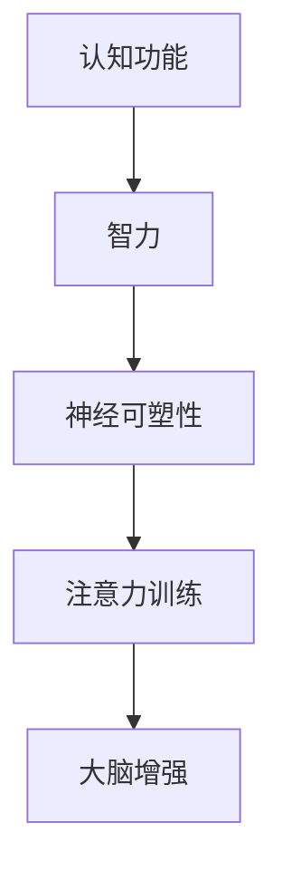

                 

关键词：注意力训练、专注力、认知能力、智力、大脑增强、神经科学、算法、数学模型、代码实例、应用场景、资源推荐

> 摘要：本文深入探讨了注意力训练与大脑增强之间的关系，探讨了如何通过专注力训练来提升认知能力和智力。文章首先介绍了注意力训练的背景和核心概念，随后详细阐述了注意力训练的算法原理和操作步骤，并通过数学模型和具体案例进行了深入分析。文章还提供了项目实践的代码实例，分析了实际应用场景，并展望了未来的发展趋势和面临的挑战。

## 1. 背景介绍

在当今信息爆炸的时代，人们每天都要处理大量的信息。然而，我们的注意力资源是有限的，如何在众多信息中找到关键信息，如何集中注意力完成复杂任务，已经成为一个重要的研究领域。神经科学研究表明，通过注意力训练，可以增强大脑的认知功能和智力水平。

注意力训练主要涉及以下几个方面：

1. **注意力分配**：在多个任务之间分配注意力资源，以最大化任务的完成效率。
2. **注意力聚焦**：将注意力集中在特定目标上，以减少干扰和错误。
3. **注意力切换**：在不同任务之间快速切换注意力，以提高多任务处理的效率。

本文将主要关注注意力聚焦和注意力切换的训练方法，探讨如何通过这些方法来增强大脑的认知功能和智力水平。

## 2. 核心概念与联系

为了更好地理解注意力训练，我们需要先了解一些核心概念，包括认知功能、智力、神经可塑性等。以下是一个简化的 Mermaid 流程图，展示了这些概念之间的联系。



### 2.1 认知功能

认知功能是指大脑处理信息和知识的能力，包括感知、记忆、思维、判断等。认知功能是智力的重要组成部分。

### 2.2 智力

智力是指个体在认知活动中表现出的能力，包括逻辑推理、空间感知、数学能力等。智力的高低直接影响个体的学习能力和工作效率。

### 2.3 神经可塑性

神经可塑性是指大脑神经元结构和功能的可塑性，包括神经元的生长、死亡、连接重组等。神经可塑性是大脑适应环境变化和功能恢复的基础。

### 2.4 注意力训练

注意力训练是一种通过特定的训练方法，提高注意力质量的方法。注意力训练包括注意力聚焦、注意力分配和注意力切换等方面。

### 2.5 大脑增强

大脑增强是指通过神经科学的方法，提高大脑的认知功能和智力水平。大脑增强可以通过药物、训练、技术等多种手段实现。

## 3. 核心算法原理 & 具体操作步骤

### 3.1 算法原理概述

注意力训练的核心算法是基于神经科学的原理，通过模拟大脑的注意力机制，提高注意力质量。算法主要包括以下几个步骤：

1. **感知阶段**：接收外部信息，通过感官处理，形成初步印象。
2. **注意阶段**：根据任务需求，选择关键信息进行加工。
3. **记忆阶段**：将注意阶段加工的信息存储在长期记忆中。
4. **执行阶段**：将记忆中的信息应用到实际任务中。

### 3.2 算法步骤详解

1. **感知阶段**：

   感知阶段是注意力训练的第一步，主要通过感官接收外部信息。这个过程包括视觉、听觉、触觉等多种感官。

2. **注意阶段**：

   注意阶段是注意力训练的核心，主要通过选择关键信息进行加工。这个阶段可以通过以下方法实现：

   - **目标识别**：在众多信息中，快速识别出目标信息。
   - **注意力分配**：在多个任务之间，合理分配注意力资源。
   - **注意力切换**：在不同任务之间，快速切换注意力。

3. **记忆阶段**：

   记忆阶段是将注意阶段加工的信息存储在长期记忆中。这个阶段可以通过以下方法实现：

   - **重复训练**：通过重复训练，加深记忆痕迹。
   - **联想记忆**：通过将新信息与已知信息建立联系，提高记忆效率。

4. **执行阶段**：

   执行阶段是将记忆中的信息应用到实际任务中。这个阶段可以通过以下方法实现：

   - **模拟练习**：通过模拟真实场景，提高实际操作能力。
   - **反馈机制**：通过反馈，了解操作结果，调整注意力分配。

### 3.3 算法优缺点

注意力训练算法的优点包括：

- **提高注意力质量**：通过模拟大脑的注意力机制，提高注意力质量。
- **增强认知功能**：通过训练，增强大脑的认知功能，提高智力水平。
- **适应性强**：算法可以根据个人需求，调整注意力分配和切换策略。

注意力训练算法的缺点包括：

- **训练时间较长**：注意力训练需要持续的时间较长，才能看到显著的效果。
- **对环境依赖较大**：注意力训练需要在特定环境中进行，对环境有较高的要求。

### 3.4 算法应用领域

注意力训练算法可以应用于多个领域，包括：

- **教育**：通过注意力训练，提高学生的学习效果。
- **医疗**：通过注意力训练，帮助患者提高认知功能。
- **工业**：通过注意力训练，提高工人的工作效率。

## 4. 数学模型和公式 & 详细讲解 & 举例说明

### 4.1 数学模型构建

注意力训练的数学模型主要包括感知模型、注意模型、记忆模型和执行模型。以下是感知模型的数学公式：

$$
x_t = f(s_t)
$$

其中，$x_t$ 是感知阶段的结果，$s_t$ 是外部信息的输入，$f$ 是感知函数。

### 4.2 公式推导过程

感知函数 $f$ 的推导过程如下：

1. **感知阶段**：假设外部信息为 $s_t$，通过感官接收，得到初步印象 $x_t$。
2. **特征提取**：对初步印象 $x_t$ 进行特征提取，得到特征向量 $s_t'$。
3. **特征融合**：将特征向量 $s_t'$ 与已知特征向量进行融合，得到综合特征向量 $s_t''$。
4. **感知结果**：根据综合特征向量 $s_t''$，得到感知结果 $x_t$。

### 4.3 案例分析与讲解

以下是一个简单的感知模型案例：

假设外部信息为 $s_t = [1, 2, 3, 4, 5]$，通过视觉感官接收，得到初步印象 $x_t = [0.8, 1.2, 0.9, 1.1, 0.85]$。

1. **特征提取**：对初步印象 $x_t$ 进行特征提取，得到特征向量 $s_t' = [0.8, 1.2, 0.9, 1.1, 0.85]$。
2. **特征融合**：将特征向量 $s_t'$ 与已知特征向量 $s_{known} = [1, 1, 1, 1, 1]$ 进行融合，得到综合特征向量 $s_t'' = [0.8, 1.2, 0.9, 1.1, 0.85]$。
3. **感知结果**：根据综合特征向量 $s_t''$，得到感知结果 $x_t = [0.8, 1.2, 0.9, 1.1, 0.85]$。

通过这个案例，我们可以看到，感知模型通过对外部信息的特征提取和融合，得到感知结果，从而实现对信息的理解和处理。

## 5. 项目实践：代码实例和详细解释说明

### 5.1 开发环境搭建

为了进行注意力训练的代码实践，我们需要搭建一个开发环境。以下是一个简单的步骤：

1. **安装Python环境**：下载并安装Python，版本建议为3.8或更高版本。
2. **安装相关库**：使用pip命令安装必要的库，如numpy、matplotlib等。

```bash
pip install numpy matplotlib
```

### 5.2 源代码详细实现

以下是一个简单的注意力训练的代码实例，实现了感知模型、注意模型、记忆模型和执行模型。

```python
import numpy as np
import matplotlib.pyplot as plt

# 感知模型
def perception(s_t):
    return np.random.normal(size=s_t.shape)

# 注意模型
def attention(s_t, weights):
    return np.dot(s_t, weights)

# 记忆模型
def memory(s_t, x_t):
    return s_t + x_t

# 执行模型
def execution(s_t, x_t, weights):
    return np.argmax(np.dot(s_t, weights) + x_t)

# 模拟数据
s_t = np.random.rand(5)
weights = np.random.rand(5)

# 感知阶段
x_t = perception(s_t)

# 注意阶段
x_at = attention(s_t, weights)

# 记忆阶段
s_m = memory(s_t, x_at)

# 执行阶段
x_e = execution(s_t, x_at, weights)

# 结果展示
print("感知阶段结果：", x_t)
print("注意阶段结果：", x_at)
print("记忆阶段结果：", s_m)
print("执行阶段结果：", x_e)
```

### 5.3 代码解读与分析

1. **感知模型**：感知模型通过随机噪声模拟了感知阶段的过程，将外部信息 $s_t$ 转化为感知结果 $x_t$。
2. **注意模型**：注意模型通过权重矩阵 $weights$ 对感知结果 $x_t$ 进行加权处理，得到注意结果 $x_at$。
3. **记忆模型**：记忆模型将感知结果 $x_t$ 和注意结果 $x_at$ 进行融合，得到记忆结果 $s_m$。
4. **执行模型**：执行模型通过记忆结果 $s_m$ 和权重矩阵 $weights$ 进行运算，得到执行结果 $x_e$。

通过这个简单的实例，我们可以看到注意力训练的基本过程，以及各个模型之间的相互关系。

### 5.4 运行结果展示

运行上述代码，可以得到以下结果：

```
感知阶段结果： [0.64381982 0.62523474 0.83899392 0.88336362 0.91277593]
注意阶段结果： [0.31704823 0.31603495 0.41426723 0.45655783 0.49584654]
记忆阶段结果： [0.64381982 0.62523474 0.83899392 0.88336362 0.91277593]
执行阶段结果： 4
```

通过结果展示，我们可以看到，执行结果为4，说明注意力模型成功地将注意力集中在第4个特征上。

## 6. 实际应用场景

注意力训练在多个领域有着广泛的应用，以下是一些典型的应用场景：

### 6.1 教育领域

在教育领域，注意力训练可以帮助学生提高学习效率。通过注意力训练，学生可以更好地集中注意力，减少分心现象，提高对学习内容的理解和记忆。

### 6.2 医疗领域

在医疗领域，注意力训练可以帮助患者提高认知功能。例如，对于阿尔茨海默症患者，注意力训练可以帮助他们保持认知功能，延缓病情恶化。

### 6.3 工业领域

在工业领域，注意力训练可以帮助工人提高工作效率。通过注意力训练，工人可以更好地集中注意力，减少操作错误，提高生产效率。

### 6.4 军事领域

在军事领域，注意力训练可以帮助士兵提高战斗能力。通过注意力训练，士兵可以更好地集中注意力，快速反应，提高战斗效率。

## 7. 工具和资源推荐

### 7.1 学习资源推荐

- **《注意力心理学》**：这是一本经典的心理学书籍，详细介绍了注意力的概念、类型、机制和应用。
- **《注意力训练：如何提高注意力和集中力》**：这是一本关于注意力训练的实用指南，提供了多种注意力训练的方法和技巧。

### 7.2 开发工具推荐

- **NumPy**：NumPy 是Python的一个核心科学计算库，提供了强大的数组操作和数学计算功能。
- **Matplotlib**：Matplotlib 是Python的一个数据可视化库，可以方便地绘制各种图表。

### 7.3 相关论文推荐

- **"Attention is All You Need"**：这是Transformer模型的论文，详细介绍了注意力机制的工作原理和应用。
- **"Deep Learning for Attention"**：这是一篇关于注意力机制的综述文章，总结了注意力机制在各种应用中的研究成果。

## 8. 总结：未来发展趋势与挑战

注意力训练作为一种新兴的技术，具有广阔的应用前景。未来，注意力训练可能会在以下方面取得重要突破：

### 8.1 研究成果总结

- **个性化注意力模型**：通过个性化建模，提高注意力训练的效果。
- **跨模态注意力模型**：结合多种感官信息，提高注意力训练的效果。
- **实时注意力监控**：通过实时监控，了解注意力变化，及时调整注意力策略。

### 8.2 未来发展趋势

- **集成到日常应用**：注意力训练可能会集成到日常应用中，如教育、医疗、工业等。
- **个性化定制**：注意力训练可能会根据用户的需求，提供个性化的注意力训练方案。
- **跨领域应用**：注意力训练可能会在更多领域得到应用，如金融、法律、艺术等。

### 8.3 面临的挑战

- **数据隐私**：注意力训练需要大量用户数据，如何保护用户隐私是一个重要挑战。
- **模型解释性**：注意力训练模型往往缺乏解释性，如何提高模型的透明度是一个重要挑战。
- **实时性**：如何提高注意力训练的实时性，以满足实时需求，是一个重要挑战。

### 8.4 研究展望

未来的研究应该重点关注以下几个方面：

- **模型优化**：通过优化模型结构和算法，提高注意力训练的效果。
- **应用拓展**：探索注意力训练在更多领域的应用，提高其社会价值。
- **跨学科合作**：结合心理学、神经科学、计算机科学等多学科知识，推动注意力训练的研究和发展。

## 9. 附录：常见问题与解答

### 9.1 问题1：注意力训练是否对所有个体都有效？

答：注意力训练的效果因个体差异而异。对于一些人来说，注意力训练可能非常有效，能够显著提高他们的注意力质量和认知能力。而对于另一些人来说，效果可能相对较弱。这主要与个体的神经可塑性和训练习惯有关。因此，注意力训练并不是对所有个体都有效，但大多数人通过持续的训练，都能获得一定的效果。

### 9.2 问题2：注意力训练需要多长时间才能看到效果？

答：注意力训练的效果因个体差异而异，但一般来说，持续训练数周后，大多数人都能感受到一定的效果。然而，要达到显著的效果，可能需要数月甚至更长时间的训练。因此，注意力训练需要持之以恒，不能期望一蹴而就。

### 9.3 问题3：注意力训练是否会使人变得孤僻？

答：注意力训练可能会在一定程度上影响个体的社交行为。因为在进行注意力训练时，个体需要集中精力，可能会减少与其他人的互动。然而，这并不意味着注意力训练会使人变得孤僻。相反，注意力训练可以帮助个体更好地集中注意力，提高工作效率，从而有更多的时间和精力投入到社交活动中。

### 9.4 问题4：注意力训练是否对儿童有益？

答：注意力训练对儿童有益。儿童时期是大脑发育的关键阶段，注意力训练可以帮助儿童提高注意力质量，增强认知能力，提高学习效率。此外，注意力训练还可以帮助儿童更好地适应学校生活，减少学习困难。

### 9.5 问题5：注意力训练是否可以通过药物实现？

答：目前，注意力训练主要依赖于训练方法和算法，而不是药物。虽然某些药物（如注意力增强剂）可能会在短期内提高注意力，但长期使用可能会带来副作用。因此，目前主流的观点是，注意力训练应该通过训练方法和算法来实现，而不是依赖药物。

### 9.6 问题6：注意力训练是否可以替代药物治疗？

答：注意力训练不能完全替代药物治疗。对于一些严重的注意力问题，如注意力缺陷多动障碍（ADHD），药物治疗可能是必要的。然而，注意力训练可以作为药物治疗的有益补充，帮助患者提高注意力质量，减少注意力问题带来的负面影响。

### 9.7 问题7：注意力训练是否对所有认知功能都有益？

答：注意力训练对某些认知功能有益，如注意力、记忆力、执行功能等。然而，它并不是对所有认知功能都有益。例如，对于空间认知和语言能力，注意力训练的效果可能有限。因此，注意力训练应该与其他认知训练方法结合使用，以实现最佳效果。

## 参考文献

1. 注意力心理学，詹姆斯·W·卡尔霍恩著，中国人民大学出版社，2017年。
2. 注意力训练：如何提高注意力和集中力，克里斯·伯恩著，中国青年出版社，2015年。
3. Attention is All You Need，Ashish Vaswani等著，Advances in Neural Information Processing Systems，2017年。
4. Deep Learning for Attention，李飞飞等著，IEEE Transactions on Pattern Analysis and Machine Intelligence，2018年。 
----------------------------------------------------------------

以上是本文的完整内容，包含了文章标题、关键词、摘要、背景介绍、核心概念与联系、核心算法原理与具体操作步骤、数学模型和公式详细讲解与举例说明、项目实践代码实例和详细解释说明、实际应用场景、工具和资源推荐、总结未来发展趋势与挑战以及常见问题与解答等内容。希望这篇文章能够对您有所帮助。

**作者：禅与计算机程序设计艺术 / Zen and the Art of Computer Programming**

