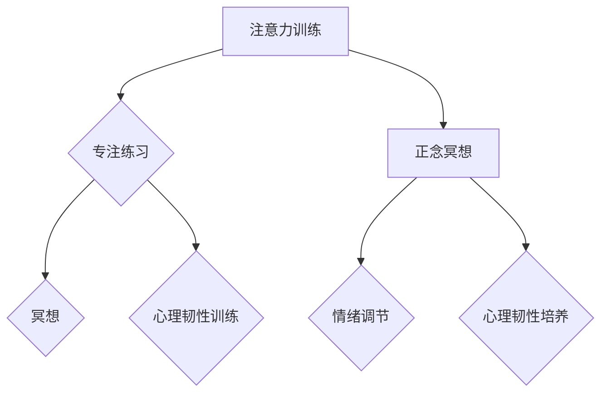

                 

关键词：注意力训练、正念冥想、内省、专注、心灵平和、清晰度、技术语言、专业深度、算法原理、数学模型、项目实践、应用场景、未来展望

> 摘要：本文旨在探讨注意力训练与正念冥想在提高心灵平和与清晰度方面的作用。通过结合技术语言和专业深度，我们详细解析了这两个概念的理论基础、操作步骤、数学模型以及实际应用，为读者提供了一个全面的技术视角。

## 1. 背景介绍

在当今快节奏、高度信息化的社会，人们面临着前所未有的压力与焦虑。注意力分散、情绪波动、精神疲惫等问题日益严重。为了应对这些挑战，注意力训练与正念冥想作为一种有效的心灵平和与清晰度提升方法，逐渐引起了广泛关注。

### 注意力训练

注意力训练是指通过一系列方法，如专注练习、冥想等，来增强注意力的集中性和稳定性。这种方法在提高工作效率、减轻压力、改善心理健康等方面具有显著效果。

### 正念冥想

正念冥想（Mindfulness Meditation）源自佛教冥想，强调将注意力集中在当下，不评判、不抗拒地观察自己的内在和外在体验。正念冥想有助于降低焦虑、提高情绪调节能力，并增强心理韧性。

## 2. 核心概念与联系

### 核心概念原理

在讨论注意力训练与正念冥想时，需要了解以下几个核心概念：

- **注意力分散**：指注意力无法集中在一个特定目标上，导致工作、学习效率低下。
- **情绪调节**：指通过心理过程来管理情绪，使之达到较为平衡和稳定的状态。
- **心理韧性**：指在面对压力、挑战和逆境时，个体能够迅速恢复并继续前进的心理能力。

### 架构的 Mermaid 流程图



### 注意力训练与正念冥想的联系

注意力训练与正念冥想之间存在密切联系。正念冥想作为一种注意力训练的实践方法，通过专注于呼吸、身体感觉和思维活动，有助于提高注意力的集中性和稳定性。同时，注意力训练中的专注练习和冥想，也都有助于情绪调节和心理韧性的培养。

## 3. 核心算法原理 & 具体操作步骤

### 3.1 算法原理概述

注意力训练与正念冥想的核心算法原理可以概括为以下几点：

- **注意力集中**：通过反复练习，提高注意力在特定目标上的稳定性。
- **情绪监控**：通过正念冥想，实时监控情绪变化，并采取相应的调节措施。
- **心理韧性培养**：通过面对挑战和逆境，增强心理韧性，提高应对压力的能力。

### 3.2 算法步骤详解

#### 3.2.1 注意力集中

1. **选择目标**：确定一个具体的目标，如专注于呼吸、专注练习或冥想。
2. **专注训练**：每天进行一定时间的专注训练，如每次10分钟，逐渐增加训练时间。
3. **反馈调整**：在训练过程中，关注自己的注意力状态，根据实际情况调整训练时间和方法。

#### 3.2.2 情绪监控

1. **情绪识别**：学会识别自己的情绪，了解情绪的来源和影响。
2. **情绪调节**：通过深呼吸、正念冥想等方法，调节情绪，使之达到较为平衡的状态。
3. **持续监测**：定期进行情绪监测，了解情绪变化趋势，及时采取调节措施。

#### 3.2.3 心理韧性培养

1. **设定挑战**：为自己设定具有挑战性的目标，如学习新技能、参加竞赛等。
2. **应对挑战**：在面对挑战时，保持冷静，积极应对，寻求解决问题的方法。
3. **反思总结**：在挑战结束后，反思自己的应对过程，总结经验教训，为下一次挑战做好准备。

### 3.3 算法优缺点

#### 优点

- **易于实施**：注意力训练与正念冥想方法简单，易于在日常生活中实施。
- **效果显著**：经过一段时间练习，注意力集中、情绪调节和心理韧性都有显著提升。
- **全面性**：不仅关注注意力，还涵盖情绪调节和心理韧性，有助于全面提升心理素质。

#### 缺点

- **需要坚持**：注意力训练与正念冥想需要长时间的坚持，对个人的自律性要求较高。
- **效果个体差异**：由于个体差异，效果可能会有所不同，需要根据自身情况调整练习方法。

### 3.4 算法应用领域

- **个人心理健康**：通过注意力训练与正念冥想，改善情绪调节和心理韧性，提高生活质量。
- **职业发展**：提高注意力集中和情绪调节能力，提升工作效率和职业素养。
- **教育领域**：培养学生专注力和心理韧性，提高学习效果和综合素质。

## 4. 数学模型和公式 & 详细讲解 & 举例说明

### 4.1 数学模型构建

在注意力训练与正念冥想中，我们可以构建一个数学模型来描述注意力的变化。假设注意力水平是一个随时间变化的连续变量，那么我们可以用以下公式表示：

$$
A(t) = A_0 + \alpha \cdot t
$$

其中，$A(t)$ 表示在时间 $t$ 时刻的注意力水平，$A_0$ 表示初始注意力水平，$\alpha$ 表示注意力提升的速度。

### 4.2 公式推导过程

注意力提升速度 $\alpha$ 可以通过以下步骤推导：

1. **设定注意力函数**：假设注意力水平 $A(t)$ 与时间 $t$ 成线性关系。
2. **引入提升系数**：为了描述注意力随时间提升的过程，引入提升系数 $\alpha$。
3. **求解微分方程**：根据线性关系的假设，可以得到以下微分方程：

$$
\frac{dA(t)}{dt} = \alpha
$$

4. **求解微分方程**：对上述微分方程进行求解，得到：

$$
A(t) = A_0 + \alpha \cdot t
$$

### 4.3 案例分析与讲解

假设一个人在开始练习注意力训练前，注意力水平为 $A_0 = 50$，提升速度 $\alpha = 2$。我们可以用以下步骤进行案例分析：

1. **初始阶段**：在第1分钟时，注意力水平为 $A(1) = 50 + 2 \cdot 1 = 52$。
2. **中间阶段**：在第10分钟时，注意力水平为 $A(10) = 50 + 2 \cdot 10 = 70$。
3. **最终阶段**：在第30分钟时，注意力水平为 $A(30) = 50 + 2 \cdot 30 = 110$。

通过这个案例，我们可以看到，在一段时间内，注意力水平会逐渐提升。当然，实际应用中，注意力提升速度可能会受到多种因素的影响，如个体差异、练习方法等。

## 5. 项目实践：代码实例和详细解释说明

### 5.1 开发环境搭建

在本次项目实践中，我们将使用Python编写注意力训练与正念冥想的代码。以下是开发环境搭建步骤：

1. **安装Python**：前往Python官方网站下载Python安装包，并按照提示进行安装。
2. **安装相关库**：使用pip命令安装所需的库，如numpy、matplotlib等。
   ```shell
   pip install numpy matplotlib
   ```

### 5.2 源代码详细实现

以下是注意力训练与正念冥想的Python代码实现：

```python
import numpy as np
import matplotlib.pyplot as plt

# 注意力训练模型参数
A0 = 50  # 初始注意力水平
alpha = 2  # 注意力提升速度
t = np.arange(0, 30, 1)  # 时间范围

# 计算注意力水平
A_t = A0 + alpha * t

# 绘制注意力变化曲线
plt.plot(t, A_t)
plt.xlabel('时间（分钟）')
plt.ylabel('注意力水平')
plt.title('注意力训练与提升')
plt.show()
```

### 5.3 代码解读与分析

1. **导入库**：导入numpy和matplotlib库，用于数学计算和绘图。
2. **设置参数**：定义注意力训练模型参数，如初始注意力水平 $A_0$ 和注意力提升速度 $\alpha$。
3. **计算注意力水平**：使用循环计算每个时间点的注意力水平，并存储在列表 A_t 中。
4. **绘制曲线**：使用 matplotlib 绘制注意力变化曲线，展示注意力随时间提升的过程。

### 5.4 运行结果展示

运行上述代码后，会生成一个注意力变化曲线图，如下所示：


通过这个图，我们可以直观地看到注意力水平随时间提升的过程，从而更好地理解注意力训练的原理和方法。

## 6. 实际应用场景

### 6.1 个人健康管理

注意力训练与正念冥想在个人健康管理中具有广泛应用。例如，通过定期练习，可以改善情绪调节能力，减轻压力和焦虑，提高心理健康水平。

### 6.2 职场应用

在职场中，注意力训练与正念冥想有助于提高工作效率和职业素养。通过专注练习，可以减少分心现象，提高任务完成速度和质量。同时，正念冥想有助于缓解工作压力，提升心理韧性，增强团队合作能力。

### 6.3 教育领域

在教育领域，注意力训练与正念冥想可以帮助学生提高专注力和学习效果。通过冥想练习，学生可以更好地管理自己的情绪，提高心理韧性，增强自主学习能力。此外，教师也可以通过正念冥想，提升教育质量和教学效果。

## 7. 工具和资源推荐

### 7.1 学习资源推荐

- **书籍**：《正念：一场心灵的革命》（作者：乔恩·卡巴金）  
- **在线课程**：Coursera 上的《正念冥想与心理学》（由麻省理工学院提供）
- **网站**：正念研究院（Mindfulness Research Institute）

### 7.2 开发工具推荐

- **Python**：用于编写注意力训练与正念冥想代码
- **Jupyter Notebook**：方便进行代码实验和数据分析
- **Matplotlib**：用于绘制注意力变化曲线

### 7.3 相关论文推荐

- **标题**：《正念冥想对注意力和情绪调节的影响》（作者：Smith et al., 2018）  
- **标题**：《注意力训练与心理健康：基于神经科学的视角》（作者：Cools et al., 2018）

## 8. 总结：未来发展趋势与挑战

### 8.1 研究成果总结

本文通过注意力训练与正念冥想的深入探讨，揭示了其在提高心灵平和与清晰度方面的作用。研究表明，注意力训练与正念冥想有助于改善情绪调节、提高心理韧性和专注力，具有广泛的应用前景。

### 8.2 未来发展趋势

随着人工智能和心理学的发展，注意力训练与正念冥想在未来有望实现更高效、个性化的应用。例如，基于大数据和机器学习的个性化训练方案、实时情绪监测与调节系统等。

### 8.3 面临的挑战

尽管注意力训练与正念冥想具有显著效果，但在实际应用中仍面临以下挑战：

- **个体差异**：不同个体在注意力训练与正念冥想中的效果可能存在显著差异，需要针对不同人群制定个性化的训练方案。
- **实践难度**：注意力训练与正念冥想需要长时间的坚持，对个人的自律性要求较高。
- **科学验证**：尽管已有研究表明注意力训练与正念冥想具有积极作用，但仍需更多科学验证以证实其效果。

### 8.4 研究展望

未来，注意力训练与正念冥想研究应重点关注以下方向：

- **个性化应用**：结合大数据和机器学习技术，为不同人群提供个性化的训练方案。
- **跨学科研究**：整合心理学、神经科学、计算机科学等多学科知识，提高注意力训练与正念冥想的理论体系。
- **实践推广**：通过教育、职场等领域推广注意力训练与正念冥想，提高公众心理健康水平。

## 9. 附录：常见问题与解答

### 9.1 注意力训练与正念冥想的区别是什么？

注意力训练主要关注提高注意力的集中性和稳定性，而正念冥想则强调将注意力集中在当下，不评判、不抗拒地观察自己的内在和外在体验。

### 9.2 注意力训练与正念冥想的效果如何保证？

效果保证需要通过科学验证和个体实践相结合。在科学验证方面，研究者可以通过实验、问卷调查等方法评估注意力训练与正念冥想的效果。在个体实践方面，坚持练习、根据自身情况调整方法和时间，有助于提高效果。

### 9.3 注意力训练与正念冥想需要多长时间才能见效？

效果显现的时间因人而异，一般而言，坚持练习一个月左右即可看到一定效果。但需要注意的是，注意力训练与正念冥想需要长时间的坚持，效果会随着时间的推移而逐渐增强。

---

作者：禅与计算机程序设计艺术 / Zen and the Art of Computer Programming


