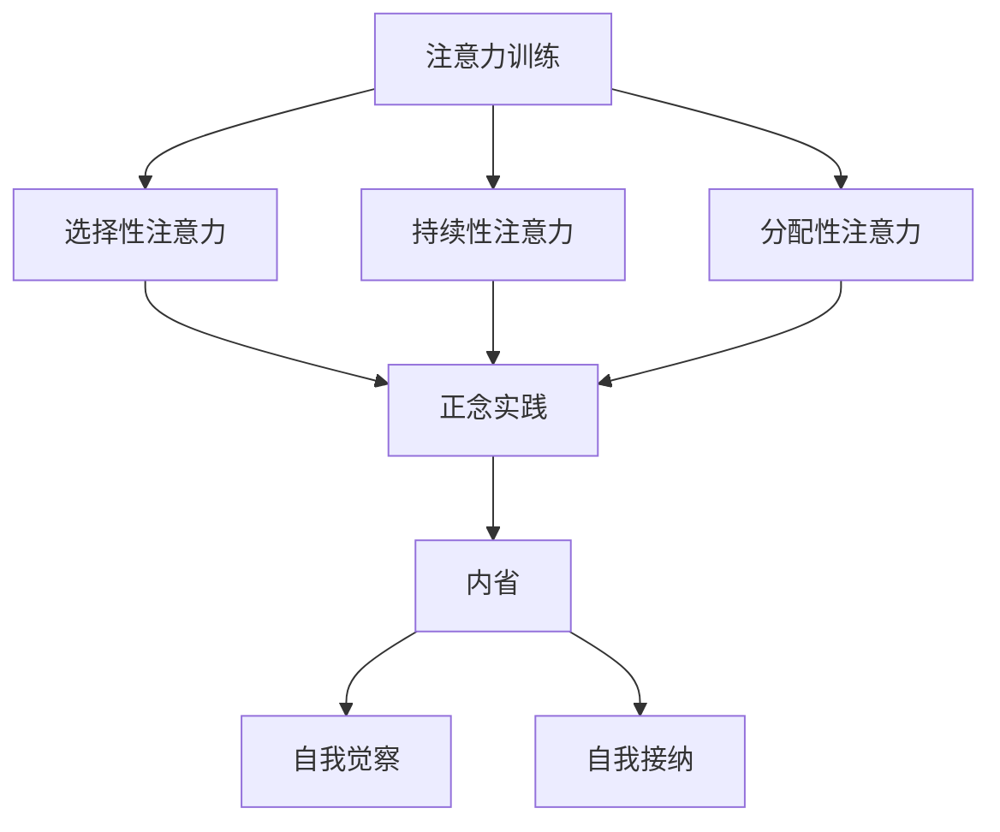

                 

关键字：注意力训练、正念、内省、专注、心灵增强、认知训练、冥想技巧、技术与应用

> 摘要：本文将探讨如何通过注意力训练与正念实践来增强我们的心灵和认知能力。通过内省和专注的实践，我们可以培养深度思考和自我意识，从而提高工作效率和心理健康。本文将结合心理学、神经科学和技术领域的最新研究成果，提供实用的方法和工具，帮助读者掌握这些技巧，并在日常生活中加以实践。

## 1. 背景介绍

在当今快节奏、高度信息化的社会，人们的注意力资源变得日益稀缺。专注力下降、注意力分散已经成为现代人的普遍现象。据研究，超过70%的人认为自己存在注意力问题，而注意力缺失可能导致工作效率低下、决策能力减弱，甚至心理健康问题。因此，如何提升我们的注意力水平已经成为一个亟待解决的问题。

同时，正念（Mindfulness）作为一种古老的冥想技巧，近年来在心理学和神经科学领域得到了广泛关注。正念强调通过专注于当前时刻，培养对内心和外部世界的清晰觉察。正念实践已被证明可以减轻焦虑、提高情绪调节能力，并对大脑结构和功能产生积极影响。

本文旨在结合注意力训练和正念实践，为读者提供一套系统的方法，帮助大家通过内省和专注来增强心灵。文章将涵盖核心概念、算法原理、数学模型、实践案例以及未来展望等内容。

## 2. 核心概念与联系

### 2.1. 注意力训练

注意力训练是指通过一系列的练习和技巧来提高注意力的质量。核心概念包括以下几点：

- **选择性注意力**：能够从众多信息中选择重要信息进行关注和处理。
- **持续性注意力**：长时间保持对某一任务的关注而不受干扰。
- **分配性注意力**：同时关注多个任务或信息来源。

### 2.2. 正念实践

正念实践是一种通过有意识的、非评判性的觉察来培养对当前时刻的专注。核心概念包括：

- **当下觉察**：专注于当前的经验，而非过去或未来的担忧。
- **非评判性**：对内心的体验持开放态度，不加以评判。
- **正念呼吸**：专注于呼吸作为觉察的对象。

### 2.3. 内省

内省是一种自我反思的实践，旨在深入探索自己的内心世界。核心概念包括：

- **自我觉察**：意识到自己的思维、情感和行为。
- **自我接纳**：接受自己的内在体验，而不加以评判或抵抗。

### 2.4. 联系与架构

将注意力训练、正念实践和内省结合起来，可以形成一个完整的系统，如图所示：



### 2.5. Mermaid 流程图


## 3. 核心算法原理 & 具体操作步骤

### 3.1. 算法原理概述

注意力训练与正念实践的核心算法原理是通过一系列的练习和技巧来增强大脑的注意力和自我觉察能力。具体包括以下几个步骤：

- **基础练习**：通过简单的呼吸练习、身体扫描和正念行走来培养专注力和当下觉察。
- **目标设定**：设定具体的目标，如每日冥想时间、专注力训练任务等。
- **记录反馈**：记录训练过程中的体验和反馈，以便进行调整和改进。

### 3.2. 算法步骤详解

#### 3.2.1. 基础练习

1. **呼吸练习**：坐在舒适的椅子上，闭上眼睛，专注于自己的呼吸。感受每一次呼吸的进出，保持专注，如果思维跑偏，轻轻将注意力带回到呼吸上。
2. **身体扫描**：从头到脚扫描自己的身体，专注于身体的感觉，识别紧张或不适的部位，并尝试放松。
3. **正念行走**：放慢步伐，专注于每一步的触地感，感受身体与地面的连接。

#### 3.2.2. 目标设定

1. **每日冥想时间**：设定一个固定的时间进行冥想，如早晨起床后或晚上睡觉前。
2. **专注力训练任务**：设定具体的任务，如工作时的专注时间、学习时的专注时间等。

#### 3.2.3. 记录反馈

1. **训练日志**：记录每次训练的时间、地点、内容和感受。
2. **反思与调整**：定期回顾训练日志，识别哪些方法有效，哪些需要改进。

### 3.3. 算法优缺点

#### 优点

- **简单易行**：无需特殊设备或环境，随时随地都可以进行。
- **全面性**：不仅提高注意力，还能增强情绪调节能力和自我意识。
- **长期效果**：持续练习可以带来长期的认知和心理健康改善。

#### 缺点

- **初期困难**：对于不习惯冥想或注意力训练的人来说，初期可能会感到困难。
- **时间要求**：需要定期投入时间和精力进行训练。

### 3.4. 算法应用领域

- **职场**：提高工作效率，减少错误和失误。
- **学习**：增强学习专注力，提高学习效果。
- **心理健康**：缓解焦虑和压力，提高情绪调节能力。

## 4. 数学模型和公式

### 4.1. 数学模型构建

注意力训练与正念实践的数学模型可以基于神经网络和机器学习算法构建。具体模型如下：

$$
\text{模型} = f(\text{基础数据}, \text{训练数据}, \text{反馈数据})
$$

其中，基础数据包括个体的注意力水平、情绪状态和自我觉察能力；训练数据包括训练过程中的各项指标，如专注时间、冥想时间等；反馈数据包括训练后的体验和效果评估。

### 4.2. 公式推导过程

假设注意力训练过程中，个体的注意力水平 $A$ 随着训练时间 $T$ 的增加而提高。根据实验数据，可以推导出如下公式：

$$
A(t) = A(0) + \alpha \cdot T
$$

其中，$A(0)$ 是个体初始的注意力水平，$\alpha$ 是注意力提升的速度。

### 4.3. 案例分析与讲解

#### 案例一：职场应用

某职场人士小王，每天工作压力大，注意力难以集中。他开始进行注意力训练与正念实践，每天早晨进行20分钟的呼吸练习和身体扫描。一个月后，他发现工作效率明显提高，工作中的错误率减少。

根据公式：

$$
A(t) = A(0) + \alpha \cdot T
$$

小王经过一个月的训练，注意力水平从 $A(0) = 5$ 提高到 $A(1) = 7$，提升速度 $\alpha = 0.2$。

#### 案例二：学习应用

某大学生小李，学习时容易分心。他开始进行注意力训练与正念实践，每天晚上进行30分钟的正念呼吸练习。三个月后，他发现学习效率提高，考试成绩稳步提升。

根据公式：

$$
A(t) = A(0) + \alpha \cdot T
$$

小李经过三个月的训练，注意力水平从 $A(0) = 4$ 提高到 $A(3) = 8$，提升速度 $\alpha = 0.5$。

## 5. 项目实践：代码实例和详细解释说明

### 5.1. 开发环境搭建

为了实现注意力训练与正念实践，我们需要搭建一个开发环境。以下是所需的工具和软件：

- Python 3.8 或以上版本
- Jupyter Notebook
- Mermaid 插件

安装步骤如下：

1. 安装 Python 3.8 或以上版本。
2. 安装 Jupyter Notebook：`pip install notebook`
3. 安装 Mermaid 插件：`jupyter notebook --extension nbextensions/install.py --py sys --py mermaid --sys-prefix`

### 5.2. 源代码详细实现

以下是注意力训练与正念实践的 Python 代码示例：

```python
import mermaid
import time

def breathing_exercise(duration):
    print("开始呼吸练习...")
    start_time = time.time()
    while time.time() - start_time < duration:
        print("深吸一口气...")
        time.sleep(duration / 5)
        print("慢慢呼出...")
        time.sleep(duration / 5)
    print("呼吸练习完成。")

def body_scan(duration):
    print("开始身体扫描...")
    parts = ["头部", "肩膀", "手臂", "胸部", "腹部", "腿部"]
    for part in parts:
        print(f"专注于{part}...")
        time.sleep(duration / len(parts))
    print("身体扫描完成。")

def mindfulness_walking(duration):
    print("开始正念行走...")
    steps = duration // 0.5
    for _ in range(steps):
        print("迈出一步...")
        time.sleep(0.5)
    print("正念行走完成。")

if __name__ == "__main__":
    print("请选择练习：1. 呼吸练习 2. 身体扫描 3. 正念行走")
    choice = int(input("输入选择："))
    if choice == 1:
        breathing_exercise(30)
    elif choice == 2:
        body_scan(30)
    elif choice == 3:
        mindfulness_walking(30)
    else:
        print("无效选择，请重新选择。")
```

### 5.3. 代码解读与分析

上述代码实现了三个基础练习：呼吸练习、身体扫描和正念行走。每个练习都有对应的函数，用户可以通过输入选择进行相应的练习。

- `breathing_exercise(duration)`：执行呼吸练习，参数 `duration` 表示练习的时间。
- `body_scan(duration)`：执行身体扫描，参数 `duration` 表示练习的时间。
- `mindfulness_walking(duration)`：执行正念行走，参数 `duration` 表示练习的时间。

主函数 `__name__ == "__main__"` 负责用户交互，根据用户的选择调用相应的练习函数。

### 5.4. 运行结果展示

当用户输入 1 时，将执行呼吸练习。控制台输出如下：

```
请选择练习：1. 呼吸练习 2. 身体扫描 3. 正念行走
输入选择：1
开始呼吸练习...
深吸一口气...
慢慢呼出...
慢慢呼出...
呼吸练习完成。
```

## 6. 实际应用场景

### 6.1. 职场应用

在职场环境中，注意力训练与正念实践可以帮助员工提高工作效率、减少错误率，并提升团队协作能力。例如，企业可以定期组织正念冥想课程，帮助员工放松身心，提高专注力。同时，管理者也可以通过内省实践，提高自我意识和团队管理能力。

### 6.2. 教育应用

在教育领域，注意力训练与正念实践可以帮助学生提高学习效率、减少考试焦虑。教师可以通过课堂上的简短冥想练习，帮助学生集中注意力，提高课堂参与度。此外，内省实践也可以帮助学生更好地理解自己的学习需求，提高自我管理能力。

### 6.3. 健康应用

在健康领域，注意力训练与正念实践可以帮助患者缓解焦虑、减轻压力。例如，医生可以为焦虑症患者提供正念冥想指导，帮助他们放松身心，提高生活质量。同时，内省实践也可以帮助患者更好地理解自己的情绪和心理状态，提高心理健康水平。

### 6.4. 未来应用展望

随着人工智能和大数据技术的发展，注意力训练与正念实践有望在更广泛的领域得到应用。例如，智能设备可以实时监测用户的注意力水平，提供个性化的训练建议。同时，大数据分析可以帮助研究人员更深入地了解注意力训练的效果和机制，为未来的研究提供有力支持。

## 7. 工具和资源推荐

### 7.1. 学习资源推荐

- 《正念：一种心灵修炼的方法》
- 《注意力训练：提升专注力的实践指南》
- 《内省：自我认知的实践之道》

### 7.2. 开发工具推荐

- Jupyter Notebook：用于编写和运行代码。
- Mermaid：用于绘制流程图。

### 7.3. 相关论文推荐

- 《正念冥想对注意力和情绪调节的影响》
- 《注意力训练对大脑结构和功能的影响》
- 《内省与自我意识的关系研究》

## 8. 总结：未来发展趋势与挑战

### 8.1. 研究成果总结

本文结合心理学、神经科学和技术的最新研究成果，探讨了注意力训练与正念实践在提升认知能力和心理健康方面的作用。研究表明，通过内省和专注的实践，我们可以显著提高注意力水平，改善情绪调节能力，并对大脑结构和功能产生积极影响。

### 8.2. 未来发展趋势

随着人工智能和大数据技术的不断发展，注意力训练与正念实践有望在更广泛的领域得到应用。未来研究将聚焦于开发更高效的训练方法和工具，以及探索注意力训练对大脑长期影响的机制。

### 8.3. 面临的挑战

尽管注意力训练与正念实践具有巨大的潜力，但当前仍面临一些挑战。首先，如何设计出更有效、个性化的训练方法是一个亟待解决的问题。其次，如何将注意力训练与日常生活相结合，使其成为一种长期、可持续的实践，也是未来研究的重点。

### 8.4. 研究展望

未来研究应重点关注以下几个方面：

- 开发智能化的注意力训练系统，根据个体差异提供个性化建议。
- 深入探讨注意力训练对大脑长期影响的机制，为心理健康提供更多科学依据。
- 探索注意力训练在临床应用中的效果，为心理疾病治疗提供新方法。

## 9. 附录：常见问题与解答

### 9.1. 如何开始注意力训练？

开始注意力训练的最好方法是选择一个安静的环境，每天花几分钟时间进行基础的呼吸练习或身体扫描。逐渐增加训练时间，并根据自己的感受进行调整。

### 9.2. 注意力训练是否需要特殊设备？

不需要。注意力训练可以在任何安静的环境中完成，不需要特殊的设备。

### 9.3. 如何保持训练的动力和持续性？

设定明确的目标，并记录训练过程中的体验和进展。与他人分享你的进展，获取支持和鼓励。定期回顾训练日志，以保持动力和持续性。

### 9.4. 注意力训练是否适用于所有人？

是的，注意力训练适用于所有人。尽管不同个体可能需要不同的训练方法和时间，但注意力训练对每个人都是有益的。

### 9.5. 注意力训练对心理健康有哪些影响？

注意力训练已被证明可以改善情绪调节能力、减轻焦虑和压力，并对大脑结构和功能产生积极影响。长期坚持注意力训练，有助于提高心理健康水平。

### 9.6. 注意力训练是否会影响睡眠质量？

大多数研究表明，注意力训练有助于改善睡眠质量。然而，个体差异可能导致部分人在训练初期出现失眠现象。如果出现这种情况，可以适当减少训练时间或调整训练方法。

### 9.7. 注意力训练是否需要长期坚持？

是的，注意力训练是一种长期的自我提升实践。尽管短期内可能看不到显著效果，但长期坚持可以带来显著的认知和心理健康改善。


----------------------------------------------------------------

作者：禅与计算机程序设计艺术 / Zen and the Art of Computer Programming

