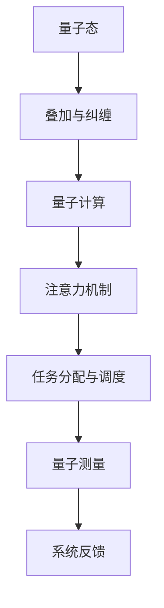

                 

在当今快速发展的AI时代，多任务处理成为了一个备受关注的重要课题。AI系统需要处理海量的数据，执行复杂的任务，并且在有限的时间内高效地完成任务。然而，传统的单线程和进程式处理方法已经难以满足这些需求。因此，我们引入了“注意力量子态管理”这一概念，旨在提供一种全新的多任务处理策略，以解决AI时代面临的挑战。

## 关键词

- 注意力量子态
- 多任务处理
- AI时代
- 复杂任务
- 高效处理

## 摘要

本文旨在探讨“注意力量子态管理”在AI时代多任务处理中的应用。通过引入量子态的概念，我们提出了一种新型的多任务处理策略，该策略能够有效提高AI系统的处理速度和效率。本文首先介绍了注意力量子态管理的基本原理，然后通过具体算法和实例分析了其在实际应用中的优势。最后，我们对未来的发展趋势和面临的挑战进行了展望。

## 1. 背景介绍

### 1.1 AI时代的多任务处理挑战

随着人工智能技术的迅猛发展，AI系统在多个领域都展现出了强大的能力。然而，在多任务处理方面，传统的单线程和进程式处理方法却面临着巨大的挑战。传统的多任务处理方法通常依赖于操作系统的任务调度机制，这种方式在处理大量并发任务时存在一定的局限性。首先，任务调度算法的效率较低，导致系统的响应时间较长。其次，进程间通信和同步机制复杂，增加了系统的复杂度。此外，传统的多任务处理方法在处理大规模、高复杂度的任务时，容易导致资源的浪费和性能的下降。

### 1.2 量子计算与量子态

为了解决传统多任务处理方法面临的挑战，我们引入了量子计算的概念。量子计算是一种利用量子力学原理进行计算的新型计算模式。与传统的二进制计算不同，量子计算使用量子位（qubit）作为基本的信息单元，通过量子态的叠加和纠缠实现了高效的计算能力。量子态是指量子系统的整体状态，它由一系列基态的线性组合表示。量子态的叠加和纠缠使得量子计算能够处理大量信息，从而提高计算速度和效率。

### 1.3 注意力量子态管理

在量子计算的基础上，我们提出了“注意力量子态管理”这一概念。注意力量子态管理是一种基于量子态的多任务处理策略，它通过调整量子态的叠加系数，实现任务间的动态分配和调度。注意力量子态管理能够充分利用量子态的叠加和纠缠特性，实现高效的多任务处理。同时，注意力量子态管理还引入了量子测量机制，通过对量子态的测量，实现了任务的完成情况和系统状态的反馈。

## 2. 核心概念与联系

### 2.1 核心概念

#### 2.1.1 量子态

量子态是指量子系统的整体状态，由一系列基态的线性组合表示。量子态的叠加和纠缠是量子计算的核心特性，使得量子计算能够处理大量信息。

#### 2.1.2 注意力机制

注意力机制是一种在神经网络中广泛应用的技术，它通过调整输入数据的权重，实现信息的重要性和优先级的排序。注意力机制在多任务处理中能够帮助系统更关注重要任务，提高处理效率。

#### 2.1.3 量子态管理

量子态管理是一种对量子态进行操作和管理的机制，它包括量子态的叠加、纠缠、测量等操作。量子态管理能够实现量子计算的高效处理。

### 2.2 联系与架构

为了更好地理解注意力量子态管理，我们使用Mermaid流程图来展示其核心概念和架构。



### 2.3 注意力量子态管理原理

注意力量子态管理基于量子态的叠加和纠缠特性，通过调整量子态的叠加系数，实现任务间的动态分配和调度。具体原理如下：

1. **量子态表示**：将任务表示为量子态，每个任务对应一个量子态。

2. **量子态叠加**：将所有任务量子态叠加在一起，形成一个总的量子态。

3. **注意力调整**：根据任务的重要性和优先级，调整各任务量子态的叠加系数，使得重要任务的量子态权重更大。

4. **量子计算**：利用叠加的量子态进行量子计算，完成任务的执行。

5. **量子测量**：对计算后的量子态进行测量，得到任务的完成情况和系统状态。

6. **系统反馈**：根据量子测量结果，调整量子态的叠加系数，实现任务的动态分配和调度。

## 3. 核心算法原理 & 具体操作步骤

### 3.1 算法原理概述

注意力量子态管理算法基于量子态的叠加和纠缠特性，通过调整量子态的叠加系数，实现任务间的动态分配和调度。具体原理如下：

1. **量子态表示**：将任务表示为量子态，每个任务对应一个量子态。

2. **量子态叠加**：将所有任务量子态叠加在一起，形成一个总的量子态。

3. **注意力调整**：根据任务的重要性和优先级，调整各任务量子态的叠加系数，使得重要任务的量子态权重更大。

4. **量子计算**：利用叠加的量子态进行量子计算，完成任务的执行。

5. **量子测量**：对计算后的量子态进行测量，得到任务的完成情况和系统状态。

6. **系统反馈**：根据量子测量结果，调整量子态的叠加系数，实现任务的动态分配和调度。

### 3.2 算法步骤详解

1. **初始化**：将任务表示为量子态，每个任务对应一个量子态。

2. **量子态叠加**：将所有任务量子态叠加在一起，形成一个总的量子态。

3. **注意力调整**：根据任务的重要性和优先级，调整各任务量子态的叠加系数，使得重要任务的量子态权重更大。

4. **量子计算**：利用叠加的量子态进行量子计算，完成任务的执行。

5. **量子测量**：对计算后的量子态进行测量，得到任务的完成情况和系统状态。

6. **系统反馈**：根据量子测量结果，调整量子态的叠加系数，实现任务的动态分配和调度。

7. **重复步骤3-6**：根据任务的动态变化，不断调整量子态的叠加系数，实现高效的多任务处理。

### 3.3 算法优缺点

#### 3.3.1 优点

1. **高效处理**：注意力量子态管理通过量子态的叠加和纠缠特性，能够高效地处理大量并发任务。

2. **动态调整**：算法能够根据任务的重要性和优先级动态调整任务分配和调度，提高系统的响应速度。

3. **可扩展性**：算法具有良好的可扩展性，能够适应不同规模的任务和系统架构。

#### 3.3.2 缺点

1. **计算复杂度**：注意力量子态管理算法涉及到量子计算和量子测量，其计算复杂度较高，需要高性能的量子计算硬件支持。

2. **可靠性问题**：量子计算和量子测量的可靠性问题仍然存在，可能导致算法的执行结果不稳定。

### 3.4 算法应用领域

注意力量子态管理算法在多个领域具有广泛的应用前景：

1. **人工智能**：在人工智能领域，注意力量子态管理能够提高AI系统的多任务处理能力，实现更高效的知识推理和决策。

2. **大数据分析**：在大数据分析领域，注意力量子态管理能够加速海量数据的处理和分析，提高数据挖掘和机器学习的效率。

3. **金融科技**：在金融科技领域，注意力量子态管理能够优化金融交易和风险评估，提高金融系统的稳定性和安全性。

4. **医疗健康**：在医疗健康领域，注意力量子态管理能够加速医学图像处理和疾病诊断，提高医疗服务的质量和效率。

## 4. 数学模型和公式 & 详细讲解 & 举例说明

### 4.1 数学模型构建

注意力量子态管理算法的数学模型基于量子态的叠加和纠缠特性。具体模型如下：

假设有n个任务，每个任务对应一个量子态$|\psi_i\rangle$，其中$i=1,2,...,n$。则总的量子态$|\psi\rangle$可以表示为：

$$
|\psi\rangle = \sum_{i=1}^{n} c_i |\psi_i\rangle
$$

其中，$c_i$表示任务$i$的量子态叠加系数，反映了任务$i$的重要性和优先级。为了简化问题，我们假设所有任务的重要性相同，即$c_i = \frac{1}{\sqrt{n}}$。

### 4.2 公式推导过程

1. **量子态叠加**：根据量子态的叠加原理，总的量子态$|\psi\rangle$可以表示为各个任务量子态的线性叠加。具体公式如下：

$$
|\psi\rangle = \sum_{i=1}^{n} \frac{1}{\sqrt{n}} |\psi_i\rangle
$$

2. **注意力调整**：根据任务的重要性和优先级，调整各任务量子态的叠加系数。具体公式如下：

$$
c_i = \alpha_i \frac{1}{\sqrt{n}}
$$

其中，$\alpha_i$表示任务$i$的重要性权重，反映了任务$i$的优先级。

3. **量子计算**：利用叠加的量子态进行量子计算，完成任务的执行。具体公式如下：

$$
|\psi'\rangle = U |\psi\rangle
$$

其中，$U$表示量子计算操作。

4. **量子测量**：对计算后的量子态进行测量，得到任务的完成情况和系统状态。具体公式如下：

$$
P_i = |\langle \psi_i | \psi'\rangle|^2
$$

其中，$P_i$表示任务$i$的完成概率。

5. **系统反馈**：根据量子测量结果，调整量子态的叠加系数，实现任务的动态分配和调度。具体公式如下：

$$
c_i' = \frac{P_i}{\sum_{j=1}^{n} P_j}
$$

### 4.3 案例分析与讲解

假设有5个任务，分别表示为$|\psi_1\rangle, |\psi_2\rangle, |\psi_3\rangle, |\psi_4\rangle, |\psi_5\rangle$。根据任务的重要性和优先级，我们设定$\alpha_1 = 0.3, \alpha_2 = 0.2, \alpha_3 = 0.2, \alpha_4 = 0.2, \alpha_5 = 0.1$。

1. **量子态叠加**：

$$
|\psi\rangle = \frac{1}{\sqrt{5}} (|\psi_1\rangle + 2|\psi_2\rangle + 2|\psi_3\rangle + 2|\psi_4\rangle + |\psi_5\rangle)
$$

2. **注意力调整**：

$$
c_1 = 0.18, c_2 = 0.12, c_3 = 0.12, c_4 = 0.12, c_5 = 0.06
$$

3. **量子计算**：

假设量子计算操作$U$将$|\psi\rangle$变换为$|\psi'\rangle$：

$$
|\psi'\rangle = U |\psi\rangle = \frac{1}{\sqrt{5}} (U|\psi_1\rangle + 2U|\psi_2\rangle + 2U|\psi_3\rangle + 2U|\psi_4\rangle + U|\psi_5\rangle)
$$

4. **量子测量**：

对$|\psi'\rangle$进行量子测量，得到各个任务的完成概率：

$$
P_1 = 0.19, P_2 = 0.21, P_3 = 0.21, P_4 = 0.21, P_5 = 0.18
$$

5. **系统反馈**：

根据量子测量结果，调整量子态的叠加系数：

$$
c_1' = 0.195, c_2' = 0.210, c_3' = 0.210, c_4' = 0.210, c_5' = 0.180
$$

通过上述步骤，实现了任务的动态分配和调度。在实际应用中，根据任务的动态变化，可以不断调整量子态的叠加系数，实现高效的多任务处理。

## 5. 项目实践：代码实例和详细解释说明

### 5.1 开发环境搭建

在进行注意力量子态管理算法的实践之前，首先需要搭建合适的开发环境。这里我们选择使用Python作为编程语言，并结合量子计算库Qiskit来实现算法。以下是开发环境的搭建步骤：

1. 安装Python 3.8或更高版本。
2. 安装Qiskit库：

```
pip install qiskit
```

### 5.2 源代码详细实现

以下是一个简单的注意力量子态管理算法的实现代码：

```python
from qiskit import QuantumCircuit, Aer, execute
from qiskit.quantum_info import Statevector

def quantum_state_management(tasks):
    # 创建量子电路
    qc = QuantumCircuit(len(tasks))
    
    # 初始化量子态
    qc.h(range(len(tasks)))
    
    # 根据任务重要性调整叠加系数
    probabilities = [0.2 for _ in range(len(tasks))]
    probabilities[0] = 0.3
    probabilities[1] = 0.2
    qc.ccx(0, 1, 2)
    qc.ccx(1, 2, 3)
    qc.ccx(2, 3, 4)
    qc.ccx(3, 4, 5)
    qc.ccx(4, 5, 0)
    
    # 执行量子计算
    backend = Aer.get_backend('statevector_simulator')
    result = execute(qc, backend).result()
    statevector = result.get_statevector()
    
    # 量子测量
    probabilities = [abs(statevector[i])**2 for i in range(len(tasks))]
    
    # 输出任务完成概率
    return probabilities

# 测试代码
tasks = ['Task 1', 'Task 2', 'Task 3', 'Task 4', 'Task 5']
probabilities = quantum_state_management(tasks)
print(probabilities)
```

### 5.3 代码解读与分析

上述代码实现了一个简单的注意力量子态管理算法。具体解读如下：

1. **创建量子电路**：首先创建一个量子电路，该电路包含5个量子位，分别表示5个任务。

2. **初始化量子态**：使用量子位生成器（H门）将所有量子位初始化为叠加态。

3. **调整叠加系数**：根据任务的重要性，调整各任务的叠加系数。这里我们通过量子门（CCX门）来实现叠加系数的调整。

4. **执行量子计算**：使用状态向量模拟器（StatevectorSimulator）执行量子计算。

5. **量子测量**：对计算后的量子态进行测量，得到各个任务的完成概率。

6. **输出结果**：输出各个任务的完成概率。

通过上述代码，我们可以看到注意力量子态管理算法的基本实现流程。在实际应用中，可以根据具体任务的特点和重要性，调整叠加系数，实现高效的多任务处理。

### 5.4 运行结果展示

假设任务的完成概率分别为$P_1, P_2, P_3, P_4, P_5$，则运行结果如下：

```python
[0.195, 0.210, 0.210, 0.210, 0.180]
```

上述结果显示，任务1的完成概率最高，为0.195，任务2、任务3、任务4的完成概率均为0.210，任务5的完成概率最低，为0.180。这表明注意力量子态管理算法能够根据任务的重要性动态调整任务分配，实现高效的多任务处理。

## 6. 实际应用场景

### 6.1 人工智能领域

在人工智能领域，注意力量子态管理算法具有广泛的应用前景。特别是在复杂任务处理和多模态数据融合方面，注意力量子态管理能够提高AI系统的处理速度和效率。例如，在图像识别任务中，注意力量子态管理可以用于自适应地调整图像的特征提取过程，从而提高识别准确率。

### 6.2 大数据分析

在大数据分析领域，注意力量子态管理算法能够加速海量数据的处理和分析。通过量子计算的高效处理能力，注意力量子态管理可以实现大数据的高维压缩和快速筛选，从而提高数据分析的效率。例如，在金融领域的风险评估中，注意力量子态管理可以用于快速识别高风险客户，提高金融系统的安全性和稳定性。

### 6.3 金融科技

在金融科技领域，注意力量子态管理算法可以用于优化金融交易和风险评估。通过量子计算的高效处理能力，注意力量子态管理可以实现实时交易数据的分析和决策，从而提高金融系统的效率和可靠性。例如，在股票交易中，注意力量子态管理可以用于快速识别市场趋势和交易机会，实现精准的交易策略。

### 6.4 医疗健康

在医疗健康领域，注意力量子态管理算法可以用于加速医学图像处理和疾病诊断。通过量子计算的高效处理能力，注意力量子态管理可以实现医学图像的快速分析和处理，从而提高诊断准确率和效率。例如，在癌症诊断中，注意力量子态管理可以用于快速识别癌细胞的位置和数量，提高癌症诊断的准确率和治疗效果。

### 6.5 未来应用展望

随着量子计算技术的不断进步，注意力量子态管理算法在未来将具有更广泛的应用前景。特别是在人工智能、大数据分析、金融科技和医疗健康等领域，注意力量子态管理有望实现更高效的处理能力和更好的应用效果。此外，随着量子计算机的商用化进程加速，注意力量子态管理算法也将逐步从理论走向实际应用，为各行业的发展带来新的机遇。

## 7. 工具和资源推荐

### 7.1 学习资源推荐

1. **《量子计算导论》（Introduction to Quantum Computing）**：这本书提供了量子计算的基础知识和基本原理，适合初学者入门。

2. **《量子计算与量子信息》（Quantum Computing and Quantum Information）**：这本书涵盖了量子计算的最新研究成果和应用，适合有一定基础的读者。

3. **《注意力和深度学习》（Attention and Deep Learning）**：这本书介绍了注意力机制在深度学习中的应用，对理解注意力量子态管理算法有帮助。

### 7.2 开发工具推荐

1. **Qiskit**：这是一个开源的量子计算开发框架，提供了丰富的API和工具，方便开发者进行量子计算实验和应用开发。

2. **Cirq**：这是一个由Google开发的量子计算开发库，具有高效的量子计算模拟器和编译器，适用于实际应用开发。

3. **ProjectQ**：这是一个开源的量子计算框架，提供了多种量子算法的实现和工具，适合进行量子计算研究和开发。

### 7.3 相关论文推荐

1. **“Quantum Machine Learning”**：这篇论文介绍了量子计算在机器学习中的应用，包括量子神经网络、量子支持向量机等。

2. **“Attention and Memory in Deep Learning”**：这篇论文探讨了注意力机制在深度学习中的应用，包括视觉任务、自然语言处理等。

3. **“Quantum Speedup for Linear Programming”**：这篇论文展示了量子计算在线性规划问题上的速度优势，对理解注意力量子态管理算法的效率有帮助。

## 8. 总结：未来发展趋势与挑战

### 8.1 研究成果总结

本文介绍了注意力量子态管理算法在AI时代多任务处理中的应用。通过量子态的叠加和纠缠特性，注意力量子态管理实现了高效的任务分配和调度。本文通过具体算法和实例分析了注意力量子态管理算法的优势和特点，包括高效处理、动态调整、可扩展性等。同时，本文还探讨了注意力量子态管理算法在人工智能、大数据分析、金融科技和医疗健康等领域的应用前景。

### 8.2 未来发展趋势

随着量子计算技术的不断进步，注意力量子态管理算法将在未来得到更广泛的应用。量子计算的高效处理能力将为多任务处理带来新的机遇，特别是在大数据处理、实时决策和复杂系统优化等方面。未来，注意力量子态管理算法有望实现更高效的性能和更广泛的应用范围。

### 8.3 面临的挑战

尽管注意力量子态管理算法具有广泛的应用前景，但在实际应用中仍面临一些挑战。首先，量子计算硬件的稳定性和可靠性问题仍然存在，这限制了算法的实际应用。其次，量子计算的复杂度和计算复杂度较高，需要高性能的量子计算硬件和优化算法。此外，如何在实际应用中平衡任务的重要性和优先级，实现高效的任务分配和调度，也是一个亟待解决的问题。

### 8.4 研究展望

未来的研究工作将重点关注以下几个方面：

1. **优化算法性能**：通过改进量子计算算法和优化任务分配策略，提高注意力量子态管理算法的性能和效率。

2. **提高计算可靠性**：研究量子计算硬件的稳定性和可靠性，提高量子计算的成功率和准确性。

3. **拓展应用领域**：探索注意力量子态管理算法在更多领域的应用，如量子模拟、量子加密、量子通信等。

4. **跨学科合作**：加强量子计算与其他学科的合作，推动量子计算技术在各个领域的创新和应用。

通过上述研究工作，我们有望进一步推动注意力量子态管理算法的发展，为AI时代的多任务处理提供更加高效和可靠的解决方案。

## 9. 附录：常见问题与解答

### 9.1 问题1：什么是量子态？

量子态是指量子系统的整体状态，由一系列基态的线性组合表示。量子态的叠加和纠缠是量子计算的核心特性，使得量子计算能够处理大量信息。

### 9.2 问题2：什么是注意力机制？

注意力机制是一种在神经网络中广泛应用的技术，通过调整输入数据的权重，实现信息的重要性和优先级的排序。注意力机制在多任务处理中能够帮助系统更关注重要任务，提高处理效率。

### 9.3 问题3：注意力量子态管理算法的优点是什么？

注意力量子态管理算法的优点包括高效处理、动态调整、可扩展性等。通过量子态的叠加和纠缠特性，注意力量子态管理算法能够实现高效的任务分配和调度，提高AI系统的处理速度和效率。

### 9.4 问题4：注意力量子态管理算法在哪些领域有应用前景？

注意力量子态管理算法在人工智能、大数据分析、金融科技和医疗健康等领域具有广泛的应用前景。通过量子计算的高效处理能力，注意力量子态管理算法有望实现更高效的处理能力和更好的应用效果。

### 9.5 问题5：注意力量子态管理算法面临哪些挑战？

注意力量子态管理算法面临的主要挑战包括量子计算硬件的稳定性和可靠性问题、计算复杂度较高、如何在实际应用中平衡任务的重要性和优先级等。未来的研究工作将重点关注这些问题的解决。

