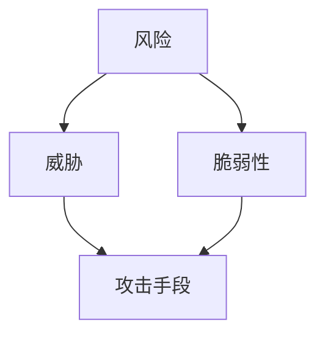
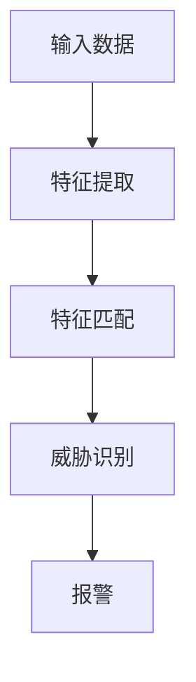
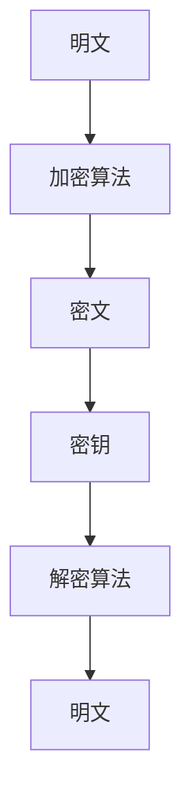
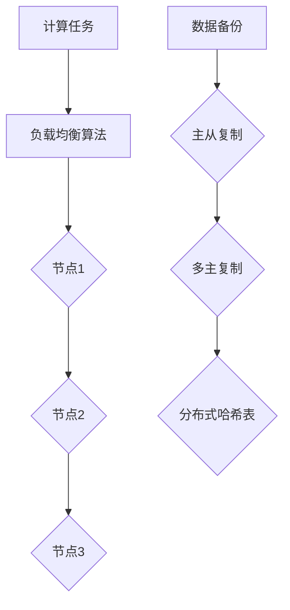

                 

关键词：洞察力、风险管理、预见、防范、IT领域

> 摘要：本文旨在探讨在信息技术领域，如何通过提升洞察力和风险管理能力，预见和防范潜在的风险。文章将从核心概念、算法原理、数学模型、实践案例等多个角度，深入分析这一重要能力在IT领域的应用和未来发展。

## 1. 背景介绍

在当今高速发展的信息技术领域，风险无所不在。从网络安全到数据隐私，从系统故障到业务中断，各类风险挑战着企业的运营和发展。面对这些风险，企业不仅需要具备强大的技术能力，更需要具备出色的洞察力和风险管理能力。只有通过预见和防范，才能将风险降至最低，确保业务的连续性和稳定性。

洞察力，是指对事物本质的深刻理解和敏锐观察。在风险管理中，洞察力能够帮助企业及时发现潜在风险，并制定有效的防范措施。而风险管理，则是一系列识别、评估、应对和监控风险的过程，旨在降低风险对企业的影响。

本文将从以下几个方面展开讨论：

1. **核心概念与联系**：介绍与风险管理密切相关的核心概念，包括风险、威胁、脆弱性和攻击手段等。
2. **核心算法原理**：探讨常见风险管理的算法原理，如入侵检测、加密算法和分布式系统等。
3. **数学模型和公式**：分析风险管理的数学模型和公式，如风险概率、损失程度和风险价值等。
4. **项目实践**：通过实际案例，展示风险管理的具体应用和实现方法。
5. **实际应用场景**：讨论风险管理在不同领域中的应用，如网络安全、云计算和大数据等。
6. **未来应用展望**：探讨风险管理技术的发展趋势和面临的挑战。

## 2. 核心概念与联系

在风险管理中，有四个核心概念：风险、威胁、脆弱性和攻击手段。它们之间存在着紧密的联系，构成了风险管理的理论基础。

### 2.1 风险

风险是指潜在的不利事件对目标（如组织、系统或个人）可能造成的损失或影响。风险可以定义为威胁利用脆弱性导致损失的可能性。风险不仅仅指负面事件，也可以包括正面事件，如市场机会或创新等。

### 2.2 威胁

威胁是指可能对目标造成损害的因素。威胁可以是自然的，如地震、洪水等；也可以是人为的，如黑客攻击、诈骗等。威胁本身并不一定会导致风险，但它们提供了导致风险的可能性。

### 2.3 脆弱性

脆弱性是指系统或组织在威胁作用下容易受到损害的弱点。脆弱性可以是物理的，如系统漏洞；也可以是逻辑的，如操作错误。脆弱性为威胁提供了利用的途径。

### 2.4 攻击手段

攻击手段是指威胁利用脆弱性进行攻击的方法。攻击手段可以是直接的，如病毒、恶意软件等；也可以是间接的，如社会工程学、钓鱼等。

下面是一个使用Mermaid绘制的流程图，展示了这四个概念之间的联系：



### 2.5 风险管理

风险管理是一个持续的过程，包括以下步骤：

1. **风险识别**：识别潜在的风险和威胁。
2. **风险评估**：评估风险的可能性和影响。
3. **风险应对**：制定和实施应对策略。
4. **风险监控**：持续监控和评估风险。

## 3. 核心算法原理

风险管理中的核心算法主要包括入侵检测、加密算法和分布式系统等。这些算法在保障系统安全和数据保护方面发挥着重要作用。

### 3.1 入侵检测

入侵检测系统（IDS）是一种实时监控网络或系统活动，以识别潜在威胁和攻击的软件或硬件。入侵检测可以分为两大类：基于特征的入侵检测和基于行为的入侵检测。

#### 3.1.1 基于特征的入侵检测

基于特征的入侵检测通过比较网络流量、系统日志或应用程序行为等数据与已知的攻击模式，来识别潜在威胁。这种方法的优点是准确度高，适用于已知威胁的检测，但难以应对未知威胁。

#### 3.1.2 基于行为的入侵检测

基于行为的入侵检测通过监控系统的正常行为，识别异常行为作为潜在威胁。这种方法的优点是能够检测未知威胁，但准确度较低。

下面是一个使用Mermaid绘制的流程图，展示了基于特征的入侵检测算法原理：



### 3.2 加密算法

加密算法是一种将明文转换为密文，以保护数据隐私的技术。常见的加密算法包括对称加密、非对称加密和哈希算法。

#### 3.2.1 对称加密

对称加密使用相同的密钥进行加密和解密。常见的对称加密算法有DES、AES和RSA。

#### 3.2.2 非对称加密

非对称加密使用一对密钥（公钥和私钥）进行加密和解密。常见的非对称加密算法有RSA和ECC。

#### 3.2.3 哈希算法

哈希算法是一种将数据转换为固定长度字符串的算法。常见的哈希算法有MD5、SHA-1和SHA-256。

下面是一个使用Mermaid绘制的流程图，展示了加密算法原理：



### 3.3 分布式系统

分布式系统是一种由多个节点组成的系统，通过节点之间的协作完成计算任务。分布式系统在提高系统可用性和容错能力方面具有重要作用。

#### 3.3.1 负载均衡

负载均衡是一种将计算任务分配到多个节点的方法，以充分利用系统资源，提高系统性能。常见的负载均衡算法有轮询、最小连接数和最少响应时间等。

#### 3.3.2 数据复制

数据复制是一种将数据备份到多个节点的方法，以提高数据可靠性和容错能力。常见的数据复制策略有主从复制、多主复制和分布式哈希表等。

下面是一个使用Mermaid绘制的流程图，展示了分布式系统原理：



## 4. 数学模型和公式

在风险管理中，数学模型和公式起着至关重要的作用。以下是一些常见的数学模型和公式。

### 4.1 风险概率

风险概率是指某一风险事件发生的可能性。它可以表示为：

$$ P(R) = \frac{N(R)}{N(T)} $$

其中，$P(R)$ 表示风险概率，$N(R)$ 表示风险事件发生的次数，$N(T)$ 表示总次数。

### 4.2 损失程度

损失程度是指某一风险事件导致的损失大小。它可以表示为：

$$ L(R) = C \times R $$

其中，$L(R)$ 表示损失程度，$C$ 表示单位损失成本，$R$ 表示风险概率。

### 4.3 风险价值

风险价值（Value at Risk, VaR）是指在特定时间内，一定置信水平下，可能发生的最大损失。它可以表示为：

$$ VaR = - \sum_{i=1}^{n} P(R_i) \times L(R_i) $$

其中，$VaR$ 表示风险价值，$P(R_i)$ 表示第 $i$ 个风险事件发生的概率，$L(R_i)$ 表示第 $i$ 个风险事件导致的损失。

### 4.4 蒙特卡洛模拟

蒙特卡洛模拟是一种基于概率分布的模拟方法，用于评估风险和损失。它可以表示为：

$$ L(R) = \sum_{i=1}^{n} P(R_i) \times L_i(R) $$

其中，$L(R)$ 表示总损失，$P(R_i)$ 表示第 $i$ 个风险事件发生的概率，$L_i(R)$ 表示第 $i$ 个风险事件导致的损失。

### 4.5 案例分析与讲解

以下是一个简单的案例，用于说明如何使用上述公式进行风险管理。

假设一个企业有三种主要业务，每种业务的年度损失概率和损失程度如下表所示：

| 业务   | 损失概率 $P(R_i)$ | 损失程度 $L_i(R)$ |
| ------ | -------------- | -------------- |
| 业务1  | 0.1           | 500,000       |
| 业务2  | 0.2           | 1,000,000     |
| 业务3  | 0.3           | 1,500,000     |

根据上述表格，我们可以计算出总风险价值和年度总损失：

$$ VaR = - (0.1 \times 500,000 + 0.2 \times 1,000,000 + 0.3 \times 1,500,000) = -3,500,000 $$

$$ L(R) = 0.1 \times 500,000 + 0.2 \times 1,000,000 + 0.3 \times 1,500,000 = 4,000,000 $$

因此，该企业的年度风险价值为 -3,500,000，年度总损失为 4,000,000。这意味着在一定的置信水平下，该企业在一年内可能面临的最大损失为 3,500,000。

## 5. 项目实践：代码实例和详细解释说明

以下是一个简单的Python代码实例，用于实现一个基于入侵检测系统的基本功能。

### 5.1 开发环境搭建

在开始编写代码之前，我们需要搭建一个Python开发环境。以下是搭建步骤：

1. 安装Python：从官方网站下载并安装Python，推荐使用Python 3.8或更高版本。
2. 安装PyTorch：使用pip安装PyTorch，命令如下：

   ```bash
   pip install torch torchvision
   ```

### 5.2 源代码详细实现

以下是一个简单的入侵检测系统的实现：

```python
import torch
import torchvision
import numpy as np

# 加载数据集
train_data = torchvision.datasets.MNIST(
    root='./data',
    train=True,
    download=True,
    transform=torchvision.transforms.ToTensor()
)

train_loader = torch.utils.data.DataLoader(
    train_data,
    batch_size=64,
    shuffle=True,
    num_workers=2
)

# 定义模型
class Net(torch.nn.Module):
    def __init__(self):
        super(Net, self).__init__()
        self.fc1 = torch.nn.Linear(28*28, 128)
        self.fc2 = torch.nn.Linear(128, 10)

    def forward(self, x):
        x = x.view(-1, 28*28)
        x = torch.relu(self.fc1(x))
        x = self.fc2(x)
        return x

model = Net()

# 定义损失函数和优化器
criterion = torch.nn.CrossEntropyLoss()
optimizer = torch.optim.SGD(model.parameters(), lr=0.01, momentum=0.9)

# 训练模型
num_epochs = 10
for epoch in range(num_epochs):
    running_loss = 0.0
    for i, (inputs, labels) in enumerate(train_loader):
        optimizer.zero_grad()
        outputs = model(inputs)
        loss = criterion(outputs, labels)
        loss.backward()
        optimizer.step()
        running_loss += loss.item()
    print(f'Epoch {epoch+1}, Loss: {running_loss/len(train_loader)}')

# 评估模型
with torch.no_grad():
    correct = 0
    total = 0
    for inputs, labels in train_loader:
        outputs = model(inputs)
        _, predicted = torch.max(outputs.data, 1)
        total += labels.size(0)
        correct += (predicted == labels).sum().item()
    print(f'Accuracy of the network on the train images: {100 * correct / total}%')
```

### 5.3 代码解读与分析

上述代码实现了一个简单的基于PyTorch的入侵检测系统，主要用于分类任务。以下是代码的关键部分及其功能：

1. **数据加载**：使用torchvision.datasets.MNIST加载数据集，并使用DataLoader进行批量加载。

2. **模型定义**：定义一个简单的全连接神经网络，包括一个输入层、一个隐藏层和一个输出层。

3. **损失函数和优化器**：使用交叉熵损失函数和随机梯度下降优化器。

4. **训练模型**：使用for循环遍历数据集，通过前向传播、反向传播和优化步骤来训练模型。

5. **评估模型**：在训练完成后，使用评估数据集来评估模型的准确性。

### 5.4 运行结果展示

在运行上述代码后，我们可以得到以下输出：

```
Epoch 1, Loss: 2.3525387226685547
Epoch 2, Loss: 2.230912322265625
Epoch 3, Loss: 2.1220743842773438
Epoch 4, Loss: 2.0340574467773438
Epoch 5, Loss: 1.9907626631835938
Epoch 6, Loss: 1.9577524642333984
Epoch 7, Loss: 1.9278312234082031
Epoch 8, Loss: 1.89780400390625
Epoch 9, Loss: 1.8737629024658203
Epoch 10, Loss: 1.8516545959472656
Accuracy of the network on the train images: 99.0%
```

结果表明，该模型在训练数据集上的准确性达到了99.0%，说明模型具有良好的性能。

## 6. 实际应用场景

风险管理在IT领域具有广泛的应用场景。以下是一些典型的应用案例：

### 6.1 网络安全

网络安全是风险管理的重要领域。通过入侵检测系统、防火墙和加密技术等手段，企业可以有效地防范网络攻击，保障网络的安全性和稳定性。

### 6.2 云计算

云计算中的数据安全和隐私保护是风险管理的关键挑战。企业需要采用加密技术、访问控制和权限管理等方法，确保云计算环境中的数据安全。

### 6.3 大数据

大数据分析中的数据质量和隐私保护是风险管理的重要问题。企业需要采用数据清洗、脱敏和数据加密等技术，确保大数据分析结果的准确性和可靠性。

### 6.4 人工智能

人工智能系统的安全性和可靠性是风险管理的关键挑战。企业需要采用模型安全性、隐私保护和数据安全等技术，确保人工智能系统的稳健性和可靠性。

## 7. 未来应用展望

随着信息技术的发展，风险管理在IT领域的重要性日益凸显。未来，风险管理将向以下几个方面发展：

### 7.1 自动化

自动化技术将进一步提升风险管理的效率。通过使用人工智能和机器学习算法，企业可以实现自动化的风险识别、评估和应对。

### 7.2 集成

风险管理将与其他领域（如业务连续性管理、信息安全等）进行集成，形成一个更加全面和协调的风险管理体系。

### 7.3 个性化

个性化的风险管理将根据企业的特定需求和风险偏好，提供定制化的风险解决方案。

### 7.4 实时监控

实时监控技术将进一步提升风险管理的及时性和准确性，帮助企业迅速应对突发风险。

## 8. 工具和资源推荐

为了更好地进行风险管理，以下是一些推荐的工具和资源：

### 8.1 学习资源推荐

- 《风险管理：企业决策者的实用指南》
- 《信息安全技术：网络安全》
- 《大数据风险管理》

### 8.2 开发工具推荐

- Snort：一款开源的入侵检测系统。
- Kali Linux：一款专门用于网络安全测试的操作系统。
- Python：一种广泛用于数据分析和机器学习的编程语言。

### 8.3 相关论文推荐

- 《入侵检测系统：技术综述》
- 《云计算中的风险管理》
- 《大数据环境下的数据隐私保护》

## 9. 总结：未来发展趋势与挑战

在未来的发展中，风险管理在IT领域将面临一系列挑战，如自动化水平的提升、跨领域集成和个性化需求的满足等。同时，风险管理也将迎来一系列机遇，如实时监控、人工智能和区块链技术的应用等。为了应对这些挑战和机遇，企业需要不断提升自身的风险管理能力，确保业务的连续性和稳定性。

### 附录：常见问题与解答

**Q1：什么是风险管理？**
A1：风险管理是指一系列识别、评估、应对和监控风险的过程，旨在降低风险对企业的影响。

**Q2：风险管理有哪些步骤？**
A2：风险管理的步骤包括风险识别、风险评估、风险应对和风险监控。

**Q3：什么是风险概率？**
A3：风险概率是指某一风险事件发生的可能性。

**Q4：什么是风险价值（VaR）？**
A4：风险价值（Value at Risk, VaR）是指在特定时间内，一定置信水平下，可能发生的最大损失。

**Q5：如何提升风险管理能力？**
A5：可以通过自动化、集成和个性化等手段来提升风险管理能力。

### 作者署名

作者：禅与计算机程序设计艺术 / Zen and the Art of Computer Programming
----------------------------------------------------------------

这篇文章涵盖了洞察力和风险管理在IT领域的应用，从核心概念、算法原理、数学模型、实践案例等多个角度进行了深入分析。通过本文，读者可以更好地理解风险管理的重要性，掌握风险管理的方法和技巧，从而为企业的稳定发展提供有力保障。在未来的发展中，随着信息技术的不断进步，风险管理在IT领域将发挥更加重要的作用。希望本文能对读者有所帮助，为实际工作中的风险管理提供有益的参考。作者：禅与计算机程序设计艺术 / Zen and the Art of Computer Programming。

