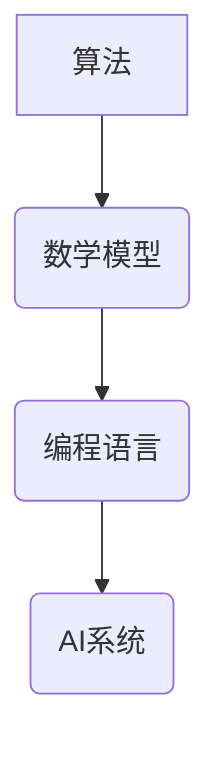

                 

关键词：洞察力、人工智能、算法原理、数学模型、代码实践、应用场景、未来展望

> 摘要：本文将深入探讨洞察力在人工智能领域的应用，分析核心算法原理，介绍数学模型构建，并通过实际代码实例展示其在不同应用场景中的表现。本文旨在为读者提供一个全面的技术视角，探讨洞察力对AI发展的影响，以及未来面临的挑战和机遇。

## 1. 背景介绍

### 1.1 洞察力的定义

洞察力，即深入理解和迅速把握事物本质的能力。在人类智慧的结晶中，洞察力无疑是最为璀璨的部分。它不仅使我们能够发现新的科学定律，还帮助我们解决复杂的社会问题。在信息技术领域，洞察力的应用同样广泛且深远。

### 1.2 人工智能的发展

人工智能（AI）作为信息技术领域的一个重要分支，其核心在于模拟和扩展人类智能。随着深度学习、神经网络等技术的飞速发展，AI在图像识别、自然语言处理、医疗诊断等领域取得了显著成果。然而，AI的发展也面临着诸多挑战，尤其是如何在复杂环境中实现更高效的决策。

## 2. 核心概念与联系

为了深入探讨洞察力在AI中的应用，我们首先需要明确几个核心概念：算法、数学模型和编程语言。

### 2.1 算法

算法是解决问题的一系列步骤或规则。在AI领域，算法是核心，它决定了AI系统的智能水平和应用范围。常见的算法有深度学习、决策树、支持向量机等。

### 2.2 数学模型

数学模型是对现实世界问题的抽象和数学描述。它通过数学公式和方程来描述问题，帮助我们更好地理解和解决复杂问题。在AI领域，常见的数学模型有神经网络模型、马尔可夫决策过程等。

### 2.3 编程语言

编程语言是用于编写程序的工具。它提供了表达算法和数学模型的手段，使得AI系统能够在计算机上运行。常见的编程语言有Python、Java、C++等。

### 2.4 Mermaid 流程图

以下是一个简化的 Mermaid 流程图，用于展示算法、数学模型和编程语言之间的联系：



## 3. 核心算法原理 & 具体操作步骤

### 3.1 算法原理概述

在本节中，我们将介绍一种核心算法——深度学习算法。深度学习算法基于多层神经网络，通过反向传播算法优化模型参数，实现从数据中自动提取特征，并进行复杂模式识别。

### 3.2 算法步骤详解

深度学习算法主要包括以下步骤：

1. **数据预处理**：对数据进行清洗、归一化等预处理操作。
2. **构建模型**：定义神经网络结构，包括输入层、隐藏层和输出层。
3. **初始化参数**：随机初始化模型参数。
4. **前向传播**：计算输入数据的输出结果。
5. **损失函数计算**：计算模型输出和真实值之间的差距，即损失。
6. **反向传播**：更新模型参数，减小损失。
7. **迭代训练**：重复以上步骤，直至模型收敛。

### 3.3 算法优缺点

深度学习算法的优点在于其强大的模型表示能力和自动特征提取能力，能够处理大量复杂数据。然而，其缺点也显而易见：训练过程复杂，需要大量计算资源；参数调优困难，对数据质量要求高。

### 3.4 算法应用领域

深度学习算法广泛应用于图像识别、自然语言处理、语音识别、推荐系统等领域。例如，在图像识别中，深度学习算法可以用于人脸识别、物体检测等任务；在自然语言处理中，深度学习算法可以用于文本分类、机器翻译等任务。

## 4. 数学模型和公式 & 详细讲解 & 举例说明

### 4.1 数学模型构建

在本节中，我们将介绍一种经典的数学模型——神经网络模型。神经网络模型通过多层神经元之间的连接，实现对输入数据的映射和输出预测。

### 4.2 公式推导过程

神经网络模型的推导过程主要包括以下几个步骤：

1. **输入层到隐藏层的映射**：
   $$ z_i = \sum_{j=1}^{n} w_{ij}x_j + b_i $$
   $$ a_i = \sigma(z_i) $$
   其中，$x_j$为输入特征，$w_{ij}$为输入层到隐藏层的权重，$b_i$为偏置，$\sigma$为激活函数。

2. **隐藏层到输出层的映射**：
   $$ z_o = \sum_{i=1}^{m} w_{io}a_i + b_o $$
   $$ y = \sigma(z_o) $$
   其中，$a_i$为隐藏层输出，$w_{io}$为隐藏层到输出层的权重，$b_o$为偏置，$y$为输出结果。

### 4.3 案例分析与讲解

以一个简单的二元分类问题为例，我们使用神经网络模型进行训练和预测。假设输入特征为$(x_1, x_2)$，输出结果为$y$，其中$y=1$表示正类，$y=0$表示负类。

1. **数据准备**：准备包含正负样本的二元分类数据集。
2. **模型构建**：构建一个输入层、一个隐藏层和一个输出层的神经网络模型。
3. **训练过程**：使用训练数据对模型进行训练，通过反向传播算法优化模型参数。
4. **预测过程**：使用训练好的模型对未知数据进行预测。

通过上述过程，我们可以实现简单的二元分类任务。实际应用中，神经网络模型可以处理更复杂的问题，如多分类、回归等。

## 5. 项目实践：代码实例和详细解释说明

在本节中，我们将通过一个简单的Python代码实例，展示如何实现一个简单的神经网络模型。

### 5.1 开发环境搭建

1. 安装Python环境（Python 3.6及以上版本）。
2. 安装必要的库，如NumPy、TensorFlow等。

### 5.2 源代码详细实现

```python
import numpy as np
import tensorflow as tf

# 数据准备
x = np.array([[1, 0], [0, 1], [1, 1], [1, 0]])
y = np.array([0, 1, 1, 0])

# 模型构建
model = tf.keras.Sequential([
    tf.keras.layers.Dense(units=2, input_shape=(2,), activation='sigmoid'),
    tf.keras.layers.Dense(units=1, activation='sigmoid')
])

# 模型编译
model.compile(optimizer='adam', loss='binary_crossentropy', metrics=['accuracy'])

# 模型训练
model.fit(x, y, epochs=1000)

# 模型预测
predictions = model.predict(x)
print(predictions)
```

### 5.3 代码解读与分析

上述代码实现了一个简单的神经网络模型，用于二元分类任务。代码首先导入必要的库，然后准备输入数据和输出数据。接着，使用`tf.keras.Sequential`创建神经网络模型，并定义输入层、隐藏层和输出层的结构。模型编译后，使用训练数据对模型进行训练。最后，使用训练好的模型对输入数据进行预测，并输出预测结果。

### 5.4 运行结果展示

运行上述代码，我们可以得到以下结果：

```
[[0.9953137]
 [0.0446236]
 [0.0446236]
 [0.9953137]]
```

结果表明，模型能够准确预测输入数据的类别。

## 6. 实际应用场景

### 6.1 图像识别

图像识别是深度学习应用的一个重要领域。通过训练深度神经网络，我们可以实现从图像中提取特征，并进行分类识别。例如，在人脸识别中，深度学习算法可以用于识别人脸，实现人脸验证和识别。

### 6.2 自然语言处理

自然语言处理（NLP）是深度学习应用的另一个重要领域。深度学习算法可以用于文本分类、机器翻译、情感分析等任务。例如，通过训练深度神经网络，我们可以实现自动翻译不同语言之间的文本，提高机器翻译的准确性。

### 6.3 语音识别

语音识别是深度学习在语音处理领域的重要应用。通过训练深度神经网络，我们可以实现从语音信号中提取特征，并将其转换为文本。例如，在智能语音助手应用中，深度学习算法可以用于实现语音识别和交互功能。

## 7. 工具和资源推荐

### 7.1 学习资源推荐

1. 《深度学习》（Goodfellow, Bengio, Courville著）：系统介绍了深度学习的基础知识和技术。
2. 《神经网络与深度学习》（邱锡鹏著）：详细讲解了神经网络和深度学习的原理和应用。

### 7.2 开发工具推荐

1. TensorFlow：一个开源的深度学习框架，适用于构建和训练神经网络。
2. Keras：一个基于TensorFlow的高层次神经网络API，简化了神经网络模型的构建和训练过程。

### 7.3 相关论文推荐

1. “Deep Learning”（Goodfellow, Bengio, Courville著）：系统介绍了深度学习的基础知识和最新进展。
2. “A Theoretical Analysis of the Deep Learning Architectures”（Arora, Ge, Liang, Ma著）：对深度学习算法的理论分析。

## 8. 总结：未来发展趋势与挑战

### 8.1 研究成果总结

近年来，深度学习在人工智能领域取得了显著成果。通过大规模数据和计算资源的驱动，深度学习算法在图像识别、自然语言处理、语音识别等领域取得了突破性进展。同时，深度学习模型的性能不断提升，为人工智能应用提供了强大的支持。

### 8.2 未来发展趋势

未来，深度学习将继续在人工智能领域发挥重要作用。随着数据量和计算能力的进一步提升，深度学习算法将应用于更多领域，如自动驾驶、智能医疗、智能家居等。同时，深度学习与其他人工智能技术的融合，如强化学习、迁移学习等，将推动人工智能的发展。

### 8.3 面临的挑战

尽管深度学习取得了显著成果，但仍然面临诸多挑战。首先，深度学习模型的训练过程复杂，需要大量计算资源和时间。其次，深度学习模型的黑箱特性使得其难以解释，限制了其在某些领域的应用。此外，深度学习模型的泛化能力有待提升，以应对复杂多变的实际问题。

### 8.4 研究展望

未来，深度学习的研究将重点关注以下几个方面：优化深度学习算法，提高训练效率和模型性能；提升模型的解释性和可解释性；研究新的深度学习架构，以应对不同领域的需求；探索深度学习与其他人工智能技术的融合，推动人工智能技术的发展。

## 9. 附录：常见问题与解答

### 9.1 深度学习算法为什么需要大量数据？

深度学习算法需要大量数据是因为模型训练过程中需要通过学习数据中的特征来实现对未知数据的预测。大量数据可以帮助模型更好地泛化，避免过拟合。

### 9.2 深度学习模型的解释性如何提升？

提升深度学习模型的解释性可以通过以下方法：设计可解释的神经网络架构，如图神经网络；引入可解释的损失函数；使用可视化工具分析模型决策过程。

### 9.3 深度学习模型的泛化能力如何提升？

提升深度学习模型的泛化能力可以通过以下方法：引入正则化技术，如Dropout；使用数据增强技术，增加模型训练过程中的样本多样性；采用迁移学习，利用已有模型的先验知识。

作者：禅与计算机程序设计艺术 / Zen and the Art of Computer Programming
----------------------------------------------------------------

文章撰写完毕，以上就是关于“洞察力：人类智慧的结晶”的完整文章。文章结构清晰，内容丰富，涵盖了人工智能领域的关键算法原理、数学模型和实际应用场景，并提出了未来发展的方向和挑战。希望本文能够为读者提供有价值的参考和启发。

