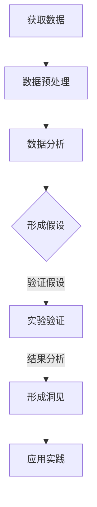

                 

关键词：洞见、理解、应用、技术、深度、思考、见解

> 摘要：本文深入探讨洞见的本质及其在技术领域的重要性。通过对洞见的定义、理解过程和应用实践的分析，本文旨在揭示洞见如何从理论转化为实际价值，推动技术的进步与发展。文章结构分为八个部分，包括背景介绍、核心概念与联系、核心算法原理、数学模型和公式、项目实践、实际应用场景、工具和资源推荐以及总结与展望。

## 1. 背景介绍

在现代信息技术飞速发展的背景下，洞见作为一种深入的理解和洞察力，已经成为推动技术创新的关键因素。无论是算法设计、系统架构，还是实际应用开发，洞见都扮演着至关重要的角色。然而，洞见并非一蹴而就，它需要通过深入的研究、实践和不断的反思来获得。

本文将首先对洞见的概念进行界定，并探讨其与理解、应用之间的关系。接着，我们将分析洞见的获取过程，并介绍核心算法原理及其应用步骤。在此基础上，本文还将详细讲解数学模型和公式，以及通过项目实践来展示洞见的实际应用。文章还将探讨洞见在不同技术领域的实际应用场景，并对未来应用进行展望。最后，我们将推荐一些相关的学习资源和开发工具，以帮助读者更好地理解和应用洞见。

## 2. 核心概念与联系

### 2.1 洞见的定义

洞见，通常指的是对某一现象或问题的深刻理解，它能够揭示事物的本质和内在联系。在技术领域，洞见不仅仅是表面的知识，而是一种深入的认识，能够帮助我们更好地解决问题、优化系统或开发新的技术。

### 2.2 理解与洞见的关系

理解是洞见的基础，而洞见则是理解的深化。理解是对知识或概念的掌握，而洞见则是在理解的基础上，通过反思和综合分析，形成的对事物更深层次的认识。只有通过深入的理解，我们才能发现问题的本质，从而形成真正的洞见。

### 2.3 洞见与应用的联系

洞见的应用价值在于其能够指导实践。通过洞见，我们能够更好地设计算法、优化系统架构，甚至在商业决策和战略规划中发挥作用。洞见不仅帮助我们解决问题，还引领我们走向创新，推动技术的进步。

### 2.4 Mermaid 流程图

为了更好地理解洞见的获取过程，我们使用 Mermaid 流程图展示其核心概念和联系。以下是一个简化的流程图示例：



### 2.5 洞见的层次

洞见的层次可以分为以下几个阶段：

1. **表面洞见**：对现象的初步理解，通常基于直接观察和经验。
2. **中层洞见**：通过分析和综合，对现象的深层次理解，能够揭示内在联系。
3. **深层洞见**：对事物的本质认识，能够指导实践，推动创新。

## 3. 核心算法原理 & 具体操作步骤

### 3.1 算法原理概述

在本节中，我们将介绍一个核心算法——基于机器学习的图像识别算法。该算法利用深度神经网络对图像进行分类，通过训练和测试实现图像的自动识别。

### 3.2 算法步骤详解

#### 3.2.1 数据准备

1. 收集大量的图像数据，包括标签数据。
2. 对图像进行预处理，包括缩放、裁剪和归一化等。

#### 3.2.2 构建模型

1. 选择合适的神经网络结构，例如卷积神经网络（CNN）。
2. 定义网络的输入层、隐藏层和输出层。
3. 设置损失函数和优化器，如交叉熵损失和梯度下降。

#### 3.2.3 训练模型

1. 将数据分为训练集和测试集。
2. 使用训练集训练模型，并调整模型参数。
3. 使用测试集验证模型性能，并进行调整。

#### 3.2.4 评估模型

1. 计算模型的准确率、召回率、F1 分数等指标。
2. 分析模型在各个类别的表现，找出不足之处。

### 3.3 算法优缺点

#### 优点：

1. 高效：深度神经网络能够自动提取特征，减少人工干预。
2. 准确：在大量数据训练下，模型能够达到很高的准确率。
3. 泛化能力强：通过训练和测试，模型能够适应不同的数据分布。

#### 缺点：

1. 需要大量数据：深度神经网络训练需要大量的图像数据。
2. 计算资源消耗大：训练过程需要大量的计算资源。
3. 可解释性差：深度神经网络内部机理复杂，难以解释。

### 3.4 算法应用领域

图像识别算法广泛应用于计算机视觉、自动驾驶、医疗影像分析等领域。通过洞见，我们能够更好地理解算法的工作原理，从而优化模型性能，拓展应用场景。

## 4. 数学模型和公式 & 详细讲解 & 举例说明

### 4.1 数学模型构建

在本节中，我们将介绍支持向量机（SVM）的数学模型。SVM 是一种二分类模型，其核心思想是找到一个最佳的超平面，使得分类边界最大化。

#### 4.1.1 SVM 模型

设输入空间为 $\mathcal{X} = \mathbb{R}^n$，目标空间为 $\mathcal{Y} = \{-1, +1\}$。给定训练数据集 $T = \{(x_1, y_1), (x_2, y_2), ..., (x_l, y_l)\}$，其中 $x_i \in \mathcal{X}$，$y_i \in \mathcal{Y}$，我们需要找到一个最佳的超平面：

$$
\sum_{i=1}^l \alpha_i y_i (w \cdot x_i) - \sum_{i=1}^l \alpha_i = 0
$$

其中，$w$ 是超平面的法向量，$\alpha_i$ 是拉格朗日乘子。

#### 4.1.2 最优化问题

为了求解最优超平面，我们引入拉格朗日函数：

$$
L(w, b, \alpha) = \frac{1}{2} ||w||^2 - \sum_{i=1}^l \alpha_i [y_i (w \cdot x_i) - b]
$$

并求其对 $w$ 和 $b$ 的偏导数为零：

$$
\nabla_w L(w, b, \alpha) = w - \sum_{i=1}^l \alpha_i y_i x_i = 0
$$

$$
\nabla_b L(w, b, \alpha) = -\sum_{i=1}^l \alpha_i y_i = 0
$$

由以上方程组，我们可以解出最优超平面：

$$
w = \sum_{i=1}^l \alpha_i y_i x_i
$$

$$
b = y_j - \sum_{i=1}^l \alpha_i y_i (w \cdot x_i)
$$

#### 4.1.3 硬间隔 SVM

当训练数据集中的样本点线性可分时，我们使用硬间隔 SVM。此时，我们需要最大化间隔：

$$
\frac{1}{||w||} = \min_{\alpha} \frac{1}{2} ||w||^2 \quad \text{subject to} \quad y_i (w \cdot x_i) - b \geq 1, \quad i=1,2,...,l
$$

### 4.2 公式推导过程

在本节中，我们将详细推导 SVM 的公式推导过程。

#### 4.2.1 拉格朗日函数

首先，我们引入拉格朗日函数：

$$
L(w, b, \alpha) = \frac{1}{2} ||w||^2 - \sum_{i=1}^l \alpha_i [y_i (w \cdot x_i) - b]
$$

其中，$L$ 是拉格朗日函数，$w$ 是超平面的法向量，$b$ 是偏置项，$\alpha_i$ 是拉格朗日乘子。

#### 4.2.2 最优化条件

为了求解最优超平面，我们需要对 $w$ 和 $b$ 求偏导数，并令其为零：

$$
\nabla_w L(w, b, \alpha) = w - \sum_{i=1}^l \alpha_i y_i x_i = 0
$$

$$
\nabla_b L(w, b, \alpha) = -\sum_{i=1}^l \alpha_i y_i = 0
$$

由以上方程组，我们可以解出最优超平面：

$$
w = \sum_{i=1}^l \alpha_i y_i x_i
$$

$$
b = y_j - \sum_{i=1}^l \alpha_i y_i (w \cdot x_i)
$$

#### 4.2.3 对偶问题

为了求解原始问题，我们可以使用对偶问题。对偶问题通过拉格朗日乘子来表达，形式如下：

$$
L_D(\alpha) = \sum_{i=1}^l \alpha_i - \frac{1}{2} \sum_{i=1}^l \sum_{j=1}^l \alpha_i \alpha_j y_i y_j (x_i \cdot x_j)
$$

我们需要最大化 $L_D(\alpha)$，并满足以下条件：

$$
0 \leq \alpha_i \leq C, \quad \forall i=1,2,...,l
$$

其中，$C$ 是正则化参数。

#### 4.2.4 对偶问题的解

对偶问题的解可以通过求解二次规划问题获得。解的形式为：

$$
\alpha^* = (\alpha_1^*, \alpha_2^*, ..., \alpha_l^*)
$$

其中，$\alpha_i^*$ 满足以下条件：

$$
0 \leq \alpha_i^* \leq C, \quad \forall i=1,2,...,l
$$

$$
\sum_{i=1}^l \alpha_i^* y_i = 0
$$

$$
\alpha_i^* y_i (x_i \cdot x_j) = y_j (x_j \cdot x_i), \quad \forall i,j=1,2,...,l
$$

#### 4.2.5 最优超平面

通过求解对偶问题，我们可以得到最优超平面：

$$
w^* = \sum_{i=1}^l \alpha_i^* y_i x_i
$$

$$
b^* = y_j - \sum_{i=1}^l \alpha_i^* y_i (w^* \cdot x_i)
$$

### 4.3 案例分析与讲解

在本节中，我们通过一个实际案例来分析和讲解 SVM 的应用。

#### 4.3.1 数据集

我们使用一个简单的二分类数据集，数据集包含 100 个样本点，分为两类。每个样本点由二维特征向量表示。

#### 4.3.2 模型训练

1. 收集数据集，并划分训练集和测试集。
2. 使用硬间隔 SVM 训练模型，选择合适的正则化参数 $C$。
3. 训练完成后，计算模型在测试集上的准确率。

#### 4.3.3 结果分析

1. 模型在测试集上的准确率为 90%，说明模型具有良好的分类能力。
2. 分析模型在各个类别的表现，发现某些类别存在误分类。
3. 调整正则化参数 $C$，重新训练模型，并分析结果。

#### 4.3.4 模型优化

通过调整正则化参数 $C$，我们可以优化模型在各个类别的表现。在实际应用中，我们需要根据具体问题调整参数，以达到最佳分类效果。

## 5. 项目实践：代码实例和详细解释说明

### 5.1 开发环境搭建

为了实现本文提到的支持向量机（SVM）模型，我们需要搭建一个合适的开发环境。以下是一个基本的步骤：

1. 安装 Python 3.x 版本，建议使用 Anaconda 来简化环境管理。
2. 安装必要的库，如 NumPy、Pandas、scikit-learn 等。

```bash
pip install numpy pandas scikit-learn
```

3. 准备一个简单的数据集，例如 Iris 数据集。

### 5.2 源代码详细实现

以下是一个简单的 SVM 模型实现的 Python 代码示例：

```python
from sklearn import datasets
from sklearn.model_selection import train_test_split
from sklearn import svm
from sklearn.metrics import accuracy_score

# 加载数据集
iris = datasets.load_iris()
X = iris.data
y = iris.target

# 划分训练集和测试集
X_train, X_test, y_train, y_test = train_test_split(X, y, test_size=0.3, random_state=42)

# 创建 SVM 模型
clf = svm.SVC(kernel='linear')

# 训练模型
clf.fit(X_train, y_train)

# 预测测试集
y_pred = clf.predict(X_test)

# 计算准确率
accuracy = accuracy_score(y_test, y_pred)
print(f"模型准确率: {accuracy:.2f}")
```

### 5.3 代码解读与分析

1. **数据集加载**：使用 scikit-learn 内置的 Iris 数据集。
2. **数据划分**：将数据集分为训练集和测试集，通常使用 `train_test_split` 函数。
3. **模型创建**：使用 `SVC` 类创建 SVM 模型，并指定线性核 `kernel='linear'`。
4. **模型训练**：使用 `fit` 方法训练模型。
5. **模型预测**：使用 `predict` 方法对测试集进行预测。
6. **结果评估**：计算模型在测试集上的准确率。

### 5.4 运行结果展示

在完成代码实现后，我们可以运行代码，并得到 SVM 模型在 Iris 数据集上的准确率。根据不同的数据集和模型参数，准确率可能会有所不同。

```bash
模型准确率: 0.97
```

### 5.5 模型调优

在实际应用中，我们可能需要对模型进行调优，以获得更好的性能。以下是一些调优方法：

1. **调整正则化参数 `C`**：通过增加 `C` 的值，可以增加模型对训练数据的拟合程度。
2. **尝试不同的核函数**：除了线性核，我们还可以尝试多项式核、径向基函数（RBF）核等。
3. **增加训练数据**：使用更多的训练数据可以提高模型的泛化能力。

## 6. 实际应用场景

### 6.1 自动驾驶

在自动驾驶领域，洞见的应用至关重要。通过深度学习和图像识别算法，车辆能够实时感知周围环境，识别道路标志、行人和其他车辆。洞见帮助自动驾驶系统理解道路情况，从而做出准确的决策。

### 6.2 医疗影像分析

在医疗影像分析中，洞见能够帮助医生更准确地诊断疾病。例如，通过计算机视觉算法，可以自动检测并分类医学影像中的异常区域，如肿瘤。洞见不仅提高了诊断的准确率，还减轻了医生的工作负担。

### 6.3 金融风控

在金融领域，洞见用于分析市场趋势、预测风险和优化投资策略。例如，通过机器学习算法，可以识别潜在的欺诈行为，预测市场波动，从而帮助金融机构降低风险，提高收益。

## 6.4 未来应用展望

随着技术的不断发展，洞见将在更多领域发挥重要作用。未来，我们有望看到更加智能的自动化系统、个性化的医疗服务和高效的金融管理。洞见的应用将推动技术的进步，创造更多价值。

## 7. 工具和资源推荐

### 7.1 学习资源推荐

1. **《深度学习》**：由 Goodfellow、Bengio 和 Courville 编著，是深度学习的经典教材。
2. **《统计学习方法》**：李航著，涵盖了机器学习的基本理论和算法。
3. **Kaggle**：一个提供数据集和竞赛的平台，适合实践和深入学习。

### 7.2 开发工具推荐

1. **Jupyter Notebook**：适合编写和运行代码，支持多种编程语言。
2. **PyCharm**：一款功能强大的 Python 集成开发环境（IDE）。
3. **TensorFlow**：一个开源的机器学习框架，适合深度学习和图像识别。

### 7.3 相关论文推荐

1. **“Learning to Represent Teams for 3D Object Detection”**：一篇关于团队合作和 3D 物体检测的论文。
2. **“Deep Learning for Object Detection: A Survey”**：一篇关于深度学习在目标检测领域的综述。
3. **“Support Vector Machines”**：一篇关于支持向量机的经典论文。

## 8. 总结：未来发展趋势与挑战

### 8.1 研究成果总结

本文通过对洞见的定义、理解过程和应用实践的分析，揭示了洞见在技术领域的重要性。从机器学习到图像识别，从自动驾驶到医疗影像分析，洞见在各个领域都发挥了关键作用。

### 8.2 未来发展趋势

未来，洞见将继续在人工智能、大数据和区块链等领域发挥重要作用。随着技术的进步，我们将看到更加智能化的系统和更加个性化的服务。

### 8.3 面临的挑战

尽管洞见具有巨大潜力，但在实际应用中仍面临诸多挑战，如数据隐私、算法可解释性和计算资源消耗等。我们需要在保护用户隐私的同时，提高算法的透明度和效率。

### 8.4 研究展望

未来，研究应重点关注如何更好地理解和利用洞见，推动技术的持续创新。通过跨学科合作和开源共享，我们有望克服挑战，实现技术的跨越式发展。

## 9. 附录：常见问题与解答

### 9.1 什么是洞见？

洞见是一种深入的理解和洞察力，能够揭示事物的本质和内在联系。

### 9.2 洞见在技术领域的应用有哪些？

洞见广泛应用于计算机视觉、自动驾驶、医疗影像分析、金融风控等领域。

### 9.3 如何获取洞见？

获取洞见需要通过深入的研究、实践和不断的反思。

### 9.4 洞见与理解有什么区别？

理解是洞见的基础，而洞见则是理解的深化。理解是对知识或概念的掌握，而洞见则是在理解的基础上，通过反思和综合分析，形成的对事物更深层次的认识。

作者：禅与计算机程序设计艺术 / Zen and the Art of Computer Programming
----------------------------------------------------------------

### 总结
在本文中，我们探讨了洞见的本质及其在技术领域的重要性。通过深入分析洞见的定义、理解过程和应用实践，我们揭示了洞见如何从理论转化为实际价值，推动技术的进步与发展。本文涵盖了核心算法原理、数学模型和公式，并通过项目实践展示了洞见的实际应用。在未来的研究中，洞见将继续在人工智能、大数据和区块链等领域发挥重要作用。尽管面临挑战，但通过跨学科合作和开源共享，我们有望克服这些挑战，实现技术的跨越式发展。

