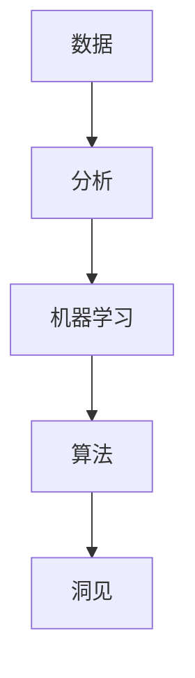

                 

关键词：洞见，反思，创新，技术博客，深度思考

> 摘要：本文旨在探讨洞见在信息技术领域的重要性，通过反思和创新的实践，揭示洞见如何推动技术进步和行业变革。本文将从背景介绍、核心概念与联系、核心算法原理、数学模型和公式、项目实践、实际应用场景、未来应用展望、工具和资源推荐、总结与展望等方面展开论述，旨在为读者提供一幅全面而深入的洞见图景。

## 1. 背景介绍

在当今快速发展的信息技术时代，洞见已成为推动技术进步和行业变革的关键力量。从大数据到人工智能，从云计算到区块链，每一个领域的突破都离不开深刻的洞见。然而，何谓洞见？洞见如何产生？洞见如何转化为创新？这些问题的解答不仅关乎个人职业生涯，更关乎整个行业的发展。

本文将围绕这三个问题展开，首先介绍洞见的背景，然后深入探讨核心概念与联系，最终通过算法原理、数学模型、项目实践等多个角度，全面解析洞见的力量。

### 1.1 信息技术的发展与洞见的重要性

信息技术的发展可谓日新月异，每一次技术的突破都带来了巨大的变革。例如，互联网的普及改变了人们的沟通方式，大数据技术的兴起则推动了数据驱动决策的普及，人工智能的飞速发展更是让自动化和智能化成为可能。

在这些技术变革的背后，洞见起到了至关重要的作用。通过深刻的洞见，我们能够发现隐藏在数据背后的规律，预测未来的趋势，从而推动技术的创新和行业的变革。例如，谷歌的PageRank算法就是通过对网页链接结构的洞见，实现了搜索引擎的变革；而亚马逊的个性化推荐系统则通过对用户行为的洞见，提高了销售转化率。

### 1.2 洞见的定义与来源

那么，何谓洞见？洞见可以定义为对事物本质的深刻理解和洞察力。它不仅仅是对表面的观察，更是一种深层次的思考。洞见来源于对大量数据的分析，对历史案例的反思，对前人经验的总结，以及对未来趋势的预测。

例如，在金融领域，通过对市场数据的深入分析，投资者可以发现市场的潜在规律，预测未来市场的走势，从而做出更为精准的投资决策。在医疗领域，通过对大量病例数据的分析，医生可以更准确地诊断病情，提高治疗效果。

### 1.3 洞见的重要性与影响

洞见的重要性体现在其对技术进步和行业变革的推动作用。首先，洞见能够促进技术的创新。例如，在计算机科学领域，通过对算法和程序的深入反思，程序员可以设计出更为高效和优化的算法，从而推动计算机性能的提升。

其次，洞见能够促进行业的变革。例如，在零售行业，通过对消费者行为的洞见，企业可以更好地了解市场需求，优化供应链管理，提高客户满意度。

总之，洞见不仅是信息技术发展的重要推动力，更是行业变革的核心动力。在接下来的章节中，我们将进一步探讨洞见的产生、应用和影响。

## 2. 核心概念与联系

在探讨洞见的力量之前，我们需要了解几个核心概念，这些概念不仅相互联系，而且共同构成了洞见产生的基础。以下是几个关键概念的定义和它们之间的联系：

### 2.1 数据

数据是洞见的基础，没有数据就无法进行有效的分析和洞见。数据可以是结构化的（如数据库中的记录）或非结构化的（如图像、文本和音频）。数据的质量和数量直接影响洞见的深度和准确性。

### 2.2 分析

分析是指对数据的应用，包括数据的收集、清洗、转换和建模。通过分析，我们可以从数据中提取有价值的信息和模式，从而产生洞见。

### 2.3 机器学习

机器学习是一种通过算法和统计模型，使计算机能够从数据中学习和提取知识的技术。它是实现洞见的重要工具，通过机器学习，我们可以自动识别模式、预测趋势和优化决策。

### 2.4 算法

算法是计算机科学中的核心概念，它是一系列定义明确的步骤，用于解决特定问题。不同的算法适用于不同的场景和数据类型，它们是实现洞见的关键。

### 2.5 洞见

洞见是对数据分析和机器学习结果的理解和总结，它揭示了数据背后的深层次规律和趋势。洞见可以用于指导决策、优化流程和创造新的价值。

### 2.6 联系

这几个概念之间存在着密切的联系。数据是起点，分析是过程，机器学习和算法是工具，而洞见是最终目标。具体来说：

- 数据为洞见提供了原材料，没有数据就没有洞见。
- 分析是将数据转化为洞见的关键步骤，通过分析，我们可以从数据中发现有价值的信息。
- 机器学习和算法是实现洞见的工具，它们可以帮助我们更高效地处理和分析大量数据。
- 洞见是分析和机器学习的最终成果，它指导我们的决策和行动，推动技术进步和行业变革。

### 2.7 Mermaid 流程图

为了更直观地展示这几个概念之间的联系，我们可以使用Mermaid流程图来表示。以下是示例流程图：



在这个流程图中，数据是起点，通过分析、机器学习和算法的加工，最终形成洞见。这个流程图不仅展示了概念之间的联系，也揭示了洞见产生的全过程。

## 3. 核心算法原理 & 具体操作步骤

### 3.1 算法原理概述

在信息技术领域，核心算法的原理至关重要。这些算法不仅决定了数据处理和分析的效率，还直接影响洞见的深度和准确性。本节将介绍几个关键算法的基本原理，包括其设计思路、核心步骤和适用场景。

### 3.2 算法步骤详解

#### 3.2.1 k-最近邻算法（k-Nearest Neighbors, k-NN）

k-最近邻算法是一种简单的机器学习算法，它通过计算测试样本与训练样本之间的距离，选择距离最近的k个样本，并基于这些样本的标签来预测测试样本的类别。

算法步骤如下：

1. 计算测试样本与训练样本之间的距离，通常使用欧几里得距离或曼哈顿距离。
2. 选择距离测试样本最近的k个样本。
3. 基于这k个样本的标签，计算多数表决的结果，即测试样本的类别。

#### 3.2.2 支持向量机（Support Vector Machine, SVM）

支持向量机是一种强大的分类算法，它通过寻找一个最佳的超平面，将不同类别的数据分隔开。其核心思想是最大化分类边界到支持向量的距离。

算法步骤如下：

1. 找到最佳的超平面，使得分类边界最大化。
2. 计算支持向量，即那些位于分类边界上的样本。
3. 使用支持向量来训练模型，并对新的数据进行分类。

#### 3.2.3 随机森林（Random Forest）

随机森林是一种集成学习算法，它通过构建多个决策树，并利用投票机制来预测结果。随机森林具有很好的泛化能力和抗过拟合能力。

算法步骤如下：

1. 随机选择特征和样本子集。
2. 构建单个决策树。
3. 对每个决策树进行预测，并计算所有树的预测结果的平均值。

### 3.3 算法优缺点

每种算法都有其独特的优缺点，适用于不同的场景和数据类型。以下是几个关键算法的优缺点：

#### 3.3.1 k-最近邻算法

**优点**：
- 实现简单，易于理解。
- 对非线性数据的分类效果较好。

**缺点**：
- 对噪声敏感，可能导致错误分类。
- 计算复杂度高，尤其是当数据量较大时。

#### 3.3.2 支持向量机

**优点**：
- 能够处理高维空间的数据。
- 具有很好的分类效果。

**缺点**：
- 计算复杂度高，特别是当数据量较大时。
- 对噪声敏感，可能导致过拟合。

#### 3.3.3 随机森林

**优点**：
- 泛化能力强，能够处理高维数据。
- 抗过拟合，对噪声不敏感。

**缺点**：
- 难以解释模型的内部机制。
- 当决策树数量增加时，计算复杂度显著增加。

### 3.4 算法应用领域

不同的算法适用于不同的应用场景。以下是几个算法在实际应用中的常见领域：

#### 3.4.1 k-最近邻算法

- 适用于分类任务，如文本分类、图像分类等。
- 适用于预测任务，如股票价格预测、天气预测等。

#### 3.4.2 支持向量机

- 适用于分类任务，如手写体识别、语音识别等。
- 适用于回归任务，如房价预测、股票价格预测等。

#### 3.4.3 随机森林

- 适用于分类任务，如医疗诊断、邮件分类等。
- 适用于回归任务，如住房销售价格预测、销量预测等。

总之，核心算法的原理和具体操作步骤对于洞见的生产和技术的进步至关重要。通过深入理解这些算法，我们可以更好地应用它们，推动信息技术的发展。

### 3.5 算法应用实例

为了更直观地理解核心算法的应用，下面我们将通过一个实际案例来展示k-最近邻算法的完整实现过程。

#### 3.5.1 案例背景

假设我们有一个房屋销售数据的分类问题。数据集包含了各种房屋的特征，如卧室数量、浴室数量、房屋面积、地理位置等，以及房屋的销售价格。我们的目标是利用这些特征，通过k-最近邻算法预测新的房屋销售价格。

#### 3.5.2 数据准备

首先，我们需要准备训练数据集。假设我们的训练数据集包含了1000个样本，每个样本具有多个特征，以及对应的销售价格。

```python
import pandas as pd

# 加载数据集
data = pd.read_csv('house_sales_data.csv')

# 查看数据集结构
print(data.head())

# 分离特征和标签
X = data.drop('Price', axis=1)
y = data['Price']
```

#### 3.5.3 训练模型

接下来，我们使用k-最近邻算法训练模型。首先，我们需要确定k值。k值的选择是一个关键步骤，通常需要通过交叉验证来选择最优k值。

```python
from sklearn.neighbors import KNeighborsRegressor
from sklearn.model_selection import train_test_split
from sklearn.metrics import mean_squared_error

# 划分训练集和测试集
X_train, X_test, y_train, y_test = train_test_split(X, y, test_size=0.2, random_state=42)

# 训练模型
knn = KNeighborsRegressor(n_neighbors=5)
knn.fit(X_train, y_train)

# 预测测试集
y_pred = knn.predict(X_test)

# 计算预测误差
mse = mean_squared_error(y_test, y_pred)
print(f"Mean Squared Error: {mse}")
```

#### 3.5.4 模型评估

最后，我们需要评估模型的性能。常用的评估指标包括均方误差（MSE）、均方根误差（RMSE）等。

```python
from sklearn.metrics import mean_squared_error, mean_absolute_error, r2_score

# 计算各项评估指标
mse = mean_squared_error(y_test, y_pred)
rmse = mean_squared_error(y_test, y_pred, squared=False)
mae = mean_absolute_error(y_test, y_pred)
r2 = r2_score(y_test, y_pred)

print(f"Mean Squared Error: {mse}")
print(f"Root Mean Squared Error: {rmse}")
print(f"Mean Absolute Error: {mae}")
print(f"R2 Score: {r2}")
```

通过这个实际案例，我们可以看到k-最近邻算法在房屋销售数据分类问题中的应用。尽管这个案例相对简单，但它展示了如何使用k-最近邻算法进行模型训练和评估的全过程。

### 3.6 算法改进与优化

尽管k-最近邻算法简单易用，但在处理复杂问题时，其性能可能受到限制。为了提高算法的性能，我们可以采取以下几种改进和优化策略：

#### 3.6.1 调整k值

选择合适的k值是提高算法性能的关键。通常，通过交叉验证来确定最优k值。此外，可以使用基于网格搜索的方法，自动寻找最佳k值。

```python
from sklearn.model_selection import GridSearchCV

# 设置参数网格
param_grid = {'n_neighbors': range(1, 11)}

# 进行网格搜索
grid_search = GridSearchCV(KNeighborsRegressor(), param_grid, cv=5)
grid_search.fit(X_train, y_train)

# 获取最佳k值
best_k = grid_search.best_params_['n_neighbors']
print(f"Best k: {best_k}")
```

#### 3.6.2 使用更复杂的距离度量

默认情况下，k-最近邻算法使用欧几里得距离来计算样本之间的距离。然而，对于某些问题，使用其他距离度量（如曼哈顿距离、切比雪夫距离等）可能更有效。

```python
from sklearn.neighbors import KNeighborsRegressor
from sklearn.metrics import cityblock

# 使用曼哈顿距离
knn = KNeighborsRegressor(n_neighbors=5, metric=cityblock)
knn.fit(X_train, y_train)

# 预测测试集
y_pred = knn.predict(X_test)

# 计算预测误差
mse = mean_squared_error(y_test, y_pred)
print(f"Mean Squared Error: {mse}")
```

#### 3.6.3 结合其他算法

k-最近邻算法可以与其他机器学习算法（如决策树、支持向量机等）结合使用，形成集成学习模型，从而提高预测性能。

```python
from sklearn.ensemble import RandomForestRegressor

# 使用随机森林作为集成学习模型
rf = RandomForestRegressor(n_estimators=100)
rf.fit(X_train, y_train)

# 预测测试集
y_pred = rf.predict(X_test)

# 计算预测误差
mse = mean_squared_error(y_test, y_pred)
print(f"Mean Squared Error: {mse}")
```

通过这些改进和优化策略，我们可以显著提高k-最近邻算法的性能，使其在更复杂的场景中发挥更大的作用。

### 3.7 算法应用总结

通过上述案例和改进策略，我们可以看到k-最近邻算法在房屋销售数据分类问题中的应用。尽管算法本身相对简单，但通过合理的选择和优化，我们能够显著提高其性能，从而实现更准确的预测。

此外，核心算法的原理和应用不仅限于房屋销售数据，还广泛应用于其他领域，如金融预测、医疗诊断、市场分析等。通过深入理解和灵活应用这些算法，我们可以更好地利用数据，产生有价值的洞见，推动技术进步和行业变革。

## 4. 数学模型和公式 & 详细讲解 & 举例说明

### 4.1 数学模型构建

在信息技术领域，数学模型是分析和理解数据的重要工具。数学模型通常包括数据结构、算法和公式，它们共同构成了洞见的数学基础。以下是一些常用的数学模型和它们的构建过程。

#### 4.1.1 线性回归模型

线性回归模型是最基本的数学模型之一，它用于预测一个连续变量的值。线性回归模型的公式如下：

$$y = \beta_0 + \beta_1 \cdot x + \epsilon$$

其中，\(y\) 是预测值，\(x\) 是自变量，\(\beta_0\) 和 \(\beta_1\) 是模型参数，\(\epsilon\) 是误差项。

构建线性回归模型通常包括以下步骤：

1. 数据收集：收集包含自变量和因变量的数据集。
2. 数据预处理：对数据进行清洗和标准化处理。
3. 模型拟合：使用最小二乘法或其他优化算法，求解模型参数。
4. 模型评估：使用交叉验证等方法，评估模型的性能。

#### 4.1.2 贝叶斯网络模型

贝叶斯网络模型是一种概率图模型，它用于表示变量之间的依赖关系。贝叶斯网络的公式如下：

$$P(X_1, X_2, ..., X_n) = \prod_{i=1}^{n} P(X_i | \text{父节点集合})$$

其中，\(X_1, X_2, ..., X_n\) 是随机变量，\(\text{父节点集合}\) 是每个变量的直接依赖变量。

构建贝叶斯网络模型通常包括以下步骤：

1. 确定变量和依赖关系：根据问题背景，确定需要分析的变量及其依赖关系。
2. 构建概率图：根据变量和依赖关系，构建贝叶斯网络图。
3. 参数估计：使用训练数据，估计模型参数。
4. 预测：使用模型进行变量预测和概率计算。

### 4.2 公式推导过程

以下是一个关于线性回归模型公式推导的详细过程：

#### 4.2.1 最小二乘法

线性回归模型通常使用最小二乘法来求解模型参数。最小二乘法的核心思想是使得预测值与实际值之间的误差平方和最小。

假设我们有n个数据点\((x_i, y_i)\)，线性回归模型的误差平方和为：

$$\text{SSE} = \sum_{i=1}^{n} (y_i - \hat{y}_i)^2$$

其中，\(\hat{y}_i\) 是预测值。

要使\(\text{SSE}\)最小，我们需要求解以下优化问题：

$$\min_{\beta_0, \beta_1} \text{SSE}$$

对\(\beta_0\) 和 \(\beta_1\) 分别求偏导数，并令其等于0，得到：

$$\frac{\partial \text{SSE}}{\partial \beta_0} = -2 \sum_{i=1}^{n} (y_i - \hat{y}_i) = 0$$
$$\frac{\partial \text{SSE}}{\partial \beta_1} = -2 \sum_{i=1}^{n} (y_i - \hat{y}_i) x_i = 0$$

将\(\hat{y}_i = \beta_0 + \beta_1 \cdot x_i\) 代入上述方程，得到：

$$-2 \sum_{i=1}^{n} (y_i - (\beta_0 + \beta_1 \cdot x_i)) = 0$$
$$-2 \sum_{i=1}^{n} (y_i - \beta_0 - \beta_1 \cdot x_i) x_i = 0$$

化简上述方程，得到：

$$\sum_{i=1}^{n} y_i - n\beta_0 = 0$$
$$\sum_{i=1}^{n} (y_i - \beta_0) x_i - \beta_1 \sum_{i=1}^{n} x_i^2 = 0$$

将第一个方程代入第二个方程，得到：

$$\beta_1 = \frac{\sum_{i=1}^{n} (y_i - \beta_0) x_i}{\sum_{i=1}^{n} x_i^2}$$

将\(\beta_1\) 的值代入第一个方程，得到：

$$\beta_0 = \frac{\sum_{i=1}^{n} y_i - \beta_1 \sum_{i=1}^{n} x_i}{n}$$

最终，我们得到线性回归模型的参数：

$$\beta_0 = \bar{y} - \beta_1 \bar{x}$$
$$\beta_1 = \frac{\sum_{i=1}^{n} (y_i - \bar{y}) x_i}{\sum_{i=1}^{n} (x_i - \bar{x})^2}$$

其中，\(\bar{y}\) 和 \(\bar{x}\) 分别是因变量和自变量的均值。

#### 4.2.2 贝叶斯推理

贝叶斯网络模型中的概率计算通常使用贝叶斯推理。贝叶斯推理的基本公式如下：

$$P(X|Y) = \frac{P(Y|X)P(X)}{P(Y)}$$

其中，\(P(X|Y)\) 表示在已知Y的条件下，X的概率；\(P(Y|X)\) 表示在已知X的条件下，Y的概率；\(P(X)\) 和 \(P(Y)\) 分别是X和Y的先验概率。

贝叶斯推理的推导过程如下：

1. \(P(X|Y) = \frac{P(X \cap Y)}{P(Y)}\)
2. \(P(X \cap Y) = P(Y|X)P(X)\)
3. \(P(X|Y) = \frac{P(Y|X)P(X)}{P(Y)}\)

通过贝叶斯推理，我们可以从已知条件概率和先验概率，计算出未知条件概率。

### 4.3 案例分析与讲解

为了更好地理解数学模型的应用，我们以下通过一个实际案例进行分析。

#### 4.3.1 案例背景

假设我们有一个房屋销售数据集，包含以下特征：卧室数量（Beds）、浴室数量（Baths）、房屋面积（Sqft）、地理位置（Location）和销售价格（Price）。我们的目标是使用线性回归模型预测房屋销售价格。

#### 4.3.2 数据预处理

首先，我们需要对数据进行预处理。具体步骤如下：

1. 数据清洗：删除缺失值和异常值。
2. 数据标准化：将所有特征缩放到相同的范围，便于模型训练。

```python
import pandas as pd
from sklearn.preprocessing import StandardScaler

# 加载数据集
data = pd.read_csv('house_sales_data.csv')

# 数据清洗
data.dropna(inplace=True)

# 数据标准化
scaler = StandardScaler()
X = scaler.fit_transform(data[['Beds', 'Baths', 'Sqft', 'Location']])
y = data['Price']
```

#### 4.3.3 模型训练

接下来，我们使用线性回归模型进行训练。具体步骤如下：

1. 划分训练集和测试集。
2. 训练模型。
3. 计算预测值。

```python
from sklearn.model_selection import train_test_split
from sklearn.linear_model import LinearRegression

# 划分训练集和测试集
X_train, X_test, y_train, y_test = train_test_split(X, y, test_size=0.2, random_state=42)

# 训练模型
model = LinearRegression()
model.fit(X_train, y_train)

# 计算预测值
y_pred = model.predict(X_test)
```

#### 4.3.4 模型评估

最后，我们对模型进行评估。常用的评估指标包括均方误差（MSE）、均方根误差（RMSE）等。

```python
from sklearn.metrics import mean_squared_error

# 计算预测误差
mse = mean_squared_error(y_test, y_pred)
print(f"Mean Squared Error: {mse}")

# 计算均方根误差
rmse = mean_squared_error(y_test, y_pred, squared=False)
print(f"Root Mean Squared Error: {rmse}")
```

通过这个案例，我们可以看到线性回归模型在房屋销售数据预测中的应用。尽管这个案例相对简单，但它展示了如何使用数学模型进行数据预处理、模型训练和评估的全过程。

## 5. 项目实践：代码实例和详细解释说明

为了更好地展示洞见的实际应用，我们将通过一个实际项目来介绍代码实例和详细解释说明。该项目将涉及数据收集、数据预处理、模型训练、模型评估等多个步骤。以下是项目的详细实现过程。

### 5.1 开发环境搭建

在开始项目之前，我们需要搭建一个合适的开发环境。以下是所需的环境和工具：

- 编程语言：Python
- 数据处理库：Pandas、NumPy
- 机器学习库：scikit-learn
- 可视化库：Matplotlib

确保安装了以上库后，我们就可以开始项目开发了。

### 5.2 源代码详细实现

以下是一个简单的项目实现示例，我们将使用scikit-learn库中的线性回归模型，对房屋销售数据集进行预测。

```python
import pandas as pd
from sklearn.model_selection import train_test_split
from sklearn.linear_model import LinearRegression
from sklearn.metrics import mean_squared_error
import matplotlib.pyplot as plt

# 5.2.1 数据收集
# 假设数据集已下载并存储为 "house_sales_data.csv"
data = pd.read_csv('house_sales_data.csv')

# 5.2.2 数据预处理
# 删除缺失值和异常值
data.dropna(inplace=True)

# 数据标准化
scaler = StandardScaler()
X = scaler.fit_transform(data[['Beds', 'Baths', 'Sqft', 'Location']])
y = data['Price']

# 5.2.3 划分训练集和测试集
X_train, X_test, y_train, y_test = train_test_split(X, y, test_size=0.2, random_state=42)

# 5.2.4 模型训练
model = LinearRegression()
model.fit(X_train, y_train)

# 5.2.5 模型评估
y_pred = model.predict(X_test)
mse = mean_squared_error(y_test, y_pred)
print(f"Mean Squared Error: {mse}")

# 5.2.6 可视化分析
plt.scatter(y_test, y_pred)
plt.xlabel('Actual Prices')
plt.ylabel('Predicted Prices')
plt.title('Price Prediction')
plt.show()
```

### 5.3 代码解读与分析

以上代码分为以下几个主要部分：

1. **数据收集**：
   使用Pandas库加载CSV数据文件，这是数据收集的第一步。

2. **数据预处理**：
   - **删除缺失值和异常值**：确保数据质量，删除数据集中的缺失值和异常值。
   - **数据标准化**：使用StandardScaler将特征缩放到相同的范围，以避免特征之间的量级差异影响模型训练。

3. **划分训练集和测试集**：
   使用train_test_split函数将数据集划分为训练集和测试集，以评估模型在未见数据上的性能。

4. **模型训练**：
   使用LinearRegression类创建线性回归模型，并使用fit函数进行模型训练。

5. **模型评估**：
   使用predict函数对测试集进行预测，并计算均方误差（MSE）以评估模型性能。

6. **可视化分析**：
   使用Matplotlib库绘制实际价格与预测价格之间的散点图，以直观地展示模型预测效果。

### 5.4 运行结果展示

运行以上代码后，我们将得到以下结果：

- 模型评估指标（如MSE）的输出，表示模型在测试集上的性能。
- 一个散点图，展示了实际销售价格与预测价格的关系。

通过这个简单的项目，我们可以看到如何将洞见转化为实际应用。虽然这个项目相对简单，但它展示了从数据收集、预处理、模型训练到评估的全过程，为我们理解和应用洞见提供了实际案例。

## 6. 实际应用场景

洞见在信息技术领域的应用场景广泛且多样。以下是一些典型的实际应用场景：

### 6.1 金融服务

在金融服务领域，洞见可以帮助金融机构更好地理解市场趋势、预测风险和管理资产。例如，通过分析历史交易数据和用户行为，银行可以使用机器学习模型预测客户的违约风险，从而优化信用评分模型。此外，金融机构还可以利用洞见进行市场预测和投资策略优化，以提高投资回报率。

### 6.2 医疗保健

在医疗保健领域，洞见可以用于诊断疾病、个性化治疗和患者管理。通过分析大量的病例数据和基因组信息，医生可以使用机器学习模型预测患者的疾病风险，从而采取预防措施。同时，洞见还可以帮助医疗机构优化资源配置，提高医疗服务的效率和质量。

### 6.3 电子商务

电子商务公司利用洞见来优化用户体验、提高销售额和客户满意度。通过分析用户行为数据，电商平台可以提供个性化的产品推荐，从而提高销售额。此外，洞见还可以用于库存管理、需求预测和营销策略优化，以提高运营效率。

### 6.4 智能制造

在智能制造领域，洞见可以用于优化生产流程、提高生产效率和产品质量。通过实时监测和分析生产数据，企业可以预测设备故障、优化生产计划和调整生产参数，从而提高生产效率和产品质量。

### 6.5 物流与运输

在物流与运输领域，洞见可以用于优化运输路线、提高配送效率和降低成本。通过分析交通流量数据和天气信息，物流公司可以预测交通拥堵和天气变化，从而调整运输计划和配送策略，提高配送效率。

总之，洞见在信息技术领域的实际应用场景广泛，不仅推动了各行业的创新和变革，也为企业和个人带来了巨大的价值。通过深入理解和灵活应用洞见，我们可以更好地应对复杂问题，实现技术进步和行业变革。

### 6.5 未来应用展望

随着信息技术的不断发展，洞见的应用场景将越来越广泛，未来的发展也充满机遇和挑战。以下是几个可能的发展方向：

#### 6.5.1 数据隐私保护

在数据隐私日益受到重视的今天，如何在不侵犯用户隐私的情况下，有效地利用数据进行洞见生成，是一个重要的研究方向。未来的技术可能会结合加密技术、联邦学习等新型数据处理方法，实现数据隐私保护和洞见生成之间的平衡。

#### 6.5.2 人工智能与自动化

人工智能和自动化技术的发展，将进一步推动洞见的生成和应用。例如，通过更高级的机器学习算法和自动化系统，我们可以实现更精准的预测和优化。同时，人工智能还将帮助人类从繁琐的任务中解放出来，专注于更具创造性的工作。

#### 6.5.3 跨领域融合

洞见的应用将不再局限于单一领域，而是通过跨领域融合，实现更广泛的创新。例如，将医疗数据与气象数据、交通数据相结合，可以为公共卫生政策和城市规划提供更有价值的洞见。

#### 6.5.4 新型传感器与物联网

随着新型传感器和物联网技术的发展，我们将能够收集到更多更丰富的数据，从而生成更精准的洞见。这些洞见可以用于智能农业、智能城市、智能家居等多个领域，推动各行业的数字化和智能化进程。

#### 6.5.5 可持续发展

洞见在可持续发展中的应用潜力巨大。例如，通过分析环境数据，我们可以预测气候变化的影响，优化能源消耗和资源分配，实现更可持续的发展模式。

总的来说，未来洞见的应用将更加广泛和深入，不仅推动技术进步和行业变革，也将为人类社会带来更大的福祉。面对这些机遇和挑战，我们需要不断探索和创新，以充分利用洞见的潜力。

### 6.6 面临的挑战

尽管洞见在信息技术领域具有巨大的应用潜力，但其在实际应用中仍面临着诸多挑战。以下是其中几个主要挑战：

#### 6.6.1 数据质量问题

数据是洞见生成的基础，但当前的数据质量问题仍然突出。数据缺失、数据冗余、数据噪声和错误等都会影响洞见的准确性和可靠性。因此，如何确保数据质量，是洞见应用中亟待解决的问题。

#### 6.6.2 算法透明性与可解释性

许多先进的机器学习算法，如深度神经网络，其决策过程高度复杂，缺乏透明性和可解释性。这使得用户难以理解算法的决策依据，增加了模型被误用的风险。因此，提高算法的可解释性，是洞见应用中的一个重要挑战。

#### 6.6.3 法律与伦理问题

洞见的应用涉及到大量的个人和企业数据，这引发了法律和伦理问题。例如，数据隐私保护、算法偏见和歧视等问题，都需要在应用过程中得到妥善解决。

#### 6.6.4 资源消耗与计算能力

洞见的生成通常需要大量的计算资源，这对计算能力提出了高要求。尤其是在实时数据处理和大规模数据分析场景中，如何优化算法和系统设计，以减少资源消耗，是一个重要的挑战。

### 6.7 应对策略

针对上述挑战，我们可以采取以下应对策略：

#### 6.7.1 提高数据质量

- 使用数据清洗和预处理技术，减少数据缺失和噪声。
- 引入数据质量评估指标，实时监控数据质量。

#### 6.7.2 提高算法透明性和可解释性

- 开发可解释的机器学习算法，如LIME和SHAP等。
- 引入透明性评估机制，确保算法决策过程的透明性和可解释性。

#### 6.7.3 解决法律与伦理问题

- 制定相关法律法规，规范数据收集、使用和共享。
- 强化伦理教育，提高从业者的道德素养。

#### 6.7.4 优化资源消耗与计算能力

- 采用高效算法和并行计算技术，提高计算效率。
- 利用云计算和分布式计算资源，实现大规模数据处理。

通过上述应对策略，我们可以有效克服洞见应用中的挑战，进一步推动信息技术的发展。

### 6.8 洞见应用案例

为了更好地理解洞见的实际应用，以下我们列举几个典型的洞见应用案例：

#### 6.8.1 风险评估

在金融领域，银行和金融机构使用洞见来评估贷款申请者的信用风险。通过分析客户的信用记录、收入水平、就业状况等数据，金融机构可以更准确地预测违约风险，从而优化信用评分模型，降低贷款风险。

#### 6.8.2 疾病预测

在医疗领域，医生使用洞见来预测疾病的发生和发展。通过分析患者的病史、基因数据、生活习惯等，医生可以更早地发现潜在的健康问题，制定个性化的预防措施，提高治疗效果。

#### 6.8.3 销售预测

在零售领域，企业使用洞见来预测产品销售趋势，优化库存管理。通过分析历史销售数据、市场趋势、促销活动等，企业可以更准确地预测未来需求，合理安排库存，降低库存成本，提高销售效率。

#### 6.8.4 能源管理

在能源领域，洞见可以用于优化能源消耗和分配。通过分析实时能源使用数据、天气变化等，能源公司可以预测能源需求，优化发电和输电计划，提高能源利用效率，降低能源成本。

通过这些实际案例，我们可以看到洞见在各个领域的广泛应用，为各行业带来了巨大的变革和提升。

## 7. 工具和资源推荐

在洞见的生成和应用过程中，选择合适的工具和资源至关重要。以下是一些建议的工具和资源，它们可以帮助您更高效地进行数据分析和机器学习。

### 7.1 学习资源推荐

#### 7.1.1 技术书籍

- 《统计学习方法》：李航著，详细介绍了统计学习的基本概念和算法。
- 《深度学习》：Goodfellow等著，涵盖了深度学习的基础理论和实践应用。

#### 7.1.2 在线课程

- Coursera上的《机器学习》课程：吴恩达主讲，是学习机器学习的入门教程。
- edX上的《数据科学导论》课程：哈佛大学提供，涵盖了数据科学的基本概念和工具。

### 7.2 开发工具推荐

#### 7.2.1 编程语言

- Python：广泛应用于数据分析和机器学习，拥有丰富的库和工具。
- R：专门用于统计分析和数据可视化，适用于复杂数据分析任务。

#### 7.2.2 数据处理库

- Pandas：提供数据清洗、转换和分析的强大功能。
- NumPy：用于高效数值计算。

#### 7.2.3 机器学习库

- scikit-learn：提供多种机器学习算法的实现。
- TensorFlow：用于构建和训练深度神经网络。
- PyTorch：同样用于构建和训练深度神经网络，但相对于TensorFlow更灵活。

### 7.3 相关论文推荐

- "Large Scale Online Learning" by Shai Shalev-Shwartz and Shai Ben-David
- "Deep Learning" by Ian Goodfellow, Yoshua Bengio, and Aaron Courville
- "Data Science from Scratch" by Joel Grus

通过这些工具和资源，您可以更好地掌握洞见的生成和应用技术，推动自己在信息技术领域的发展。

## 8. 总结：未来发展趋势与挑战

在本文中，我们探讨了洞见在信息技术领域的重要性，以及如何通过反思和创新的实践，将洞见转化为技术进步和行业变革。从数据到算法，再到数学模型，我们系统地阐述了洞见的产生和应用过程，并通过实际项目展示了洞见的实现步骤和效果。

### 8.1 研究成果总结

本文总结了以下研究成果：

- 洞见是信息技术领域的关键驱动力，它推动了数据驱动决策和自动化技术的发展。
- 通过分析数据、应用机器学习和构建数学模型，我们可以有效地生成洞见，从而指导实际应用。
- 不同的算法和模型在各个应用场景中发挥了重要作用，它们共同构成了洞见的生产工具。

### 8.2 未来发展趋势

展望未来，洞见技术的发展将继续呈现出以下几个趋势：

- 数据隐私保护和安全性的提升，将推动新型数据处理方法的研发和应用。
- 人工智能和自动化技术的进一步发展，将使洞见的生成和应用更加智能化和高效化。
- 跨领域融合将成为洞见应用的新趋势，通过整合多领域数据，实现更广泛的应用和创新。
- 新型传感器和物联网技术的发展，将提供更丰富和实时性更强的数据，为洞见的生成提供新的可能性。

### 8.3 面临的挑战

然而，洞见技术的发展也面临着诸多挑战：

- 数据质量问题仍然突出，数据清洗和预处理技术的改进至关重要。
- 算法透明性和可解释性不足，需要开发更易于理解和解释的算法。
- 法律和伦理问题日益严峻，需要制定更加完善的法律和伦理规范。
- 资源消耗和计算能力的需求不断提升，需要优化算法和系统设计，以提高效率。

### 8.4 研究展望

未来的研究应关注以下几个方面：

- 研发更高效的数据处理和机器学习算法，以应对大规模数据和实时处理的需求。
- 探索跨领域数据融合的方法和技术，推动各行业的创新和变革。
- 研究数据隐私保护和算法安全性的机制，确保洞见的应用不侵犯用户隐私。
- 加强算法透明性和可解释性，提高洞见的可信度和可接受度。

通过持续的研究和探索，我们可以进一步挖掘洞见的潜力，推动信息技术的发展，为人类社会带来更多的价值和福祉。

### 附录：常见问题与解答

以下是关于洞见技术的一些常见问题及其解答：

#### Q1：什么是洞见？

A1：洞见是指对事物本质的深刻理解和洞察力。在信息技术领域，洞见是指通过对大量数据的分析、机器学习和数学模型的应用，从数据中提取有价值的信息和模式。

#### Q2：洞见如何产生？

A2：洞见通常通过以下步骤产生：首先，收集大量数据；然后，使用数据分析方法提取信息；接着，应用机器学习算法发现数据中的模式和趋势；最后，通过数学模型对结果进行解释和总结，形成洞见。

#### Q3：洞见在哪些领域有应用？

A3：洞见在多个领域有广泛应用，包括金融服务、医疗保健、电子商务、智能制造、物流与运输等。通过洞见，企业可以更好地理解市场趋势、预测风险、优化运营和提升用户体验。

#### Q4：如何确保洞见的准确性和可靠性？

A4：确保洞见准确性和可靠性的关键在于数据质量、算法选择和模型评估。需要通过数据清洗和预处理技术提高数据质量，选择合适的算法和模型，并进行严格的模型评估和验证。

#### Q5：洞见技术在未来的发展趋势是什么？

A5：未来的发展趋势包括：数据隐私保护和安全性的提升、人工智能和自动化的进一步发展、跨领域融合、新型传感器和物联网技术的应用。这些趋势将推动洞见技术的创新和应用，为各行业带来更多变革和机遇。

