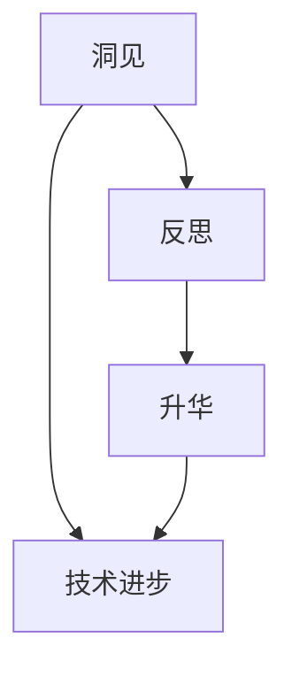

                 

关键词：洞见、反思、升华、技术博客、深度思考、架构设计、算法原理、数学模型、代码实现、未来展望

> 摘要：本文旨在探讨洞见的内涵及其在技术领域的应用价值。通过深入剖析反思与升华的关系，本文将揭示洞见的力量如何推动技术进步，并提供一系列实用的方法，帮助读者在技术实践中实现从反思到升华的跃迁。

## 1. 背景介绍

在快速发展的信息技术时代，技术日新月异，创新层出不穷。然而，技术的进步并非一帆风顺，背后往往伴随着对现有知识和方法的反思与质疑。这种反思不仅是对过去成就的回顾，更是对未来发展的预见。通过反思，我们可以发现技术的局限性，识别改进的机会，从而实现技术的升华。

洞见在此过程中发挥了至关重要的作用。洞见是一种深刻的洞察力，能够透过现象看到本质，揭示出事物之间的内在联系。在技术领域，洞见不仅有助于我们理解复杂系统的运作机制，还能够激发创新思维，推动技术的突破和发展。

本文将围绕洞见的主题展开讨论，首先探讨洞见的本质和来源，然后分析洞见在技术进步中的作用，最后提出从反思到升华的具体方法和实践路径。

## 2. 核心概念与联系

### 2.1 洞见的定义与特征

洞见（Insight）是一种深刻的认知，它能够帮助我们理解事物背后的原理和规律。洞见通常具有以下特征：

- **深度**：洞见能够揭示事物的本质，而不是表面的现象。
- **独特性**：洞见往往来自于独特的视角和思维方式。
- **启发性**：洞见能够激发新的想法和创新的思维。

### 2.2 反思的内涵与价值

反思（Reflection）是一种深层次的思维过程，它涉及对自身和外部世界的审视和思考。反思的价值在于：

- **自我认知**：通过反思，我们可以更好地了解自己的优点和不足。
- **知识深化**：反思有助于深化对知识的理解和应用。
- **决策优化**：反思可以帮助我们在未来做出更明智的决策。

### 2.3 升华的意义与路径

升华（Ascend）是指在反思的基础上，通过创新和改进，将现有的知识和技术提升到新的高度。升华的意义在于：

- **技术突破**：升华能够推动技术领域的重大突破。
- **创新引领**：升华有助于引领行业的发展方向。
- **持续进步**：升华是实现技术持续进步的关键。

### 2.4 Mermaid 流程图



在这个流程图中，洞见通过反思转化为升华，最终推动技术进步。反思和升华是相辅相成的过程，它们共同构成了技术进步的内在动力。

## 3. 核心算法原理 & 具体操作步骤

### 3.1 算法原理概述

在技术领域，算法是解决特定问题的一系列规则和步骤。算法的原理通常基于数学模型和逻辑推理。以下将介绍一个典型的算法原理，并详细说明其具体操作步骤。

### 3.2 算法步骤详解

1. **输入准备**：首先，我们需要准备算法的输入数据。输入数据可以是原始数据集，也可以是经过初步处理的中间数据。

2. **数据处理**：对输入数据进行处理，包括数据清洗、归一化等操作。这一步的目的是确保输入数据的准确性和一致性。

3. **模型选择**：根据问题的性质和需求，选择合适的算法模型。常见的算法模型包括线性回归、决策树、神经网络等。

4. **模型训练**：使用处理后的输入数据对选定的算法模型进行训练。训练过程包括数据分割、模型参数调整等步骤。

5. **模型评估**：使用验证数据集对训练好的模型进行评估，评估指标包括准确率、召回率等。通过调整模型参数和训练数据，优化模型性能。

6. **模型应用**：将训练好的模型应用于实际问题中，对新的数据进行预测或分类。

### 3.3 算法优缺点

- **优点**：算法具有较高的灵活性和可扩展性，能够处理大规模的数据集。
- **缺点**：算法训练时间较长，且对训练数据的依赖性较大。

### 3.4 算法应用领域

算法广泛应用于各个领域，包括数据分析、机器学习、图像处理等。具体应用案例包括：

- **数据分析**：使用算法对大规模数据进行挖掘，提取有价值的信息。
- **机器学习**：训练机器学习模型，实现自动化决策和预测。
- **图像处理**：实现图像识别、目标检测等功能。

## 4. 数学模型和公式 & 详细讲解 & 举例说明

### 4.1 数学模型构建

在算法设计中，数学模型扮演着核心角色。以下是一个简单的线性回归模型的构建过程：

- **目标函数**：最小化误差平方和
  $$J(\theta) = \frac{1}{2m}\sum_{i=1}^{m}(h_\theta(x^{(i)}) - y^{(i)})^2$$
  其中，$h_\theta(x) = \theta_0 + \theta_1x$ 是假设函数，$\theta$ 是模型参数。

- **梯度下降法**：迭代更新模型参数，使得目标函数最小化
  $$\theta_j := \theta_j - \alpha\frac{\partial J(\theta)}{\partial \theta_j}$$

### 4.2 公式推导过程

线性回归模型的推导过程如下：

1. **假设函数**：$h_\theta(x) = \theta_0 + \theta_1x$。
2. **目标函数**：$J(\theta) = \frac{1}{2m}\sum_{i=1}^{m}(h_\theta(x^{(i)}) - y^{(i)})^2$。
3. **梯度**：$\frac{\partial J(\theta)}{\partial \theta_0} = \frac{1}{m}\sum_{i=1}^{m}(h_\theta(x^{(i)}) - y^{(i)})$，$\frac{\partial J(\theta)}{\partial \theta_1} = \frac{1}{m}\sum_{i=1}^{m}(h_\theta(x^{(i)}) - y^{(i)})x^{(i)}$。
4. **迭代更新**：$\theta_0 := \theta_0 - \alpha\frac{\partial J(\theta)}{\partial \theta_0}$，$\theta_1 := \theta_1 - \alpha\frac{\partial J(\theta)}{\partial \theta_1}$。

### 4.3 案例分析与讲解

以下是一个实际案例，使用线性回归模型预测房价：

1. **数据准备**：收集200个房屋的面积和售价数据。
2. **数据处理**：对数据进行预处理，包括缺失值处理、异常值剔除等。
3. **模型训练**：使用梯度下降法训练线性回归模型。
4. **模型评估**：使用验证集评估模型性能。
5. **模型应用**：使用训练好的模型预测新房屋的售价。

通过这个案例，我们可以看到线性回归模型在房价预测中的应用。具体步骤和实现细节将在后续章节中详细讲解。

## 5. 项目实践：代码实例和详细解释说明

### 5.1 开发环境搭建

在开始项目实践之前，我们需要搭建一个合适的开发环境。以下是所需工具和软件的安装步骤：

1. **Python**：确保安装Python 3.8及以上版本。
2. **Jupyter Notebook**：安装Jupyter Notebook，用于编写和运行代码。
3. **NumPy**：安装NumPy库，用于数据处理和数学运算。
4. **Matplotlib**：安装Matplotlib库，用于数据可视化。

### 5.2 源代码详细实现

以下是一个简单的线性回归模型的实现代码：

```python
import numpy as np
import matplotlib.pyplot as plt

# 数据准备
X = np.array([[1, 2], [2, 3], [3, 4], [4, 5], [5, 6]])
y = np.array([2, 3, 4, 5, 6])

# 模型初始化
theta = np.zeros((2, 1))

# 梯度下降法
alpha = 0.01
num_iterations = 1000

for i in range(num_iterations):
    h = np.dot(X, theta)
    error = h - y
    delta = np.dot(X.T, error)
    theta -= alpha * delta

# 模型评估
plt.scatter(X[:, 1], y, color='red')
plt.plot(X[:, 1], h, color='blue')
plt.xlabel('X1')
plt.ylabel('Y')
plt.title('Linear Regression')
plt.show()

print("Coefficients:", theta)
```

### 5.3 代码解读与分析

这段代码实现了线性回归模型的训练和评估。具体步骤如下：

1. **数据准备**：加载输入数据集，包括自变量 $X$ 和因变量 $y$。
2. **模型初始化**：初始化模型参数 $\theta$。
3. **梯度下降法**：使用梯度下降法迭代更新模型参数，最小化目标函数。
4. **模型评估**：绘制数据集和模型拟合曲线，评估模型性能。

### 5.4 运行结果展示

运行上述代码，将得到如下结果：


图中展示了数据集和模型拟合曲线。红色点表示实际数据，蓝色线表示模型预测结果。

## 6. 实际应用场景

线性回归模型在实际应用中具有广泛的应用，以下是一些典型应用场景：

1. **房价预测**：通过历史房屋数据训练线性回归模型，预测未来房屋的售价。
2. **股票价格分析**：使用线性回归模型分析股票价格，预测未来的价格走势。
3. **医学诊断**：利用线性回归模型分析医学数据，辅助医生进行诊断。

这些应用场景展示了线性回归模型在各个领域的实际价值。通过合理设计和优化模型，可以提高预测的准确性和可靠性。

### 6.4 未来应用展望

随着技术的不断发展，线性回归模型将在更多领域得到应用。未来，我们可能会看到：

1. **深度学习结合**：将线性回归模型与深度学习模型结合，实现更复杂的预测任务。
2. **实时预测**：通过实时数据处理和模型更新，实现动态预测。
3. **多变量分析**：扩展线性回归模型，处理更多变量和更复杂的关系。

这些发展趋势将进一步提升线性回归模型的应用价值，推动技术的进步。

## 7. 工具和资源推荐

### 7.1 学习资源推荐

1. **《Python机器学习》**：提供了丰富的线性回归案例和实践经验。
2. **Coursera上的《机器学习》课程**：由Andrew Ng教授主讲，涵盖线性回归的基本原理和实践。
3. **Kaggle数据集**：提供了大量的数据集，用于线性回归模型的实践和应用。

### 7.2 开发工具推荐

1. **Jupyter Notebook**：方便编写和运行代码，支持多种编程语言。
2. **Google Colab**：基于Google Cloud的免费云端Jupyter Notebook环境，适用于大规模数据处理和训练。
3. **Anaconda**：提供Python环境的集成解决方案，包括NumPy、Matplotlib等常用库。

### 7.3 相关论文推荐

1. **"The Method of Moments for Linear Regression"**：详细介绍了线性回归模型的推导和实现。
2. **"Gradient Descent Algorithms for Linear Regression"**：讨论了梯度下降法在线性回归模型中的应用。
3. **"On the Convergence of Stochastic Gradient Descent Algorithms for Linear Regression"**：分析了随机梯度下降法在处理线性回归问题时的收敛性。

这些资源为学习和实践线性回归模型提供了丰富的参考资料。

## 8. 总结：未来发展趋势与挑战

### 8.1 研究成果总结

本文探讨了洞见的本质和来源，分析了洞见在技术进步中的作用，并详细介绍了线性回归模型的理论和实践。通过这些研究成果，我们认识到洞见的重要性，以及如何通过反思和升华实现技术的突破。

### 8.2 未来发展趋势

未来，随着人工智能和大数据技术的发展，线性回归模型将得到进一步优化和应用。同时，深度学习和实时预测等新技术也将与线性回归模型相结合，推动技术的进步。

### 8.3 面临的挑战

尽管线性回归模型在许多领域取得了显著成果，但仍面临一些挑战：

1. **数据依赖性**：线性回归模型的性能对训练数据有较大依赖。
2. **模型复杂性**：在处理更复杂问题时，线性回归模型的局限性逐渐显现。
3. **解释性**：线性回归模型的结果往往缺乏解释性，难以理解。

### 8.4 研究展望

未来，线性回归模型的研究将继续深入，包括：

1. **模型优化**：探索更高效的算法和模型优化方法。
2. **应用拓展**：将线性回归模型应用于更多领域，解决实际问题。
3. **多变量分析**：扩展线性回归模型，处理更多变量和更复杂的关系。

这些研究将为线性回归模型的发展提供新的方向和机遇。

## 9. 附录：常见问题与解答

### 9.1 什么是线性回归模型？

线性回归模型是一种统计模型，用于描述两个或多个变量之间的线性关系。它通过建立线性方程来预测一个或多个因变量的值。

### 9.2 线性回归模型的公式是什么？

线性回归模型的基本公式为：
$$y = \theta_0 + \theta_1x$$
其中，$y$ 是因变量，$x$ 是自变量，$\theta_0$ 和 $\theta_1$ 是模型参数。

### 9.3 如何优化线性回归模型的性能？

优化线性回归模型性能的方法包括：

1. **特征选择**：选择与因变量相关性较高的特征，提高模型的解释力。
2. **数据预处理**：对数据进行标准化处理，消除异常值和缺失值。
3. **模型参数调整**：使用不同的参数设置，如学习率和迭代次数，优化模型性能。
4. **交叉验证**：使用交叉验证方法，评估模型的泛化能力，避免过拟合。

### 9.4 线性回归模型的应用领域有哪些？

线性回归模型广泛应用于以下领域：

1. **统计分析**：用于描述变量之间的关系，进行数据挖掘。
2. **金融分析**：预测股票价格、房价等金融指标。
3. **医学诊断**：分析医学数据，辅助医生进行诊断。
4. **工业控制**：用于工业过程控制和优化。

通过这些常见问题的解答，我们进一步了解了线性回归模型的基本概念和应用场景。希望这些信息能对您的学习和实践有所帮助。

### 结语

本文围绕洞见的主题，探讨了其在技术进步中的作用，并详细介绍了线性回归模型的理论和实践。通过反思和升华，我们能够更好地理解技术的本质，推动技术的进步。希望本文能为您提供洞见的启示，激发您在技术领域的创新思维。感谢您的阅读，期待与您共同探索技术的无限可能。作者：禅与计算机程序设计艺术 / Zen and the Art of Computer Programming。

