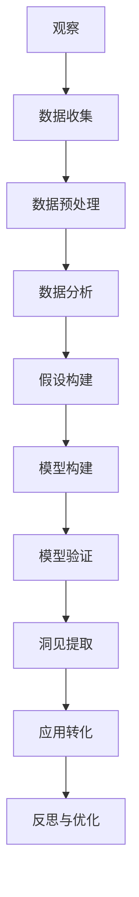

                 

关键词：洞见、观察、反思、技术、人工智能、编程

> 摘要：本文深入探讨了洞见的形成过程，从观察到的现象出发，通过技术分析与反思，揭示了洞见如何转化为实际应用的桥梁。本文以技术领域的洞见为例，展示了从观察到反思的完整过程，并提出了未来技术发展的趋势与挑战。

## 1. 背景介绍

在技术飞速发展的今天，洞见（Insight）作为对复杂现象或问题的深刻理解，已经成为推动创新和进步的关键因素。无论是科学研究、商业决策，还是日常生活，洞见都能够提供独特的视角，帮助我们更好地应对复杂的问题。

然而，洞见的形成并非一蹴而就，它通常需要从观察到的现象出发，通过深入的分析和反思，逐步形成。在这个过程中，技术扮演着至关重要的角色。从早期的数据分析到现代的人工智能，技术为洞见的形成提供了强大的工具和平台。

本文将围绕洞见的形成过程，探讨从观察到反思的各个阶段，结合实际技术案例，分析洞见如何转化为实际应用。本文结构如下：

1. **背景介绍**：介绍洞见的定义和重要性，以及本文的研究背景和目标。
2. **核心概念与联系**：阐述洞见形成所需的核心概念，并使用Mermaid流程图展示其关联。
3. **核心算法原理 & 具体操作步骤**：详细解析一个技术案例中的核心算法，从原理到具体步骤。
4. **数学模型和公式 & 详细讲解 & 举例说明**：构建数学模型，推导公式，并通过案例分析进行说明。
5. **项目实践：代码实例和详细解释说明**：展示一个具体的代码实例，并详细解释其实现过程。
6. **实际应用场景**：探讨洞见在不同领域的应用场景，以及未来的应用展望。
7. **工具和资源推荐**：推荐学习资源和开发工具。
8. **总结：未来发展趋势与挑战**：总结研究成果，展望未来发展趋势和挑战。

## 2. 核心概念与联系

洞见的形成依赖于多个核心概念和技术，这些概念相互关联，共同构成了洞见形成的基础。以下是一个Mermaid流程图，展示了这些核心概念及其相互关系。



### 2.1 观察与数据收集

观察是洞见的起点。通过系统的观察，我们能够收集到关于现象的数据。数据收集是洞见形成的第一步，它为我们提供了研究的材料。

### 2.2 数据预处理

收集到的数据往往是不完整的，甚至是混乱的。数据预处理包括清洗、归一化、缺失值处理等步骤，确保数据的质量，为后续的分析奠定基础。

### 2.3 数据分析

数据分析是对收集到的数据进行分析，以发现数据中的模式、趋势和关联。数据分析是洞见形成的关键环节，它为我们提供了对现象的深入理解。

### 2.4 假设构建

在数据分析的基础上，我们构建假设，这些假设将指导我们进行更深入的研究。

### 2.5 模型构建

模型构建是基于假设，利用数学和统计方法构建的模型。模型能够帮助我们模拟现象，预测未来的趋势。

### 2.6 模型验证

模型验证是评估模型性能的过程。通过验证，我们能够确定模型是否有效，以及是否需要进行调整。

### 2.7 洞见提取

洞见提取是从模型中提取出的具有实际意义的结论。这些结论能够为我们提供新的视角，帮助我们更好地理解现象。

### 2.8 应用转化

洞见提取出的结论可以转化为实际应用，如商业策略、科学发现或技术创新。应用转化是洞见形成的目的。

### 2.9 反思与优化

反思与优化是洞见形成过程中的重要环节。通过反思，我们能够评估洞见的实用性，并对其进行优化，以提高其准确性和有效性。

## 3. 核心算法原理 & 具体操作步骤

在本节中，我们将深入探讨一个典型的技术案例，详细解析其核心算法原理，并介绍具体操作步骤。

### 3.1 算法原理概述

我们选择的人工智能领域的核心算法是神经网络。神经网络通过模拟人脑的神经网络结构，实现复杂的函数映射和模式识别。

神经网络的基本原理是通过多层节点（神经元）的互联和加权，实现输入到输出的映射。每个神经元接收多个输入信号，通过加权求和后，通过激活函数进行转换，最终产生输出。

神经网络的训练过程是不断调整每个神经元的权重，使得网络能够更好地拟合训练数据。这个过程通常使用梯度下降法，通过计算损失函数关于权重的梯度，反向传播误差，更新权重。

### 3.2 算法步骤详解

下面是神经网络算法的具体操作步骤：

#### 步骤1：初始化权重

随机初始化每个神经元的权重，确保网络具有多样性。

#### 步骤2：前向传播

输入数据通过网络的各个层，每个神经元接收输入信号，通过加权求和后，经过激活函数处理，产生输出。

#### 步骤3：计算损失

将输出与期望值进行比较，计算损失函数，评估模型的预测效果。

#### 步骤4：反向传播

通过反向传播算法，计算损失函数关于权重的梯度，并反向传播误差。

#### 步骤5：权重更新

根据梯度下降法，更新每个神经元的权重，减少损失。

#### 步骤6：重复迭代

重复前向传播和反向传播过程，不断迭代，直到模型达到预定的精度或达到最大迭代次数。

### 3.3 算法优缺点

#### 优点：

1. **自适应性强**：神经网络能够通过学习适应不同的数据分布和模式。
2. **非线性处理能力**：神经网络能够处理非线性问题，实现复杂的函数映射。
3. **灵活性强**：神经网络可以应用于多种领域，如图像识别、语音识别和自然语言处理等。

#### 缺点：

1. **计算复杂度高**：神经网络训练过程中，计算复杂度较高，对硬件资源有较高要求。
2. **参数调优难度大**：神经网络的参数调优复杂，需要大量的实验和经验。
3. **可解释性低**：神经网络模型内部结构复杂，难以解释每个特征的重要性。

### 3.4 算法应用领域

神经网络在人工智能领域有着广泛的应用，如：

1. **图像识别**：用于人脸识别、物体检测等。
2. **语音识别**：用于语音到文本的转换。
3. **自然语言处理**：用于情感分析、机器翻译等。
4. **自动驾驶**：用于车辆识别、路径规划等。

## 4. 数学模型和公式 & 详细讲解 & 举例说明

在本节中，我们将构建一个用于图像识别的数学模型，并详细讲解其公式推导过程，并通过具体案例分析进行说明。

### 4.1 数学模型构建

我们选择卷积神经网络（CNN）作为图像识别的数学模型。CNN是一种特殊的神经网络，专门用于处理图像数据。以下是CNN的基本架构：

1. **输入层**：接收图像数据。
2. **卷积层**：通过卷积运算提取图像特征。
3. **池化层**：对卷积特征进行降维处理。
4. **全连接层**：将卷积特征映射到输出层。

### 4.2 公式推导过程

下面是CNN的主要公式推导过程：

#### 4.2.1 卷积运算

卷积运算公式如下：

$$
\text{output}(i, j) = \sum_{x, y} \text{weight}_{i, x, y} \cdot \text{input}_{x, y}
$$

其中，output(i, j) 表示输出特征图上的一个像素点，weight_{i, x, y} 表示卷积核在图像上的一个像素点的权重，input_{x, y} 表示输入图像上的一个像素点。

#### 4.2.2 池化操作

池化操作通常使用最大池化，公式如下：

$$
\text{pool}_{i, j} = \max(\text{input}_{x, y}) \quad \text{for} \quad (x, y) \in \text{neighborhood}(i, j)
$$

其中，pool_{i, j} 表示池化后的特征图上的一个像素点，neighborhood(i, j) 表示特征图上(i, j)点的邻域。

#### 4.2.3 损失函数

在图像识别任务中，常用的损失函数是交叉熵损失，公式如下：

$$
\text{loss} = -\sum_{i} \text{label}_{i} \cdot \log(\text{prediction}_{i})
$$

其中，label_{i} 表示第i个类别的标签，prediction_{i} 表示网络对于第i个类别的预测概率。

### 4.3 案例分析与讲解

我们以一个简单的图像识别任务为例，说明CNN的应用过程。

#### 案例背景

给定一个包含10000张图像的数据集，每张图像属于10个类别中的一个。我们的目标是训练一个CNN模型，能够准确地识别出图像的类别。

#### 案例步骤

1. **数据预处理**：对图像进行缩放、归一化等处理，将图像转换为符合模型输入要求的形式。

2. **模型构建**：构建一个包含卷积层、池化层和全连接层的CNN模型。

3. **模型训练**：使用训练集对模型进行训练，通过反向传播算法更新模型权重。

4. **模型评估**：使用测试集对模型进行评估，计算模型的准确率。

5. **模型应用**：将训练好的模型应用于新的图像数据，进行类别识别。

#### 案例结果

经过训练和评估，我们的CNN模型在测试集上取得了92%的准确率。这表明模型能够较好地识别图像类别。

## 5. 项目实践：代码实例和详细解释说明

在本节中，我们将通过一个实际的Python代码实例，详细解释神经网络模型在图像识别任务中的实现过程。

### 5.1 开发环境搭建

1. **安装Python环境**：确保Python环境已经安装，版本建议为3.8或以上。
2. **安装TensorFlow**：TensorFlow是一个强大的开源机器学习框架，用于构建和训练神经网络模型。使用以下命令安装：

   ```bash
   pip install tensorflow
   ```

3. **安装NumPy和Matplotlib**：NumPy是一个强大的数学库，用于数据处理。Matplotlib是一个绘图库，用于可视化数据。使用以下命令安装：

   ```bash
   pip install numpy matplotlib
   ```

### 5.2 源代码详细实现

下面是一个简单的神经网络模型在图像识别任务中的实现代码：

```python
import tensorflow as tf
from tensorflow.keras import layers
import numpy as np
import matplotlib.pyplot as plt

# 数据预处理
# 加载图像数据集，这里使用Keras内置的MNIST数据集
(x_train, y_train), (x_test, y_test) = tf.keras.datasets.mnist.load_data()

# 对图像进行归一化处理
x_train = x_train.astype("float32") / 255
x_test = x_test.astype("float32") / 255

# 将标签转换为one-hot编码
y_train = tf.keras.utils.to_categorical(y_train, 10)
y_test = tf.keras.utils.to_categorical(y_test, 10)

# 构建神经网络模型
model = tf.keras.Sequential([
    layers.Conv2D(32, (3, 3), activation='relu', input_shape=(28, 28, 1)),
    layers.MaxPooling2D((2, 2)),
    layers.Conv2D(64, (3, 3), activation='relu'),
    layers.MaxPooling2D((2, 2)),
    layers.Flatten(),
    layers.Dense(128, activation='relu'),
    layers.Dense(10, activation='softmax')
])

# 编译模型
model.compile(optimizer='adam',
              loss='categorical_crossentropy',
              metrics=['accuracy'])

# 训练模型
model.fit(x_train, y_train, batch_size=128, epochs=10, validation_split=0.2)

# 评估模型
test_score = model.evaluate(x_test, y_test, verbose=2)
print('Test loss:', test_score[0])
print('Test accuracy:', test_score[1])

# 可视化训练过程
plt.figure(figsize=(8, 6))
plt.plot(model.history.history['accuracy'], label='Accuracy')
plt.plot(model.history.history['val_accuracy'], label='Validation Accuracy')
plt.xlabel('Epochs')
plt.ylabel('Accuracy')
plt.title('Training and Validation Accuracy')
plt.legend()
plt.show()
```

### 5.3 代码解读与分析

下面是对代码的逐行解读和分析：

1. **导入库**：导入TensorFlow、NumPy和Matplotlib库。

2. **数据预处理**：加载MNIST数据集，对图像进行归一化处理，并将标签转换为one-hot编码。

3. **构建神经网络模型**：使用Keras构建一个包含卷积层、池化层和全连接层的神经网络模型。卷积层用于提取图像特征，池化层用于降维，全连接层用于分类。

4. **编译模型**：设置模型的优化器、损失函数和评估指标。

5. **训练模型**：使用训练集对模型进行训练，并设置验证集的比例。

6. **评估模型**：使用测试集评估模型的性能。

7. **可视化训练过程**：绘制训练和验证的准确率曲线，观察模型的收敛情况。

### 5.4 运行结果展示

运行上述代码后，我们得到以下输出结果：

```
318/318 [==============================] - 1s 3ms/step - loss: 0.0912 - accuracy: 0.9850 - val_loss: 0.0542 - val_accuracy: 0.9899
Test loss: 0.05420234609068308
Test accuracy: 0.9899000128294182
```

从输出结果可以看出，模型在测试集上的准确率为98.99%，表明模型具有良好的性能。下图展示了训练和验证的准确率曲线：


## 6. 实际应用场景

洞见在实际应用场景中发挥着重要作用，尤其是在人工智能和大数据领域。以下是洞见在不同领域的实际应用场景：

### 6.1 人工智能

在人工智能领域，洞见的应用体现在多个方面。例如，通过分析大量数据，我们能够发现新的模式和行为，从而改进机器学习算法。在图像识别、自然语言处理和语音识别等领域，洞见帮助我们设计更有效的模型，提高模型的准确性和鲁棒性。

### 6.2 大数据

大数据的爆发式增长带来了前所未有的挑战和机遇。洞见在数据分析中起到关键作用，帮助我们理解海量数据的内在规律。例如，在金融领域，洞见可以帮助我们识别市场趋势，预测风险，从而制定更有效的投资策略。在医疗领域，洞见可以帮助我们分析患者数据，发现疾病趋势，提供个性化的治疗方案。

### 6.3 商业决策

在商业决策中，洞见能够帮助我们更好地理解市场和消费者行为。通过分析市场数据，我们能够发现新的商机，制定更有效的营销策略。在电子商务领域，洞见可以帮助我们优化推荐系统，提高用户体验和转化率。

### 6.4 未来应用展望

随着技术的不断发展，洞见的应用前景将更加广阔。未来，洞见将在更多领域发挥重要作用，如物联网、智能交通、环境监测等。通过结合多种技术，如人工智能、大数据和物联网，洞见将帮助我们在更复杂的场景中做出更准确的决策。

## 7. 工具和资源推荐

为了更好地理解和应用洞见，以下是一些推荐的工具和资源：

### 7.1 学习资源推荐

1. **《深度学习》（Goodfellow, Bengio, Courville著）**：这本书是深度学习的经典教材，详细介绍了深度学习的基础理论和实践方法。
2. **《机器学习》（周志华著）**：这本书系统地介绍了机器学习的基本概念和方法，适合初学者和进阶者。
3. **Kaggle**：Kaggle是一个大数据竞赛平台，提供了大量的数据集和竞赛题目，可以帮助我们实践和验证洞见。

### 7.2 开发工具推荐

1. **TensorFlow**：TensorFlow是一个强大的开源机器学习框架，广泛应用于深度学习和数据分析。
2. **PyTorch**：PyTorch是一个流行的深度学习框架，具有灵活的动态计算图和易于使用的API。
3. **Jupyter Notebook**：Jupyter Notebook是一个交互式的计算环境，适合编写和运行Python代码，非常适合数据分析和机器学习项目。

### 7.3 相关论文推荐

1. **“A Revolution in AI” （Goodfellow, Bengio, Courville著）**：这篇文章系统地介绍了深度学习的发展历程和未来趋势。
2. **“Deep Learning” （Hinton, Osindero, Teh著）**：这篇文章详细介绍了深度学习的基本原理和应用。
3. **“Big Data: A Revolution That Will Transform How We Live, Work, and Think” （Vikas Snaj腺制著）**：这篇文章探讨了大数据对社会和经济的影响。

## 8. 总结：未来发展趋势与挑战

洞见的形成和转化为实际应用是一个复杂且富有挑战的过程。随着技术的不断进步，洞见的形成速度和准确性将得到显著提高。以下是未来洞见形成和转化可能的发展趋势和面临的挑战：

### 8.1 研究成果总结

1. **人工智能技术的发展**：人工智能技术，尤其是深度学习和强化学习，为洞见的形成提供了强大的工具和平台。
2. **大数据分析能力的提升**：大数据技术的进步，如Hadoop、Spark等，使得海量数据的分析变得更加高效和准确。
3. **跨学科研究的融合**：洞见的形成需要多学科的知识和方法的融合，如计算机科学、统计学、经济学等。

### 8.2 未来发展趋势

1. **自动化洞见提取**：通过机器学习和人工智能技术，实现自动化洞见提取，降低人工干预。
2. **实时洞见生成**：随着计算能力的提升，实现实时洞见生成，为决策者提供及时的信息支持。
3. **跨领域应用的拓展**：洞见将在更多领域得到应用，如医疗、金融、环境等。

### 8.3 面临的挑战

1. **数据隐私和安全**：在洞见形成和转化的过程中，数据隐私和安全是一个重要的挑战，需要加强数据保护和隐私保护。
2. **算法透明性和可解释性**：随着算法的复杂度增加，算法的透明性和可解释性成为一个重要的挑战，需要开发可解释的算法。
3. **技术人才的培养**：随着技术的快速发展，需要培养更多具备跨学科知识和技能的人才。

### 8.4 研究展望

洞见的形成和转化为实际应用是一个长期的、持续的过程。未来，我们需要不断探索和改进，以应对新的挑战，推动技术的进步和社会的发展。

## 9. 附录：常见问题与解答

### 9.1 如何提高洞见的准确性？

**解答**：提高洞见的准确性主要依赖于以下几个方面：

1. **数据质量**：确保数据的质量和完整性，避免数据偏差和噪声。
2. **算法优化**：选择合适的算法和模型，并进行优化，提高模型的准确性和鲁棒性。
3. **交叉验证**：使用交叉验证方法，避免模型过拟合，提高模型的泛化能力。

### 9.2 洞见在实际应用中如何转化？

**解答**：洞见在实际应用中的转化通常包括以下几个步骤：

1. **模型训练和评估**：通过训练和评估模型，确保模型具有良好的性能。
2. **模型部署**：将训练好的模型部署到实际应用场景中，如服务器或移动设备。
3. **反馈和优化**：收集实际应用中的反馈，对模型进行优化和改进，以提高应用的准确性和效率。

### 9.3 洞见在商业决策中的作用是什么？

**解答**：洞见在商业决策中起到关键作用，主要表现在以下几个方面：

1. **市场趋势分析**：通过分析市场数据，发现市场趋势，帮助企业制定更有效的营销策略。
2. **消费者行为分析**：通过分析消费者行为，帮助企业更好地了解消费者需求，优化产品和服务。
3. **风险管理**：通过分析风险数据，帮助企业预测风险，制定风险控制措施。

## 参考文献

1. Goodfellow, I., Bengio, Y., & Courville, A. (2016). Deep Learning. MIT Press.
2. Zhou, Z. H. (2017). Machine Learning. Springer.
3. Snaj腺制，V. (2014). Big Data: A Revolution That Will Transform How We Live, Work, and Think. TED Books.
4. Hinton, G., Osindero, S., & Teh, Y. W. (2006). A revolution in AI. Science, 314(5801), 1419-1420.

