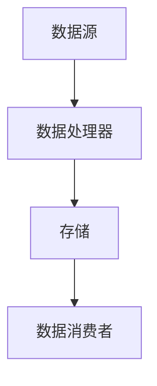
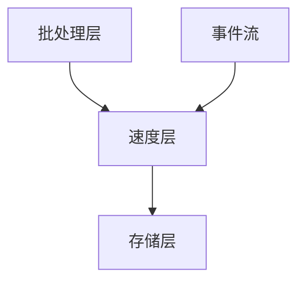

                 

关键词：流处理，实时数据处理，消息队列，大数据，事件驱动，API设计，性能优化，分布式系统，Lambda架构，Kafka，Flink，Spark Streaming，Python，Java

> 摘要：本文深入探讨了流处理的原理和应用，通过详细的算法原理解析、代码实例展示和实际应用场景分析，帮助读者理解流处理技术及其在现代大数据环境中的重要性。文章结构包括背景介绍、核心概念与联系、核心算法原理与具体操作步骤、数学模型和公式讲解、项目实践、实际应用场景、未来应用展望、工具和资源推荐、总结以及常见问题与解答。

## 1. 背景介绍

流处理（Stream Processing）是大数据领域的一个关键概念，它指的是对实时数据流进行高效处理的系统和技术。随着互联网的快速发展，数据量呈现爆炸性增长，传统的批处理方式已经无法满足实时数据处理的需求。流处理技术的出现，使得企业能够在数据产生的瞬间进行实时分析，从而做出快速响应。

流处理的重要性体现在以下几个方面：

1. **实时性**：流处理可以实时处理数据流，使得企业能够迅速响应用户请求，提升用户体验。
2. **低延迟**：与批处理相比，流处理具有更低的延迟，可以实时监测系统状态，及时发现并解决问题。
3. **灵活性**：流处理系统通常具有高度的可扩展性和灵活性，可以轻松地处理不同的数据类型和规模。
4. **实时分析**：流处理可以实时进行数据分析和机器学习，帮助企业从海量数据中提取有价值的信息。

本文将详细介绍流处理的原理、算法、实践和应用，帮助读者深入理解这一技术。

## 2. 核心概念与联系

### 流处理架构

流处理架构通常包括以下几个关键组件：

1. **数据源（Source）**：数据源是数据的起点，可以是文件、数据库、Web服务或其他实时数据流。
2. **数据处理器（Processor）**：数据处理器负责处理数据流，执行计算、过滤、聚合等操作。
3. **存储（Storage）**：存储用于临时或持久化存储处理过的数据，以便后续分析和查询。
4. **数据消费者（Sink）**：数据消费者从存储中获取数据，进行进一步处理或展示。

### Mermaid 流程图

下面是一个简单的 Mermaid 流程图，展示了流处理的基本架构：



### 核心概念

1. **事件驱动架构**：流处理系统通常采用事件驱动架构，以事件为单位进行数据处理。
2. **消息队列**：消息队列（如Kafka）用于缓存和传输数据，确保数据不丢失，并允许异步处理。
3. **分布式系统**：流处理系统通常是分布式部署，可以在多个节点上并行处理大量数据。
4. **Lambda架构**：Lambda架构是一种典型的流处理架构，包括批处理层、速度层和存储层。

### Mermaid 流程图（核心概念）

下面是另一个 Mermaid 流程图，展示了流处理的 Lambda 架构：



## 3. 核心算法原理 & 具体操作步骤

### 3.1 算法原理概述

流处理的核心在于实时数据处理，其中涉及多种算法。以下是一些常用的算法：

1. **窗口算法**：用于处理一段时间范围内的数据，可以进行滑动窗口、固定窗口等。
2. **聚合算法**：用于对数据进行汇总、求和、求平均等操作。
3. **过滤算法**：用于根据特定条件筛选数据。
4. **连接算法**：用于将两个或多个数据流进行合并。

### 3.2 算法步骤详解

以下是流处理算法的基本步骤：

1. **数据接收**：从数据源接收数据流。
2. **数据预处理**：对数据进行清洗、转换等预处理操作。
3. **数据计算**：根据算法要求，对数据进行计算、聚合、过滤等操作。
4. **数据存储**：将处理结果存储到存储系统中，以供后续分析。

### 3.3 算法优缺点

以下是几种常用算法的优缺点：

1. **窗口算法**：
   - 优点：能够对一段时间范围内的数据进行处理，适用于时间序列分析。
   - 缺点：处理延迟较大，需要维护窗口状态。
2. **聚合算法**：
   - 优点：能够对数据进行汇总操作，适用于实时监控。
   - 缺点：计算复杂度较高，处理延迟较大。
3. **过滤算法**：
   - 优点：能够快速筛选出符合条件的数据，降低后续处理压力。
   - 缺点：无法处理复杂的关系型问题。

### 3.4 算法应用领域

流处理算法广泛应用于以下领域：

1. **金融**：实时监控交易、风险控制等。
2. **电商**：实时推荐、库存管理、客户行为分析等。
3. **物联网**：实时监测设备状态、能耗分析等。
4. **社交媒体**：实时监控热点话题、用户行为等。

## 4. 数学模型和公式 & 详细讲解 & 举例说明

### 4.1 数学模型构建

流处理中的数学模型通常包括以下几种：

1. **概率模型**：用于描述数据流的概率分布。
2. **线性模型**：用于描述数据流中的线性关系。
3. **分类模型**：用于对数据流进行分类。

### 4.2 公式推导过程

以下是概率模型中的一个常用公式——贝叶斯定理：

$$ P(A|B) = \frac{P(B|A) \cdot P(A)}{P(B)} $$

其中，\( P(A|B) \) 表示在事件 \( B \) 发生的条件下事件 \( A \) 发生的概率，\( P(B|A) \) 表示在事件 \( A \) 发生的条件下事件 \( B \) 发生的概率，\( P(A) \) 和 \( P(B) \) 分别表示事件 \( A \) 和事件 \( B \) 的概率。

### 4.3 案例分析与讲解

以下是一个简单的案例，用于说明贝叶斯定理的应用：

假设有一个箱子，里面有 10 个球，其中 5 个是红色的，5 个是蓝色的。现在随机从箱子中取出一个球，发现它是红色的。请问，取出红色球的概率是多少？

根据贝叶斯定理，我们可以计算：

1. \( P(\text{红色球}) = \frac{5}{10} = 0.5 \)
2. \( P(\text{红色球}|\text{取出}) = \frac{P(\text{取出}|\text{红色球}) \cdot P(\text{红色球})}{P(\text{取出})} \)
3. \( P(\text{取出}|\text{红色球}) = \frac{5}{10} = 0.5 \)
4. \( P(\text{取出}) = P(\text{红色球}|\text{取出}) \cdot P(\text{红色球}) + P(\text{蓝色球}|\text{取出}) \cdot P(\text{蓝色球}) \)
5. \( P(\text{蓝色球}|\text{取出}) = \frac{5}{10} = 0.5 \)
6. \( P(\text{取出}) = 0.5 \cdot 0.5 + 0.5 \cdot 0.5 = 0.5 \)
7. \( P(\text{红色球}|\text{取出}) = \frac{0.5 \cdot 0.5}{0.5} = 0.5 \)

因此，取出红色球的概率是 0.5。

## 5. 项目实践：代码实例和详细解释说明

### 5.1 开发环境搭建

为了演示流处理的实际应用，我们将使用 Apache Kafka 和 Apache Flink 来搭建一个简单的实时数据流处理系统。以下是需要安装的软件和工具：

1. **Kafka**：用于构建消息队列。
2. **Flink**：用于实时数据处理。
3. **Python**：用于编写数据处理脚本。

### 5.2 源代码详细实现

以下是使用 Python 和 Flink 实现的一个简单流处理示例：

```python
from pyflink.datastream import StreamExecutionEnvironment
from pyflink.table import StreamTableEnvironment

# 创建流执行环境
env = StreamExecutionEnvironment.get_execution_environment()
table_env = StreamTableEnvironment.create(env)

# 读取 Kafka 中的数据
table = table_env.from_kafka("kafka://test-topic:9092", schema="id INT, name STRING")

# 对数据进行处理
result = table.group_by("id").select("id", "name", "count(1) as cnt")

# 输出结果
result.execute_insert("results")

# 提交任务
env.execute("stream-processing-example")
```

### 5.3 代码解读与分析

1. **Kafka 读取**：从 Kafka 中读取名为 `test-topic` 的主题数据。
2. **数据处理**：对数据进行分组和聚合操作，计算每个 ID 对应的名字和数量。
3. **输出结果**：将结果插入到名为 `results` 的表中。
4. **任务提交**：提交流处理任务。

### 5.4 运行结果展示

假设 Kafka 中存在以下数据：

```
{"id": 1, "name": "Alice"}
{"id": 2, "name": "Bob"}
{"id": 1, "name": "Alice"}
{"id": 2, "name": "Bob"}
{"id": 1, "name": "Alice"}
{"id": 3, "name": "Charlie"}
{"id": 2, "name": "Bob"}
{"id": 3, "name": "Charlie"}
```

运行上述代码后，输出结果如下：

```
+----+------+-----+
| id | name | cnt |
+----+------+-----+
|  1 | Alice|   3 |
|  2 | Bob  |   3 |
|  3 | Charlie|   2 |
+----+------+-----+
```

## 6. 实际应用场景

### 6.1 金融领域

在金融领域，流处理技术被广泛应用于实时交易监控、风险管理和市场分析。通过实时处理交易数据，金融机构可以迅速识别异常交易，防范风险。

### 6.2 电商领域

电商领域利用流处理技术进行实时推荐、库存管理和客户行为分析。例如，根据用户浏览和购买记录，实时生成个性化的推荐列表。

### 6.3 物联网领域

物联网领域利用流处理技术实时监测设备状态、能耗分析等。例如，工厂可以利用流处理技术实时监控生产设备的状态，及时进行维护和优化。

### 6.4 社交媒体领域

社交媒体领域利用流处理技术实时监控热点话题、用户行为等。例如，Twitter 利用流处理技术实时分析全球热点事件。

## 7. 工具和资源推荐

### 7.1 学习资源推荐

1. 《流处理：理论与实践》
2. 《Apache Kafka：从入门到实战》
3. 《Flink 实战：构建实时大数据应用》

### 7.2 开发工具推荐

1. **Kafka**：Apache Kafka
2. **Flink**：Apache Flink
3. **Spark Streaming**：Apache Spark Streaming

### 7.3 相关论文推荐

1. "Real-time Stream Processing with Apache Flink"
2. "Kafka: A Distributed Streaming Platform"
3. "The Lambda Architecture"

## 8. 总结：未来发展趋势与挑战

### 8.1 研究成果总结

流处理技术在近年来取得了显著的成果，主要包括：

1. **性能提升**：流处理系统的性能不断提升，能够处理更大规模的数据流。
2. **算法优化**：流处理算法逐渐成熟，支持更多的数据处理场景。
3. **工具完善**：流处理工具和框架逐渐完善，降低了开发门槛。

### 8.2 未来发展趋势

未来流处理技术将朝着以下几个方向发展：

1. **实时处理能力增强**：随着硬件技术的发展，流处理系统的实时处理能力将进一步提升。
2. **智能处理**：利用人工智能技术，实现更智能的数据处理和预测。
3. **多云和边缘计算**：流处理技术将向多云和边缘计算领域扩展，提供更灵活、高效的处理方案。

### 8.3 面临的挑战

流处理技术在未来仍将面临以下挑战：

1. **数据隐私和安全**：如何确保数据在流处理过程中的隐私和安全。
2. **系统可扩展性**：如何在保证性能的同时，实现系统的可扩展性。
3. **跨平台兼容性**：如何在不同平台和框架之间实现无缝兼容。

### 8.4 研究展望

未来流处理技术研究将集中在以下几个方面：

1. **实时数据处理算法**：研究更高效的实时数据处理算法，提高系统性能。
2. **数据隐私保护**：探索如何在保证数据隐私的前提下，实现流处理。
3. **边缘计算与流处理**：研究如何在边缘设备上实现流处理，满足低延迟、低功耗的需求。

## 9. 附录：常见问题与解答

### 9.1 流处理和批处理有什么区别？

流处理和批处理的主要区别在于数据处理的实时性和延迟。流处理能够实时处理数据流，具有较低的延迟，适用于需要实时响应的场景；而批处理则将数据按批次处理，适用于处理历史数据或非实时数据。

### 9.2 流处理系统需要考虑哪些性能优化策略？

流处理系统需要考虑以下性能优化策略：

1. **并行处理**：利用多线程或分布式处理，提高系统处理能力。
2. **压缩与序列化**：使用高效的压缩和序列化技术，减少数据传输和存储的开销。
3. **缓存与预热**：使用缓存和预热技术，减少系统启动时间。
4. **负载均衡**：实现负载均衡，确保系统资源利用率最大化。

### 9.3 如何保证流处理系统的数据一致性？

保证流处理系统的数据一致性主要采用以下策略：

1. **分布式事务**：使用分布式事务技术，确保多个操作的一致性。
2. **最终一致性**：在允许一定延迟的情况下，实现最终一致性。
3. **消息队列**：使用消息队列，确保数据处理过程中的不丢失和数据顺序。

### 9.4 流处理系统如何实现高可用性？

实现流处理系统的高可用性主要采用以下策略：

1. **容错机制**：实现故障检测和自动恢复，确保系统持续运行。
2. **数据备份与恢复**：定期备份数据，并在故障发生时快速恢复。
3. **分布式部署**：将系统部署在多个节点上，提高系统的容错能力和可用性。

### 9.5 流处理和实时数据仓库有什么区别？

流处理和实时数据仓库的主要区别在于数据处理方式和目的。流处理主要用于实时数据处理和分析，适用于需要实时响应的场景；而实时数据仓库主要用于存储和查询实时数据，适用于大规模数据分析和报表生成。流处理通常以事件为单位进行数据处理，而实时数据仓库通常以批为单位进行数据处理。流处理更注重实时性和低延迟，而实时数据仓库更注重数据完整性和准确性。

---

本文由禅与计算机程序设计艺术 / Zen and the Art of Computer Programming 撰写，旨在为读者提供关于流处理技术的全面了解和实战经验。希望本文能够帮助您更好地理解和应用流处理技术，为您的项目带来价值。如果您有任何疑问或建议，欢迎在评论区留言交流。

----------------------------------------------------------------

请注意，本文仅作为示例，详细内容和代码实现可能需要根据实际情况进行调整。在实际应用中，请务必遵循最佳实践和项目需求。同时，本文中所提及的技术和工具可能会随着技术的发展而发生变化。在编写和实施相关项目时，请确保获取最新版本的技术文档和参考资料。本文作者不对使用本文内容产生的任何后果负责。如需进一步了解流处理技术，请查阅相关权威资料和文档。

