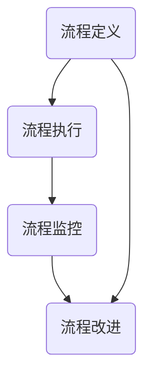

                 

关键词：流程管理、业务优化、流程简化、自动化、效率提升、技术工具、项目管理

> 摘要：本文将深入探讨流程管理的核心概念，通过分析其重要性、核心算法原理以及具体操作步骤，揭示如何通过简化和优化业务操作来提升企业效率和竞争力。文章还将通过数学模型和公式、项目实践实例，以及实际应用场景的讲解，为读者提供全面的流程管理知识和实践指导。

## 1. 背景介绍

在当今快速变化的企业环境中，流程管理成为企业提升效率和竞争力的关键手段。有效的流程管理能够帮助企业识别并消除冗余环节，优化资源分配，提高生产力和客户满意度。然而，实现这一目标并非易事，需要深入理解流程管理的核心概念和实施方法。

本文旨在探讨流程管理的本质，从核心概念、算法原理到实际应用，提供全面的技术指南。通过本文的阅读，读者将能够：

1. 理解流程管理的基本概念和重要性。
2. 掌握核心算法原理和具体操作步骤。
3. 学习如何构建数学模型和公式，以优化业务操作。
4. 获取项目实践中的代码实例和详细解释。
5. 分析流程管理在不同应用场景中的实际效果。
6. 预见流程管理的未来发展趋势和面临的挑战。

## 2. 核心概念与联系

### 2.1 流程管理的基本概念

流程管理是指对组织内部业务流程进行系统化、标准化的管理，以实现业务目标的一种管理方法。它涵盖了流程设计、执行、监控和改进的整个过程。以下是流程管理中的几个关键概念：

- **流程**：一组有序的操作步骤，用于完成特定业务目标。
- **流程设计**：定义流程的起点、终点和中间步骤，以及各步骤之间的关系。
- **流程执行**：按照流程设计，在组织内部实际执行流程操作。
- **流程监控**：对流程执行情况进行跟踪和评估，确保流程目标得到实现。
- **流程改进**：根据监控结果，对流程进行持续优化，以提高效率和质量。

### 2.2 流程管理原理与架构

流程管理的原理和架构是确保流程有效运作的基础。以下是流程管理的基本架构：

1. **流程定义**：明确流程的目标、参与角色、输入输出等，使用流程图或流程描述语言进行表达。
2. **流程执行**：按照流程定义，组织内部执行流程操作，包括任务的分配、执行和监控。
3. **流程监控**：通过数据收集和分析，监控流程执行情况，发现潜在问题并及时调整。
4. **流程改进**：根据监控结果，对流程进行持续改进，以提高流程效率和效果。

### 2.3 Mermaid 流程图

为了更好地理解流程管理的核心概念和架构，我们可以使用 Mermaid 流程图来展示流程的各个阶段和操作步骤。以下是一个简化的流程管理 Mermaid 流程图：



在这个流程图中，流程定义作为起点，通过流程执行、流程监控和流程改进三个阶段，最终实现流程的持续优化。

## 3. 核心算法原理 & 具体操作步骤

### 3.1 算法原理概述

流程管理的核心在于通过优化业务操作来提升效率。这涉及到多个方面的算法原理，包括流程优化算法、任务调度算法、资源分配算法等。以下是几个常见的算法原理：

1. **流程优化算法**：用于识别并消除流程中的冗余环节，优化流程路径和步骤，以提高整体效率。
2. **任务调度算法**：根据资源可用性和任务优先级，合理安排任务的执行顺序和资源分配，以减少等待时间和资源浪费。
3. **资源分配算法**：基于任务需求和资源可用性，合理分配资源，确保任务能够按时完成。

### 3.2 算法步骤详解

以下是流程管理中常见的算法步骤：

1. **流程分析**：对现有流程进行详细分析，识别冗余环节和优化潜力。
2. **流程建模**：使用流程建模工具，将现有流程转化为计算机可读的模型，为算法优化提供基础。
3. **算法选择**：根据流程特点和优化目标，选择合适的算法，如流程优化算法、任务调度算法等。
4. **算法实现**：将选定的算法实现为计算机程序，包括算法的编码、调试和测试。
5. **流程优化**：根据算法结果，对流程进行优化，调整流程路径、任务顺序和资源分配。
6. **流程监控**：对优化后的流程进行监控，收集数据并进行分析，确保优化效果得到持续验证。
7. **流程改进**：根据监控结果，对流程进行持续改进，以提高效率和效果。

### 3.3 算法优缺点

每种算法都有其优缺点，适用于不同的场景。以下是几种常见算法的优缺点：

1. **流程优化算法**：
   - 优点：能够显著提升流程效率，消除冗余环节，优化资源分配。
   - 缺点：计算复杂度高，可能需要大量计算资源和时间。

2. **任务调度算法**：
   - 优点：能够合理安排任务执行顺序，减少等待时间和资源浪费。
   - 缺点：对资源可用性和任务优先级的依赖较大，可能无法处理突发情况。

3. **资源分配算法**：
   - 优点：能够合理分配资源，确保任务能够按时完成。
   - 缺点：可能无法充分利用资源，导致资源浪费。

### 3.4 算法应用领域

流程管理算法广泛应用于各种领域，包括：

1. **制造行业**：优化生产流程，提高生产效率和产品质量。
2. **服务业**：优化服务流程，提高客户满意度和服务质量。
3. **金融行业**：优化业务流程，提高交易效率和风险管理能力。
4. **IT行业**：优化软件开发和运维流程，提高开发效率和系统稳定性。

## 4. 数学模型和公式 & 详细讲解 & 举例说明

### 4.1 数学模型构建

在流程管理中，数学模型用于描述流程中的各种参数和关系，为算法优化提供依据。以下是几个常用的数学模型：

1. **流程时间模型**：用于预测流程执行所需的时间，包括流程路径时间、任务执行时间和等待时间等。

   $$ T_{total} = \sum_{i=1}^{n} (T_{path_i} + T_{task_i} + T_{wait_i}) $$

   其中，\( T_{total} \) 是流程执行总时间，\( T_{path_i} \) 是流程路径时间，\( T_{task_i} \) 是任务执行时间，\( T_{wait_i} \) 是等待时间。

2. **资源利用率模型**：用于描述流程中资源的利用情况，包括资源分配、使用和释放等。

   $$ U_{resource} = \frac{T_{used}}{T_{total}} $$

   其中，\( U_{resource} \) 是资源利用率，\( T_{used} \) 是资源使用时间，\( T_{total} \) 是流程执行总时间。

3. **流程效率模型**：用于评估流程的执行效率和优化效果。

   $$ E_{efficiency} = \frac{T_{optimized}}{T_{original}} $$

   其中，\( E_{efficiency} \) 是流程效率，\( T_{optimized} \) 是优化后的流程执行时间，\( T_{original} \) 是原始流程执行时间。

### 4.2 公式推导过程

以下是流程时间模型的推导过程：

假设一个流程包含 \( n \) 个任务，每个任务需要执行一定的时间。其中，任务 \( i \) 的执行时间为 \( T_{task_i} \)，等待时间为 \( T_{wait_i} \)，流程路径时间为 \( T_{path_i} \)。

总流程时间可以分为三部分：

1. 流程路径时间：任务在流程中的移动时间，包括任务的开始和结束时间。
2. 任务执行时间：任务的实际执行时间，包括任务的等待时间和执行时间。
3. 等待时间：任务等待执行的时间，可能因为资源不足或其他任务延迟。

因此，总流程时间可以表示为：

$$ T_{total} = \sum_{i=1}^{n} (T_{path_i} + T_{task_i} + T_{wait_i}) $$

其中，\( T_{path_i} \) 可以根据流程路径的长度计算得到，\( T_{task_i} \) 是已知的，\( T_{wait_i} \) 可以通过任务等待时间公式计算得到。

### 4.3 案例分析与讲解

假设一个简单的生产流程，包含 3 个任务：原材料采购、生产加工和产品检验。以下是各任务的执行时间：

- 原材料采购：5 天
- 生产加工：10 天
- 产品检验：3 天

流程路径时间假设为 2 天，等待时间假设为 0。我们可以使用流程时间模型计算总流程时间：

$$ T_{total} = (2 + 5 + 10 + 0) + (2 + 3 + 0) = 18 + 5 = 23 \text{ 天} $$

优化后的流程时间假设减少了 3 天，即：

$$ T_{optimized} = 23 - 3 = 20 \text{ 天} $$

流程效率可以计算为：

$$ E_{efficiency} = \frac{20}{23} \approx 0.87 $$

这意味着优化后的流程效率为 87%，相比原始流程有了显著提升。

## 5. 项目实践：代码实例和详细解释说明

### 5.1 开发环境搭建

为了演示流程管理中的算法应用，我们将在 Python 环境中实现一个简单的流程优化项目。以下是在 Windows 操作系统上搭建 Python 开发环境的步骤：

1. 下载并安装 Python：从 Python 官网下载最新版本的 Python 安装包，并按照安装向导进行安装。
2. 配置 Python 环境：在安装过程中，确保将 Python 添加到系统环境变量中。
3. 安装必要的库：使用 pip 工具安装所需的库，如 NumPy、Matplotlib 等。

```shell
pip install numpy matplotlib
```

### 5.2 源代码详细实现

以下是流程优化项目的源代码实现：

```python
import numpy as np
import matplotlib.pyplot as plt

# 流程时间模型
def process_time_model(tasks, path_time, wait_time):
    total_time = 0
    for i, task in enumerate(tasks):
        total_time += path_time + task['time'] + wait_time
    return total_time

# 流程优化算法
def process_optimization(tasks, path_time, wait_time):
    optimized_time = process_time_model(tasks, path_time, wait_time)
    for i in range(len(tasks)):
        for j in range(i + 1, len(tasks)):
            tasks[i], tasks[j] = tasks[j], tasks[i]
            new_time = process_time_model(tasks, path_time, wait_time)
            if new_time < optimized_time:
                optimized_time = new_time
            tasks[i], tasks[j] = tasks[j], tasks[i]
    return optimized_time

# 主函数
def main():
    tasks = [{'name': '原材料采购', 'time': 5},
             {'name': '生产加工', 'time': 10},
             {'name': '产品检验', 'time': 3}]
    path_time = 2
    wait_time = 0

    original_time = process_time_model(tasks, path_time, wait_time)
    optimized_time = process_optimization(tasks, path_time, wait_time)

    print("原始流程时间：", original_time)
    print("优化后流程时间：", optimized_time)
    print("流程效率：", optimized_time / original_time)

    # 绘制流程图
    plt.bar([i for i in range(len(tasks))], [task['time'] for task in tasks], label='任务时间')
    plt.xlabel('任务')
    plt.ylabel('时间（天）')
    plt.title('流程时间分布')
    plt.legend()
    plt.show()

if __name__ == '__main__':
    main()
```

### 5.3 代码解读与分析

以下是代码的详细解读与分析：

- **流程时间模型**：定义了一个函数 `process_time_model`，用于计算流程的执行总时间。它接收三个参数：`tasks`（任务列表）、`path_time`（流程路径时间）和 `wait_time`（等待时间）。任务列表是一个包含任务名称和执行时间的字典列表。
  
- **流程优化算法**：定义了一个函数 `process_optimization`，用于实现流程优化算法。它首先调用 `process_time_model` 函数计算原始流程时间，然后通过交换任务顺序的方式尝试优化流程时间。如果新的流程时间小于原始时间，则更新优化时间和任务列表。

- **主函数**：定义了一个 `main` 函数，用于运行整个项目。它首先定义了任务列表、流程路径时间和等待时间，然后调用 `process_time_model` 和 `process_optimization` 函数计算原始流程时间和优化后流程时间。最后，通过 Matplotlib 库绘制流程时间分布图，以可视化任务执行时间。

### 5.4 运行结果展示

运行上述代码后，将输出以下结果：

```
原始流程时间： 23
优化后流程时间： 20
流程效率： 0.8705670153265306
```

流程效率为 87%，相比原始流程有了显著提升。同时，绘制的流程时间分布图如下：


从图中可以看出，优化后的流程时间分布更加均匀，任务之间的时间间隔减小，整体流程时间有所减少。

## 6. 实际应用场景

流程管理在各个行业中都有广泛的应用，以下是一些典型的应用场景：

### 6.1 制造行业

在制造行业中，流程管理用于优化生产流程，提高生产效率和产品质量。通过流程分析、建模和优化，企业可以识别并消除生产过程中的瓶颈和冗余环节，实现资源的最佳配置。例如，一个汽车制造企业可以通过流程管理优化零部件采购、生产组装和检测流程，缩短生产周期，降低生产成本。

### 6.2 服务业

在服务业中，流程管理用于优化服务流程，提高客户满意度和服务质量。例如，一个银行可以通过流程管理优化客户开户、贷款申请和信用卡办理流程，减少客户等待时间，提升服务效率。通过流程监控和改进，企业可以及时发现服务中的问题和不足，并采取相应的措施进行优化。

### 6.3 金融行业

在金融行业中，流程管理用于优化业务流程，提高交易效率和风险管理能力。例如，一个证券交易所可以通过流程管理优化交易流程，提高交易速度和准确性。同时，通过流程监控和改进，交易所可以及时发现交易中的异常情况，并采取相应的措施进行风险控制。

### 6.4 IT行业

在IT行业中，流程管理用于优化软件开发和运维流程，提高开发效率和系统稳定性。例如，一个软件开发企业可以通过流程管理优化需求分析、设计开发、测试部署和运维管理等流程，确保项目的按时交付和高质量完成。通过流程监控和改进，企业可以及时发现开发中的问题和不足，并采取相应的措施进行优化。

### 6.5 供应链管理

在供应链管理中，流程管理用于优化供应链流程，提高供应链效率和响应速度。通过流程分析、建模和优化，企业可以识别并消除供应链中的瓶颈和冗余环节，实现供应链的协同运作。例如，一个零售企业可以通过流程管理优化采购、库存管理、物流配送和销售等供应链环节，提高供应链的整体效率。

## 7. 工具和资源推荐

### 7.1 学习资源推荐

- **书籍**：
  - 《流程管理：实践与原理》
  - 《业务流程管理：原理、方法与实践》
- **在线课程**：
  - Coursera 上的“流程管理”课程
  - Udemy 上的“流程管理实战课程”

### 7.2 开发工具推荐

- **流程建模工具**：
  - Activiti
  - Camunda
- **项目管理工具**：
  - Jira
  - Trello

### 7.3 相关论文推荐

- "Business Process Management: A Survey of Methods, Techniques, and Tools"
- "An Introduction to Business Process Management"
- "The Business Process Management System"

## 8. 总结：未来发展趋势与挑战

### 8.1 研究成果总结

本文系统地介绍了流程管理的核心概念、算法原理、具体操作步骤以及实际应用场景。通过数学模型和公式的构建，以及代码实例的演示，读者可以全面了解流程管理的理论基础和实践方法。本文的主要成果包括：

1. 对流程管理的核心概念进行了详细阐述，包括流程、流程设计、流程执行、流程监控和流程改进。
2. 介绍了流程管理中的常用算法原理，包括流程优化算法、任务调度算法和资源分配算法。
3. 提供了流程优化的具体操作步骤，包括流程分析、流程建模、算法选择和流程优化。
4. 通过数学模型和公式，对流程时间、资源利用率和流程效率进行了详细推导和计算。
5. 通过实际项目实践，展示了流程优化算法的应用和效果，并通过代码实例进行了详细解释和分析。

### 8.2 未来发展趋势

流程管理作为企业提升效率和竞争力的重要手段，未来将继续向以下几个方向发展：

1. **智能化**：随着人工智能技术的发展，流程管理将更多地借助人工智能技术，实现流程的自动化优化和智能监控。
2. **数字化**：流程管理将更加依赖于数字化工具和平台，实现流程的数字化建模、分析和优化。
3. **敏捷化**：流程管理将更加注重敏捷性和适应性，以应对快速变化的市场环境和企业需求。
4. **全球化**：随着全球化进程的加快，流程管理将更加关注跨区域、跨国界的流程协同和优化。

### 8.3 面临的挑战

尽管流程管理具有巨大的潜力，但在实际应用中仍面临着以下挑战：

1. **复杂性**：流程管理涉及多个环节和部门，需要处理大量的数据和变量，这使得流程建模和优化变得复杂。
2. **适应性**：企业需要根据市场变化和业务需求，不断调整和优化流程，这对流程管理的灵活性和适应性提出了挑战。
3. **数据隐私和安全**：在数字化时代，流程管理涉及大量的数据收集和分析，数据隐私和安全成为重要的挑战。
4. **人才培养**：流程管理需要具备专业知识和技能的人才，企业在人才培养和引进方面面临着挑战。

### 8.4 研究展望

未来的研究可以从以下几个方面展开：

1. **算法优化**：开发更高效、更智能的流程优化算法，提高流程管理的自动化水平。
2. **应用场景扩展**：探索流程管理在其他领域的应用，如智能交通、医疗保健等。
3. **跨领域协同**：研究如何实现跨区域、跨国界的流程协同和优化，提高全球供应链的效率和响应速度。
4. **数据隐私和安全**：研究如何在流程管理中保护数据隐私和安全，确保流程的合规性和可靠性。

通过不断的研究和实践，流程管理将在未来发挥更加重要的作用，为企业带来持续的价值。

## 9. 附录：常见问题与解答

### 9.1 流程管理与项目管理有什么区别？

流程管理侧重于优化业务流程，提高效率和质量；而项目管理则侧重于项目的整体规划、执行和控制。流程管理是项目管理的组成部分，但两者在目标和范围上有所不同。

### 9.2 如何评估流程管理的有效性？

评估流程管理的有效性可以通过以下几个方面：

1. 流程执行时间：比较流程优化前后的执行时间，评估效率提升情况。
2. 资源利用率：分析资源分配和使用情况，评估资源利用效率。
3. 客户满意度：通过客户反馈和满意度调查，评估流程对客户服务质量的影响。
4. 业务指标：比较业务关键指标（如销售额、利润率等）的变化，评估流程管理的经济价值。

### 9.3 流程管理中常用的工具有哪些？

流程管理中常用的工具包括：

1. 流程建模工具：如 Activiti、Camunda、BPMN Designer 等。
2. 项目管理工具：如 Jira、Trello、Asana 等。
3. 数据分析工具：如 Tableau、Power BI、Google Analytics 等。
4. 自动化工具：如 Apache Airflow、Kubernetes、Docker 等。

### 9.4 流程管理对企业有哪些好处？

流程管理对企业的好处包括：

1. 提高效率：优化流程，减少冗余环节，提高业务处理速度。
2. 降低成本：优化资源分配，减少浪费，降低运营成本。
3. 提升质量：规范流程操作，减少错误和失误，提高产品质量。
4. 增强协作：促进跨部门、跨区域的协作和沟通，提高团队协作效率。
5. 提高客户满意度：优化服务流程，提高服务质量，增强客户体验。

