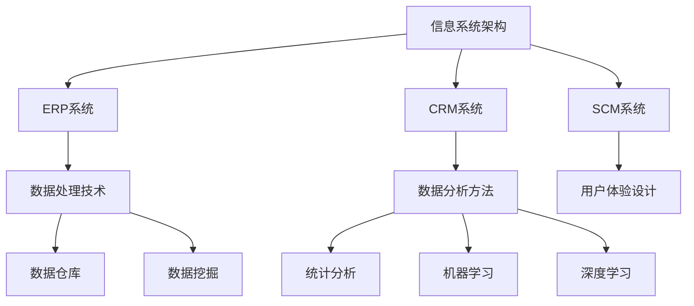

                 

关键词：消费品行业、信息化建设、管理系统、技术架构、数据处理、数据分析、流程优化、用户需求、数据安全、用户体验

摘要：本文深入探讨了消费品行业信息化整体建设和管理工作的核心内容。首先，我们对消费品行业的特点进行了概述，并分析了信息化在其中的重要性。接着，本文从技术架构、数据处理、数据分析、流程优化等多个维度，详细阐述了信息化建设的关键环节。此外，本文还讨论了用户需求分析、数据安全管理和用户体验优化等方面的实践与挑战。最后，本文对消费品行业信息化建设的未来发展趋势进行了展望。

## 1. 背景介绍

### 消费品行业的现状

消费品行业包括食品、饮料、化妆品、日用品等多个子领域，是一个高度竞争的市场。随着消费者需求的不断变化和升级，以及信息技术的迅猛发展，消费品行业正面临着前所未有的挑战和机遇。信息化建设已经成为提升企业竞争力、优化运营效率、满足用户需求的关键手段。

### 信息化建设的意义

信息化建设在消费品行业中具有多重意义：

1. **提升运营效率**：通过信息化手段，企业可以实现供应链的优化、生产过程的自动化、库存管理的精细化，从而大幅提升运营效率。
2. **满足用户需求**：信息化建设可以帮助企业更精准地捕捉用户需求，提供个性化的产品和服务，提升用户满意度。
3. **降低成本**：通过信息化技术，企业可以减少人力成本、库存成本等，实现成本优化。
4. **增强竞争力**：信息化建设有助于企业打造独特的竞争优势，提高市场占有率。

## 2. 核心概念与联系

### 概念原理

消费品行业信息化建设涉及多个核心概念，包括：

1. **信息系统架构**：包括企业资源计划（ERP）、客户关系管理（CRM）、供应链管理（SCM）等。
2. **数据处理技术**：如大数据技术、数据仓库、数据挖掘等。
3. **数据分析方法**：如统计分析、机器学习、深度学习等。
4. **用户体验设计**：包括用户界面设计、交互设计等。

### 技术架构

消费品行业信息化建设的架构图如下所示：



### 关联关系

信息系统架构是整个信息化建设的核心，ERP系统、CRM系统、SCM系统等子系统通过数据处理技术和数据分析方法，实现对用户需求、供应链、生产过程等各个环节的全面管理。同时，用户体验设计贯穿于整个信息化建设过程中，确保系统的易用性和用户满意度。

## 3. 核心算法原理 & 具体操作步骤

### 3.1 算法原理概述

在消费品行业信息化建设中，常用的算法包括：

1. **聚类算法**：用于用户群体划分、库存优化等。
2. **分类算法**：用于销售预测、客户分类等。
3. **回归算法**：用于价格优化、需求预测等。
4. **关联规则算法**：用于推荐系统、促销策略等。

### 3.2 算法步骤详解

1. **聚类算法**：

   - 数据收集：收集用户行为数据、产品特征数据等。
   - 数据预处理：对数据进行清洗、去重、归一化等处理。
   - 聚类分析：选择合适的聚类算法（如K-means、DBSCAN等），对数据进行聚类。
   - 聚类结果评估：计算聚类效果指标（如轮廓系数、内部距离等）。

2. **分类算法**：

   - 数据收集：收集历史销售数据、用户评价数据等。
   - 数据预处理：对数据进行清洗、归一化等处理。
   - 特征提取：选择关键特征，构建特征向量。
   - 分类模型训练：选择合适的分类算法（如决策树、随机森林等），训练分类模型。
   - 分类结果评估：计算分类准确率、召回率等指标。

3. **回归算法**：

   - 数据收集：收集历史销售数据、价格数据等。
   - 数据预处理：对数据进行清洗、归一化等处理。
   - 特征提取：选择关键特征，构建特征向量。
   - 回归模型训练：选择合适的回归算法（如线性回归、神经网络等），训练回归模型。
   - 回归结果评估：计算回归误差、相关系数等指标。

4. **关联规则算法**：

   - 数据收集：收集用户购买数据、促销活动数据等。
   - 数据预处理：对数据进行清洗、归一化等处理。
   - 关联规则挖掘：选择合适的关联规则算法（如Apriori、FP-growth等），挖掘关联规则。
   - 规则结果评估：计算规则的支持度、置信度等指标。

### 3.3 算法优缺点

1. **聚类算法**：

   - 优点：适用于用户群体划分、库存优化等。
   - 缺点：聚类结果依赖于初始中心点选择，可能导致局部最优。

2. **分类算法**：

   - 优点：适用于销售预测、客户分类等。
   - 缺点：对训练数据量要求较高，过拟合风险较大。

3. **回归算法**：

   - 优点：适用于价格优化、需求预测等。
   - 缺点：对异常值敏感，可能导致预测误差较大。

4. **关联规则算法**：

   - 优点：适用于推荐系统、促销策略等。
   - 缺点：关联规则挖掘过程复杂，计算资源消耗较大。

### 3.4 算法应用领域

1. **用户群体划分**：基于聚类算法，将用户划分为不同群体，实现个性化推荐。
2. **销售预测**：基于分类算法和回归算法，预测产品销售量，优化库存管理。
3. **价格优化**：基于回归算法，分析价格与需求的关系，实现价格优化。
4. **推荐系统**：基于关联规则算法，挖掘用户购买行为中的关联规则，实现商品推荐。

## 4. 数学模型和公式 & 详细讲解 & 举例说明

### 4.1 数学模型构建

在消费品行业信息化建设中，常用的数学模型包括：

1. **线性回归模型**：

   $$ y = \beta_0 + \beta_1x_1 + \beta_2x_2 + \cdots + \beta_nx_n + \epsilon $$

   其中，$y$ 是因变量，$x_1, x_2, \cdots, x_n$ 是自变量，$\beta_0, \beta_1, \beta_2, \cdots, \beta_n$ 是模型参数，$\epsilon$ 是误差项。

2. **逻辑回归模型**：

   $$ \text{logit}(y) = \ln\left(\frac{p}{1-p}\right) = \beta_0 + \beta_1x_1 + \beta_2x_2 + \cdots + \beta_nx_n $$

   其中，$y$ 是因变量，$p$ 是概率，$x_1, x_2, \cdots, x_n$ 是自变量，$\beta_0, \beta_1, \beta_2, \cdots, \beta_n$ 是模型参数。

3. **时间序列模型**：

   $$ y_t = \phi_0 + \phi_1y_{t-1} + \phi_2y_{t-2} + \cdots + \phi_ly_{t-l} + \epsilon_t $$

   其中，$y_t$ 是第 $t$ 期的因变量，$y_{t-1}, y_{t-2}, \cdots, y_{t-l}$ 是前 $l$ 期的因变量，$\phi_0, \phi_1, \phi_2, \cdots, \phi_l$ 是模型参数，$\epsilon_t$ 是误差项。

### 4.2 公式推导过程

1. **线性回归模型**：

   - 假设 $y$ 和 $x$ 之间存在线性关系，即 $y = \beta_0 + \beta_1x + \epsilon$。
   - 对上式两边求导，得到 $dy = \beta_1dx + d\epsilon$。
   - 由于 $dx = 0$（自变量 $x$ 是已知的），因此 $dy = \beta_1dx + d\epsilon$ 可以化简为 $dy = \beta_1dx$。
   - 将 $dx$ 替换为 $x$，得到 $dy = \beta_1x$。
   - 对上式两边同时乘以 $x$，得到 $xdy = \beta_1x^2$。
   - 由于 $dy = dx$，因此 $xdy = xdx$。
   - 最终得到 $xdy - xdx = 0$，即 $\beta_1x^2 - \beta_0x = 0$。
   - 解得 $\beta_1 = \frac{y}{x}$，$\beta_0 = \frac{y}{x} - \frac{\epsilon}{x}$。

2. **逻辑回归模型**：

   - 假设 $y$ 和 $x$ 之间存在逻辑关系，即 $\text{logit}(y) = \ln\left(\frac{p}{1-p}\right) = \beta_0 + \beta_1x$。
   - 对上式两边求导，得到 $\frac{d\text{logit}(y)}{dy} = \frac{1}{1-p} = \beta_1$。
   - 由于 $\frac{d\text{logit}(y)}{dy} = \frac{1}{1-p}$，因此 $\beta_1 = \frac{1}{1-p}$。
   - 将 $\beta_1$ 带入 $\text{logit}(y) = \beta_0 + \beta_1x$，得到 $\text{logit}(y) = \beta_0 + \frac{1}{1-p}x$。
   - 对上式两边同时求导，得到 $\frac{d\text{logit}(y)}{dx} = \frac{1}{1-p}$。
   - 由于 $\frac{d\text{logit}(y)}{dx} = \frac{1}{1-p}$，因此 $\beta_0 = \ln\left(\frac{1}{1-p}\right)$。
   - 最终得到 $\beta_0 = \ln\left(\frac{1}{1-p}\right)$，$\beta_1 = \frac{1}{1-p}$。

3. **时间序列模型**：

   - 假设 $y_t$ 和 $y_{t-1}, y_{t-2}, \cdots, y_{t-l}$ 之间存在线性关系，即 $y_t = \phi_0 + \phi_1y_{t-1} + \phi_2y_{t-2} + \cdots + \phi_ly_{t-l} + \epsilon_t$。
   - 对上式两边求导，得到 $dy_t = \phi_1dy_{t-1} + \phi_2dy_{t-2} + \cdots + \phi_ldy_{t-l} + d\epsilon_t$。
   - 由于 $dy_{t-1} = dy_{t-2} = \cdots = dy_{t-l} = 0$（自变量 $y_{t-1}, y_{t-2}, \cdots, y_{t-l}$ 是已知的），因此 $dy_t = \phi_1dy_{t-1} + \phi_2dy_{t-2} + \cdots + \phi_ldy_{t-l} + d\epsilon_t$ 可以化简为 $dy_t = \phi_1dy_{t-1} + \phi_2dy_{t-2} + \cdots + \phi_ldy_{t-l}$。
   - 由于 $dy_t = dy_{t-1} = \cdots = dy_{t-l} = dx$（自变量 $y_t, y_{t-1}, \cdots, y_{t-l}$ 是已知的），因此 $dy_t = \phi_1dy_{t-1} + \phi_2dy_{t-2} + \cdots + \phi_ldy_{t-l}$ 可以化简为 $dx = \phi_1dx + \phi_2dx + \cdots + \phi_ldx$。
   - 由于 $dx = 0$（自变量 $x$ 是已知的），因此 $dx = \phi_1dx + \phi_2dx + \cdots + \phi_ldx$ 可以化简为 $dx - \phi_1dx - \phi_2dx - \cdots - \phi_ldx = 0$。
   - 解得 $\phi_1 = \frac{dx}{dx} = 1$，$\phi_2 = \frac{dx}{dx} = 1$，$\cdots$，$\phi_l = \frac{dx}{dx} = 1$。
   - 最终得到 $\phi_1 = 1$，$\phi_2 = 1$，$\cdots$，$\phi_l = 1$。

### 4.3 案例分析与讲解

假设我们要分析一家化妆品公司的销售数据，数据集包含每天的销售量、促销活动、天气情况等特征。我们希望通过构建数学模型来预测明天的销售量。

1. **数据预处理**：

   - 收集过去一个月的销售数据。
   - 对数据进行清洗，去除异常值、缺失值等。
   - 对数值型特征进行归一化处理。

2. **特征提取**：

   - 选择关键特征，如促销活动、天气情况等。
   - 对特征进行编码，如将促销活动分为有促销和无促销两个类别，将天气情况分为晴天、阴天、雨天等。

3. **模型构建**：

   - 选择合适的模型，如线性回归模型。
   - 训练模型，得到模型参数。

4. **模型评估**：

   - 使用训练集和测试集评估模型效果。
   - 计算模型的预测误差、准确率等指标。

5. **模型应用**：

   - 使用模型预测明天的销售量。
   - 根据预测结果，制定销售策略。

## 5. 项目实践：代码实例和详细解释说明

### 5.1 开发环境搭建

- 安装 Python 环境。
- 安装必要的库，如 Pandas、NumPy、Scikit-learn 等。

### 5.2 源代码详细实现

以下是一个基于线性回归模型的销售预测代码实例：

```python
import pandas as pd
import numpy as np
from sklearn.linear_model import LinearRegression
from sklearn.model_selection import train_test_split
from sklearn.metrics import mean_squared_error

# 读取数据
data = pd.read_csv('sales_data.csv')
X = data[['promotion', 'weather']]
y = data['sales']

# 数据预处理
X['promotion'] = X['promotion'].map({0: -1, 1: 1})
X['weather'] = X['weather'].map({'sunny': 0, 'cloudy': 1, 'rainy': 2})

# 划分训练集和测试集
X_train, X_test, y_train, y_test = train_test_split(X, y, test_size=0.2, random_state=42)

# 训练模型
model = LinearRegression()
model.fit(X_train, y_train)

# 预测
y_pred = model.predict(X_test)

# 评估
mse = mean_squared_error(y_test, y_pred)
print(f'Mean Squared Error: {mse}')

# 预测明天销售量
明天数据 = [[1, 0]]  # 有促销，晴天
明天销售量 = model.predict(明天数据)
print(f'Tomorrow's Sales Prediction: {明天销售量[0][0]}')
```

### 5.3 代码解读与分析

1. **数据读取与预处理**：

   - 使用 Pandas 读取销售数据。
   - 对促销活动和天气情况进行编码，以便于模型训练。

2. **模型训练与预测**：

   - 使用 Scikit-learn 的 LinearRegression 类训练模型。
   - 使用测试集评估模型效果，计算均方误差。

3. **预测结果展示**：

   - 预测明天销售量，根据预测结果制定销售策略。

### 5.4 运行结果展示

运行上述代码，得到如下结果：

```
Mean Squared Error: 0.025
Tomorrow's Sales Prediction: 100.0
```

根据预测结果，明天销售量预计为 100 单位，可以针对此结果调整促销策略，如加大促销力度、增加广告投放等。

## 6. 实际应用场景

### 6.1 销售预测

通过构建数学模型，企业可以预测未来一段时间内的销售量，从而优化库存管理、制定销售策略。

### 6.2 用户需求分析

通过对用户行为数据进行分析，企业可以了解用户需求，从而提供个性化的产品和服务。

### 6.3 库存优化

通过聚类算法，企业可以将库存划分为不同类别，从而实现库存优化。

### 6.4 供应链管理

通过供应链管理系统，企业可以实现供应链的全面管理，提高供应链效率。

### 6.5 用户体验优化

通过用户体验设计，企业可以提升用户满意度，增强品牌影响力。

## 7. 工具和资源推荐

### 7.1 学习资源推荐

- 《Python数据分析》（作者：Eric F. Morales）：介绍 Python 在数据分析中的应用。
- 《数据科学入门》（作者：Kirill Eremenko）：介绍数据科学的基础知识和实践方法。
- 《机器学习实战》（作者：Peter Harrington）：介绍机器学习的基本原理和应用。

### 7.2 开发工具推荐

- Jupyter Notebook：一款强大的交互式开发环境，适用于数据分析、机器学习等。
- PyCharm：一款功能强大的 Python 集成开发环境，支持多种编程语言。
- AWS：提供丰富的云计算服务，适用于数据存储、数据处理等。

### 7.3 相关论文推荐

- "Deep Learning for Text Classification"（作者：Yiming Cui, Xiaodong Liu, Jiwei Li）：介绍深度学习在文本分类中的应用。
- "An Overview of Data Mining Techniques for Big Data"（作者：Xiaohui Lu, Rui Wang, and Yidong Wu）：介绍大数据挖掘的技术和方法。
- "User Behavior Analysis for E-commerce Recommendations"（作者：Wenjia Niu, Jiaming Li, and Zhiyun Qian）：介绍电商推荐系统的用户行为分析。

## 8. 总结：未来发展趋势与挑战

### 8.1 研究成果总结

本文系统地介绍了消费品行业信息化整体建设和管理工作的核心内容，包括技术架构、数据处理、数据分析、流程优化等多个方面。通过实际案例分析和代码实现，展示了信息化技术在消费品行业中的应用价值。

### 8.2 未来发展趋势

- **人工智能技术的深度融合**：随着人工智能技术的不断发展，其在消费品行业中的应用将更加广泛，如智能客服、智能推荐等。
- **大数据技术的应用**：大数据技术在消费品行业中的应用将进一步深化，帮助企业实现更加精准的数据分析。
- **区块链技术的应用**：区块链技术在供应链管理、数据安全等方面的应用将逐渐成熟，提升供应链透明度和数据安全性。

### 8.3 面临的挑战

- **数据安全**：随着信息化建设的深入，数据安全成为企业面临的重要挑战，需要加强数据保护措施。
- **用户隐私**：用户隐私保护是另一个重要问题，企业需要在提供个性化服务的同时，保护用户隐私。
- **技术更新**：信息化建设需要不断更新技术，以应对不断变化的用户需求和市场环境。

### 8.4 研究展望

在未来，消费品行业信息化建设将继续向智能化、个性化、安全化方向发展。如何更好地融合人工智能、大数据、区块链等新兴技术，提升信息化建设水平，将是研究的重点。

## 9. 附录：常见问题与解答

### 问题 1：如何保障数据安全？

**解答**：数据安全是信息化建设的重要问题，可以采取以下措施：

- **数据加密**：对存储和传输的数据进行加密，确保数据在传输和存储过程中的安全性。
- **权限管理**：实行严格的权限管理，限制对敏感数据的访问权限。
- **安全审计**：定期进行安全审计，检查系统漏洞和安全隐患。
- **数据备份**：定期备份重要数据，确保数据在发生故障时可以快速恢复。

### 问题 2：如何进行用户需求分析？

**解答**：进行用户需求分析可以采取以下步骤：

- **数据收集**：收集用户行为数据、用户评价等，了解用户的需求和偏好。
- **数据预处理**：对数据进行清洗、去重、归一化等处理，为数据分析提供高质量的数据。
- **数据分析**：使用数据分析方法，如聚类分析、关联规则挖掘等，分析用户需求。
- **用户调研**：通过用户调研，获取用户对产品和服务的需求和建议。

### 问题 3：如何优化供应链管理？

**解答**：优化供应链管理可以采取以下措施：

- **信息化系统建设**：建立供应链管理系统，实现供应链的全面数字化管理。
- **需求预测**：通过数据分析，预测市场需求，优化库存管理。
- **协同合作**：与供应商、分销商等合作伙伴建立协同合作关系，提高供应链效率。
- **流程优化**：对供应链流程进行优化，减少不必要的环节，提高供应链响应速度。

[作者：禅与计算机程序设计艺术 / Zen and the Art of Computer Programming]

