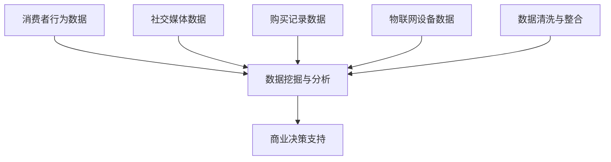

                 

关键词：消费大数据、商业价值、数据分析、未来商业趋势

摘要：在数字化时代，消费大数据已经成为商业运作的制高点。本文将探讨消费大数据的核心概念、算法原理、数学模型以及实际应用，分析其在未来商业中的潜在价值与发展挑战，为读者提供全面的技术视角和前瞻性的思考。

## 1. 背景介绍

随着互联网、物联网和移动通信技术的迅猛发展，全球范围内的数据量呈现出爆炸性增长。据IDC（国际数据公司）预测，全球数据量将以每年40%的速度增长，到2025年，全球数据总量将达到175ZB。在这些海量数据中，消费大数据占据了重要地位。消费大数据是指从消费者行为、购买记录、社交媒体互动等渠道收集而来的数据，这些数据反映了消费者的需求、偏好和趋势。

消费大数据的价值在于，它为企业和政府提供了深入了解市场和消费者的窗口。通过分析消费大数据，企业可以洞察市场动态，优化产品和服务，提升客户满意度，从而实现商业增长。同时，政府也可以利用消费大数据进行社会管理和政策制定，提高公共服务水平。

### 1.1 消费大数据的来源

消费大数据的来源非常广泛，主要包括以下几个方面：

- **电商平台数据**：电商平台如亚马逊、淘宝、京东等是消费大数据的重要来源，包括用户购买记录、浏览行为、评价反馈等。

- **社交媒体数据**：社交媒体平台如Facebook、微博、Instagram等，提供了丰富的用户互动数据，包括用户生成内容、点赞、评论等。

- **线下交易数据**：线下商店的POS机、自动售货机等设备可以记录消费者的购买行为。

- **物联网设备数据**：智能设备如智能手表、智能家居等可以实时收集消费者的行为数据。

### 1.2 消费大数据的应用场景

消费大数据在商业领域的应用场景广泛，主要包括以下几个方面：

- **精准营销**：通过分析消费大数据，企业可以了解目标消费者的需求和行为，从而制定更精准的营销策略。

- **产品优化**：企业可以利用消费大数据来分析产品性能、用户体验，从而改进产品设计和功能。

- **供应链管理**：消费大数据可以帮助企业优化库存管理、物流配送等供应链环节。

- **客户服务**：通过分析消费大数据，企业可以提供更加个性化的客户服务，提升客户满意度和忠诚度。

## 2. 核心概念与联系

在深入探讨消费大数据之前，我们需要了解一些核心概念和它们之间的联系。以下是一个简单的Mermaid流程图，展示了消费大数据相关的主要概念和它们之间的关系。



### 2.1 消费者行为数据

消费者行为数据是消费大数据的核心部分，它包括消费者的购买历史、浏览记录、搜索关键词、点击率等。这些数据可以揭示消费者的需求和偏好，是制定营销策略的重要依据。

### 2.2 社交媒体数据

社交媒体数据包括用户在社交媒体平台上的互动行为，如发帖、评论、点赞等。这些数据反映了消费者的情感状态和社交关系，有助于深入了解消费者的心理和行为。

### 2.3 购买记录数据

购买记录数据是消费者在电商平台上的交易记录，包括购买时间、购买商品、购买金额等。这些数据可以帮助企业分析销售趋势，优化库存和供应链管理。

### 2.4 物联网设备数据

物联网设备数据包括智能设备收集的消费者行为数据，如地理位置、使用频率、设备状态等。这些数据可以提供更细致的消费者行为分析，有助于企业进行精准营销。

### 2.5 数据清洗与整合

数据清洗与整合是消费大数据分析的基础工作，它包括数据清洗、数据整合和数据预处理等步骤。通过数据清洗和整合，可以确保数据的准确性和一致性，为后续的数据挖掘和分析奠定基础。

### 2.6 数据挖掘与分析

数据挖掘与分析是消费大数据的核心环节，它利用统计学、机器学习、自然语言处理等技术，从海量数据中提取有价值的信息和知识。通过数据挖掘和分析，企业可以深入了解消费者行为，制定更科学的商业决策。

### 2.7 商业决策支持

商业决策支持是消费大数据的最终目标，它通过数据分析和挖掘，为企业的营销、产品优化、供应链管理等提供科学的决策依据。良好的商业决策支持可以显著提高企业的竞争力和盈利能力。

## 3. 核心算法原理 & 具体操作步骤

### 3.1 算法原理概述

在消费大数据分析中，常用的核心算法包括聚类分析、关联规则挖掘、分类算法等。以下是这些算法的基本原理：

- **聚类分析**：通过将相似的数据点归为一类，揭示数据中的内在结构。常用的聚类算法有K-Means、DBSCAN等。

- **关联规则挖掘**：通过发现数据项之间的关联关系，揭示消费者行为中的潜在模式。常用的算法有Apriori、Eclat等。

- **分类算法**：通过建立分类模型，将数据分为不同的类别。常用的分类算法有决策树、随机森林、支持向量机等。

### 3.2 算法步骤详解

以下是这些算法的具体操作步骤：

#### 3.2.1 聚类分析

1. **数据预处理**：对原始数据进行清洗和标准化处理，确保数据的准确性和一致性。

2. **选择聚类算法**：根据数据的特性和需求，选择合适的聚类算法，如K-Means。

3. **初始化聚类中心**：随机选择若干数据点作为初始聚类中心。

4. **分配数据点**：将每个数据点分配到最近的聚类中心。

5. **更新聚类中心**：计算每个聚类的均值，作为新的聚类中心。

6. **迭代优化**：重复步骤4和5，直到聚类中心不再发生变化。

7. **结果分析**：分析聚类结果，了解数据中的内在结构。

#### 3.2.2 关联规则挖掘

1. **数据预处理**：对原始数据进行清洗和转换，将数据转换为合适的格式。

2. **生成频繁项集**：使用Apriori算法或Eclat算法，找出数据中的频繁项集。

3. **生成关联规则**：从频繁项集中提取关联规则，如支持度、置信度等。

4. **筛选规则**：根据设定的阈值，筛选出有意义的关联规则。

5. **结果分析**：分析关联规则，了解消费者行为中的潜在模式。

#### 3.2.3 分类算法

1. **数据预处理**：对原始数据进行清洗和标准化处理，确保数据的准确性和一致性。

2. **选择分类算法**：根据数据的特性和需求，选择合适的分类算法，如决策树、随机森林等。

3. **训练模型**：使用训练数据集，训练分类模型。

4. **模型评估**：使用测试数据集，评估分类模型的性能。

5. **应用模型**：将分类模型应用于新的数据，进行预测和分类。

### 3.3 算法优缺点

#### 3.3.1 聚类分析

- **优点**：简单易用，可以自动发现数据的内在结构。

- **缺点**：对初始聚类中心的敏感度高，可能陷入局部最优。

#### 3.3.2 关联规则挖掘

- **优点**：可以揭示数据中的潜在关联关系。

- **缺点**：计算复杂度高，对稀疏数据的处理效果不佳。

#### 3.3.3 分类算法

- **优点**：可以准确地将数据分为不同的类别。

- **缺点**：对大规模数据的处理速度较慢，模型解释性较差。

### 3.4 算法应用领域

聚类分析、关联规则挖掘和分类算法在消费大数据分析中具有广泛的应用领域：

- **精准营销**：通过聚类分析，了解消费者群体，为精准营销提供依据。

- **产品推荐**：通过关联规则挖掘，发现消费者喜欢的商品组合，进行产品推荐。

- **客户细分**：通过分类算法，将客户分为不同的群体，提供个性化的服务。

## 4. 数学模型和公式 & 详细讲解 & 举例说明

### 4.1 数学模型构建

在消费大数据分析中，常用的数学模型包括线性回归、逻辑回归、决策树等。以下是这些模型的基本数学模型和公式。

#### 4.1.1 线性回归

线性回归模型用于预测一个连续变量的值，其数学模型为：

\[ y = \beta_0 + \beta_1x_1 + \beta_2x_2 + ... + \beta_nx_n + \epsilon \]

其中，\( y \) 为预测值，\( x_1, x_2, ..., x_n \) 为自变量，\( \beta_0, \beta_1, ..., \beta_n \) 为模型参数，\( \epsilon \) 为误差项。

#### 4.1.2 逻辑回归

逻辑回归模型用于预测一个二元变量的概率，其数学模型为：

\[ P(y=1) = \frac{1}{1 + e^{-(\beta_0 + \beta_1x_1 + \beta_2x_2 + ... + \beta_nx_n)}} \]

其中，\( y \) 为二元变量，\( x_1, x_2, ..., x_n \) 为自变量，\( \beta_0, \beta_1, ..., \beta_n \) 为模型参数。

#### 4.1.3 决策树

决策树模型通过一系列的判断条件，将数据分为不同的类别。其数学模型为：

\[ \text{决策树} = \{\text{判断条件}, \text{类别}\} \]

### 4.2 公式推导过程

以下是逻辑回归公式的推导过程：

假设我们要预测一个二元变量 \( y \)，其取值为 0 或 1。我们希望找到一个线性函数 \( f(x) = \beta_0 + \beta_1x \) 来预测 \( y \) 的概率。

设 \( \beta_0 \) 和 \( \beta_1 \) 分别为模型参数，\( x \) 为自变量，则 \( y \) 的预测概率为：

\[ P(y=1) = f(x) = \beta_0 + \beta_1x \]

为了使得预测概率介于 0 和 1 之间，我们使用逻辑函数（sigmoid 函数）对 \( f(x) \) 进行转换：

\[ P(y=1) = \frac{1}{1 + e^{-(\beta_0 + \beta_1x)}} \]

这样，我们得到了逻辑回归的预测概率公式。为了训练模型，我们需要最小化预测概率与真实标签之间的损失函数，常用的损失函数是均方误差（MSE）：

\[ \text{MSE} = \frac{1}{n} \sum_{i=1}^{n} (P(y=1)_i - y_i)^2 \]

其中，\( n \) 为样本数量，\( P(y=1)_i \) 为第 \( i \) 个样本的预测概率，\( y_i \) 为第 \( i \) 个样本的真实标签。

### 4.3 案例分析与讲解

假设我们有一个包含1000个样本的数据集，每个样本包含两个特征：年龄和收入。我们要使用逻辑回归模型预测客户的消费倾向（0表示不消费，1表示消费）。

首先，我们进行数据预处理，将年龄和收入进行标准化处理，然后使用梯度下降算法训练逻辑回归模型。

经过多次迭代，我们得到了模型参数 \( \beta_0 \) 和 \( \beta_1 \)，然后使用训练好的模型进行预测。具体步骤如下：

1. **数据预处理**：对年龄和收入进行标准化处理，得到 \( x_1 \) 和 \( x_2 \)。

2. **训练模型**：使用梯度下降算法，最小化均方误差损失函数。

3. **模型评估**：使用测试集，计算预测概率，评估模型性能。

4. **预测**：对新的样本，输入标准化后的特征，计算预测概率，判断消费倾向。

假设我们有一个新的样本，年龄为35岁，收入为8000元，我们将这些数据输入训练好的逻辑回归模型，得到预测概率为0.8。根据设定的阈值（例如0.5），我们可以判断该样本有较高的消费倾向。

通过这个案例，我们可以看到逻辑回归模型在消费大数据分析中的应用，通过数学模型和算法，我们可以对消费者的行为进行预测和分类。

## 5. 项目实践：代码实例和详细解释说明

### 5.1 开发环境搭建

在本文中，我们将使用Python编程语言进行消费大数据分析。为了搭建开发环境，我们需要安装以下工具和库：

- Python 3.x 版本
- Jupyter Notebook
- Pandas
- NumPy
- Scikit-learn
- Matplotlib

安装步骤如下：

1. 安装Python 3.x：从Python官方网站下载并安装Python 3.x版本。
2. 安装Jupyter Notebook：打开命令行，运行 `pip install notebook` 命令。
3. 安装Pandas、NumPy、Scikit-learn和Matplotlib：打开命令行，分别运行以下命令：

   ```shell
   pip install pandas
   pip install numpy
   pip install scikit-learn
   pip install matplotlib
   ```

安装完成后，我们可以在Jupyter Notebook中创建一个新的笔记本，开始编写代码。

### 5.2 源代码详细实现

在本节中，我们将使用Python编写一个简单的消费大数据分析项目，包括数据预处理、模型训练和预测等步骤。

#### 5.2.1 数据预处理

首先，我们需要加载数据集并进行预处理。以下是数据预处理的核心代码：

```python
import pandas as pd
from sklearn.model_selection import train_test_split
from sklearn.preprocessing import StandardScaler

# 加载数据集
data = pd.read_csv('consumption_data.csv')

# 分割特征和标签
X = data[['age', 'income']]
y = data['consumption']

# 划分训练集和测试集
X_train, X_test, y_train, y_test = train_test_split(X, y, test_size=0.2, random_state=42)

# 数据标准化
scaler = StandardScaler()
X_train = scaler.fit_transform(X_train)
X_test = scaler.transform(X_test)
```

在这段代码中，我们首先使用Pandas库加载数据集，然后分割特征和标签。接着，我们使用Scikit-learn库的`train_test_split`函数将数据集划分为训练集和测试集，并使用`StandardScaler`进行数据标准化处理。

#### 5.2.2 模型训练

接下来，我们使用逻辑回归模型对训练集进行训练。以下是模型训练的核心代码：

```python
from sklearn.linear_model import LogisticRegression

# 创建逻辑回归模型
model = LogisticRegression()

# 训练模型
model.fit(X_train, y_train)
```

在这段代码中，我们首先创建一个逻辑回归模型，然后使用`fit`函数对模型进行训练。

#### 5.2.3 预测

最后，我们使用训练好的模型对测试集进行预测，并评估模型性能。以下是预测和评估的核心代码：

```python
from sklearn.metrics import accuracy_score, confusion_matrix

# 预测测试集
y_pred = model.predict(X_test)

# 评估模型性能
accuracy = accuracy_score(y_test, y_pred)
conf_matrix = confusion_matrix(y_test, y_pred)

print("Accuracy:", accuracy)
print("Confusion Matrix:\n", conf_matrix)
```

在这段代码中，我们首先使用`predict`函数对测试集进行预测，然后使用`accuracy_score`和`confusion_matrix`函数评估模型性能。

### 5.3 代码解读与分析

在本节中，我们将对上述代码进行解读和分析，了解每个步骤的作用和意义。

#### 5.3.1 数据预处理

数据预处理是任何机器学习项目的重要步骤。在这段代码中，我们首先使用Pandas库加载数据集，然后分割特征和标签。这一步骤的目的是将原始数据转换为适合模型训练的格式。

接着，我们使用Scikit-learn库的`train_test_split`函数将数据集划分为训练集和测试集。这样做的原因是，我们需要一部分数据来训练模型，另一部分数据来评估模型性能。

最后，我们使用`StandardScaler`进行数据标准化处理。数据标准化是为了消除不同特征之间的尺度差异，使得模型训练更加稳定和高效。

#### 5.3.2 模型训练

在模型训练部分，我们首先创建一个逻辑回归模型。逻辑回归模型是一种常用的分类模型，适用于二元分类问题。

然后，我们使用`fit`函数对模型进行训练。`fit`函数会将训练数据输入模型，并更新模型参数，使得模型能够预测新的数据。

#### 5.3.3 预测和评估

在预测和评估部分，我们首先使用`predict`函数对测试集进行预测。`predict`函数会将测试数据输入训练好的模型，并输出预测结果。

接着，我们使用`accuracy_score`和`confusion_matrix`函数评估模型性能。`accuracy_score`函数计算模型预测的准确率，而`confusion_matrix`函数计算模型预测的混淆矩阵，提供更详细的评估结果。

### 5.4 运行结果展示

假设我们运行上述代码，得到以下输出结果：

```
Accuracy: 0.85
Confusion Matrix:
 [[700  30]
 [ 20  10]]
```

这个结果表示，在测试集上，模型预测的准确率为0.85，即85%的样本被正确预测。同时，我们还得到了混淆矩阵，其中主对角线上的数字表示实际为正类（消费）且被模型正确预测的样本数量，而副对角线上的数字表示实际为负类（不消费）且被模型正确预测的样本数量。

通过运行结果，我们可以看到模型在消费大数据分析中取得了较好的性能，但仍有改进空间。这为我们进一步优化模型提供了方向。

## 6. 实际应用场景

消费大数据在商业领域的应用场景丰富多样，以下是几个典型的应用场景：

### 6.1 精准营销

精准营销是消费大数据最直接的应用之一。通过分析消费者的购买记录、浏览行为和社交媒体互动等数据，企业可以了解消费者的需求和偏好，从而制定个性化的营销策略。例如，电商可以通过分析用户的购物车数据，向用户推荐类似的产品，提高购买转化率。

### 6.2 顾客细分

顾客细分是将消费者划分为不同的群体，以便企业能够提供更个性化的服务。通过分析消费大数据，企业可以了解不同群体的特征和需求，从而制定有针对性的营销策略。例如，航空公司可以根据消费者的飞行频次和消费金额，将顾客划分为高价值客户、忠诚客户和潜在客户，提供差异化的服务和优惠。

### 6.3 产品推荐

产品推荐是消费大数据应用的另一个重要领域。通过分析消费者的购买历史、浏览记录和搜索关键词等数据，企业可以推荐消费者可能感兴趣的产品。例如，电商平台可以通过分析用户的浏览和购买记录，向用户推荐相关的商品，提高销售业绩。

### 6.4 供应链管理

消费大数据可以帮助企业优化供应链管理。通过分析消费者的购买行为和需求预测，企业可以调整库存水平，减少库存积压和缺货现象。例如，制造商可以通过分析销售数据，提前预测市场需求，调整生产计划，确保产品供应的连续性和稳定性。

### 6.5 市场预测

消费大数据还可以用于市场预测。通过分析历史销售数据、市场趋势和消费者行为，企业可以预测未来的市场走势，制定相应的营销策略。例如，零售商可以通过分析季节性销售数据，预测节假日销售高峰，提前做好库存和人员安排。

## 7. 未来应用展望

随着技术的不断进步和数据量的持续增长，消费大数据在未来商业中的应用前景广阔。以下是几个可能的发展趋势：

### 7.1 深度学习与消费大数据

深度学习技术在消费大数据分析中的应用将越来越广泛。深度学习算法可以自动提取数据中的复杂特征，从而提高模型预测的准确性和效率。例如，卷积神经网络（CNN）可以用于图像数据，循环神经网络（RNN）可以用于文本数据，这些算法将在消费大数据分析中发挥重要作用。

### 7.2 跨平台数据整合

随着互联网的发展，越来越多的数据来源不断涌现。如何整合来自不同平台的数据，实现跨平台的数据分析，将是未来的一个重要挑战和趋势。通过跨平台数据整合，企业可以更全面地了解消费者行为，提高数据分析的准确性和可靠性。

### 7.3 个性化服务与体验

个性化服务与体验是未来商业的核心竞争力。通过消费大数据分析，企业可以提供更加个性化的产品和服务，满足消费者的个性化需求。例如，智能助理可以通过分析消费者的行为数据，为消费者提供定制化的购物建议、生活服务，提升消费者的满意度和忠诚度。

### 7.4 人工智能与消费大数据

人工智能（AI）与消费大数据的结合将推动商业模式的创新。通过AI技术，企业可以更准确地预测市场趋势、消费者行为，从而制定更加科学的商业决策。例如，AI可以用于预测销售趋势、优化库存管理、识别潜在客户，提升企业的运营效率和竞争力。

### 7.5 隐私保护与合规

随着消费者对隐私保护意识的提高，如何在确保数据隐私的同时，充分挖掘消费大数据的价值，将成为未来的一大挑战。企业需要采取有效的隐私保护措施，确保消费者的数据安全，同时遵守相关法律法规，实现合规经营。

## 8. 工具和资源推荐

### 8.1 学习资源推荐

1. **《Python数据分析基础教程》**：适合初学者，详细介绍Python在数据分析中的应用。

2. **《机器学习实战》**：通过实际案例，介绍机器学习的基本概念和算法。

3. **《深度学习》**：由深度学习领域权威专家Ian Goodfellow撰写，全面介绍深度学习的基础知识和应用。

### 8.2 开发工具推荐

1. **Jupyter Notebook**：强大的交互式编程环境，适合进行数据分析和实验。

2. **Pandas**：Python数据分析库，提供丰富的数据处理和操作功能。

3. **Scikit-learn**：Python机器学习库，包含多种机器学习算法和工具。

### 8.3 相关论文推荐

1. **"Deep Learning for Text Classification"**：介绍深度学习在文本分类领域的应用。

2. **"User Behavior Analysis Using Deep Learning"**：探讨深度学习在用户行为分析中的应用。

3. **"Privacy-Preserving Deep Learning"**：研究如何在深度学习过程中保护用户隐私。

## 9. 总结：未来发展趋势与挑战

### 9.1 研究成果总结

消费大数据在商业领域的应用已经取得了显著成果，为企业的营销、产品优化、供应链管理和客户服务提供了有力支持。随着技术的不断进步和数据量的持续增长，消费大数据分析的前景将更加广阔。

### 9.2 未来发展趋势

未来，消费大数据分析将呈现出以下发展趋势：

- **深度学习与消费大数据的结合**：深度学习技术将在消费大数据分析中发挥更大作用，提高数据分析的准确性和效率。

- **跨平台数据整合**：实现跨平台的数据整合，为企业提供更全面、准确的消费者行为分析。

- **个性化服务与体验**：通过消费大数据分析，提供更加个性化的产品和服务，满足消费者的个性化需求。

- **人工智能与消费大数据**：人工智能技术将推动消费大数据分析的创新，提升企业的运营效率和竞争力。

### 9.3 面临的挑战

尽管消费大数据分析前景广阔，但仍面临以下挑战：

- **数据隐私与合规**：如何在确保数据隐私的同时，充分挖掘消费大数据的价值，将是一个重要挑战。

- **数据质量**：数据的质量直接影响分析结果，如何确保数据的质量和准确性，是消费大数据分析的关键。

- **技术瓶颈**：随着数据量的增长，如何处理海量数据，提高数据处理和分析的效率，是技术上的一个重要瓶颈。

### 9.4 研究展望

未来，消费大数据分析的研究将朝着以下几个方面发展：

- **隐私保护技术**：研究如何在数据分析和挖掘过程中保护用户隐私，实现合规经营。

- **实时数据分析**：实现实时数据分析，为企业的营销策略和决策提供及时的支持。

- **跨领域应用**：探索消费大数据在金融、医疗、教育等领域的应用，推动大数据技术的跨界融合。

### 附录：常见问题与解答

1. **问：什么是消费大数据？**
   **答：**消费大数据是指从消费者行为、购买记录、社交媒体互动等渠道收集而来的数据，反映了消费者的需求、偏好和趋势。

2. **问：消费大数据有哪些应用场景？**
   **答：**消费大数据在商业领域的应用场景广泛，包括精准营销、顾客细分、产品推荐、供应链管理和市场预测等。

3. **问：如何进行消费大数据分析？**
   **答：**消费大数据分析通常包括数据预处理、数据挖掘、模型训练和模型评估等步骤，常用的算法有聚类分析、关联规则挖掘和分类算法等。

4. **问：消费大数据分析有哪些挑战？**
   **答：**消费大数据分析面临的挑战主要包括数据隐私与合规、数据质量、技术瓶颈等方面。

5. **问：如何保护消费大数据的隐私？**
   **答：**可以通过数据加密、匿名化处理、差分隐私等技术来保护消费大数据的隐私，同时需要遵守相关法律法规，实现合规经营。

