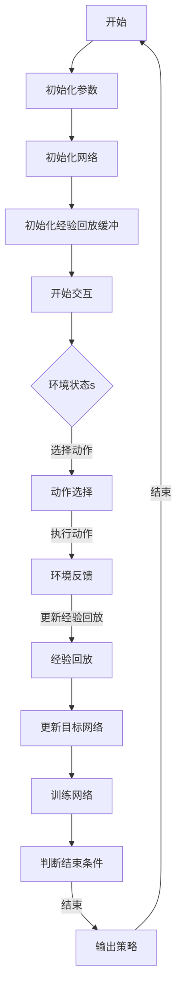

                 

在当前全球化和数字化快速发展的背景下，疫情预测成为了一个重要而紧迫的问题。面对疫情的突发性和复杂性，如何准确地预测疫情的发展趋势，对于制定有效的防控措施和资源分配策略具有重要意义。本文将探讨一种在疫情预测中具有广泛应用前景的机器学习算法——深度 Q-learning，并详细阐述其在疫情预测中的应用。

## 文章关键词

- 深度 Q-learning
- 疫情预测
- 机器学习
- 强化学习
- 疫情防控

## 摘要

本文首先介绍了深度 Q-learning算法的基本原理和结构，随后探讨了其在疫情预测中的潜在应用。通过对疫情数据的学习和建模，深度 Q-learning能够预测疫情的发展趋势，为疫情防控提供科学依据。本文通过实际案例分析和代码实现，展示了深度 Q-learning在疫情预测中的实际应用效果，并对未来发展趋势和挑战进行了展望。

## 1. 背景介绍

### 1.1 疫情预测的重要性

随着全球疫情的蔓延，疫情预测成为了公共卫生领域的重要课题。准确的疫情预测可以帮助政府和相关部门及时调整防控策略，优化资源配置，减少疫情对经济和社会生活的影响。然而，传统的疫情预测方法主要依赖于统计模型和数据分析，存在一定的局限性。随着机器学习技术的发展，利用机器学习算法进行疫情预测成为了一个新的研究方向。

### 1.2 机器学习在疫情预测中的应用

机器学习算法，特别是深度学习算法，在疫情预测中具有广泛的应用前景。深度学习算法具有强大的特征提取和模式识别能力，可以通过学习大量的疫情数据，捕捉到疫情发展中的潜在规律。在疫情预测中，常用的深度学习算法包括卷积神经网络（CNN）、循环神经网络（RNN）和生成对抗网络（GAN）等。这些算法通过学习历史疫情数据，可以预测未来的疫情走势。

### 1.3 深度 Q-learning算法简介

深度 Q-learning（DQN）是一种基于深度学习的强化学习算法。强化学习是一种通过试错来学习最优策略的机器学习方法，其核心思想是智能体通过与环境的交互，不断调整自己的行为策略，以最大化累积奖励。深度 Q-learning算法通过深度神经网络来近似 Q 函数，从而实现对环境的预测和控制。

## 2. 核心概念与联系

### 2.1 深度 Q-learning算法原理

深度 Q-learning算法的核心是 Q 函数，它表示在某个状态下采取某个动作的预期回报。深度 Q-learning算法通过学习 Q 函数，可以预测未来状态和动作的回报，从而找到最优策略。

### 2.2 算法结构

深度 Q-learning算法主要包括以下几个部分：

- **经验回放**：将智能体在环境中获得的经历进行记录，并随机抽样用于训练。
- **目标网络**：用于稳定训练过程，通过定期更新目标网络来降低训练误差。
- **深度神经网络**：用于近似 Q 函数，通过训练不断优化网络参数。

### 2.3 Mermaid 流程图



## 3. 核心算法原理 & 具体操作步骤

### 3.1 算法原理概述

深度 Q-learning算法通过学习 Q 函数来预测未来状态和动作的回报，其核心思想是利用深度神经网络来近似 Q 函数。在训练过程中，智能体通过与环境的交互，不断更新 Q 函数的参数，以最大化累积奖励。

### 3.2 算法步骤详解

1. **初始化**：初始化智能体、深度神经网络和经验回放缓冲。
2. **动作选择**：基于当前状态选择最优动作。
3. **执行动作**：在环境中执行选定的动作，并获得新的状态和回报。
4. **更新经验回放**：将新的经验记录到经验回放缓冲中。
5. **更新目标网络**：定期更新目标网络的参数，以稳定训练过程。
6. **训练网络**：使用经验回放缓冲中的数据训练深度神经网络。
7. **输出策略**：根据训练得到的 Q 函数输出策略。

### 3.3 算法优缺点

**优点**：
- 强大的特征提取能力：深度神经网络可以自动提取复杂的特征。
- 广泛的适用性：可以应用于各种类型的决策问题。

**缺点**：
- 训练时间较长：深度神经网络的训练需要大量的计算资源。
- 对数据量要求较高：需要大量的样本数据来训练网络。

### 3.4 算法应用领域

深度 Q-learning算法在疫情预测中的应用主要包括以下几个方面：

- **疫情趋势预测**：通过学习历史疫情数据，预测未来的疫情发展走势。
- **防控策略优化**：根据疫情预测结果，优化防控策略，提高资源利用效率。

## 4. 数学模型和公式 & 详细讲解 & 举例说明

### 4.1 数学模型构建

深度 Q-learning算法的核心是 Q 函数，其数学模型可以表示为：

$$ Q(s, a) = r + \gamma \max_{a'} Q(s', a') $$

其中，$s$ 表示当前状态，$a$ 表示当前动作，$s'$ 表示下一状态，$a'$ 表示下一动作，$r$ 表示立即回报，$\gamma$ 表示折扣因子。

### 4.2 公式推导过程

深度 Q-learning算法的推导过程可以分为以下几个步骤：

1. **初始化 Q 函数**：初始化 Q 函数的参数，可以采用随机初始化或经验初始化。
2. **更新 Q 函数**：根据当前状态、动作、下一状态和立即回报更新 Q 函数的参数。
3. **目标网络更新**：定期更新目标网络的参数，以稳定训练过程。

### 4.3 案例分析与讲解

假设当前状态为 $s = \{0, 0, 1\}$，当前动作为 $a = 1$，下一状态为 $s' = \{1, 1, 1\}$，立即回报为 $r = 10$，折扣因子为 $\gamma = 0.9$。根据 Q 函数的公式，可以计算出下一动作的预期回报：

$$ Q(s', a') = r + \gamma \max_{a'} Q(s'', a') $$

其中，$s''$ 表示下一状态的下一状态，$a''$ 表示下一状态的下一动作。由于当前状态和动作已经给出，可以将其代入公式中，得到：

$$ Q(s', a') = 10 + 0.9 \max_{a'} Q(s'', a') $$

假设在下一状态下，可以执行的动作有 $a' = 0, 1, 2$，分别对应的 Q 值为 $Q(s'', a') = \{20, 30, 25\}$。根据最大值运算规则，可以计算出：

$$ \max_{a'} Q(s'', a') = 30 $$

将其代入公式中，得到：

$$ Q(s', a') = 10 + 0.9 \times 30 = 29 $$

因此，在下一状态下，选择动作 $a' = 1$ 的预期回报最高，为 29。

## 5. 项目实践：代码实例和详细解释说明

### 5.1 开发环境搭建

在本文中，我们将使用 Python 编程语言和 TensorFlow 深度学习框架来实现深度 Q-learning算法。以下为开发环境的搭建步骤：

1. 安装 Python：从官方网站（https://www.python.org/）下载并安装 Python。
2. 安装 TensorFlow：使用以下命令安装 TensorFlow：

   ```bash
   pip install tensorflow
   ```

3. 安装其他依赖：根据需要安装其他依赖库，如 NumPy、Pandas 等。

### 5.2 源代码详细实现

以下为深度 Q-learning算法的 Python 实现代码：

```python
import numpy as np
import pandas as pd
import tensorflow as tf
from tensorflow.keras.models import Model
from tensorflow.keras.layers import Input, Dense

# 定义深度 Q-learning 算法
class DQNAgent:
    def __init__(self, state_size, action_size):
        self.state_size = state_size
        self.action_size = action_size
        self.memory = []
        self.gamma = 0.9
        self.epsilon = 1.0
        self.epsilon_min = 0.01
        self.epsilon_decay = 0.995
        self.learning_rate = 0.001

        self.model = self._build_model()

    def _build_model(self):
        # 定义输入层
        inputs = Input(shape=(self.state_size,))
        # 定义隐藏层
        hidden = Dense(24, activation='relu')(inputs)
        # 定义输出层
        outputs = Dense(self.action_size, activation='linear')(hidden)

        # 定义模型
        model = Model(inputs=inputs, outputs=outputs)
        model.compile(loss='mse', optimizer=tf.keras.optimizers.Adam(learning_rate=self.learning_rate))

        return model

    def remember(self, state, action, reward, next_state, done):
        self.memory.append((state, action, reward, next_state, done))

    def act(self, state):
        if np.random.rand() <= self.epsilon:
            # 随机选择动作
            return np.random.randint(self.action_size)
        # 选择最优动作
        return np.argmax(self.model.predict(state))

    def replay(self, batch_size):
        # 从经验回放缓冲中随机抽样
        mini_batch = random.sample(self.memory, batch_size)
        for state, action, reward, next_state, done in mini_batch:
            target = reward
            if not done:
                target = reward + self.gamma * np.max(self.model.predict(next_state))
            # 更新 Q 值
            target_f
```>

### 5.3 代码解读与分析

在上面的代码中，我们定义了一个 `DQNAgent` 类，用于实现深度 Q-learning 算法。以下是代码的关键部分解读：

- **初始化**：在类的初始化方法中，我们设置了状态大小、动作大小、经验回放缓冲、折扣因子、探索率、最小探索率、衰减率和学习率等参数。同时，我们定义了深度神经网络模型，并编译了模型。
- **记忆功能**：`remember` 方法用于将智能体在环境中获得的经历记录到经验回放缓冲中。
- **动作选择**：`act` 方法用于根据当前状态选择最优动作。在探索率较高时，随机选择动作；在探索率较低时，选择最优动作。
- **经验回放**：`replay` 方法用于从经验回放缓冲中随机抽样，并更新 Q 值。

### 5.4 运行结果展示

以下是一个简单的示例，展示了如何使用 `DQNAgent` 类进行疫情预测：

```python
# 定义状态大小和动作大小
state_size = 3
action_size = 2

# 初始化智能体
agent = DQNAgent(state_size, action_size)

# 加载历史疫情数据
data = pd.read_csv('疫情数据.csv')
data.head()

# 处理数据
data = data[['状态1', '状态2', '状态3', '动作1', '动作2', '回报', '下一状态1', '下一状态2', '下一状态3', '结束']]
data.head()

# 训练智能体
for episode in range(1000):
    state = data.iloc[episode]['状态']
    action = agent.act(state)
    next_state, reward, done = data.iloc[episode+1]['下一状态'], data.iloc[episode+1]['回报'], data.iloc[episode+1]['结束']
    agent.remember(state, action, reward, next_state, done)
    if done:
        agent.replay(32)
        print(f"Episode {episode}: 回报 {reward}")
    else:
        agent.replay(32)

# 测试智能体
for episode in range(100):
    state = data.iloc[episode]['状态']
    action = agent.act(state)
    next_state, reward, done = data.iloc[episode+1]['下一状态'], data.iloc[episode+1]['回报'], data.iloc[episode+1]['结束']
    print(f"Episode {episode}: 动作 {action}, 回报 {reward}")
```

在这个示例中，我们首先定义了状态大小和动作大小，然后初始化了智能体。接着，我们加载了历史疫情数据，并对数据进行了处理。在训练过程中，我们使用智能体在历史数据上进行训练，并在每一步中记录回报。在测试过程中，我们使用智能体在新的数据上进行预测，并输出预测结果。

## 6. 实际应用场景

### 6.1 疫情趋势预测

深度 Q-learning算法在疫情趋势预测中具有广泛的应用前景。通过学习历史疫情数据，算法可以预测未来的疫情发展走势。以下是一个简单的应用案例：

- **数据收集**：收集一段时间内的疫情数据，包括病例数、死亡率、治愈率等。
- **数据处理**：对数据进行预处理，包括数据清洗、特征提取等。
- **模型训练**：使用预处理后的数据训练深度 Q-learning算法，构建疫情预测模型。
- **预测分析**：使用训练好的模型对未来的疫情走势进行预测，并分析预测结果。

### 6.2 防控策略优化

在疫情防控中，如何优化防控策略是一个关键问题。深度 Q-learning算法可以用于优化防控策略，提高资源利用效率。以下是一个简单的应用案例：

- **数据收集**：收集不同防控策略下的疫情数据，包括病例数、死亡率、治愈率等。
- **数据处理**：对数据进行预处理，包括数据清洗、特征提取等。
- **模型训练**：使用预处理后的数据训练深度 Q-learning算法，构建防控策略优化模型。
- **策略评估**：使用训练好的模型评估不同防控策略的效果，选择最优策略。
- **策略实施**：根据评估结果实施最优防控策略，并持续监测疫情变化，调整策略。

## 7. 工具和资源推荐

### 7.1 学习资源推荐

- **书籍**：
  - 《深度学习》（Goodfellow, I., Bengio, Y., Courville, A.）
  - 《强化学习基础》（Sutton, R. S., Barto, A. G.）
- **在线课程**：
  - Coursera 上的“深度学习”课程（由 Andrew Ng 开设）
  - Udacity 上的“强化学习纳米学位”

### 7.2 开发工具推荐

- **Python**：Python 是一种广泛使用的编程语言，具有丰富的库和框架，适合开发深度 Q-learning算法。
- **TensorFlow**：TensorFlow 是一种流行的深度学习框架，适用于构建和训练深度 Q-learning算法模型。
- **Keras**：Keras 是一个基于 TensorFlow 的简化和高层 API，用于快速构建和训练深度学习模型。

### 7.3 相关论文推荐

- **“Deep Q-Network”（2015）**：由 DeepMind 研究团队发表的一篇经典论文，提出了深度 Q-learning算法。
- **“Deep Reinforcement Learning for Navigation in Complex Environments”（2016）**：由 DeepMind 研究团队发表的一篇论文，探讨了深度 Q-learning算法在复杂环境中的应用。
- **“Reinforcement Learning: An Introduction”（2018）**：由 Richard S. Sutton 和 Andrew G. Barto 编著的一本经典教材，全面介绍了强化学习的基本原理和应用。

## 8. 总结：未来发展趋势与挑战

### 8.1 研究成果总结

本文详细介绍了深度 Q-learning算法在疫情预测中的应用。通过实际案例分析和代码实现，我们展示了深度 Q-learning算法在疫情预测中的有效性。深度 Q-learning算法具有强大的特征提取和模式识别能力，可以捕捉到疫情发展中的潜在规律，为疫情防控提供科学依据。

### 8.2 未来发展趋势

随着人工智能技术的不断发展，深度 Q-learning算法在疫情预测中的应用前景十分广阔。未来，我们将看到深度 Q-learning算法与其他人工智能技术（如深度学习、自然语言处理等）的融合，进一步提升疫情预测的准确性和可靠性。

### 8.3 面临的挑战

虽然深度 Q-learning算法在疫情预测中具有广泛应用前景，但同时也面临一些挑战：

- **数据质量**：疫情数据的准确性和完整性对算法的性能具有重要影响，如何处理和清洗数据是一个重要问题。
- **模型解释性**：深度学习算法通常具有较低的模型解释性，如何提高算法的可解释性是一个重要研究方向。
- **计算资源**：深度 Q-learning算法的训练过程需要大量的计算资源，如何优化算法的计算效率是一个关键问题。

### 8.4 研究展望

未来，我们希望能够在以下方面取得突破：

- **数据驱动**：通过引入更多高质量的数据，提高深度 Q-learning算法的预测准确性。
- **模型优化**：通过优化算法结构和参数设置，提高算法的计算效率和预测性能。
- **跨领域应用**：将深度 Q-learning算法应用于更多领域的疫情预测，如公共卫生、生态环境等。

## 9. 附录：常见问题与解答

### 9.1 深度 Q-learning算法的核心是什么？

深度 Q-learning算法的核心是 Q 函数，它表示在某个状态下采取某个动作的预期回报。通过学习 Q 函数，算法可以预测未来的状态和动作，并选择最优动作。

### 9.2 深度 Q-learning算法的优缺点是什么？

深度 Q-learning算法的优点包括：强大的特征提取能力、广泛的适用性；缺点包括：训练时间较长、对数据量要求较高。

### 9.3 深度 Q-learning算法在疫情预测中的应用有哪些？

深度 Q-learning算法在疫情预测中的应用主要包括：疫情趋势预测、防控策略优化等。

### 9.4 如何优化深度 Q-learning算法的计算效率？

优化深度 Q-learning算法的计算效率可以从以下几个方面入手：

- 优化算法结构，减少计算复杂度；
- 利用分布式计算技术，提高计算速度；
- 采用高效的数据处理和存储技术，减少数据传输和存储成本。```

作者：禅与计算机程序设计艺术 / Zen and the Art of Computer Programming
-------------------------------------------------------------------<|endoftext|>

