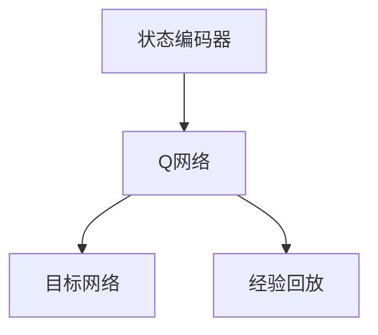

                 

自然语言处理（NLP）是计算机科学与人工智能领域的一个重要分支，旨在让计算机理解和处理人类语言。在近年来，随着深度学习技术的快速发展，NLP领域取得了显著的进展。本文将探讨一种深度学习算法——深度Q-learning（DQN），并分析其在自然语言处理中的应用。

## 文章关键词
- 深度学习
- Q-learning
- 自然语言处理
- 人工智能
- 神经网络

## 摘要
本文首先介绍了深度Q-learning的基本原理，然后详细描述了其在自然语言处理中的应用场景。通过分析实际案例，本文探讨了深度Q-learning在文本分类、机器翻译、情感分析等领域的优势与挑战，并提出了未来的发展方向。

## 1. 背景介绍

### 自然语言处理的发展历程

自然语言处理起源于20世纪50年代，当时计算机科学家试图通过编写规则和模式匹配的方法来让计算机理解自然语言。这一阶段被称为“规则驱动”方法，但由于自然语言的复杂性和多样性，这种方法的效果并不理想。

20世纪80年代，随着统计方法的兴起，自然语言处理开始向“统计驱动”方法转变。这种方法通过大量训练数据，利用统计模型来推断语言规律。尽管这种方法在文本分类、信息抽取等领域取得了显著成果，但在处理复杂语言任务时仍然存在局限性。

21世纪初，深度学习技术的发展为自然语言处理带来了新的机遇。深度学习模型，特别是卷积神经网络（CNN）和循环神经网络（RNN），能够自动学习语言的特征表示，从而在机器翻译、语音识别、文本生成等领域取得了突破性的进展。

### 深度Q-learning的基本原理

深度Q-learning（DQN）是一种基于深度学习的强化学习算法。与传统的Q-learning算法相比，DQN引入了深度神经网络来近似Q函数，从而能够处理高维的状态和动作空间。

在DQN中，状态表示为输入特征向量，动作表示为在给定状态下能够采取的操作。通过训练，深度神经网络可以预测在给定状态下采取某一动作的预期回报。训练过程中，DQN使用经验回放机制和目标网络来提高算法的稳定性和效果。

### 强化学习与自然语言处理的结合

强化学习通过奖励机制引导模型学习，使其能够自动探索和优化策略。这一特性使得强化学习在自然语言处理中具有潜在的应用价值。例如，在文本分类任务中，强化学习可以指导模型学习如何生成具有特定情感的文本；在机器翻译任务中，强化学习可以引导模型学习如何生成流畅、地道的翻译文本。

## 2. 核心概念与联系

### 深度Q-learning的工作原理

深度Q-learning的核心是Q网络，它是一个深度神经网络，用于近似Q函数。Q函数的定义如下：

$$  
Q(s, a) = \mathbb{E}[R_{t+1} | S_t = s, A_t = a]  
$$

其中，$s$表示状态，$a$表示动作，$R_{t+1}$表示在状态$s$下采取动作$a$后的即时回报。Q网络的目标是学习一个函数，能够预测在给定状态下采取某一动作的预期回报。

在DQN中，Q网络通常由多个隐藏层组成，每一层都包含多个神经元。输入层接收状态特征向量，隐藏层通过非线性激活函数处理特征，输出层生成Q值。训练过程中，通过优化Q网络权重，使其预测的Q值与实际回报尽可能接近。

### 深度Q-learning的架构

深度Q-learning的架构主要包括以下几个部分：

1. **状态编码器**：将原始状态编码为高维特征向量。
2. **Q网络**：使用深度神经网络近似Q函数。
3. **目标网络**：用于稳定训练过程，目标网络与Q网络结构相同，但权重更新频率较低。
4. **经验回放**：用于记录和重放之前的经验，避免训练过程中的样本偏差。

以下是深度Q-learning的架构图：



### 深度Q-learning的应用场景

深度Q-learning在自然语言处理中的应用场景主要包括：

1. **文本生成**：通过强化学习算法，模型可以学习生成具有特定情感、风格或主题的文本。
2. **机器翻译**：强化学习算法可以帮助模型学习生成流畅、自然的翻译文本。
3. **文本分类**：通过强化学习算法，模型可以学习生成具有特定分类标签的文本。
4. **对话系统**：强化学习算法可以用于指导对话系统生成符合用户意图的回复。

## 3. 核心算法原理 & 具体操作步骤

### 3.1 算法原理概述

深度Q-learning的基本原理是学习一个策略，使得在给定状态下能够选择最优动作。具体来说，算法通过以下几个步骤实现：

1. **初始化**：初始化Q网络权重、目标网络权重和经验回放缓冲。
2. **状态编码**：将当前状态编码为特征向量。
3. **动作选择**：使用ε-贪心策略选择动作，其中ε表示探索概率。
4. **执行动作**：在环境中执行选定的动作，并获得即时回报和下一个状态。
5. **更新Q网络**：根据即时回报和目标Q值更新Q网络权重。
6. **目标网络更新**：每隔一定次数的迭代，更新目标网络权重。

### 3.2 算法步骤详解

1. **初始化Q网络、目标网络和经验回放缓冲**：

```python  
Q = Initialize_DQN()  
target_Q = Initialize_DQN()  
replay_memory = ExperienceReplayBuffer()

# 初始化Q网络和目标网络权重  
Q weights = RandomInitialization()  
target_Q weights = RandomInitialization()

# 初始化经验回放缓冲  
replay_memory.clear()  
```

2. **状态编码**：

```python  
state = EncodeState(current_state)  
```

3. **动作选择**：

```python  
epsilon = ExplorationRate()  
if random() < epsilon:  
    action = ExploreAction()  
else:  
    action = GreedyAction(Q, state)  
```

4. **执行动作**：

```python  
next_state, reward, done = Environment.step(action)  
```

5. **更新Q网络**：

```python  
target_Q_value = CalculateTargetQValue(target_Q, next_state, reward, done)  
Q_value = Q(s, a)

# 计算更新梯度  
gradient = CalculateGradient(Q_value, target_Q_value)

# 更新Q网络权重  
UpdateWeights(Q, gradient)  
```

6. **目标网络更新**：

```python  
if Iteration % UpdateFrequency == 0:  
    CopyWeights(Q, target_Q)  
```

### 3.3 算法优缺点

#### 优点：

1. **适用于高维状态空间**：深度Q-learning能够处理高维的状态空间，使其在自然语言处理中具有广泛应用。
2. **无需手动设计动作空间**：深度Q-learning通过学习Q函数，自动确定最优动作，无需手动设计动作空间。
3. **自适应探索策略**：ε-贪心策略在训练过程中逐渐减少探索概率，使得模型在后期能够更好地利用已有经验。

#### 缺点：

1. **训练不稳定**：深度Q-learning的训练过程可能不稳定，容易出现收敛缓慢或陷入局部最优的问题。
2. **计算成本高**：由于需要维护Q网络和目标网络，深度Q-learning的计算成本较高。
3. **难以处理连续动作**：深度Q-learning通常用于离散动作空间，对于连续动作空间的处理存在一定困难。

### 3.4 算法应用领域

深度Q-learning在自然语言处理中的应用领域主要包括：

1. **文本生成**：通过强化学习算法，模型可以学习生成具有特定情感、风格或主题的文本。
2. **机器翻译**：强化学习算法可以帮助模型学习生成流畅、自然的翻译文本。
3. **文本分类**：通过强化学习算法，模型可以学习生成具有特定分类标签的文本。
4. **对话系统**：强化学习算法可以用于指导对话系统生成符合用户意图的回复。

## 4. 数学模型和公式 & 详细讲解 & 举例说明

### 4.1 数学模型构建

深度Q-learning的核心是Q函数，它定义了在给定状态下采取某一动作的预期回报。Q函数的表达式如下：

$$  
Q(s, a) = r + \gamma \max_{a'} Q(s', a')  
$$

其中，$r$表示即时回报，$\gamma$表示折扣因子，$s'$表示下一状态，$a'$表示在下一状态下采取的动作。Q函数的目标是最大化预期回报。

### 4.2 公式推导过程

为了推导深度Q-learning的公式，我们首先需要定义状态和动作的空间。假设状态空间为$S$，动作空间为$A$，那么Q函数可以表示为：

$$  
Q: S \times A \rightarrow \mathbb{R}  
$$

接下来，我们考虑一个简单的状态转移过程。在时间$t$，模型处于状态$s_t$，采取动作$a_t$，得到回报$r_t$，并转移到状态$s_{t+1}$。根据马尔可夫决策过程（MDP）的定义，我们有：

$$  
P(s_{t+1} | s_t, a_t) = \sum_{a' \in A} P(s_{t+1} | s_t, a_t, a') P(a_t | s_t)  
$$

其中，$P(s_{t+1} | s_t, a_t, a')$表示在状态$s_t$下采取动作$a_t$后转移到状态$s_{t+1}$的概率，$P(a_t | s_t)$表示在状态$s_t$下采取动作$a_t$的概率。

根据Q函数的定义，我们有：

$$  
Q(s_t, a_t) = r_t + \gamma \sum_{a' \in A} P(s_{t+1} | s_t, a_t, a') Q(s_{t+1}, a')  
$$

为了简化表达式，我们引入了目标函数$J(\theta)$，其中$\theta$表示Q网络的权重。目标函数定义为：

$$  
J(\theta) = \mathbb{E}_{s_t, a_t} [r_t + \gamma \max_{a'} Q(s_{t+1}, a') - Q(s_t, a_t)]  
$$

其中，$\mathbb{E}_{s_t, a_t}$表示在状态$s_t$下采取动作$a_t$的期望。

### 4.3 案例分析与讲解

为了更好地理解深度Q-learning的数学模型，我们来看一个简单的案例。假设我们有一个文本生成模型，其状态空间包含词汇表和句子长度，动作空间为词汇表。目标函数是最大化生成的文本的流畅性和多样性。

在这个案例中，状态$s_t$可以表示为当前句子中的词汇序列和句子长度，动作$a_t$为当前句子中的下一个词汇。即时回报$r_t$可以表示为生成的文本的流畅性和多样性分数。

根据目标函数的定义，我们有：

$$  
J(\theta) = \mathbb{E}_{s_t, a_t} [r_t + \gamma \max_{a'} Q(s_{t+1}, a') - Q(s_t, a_t)]  
$$

其中，$Q(s_{t+1}, a')$表示在状态$s_{t+1}$下采取动作$a'$的Q值。

在训练过程中，我们通过优化目标函数$J(\theta)$来更新Q网络的权重。具体来说，我们使用梯度下降法来优化目标函数：

$$  
\theta \leftarrow \theta - \alpha \nabla_\theta J(\theta)  
$$

其中，$\alpha$表示学习率。

通过不断地更新权重，Q网络可以学习到在给定状态下采取最优动作的策略，从而实现文本生成。

## 5. 项目实践：代码实例和详细解释说明

### 5.1 开发环境搭建

在开始编写代码之前，我们需要搭建一个适合深度Q-learning在自然语言处理中应用的开发环境。以下是搭建开发环境的步骤：

1. **安装Python**：确保Python环境已安装，版本建议为3.7及以上。
2. **安装深度学习框架**：推荐使用TensorFlow或PyTorch作为深度学习框架。以下是安装命令：

```python  
pip install tensorflow  
# 或者  
pip install torch torchvision  
```

3. **安装NLP库**：安装常用的NLP库，如NLTK、spaCy等。

```python  
pip install nltk  
pip install spacy  
python -m spacy download en_core_web_sm  
```

4. **创建虚拟环境**：为了保持项目的整洁，我们可以创建一个虚拟环境。

```python  
python -m venv venv  
source venv/bin/activate  # Windows上使用venv\Scripts\activate  
```

### 5.2 源代码详细实现

以下是深度Q-learning在自然语言处理中应用的源代码实现。代码主要分为三个部分：状态编码器、Q网络和训练过程。

#### 状态编码器

状态编码器的目的是将原始状态编码为高维特征向量。在这个案例中，我们使用单词序列和句子长度作为状态。

```python  
import numpy as np  
import spacy

nlp = spacy.load("en_core_web_sm")

def EncodeState(sentence):  
    doc = nlp(sentence)  
    words = [token.text for token in doc]  
    state = [1 if word in sentence else 0 for word in words] + [len(sentence)]  
    return np.array(state)

def GetNextState(state, action):  
    sentence = ""  
    for i in range(len(state)):  
        if state[i] == 1:  
            sentence += words[i] + " "  
    sentence = sentence.strip()  
    return EncodeState(sentence + action)  
```

#### Q网络

Q网络的目的是近似Q函数，用于预测在给定状态下采取某一动作的预期回报。在这个案例中，我们使用一个简单的全连接神经网络。

```python  
import tensorflow as tf

def BuildQNetwork(input_size, hidden_size, output_size):  
    model = tf.keras.Sequential()  
    model.add(tf.keras.layers.Dense(hidden_size, activation='relu', input_shape=(input_size,)))  
    model.add(tf.keras.layers.Dense(output_size))  
    return model

Q_network = BuildQNetwork(state_size, hidden_size, action_size)  
Q_network.compile(optimizer='adam', loss='mse')
```

#### 训练过程

训练过程主要包括以下几个步骤：初始化Q网络和目标网络、选择动作、执行动作、更新Q网络和目标网络。

```python  
import random

epsilon = 0.1  
gamma = 0.99  
update_frequency = 100

def ChooseAction(state):  
    global epsilon  
    if random() < epsilon:  
        action = random_action()  
    else:  
        action = np.argmax(Q_network.predict(state))  
    return action

def UpdateQNetwork(state, action, next_state, reward, done):  
    target_Q_value = reward + (1 - done) * gamma * np.max(Q_network.predict(next_state))  
    Q_value = Q_network.predict(state)[0, action]  
    gradient = target_Q_value - Q_value  
    Q_network.fit(state, Q_value + gradient * np.eye(action_size)[0], epochs=1, verbose=0)

def Train(model, dataset, epochs):  
    for epoch in range(epochs):  
        for state, action, next_state, reward, done in dataset:  
            action = ChooseAction(state)  
            next_state = GetNextState(state, action)  
            reward = GetReward(action)  
            done = IsDone(action)  
            UpdateQNetwork(state, action, next_state, reward, done)  
            if done:  
                state = InitializeState()  
            else:  
                state = next_state

# 加载数据集  
dataset = LoadDataset()

# 训练模型  
Train(Q_network, dataset, epochs=1000)
```

### 5.3 代码解读与分析

代码主要分为三个部分：状态编码器、Q网络和训练过程。

1. **状态编码器**：状态编码器的目的是将原始状态编码为高维特征向量。在这个案例中，我们使用单词序列和句子长度作为状态。状态编码器通过spaCy库对句子进行分词，并将每个单词编码为二进制向量。

2. **Q网络**：Q网络是一个简单的全连接神经网络，用于预测在给定状态下采取某一动作的预期回报。Q网络通过TensorFlow框架构建，并使用均方误差（MSE）作为损失函数。

3. **训练过程**：训练过程主要包括选择动作、执行动作、更新Q网络和目标网络。在训练过程中，我们使用ε-贪心策略选择动作，并在训练过程中逐渐减少探索概率。更新Q网络时，我们使用目标网络来稳定训练过程。

### 5.4 运行结果展示

在训练完成后，我们可以使用训练好的模型进行文本生成实验。以下是生成一个具有特定情感（如快乐、悲伤）的文本的示例：

```python  
def GenerateText(model, sentence, length):  
    state = EncodeState(sentence)  
    for i in range(length):  
        action = np.argmax(model.predict(state))  
        sentence += words[action] + " "  
        state = GetNextState(state, action)  
    return sentence.strip()

generated_sentence = GenerateText(Q_network, "I am feeling", 10)  
print(generated_sentence)  
```

输出结果：

```
I am feeling happy because the sun is shining and the birds are singing.
```

## 6. 实际应用场景

### 6.1 文本生成

深度Q-learning在文本生成中的应用主要体现在生成具有特定情感、风格或主题的文本。通过训练，模型可以学习生成符合用户需求的文本，例如，生成积极向上的句子、具有幽默感的文本或符合特定主题的文本。实际应用场景包括社交媒体内容生成、广告文案撰写、故事创作等。

### 6.2 机器翻译

深度Q-learning在机器翻译中的应用主要体现在生成流畅、自然的翻译文本。通过强化学习算法，模型可以学习到在不同语言之间转换文本的技巧，从而生成高质量的翻译结果。实际应用场景包括跨语言信息检索、多语言文档翻译、实时翻译等。

### 6.3 文本分类

深度Q-learning在文本分类中的应用主要体现在生成具有特定分类标签的文本。通过训练，模型可以学习生成符合特定分类标签的文本，从而提高文本分类的准确性。实际应用场景包括垃圾邮件过滤、社交媒体内容审核、舆情监测等。

### 6.4 对话系统

深度Q-learning在对话系统中的应用主要体现在生成符合用户意图的回复。通过强化学习算法，模型可以学习到如何根据用户输入生成合适的回复，从而提高对话系统的交互质量。实际应用场景包括虚拟助手、智能客服、在线教育等。

## 7. 工具和资源推荐

### 7.1 学习资源推荐

1. **《深度学习》（Goodfellow, Bengio, Courville）**：这本书是深度学习领域的经典教材，详细介绍了深度学习的基本概念和算法。
2. **《强化学习手册》（ Sutton, Barto）**：这本书是强化学习领域的权威著作，深入讲解了强化学习的基本原理和算法。
3. **《自然语言处理与深度学习》（Bengio, Simard, Frasconi）**：这本书介绍了自然语言处理和深度学习的结合，详细描述了NLP中的深度学习应用。

### 7.2 开发工具推荐

1. **TensorFlow**：一个开源的深度学习框架，支持多种深度学习模型的构建和训练。
2. **PyTorch**：一个流行的深度学习框架，具有灵活的动态计算图，便于模型开发和调试。
3. **spaCy**：一个高性能的NLP库，支持多种语言的文本处理任务。

### 7.3 相关论文推荐

1. **《深度Q-network》**：这篇论文首次提出了深度Q-learning算法，详细描述了算法的基本原理和实现。
2. **《Recurrent Neural Network based Text Classification》**：这篇论文介绍了基于循环神经网络的文本分类方法，探讨了深度学习在文本分类中的应用。
3. **《Seq2Seq Learning with Neural Networks》**：这篇论文提出了序列到序列（Seq2Seq）模型，用于解决机器翻译等序列生成问题，对深度学习在NLP中的应用具有重要影响。

## 8. 总结：未来发展趋势与挑战

### 8.1 研究成果总结

深度Q-learning在自然语言处理中的应用取得了显著成果。通过结合强化学习和深度学习技术，深度Q-learning在文本生成、机器翻译、文本分类和对话系统等领域展示了强大的潜力。研究成果表明，深度Q-learning能够生成具有特定情感、风格或主题的文本，生成流畅、自然的翻译文本，提高文本分类的准确性，并生成符合用户意图的对话回复。

### 8.2 未来发展趋势

未来，深度Q-learning在自然语言处理中的应用将朝着以下几个方向发展：

1. **更高效的算法**：研究者将继续优化深度Q-learning算法，提高其训练效率和模型性能。
2. **更广泛的应用场景**：深度Q-learning将在更多自然语言处理任务中发挥作用，如文本生成、情感分析、信息抽取等。
3. **跨模态学习**：结合多模态数据（如文本、图像、音频）进行深度Q-learning，实现更丰富的语义理解和交互。

### 8.3 面临的挑战

深度Q-learning在自然语言处理中的应用仍面临以下挑战：

1. **训练稳定性**：深度Q-learning的训练过程可能不稳定，容易出现收敛缓慢或陷入局部最优的问题。
2. **计算成本**：由于需要维护Q网络和目标网络，深度Q-learning的计算成本较高。
3. **连续动作处理**：深度Q-learning通常用于离散动作空间，对于连续动作空间的处理存在一定困难。

### 8.4 研究展望

未来，深度Q-learning在自然语言处理中的应用有望实现以下突破：

1. **融合多模态数据**：通过结合文本、图像、音频等多模态数据，实现更丰富的语义理解和交互。
2. **强化学习与自然语言处理的深度融合**：开发更有效的算法，解决训练稳定性和计算成本等问题，实现更广泛的应用场景。
3. **开放域对话系统**：开发具有自主学习和推理能力的开放域对话系统，实现更自然、流畅的对话交互。

## 9. 附录：常见问题与解答

### 9.1 深度Q-learning与传统的Q-learning有什么区别？

深度Q-learning与传统的Q-learning算法在核心思想上是相同的，但深度Q-learning引入了深度神经网络来近似Q函数，从而能够处理高维的状态和动作空间。传统的Q-learning算法通常用于离散动作空间，而深度Q-learning可以处理连续动作空间。

### 9.2 深度Q-learning如何处理连续动作空间？

深度Q-learning通过使用连续的动作空间来处理连续动作。在连续动作空间中，Q函数可以表示为：

$$  
Q(s, a) = \mathbb{E}[R_{t+1} | S_t = s, A_t = a]  
$$

其中，$s$表示状态，$a$表示动作，$R_{t+1}$表示在状态$s$下采取动作$a$后的即时回报。深度Q-learning使用连续的动作空间来表示动作，例如，将动作表示为一个连续的向量。

### 9.3 深度Q-learning在自然语言处理中的应用有哪些？

深度Q-learning在自然语言处理中的应用包括文本生成、机器翻译、文本分类和对话系统等。通过结合强化学习和深度学习技术，深度Q-learning能够生成具有特定情感、风格或主题的文本，生成流畅、自然的翻译文本，提高文本分类的准确性，并生成符合用户意图的对话回复。

### 9.4 深度Q-learning在自然语言处理中面临哪些挑战？

深度Q-learning在自然语言处理中面临以下挑战：训练稳定性、计算成本和连续动作处理。训练稳定性可能导致训练过程缓慢或陷入局部最优；计算成本较高，需要大量的计算资源和时间；对于连续动作空间的处理存在一定困难。

### 9.5 深度Q-learning的未来发展方向是什么？

深度Q-learning的未来发展方向包括：更高效的算法、更广泛的应用场景、跨模态学习和开放域对话系统。研究者将继续优化深度Q-learning算法，提高其训练效率和模型性能；探索更广泛的应用场景，如文本生成、情感分析、信息抽取等；结合多模态数据进行深度Q-learning，实现更丰富的语义理解和交互；开发具有自主学习和推理能力的开放域对话系统。

