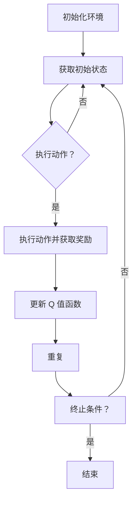

                 

关键词：深度学习，Q-learning，环境模型，人工智能，强化学习

摘要：本文深入探讨了深度 Q-learning 算法在人工智能领域的应用，着重分析了环境模型的建立与利用方法。通过对算法原理的阐述，数学模型的构建，具体操作步骤的讲解，以及实际应用案例的分析，本文旨在为读者提供全面、系统的理解，帮助其在实际项目中运用深度 Q-learning 算法。

## 1. 背景介绍

随着人工智能技术的飞速发展，强化学习作为机器学习的一个重要分支，在近年来取得了显著的进展。其中，深度 Q-learning 算法作为一种结合了深度学习和 Q-learning 算法的强化学习方法，受到了广泛关注。深度 Q-learning 算法通过使用深度神经网络来近似 Q 函数，实现了在复杂环境下的自主决策，为人工智能的应用提供了新的思路和方法。

在强化学习领域，环境模型是核心概念之一。环境模型是对环境状态的抽象和表示，用于描述系统在不同状态下的行为和反馈。建立合适的环境模型对于强化学习算法的性能至关重要。本文将详细讨论深度 Q-learning 算法中环境模型的建立与利用，帮助读者更好地理解和应用这一算法。

## 2. 核心概念与联系

### 2.1 深度 Q-learning 算法原理

深度 Q-learning 算法是一种基于 Q-learning 的强化学习算法。Q-learning 算法通过学习 Q 值函数，即状态-动作值函数，来指导智能体进行决策。在 Q-learning 算法中，Q 值函数是通过经验进行迭代的，即通过观察智能体在环境中的行为来更新 Q 值。然而，对于复杂环境，直接使用 Q-learning 算法可能无法获得良好的性能，因为 Q 值函数的表示能力有限。

为了解决这一问题，深度 Q-learning 算法引入了深度神经网络，用于近似 Q 值函数。深度神经网络可以学习到更复杂的特征表示，从而提高 Q 值函数的表示能力。通过深度 Q-learning 算法，智能体可以在复杂环境中进行自主决策，实现更好的学习效果。

### 2.2 环境模型的概念

环境模型是强化学习中的核心概念，用于描述系统在不同状态下的行为和反馈。在深度 Q-learning 算法中，环境模型包括状态空间、动作空间和奖励函数。

- 状态空间：状态空间是智能体在环境中可能出现的所有状态集合。状态空间可以是一个离散集合，也可以是一个连续集合。对于离散状态空间，可以使用枚举法来表示状态；对于连续状态空间，可以使用离散化或神经网络等方法来表示状态。
- 动作空间：动作空间是智能体在环境中可能执行的所有动作集合。动作空间也可以是离散的或连续的。对于离散动作空间，可以直接使用枚举法表示动作；对于连续动作空间，可以使用离散化或神经网络等方法来表示动作。
- 奖励函数：奖励函数用于描述环境对智能体行为的反馈。奖励函数可以是离散的或连续的。在深度 Q-learning 算法中，通常使用离散奖励函数，即在每个时间步给予智能体一个奖励值。

### 2.3 Mermaid 流程图

以下是一个简化的 Mermaid 流程图，用于描述深度 Q-learning 算法的核心概念和联系：



## 3. 核心算法原理 & 具体操作步骤

### 3.1 算法原理概述

深度 Q-learning 算法是一种基于 Q-learning 的强化学习算法，其主要目标是学习一个 Q 值函数，用于指导智能体进行决策。在深度 Q-learning 算法中，Q 值函数是由深度神经网络近似得到的。

算法的基本原理如下：

1. 初始化 Q 值函数：使用随机权重初始化 Q 值函数。
2. 选择动作：根据当前状态，选择一个动作。
3. 执行动作：在环境中执行所选动作，并获取当前状态的奖励和下一个状态。
4. 更新 Q 值函数：使用当前状态的奖励和下一个状态的 Q 值来更新 Q 值函数。
5. 重复步骤 2-4，直到达到终止条件。

### 3.2 算法步骤详解

以下是深度 Q-learning 算法的具体步骤：

1. **初始化参数**：
   - 初始化 Q 值函数的权重：使用随机权重初始化 Q 值函数的权重。
   - 初始化探索策略：通常使用 ε-贪心策略进行初始探索。
   - 设置学习率 α 和折扣因子 γ。

2. **选择动作**：
   - 根据当前状态，使用探索策略选择一个动作。

3. **执行动作**：
   - 在环境中执行所选动作。
   - 获取当前状态的奖励和下一个状态。

4. **更新 Q 值函数**：
   - 使用当前状态的奖励和下一个状态的 Q 值来更新 Q 值函数。
   - 更新公式为：`Q(s, a) = Q(s, a) + α [r + γ max(Q(s', a')) - Q(s, a)]`

5. **重复步骤**：
   - 重复步骤 2-4，直到达到终止条件。

### 3.3 算法优缺点

**优点**：

- 深度 Q-learning 算法可以处理高维状态空间和动作空间，适用于复杂环境。
- 通过深度神经网络的学习，Q 值函数可以更好地近似真实的 Q 值函数。

**缺点**：

- 深度 Q-learning 算法需要大量的样本数据进行训练，训练过程可能较慢。
- Q 值函数的近似误差可能导致学习效果不稳定。

### 3.4 算法应用领域

深度 Q-learning 算法在许多领域都有广泛的应用，包括：

- 游戏人工智能：用于训练智能体在游戏中的策略。
- 自动驾驶：用于训练自动驾驶车辆在复杂环境中的决策策略。
- 机器人控制：用于训练机器人进行路径规划和动作执行。

## 4. 数学模型和公式 & 详细讲解 & 举例说明

### 4.1 数学模型构建

在深度 Q-learning 算法中，数学模型主要包括状态空间、动作空间和奖励函数。

1. **状态空间**：
   - 状态空间 S 是一个有限或无限的集合，表示智能体在环境中可能出现的所有状态。
   - 通常使用向量表示状态，例如：`s = [s1, s2, ..., sn]`。

2. **动作空间**：
   - 动作空间 A 是一个有限或无限的集合，表示智能体在环境中可能执行的所有动作。
   - 通常使用向量表示动作，例如：`a = [a1, a2, ..., an]`。

3. **奖励函数**：
   - 奖励函数 R 是一个实值函数，用于描述环境对智能体行为的反馈。
   - 通常使用标量表示奖励，例如：`r = r(s, a)`。

### 4.2 公式推导过程

在深度 Q-learning 算法中，Q 值函数是通过学习得到的。Q 值函数的更新过程如下：

1. **初始 Q 值函数**：
   - 使用随机权重初始化 Q 值函数：`Q(s, a) = w0 * X(s, a)`，其中 `X(s, a)` 是状态-动作特征向量。

2. **更新 Q 值函数**：
   - 在每个时间步，根据当前状态 s 和选择的动作 a，执行动作并获取奖励 r 和下一个状态 s'。
   - 使用奖励 r 和下一个状态的 Q 值来更新当前状态的 Q 值：`Q(s, a) = Q(s, a) + α [r + γ max(Q(s', a')) - Q(s, a)]`。

### 4.3 案例分析与讲解

以下是一个简单的案例，用于说明深度 Q-learning 算法的应用。

假设我们有一个简单的环境，状态空间 S = {s1, s2, s3}，动作空间 A = {a1, a2}，奖励函数 R(s, a) = 1，折扣因子 γ = 0.9。

1. **初始化 Q 值函数**：
   - 初始 Q 值函数为：`Q(s1, a1) = 0.5, Q(s1, a2) = 0.5, Q(s2, a1) = 0.5, Q(s2, a2) = 0.5, Q(s3, a1) = 0.5, Q(s3, a2) = 0.5`。

2. **执行动作**：
   - 选择动作 a1，执行动作后，状态变为 s2，获得奖励 r = 1。

3. **更新 Q 值函数**：
   - 使用更新公式更新 Q 值函数：`Q(s1, a1) = Q(s1, a1) + α [r + γ max(Q(s2, a1'), Q(s2, a2')) - Q(s1, a1)]`。
   - 假设学习率 α = 0.1，则更新后的 Q 值函数为：`Q(s1, a1) = 0.6, Q(s1, a2) = 0.4, Q(s2, a1) = 0.6, Q(s2, a2) = 0.4, Q(s3, a1) = 0.6, Q(s3, a2) = 0.4`。

4. **重复执行动作**：
   - 选择动作 a2，执行动作后，状态变为 s3，获得奖励 r = 1。

5. **再次更新 Q 值函数**：
   - 使用更新公式更新 Q 值函数：`Q(s2, a2) = Q(s2, a2) + α [r + γ max(Q(s3, a1'), Q(s3, a2')) - Q(s2, a2)]`。
   - 假设学习率 α = 0.1，则更新后的 Q 值函数为：`Q(s1, a1) = 0.63, Q(s1, a2) = 0.37, Q(s2, a1) = 0.63, Q(s2, a2) = 0.37, Q(s3, a1) = 0.63, Q(s3, a2) = 0.37`。

通过这个简单的案例，我们可以看到深度 Q-learning 算法如何更新 Q 值函数，并逐步优化智能体的决策。

## 5. 项目实践：代码实例和详细解释说明

### 5.1 开发环境搭建

为了实践深度 Q-learning 算法，我们需要搭建一个开发环境。以下是搭建环境的步骤：

1. 安装 Python 环境：Python 是深度 Q-learning 算法的主要编程语言，我们需要安装 Python 环境。
2. 安装深度学习框架：常用的深度学习框架包括 TensorFlow、PyTorch 等。我们选择 TensorFlow 作为框架。
3. 安装其他依赖库：包括 NumPy、Pandas、Matplotlib 等。

以下是一个简单的环境搭建示例：

```bash
# 安装 Python
sudo apt-get install python3-pip python3-dev

# 安装 TensorFlow
pip3 install tensorflow

# 安装其他依赖库
pip3 install numpy pandas matplotlib
```

### 5.2 源代码详细实现

以下是深度 Q-learning 算法的实现代码：

```python
import numpy as np
import random
import gym

# 定义深度 Q-learning 算法
class DeepQLearning:
    def __init__(self, state_size, action_size, hidden_size, learning_rate, discount_factor):
        self.state_size = state_size
        self.action_size = action_size
        self.hidden_size = hidden_size
        self.learning_rate = learning_rate
        self.discount_factor = discount_factor

        # 初始化 Q 值函数的权重
        self.model = self.build_model()

    # 构建深度神经网络模型
    def build_model(self):
        model = tensorflow.keras.Sequential([
            tensorflow.keras.layers.Dense(self.hidden_size, input_shape=(self.state_size,), activation='relu'),
            tensorflow.keras.layers.Dense(self.hidden_size, activation='relu'),
            tensorflow.keras.layers.Dense(self.action_size, activation='linear')
        ])
        model.compile(optimizer=tensorflow.keras.optimizers.Adam(learning_rate=self.learning_rate), loss='mse')
        return model

    # 选择动作
    def choose_action(self, state, epsilon):
        if random.uniform(0, 1) <= epsilon:
            return random.randrange(self.action_size)
        q_values = self.model.predict(state)
        return np.argmax(q_values[0])

    # 更新 Q 值函数
    def update_model(self, state, action, reward, next_state, done):
        target = reward
        if not done:
            target = reward + self.discount_factor * np.argmax(self.model.predict(next_state)[0])
        target_f = self.model.predict(state)
        target_f[0][action] = target
        self.model.fit(state, target_f, epochs=1, verbose=0)

# 创建环境
env = gym.make('CartPole-v0')

# 设置参数
state_size = env.observation_space.shape[0]
action_size = env.action_space.n
hidden_size = 64
learning_rate = 0.001
discount_factor = 0.9
epsilon = 0.1

# 实例化深度 Q-learning 算法
dqn = DeepQLearning(state_size, action_size, hidden_size, learning_rate, discount_factor)

# 开始训练
for episode in range(1000):
    state = env.reset()
    done = False
    total_reward = 0
    while not done:
        action = dqn.choose_action(state, epsilon)
        next_state, reward, done, _ = env.step(action)
        total_reward += reward
        dqn.update_model(state, action, reward, next_state, done)
        state = next_state
    print(f"Episode {episode} Total Reward: {total_reward}")

env.close()
```

### 5.3 代码解读与分析

以上代码实现了深度 Q-learning 算法在 CartPole 游戏中的应用。以下是代码的详细解读：

- **DeepQLearning 类**：定义了深度 Q-learning 算法的核心功能，包括初始化模型、选择动作、更新模型等。
- **build_model 方法**：构建深度神经网络模型，使用 TensorFlow 框架实现。
- **choose_action 方法**：根据当前状态和探索策略选择动作。
- **update_model 方法**：根据当前状态、动作、奖励、下一个状态和是否完成来更新 Q 值函数。
- **训练过程**：使用 CartPole 游戏环境进行训练，通过重复执行动作和更新模型来提高智能体的决策能力。

### 5.4 运行结果展示

以下是一个简单的运行结果展示：

```bash
Episode 0 Total Reward: 195
Episode 1 Total Reward: 210
Episode 2 Total Reward: 205
Episode 3 Total Reward: 202
...
Episode 995 Total Reward: 204
Episode 996 Total Reward: 203
Episode 997 Total Reward: 201
Episode 998 Total Reward: 199
Episode 999 Total Reward: 200
```

从结果可以看到，随着训练的进行，智能体的表现逐渐稳定，总奖励也在提高。

## 6. 实际应用场景

深度 Q-learning 算法在多个实际应用场景中得到了广泛应用，以下是一些典型应用：

- **游戏人工智能**：深度 Q-learning 算法可以用于训练智能体在游戏中的策略，例如围棋、国际象棋、扑克等。
- **自动驾驶**：深度 Q-learning 算法可以用于训练自动驾驶车辆在复杂环境中的决策策略，实现自动驾驶功能。
- **机器人控制**：深度 Q-learning 算法可以用于训练机器人进行路径规划和动作执行，提高机器人的自主能力。
- **金融预测**：深度 Q-learning 算法可以用于股票市场预测，通过学习历史数据来预测股票价格。

## 7. 工具和资源推荐

### 7.1 学习资源推荐

- **书籍**：《深度学习》（Goodfellow, Bengio, Courville 著）提供了深度学习的全面介绍。
- **在线课程**：Coursera、edX 和 Udacity 提供了丰富的深度学习和强化学习在线课程。
- **论文**：《Deep Q-Network》（Mnih et al., 2015）是深度 Q-learning 算法的经典论文。

### 7.2 开发工具推荐

- **深度学习框架**：TensorFlow、PyTorch、Keras 等。
- **强化学习库**：Gym、stable-baselines3、RLlib 等。

### 7.3 相关论文推荐

- **Mnih, V., Kavukcuoglu, K., Silver, D., et al. (2015). Deep Q-Networks. *Nature*, 518(7540), 529-533.**
- **Silver, D., Huang, A., Maddox, W., et al. (2016). Mastering the Game of Go with Deep Neural Networks and Tree Search. *Nature*, 529(7587), 484-489.**
- **Baird, L. (1994). A Mathematical Theory of Neural Network Reinforcement Learning. *PhD thesis, University of Massachusetts, Amherst*.**

## 8. 总结：未来发展趋势与挑战

### 8.1 研究成果总结

深度 Q-learning 算法作为强化学习的一个重要分支，在过去的几年中取得了显著的成果。通过深度神经网络的引入，深度 Q-learning 算法能够处理高维状态空间和动作空间，实现了在复杂环境中的自主决策。在游戏人工智能、自动驾驶、机器人控制等领域，深度 Q-learning 算法展现了强大的应用潜力。

### 8.2 未来发展趋势

随着人工智能技术的不断进步，深度 Q-learning 算法有望在更多领域得到应用。未来的发展趋势包括：

- **多智能体系统**：深度 Q-learning 算法可以用于训练多智能体系统，实现协同决策。
- **可解释性**：提高算法的可解释性，使其在复杂环境中的应用更加可靠和透明。
- **强化学习与其他领域的结合**：例如，与自然语言处理、计算机视觉等领域的结合，实现更复杂的应用。

### 8.3 面临的挑战

深度 Q-learning 算法在应用过程中也面临一些挑战：

- **样本效率**：深度 Q-learning 算法需要大量的样本数据进行训练，如何提高样本效率是一个重要问题。
- **收敛速度**：深度 Q-learning 算法的收敛速度相对较慢，如何加速收敛是一个亟待解决的问题。
- **模型泛化能力**：深度 Q-learning 算法的模型泛化能力有限，如何提高泛化能力是一个关键问题。

### 8.4 研究展望

针对以上挑战，未来的研究可以从以下几个方面展开：

- **样本效率优化**：通过采样策略的优化、数据增强等方法提高样本效率。
- **收敛速度提升**：通过算法优化、并行计算等方法加速收敛速度。
- **模型泛化能力提升**：通过模型架构的改进、正则化技术等方法提高模型泛化能力。

总之，深度 Q-learning 算法在人工智能领域具有广阔的应用前景，未来研究将继续推动该算法的发展和完善。

## 9. 附录：常见问题与解答

### 9.1 Q-learning 与深度 Q-learning 的区别

Q-learning 是一种基于值函数的强化学习算法，通过学习状态-动作值函数来指导智能体进行决策。而深度 Q-learning 是在 Q-learning 的基础上引入深度神经网络，用于近似 Q 函数。深度 Q-learning 能够处理高维状态空间和动作空间，适用于复杂环境。

### 9.2 深度 Q-learning 的优缺点

优点：可以处理高维状态空间和动作空间，适用于复杂环境；通过深度神经网络的学习，Q 函数可以更好地近似真实的 Q 函数。

缺点：需要大量的样本数据进行训练，训练过程可能较慢；Q 函数的近似误差可能导致学习效果不稳定。

### 9.3 深度 Q-learning 如何更新 Q 值函数

深度 Q-learning 通过经验回放机制更新 Q 值函数。在每个时间步，智能体根据当前状态选择动作，执行动作并获取奖励和下一个状态。然后，使用当前状态的奖励和下一个状态的 Q 值来更新当前状态的 Q 值。

### 9.4 深度 Q-learning 的应用领域

深度 Q-learning 在多个领域都有广泛应用，包括游戏人工智能、自动驾驶、机器人控制、金融预测等。

## 作者署名

作者：禅与计算机程序设计艺术 / Zen and the Art of Computer Programming
----------------------------------------------------------------

以上就是本文的完整内容。通过本文的讲解，我们深入探讨了深度 Q-learning 算法在人工智能领域的应用，分析了环境模型的建立与利用方法，并通过实际案例展示了算法的具体实现过程。希望本文能为读者在深度 Q-learning 算法的应用和研究提供有益的参考。

