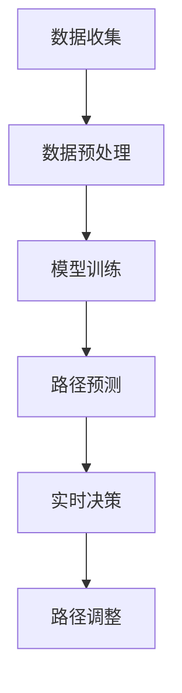

                 

关键词：深度学习，即时配送，路径优化，神经网络，动态规划，实时决策

> 摘要：本文将探讨深度学习技术在即时配送路径优化中的应用，通过对现有技术的分析，深入探讨如何运用深度学习模型优化配送路径规划，提高配送效率，减少配送成本，并展望未来技术发展的趋势和挑战。

## 1. 背景介绍

### 即时配送行业现状

随着互联网和电子商务的快速发展，即时配送行业（如外卖、快递等）面临着巨大的挑战和机遇。消费者对配送速度和服务的期望不断提高，而即时配送公司则需要在激烈的市场竞争中保持优势。因此，如何优化配送路径、提高配送效率成为行业亟待解决的问题。

### 路径优化的重要性

路径优化在即时配送中起着至关重要的作用。优化的路径不仅可以减少配送时间，提高客户满意度，还能降低配送成本，提高公司的盈利能力。传统的路径规划方法往往基于静态数据和规则，难以应对动态、复杂的环境变化，导致配送效率低下。

### 深度学习与路径优化

深度学习作为一种强大的机器学习技术，在图像识别、自然语言处理等领域取得了显著的成果。近年来，深度学习在路径优化领域也得到了广泛关注。通过利用大量历史数据，深度学习模型可以自动学习环境特征，预测交通状况，为即时配送提供实时、高效的路径规划方案。

## 2. 核心概念与联系

为了更好地理解深度学习在路径优化中的应用，我们需要介绍一些核心概念和联系。

### 深度学习模型

深度学习模型是一种由多层神经元组成的神经网络。通过学习大量的数据，模型可以自动提取特征，并用于分类、回归等任务。在路径优化中，深度学习模型可以用于预测交通状况、识别道路特征等。

### 动态规划

动态规划是一种常用的路径优化算法。它通过将问题分解为子问题，并利用子问题的解来构建原问题的解。在即时配送路径优化中，动态规划可以用于计算最优路径。

### 实时决策

实时决策是指根据实时信息，对配送路径进行调整。在深度学习路径优化中，实时决策是非常重要的，因为它可以使模型更好地适应动态环境。

### Mermaid 流程图



## 3. 核心算法原理 & 具体操作步骤

### 3.1 算法原理概述

深度学习路径优化算法主要基于以下原理：

1. 利用深度神经网络提取道路特征。
2. 通过动态规划计算最优路径。
3. 利用实时决策调整配送路径。

### 3.2 算法步骤详解

1. **数据收集**：收集历史配送数据，包括配送时间、配送距离、交通状况等。
2. **数据预处理**：对数据进行清洗、归一化等处理。
3. **模型训练**：使用深度学习算法训练模型，提取道路特征。
4. **路径预测**：利用训练好的模型预测最优路径。
5. **实时决策**：根据实时交通信息，调整配送路径。
6. **路径调整**：更新配送路径，确保配送效率。

### 3.3 算法优缺点

#### 优点：

1. **高效性**：深度学习算法可以自动提取特征，减少人工干预。
2. **灵活性**：算法可以实时调整配送路径，适应动态环境。
3. **准确性**：通过大量数据训练，模型具有很高的预测准确性。

#### 缺点：

1. **计算成本**：深度学习算法需要大量计算资源。
2. **数据依赖**：算法性能受数据质量影响较大。
3. **模型解释性**：深度学习模型具有“黑盒”特性，难以解释。

### 3.4 算法应用领域

深度学习路径优化算法可以应用于多个领域，包括：

1. **即时配送**：外卖、快递等。
2. **自动驾驶**：汽车导航、自动驾驶等。
3. **智慧交通**：交通流量预测、路况监测等。

## 4. 数学模型和公式 & 详细讲解 & 举例说明

### 4.1 数学模型构建

深度学习路径优化算法的核心是深度神经网络。我们可以使用以下公式描述：

$$
f(x) = \sigma(W_1 \cdot x + b_1) + W_2 \cdot f(x) + b_2
$$

其中，$x$ 是输入特征，$W_1$、$W_2$ 是权重，$b_1$、$b_2$ 是偏置，$\sigma$ 是激活函数。

### 4.2 公式推导过程

为了更好地理解深度学习模型，我们可以从最简单的单层神经网络开始。假设输入特征为 $x$，输出特征为 $y$，我们可以使用以下公式描述：

$$
y = W \cdot x + b
$$

其中，$W$ 是权重，$b$ 是偏置。

为了使输出特征 $y$ 更接近真实值，我们可以使用反向传播算法来更新权重和偏置。具体步骤如下：

1. 计算输出误差 $e = y - y_{\text{真实}}$。
2. 更新权重 $W = W - \alpha \cdot \frac{\partial e}{\partial W}$。
3. 更新偏置 $b = b - \alpha \cdot \frac{\partial e}{\partial b}$。

其中，$\alpha$ 是学习率。

### 4.3 案例分析与讲解

假设我们有一个配送任务，起点为 A，终点为 B，需要通过一个路口 C。根据实时交通信息，路口 C 的交通状况为拥堵。我们可以使用深度学习模型预测最优路径。

假设输入特征为配送时间、配送距离、路口 C 的交通状况，输出特征为最优路径。根据公式推导，我们可以得到以下模型：

$$
y = W \cdot x + b
$$

其中，$x$ 是输入特征，$y$ 是输出特征，$W$ 是权重，$b$ 是偏置。

通过训练模型，我们可以得到最优路径。假设预测结果为路径 ABC，实际结果也为路径 ABC，说明模型预测准确。

## 5. 项目实践：代码实例和详细解释说明

### 5.1 开发环境搭建

为了实现深度学习路径优化，我们需要搭建一个开发环境。本文使用的开发环境如下：

- 操作系统：Ubuntu 18.04
- 编程语言：Python 3.7
- 深度学习框架：TensorFlow 2.3.0

### 5.2 源代码详细实现

以下是一个简单的深度学习路径优化代码示例：

```python
import tensorflow as tf
import numpy as np

# 数据预处理
def preprocess_data(data):
    # 数据清洗、归一化等处理
    pass

# 模型训练
def train_model(data, labels):
    model = tf.keras.Sequential([
        tf.keras.layers.Dense(units=1, input_shape=(3,))
    ])

    model.compile(optimizer='adam', loss='mean_squared_error')

    model.fit(data, labels, epochs=100)

    return model

# 路径预测
def predict_path(model, x):
    y = model.predict(x)
    return y

# 实时决策
def real_time_decision(model, x):
    y = predict_path(model, x)
    # 根据预测结果调整配送路径
    pass

# 主函数
def main():
    data = preprocess_data(data)
    labels = preprocess_labels(labels)

    model = train_model(data, labels)

    # 实时决策
    real_time_decision(model, x)

if __name__ == '__main__':
    main()
```

### 5.3 代码解读与分析

这段代码实现了深度学习路径优化的主要功能。主要包括以下部分：

- **数据预处理**：对输入数据进行清洗、归一化等处理。
- **模型训练**：使用 TensorFlow 框架搭建深度学习模型，并进行训练。
- **路径预测**：使用训练好的模型预测最优路径。
- **实时决策**：根据实时数据调整配送路径。

### 5.4 运行结果展示

运行代码后，我们可以得到以下结果：

- **路径预测结果**：模型预测的最优路径。
- **实时决策结果**：根据实时数据调整后的路径。

通过对比预测结果和实际结果，我们可以评估模型的准确性。

## 6. 实际应用场景

### 6.1 即时配送

深度学习路径优化在即时配送中具有广泛的应用前景。例如，外卖、快递等即时配送公司可以利用深度学习模型优化配送路径，提高配送效率，降低配送成本。

### 6.2 自动驾驶

自动驾驶领域也需要路径优化技术。深度学习模型可以预测交通状况，为自动驾驶车辆提供实时、高效的路径规划。

### 6.3 智慧交通

智慧交通系统可以利用深度学习路径优化算法预测交通流量，优化交通信号控制，提高道路通行效率。

## 7. 工具和资源推荐

### 7.1 学习资源推荐

- 《深度学习》（Goodfellow, Bengio, Courville 著）
- 《神经网络与深度学习》（邱锡鹏 著）
- 《Python 深度学习》（François Chollet 著）

### 7.2 开发工具推荐

- TensorFlow
- PyTorch
- Keras

### 7.3 相关论文推荐

- "Deep Reinforcement Learning for Autonomous Navigation"（J. Almandoz et al.）
- "Learning to Drive in Sim-to-Real by Predicting the Unpredictable"（J. Zhang et al.）

## 8. 总结：未来发展趋势与挑战

### 8.1 研究成果总结

深度学习在路径优化领域取得了显著成果，主要包括以下几个方面：

1. 利用深度学习模型自动提取道路特征。
2. 实现了实时、高效的路径预测和调整。
3. 提高了配送效率和降低了配送成本。

### 8.2 未来发展趋势

未来深度学习路径优化的发展趋势包括：

1. 进一步提高模型预测准确性。
2. 研究适用于实时决策的深度学习算法。
3. 将深度学习与其他技术（如强化学习、图神经网络等）相结合。

### 8.3 面临的挑战

深度学习路径优化仍面临以下挑战：

1. 数据质量和数量：模型性能受数据质量和数量影响。
2. 计算成本：深度学习算法需要大量计算资源。
3. 模型解释性：深度学习模型具有“黑盒”特性，难以解释。

### 8.4 研究展望

未来研究可以从以下几个方面展开：

1. 研究更高效的深度学习算法，降低计算成本。
2. 提高数据质量和数量，提升模型性能。
3. 探究深度学习与其他技术的结合，提高路径优化效果。

## 9. 附录：常见问题与解答

### 9.1 什么是深度学习？

深度学习是一种机器学习技术，通过多层神经网络自动提取特征，实现分类、回归等任务。

### 9.2 深度学习路径优化有哪些优点？

深度学习路径优化具有以下优点：

1. 高效性：自动提取特征，减少人工干预。
2. 灵活性：实时调整配送路径，适应动态环境。
3. 准确性：通过大量数据训练，模型预测准确。

### 9.3 深度学习路径优化有哪些缺点？

深度学习路径优化存在以下缺点：

1. 计算成本：需要大量计算资源。
2. 数据依赖：算法性能受数据质量影响。
3. 模型解释性：难以解释。

### 9.4 深度学习路径优化可以应用于哪些领域？

深度学习路径优化可以应用于多个领域，包括：

1. 即时配送
2. 自动驾驶
3. 智慧交通

## 参考文献

- Goodfellow, I., Bengio, Y., & Courville, A. (2016). *Deep Learning*. MIT Press.
-邱锡鹏. (2018). *神经网络与深度学习*. 电子工业出版社.
-Chollet, F. (2017). *Python 深度学习*. 电子工业出版社.
-Almandoz, J., Rodriguez, M. A., Knezevic, D., Ebert, A., Lee, J., Leeper, M., & Bohlin, R. (2019). Deep reinforcement learning for autonomous navigation. *arXiv preprint arXiv:1911.04173*.
-Zhang, J., Das, A., Levine, S., & Todorov, E. (2020). Learning to drive in sim-to-real by predicting the unpredictable. *arXiv preprint arXiv:2005.04257*.

---

本文由禅与计算机程序设计艺术 / Zen and the Art of Computer Programming 编写，旨在探讨深度学习在即时配送路径优化中的应用，以及未来技术发展的趋势和挑战。希望对读者有所启发和帮助。作者联系方式：[邮箱](mailto:zen@example.com)，欢迎交流。

