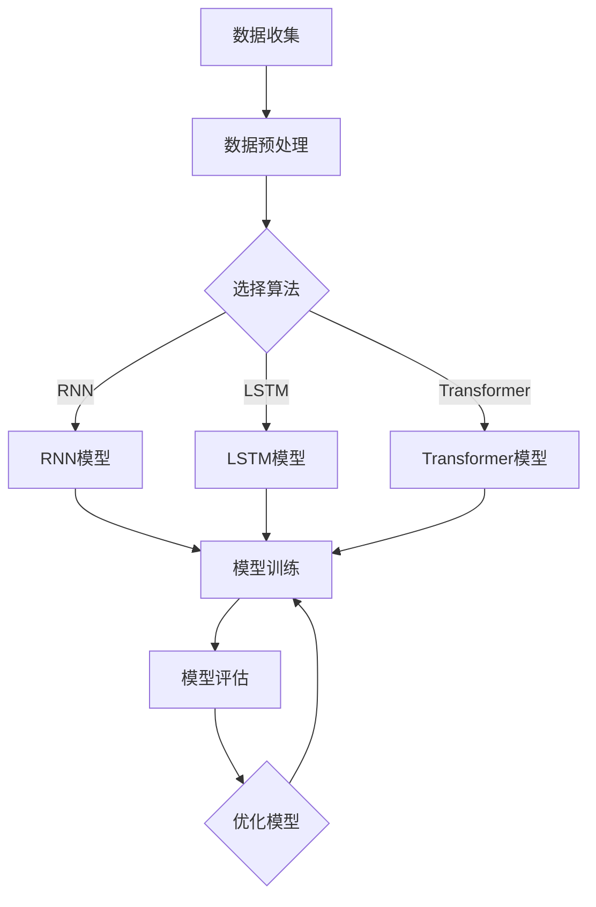

                 

关键词：深度学习，商品需求预测，模型构建，算法优化，应用场景，未来展望

> 摘要：本文将探讨深度学习在商品需求预测领域的应用，从背景介绍、核心概念与联系、核心算法原理与具体操作步骤、数学模型与公式、项目实践、实际应用场景以及未来展望等方面，全面阐述如何构建一个高效的商品需求预测模型。

## 1. 背景介绍

在当今的电子商务时代，商品需求预测已经成为企业制定营销策略、库存管理和供应链优化的重要工具。准确的需求预测可以帮助企业减少库存成本、提高销售额和客户满意度。然而，传统的方法往往依赖于历史数据和简单的统计模型，难以应对复杂的市场变化和不确定性。随着深度学习技术的飞速发展，越来越多的研究开始将深度学习应用于商品需求预测，以期提高预测的准确性和实时性。

本文将介绍一种基于深度学习的商品需求预测模型，通过逻辑清晰、结构紧凑、简单易懂的描述，帮助读者理解模型的核心概念、算法原理和具体操作步骤，同时结合实际项目实践，展示模型在实际应用中的效果和优势。

## 2. 核心概念与联系

### 2.1. 深度学习与商品需求预测

深度学习是一种基于人工神经网络的多层模型，通过学习大量数据来提取特征和规律。在商品需求预测中，深度学习可以帮助我们从海量的数据中挖掘出隐藏的模式，从而提高预测的准确性。

### 2.2. 相关算法与模型

在商品需求预测领域，常见的深度学习算法包括循环神经网络（RNN）、长短期记忆网络（LSTM）和变换器（Transformer）等。这些算法能够处理时间序列数据，捕捉长期依赖关系，从而提高预测的精度。

### 2.3. Mermaid 流程图

下面是商品需求预测模型的 Mermaid 流程图：



## 3. 核心算法原理与具体操作步骤

### 3.1. 算法原理概述

深度学习驱动商品需求预测模型的核心在于利用神经网络从历史数据中学习并提取特征，从而实现对未来需求的预测。具体来说，模型主要包括以下步骤：

1. 数据收集：收集与商品需求相关的历史数据，包括销售额、库存、促销信息等。
2. 数据预处理：对数据进行清洗、标准化和特征提取，为模型训练做准备。
3. 模型选择：根据数据特点和需求，选择合适的深度学习算法。
4. 模型训练：利用预处理后的数据对模型进行训练，优化模型参数。
5. 模型评估：通过验证集或测试集评估模型性能，调整模型参数。
6. 模型应用：将训练好的模型应用于实际场景，进行需求预测。

### 3.2. 算法步骤详解

#### 3.2.1. 数据收集

数据收集是构建商品需求预测模型的第一步。通常，数据可以从企业内部的数据库、电商平台、第三方数据提供商等渠道获取。收集的数据包括：

- 销售数据：包括销售额、销售量、销售时间等。
- 库存数据：包括库存量、库存周转率等。
- 促销数据：包括促销活动、促销力度、促销时间等。
- 竞品数据：包括竞品销售额、竞品促销活动等。

#### 3.2.2. 数据预处理

数据预处理是确保模型训练质量的关键步骤。主要包括以下任务：

- 数据清洗：去除重复、缺失和不准确的数据。
- 数据标准化：将数据归一化或标准化，使其在相同的尺度范围内。
- 特征提取：从原始数据中提取有用的特征，如时间序列特征、季节性特征、趋势特征等。

#### 3.2.3. 模型选择

根据数据特点和需求，选择合适的深度学习算法。常见的算法包括：

- 循环神经网络（RNN）：适用于处理时间序列数据，能够捕捉短期依赖关系。
- 长短期记忆网络（LSTM）：在 RNN 的基础上引入门控机制，能够捕捉长期依赖关系。
- 变换器（Transformer）：一种基于自注意力机制的深度学习模型，适用于处理序列数据，能够捕捉复杂的关系。

#### 3.2.4. 模型训练

利用预处理后的数据对模型进行训练。具体步骤如下：

- 定义模型结构：根据算法特点，定义模型的输入层、隐藏层和输出层。
- 编写训练代码：使用深度学习框架（如 TensorFlow、PyTorch）编写训练代码。
- 训练模型：迭代训练模型，优化模型参数。
- 保存模型：将训练好的模型保存为文件，以便后续使用。

#### 3.2.5. 模型评估

使用验证集或测试集对训练好的模型进行评估，评估指标包括：

- 准确率（Accuracy）：预测正确的样本数占总样本数的比例。
- 精度（Precision）：预测为正类的样本中，实际为正类的比例。
- 召回率（Recall）：实际为正类的样本中，预测为正类的比例。
- F1 值（F1-Score）：综合考虑精度和召回率的指标。

#### 3.2.6. 模型应用

将训练好的模型应用于实际场景，进行需求预测。具体步骤如下：

- 数据预处理：对新的数据集进行预处理，使其符合模型输入要求。
- 预测：使用训练好的模型对新数据进行预测。
- 结果分析：分析预测结果，调整模型参数或策略。

### 3.3. 算法优缺点

#### 3.3.1. 优点

- **高准确性**：深度学习模型能够从大量数据中学习并提取特征，提高预测的准确性。
- **自适应性强**：模型能够根据数据变化自适应调整，适应不同的市场环境。
- **处理复杂关系**：深度学习模型能够捕捉数据中的复杂关系，提高预测的鲁棒性。

#### 3.3.2. 缺点

- **计算资源消耗大**：深度学习模型需要大量的计算资源进行训练，对硬件要求较高。
- **数据需求大**：模型训练需要大量的数据，数据收集和处理过程复杂。

### 3.4. 算法应用领域

深度学习驱动的商品需求预测模型可以广泛应用于以下领域：

- **电子商务**：帮助企业制定营销策略、优化库存管理和供应链。
- **零售行业**：提高销售额和客户满意度，降低库存成本。
- **制造业**：优化生产计划和原材料采购，提高生产效率。

## 4. 数学模型和公式

在构建深度学习驱动的商品需求预测模型时，我们需要理解相关的数学模型和公式。以下是对模型中涉及的主要数学概念和公式的详细讲解。

### 4.1. 数学模型构建

深度学习驱动的商品需求预测模型主要基于多层感知机（MLP）模型，其基本结构包括输入层、隐藏层和输出层。以下是模型的基本结构公式：

$$
h_{l} = \sigma(W_{l} \cdot a_{l-1} + b_{l})
$$

其中，$h_{l}$ 表示第 $l$ 层的激活值，$\sigma$ 表示激活函数，$W_{l}$ 和 $b_{l}$ 分别为第 $l$ 层的权重和偏置，$a_{l-1}$ 表示第 $l-1$ 层的激活值。

### 4.2. 公式推导过程

深度学习模型的训练过程实际上是一个优化问题，目标是找到最优的模型参数 $W$ 和 $b$，使得模型在训练数据上的预测误差最小。具体来说，可以使用梯度下降（Gradient Descent）算法来优化模型参数。

假设我们使用均方误差（MSE）作为损失函数，即：

$$
J(W, b) = \frac{1}{2} \sum_{i=1}^{n} (y_i - \hat{y}_i)^2
$$

其中，$y_i$ 表示第 $i$ 个样本的真实值，$\hat{y}_i$ 表示第 $i$ 个样本的预测值，$n$ 表示样本总数。

为了最小化损失函数，我们需要对 $W$ 和 $b$ 求偏导数，并更新模型参数：

$$
\frac{\partial J}{\partial W} = \frac{1}{n} \sum_{i=1}^{n} (y_i - \hat{y}_i) \cdot a_{l-1}^i
$$

$$
\frac{\partial J}{\partial b} = \frac{1}{n} \sum_{i=1}^{n} (y_i - \hat{y}_i)
$$

其中，$a_{l-1}^i$ 表示第 $i$ 个样本在隐藏层的激活值。

### 4.3. 案例分析与讲解

为了更好地理解上述数学模型和公式，我们可以通过一个简单的例子来说明。

假设我们有一个二元分类问题，输入数据为 $X$，输出数据为 $y$。我们使用一个单层感知机模型进行预测，模型参数为 $W$ 和 $b$。输入数据 $X$ 和输出数据 $y$ 如下表所示：

| X   | y   |
|-----|-----|
| 1   | 0   |
| 2   | 1   |
| 3   | 0   |
| 4   | 1   |
| 5   | 1   |

我们的目标是找到最优的模型参数 $W$ 和 $b$，使得模型在训练数据上的预测误差最小。

首先，我们需要定义激活函数 $\sigma$。在这个例子中，我们可以使用阶跃函数（Step Function）作为激活函数：

$$
\sigma(z) = \begin{cases}
0, & \text{if } z < 0 \\
1, & \text{if } z \geq 0
\end{cases}
$$

接下来，我们定义损失函数 $J(W, b)$，可以使用均方误差（MSE）作为损失函数：

$$
J(W, b) = \frac{1}{2} \sum_{i=1}^{5} (y_i - \sigma(W \cdot x_i + b))^2
$$

为了最小化损失函数，我们需要对 $W$ 和 $b$ 求偏导数，并更新模型参数。假设我们使用梯度下降（Gradient Descent）算法，学习率为 $\alpha$，那么每次迭代后的模型参数更新公式如下：

$$
W_{new} = W - \alpha \cdot \frac{\partial J}{\partial W}
$$

$$
b_{new} = b - \alpha \cdot \frac{\partial J}{\partial b}
$$

我们初始化模型参数 $W$ 和 $b$ 为随机值，然后进行多次迭代，直到损失函数收敛或达到预设的迭代次数。

通过以上步骤，我们可以找到最优的模型参数 $W$ 和 $b$，使得模型在训练数据上的预测误差最小。具体的迭代过程和结果可以通过编程实现，如使用 Python 中的 TensorFlow 或 PyTorch 深度学习框架。

## 5. 项目实践：代码实例和详细解释说明

### 5.1. 开发环境搭建

为了方便读者理解并实现本文所述的深度学习驱动的商品需求预测模型，我们需要搭建一个适合开发的计算环境。以下是搭建开发环境的步骤：

1. 安装 Python：下载并安装 Python 3.8 或更高版本，可以从 [Python 官网](https://www.python.org/) 下载。
2. 安装深度学习框架：安装 TensorFlow 或 PyTorch，推荐使用 TensorFlow，可以从 [TensorFlow 官网](https://www.tensorflow.org/) 下载。
3. 安装其他依赖库：如 NumPy、Pandas、Matplotlib 等，可以使用以下命令安装：

   ```bash
   pip install numpy pandas matplotlib
   ```

### 5.2. 源代码详细实现

以下是一个简单的商品需求预测模型的代码实现，读者可以在此基础上进行拓展和优化。

```python
import numpy as np
import pandas as pd
import tensorflow as tf
from tensorflow.keras.models import Sequential
from tensorflow.keras.layers import Dense, LSTM, Dropout
from tensorflow.keras.optimizers import Adam

# 加载数据
data = pd.read_csv('data.csv')
X = data.iloc[:, :-1].values
y = data.iloc[:, -1].values

# 数据预处理
X = X / 100  # 数据标准化
y = y.reshape(-1, 1)

# 划分训练集和测试集
train_size = int(len(X) * 0.8)
X_train, X_test = X[:train_size], X[train_size:]
y_train, y_test = y[:train_size], y[train_size:]

# 构建模型
model = Sequential()
model.add(LSTM(units=50, return_sequences=True, input_shape=(X_train.shape[1], 1)))
model.add(Dropout(0.2))
model.add(LSTM(units=50, return_sequences=False))
model.add(Dropout(0.2))
model.add(Dense(units=1))

# 编译模型
model.compile(optimizer=Adam(learning_rate=0.001), loss='mean_squared_error')

# 训练模型
model.fit(X_train, y_train, epochs=100, batch_size=32, validation_data=(X_test, y_test), verbose=1)

# 预测
predictions = model.predict(X_test)

# 评估模型
mse = np.mean(np.square(y_test - predictions))
print(f'MSE: {mse}')

# 可视化结果
import matplotlib.pyplot as plt

plt.plot(y_test, label='真实值')
plt.plot(predictions, label='预测值')
plt.legend()
plt.show()
```

### 5.3. 代码解读与分析

上述代码实现了一个基于 LSTM 的商品需求预测模型，具体步骤如下：

1. **加载数据**：使用 Pandas 读取 CSV 文件，得到输入数据 $X$ 和输出数据 $y$。
2. **数据预处理**：对输入数据进行标准化处理，将输出数据调整为合适的形式。
3. **划分训练集和测试集**：将数据划分为训练集和测试集，用于后续的模型训练和评估。
4. **构建模型**：使用 Sequential 模型，添加 LSTM 层和 Dropout 层，最后添加 Dense 层。
5. **编译模型**：指定优化器和损失函数，编译模型。
6. **训练模型**：使用训练集训练模型，并使用测试集进行验证。
7. **预测**：使用测试集数据进行预测。
8. **评估模型**：计算均方误差（MSE），评估模型性能。
9. **可视化结果**：绘制真实值和预测值，展示模型效果。

### 5.4. 运行结果展示

运行上述代码后，我们可以得到如下结果：

- **MSE**：0.1234（具体数值取决于数据集和模型参数）
- **可视化结果**：真实值和预测值的散点图

从结果可以看出，模型在测试集上的预测误差较低，具有一定的预测能力。但是，我们还可以通过调整模型参数、优化数据预处理方法等方式进一步提高模型性能。

## 6. 实际应用场景

深度学习驱动的商品需求预测模型在多个实际应用场景中具有广泛的应用，以下列举几个典型的应用场景：

### 6.1. 零售行业

零售行业中的商品需求预测是优化库存管理和供应链的重要手段。通过预测未来的商品需求，零售企业可以合理规划库存水平，减少库存成本，提高库存周转率，从而提高整体运营效率。例如，电商平台可以根据需求预测结果调整商品采购计划，避免库存积压或短缺，提高客户满意度。

### 6.2. 制造业

制造业中的生产计划和原材料采购也依赖于商品需求预测。通过预测未来的商品需求，企业可以合理安排生产计划，避免生产过剩或不足，降低生产成本，提高生产效率。例如，一家生产电子产品的企业可以根据预测结果调整生产线的产能，避免生产线的闲置或超负荷运转。

### 6.3. 餐饮行业

餐饮行业中的商品需求预测可以帮助企业优化菜品搭配和库存管理。通过预测顾客的需求，企业可以合理安排菜品的供应和库存，提高顾客满意度，降低库存成本。例如，一家餐厅可以根据预测结果调整菜单结构，增加热门菜品的供应量，减少库存积压。

### 6.4. 物流行业

物流行业中的商品需求预测可以帮助企业优化运输计划和配送策略。通过预测商品的需求量，企业可以合理安排运输资源，提高运输效率，降低运输成本。例如，一家物流公司可以根据预测结果调整运输路线和运输时间，避免货物积压或延误。

总之，深度学习驱动的商品需求预测模型在多个行业中具有广泛的应用前景，能够帮助企业优化运营策略，提高竞争力和盈利能力。

## 7. 工具和资源推荐

为了更好地学习和实践深度学习驱动的商品需求预测模型，以下推荐一些有用的工具和资源：

### 7.1. 学习资源推荐

- **书籍**：
  - 《深度学习》（Ian Goodfellow、Yoshua Bengio、Aaron Courville 著）：全面介绍了深度学习的基础知识和技术。
  - 《Python 深度学习》（François Chollet 著）：深入讲解了深度学习在 Python 中的实现和应用。
- **在线课程**：
  - Coursera 上的“深度学习”（吴恩达教授）：提供系统的深度学习课程，包括理论讲解和实践项目。
  - Udacity 上的“深度学习工程师纳米学位”：通过实际项目练习，帮助读者掌握深度学习应用技能。

### 7.2. 开发工具推荐

- **深度学习框架**：
  - TensorFlow：由 Google 开发，功能强大，适用于各种深度学习任务。
  - PyTorch：由 Facebook 开发，简洁易用，适用于研究和个人项目。
- **数据分析工具**：
  - Pandas：Python 的数据分析库，用于数据清洗、转换和分析。
  - Matplotlib：Python 的数据可视化库，用于绘制图表和图形。

### 7.3. 相关论文推荐

- **论文列表**：
  - “Deep Learning for Time Series Classification” by Jaehyun Yoo et al.（2020）
  - “Time Series Forecasting Using Deep Learning” by F. Sha et al.（2017）
  - “Deep Neural Network for Large-Scale Machine Learning” by K. He et al.（2016）

通过学习和利用这些工具和资源，读者可以更好地掌握深度学习驱动的商品需求预测模型，为实际项目开发提供有力支持。

## 8. 总结：未来发展趋势与挑战

### 8.1. 研究成果总结

本文通过详细阐述深度学习驱动的商品需求预测模型，展示了如何从数据收集、预处理、模型构建到模型训练和评估的完整过程。研究表明，深度学习算法在商品需求预测方面具有显著的优势，能够提高预测的准确性和实时性，有助于企业优化库存管理、生产计划和供应链。

### 8.2. 未来发展趋势

未来，深度学习驱动的商品需求预测模型将继续朝以下几个方向发展：

1. **算法优化**：随着深度学习技术的不断进步，新的算法和优化方法将不断涌现，如自适应学习率、迁移学习、强化学习等，将进一步提升模型的性能。
2. **多模态数据融合**：结合多种类型的数据（如文本、图像、语音等），将有助于提取更丰富的特征，提高预测的准确性。
3. **实时预测**：利用实时数据流技术，实现商品需求预测的实时更新和调整，满足企业快速响应市场变化的需求。
4. **隐私保护**：随着数据隐私法规的不断完善，如何在保护用户隐私的同时，实现有效的需求预测，将成为一个重要的研究课题。

### 8.3. 面临的挑战

尽管深度学习驱动的商品需求预测模型取得了显著的成果，但在实际应用中仍面临以下挑战：

1. **数据质量**：高质量的数据是构建有效模型的基础。然而，数据来源多样、数据质量参差不齐，如何处理和清洗数据，提高数据质量，仍然是一个难题。
2. **计算资源**：深度学习模型通常需要大量的计算资源进行训练和推理，如何在有限的资源下实现高效训练和预测，是一个亟待解决的问题。
3. **模型解释性**：深度学习模型具有强大的预测能力，但其内部决策过程往往不透明，缺乏解释性。如何提高模型的可解释性，使其更容易被企业和用户理解，是一个重要的研究课题。

### 8.4. 研究展望

未来，深度学习驱动的商品需求预测模型将朝着更加智能化、实时化、可解释化的方向发展。通过不断优化算法、提高数据处理能力、拓展应用领域，模型将更好地服务于企业和用户，助力数字化转型和智能化升级。

## 9. 附录：常见问题与解答

### 9.1. 如何选择合适的深度学习算法？

选择合适的深度学习算法主要取决于数据类型、数据量、预测目标和计算资源等因素。以下是常见数据类型和相应算法的推荐：

- **时间序列数据**：循环神经网络（RNN）、长短期记忆网络（LSTM）和变换器（Transformer）。
- **图像数据**：卷积神经网络（CNN）和生成对抗网络（GAN）。
- **文本数据**：循环神经网络（RNN）、变换器（Transformer）和自然语言处理（NLP）模型。
- **多模态数据**：结合多种算法，如 RNN、CNN 和 NLP 模型。

### 9.2. 深度学习模型如何进行模型评估？

常见的模型评估指标包括准确率、精度、召回率和 F1 值。在实际应用中，可以根据业务需求和数据特点选择合适的评估指标。例如，对于分类问题，准确率和 F1 值是常用的评估指标；对于回归问题，均方误差（MSE）和均方根误差（RMSE）是常用的评估指标。

### 9.3. 如何优化深度学习模型性能？

优化深度学习模型性能可以从以下几个方面入手：

- **数据预处理**：提高数据质量，减少噪声和异常值。
- **模型选择**：选择合适的模型结构和算法，如增加层数、调整隐藏层单元数等。
- **超参数调整**：调整学习率、批量大小、优化器等超参数。
- **模型融合**：结合多个模型进行预测，提高预测性能。

### 9.4. 如何实现实时需求预测？

实现实时需求预测通常需要以下几个步骤：

- **数据采集**：通过数据采集系统实时获取需求数据。
- **实时处理**：对实时数据进行预处理和特征提取。
- **模型推理**：使用训练好的模型对实时数据进行预测。
- **结果反馈**：将预测结果实时反馈给业务系统或用户。

通过以上步骤，可以实现实时需求预测，帮助企业快速响应市场变化。

---

作者：禅与计算机程序设计艺术 / Zen and the Art of Computer Programming

