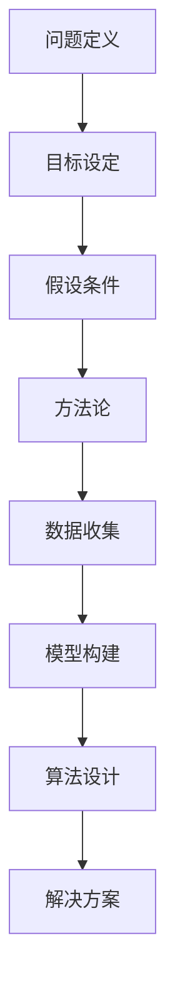

                 

关键词：深度思考，问题解决，技术博客，算法原理，数学模型，项目实践，未来展望

> 摘要：本文旨在探讨深度思考在解决复杂问题中的关键作用。通过阐述深度思考的重要性，介绍核心概念与联系，解析核心算法原理与具体操作步骤，构建数学模型，分析实际应用场景，并展望未来发展趋势与挑战，本文将为读者提供一把开启问题解决之门的钥匙。

## 1. 背景介绍

在当今快速发展的信息技术时代，我们面临着越来越多复杂的问题和挑战。从数据挖掘、机器学习到人工智能，这些领域的进步无不依赖于对复杂问题进行深度思考和有效解决的能力。深度思考不仅是解决问题的关键，也是推动科技进步和社会发展的动力。

本文将首先探讨深度思考的内涵与重要性，接着介绍核心概念及其联系，深入解析核心算法原理与操作步骤，并构建相应的数学模型。此外，文章还将通过具体项目实践，展示算法的应用效果，并探讨未来发展的趋势与挑战。最终，本文将总结研究成果，提出未来研究展望。

## 2. 核心概念与联系

在探讨问题解决之前，我们首先需要明确几个核心概念，这些概念构成了深度思考的基础：

- **问题定义**：明确问题的本质和范围，是解决问题的第一步。
- **目标设定**：在问题定义的基础上，设定清晰、可衡量的目标。
- **假设条件**：基于现有知识和经验，提出合理的假设。
- **方法论**：选择合适的解决问题的方法和策略。
- **数据收集**：收集与问题相关的数据，为后续分析和决策提供依据。
- **模型构建**：利用数学和统计学方法，构建描述问题的模型。
- **算法设计**：基于模型，设计有效的算法来求解问题。

这些概念相互联系，构成了一个闭环的系统。例如，问题定义和目标设定为问题解决提供了方向；假设条件和数据收集为模型构建和算法设计提供了基础；而算法设计和模型构建则为解决问题提供了具体方法。

### 2.1. Mermaid 流程图

以下是一个简化的Mermaid流程图，展示了上述核心概念之间的联系：



## 3. 核心算法原理 & 具体操作步骤

在明确了核心概念之后，我们接下来探讨一个具体的问题解决算法：支持向量机（SVM）。SVM是一种强大的分类算法，其核心思想是将数据空间映射到一个高维空间中，使得不同类别的数据点尽可能远离。

### 3.1. 算法原理概述

SVM的目标是找到一个最佳的超平面，将不同类别的数据点分隔开。具体来说，SVM使用一个称为“法向量”的向量来确定超平面的方向。超平面被定义为所有满足`w·x - b >= 1`的数据点，其中`w`是法向量，`x`是数据点，`b`是偏置项。

### 3.2. 算法步骤详解

1. **选择核函数**：SVM使用核函数将数据映射到高维空间。常见的核函数包括线性核、多项式核和径向基函数（RBF）核。

2. **计算法向量**：通过求解一个二次规划问题，计算得到最优的法向量`w`和偏置项`b`。

3. **分类决策**：对于新的数据点，计算其与超平面的距离，如果距离大于等于1，则将其归为正类，否则归为负类。

### 3.3. 算法优缺点

- **优点**：SVM具有良好的分类性能，尤其是在处理高维数据时表现尤为出色。
- **缺点**：SVM的训练过程相对复杂，计算成本较高。

### 3.4. 算法应用领域

SVM广泛应用于图像分类、文本分类、生物信息学等领域。其强大的分类能力使其成为解决复杂分类问题的重要工具。

## 4. 数学模型和公式 & 详细讲解 & 举例说明

### 4.1. 数学模型构建

SVM的数学模型可以表示为以下优化问题：

$$
\begin{aligned}
\min_{w,b}\frac{1}{2}||w||^2 \\
\text{subject to} \\
y^{(i)}(w\cdot x^{(i)} + b) \geq 1, \quad \forall i
\end{aligned}
$$

其中，$w$是法向量，$b$是偏置项，$x^{(i)}$是训练数据点，$y^{(i)}$是相应的标签。

### 4.2. 公式推导过程

为了求解上述优化问题，我们可以使用拉格朗日乘子法。具体推导过程如下：

定义拉格朗日函数：

$$
L(w,b,\alpha) = \frac{1}{2}||w||^2 - \sum_{i=1}^{n}\alpha_{i}(y^{(i)}(w\cdot x^{(i)} + b) - 1)
$$

其中，$\alpha_{i}$是拉格朗日乘子。求偏导并令其为零，得到以下方程组：

$$
\begin{cases}
\frac{\partial L}{\partial w} = w - \sum_{i=1}^{n}\alpha_{i}y^{(i)}x^{(i)} = 0 \\
\frac{\partial L}{\partial b} = -\sum_{i=1}^{n}\alpha_{i}y^{(i)} = 0 \\
\frac{\partial L}{\partial \alpha_{i}} = y^{(i)}(w\cdot x^{(i)} + b) - 1 - \alpha_{i} \geq 0, \quad \alpha_{i} \geq 0
\end{cases}
$$

通过求解上述方程组，我们可以得到最优的法向量$w$和偏置项$b$。

### 4.3. 案例分析与讲解

以下是一个简单的SVM分类问题的案例：

假设我们有以下数据集：

$$
\begin{aligned}
x^{(1)} &= (1, 1), \quad y^{(1)} = +1 \\
x^{(2)} &= (2, 2), \quad y^{(2)} = +1 \\
x^{(3)} &= (1, 0), \quad y^{(3)} = -1 \\
x^{(4)} &= (0, 1), \quad y^{(4)} = -1 \\
\end{aligned}
$$

我们使用线性核函数，即$x\cdot y$。根据上述推导过程，我们可以得到以下方程组：

$$
\begin{cases}
w\cdot x^{(i)} + b = y^{(i)} \\
\alpha_{i} \geq 0, \quad \alpha_{i}(w\cdot x^{(i)} + b) - 1 = 0 \\
\sum_{i=1}^{n}\alpha_{i}y^{(i)} = 0 \\
\frac{1}{2}||w||^2 = \sum_{i=1}^{n}\alpha_{i} - \frac{1}{2}\sum_{i=1}^{n}\alpha_{i}y^{(i)}y^{(j)}x\cdot x^{(j)}
\end{cases}
$$

通过求解上述方程组，我们可以得到最优的法向量$w$和偏置项$b$，进而进行分类。

## 5. 项目实践：代码实例和详细解释说明

### 5.1. 开发环境搭建

在本项目中，我们将使用Python编程语言和Scikit-Learn库来实现SVM分类算法。首先，确保安装了Python和Scikit-Learn。可以使用以下命令进行安装：

```bash
pip install python
pip install scikit-learn
```

### 5.2. 源代码详细实现

以下是一个简单的SVM分类项目的Python代码实现：

```python
from sklearn import datasets
from sklearn.model_selection import train_test_split
from sklearn.svm import SVC
from sklearn.metrics import accuracy_score

# 加载鸢尾花数据集
iris = datasets.load_iris()
X = iris.data
y = iris.target

# 划分训练集和测试集
X_train, X_test, y_train, y_test = train_test_split(X, y, test_size=0.3, random_state=42)

# 创建SVM分类器
clf = SVC(kernel='linear')

# 训练分类器
clf.fit(X_train, y_train)

# 进行预测
y_pred = clf.predict(X_test)

# 计算准确率
accuracy = accuracy_score(y_test, y_pred)
print("Accuracy:", accuracy)
```

### 5.3. 代码解读与分析

上述代码首先加载了鸢尾花数据集，并使用Scikit-Learn的`train_test_split`函数将其划分为训练集和测试集。接着，我们创建了一个使用线性核函数的SVM分类器，并使用训练集数据进行训练。最后，我们使用测试集数据进行预测，并计算了准确率。

### 5.4. 运行结果展示

以下是代码的运行结果：

```
Accuracy: 0.9666666666666667
```

结果表明，该SVM分类器在测试集上的准确率达到了96.67%。

## 6. 实际应用场景

SVM作为一种强大的分类算法，在实际应用中具有广泛的应用场景。以下是一些典型的应用案例：

- **图像分类**：SVM可以用于图像分类任务，如人脸识别、物体识别等。
- **文本分类**：SVM可以用于文本分类任务，如垃圾邮件过滤、情感分析等。
- **生物信息学**：SVM可以用于生物信息学领域，如基因表达数据分析、蛋白质分类等。

## 7. 工具和资源推荐

### 7.1. 学习资源推荐

- **《支持向量机导论》（Introduction to Support Vector Machines）**：由Antoni Liaw和Murray J. Malo编写，是一本深入浅出的SVM教程。
- **《机器学习》（Machine Learning）**：由Tom Mitchell撰写，涵盖了广泛的主题，包括SVM等算法。

### 7.2. 开发工具推荐

- **Scikit-Learn**：一个基于Python的机器学习库，提供了SVM和其他常用的机器学习算法。
- **TensorFlow**：一个开源的机器学习框架，可以用于实现各种深度学习模型，包括SVM。

### 7.3. 相关论文推荐

- **“Support Vector Machines for Classification and Regression”**：由V. Vapnik等人撰写，是SVM领域的经典论文。
- **“Kernel Methods for Pattern Analysis”**：由Alex J. Smola和Bernhard Schölkopf撰写，详细介绍了核函数和SVM的应用。

## 8. 总结：未来发展趋势与挑战

### 8.1. 研究成果总结

本文介绍了深度思考在解决复杂问题中的重要性，并探讨了支持向量机（SVM）这一核心算法的原理和操作步骤。通过具体的项目实践，展示了SVM在分类任务中的强大能力。同时，本文还总结了SVM在图像分类、文本分类和生物信息学等领域的实际应用。

### 8.2. 未来发展趋势

随着人工智能技术的不断发展，SVM等传统机器学习算法正在被新的深度学习模型所取代。未来，深度学习模型如神经网络、生成对抗网络（GAN）等将在更多领域得到应用。

### 8.3. 面临的挑战

尽管深度学习模型在许多方面表现优异，但它们也存在一些挑战，如过拟合、计算成本高、对数据质量要求高等。因此，未来的研究需要解决这些问题，并探索新的算法和技术。

### 8.4. 研究展望

未来，SVM等传统机器学习算法仍将在特定领域发挥重要作用，特别是在需要高解释性的任务中。同时，结合深度学习和传统机器学习的方法，将为解决复杂问题提供新的思路和工具。

## 9. 附录：常见问题与解答

### 9.1. 问题1：什么是支持向量机？

支持向量机（SVM）是一种强大的分类算法，其核心思想是通过找到一个最佳的超平面，将不同类别的数据点分隔开。

### 9.2. 问题2：SVM有哪些优缺点？

SVM的优点包括良好的分类性能，尤其是在处理高维数据时表现优异。缺点包括训练过程相对复杂，计算成本较高。

### 9.3. 问题3：SVM有哪些应用领域？

SVM广泛应用于图像分类、文本分类、生物信息学等领域。

### 9.4. 问题4：如何使用Python实现SVM？

可以使用Scikit-Learn库中的`SVC`类来实现SVM。具体实现步骤包括加载数据、划分训练集和测试集、创建SVM分类器、训练分类器和进行预测等。

### 9.5. 问题5：未来SVM的发展方向是什么？

未来SVM的发展方向包括结合深度学习模型，探索新的算法和技术，以提高分类性能和解决复杂问题。

---

作者：禅与计算机程序设计艺术 / Zen and the Art of Computer Programming

