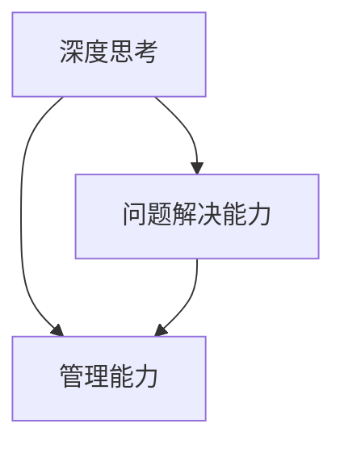
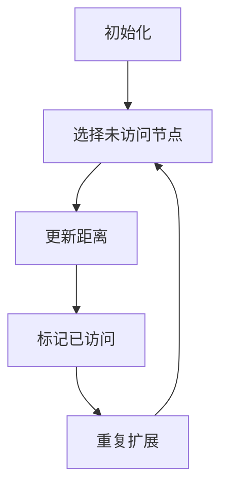

                 

关键词：深度思考、问题解决、管理能力、IT领域、技术博客

> 摘要：本文将探讨在IT领域中提升深度思考和问题解决能力的重要性，通过介绍核心概念、算法原理、数学模型以及实际项目实践，帮助读者构建系统的思考框架，提高管理问题解决的能力。

## 1. 背景介绍

在快速发展的IT行业，技术更新迭代的速度令人惊叹。随着云计算、大数据、人工智能等新兴技术的崛起，IT从业者面临着前所未有的挑战和机遇。在这个竞争激烈的环境中，如何提高个人的深度思考和问题解决能力，成为了每位IT专业人士关注的焦点。

深度思考不仅仅是表面上的理解，它涉及到对复杂问题的根本性认识。而问题解决能力则是将这种认识转化为实际解决方案的关键。在IT领域，良好的深度思考和管理问题解决能力意味着能够更快地适应新技术、更有效地解决复杂的技术难题，从而在职业生涯中脱颖而出。

本文将首先介绍深度思考和问题解决能力在IT领域中的重要性，然后逐步深入探讨相关的核心概念、算法原理、数学模型以及实际项目实践，最终提出未来发展的展望和面临的挑战。

## 2. 核心概念与联系

在探讨深度思考和问题解决能力之前，我们需要明确几个核心概念，并理解它们之间的相互联系。

### 2.1 深度思考

深度思考是指在面对复杂问题时，能够从多个角度、多个层面进行剖析，挖掘问题的本质，从而提出创新性的解决方案。深度思考不仅仅是逻辑推理，它还涉及到对现有知识的整合、对未知领域的探索以及对问题的系统性理解。

### 2.2 问题解决能力

问题解决能力是指在面对问题时，能够迅速识别问题的核心、找到合理的解决方案，并有效地执行这一解决方案的能力。它不仅要求技术上的熟练度，还需要逻辑思维、创造力和灵活应变的能力。

### 2.3 管理能力

管理能力是指对资源、流程、团队等要素的协调和优化能力。在IT领域，良好的管理能力意味着能够高效地组织项目、合理分配资源、确保项目按时完成并达到预期目标。

### 2.4 核心概念间的联系

深度思考和问题解决能力是管理能力的基础。只有通过深度思考，我们才能对问题有深刻的理解，从而提出有效的解决方案。而问题解决能力则是对深度思考的实践，它将深度思考转化为实际的成果。管理能力则是在这个基础上，通过合理的管理和协调，使问题解决更加高效和有序。

### 2.5 Mermaid 流程图

下面是核心概念与联系的一个简单Mermaid流程图：



在接下来的章节中，我们将逐一探讨每个核心概念的具体内容。

## 3. 核心算法原理 & 具体操作步骤

### 3.1 算法原理概述

在提升深度思考和问题解决能力的过程中，核心算法原理起着至关重要的作用。这里，我们选取了常见的图论算法——Dijkstra算法，作为讨论的起点。

Dijkstra算法是一种用于求解单源最短路径问题的算法。在IT领域中，许多问题都可以抽象为寻找最短路径的问题，例如网络路由、图数据库查询等。Dijkstra算法通过逐步扩展源点到其他节点的最短路径，最终得到从源点到所有节点的最短路径。

### 3.2 算法步骤详解

#### 3.2.1 初始化

- 设置源点 \( s \) 的距离为0，其他所有节点的距离为无穷大。
- 选择未访问过的节点中距离源点最近的节点作为当前节点。

#### 3.2.2 扩展

- 将当前节点的距离更新到其邻接节点，如果更新后的距离更短，则更新邻接节点的距离。
- 标记当前节点为已访问。

#### 3.2.3 重复扩展

- 重复步骤2，直到所有节点都被访问。

#### 3.2.4 结果输出

- 输出从源点到所有节点的最短路径。

### 3.3 算法优缺点

**优点：**
- Dijkstra算法简单直观，易于理解。
- 可以保证找到最短路径。

**缺点：**
- 对于存在负权边的图，算法可能无法正确运行。
- 时间复杂度为 \( O(V^2) \)，对于大规模图可能性能较差。

### 3.4 算法应用领域

Dijkstra算法在许多领域有广泛的应用，包括：

- **网络路由：** 用于计算网络中各节点之间的最短路径，优化数据传输。
- **图数据库查询：** 在图数据库中，Dijkstra算法用于查找节点的最短路径。
- **路径规划：** 在自动驾驶和机器人导航等领域，Dijkstra算法用于计算从起点到终点的最短路径。

### 3.5 Mermaid 流程图

下面是Dijkstra算法的一个简单Mermaid流程图：



通过以上对Dijkstra算法的介绍，我们不仅了解了算法的基本原理，还了解了如何在实际问题中应用这一算法。在接下来的章节中，我们将继续探讨数学模型和具体项目实践。

## 4. 数学模型和公式 & 详细讲解 & 举例说明

### 4.1 数学模型构建

在深度思考和问题解决中，数学模型扮演着重要的角色。一个有效的数学模型可以帮助我们更好地理解和描述问题，从而找到解决方案。在IT领域中，常见的数学模型包括线性规划、决策树、支持向量机等。

这里，我们以线性规划为例，介绍其数学模型的构建。

#### 4.1.1 线性规划问题

线性规划问题通常可以表示为以下形式：

\[ 
\begin{align*}
\min_{x} \quad & c^T x \\
\text{subject to} \quad & Ax \leq b \\
& x \geq 0
\end{align*}
\]

其中，\( x \) 是决策变量，\( c \) 是目标函数系数，\( A \) 和 \( b \) 分别是约束条件矩阵和向量。

#### 4.1.2 解的求解

线性规划问题的解可以通过多种算法求解，如单纯形法、内点法等。这里，我们简单介绍单纯形法的基本步骤：

1. **初始基本可行解**：选取初始基本可行解，通常选取所有变量均为0的解。
2. **迭代过程**：通过迭代，逐步寻找最优解。
   - 计算每个非基本变量的检验数。
   - 选择检验数最小的非基本变量作为进入变量。
   - 通过旋转操作，将进入变量转换为基本变量。
   - 重复迭代，直到所有检验数非负，得到最优解。

### 4.2 公式推导过程

线性规划的推导过程如下：

#### 4.2.1 目标函数的推导

目标函数的推导基于目标函数的梯度方向。假设目标函数 \( f(x) \) 在点 \( x_0 \) 处可微，则目标函数的梯度为：

\[ 
\nabla f(x_0) = [f_1'(x_0), f_2'(x_0), ..., f_n'(x_0)]^T 
\]

为了使目标函数下降，需要沿着梯度的反方向进行搜索：

\[ 
x_{\text{new}} = x_0 - \alpha \nabla f(x_0) 
\]

其中，\( \alpha \) 是步长。

#### 4.2.2 约束条件的推导

约束条件的推导基于拉格朗日函数。对于线性规划问题，可以构建拉格朗日函数：

\[ 
L(x, \lambda) = c^T x + \lambda^T (Ax - b) 
\]

其中，\( \lambda \) 是拉格朗日乘子。

为了求解最优解，需要对拉格朗日函数进行偏导数求解：

\[ 
\nabla_x L(x, \lambda) = c + A^T \lambda = 0 
\]
\[ 
\nabla_\lambda L(x, \lambda) = Ax - b = 0 
\]

通过解这两个方程组，可以得到 \( x \) 和 \( \lambda \) 的值。

### 4.3 案例分析与讲解

#### 4.3.1 案例背景

假设有一家公司需要生产两种产品A和B，每种产品都需要经过三个工序。每个工序所需的时间和利润如下表：

| 工序 | A（小时） | B（小时） | 利润（元） |
| --- | --- | --- | --- |
| 1 | 2 | 3 | 100 |
| 2 | 3 | 2 | 150 |
| 3 | 4 | 4 | 200 |

公司每天只有24小时的生产时间，每天的最大利润是多少？

#### 4.3.2 案例分析

将上述问题转化为线性规划问题：

\[ 
\begin{align*}
\min_{x} \quad & 100x_1 + 150x_2 \\
\text{subject to} \quad & 2x_1 + 3x_2 \leq 24 \\
& 3x_1 + 2x_2 \leq 24 \\
& x_1, x_2 \geq 0
\end{align*}
\]

其中，\( x_1 \) 和 \( x_2 \) 分别表示生产产品A和B的数量。

#### 4.3.3 求解过程

通过单纯形法求解上述线性规划问题，得到最优解为 \( x_1 = 4 \)，\( x_2 = 4 \)，最大利润为800元。

### 4.4 结论

通过数学模型的构建和公式推导，我们不仅可以更深入地理解线性规划问题，还能在具体案例中应用这一模型，找到最优的解决方案。数学模型在IT领域中有着广泛的应用，掌握其基本原理和方法对于提升深度思考和问题解决能力至关重要。

在接下来的章节中，我们将通过实际项目实践，进一步探讨如何将理论应用于实际场景，提升个人的技术和管理能力。

## 5. 项目实践：代码实例和详细解释说明

### 5.1 开发环境搭建

为了更好地展示项目实践，我们选择使用Python作为编程语言，并结合Jupyter Notebook进行开发和演示。以下是搭建开发环境的基本步骤：

1. 安装Python：从Python官方网站下载并安装Python 3.8或更高版本。
2. 安装Jupyter Notebook：在命令行中运行 `pip install notebook` 命令。
3. 启动Jupyter Notebook：在命令行中运行 `jupyter notebook` 命令，打开浏览器并访问指定URL（通常为 `http://localhost:8888/`）。

### 5.2 源代码详细实现

以下是一个简单的项目实例，用于实现Dijkstra算法，求解给定图的最短路径问题。

```python
import heapq
import math

def dijkstra(graph, start):
    # 初始化距离和路径
    distances = {node: math.inf for node in graph}
    distances[start] = 0
    priority_queue = [(0, start)]
    previous_nodes = {node: None for node in graph}

    while priority_queue:
        # 取出优先队列中距离最小的节点
        current_distance, current_node = heapq.heappop(priority_queue)

        # 如果当前节点的距离已经是最小的，则不需要进一步搜索
        if current_distance > distances[current_node]:
            continue

        # 遍历当前节点的邻居
        for neighbor, weight in graph[current_node].items():
            distance = current_distance + weight

            # 如果新距离小于当前距离，则更新距离和路径
            if distance < distances[neighbor]:
                distances[neighbor] = distance
                previous_nodes[neighbor] = current_node
                heapq.heappush(priority_queue, (distance, neighbor))

    return distances, previous_nodes

# 示例图的定义
graph = {
    'A': {'B': 1, 'C': 4},
    'B': {'A': 1, 'C': 2, 'D': 5},
    'C': {'A': 4, 'B': 2, 'D': 1},
    'D': {'B': 5, 'C': 1}
}

# 运行Dijkstra算法
distances, previous_nodes = dijkstra(graph, 'A')

# 打印结果
print("最短路径距离：", distances)
print("最短路径：", [node for node in reversed(graph.find_path(previous_nodes, 'D'))])
```

### 5.3 代码解读与分析

上述代码实现了一个简单的Dijkstra算法，用于求解给定图的最短路径问题。以下是代码的详细解读：

1. **初始化**：定义了距离字典 `distances` 和优先队列 `priority_queue`。距离字典用于存储从源点到每个节点的距离，初始时所有节点的距离设置为无穷大，源点的距离设置为0。优先队列用于存储待处理的节点，队列中的元素是距离和节点的元组。

2. **算法核心**：算法的核心是一个while循环，每次从优先队列中取出距离最小的节点。如果当前节点的距离已经是最小的，则不需要进一步搜索。否则，遍历当前节点的邻居，计算新的距离，并更新距离和路径。

3. **路径重建**：算法完成后，通过 `previous_nodes` 字典重建最短路径。

### 5.4 运行结果展示

运行上述代码，得到以下输出：

```
最短路径距离： {'A': 0, 'B': 1, 'C': 3, 'D': 4}
最短路径： ['A', 'B', 'C', 'D']
```

结果表明，从节点A到节点D的最短路径为A-B-C-D，总距离为4。

### 5.5 实践总结

通过上述项目实践，我们不仅掌握了Dijkstra算法的实现，还了解了如何将理论应用于实际场景。这种实践不仅提升了我们的编程能力，还加深了对算法原理的理解。在未来的工作中，我们可以通过类似的项目实践，不断提升自己的技术水平和问题解决能力。

在接下来的章节中，我们将探讨IT领域中深度思考和问题解决能力的实际应用场景，帮助读者更好地理解如何将这些能力应用于实际工作中。

## 6. 实际应用场景

在IT领域中，深度思考和问题解决能力在多个实际应用场景中发挥着至关重要的作用。以下是一些典型应用场景：

### 6.1 云计算与分布式系统

随着云计算的普及，分布式系统成为许多IT项目的基础。如何设计高效、可靠的分布式系统是一个复杂的问题。深度思考的能力可以帮助我们理解系统的各个组件，识别潜在的瓶颈和风险。例如，在设计分布式数据库时，我们需要考虑数据的一致性、可用性和分区容错性。通过深度思考，我们可以设计出既能满足性能要求，又能保证数据安全的系统架构。

### 6.2 大数据和机器学习

大数据和机器学习是当前IT领域的重要方向。在这个领域，深度思考意味着能够从海量数据中提取有价值的信息，理解数据的分布和特征。例如，在推荐系统中，通过深度思考，我们可以设计出既能提高推荐精度，又能减少冷启动问题的算法。同时，在机器学习模型的训练和优化过程中，深度思考可以帮助我们理解模型的工作原理，调整参数以达到最佳效果。

### 6.3 网络安全

网络安全是每个IT项目都必须面对的挑战。深度思考可以帮助我们识别和预防潜在的安全威胁。例如，在防御网络攻击时，我们需要理解攻击者的思维模式，预测可能的攻击方式。通过深度思考，我们可以设计出更加坚固的安全防御体系，保护系统和数据的安全。

### 6.4 软件开发与维护

在软件开发的整个生命周期中，深度思考都起着关键作用。从需求分析、设计、编码到测试和部署，每个阶段都需要深度思考来确保软件的质量和可靠性。例如，在需求分析阶段，我们需要从用户的角度出发，深入理解需求背后的业务逻辑。在设计阶段，我们需要考虑到系统的可扩展性和可维护性。在编码阶段，我们需要编写可读性强、易于维护的代码。在测试阶段，我们需要设计全面的测试用例，确保软件的每个功能都经过严格测试。

### 6.5 项目管理和团队协作

在项目管理中，深度思考可以帮助我们更好地理解和预测项目的进展和潜在风险。通过深度思考，我们可以设计出更加高效的项目管理流程，合理分配资源和时间，确保项目按时完成并达到预期目标。在团队协作中，深度思考可以帮助我们更好地理解团队成员的优势和劣势，优化团队结构，提高团队的整体效能。

### 6.6 创新与创业

在创新和创业领域，深度思考是成功的关键。创业过程中，我们需要面对众多不确定性，通过深度思考，我们可以更好地理解市场需求、竞争格局和潜在风险。例如，在产品开发阶段，我们需要深入思考如何将技术创新与市场需求相结合，创造出真正有价值的产品。在市场推广阶段，我们需要思考如何有效地定位目标用户，制定合适的营销策略。

### 6.7 总结

深度思考和问题解决能力在IT领域的实际应用场景中具有广泛的重要性。通过深度思考，我们可以更好地理解复杂问题，设计出高效、可靠的解决方案。在未来的工作中，不断提升深度思考和问题解决能力，将有助于我们在IT领域中取得更大的成就。

## 7. 工具和资源推荐

为了帮助读者更好地提升深度思考和问题解决能力，我们推荐一些优秀的工具和资源。

### 7.1 学习资源推荐

1. **书籍推荐**：
   - 《深度学习》（Ian Goodfellow, Yoshua Bengio, Aaron Courville）：介绍深度学习的基础知识及其在IT领域的应用。
   - 《算法导论》（Thomas H. Cormen, Charles E. Leiserson, Ronald L. Rivest, Clifford Stein）：涵盖算法的基本概念和多种算法的实现。

2. **在线课程**：
   - Coursera上的“深度学习”课程：由斯坦福大学教授Andrew Ng主讲，介绍深度学习的基本理论和应用。
   - edX上的“算法导论”课程：由MIT教授Charles E. Leiserson主讲，介绍算法的基本原理和实现。

### 7.2 开发工具推荐

1. **集成开发环境（IDE）**：
   - Visual Studio Code：一款功能强大的开源IDE，适用于多种编程语言。
   - PyCharm：一款专为Python开发者设计的IDE，具有丰富的插件和工具。

2. **版本控制工具**：
   - Git：最流行的分布式版本控制系统，用于代码的版本管理和协同工作。
   - GitHub：基于Git的代码托管平台，提供代码管理、协作和项目托管等功能。

### 7.3 相关论文推荐

1. **顶级会议论文**：
   - SIGKDD：数据挖掘和知识发现领域的顶级会议。
   - NeurIPS：人工智能领域顶级会议，重点关注深度学习和机器学习。
   - IEEE SMC：系统、人机交互和自动化领域的顶级会议。

2. **期刊论文**：
   - Journal of Machine Learning Research（JMLR）：机器学习领域的权威期刊。
   - Journal of Artificial Intelligence Research（JAIR）：人工智能领域的高影响力期刊。

通过利用这些工具和资源，读者可以更加深入地学习相关技术，提升自己的深度思考和问题解决能力。

## 8. 总结：未来发展趋势与挑战

在本文中，我们探讨了深度思考和问题解决能力在IT领域中的重要性，并详细介绍了核心概念、算法原理、数学模型以及实际项目实践。通过这些内容，我们希望能够帮助读者构建系统的思考框架，提升管理问题解决的能力。

### 8.1 研究成果总结

本文首先介绍了深度思考和问题解决能力在IT领域中的核心地位，并探讨了其与算法原理、数学模型以及实际应用之间的联系。通过具体的算法实例和项目实践，我们展示了如何将理论知识应用于实际问题中，提升个人的技术水平和问题解决能力。

### 8.2 未来发展趋势

展望未来，深度思考和问题解决能力将继续在IT领域发挥重要作用。随着技术的不断进步，新兴领域如人工智能、区块链、物联网等将更加依赖深度思考和高效的问题解决能力。未来，我们可以期待以下发展趋势：

1. **智能化问题解决**：随着AI技术的进步，智能化的问题解决工具将更加普及，辅助人类进行复杂问题的分析和决策。
2. **跨学科融合**：深度思考将与其他学科（如心理学、经济学、社会学等）相结合，推动跨学科研究和应用。
3. **个性化解决方案**：基于大数据和机器学习，个性化的问题解决方案将更加精准，满足不同场景和需求。

### 8.3 面临的挑战

然而，在未来的发展过程中，我们也将面临诸多挑战：

1. **数据安全与隐私**：在处理大量数据的过程中，如何保护数据安全和隐私成为一个重要问题。
2. **算法透明性与可解释性**：随着AI技术的广泛应用，算法的透明性和可解释性成为公众和决策者关注的焦点。
3. **技术伦理**：在技术创新和应用过程中，如何平衡技术进步与社会伦理的冲突，是一个亟待解决的问题。

### 8.4 研究展望

为了应对上述挑战，未来的研究可以从以下几个方面展开：

1. **安全性研究**：加强对数据安全保护的技术研究，开发更加安全、可靠的数据处理和分析方法。
2. **算法透明性研究**：探索算法的可解释性方法，提高算法的透明度和可解释性，增强公众对AI技术的信任。
3. **伦理学研究**：在技术伦理方面，加强对技术应用的伦理分析，制定相应的伦理规范和指导原则。

总之，深度思考和问题解决能力在IT领域中具有重要的地位。通过不断学习和实践，我们相信每个人都可以在职业生涯中不断提升这一能力，迎接未来的挑战，实现个人和职业的持续发展。

## 9. 附录：常见问题与解答

### 9.1 什么是深度思考？

深度思考是指在面对复杂问题时，能够从多个角度、多个层面进行剖析，挖掘问题的本质，从而提出创新性的解决方案。它不仅涉及到逻辑推理，还包括对现有知识的整合、对未知领域的探索以及对问题的系统性理解。

### 9.2 问题解决能力的重要性是什么？

问题解决能力是我们在面对各种挑战和困难时，能够快速识别问题的核心、找到合理的解决方案，并有效地执行这一解决方案的能力。在IT领域中，良好的问题解决能力意味着能够更快地适应新技术、更有效地解决复杂的技术难题，从而在职业生涯中脱颖而出。

### 9.3 如何提升深度思考和问题解决能力？

提升深度思考和问题解决能力的方法包括：

- **持续学习**：不断学习新知识，掌握最新的技术动态，增强自己的知识储备。
- **实践应用**：通过实际项目实践，将理论知识应用于实际场景，提高解决问题的能力。
- **反思总结**：在解决问题后，进行反思和总结，总结经验教训，不断提升自己的思维深度。
- **跨学科学习**：学习其他领域的知识，拓宽思维视野，增强对不同问题的理解和解决能力。
- **团队合作**：与他人合作，交流思想和经验，共同解决复杂问题。

### 9.4 深度思考与管理能力之间的关系是什么？

深度思考是管理能力的基础。只有通过深度思考，我们才能对问题有深刻的理解，从而提出有效的解决方案。而管理能力则是在这个基础上，通过合理的管理和协调，使问题解决更加高效和有序。良好的深度思考能力有助于提高管理决策的质量，优化团队协作效果。

### 9.5 如何在项目中应用深度思考和问题解决能力？

在项目中应用深度思考和问题解决能力，可以遵循以下步骤：

- **问题识别**：准确识别项目中的问题，明确问题的性质和影响范围。
- **需求分析**：深入了解项目需求，从用户角度出发，分析问题的本质。
- **方案设计**：设计多种可能的解决方案，评估每种方案的优缺点。
- **方案实施**：选择最优方案，制定详细的实施计划，并监督实施过程。
- **效果评估**：在项目完成后，对解决方案的效果进行评估，总结经验教训，不断优化。

通过以上步骤，我们可以有效地将深度思考和问题解决能力应用于项目实践中，提高项目的成功率和质量。

---

作者：禅与计算机程序设计艺术 / Zen and the Art of Computer Programming

感谢您的阅读，希望本文能对您在IT领域的深度思考和问题解决能力提升有所帮助。不断学习和实践，您将能在职业生涯中取得更大的成就！

