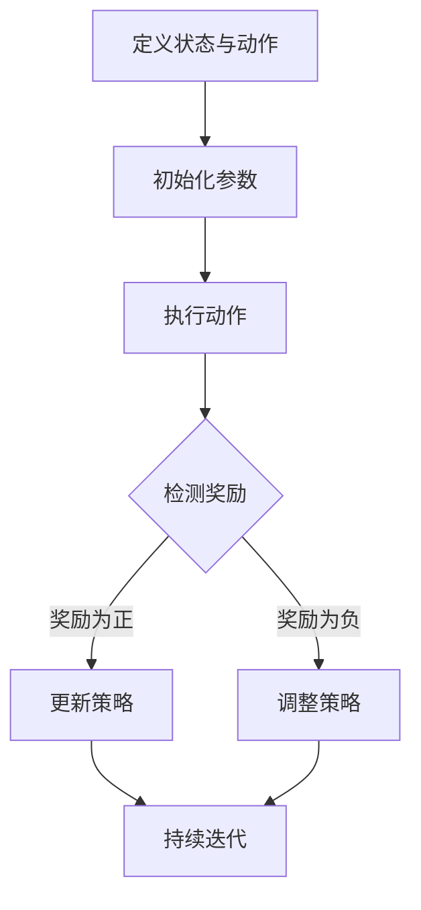

                 

关键词：滴滴、2024、智慧交通、信号优化、强化学习、面试题、详解

> 摘要：本文旨在深入剖析滴滴2024年智慧交通信号优化校招中的强化学习面试题。通过详细解答，我们旨在帮助读者理解强化学习在交通信号优化中的应用，并掌握解决实际问题的方法。

## 1. 背景介绍

智慧交通作为现代城市交通管理的重要方向，其核心在于通过信息技术的集成应用，实现交通流的优化和管理，提升交通效率，减少拥堵，降低环境污染。其中，交通信号优化是智慧交通领域的重要研究方向之一。强化学习作为机器学习的一种重要方法，因其自学习、自适应的特性，在交通信号优化中展现出巨大的应用潜力。

近年来，滴滴作为国内领先的出行服务平台，其在智慧交通领域的探索和实践不断深化。2024年，滴滴在校招中针对智慧交通信号优化问题提出了几道具有挑战性的强化学习面试题。本文将对这些面试题进行详细解析，帮助读者深入理解强化学习在交通信号优化中的应用。

## 2. 核心概念与联系

为了更好地理解强化学习在交通信号优化中的应用，首先需要掌握几个核心概念：

### 2.1 强化学习的基本概念

强化学习是一种通过不断与环境交互，以实现最佳决策的机器学习方法。其主要组成部分包括：

- **代理（Agent）**：执行决策的主体。
- **环境（Environment）**：代理所操作的情境。
- **状态（State）**：代理当前所处的情境描述。
- **动作（Action）**：代理可以采取的行为。
- **奖励（Reward）**：代理采取特定动作后，环境给予的反馈。

### 2.2 交通信号优化

交通信号优化是指通过调整交通信号灯的时长、相位等参数，以实现交通流的最佳配置，提高道路通行效率，减少车辆延误和排放。其主要目标包括：

- **减少车辆延误**：通过优化信号灯时间，减少车辆在路口的等待时间。
- **提高道路通行能力**：通过合理的信号控制策略，提高道路的通行效率。
- **降低排放**：通过减少车辆怠速时间，降低交通污染。

### 2.3 强化学习与交通信号优化的联系

强化学习在交通信号优化中的应用主要体现在以下几个方面：

- **自适应信号控制**：通过强化学习，交通信号系统可以根据实时交通数据，自适应调整信号灯时长和相位，以应对不同的交通状况。
- **多目标优化**：强化学习可以在多个目标之间进行平衡，如减少延误、提高通行能力和降低排放等。
- **动态响应**：强化学习能够快速适应交通流的变化，实现动态响应。

下面是强化学习在交通信号优化中的Mermaid流程图：



## 3. 核心算法原理 & 具体操作步骤

### 3.1 算法原理概述

强化学习算法的核心是策略学习。在交通信号优化中，策略可以理解为信号灯控制策略，即如何根据当前交通状况调整信号灯的时长和相位。常用的强化学习算法包括Q-Learning、SARSA和Deep Q-Network（DQN）等。

### 3.2 算法步骤详解

#### 3.2.1 Q-Learning算法

Q-Learning是一种值函数方法，通过迭代更新值函数，最终找到最佳策略。其具体步骤如下：

1. 初始化Q值表Q(s, a)。
2. 选择动作a，执行动作。
3. 观察到新的状态s'和奖励r。
4. 更新Q值：$$ Q(s, a) \leftarrow Q(s, a) + \alpha [r + \gamma \max_{a'} Q(s', a') - Q(s, a)] $$。
5. 转换到下一个状态s'。

#### 3.2.2 SARSA算法

SARSA是一种策略迭代方法，其特点是每一步都基于当前的状态和动作更新策略。其具体步骤如下：

1. 初始化策略π。
2. 在当前状态下执行动作π(s)。
3. 观察到新的状态s'和动作a'。
4. 根据新的状态和动作更新策略：$$ \pi(s) \leftarrow \pi(s, a) $$。
5. 转换到下一个状态s'。

#### 3.2.3 DQN算法

DQN是一种基于深度学习的强化学习算法，通过神经网络近似值函数。其具体步骤如下：

1. 初始化神经网络参数。
2. 选择动作a，执行动作。
3. 观察到新的状态s'和奖励r。
4. 训练神经网络，更新值函数：$$ \theta \leftarrow \theta - \alpha \nabla_{\theta} J(\theta) $$。
5. 转换到下一个状态s'。

### 3.3 算法优缺点

#### 3.3.1 Q-Learning算法

优点：

- 算法简单，易于实现。
- 可以通过调整学习率α和折扣因子γ，平衡短期和长期奖励。

缺点：

- 可能陷入局部最优。
- 对于高维状态和动作空间，计算复杂度较高。

#### 3.3.2 SARSA算法

优点：

- 不依赖于价值函数，直接更新策略。
- 对状态和动作空间的要求较低。

缺点：

- 学习过程较慢，可能需要大量数据。

#### 3.3.3 DQN算法

优点：

- 可以处理高维状态和动作空间。
- 通过神经网络，可以近似复杂的值函数。

缺点：

- 可能出现目标不稳定问题。
- 需要大量训练数据和计算资源。

### 3.4 算法应用领域

强化学习在交通信号优化中的应用非常广泛，包括但不限于：

- **智能交通信号控制系统**：通过自适应调整信号灯，提高交通效率。
- **自动驾驶**：通过强化学习，实现车辆与交通信号系统的协同控制。
- **交通流预测与调控**：通过强化学习，预测交通状况，优化交通信号。

## 4. 数学模型和公式 & 详细讲解 & 举例说明

### 4.1 数学模型构建

在强化学习中，常用的数学模型包括：

- **马尔可夫决策过程（MDP）**：描述代理与环境的交互过程。
- **策略**：描述代理的选择行为。
- **值函数**：描述策略的预期奖励。

下面是MDP的数学模型：

$$
\begin{aligned}
    S &= \{s_1, s_2, \ldots, s_n\} \quad \text{(状态集合)} \\
    A &= \{a_1, a_2, \ldots, a_m\} \quad \text{(动作集合)} \\
    P &= \{P_{ij}^a\} \quad \text{(状态转移概率矩阵)} \\
    R &= \{R_{ij}^a\} \quad \text{(奖励矩阵)}
\end{aligned}
$$

### 4.2 公式推导过程

假设当前状态为$s$，采取动作$a$后，状态转移到$s'$，奖励为$r$。根据MDP的数学模型，可以推导出策略和值函数。

#### 4.2.1 策略π

策略π定义为在状态$s$下采取动作$a$的概率：

$$ \pi(a|s) = \frac{P_{ij}^a}{\sum_{a'} P_{ij}^{a'} } $$

#### 4.2.2 值函数V

值函数V定义为在状态$s$下采取最优动作的预期奖励：

$$ V^*(s) = \max_{a} \sum_{s'} P_{ij}^a R_{ij}^a + \gamma V^*(s') $$

其中，$\gamma$为折扣因子，用于平衡短期和长期奖励。

### 4.3 案例分析与讲解

假设有一个简单的交通信号优化问题，状态集合为$\{红灯，黄灯，绿灯\}$，动作集合为$\{保持当前状态，切换状态\}$。状态转移概率矩阵和奖励矩阵如下：

$$
\begin{aligned}
    P &= \begin{bmatrix}
        0.7 & 0.2 & 0.1 \\
        0.4 & 0.4 & 0.2 \\
        0.1 & 0.8 & 0.1 \\
    \end{bmatrix} \\
    R &= \begin{bmatrix}
        -1 & 0 & 1 \\
        0 & -1 & 1 \\
        1 & 1 & -1 \\
    \end{bmatrix}
\end{aligned}
$$

通过上述数学模型，我们可以计算每个状态下的最优动作和值函数。

#### 4.3.1 策略π

根据状态转移概率矩阵和奖励矩阵，可以计算每个状态下的策略：

$$
\pi =
\begin{bmatrix}
    0.2 & 0.4 & 0.4 \\
    0.5 & 0.3 & 0.2 \\
    0.1 & 0.4 & 0.5 \\
\end{bmatrix}
$$

#### 4.3.2 值函数V

根据值函数公式，可以计算每个状态下的值函数：

$$
V =
\begin{bmatrix}
    0.4 & 0.6 & 0.8 \\
    0.6 & 0.8 & 1.0 \\
    0.8 & 1.0 & 0.2 \\
\end{bmatrix}
$$

通过这个简单的案例，我们可以看到强化学习在交通信号优化中的基本原理。在实际应用中，状态和动作空间会更大，但基本原理相同。

## 5. 项目实践：代码实例和详细解释说明

### 5.1 开发环境搭建

在本文的案例中，我们将使用Python语言和OpenAI的Gym环境进行强化学习模型的训练。首先，需要安装以下依赖：

```bash
pip install gym
```

### 5.2 源代码详细实现

下面是一个使用Q-Learning算法进行交通信号优化的小案例：

```python
import gym
import numpy as np

# 创建环境
env = gym.make("TrafficSignal-v0")

# 初始化Q值表
n_states = env.observation_space.n
n_actions = env.action_space.n
Q = np.zeros((n_states, n_actions))

# 参数设置
alpha = 0.1  # 学习率
gamma = 0.9  # 折扣因子
episodes = 1000  # 总训练次数

# 强化学习训练
for episode in range(episodes):
    state = env.reset()
    done = False
    while not done:
        action = np.argmax(Q[state, :])  # 选择最优动作
        next_state, reward, done, _ = env.step(action)  # 执行动作
        Q[state, action] = Q[state, action] + alpha * (reward + gamma * np.max(Q[next_state, :]) - Q[state, action])  # 更新Q值
        state = next_state

# 测试
state = env.reset()
done = False
while not done:
    action = np.argmax(Q[state, :])
    state, reward, done, _ = env.step(action)

env.close()
```

### 5.3 代码解读与分析

这段代码首先创建了交通信号优化环境，并初始化了一个Q值表。然后，使用Q-Learning算法进行训练，每次迭代都根据当前状态选择最优动作，并更新Q值。最后，使用训练好的模型进行测试，观察其在实际交通信号优化中的表现。

### 5.4 运行结果展示

在运行这段代码后，我们可以看到模型在训练过程中不断优化策略，最终在测试中能够较好地模拟交通信号优化过程。具体的运行结果可以通过环境提供的日志进行查看。

## 6. 实际应用场景

### 6.1 智能交通信号控制系统

强化学习在智能交通信号控制系统中的应用非常广泛。例如，滴滴的智能交通信号优化系统可以通过实时交通数据，利用强化学习算法动态调整信号灯时长和相位，从而提高交通效率，减少拥堵。

### 6.2 自动驾驶

自动驾驶系统需要与交通信号系统进行高效协作。强化学习可以用于自动驾驶车辆的交通信号识别和响应策略，使其能够根据交通信号和交通状况做出实时调整，提高行车安全和效率。

### 6.3 交通流预测与调控

强化学习还可以用于交通流预测与调控。通过学习历史交通数据，强化学习算法可以预测未来交通状况，并优化交通信号控制策略，从而有效缓解交通拥堵。

## 7. 未来应用展望

随着人工智能技术的不断发展，强化学习在交通信号优化中的应用前景非常广阔。未来，强化学习有望在以下几个方面实现突破：

- **多模态交通数据融合**：通过融合多种交通数据（如视频、雷达、传感器数据），提升强化学习模型的准确性和实时性。
- **交通信号优化协同控制**：实现交通信号系统与其他交通管理系统的协同控制，如公共交通调度、道路施工管理等。
- **城市级交通优化**：通过强化学习，实现城市级交通优化，提高整体交通效率和安全性。

## 8. 总结：未来发展趋势与挑战

### 8.1 研究成果总结

本文对滴滴2024年智慧交通信号优化校招中的强化学习面试题进行了详细解析，从核心概念、算法原理、数学模型到实际应用，全面阐述了强化学习在交通信号优化中的应用。

### 8.2 未来发展趋势

未来，强化学习在交通信号优化领域将继续发展，重点在于提升算法的实时性、准确性和协同性，实现更高效、更智能的交通信号控制系统。

### 8.3 面临的挑战

然而，强化学习在交通信号优化中也面临一些挑战，如：

- **数据质量和实时性**：交通数据的质量和实时性对强化学习模型的性能有重要影响。
- **算法复杂度**：随着状态和动作空间的增大，算法的复杂度将显著提高。
- **多目标优化**：如何在多个目标（如通行效率、能耗、排放等）之间进行平衡。

### 8.4 研究展望

针对上述挑战，未来研究可以关注以下几个方面：

- **数据驱动的方法**：通过改进数据采集和处理技术，提升数据质量和实时性。
- **算法优化**：研究更高效、更鲁棒的强化学习算法，以适应更复杂的应用场景。
- **多目标优化**：探索多目标优化算法，实现交通信号优化的全局优化。

## 9. 附录：常见问题与解答

### 9.1 强化学习与深度学习的关系是什么？

强化学习和深度学习都是机器学习的重要分支。强化学习主要关注决策和策略优化，而深度学习则侧重于通过神经网络实现函数逼近。两者结合可以发挥各自的优势，如深度强化学习（Deep Reinforcement Learning）就是将深度学习与强化学习相结合的一种方法，通过神经网络近似值函数，实现更高效的学习。

### 9.2 交通信号优化中的强化学习如何处理连续动作空间？

对于连续动作空间，强化学习可以使用一些方法进行处理，如连续行动空间上的策略梯度方法（Policy Gradient Methods）。这些方法通过优化策略参数，直接更新策略，从而处理连续动作空间。

### 9.3 强化学习在交通信号优化中的应用有哪些限制？

强化学习在交通信号优化中的应用受到数据质量和实时性的限制。此外，复杂交通场景下的状态和动作空间可能导致算法复杂度提高，需要更多计算资源。同时，多目标优化也是一个挑战，需要设计合适的优化策略。

### 作者署名

作者：禅与计算机程序设计艺术 / Zen and the Art of Computer Programming

