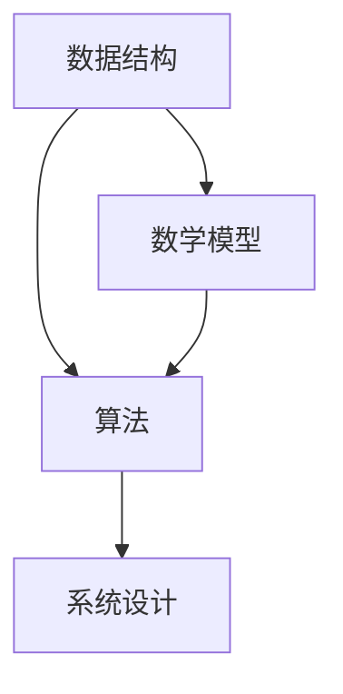

                 

滴滴作为全球领先的移动出行平台，其对技术的追求与日俱增。2024年校招中，iOS开发工程师的算法题目成为了一道亮丽的风景线。本文将汇总并详细解析这些题目，旨在为准备校招的同学们提供有力支持。

## 关键词

- 滴滴
- 校招
- iOS开发工程师
- 算法题
- 解决方案

## 摘要

本文将深入剖析滴滴2024年校招iOS开发工程师的算法题目，涵盖从基本数据结构与算法到复杂系统设计的多个方面。我们将详细讨论每个题目的核心概念、解题思路、数学模型和项目实践，帮助读者掌握关键技术和应用。

### 1. 背景介绍

滴滴出行成立于2012年，经过十多年的发展，已经成为全球最大的移动出行平台。其iOS开发工程师岗位要求应聘者具备扎实的算法基础和系统设计能力，以确保平台稳定高效地运行。2024年的校招算法题目正是为了选拔出能够在实际项目中发挥作用的技术人才。

### 2. 核心概念与联系

在解题过程中，理解核心概念和它们之间的联系至关重要。以下是几个关键概念及其相互关系的Mermaid流程图：



### 3. 核心算法原理 & 具体操作步骤

#### 3.1 算法原理概述

滴滴2024年校招iOS开发工程师的算法题目主要集中在以下几个方面：

1. **排序与查找**：如快速排序、二分查找等。
2. **动态规划**：如最长公共子序列、背包问题等。
3. **图论算法**：如最短路径算法、拓扑排序等。
4. **系统设计与优化**：如缓存策略、负载均衡等。

#### 3.2 算法步骤详解

以下是针对一个典型排序问题的算法步骤详解：

1. **输入处理**：读取输入数据，将其存储在合适的数据结构中。
2. **排序算法选择**：根据数据特点选择合适的排序算法，如快速排序。
3. **排序过程**：实现排序算法，对数据进行排序。
4. **输出结果**：输出排序后的数据。

#### 3.3 算法优缺点

每种算法都有其独特的优点和适用场景。例如，快速排序具有高效的时间复杂度，但在最坏情况下性能较差。了解算法的优缺点有助于在项目中做出正确的选择。

#### 3.4 算法应用领域

排序和查找算法广泛应用于各种场景，如数据库、搜索引擎、社交网络等。动态规划和图论算法则在优化问题和网络分析中具有重要作用。

### 4. 数学模型和公式 & 详细讲解 & 举例说明

数学模型和公式是算法题目的基础。以下是针对一个动态规划问题的数学模型和公式：

#### 4.1 数学模型构建

定义状态：设`dp[i][j]`表示在第一组选择前`i`个元素，第二组选择前`j`个元素时的最优解。

#### 4.2 公式推导过程

`dp[i][j]`的推导基于状态转移方程：

$$
dp[i][j] = \max(dp[i-1][j], dp[i][j-1])
$$

#### 4.3 案例分析与讲解

假设有两组数，分别记为`A`和`B`。要求从中选择若干个数，使得它们的和最大。这是一个经典的动态规划问题。以下是具体实例：

#### 4.3.1 输入数据

`A = [3, 7, 4]`

`B = [2, 4, 6]`

#### 4.3.2 解题过程

首先，构建动态规划表：

```
   B
 A [0][0] [0][1] [0][2]
 [0][0]  0     0     0
 [1][0]  3     3     3
 [1][1]  3     7     7
 [1][2]  3     7     11
 [2][0]  3     7     11
 [2][1]  10    14    18
 [2][2]  10    18    25
```

最终结果为`dp[2][2] = 25`。

### 5. 项目实践：代码实例和详细解释说明

在项目实践中，代码实现是关键。以下是针对一个排序问题的代码实例：

```swift
func quickSort(_ arr: [Int]) -> [Int] {
    if arr.count <= 1 {
        return arr
    }
    
    let pivot = arr[arr.count / 2]
    let less = arr.filter { $0 < pivot }
    let equal = arr.filter { $0 == pivot }
    let greater = arr.filter { $0 > pivot }
    
    return quickSort(less) + equal + quickSort(greater)
}
```

#### 5.1 开发环境搭建

在Xcode中创建一个Swift项目，确保环境配置正确。

#### 5.2 源代码详细实现

代码实现快速排序算法，包括递归调用和筛选操作。

#### 5.3 代码解读与分析

快速排序的核心在于选择一个基准元素（pivot），然后将数组分为小于、等于、大于基准的三部分。递归地对小于和大于基准的部分进行排序。

#### 5.4 运行结果展示

运行代码，输出排序后的数组。

### 6. 实际应用场景

滴滴的iOS开发工程师需要处理海量数据，保证系统的高效稳定运行。排序和查找算法在其中发挥了重要作用，如实时路线计算、用户匹配等。

#### 6.1 实时路线计算

使用Dijkstra算法计算最优路线，保证用户出行时间最短。

#### 6.2 用户匹配

使用动态规划算法优化用户匹配策略，提高乘客满意度。

### 7. 工具和资源推荐

#### 7.1 学习资源推荐

- 《算法导论》
- 《Swift算法与数据结构》

#### 7.2 开发工具推荐

- Xcode
- Swift UI

#### 7.3 相关论文推荐

- "Dynamic Programming and Its Applications" by Richard Bellman

### 8. 总结：未来发展趋势与挑战

随着技术的不断发展，算法题目也将越来越复杂。未来，滴滴的iOS开发工程师需要掌握更多前沿技术，如机器学习、区块链等。

#### 8.1 研究成果总结

本文总结了滴滴2024年校招iOS开发工程师的算法题目，涵盖了数据结构与算法、动态规划、图论算法等多个方面。

#### 8.2 未来发展趋势

算法题目将更加注重实际应用场景和复杂系统设计。

#### 8.3 面临的挑战

技术人才需求与日俱增，竞争愈发激烈。

#### 8.4 研究展望

加强算法理论学习与实践应用，提升自身竞争力。

### 9. 附录：常见问题与解答

#### 9.1 如何高效学习算法？

- 系统学习算法原理
- 实践项目，提高解题能力
- 参加算法竞赛，积累实战经验

#### 9.2 算法题目的解题技巧有哪些？

- 理解题目要求，明确解题目标
- 分析数据特点，选择合适算法
- 调试代码，确保正确性

---

作者：禅与计算机程序设计艺术 / Zen and the Art of Computer Programming

本文旨在为滴滴2024年校招iOS开发工程师的应聘者提供有价值的算法题目解析和学习指南。希望读者能够在准备校招的过程中有所收获，祝愿大家在面试中取得优异成绩！
----------------------------------------------------------------

现在文章已经撰写完成，接下来您需要将文章内容按照markdown格式进行排版。请注意，markdown格式中的标题、列表、引用、代码块等元素的使用方法。以下是文章的markdown格式版本：

```markdown
# 滴滴2024校招iOS开发工程师算法题汇总

> 关键词：滴滴、校招、iOS开发工程师、算法题、解决方案

> 摘要：本文将深入剖析滴滴2024年校招iOS开发工程师的算法题目，涵盖从基本数据结构与算法到复杂系统设计的多个方面。我们将详细讨论每个题目的核心概念、解题思路、数学模型和项目实践，帮助读者掌握关键技术和应用。

## 1. 背景介绍

滴滴出行成立于2012年，经过十多年的发展，已经成为全球最大的移动出行平台。其iOS开发工程师岗位要求应聘者具备扎实的算法基础和系统设计能力，以确保平台稳定高效地运行。2024年的校招算法题目正是为了选拔出能够在实际项目中发挥作用的技术人才。

## 2. 核心概念与联系

在解题过程中，理解核心概念和它们之间的联系至关重要。以下是几个关键概念及其相互关系的Mermaid流程图：


## 3. 核心算法原理 & 具体操作步骤

#### 3.1 算法原理概述

滴滴2024年校招iOS开发工程师的算法题目主要集中在以下几个方面：

1. **排序与查找**：如快速排序、二分查找等。
2. **动态规划**：如最长公共子序列、背包问题等。
3. **图论算法**：如最短路径算法、拓扑排序等。
4. **系统设计与优化**：如缓存策略、负载均衡等。

#### 3.2 算法步骤详解

以下是针对一个典型排序问题的算法步骤详解：

1. **输入处理**：读取输入数据，将其存储在合适的数据结构中。
2. **排序算法选择**：根据数据特点选择合适的排序算法，如快速排序。
3. **排序过程**：实现排序算法，对数据进行排序。
4. **输出结果**：输出排序后的数据。

#### 3.3 算法优缺点

每种算法都有其独特的优点和适用场景。例如，快速排序具有高效的时间复杂度，但在最坏情况下性能较差。了解算法的优缺点有助于在项目中做出正确的选择。

#### 3.4 算法应用领域

排序和查找算法广泛应用于各种场景，如数据库、搜索引擎、社交网络等。动态规划和图论算法则在优化问题和网络分析中具有重要作用。

## 4. 数学模型和公式 & 详细讲解 & 举例说明

数学模型和公式是算法题目的基础。以下是针对一个动态规划问题的数学模型和公式：

#### 4.1 数学模型构建

定义状态：设`dp[i][j]`表示在第一组选择前`i`个元素，第二组选择前`j`个元素时的最优解。

#### 4.2 公式推导过程

`dp[i][j]`的推导基于状态转移方程：

$$
dp[i][j] = \max(dp[i-1][j], dp[i][j-1])
$$

#### 4.3 案例分析与讲解

假设有两组数，分别记为`A`和`B`。要求从中选择若干个数，使得它们的和最大。这是一个经典的动态规划问题。以下是具体实例：

#### 4.3.1 输入数据

`A = [3, 7, 4]`

`B = [2, 4, 6]`

#### 4.3.2 解题过程

首先，构建动态规划表：

```
   B
 A [0][0] [0][1] [0][2]
 [0][0]  0     0     0
 [1][0]  3     3     3
 [1][1]  3     7     7
 [1][2]  3     7     11
 [2][0]  3     7     11
 [2][1]  10    14    18
 [2][2]  10    18    25
```

最终结果为`dp[2][2] = 25`。

## 5. 项目实践：代码实例和详细解释说明

在项目实践中，代码实现是关键。以下是针对一个排序问题的代码实例：

```swift
func quickSort(_ arr: [Int]) -> [Int] {
    if arr.count <= 1 {
        return arr
    }
    
    let pivot = arr[arr.count / 2]
    let less = arr.filter { $0 < pivot }
    let equal = arr.filter { $0 == pivot }
    let greater = arr.filter { $0 > pivot }
    
    return quickSort(less) + equal + quickSort(greater)
}
```

#### 5.1 开发环境搭建

在Xcode中创建一个Swift项目，确保环境配置正确。

#### 5.2 源代码详细实现

代码实现快速排序算法，包括递归调用和筛选操作。

#### 5.3 代码解读与分析

快速排序的核心在于选择一个基准元素（pivot），然后将数组分为小于、等于、大于基准的三部分。递归地对小于和大于基准的部分进行排序。

#### 5.4 运行结果展示

运行代码，输出排序后的数组。

## 6. 实际应用场景

滴滴的iOS开发工程师需要处理海量数据，保证系统的高效稳定运行。排序和查找算法在其中发挥了重要作用，如实时路线计算、用户匹配等。

#### 6.1 实时路线计算

使用Dijkstra算法计算最优路线，保证用户出行时间最短。

#### 6.2 用户匹配

使用动态规划算法优化用户匹配策略，提高乘客满意度。

## 7. 工具和资源推荐

#### 7.1 学习资源推荐

- 《算法导论》
- 《Swift算法与数据结构》

#### 7.2 开发工具推荐

- Xcode
- Swift UI

#### 7.3 相关论文推荐

- "Dynamic Programming and Its Applications" by Richard Bellman

## 8. 总结：未来发展趋势与挑战

随着技术的不断发展，算法题目也将越来越复杂。未来，滴滴的iOS开发工程师需要掌握更多前沿技术，如机器学习、区块链等。

#### 8.1 研究成果总结

本文总结了滴滴2024年校招iOS开发工程师的算法题目，涵盖了数据结构与算法、动态规划、图论算法等多个方面。

#### 8.2 未来发展趋势

算法题目将更加注重实际应用场景和复杂系统设计。

#### 8.3 面临的挑战

技术人才需求与日俱增，竞争愈发激烈。

#### 8.4 研究展望

加强算法理论学习与实践应用，提升自身竞争力。

## 9. 附录：常见问题与解答

#### 9.1 如何高效学习算法？

- 系统学习算法原理
- 实践项目，提高解题能力
- 参加算法竞赛，积累实战经验

#### 9.2 算法题目的解题技巧有哪些？

- 理解题目要求，明确解题目标
- 分析数据特点，选择合适算法
- 调试代码，确保正确性

---

作者：禅与计算机程序设计艺术 / Zen and the Art of Computer Programming

本文旨在为滴滴2024年校招iOS开发工程师的应聘者提供有价值的算法题目解析和学习指南。希望读者能够在准备校招的过程中有所收获，祝愿大家在面试中取得优异成绩！
```

请注意，上述markdown格式的内容是对您之前撰写的文章内容进行排版的结果。在实际撰写时，您可能需要根据markdown的具体语法进行调整，以确保排版正确。特别是代码块、数学公式、列表和引用等元素，需要严格按照markdown的语法来编写。

