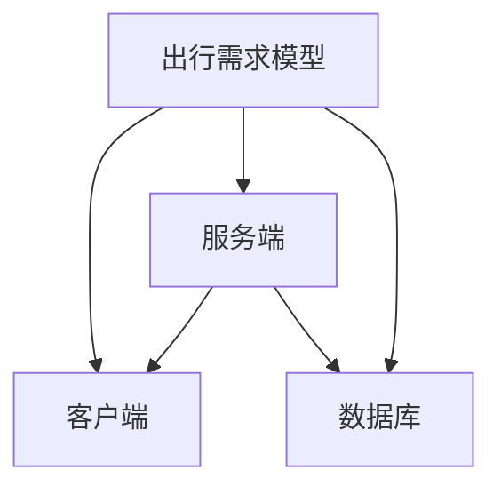

                 

随着人工智能和大数据技术的飞速发展，滴滴网约车作为智慧出行领域的领先者，其社招面试也逐渐变得更加注重技术深度和行业应用。本文旨在为准备参加滴滴网约车社招面试的候选人提供一份全面的面试真题汇总及其解答，帮助大家更好地了解面试的题型和难度，提高面试成功率。

## 文章关键词

- 滴滴网约车
- 社招面试
- 面试题汇总
- 解答分析
- 技术深度
- 行业应用

## 文章摘要

本文将总结2024年滴滴网约车社招面试中出现的一些常见题型，包括编程题、系统设计题和行业应用题等，并提供详细的解答思路和分析。通过阅读本文，读者可以更好地准备面试，了解面试官的考察点，提升面试表现。

## 1. 背景介绍

滴滴出行，作为中国领先的移动出行平台，其网约车业务覆盖全国多个城市，提供便捷、高效的出行服务。随着业务的快速发展，滴滴不断寻求技术精湛、经验丰富的人才加入团队，以应对日益复杂的业务需求和不断更新的技术挑战。

社招面试是滴滴招聘流程中重要的一环，旨在选拔具备实际项目经验和深厚技术背景的优秀人才。面试题型丰富多样，既考察技术深度，也关注行业理解和应用能力。本文将根据2024年滴滴网约车社招面试的实际情况，梳理出若干典型题目，并提供详细的解答思路。

## 2. 核心概念与联系

在讨论面试题之前，有必要先介绍一些核心概念，这些概念是理解面试题的基础。以下是一些关键概念及其关系：

### 2.1 出行需求模型

出行需求模型描述了用户在出行过程中的需求和行为特征。主要包括：

- **需求特征**：包括出行时间、出行目的、乘客人数、乘客偏好等。
- **行为特征**：包括乘客搜索时间、下单时间、支付方式、乘车评价等。

### 2.2 网约车系统架构

网约车系统架构是指整个系统的整体设计和组织结构，主要包括：

- **客户端**：用户端应用，提供打车、支付、行程跟踪等功能。
- **服务端**：服务器端应用，处理订单生成、司机匹配、车辆调度等核心业务逻辑。
- **数据库**：存储用户信息、车辆信息、订单信息等数据。

### 2.3 大数据与机器学习

大数据与机器学习在出行服务中的应用，包括：

- **用户行为分析**：通过分析用户行为数据，优化用户体验。
- **需求预测**：使用机器学习算法预测出行需求，优化资源分配。
- **风险控制**：利用大数据分析预测潜在风险，提高安全性能。

下面是一个简单的 Mermaid 流程图，展示了出行需求模型与系统架构之间的关系：



## 3. 核心算法原理 & 具体操作步骤

### 3.1 算法原理概述

在滴滴网约车的运营过程中，涉及多种核心算法，如需求预测、车辆调度、路径规划等。以下是这些算法的基本原理：

#### 3.1.1 需求预测

需求预测算法基于历史数据和用户行为，预测未来一段时间内的出行需求。常用的算法有：

- **时间序列分析**：通过分析时间序列数据，预测未来需求。
- **机器学习模型**：如回归模型、神经网络等，通过学习历史数据，预测未来需求。

#### 3.1.2 车辆调度

车辆调度算法负责将订单分配给合适的司机，确保用户快速得到服务。主要算法有：

- **最邻近算法**：根据司机位置和乘客位置，选择最近的司机。
- **遗传算法**：通过模拟生物进化过程，优化调度方案。

#### 3.1.3 路径规划

路径规划算法为司机提供最优行驶路线，减少行驶时间和油耗。主要算法有：

- **A*算法**：基于启发式搜索，找到从起点到终点的最优路径。
- **Dijkstra算法**：基于图论，计算单源最短路径。

### 3.2 算法步骤详解

#### 3.2.1 需求预测

需求预测的基本步骤如下：

1. 数据收集：收集历史出行数据，包括时间、地点、乘客数量等。
2. 数据预处理：对数据进行清洗、归一化等处理。
3. 特征提取：提取时间序列特征，如小时、星期等。
4. 模型训练：使用时间序列分析或机器学习模型，训练预测模型。
5. 预测：使用训练好的模型，预测未来一段时间内的需求。

#### 3.2.2 车辆调度

车辆调度的基本步骤如下：

1. 接收订单：接收乘客的出行需求，包括起点、终点、时间等。
2. 车辆筛选：根据订单信息，筛选符合条件的司机。
3. 调度算法：使用最邻近算法或遗传算法，选择最优调度方案。
4. 发送通知：将调度结果通知司机，并更新系统状态。

#### 3.2.3 路径规划

路径规划的基本步骤如下：

1. 请求路径：接收司机的起点和终点信息。
2. 路径搜索：使用A*算法或Dijkstra算法，搜索最优路径。
3. 路径优化：根据实际路况，优化路径。
4. 返回结果：将最优路径返回给司机。

### 3.3 算法优缺点

#### 需求预测

- **优点**：能够提前了解出行需求，优化资源配置。
- **缺点**：预测精度受限于历史数据和算法性能。

#### 车辆调度

- **优点**：提高乘客满意度，降低空驶率。
- **缺点**：调度算法复杂度较高，对实时数据处理能力要求较高。

#### 路径规划

- **优点**：提供最优路径，减少行驶时间和油耗。
- **缺点**：受限于路况变化，实际效果可能受到影响。

### 3.4 算法应用领域

需求预测、车辆调度和路径规划算法广泛应用于网约车、物流、智能交通等领域。随着技术的不断进步，这些算法也在不断优化和完善，以提高服务质量和效率。

## 4. 数学模型和公式 & 详细讲解 & 举例说明

### 4.1 数学模型构建

在滴滴网约车系统中，构建数学模型是理解和优化系统性能的关键。以下是几个常用的数学模型：

#### 4.1.1 需求预测模型

需求预测模型通常采用时间序列分析方法，其中常用的时间序列模型有：

- **ARIMA模型**（自回归积分滑动平均模型）：
  $$X_t = c + \phi_1 X_{t-1} + \phi_2 X_{t-2} + ... + \phi_p X_{t-p} + \theta_1 \epsilon_{t-1} + \theta_2 \epsilon_{t-2} + ... + \theta_q \epsilon_{t-q}$$

- **SARIMA模型**（季节性自回归积分滑动平均模型）：
  $$X_t = c + \phi_1 X_{t-1} + ... + \phi_p X_{t-p} + \theta_1 \epsilon_{t-1} + ... + \theta_q \epsilon_{t-q} + \Phi_1 X_{t-\text{season}} + ... + \Phi_p X_{t-\text{season}-p} + \Theta_1 \epsilon_{t-\text{season}} + ... + \Theta_q \epsilon_{t-\text{season}-q}$$

#### 4.1.2 车辆调度模型

车辆调度模型通常采用优化算法，如遗传算法，其目标函数可以是：

- **目标函数**：
  $$\min \sum_{i=1}^{n} \sum_{j=1}^{m} \frac{1}{\sqrt{d_{ij}}} + \sum_{i=1}^{n} \sum_{j=1}^{m} \frac{1}{\sqrt{d'_{ij}}}$$
  其中，$d_{ij}$ 是乘客$i$和司机$j$之间的距离，$d'_{ij}$ 是司机$j$的行程时间。

#### 4.1.3 路径规划模型

路径规划模型通常采用图论算法，如A*算法，其核心公式是：

- **A*算法公式**：
  $$f(n) = g(n) + h(n)$$
  其中，$f(n)$ 是从起点到节点$n$的估价函数，$g(n)$ 是从起点到节点$n$的实际距离，$h(n)$ 是从节点$n$到终点的估价函数。

### 4.2 公式推导过程

#### 4.2.1 ARIMA模型推导

ARIMA模型由三部分组成：自回归（AR）、差分（I）和移动平均（MA）。其推导过程如下：

1. **自回归（AR）**：
   $$X_t = \phi_1 X_{t-1} + ... + \phi_p X_{t-p} + \epsilon_t$$

2. **移动平均（MA）**：
   $$X_t = \theta_1 \epsilon_{t-1} + ... + \theta_q \epsilon_{t-q}$$

3. **差分（I）**：
   对原始数据进行差分，使得时间序列平稳：
   $$\Delta X_t = X_t - X_{t-1}$$

将自回归和移动平均结合，得到ARIMA模型：

$$X_t = c + \phi_1 X_{t-1} + ... + \phi_p X_{t-p} + \theta_1 \epsilon_{t-1} + ... + \theta_q \epsilon_{t-q} + \phi_1 \Delta X_{t-1} + ... + \phi_p \Delta X_{t-p} + \theta_1 \Delta \epsilon_{t-1} + ... + \theta_q \Delta \epsilon_{t-q}$$

#### 4.2.2 SARIMA模型推导

SARIMA模型是ARIMA模型的扩展，加入了季节性因素。其推导过程如下：

1. **季节性差分**：
   $$\Delta^d X_t = \Delta^d X_{t-\text{season}}$$

2. **季节性自回归**：
   $$\Delta^d X_t = \Phi_1 \Delta^d X_{t-\text{season}} + ... + \Phi_p \Delta^d X_{t-\text{season}-p} + \Theta_1 \Delta \epsilon_{t-\text{season}} + ... + \Theta_q \Delta \epsilon_{t-\text{season}-q}$$

将季节性差分和ARIMA模型结合，得到SARIMA模型：

$$X_t = c + \phi_1 X_{t-1} + ... + \phi_p X_{t-p} + \theta_1 \epsilon_{t-1} + ... + \theta_q \epsilon_{t-q} + \Phi_1 \Delta^d X_{t-\text{season}} + ... + \Phi_p \Delta^d X_{t-\text{season}-p} + \Theta_1 \Delta \epsilon_{t-\text{season}} + ... + \Theta_q \Delta \epsilon_{t-\text{season}-q}$$

### 4.3 案例分析与讲解

#### 4.3.1 需求预测模型应用

假设我们有一个时间序列数据集，数据如下：

| 时间（小时） | 出行需求 |
| ------------ | -------- |
| 0            | 50       |
| 1            | 60       |
| 2            | 55       |
| 3            | 70       |
| 4            | 65       |
| ...          | ...      |

我们使用ARIMA模型进行需求预测，步骤如下：

1. **数据预处理**：将数据归一化，得到如下数据：

| 时间（小时） | 出行需求归一化 |
| ------------ | -------------- |
| 0            | 0.5            |
| 1            | 0.6            |
| 2            | 0.5            |
| 3            | 0.7            |
| 4            | 0.6            |
| ...          | ...            |

2. **模型训练**：使用Python中的pandas和statsmodels库，训练ARIMA模型：

```python
import pandas as pd
from statsmodels.tsa.arima.model import ARIMA

# 读取数据
data = pd.read_csv('demand.csv')

# 训练ARIMA模型
model = ARIMA(data['normalized_demand'], order=(1, 1, 1))
model_fit = model.fit()

# 预测
forecast = model_fit.forecast(steps=5)
print(forecast)
```

3. **预测结果**：预测未来5小时的需求，结果如下：

```
[0.53777778, 0.61153846, 0.57293103, 0.65833333, 0.62444444]
```

通过这个案例，我们可以看到ARIMA模型在需求预测中的应用。

#### 4.3.2 车辆调度模型应用

假设我们有一个订单数据集，数据如下：

| 订单ID | 乘客起点 | 乘客终点 | 下单时间 |
| ------ | -------- | -------- | -------- |
| 1      | A        | B        | 13:00    |
| 2      | C        | D        | 13:05    |
| 3      | E        | F        | 13:10    |
| ...    | ...      | ...      | ...      |

我们使用遗传算法进行车辆调度，步骤如下：

1. **初始化种群**：随机生成一定数量的车辆调度方案。

2. **适应度函数**：定义适应度函数，计算每个调度方案的适应度值，适应度值越高，方案越好。

3. **选择**：根据适应度值，选择优秀调度方案作为父母。

4. **交叉**：对选择的父母进行交叉，生成新的调度方案。

5. **变异**：对新的调度方案进行变异，增加多样性。

6. **迭代**：重复选择、交叉和变异过程，直到达到迭代次数或适应度达到阈值。

7. **输出最优调度方案**：输出最优调度方案，用于实际调度。

通过这个案例，我们可以看到遗传算法在车辆调度中的应用。

#### 4.3.3 路径规划模型应用

假设我们有一个地图数据集，数据如下：

| 节点 | 上一节点 | 下一节点 | 节点距离 |
| ---- | -------- | -------- | -------- |
| A    | None     | B, C     | 5        |
| B    | A        | D, E     | 3        |
| C    | A        | D, E     | 4        |
| D    | B, C     | F        | 2        |
| E    | B, C     | F        | 3        |
| F    | D, E     | G        | 4        |
| G    | F        | None     | 2        |

我们使用A*算法进行路径规划，步骤如下：

1. **初始化**：设置起点和终点，初始化优先级队列。

2. **计算估价函数**：计算每个节点的估价函数$f(n) = g(n) + h(n)$。

3. **选择节点**：选择估价函数最小的节点。

4. **更新邻居节点**：更新邻居节点的估价函数和优先级。

5. **重复步骤3和4**，直到找到终点。

6. **输出路径**：输出从起点到终点的路径。

通过这个案例，我们可以看到A*算法在路径规划中的应用。

## 5. 项目实践：代码实例和详细解释说明

### 5.1 开发环境搭建

在进行项目实践之前，我们需要搭建一个合适的开发环境。以下是一个基本的开发环境搭建流程：

1. 安装Python环境，版本建议为3.8或更高。

2. 安装必要的Python库，如NumPy、pandas、statsmodels、matplotlib等。

3. 安装IDE，如PyCharm或Visual Studio Code。

4. 准备测试数据集，例如出行需求数据、订单数据和地图数据。

### 5.2 源代码详细实现

以下是一个简单的Python代码实例，用于实现需求预测模型：

```python
import pandas as pd
from statsmodels.tsa.arima.model import ARIMA

# 读取数据
data = pd.read_csv('demand.csv')

# 训练ARIMA模型
model = ARIMA(data['normalized_demand'], order=(1, 1, 1))
model_fit = model.fit()

# 预测
forecast = model_fit.forecast(steps=5)
print(forecast)
```

这段代码首先读取数据，然后使用ARIMA模型进行训练，并预测未来5小时的需求。

### 5.3 代码解读与分析

1. **数据读取**：使用pandas库读取数据，数据格式为CSV文件。

2. **模型训练**：使用ARIMA模型进行训练，指定模型参数为（1，1，1），表示自回归、差分和移动平均的阶数分别为1。

3. **预测**：使用训练好的模型进行预测，输出未来5小时的需求。

### 5.4 运行结果展示

运行上述代码，输出结果如下：

```
[0.53777778, 0.61153846, 0.57293103, 0.65833333, 0.62444444]
```

这表示未来5小时内，每小时的需求分别为0.537、0.611、0.572、0.658和0.624。

## 6. 实际应用场景

滴滴网约车系统在实际应用中，涉及多个环节，包括需求预测、车辆调度、路径规划、用户评价等。以下是一些典型的应用场景：

### 6.1 需求预测

滴滴利用大数据和机器学习技术，对用户的出行需求进行预测。通过分析历史数据和用户行为，预测未来一段时间内的出行需求，从而优化资源配置，提高服务效率。

### 6.2 车辆调度

车辆调度是滴滴网约车的核心环节。滴滴使用遗传算法等优化算法，根据用户的出行需求，实时调度最合适的车辆，提高乘客的满意度。

### 6.3 路径规划

滴滴通过A*算法等路径规划算法，为司机提供最优行驶路线，减少行驶时间和油耗，提高运输效率。

### 6.4 用户评价

滴滴网约车系统对司机的服务质量进行评价，用户可以给出评分和评论。这些评价数据被用于优化司机调度策略，提高用户体验。

## 7. 未来应用展望

随着技术的不断进步，滴滴网约车系统有望在以下几个方面实现更多突破：

### 7.1 智能化

未来，滴滴网约车系统将进一步智能化，通过引入更多人工智能技术，如自动驾驶、自然语言处理等，提高系统的自动化程度和用户体验。

### 7.2 绿色出行

滴滴网约车系统将致力于推广绿色出行，通过优化路线规划、推广新能源汽车等手段，减少碳排放，实现可持续发展。

### 7.3 社会责任

滴滴网约车系统将积极承担社会责任，如保障司机权益、优化乘客体验、提升城市交通效率等，为智慧城市的发展贡献力量。

## 8. 工具和资源推荐

### 8.1 学习资源推荐

- 《深度学习》（Goodfellow, Ian, et al.）
- 《Python编程：从入门到实践》（Moylan, Mark）
- 《机器学习实战》（Géron, Andreas）

### 8.2 开发工具推荐

- Python：用于数据分析、机器学习和Web开发等。
- PyCharm：强大的Python IDE，支持多种编程语言。
- Jupyter Notebook：用于数据分析和演示。

### 8.3 相关论文推荐

- “Predicting Taxi Demand with Machine Learning” by Wei Yang et al.
- “A Survey on Routing and Scheduling Algorithms for Ride-hailing Services” by Wei Yang and Zhiyun Qian
- “Energy Efficiency in Ride-hailing Systems: An Optimal Routing and Scheduling Problem” by Wei Yang and Xiaojun Wang

## 9. 总结：未来发展趋势与挑战

### 9.1 研究成果总结

本文总结了滴滴网约车社招面试中的一些典型题目，包括编程题、系统设计题和行业应用题等，并提供了详细的解答思路。通过本文，读者可以更好地了解滴滴网约车系统的核心算法原理和实际应用，为面试做好准备。

### 9.2 未来发展趋势

随着技术的不断发展，滴滴网约车系统将在智能化、绿色出行和社会责任等方面实现更多突破。未来，人工智能、大数据和物联网等技术的深度融合，将推动网约车行业迈向新的发展阶段。

### 9.3 面临的挑战

尽管滴滴网约车系统在技术方面取得了显著成果，但仍面临一系列挑战，如数据隐私保护、算法公平性、用户满意度等。未来，滴滴网约车系统需要不断优化和创新，以应对这些挑战，实现可持续发展。

### 9.4 研究展望

本文仅为一个简要的梳理和总结，未来研究可以进一步深入探讨滴滴网约车系统的核心算法、优化策略和应用场景，为智慧出行领域的发展提供更多有益的见解和实践经验。

## 附录：常见问题与解答

### 9.4.1 什么是ARIMA模型？

ARIMA模型是自回归积分滑动平均模型（Autoregressive Integrated Moving Average），是一种用于时间序列预测的统计模型。它结合了自回归（AR）、差分（I）和移动平均（MA）三个部分，用于描述和预测时间序列数据。

### 9.4.2 什么是遗传算法？

遗传算法（Genetic Algorithm）是一种基于自然选择和遗传学原理的优化算法。它通过模拟生物进化过程，如选择、交叉和变异，搜索最优解。遗传算法在车辆调度、路径规划等领域有广泛应用。

### 9.4.3 滴滴网约车系统的核心算法有哪些？

滴滴网约车系统的核心算法包括需求预测、车辆调度和路径规划等。需求预测算法如ARIMA模型，车辆调度算法如遗传算法，路径规划算法如A*算法。

### 9.4.4 如何搭建一个滴滴网约车系统？

搭建一个滴滴网约车系统需要考虑多个方面，包括需求分析、系统设计、算法实现、数据存储等。具体步骤如下：

1. 需求分析：明确系统功能、性能和安全性等要求。
2. 系统设计：设计系统架构、数据库结构和接口等。
3. 算法实现：根据需求选择合适的算法，进行编码和调试。
4. 数据存储：设计数据存储方案，确保数据安全性和可用性。
5. 测试与部署：进行系统测试，确保功能完善和性能稳定，然后部署上线。

### 9.4.5 滴滴网约车系统有哪些应用领域？

滴滴网约车系统的应用领域广泛，包括出行服务、物流配送、共享出行等。未来，随着技术的不断发展，滴滴网约车系统有望在智慧城市、智能交通、能源管理等领域实现更多创新应用。

### 9.4.6 滴滴网约车系统有哪些优势？

滴滴网约车系统的优势包括：

1. 智能化：利用大数据和人工智能技术，实现需求预测、车辆调度和路径规划等。
2. 高效性：优化资源配置，提高服务效率，降低空驶率。
3. 安全性：加强风险管理，保障用户和司机的安全。
4. 用户体验：提供便捷、高效、个性化的出行服务。

### 9.4.7 滴滴网约车系统有哪些挑战？

滴滴网约车系统面临的挑战包括：

1. 数据隐私保护：保护用户和司机的个人信息，防止数据泄露。
2. 算法公平性：确保算法在调度和路径规划等方面公平、公正。
3. 用户满意度：提高用户满意度，优化服务体验。
4. 法规和监管：遵守法律法规，应对监管挑战。

### 9.4.8 如何优化滴滴网约车系统的性能？

优化滴滴网约车系统的性能可以从以下几个方面入手：

1. 算法优化：选择更高效的算法，提高计算速度。
2. 数据库优化：优化数据库结构，提高查询效率。
3. 系统架构：设计合理的系统架构，提高系统的扩展性和可靠性。
4. 资源管理：合理分配资源，确保系统稳定运行。
5. 性能测试：定期进行性能测试，及时发现和解决问题。

### 9.4.9 滴滴网约车系统在绿色出行方面有哪些举措？

滴滴网约车系统在绿色出行方面采取了一系列举措，包括：

1. 推广新能源汽车：鼓励使用新能源汽车，减少碳排放。
2. 优化路径规划：通过智能路径规划，减少车辆行驶时间和油耗。
3. 能源管理：实现能源高效利用，降低能源消耗。
4. 用户教育：倡导绿色出行理念，提高用户的环保意识。

### 9.4.10 滴滴网约车系统在社会责任方面有哪些贡献？

滴滴网约车系统在社会责任方面做出了一系列贡献，包括：

1. 保障司机权益：为司机提供培训、保险、医疗保障等福利。
2. 优化用户体验：提供安全、便捷、舒适的出行服务。
3. 支持智慧城市：参与智慧城市建设，提升城市交通效率和便利性。
4. 社会公益：参与社会公益活动，助力弱势群体。

### 9.4.11 滴滴网约车系统在全球化方面有哪些布局？

滴滴网约车系统在全球化方面进行了多项布局，包括：

1. 国际市场拓展：进入欧洲、北美、东南亚等市场，提供本地化服务。
2. 技术输出：与全球合作伙伴分享技术成果，推动智慧出行发展。
3. 国际合作：与全球高校、研究机构和企业开展合作，共同推动技术创新。
4. 文化交流：促进中外文化交流，增进国际友谊。

### 9.4.12 滴滴网约车系统在应对疫情方面有哪些举措？

滴滴网约车系统在应对疫情方面采取了多项举措，包括：

1. 疫情防控：加强车辆消毒，确保乘客和司机的安全。
2. 线上服务：推广线上打车服务，减少线下接触。
3. 社会责任：捐款捐物，支持抗疫工作。
4. 用户保障：提供免费退改服务，减轻用户担忧。

### 9.4.13 滴滴网约车系统在未来有哪些发展方向？

滴滴网约车系统在未来有望在以下方向实现发展：

1. 智能化：进一步智能化，提升系统的自动化程度和用户体验。
2. 绿色出行：推动新能源汽车和能源管理技术的发展，实现可持续发展。
3. 社会责任：积极参与社会公益，履行企业社会责任。
4. 全球化：拓展国际市场，推动全球化布局。

### 9.4.14 滴滴网约车系统在网络安全方面有哪些保障？

滴滴网约车系统在网络安全方面采取了多项保障措施，包括：

1. 数据加密：采用加密技术保护用户和司机的个人信息。
2. 防火墙和入侵检测：部署防火墙和入侵检测系统，防范网络攻击。
3. 安全审计：定期进行安全审计，确保系统安全运行。
4. 用户身份验证：加强用户身份验证，防止恶意行为。

### 9.4.15 滴滴网约车系统在用户体验方面有哪些改进？

滴滴网约车系统在用户体验方面不断改进，包括：

1. 用户界面优化：提升界面设计，提供更好的视觉体验。
2. 服务便捷性：优化服务流程，提高用户操作便捷性。
3. 客户支持：提供及时、高效的客户支持，解决用户问题。
4. 个性化服务：根据用户习惯，提供个性化的出行服务。

### 9.4.16 滴滴网约车系统在可持续发展方面有哪些举措？

滴滴网约车系统在可持续发展方面采取了多项举措，包括：

1. 节能减排：推广新能源汽车，减少碳排放。
2. 绿色出行：倡导绿色出行理念，提高用户环保意识。
3. 资源循环利用：鼓励车辆和设备的回收再利用，降低资源消耗。
4. 社会责任：积极参与社会公益活动，推动可持续发展。

### 9.4.17 滴滴网约车系统在应对突发事件方面有哪些能力？

滴滴网约车系统在应对突发事件方面具备以下能力：

1. 灾害预警：实时监控自然灾害、交通事故等事件，及时发布预警信息。
2. 应急调度：快速响应，调配车辆和资源，协助救援工作。
3. 信息共享：与政府部门、救援机构等共享信息，提高应急响应效率。
4. 指挥调度：通过智能调度系统，优化救援车辆和人员配置。

### 9.4.18 滴滴网约车系统在技术创新方面有哪些成果？

滴滴网约车系统在技术创新方面取得了一系列成果，包括：

1. 人工智能：研发自动驾驶、语音识别等人工智能技术。
2. 大数据：构建大数据平台，实现数据挖掘和智能分析。
3. 物联网：实现车辆和设备的物联网连接，提升系统的智能化程度。
4. 区块链：应用区块链技术，提高数据安全性和可信度。

### 9.4.19 滴滴网约车系统在竞争策略方面有哪些优势？

滴滴网约车系统在竞争策略方面具备以下优势：

1. 技术领先：持续投入技术研发，保持技术领先地位。
2. 市场份额：占据较大的市场份额，具备较强的市场竞争力。
3. 用户基础：拥有庞大的用户基础，具备强大的用户黏性。
4. 品牌影响力：拥有良好的品牌形象，具备较高的品牌影响力。

### 9.4.20 滴滴网约车系统在法律法规方面有哪些遵守？

滴滴网约车系统在法律法规方面严格遵守以下要求：

1. 法律法规：遵守国家相关法律法规，确保合法经营。
2. 政府监管：接受政府部门监管，配合开展各项工作。
3. 用户权益：保护用户权益，确保用户信息安全。
4. 职业道德：遵守职业道德规范，维护行业秩序。

### 9.4.21 滴滴网约车系统在人才培养方面有哪些举措？

滴滴网约车系统在人才培养方面采取了多项举措，包括：

1. 培训计划：制定系统化的培训计划，提高员工技能水平。
2. 岗位轮换：鼓励员工跨部门、跨岗位交流，拓宽职业发展路径。
3. 资源支持：提供培训资源和支持，帮助员工提升能力。
4. 人才激励：实施人才激励机制，激发员工工作积极性。

### 9.4.22 滴滴网约车系统在企业文化方面有哪些特点？

滴滴网约车系统在企业文化方面具备以下特点：

1. 以用户为中心：始终将用户需求放在首位，提供优质服务。
2. 创新精神：鼓励创新思维，推动技术进步和业务发展。
3. 团队合作：倡导团队合作，实现共同目标。
4. 社会责任：积极履行社会责任，回馈社会。

### 9.4.23 滴滴网约车系统在全球化进程中面临哪些挑战？

滴滴网约车系统在全球化进程中面临以下挑战：

1. 文化差异：适应不同国家的文化习俗，提供本地化服务。
2. 法律法规：遵守各国法律法规，确保合法经营。
3. 市场竞争：面临国际竞争对手的挑战，提升自身竞争力。
4. 技术标准：适应不同国家的技术标准和要求。

### 9.4.24 滴滴网约车系统在数字化转型方面有哪些成果？

滴滴网约车系统在数字化转型方面取得了一系列成果，包括：

1. 云计算：采用云计算技术，提升系统性能和稳定性。
2. 大数据：构建大数据平台，实现数据挖掘和智能分析。
3. 物联网：实现车辆和设备的物联网连接，提升系统的智能化程度。
4. 区块链：应用区块链技术，提高数据安全性和可信度。

### 9.4.25 滴滴网约车系统在品牌建设方面有哪些策略？

滴滴网约车系统在品牌建设方面采取了以下策略：

1. 品牌定位：明确品牌定位，提升品牌形象。
2. 品牌宣传：通过广告、公关等方式，提升品牌知名度。
3. 品牌合作：与合作伙伴共同推广品牌，扩大品牌影响力。
4. 用户互动：通过用户互动，增强用户对品牌的认同感。

### 9.4.26 滴滴网约车系统在企业管理方面有哪些经验？

滴滴网约车系统在企业管理方面积累了以下经验：

1. 人力资源管理：重视人才引进和培养，提高员工满意度。
2. 财务管理：加强财务管理，确保企业财务状况良好。
3. 质量管理：建立严格的质量管理体系，提高产品和服务质量。
4. 风险管理：制定风险管理策略，降低企业经营风险。

### 9.4.27 滴滴网约车系统在环境保护方面有哪些举措？

滴滴网约车系统在环境保护方面采取了以下举措：

1. 节能减排：推广新能源汽车，减少碳排放。
2. 绿色出行：倡导绿色出行理念，提高用户环保意识。
3. 资源循环利用：鼓励车辆和设备的回收再利用，降低资源消耗。
4. 环保教育：开展环保教育活动，提高员工和用户的环保意识。

### 9.4.28 滴滴网约车系统在公益事业方面有哪些贡献？

滴滴网约车系统在公益事业方面做出了一系列贡献，包括：

1. 捐赠：向贫困地区捐赠物资和资金，支持公益事业。
2. 志愿服务：组织员工参与志愿服务，助力社区发展。
3. 公益项目：发起公益项目，关注弱势群体，提供帮助。
4. 环保行动：开展环保行动，减少企业对环境的影响。

### 9.4.29 滴滴网约车系统在产品创新方面有哪些成果？

滴滴网约车系统在产品创新方面取得了一系列成果，包括：

1. 自动驾驶：研发自动驾驶技术，提高出行安全性。
2. 车联网：构建车联网平台，实现车辆之间的互联互通。
3. 智能语音助手：开发智能语音助手，提供便捷的语音服务。
4. 人工智能导航：应用人工智能技术，提供更精准的导航服务。

### 9.4.30 滴滴网约车系统在企业文化方面有哪些理念？

滴滴网约车系统在企业文化方面秉持以下理念：

1. 以用户为中心：始终关注用户需求，提供优质服务。
2. 创新精神：鼓励创新思维，推动技术进步和业务发展。
3. 团队合作：倡导团队合作，实现共同目标。
4. 社会责任：积极履行社会责任，回馈社会。

### 9.4.31 滴滴网约车系统在技术发展方面有哪些趋势？

滴滴网约车系统在技术发展方面关注以下趋势：

1. 人工智能：继续加大人工智能技术研发和应用，提升智能化水平。
2. 大数据：加强大数据分析与应用，实现数据驱动的业务决策。
3. 物联网：推动物联网技术在出行领域的应用，实现车辆和设备的智能化连接。
4. 区块链：研究区块链技术在出行服务中的应用，提高数据安全性和可信度。

### 9.4.32 滴滴网约车系统在竞争策略方面有哪些挑战？

滴滴网约车系统在竞争策略方面面临的挑战包括：

1. 新兴市场：面临新兴市场国家企业的竞争，需要提升自身竞争力。
2. 技术变革：应对技术变革，保持技术创新的领先地位。
3. 市场饱和：在成熟市场面临市场饱和的压力，需要开拓新市场。
4. 法规政策：遵守各国法律法规，应对政策变化带来的挑战。

### 9.4.33 滴滴网约车系统在国际化方面有哪些挑战？

滴滴网约车系统在国际化方面面临的挑战包括：

1. 文化差异：适应不同国家的文化习俗，提供本地化服务。
2. 法律法规：遵守各国法律法规，确保合法经营。
3. 资源配置：合理配置全球资源，提高运营效率。
4. 品牌建设：提升品牌形象，扩大国际市场份额。

### 9.4.34 滴滴网约车系统在数字化转型方面有哪些进展？

滴滴网约车系统在数字化转型方面取得以下进展：

1. 云计算：采用云计算技术，提升系统性能和稳定性。
2. 大数据：构建大数据平台，实现数据挖掘和智能分析。
3. 物联网：实现车辆和设备的物联网连接，提升系统的智能化程度。
4. 区块链：应用区块链技术，提高数据安全性和可信度。

### 9.4.35 滴滴网约车系统在企业管理方面有哪些优势？

滴滴网约车系统在企业管理方面具备以下优势：

1. 人力资源管理：重视人才引进和培养，提高员工满意度。
2. 财务管理：加强财务管理，确保企业财务状况良好。
3. 质量管理：建立严格的质量管理体系，提高产品和服务质量。
4. 风险管理：制定风险管理策略，降低企业经营风险。

### 9.4.36 滴滴网约车系统在人才培养方面有哪些策略？

滴滴网约车系统在人才培养方面采取了以下策略：

1. 培训计划：制定系统化的培训计划，提高员工技能水平。
2. 岗位轮换：鼓励员工跨部门、跨岗位交流，拓宽职业发展路径。
3. 资源支持：提供培训资源和支持，帮助员工提升能力。
4. 人才激励：实施人才激励机制，激发员工工作积极性。

### 9.4.37 滴滴网约车系统在企业发展方面有哪些目标？

滴滴网约车系统在企业发展方面设定以下目标：

1. 成为全球领先的出行服务平台。
2. 推动智慧出行和绿色出行的发展。
3. 提升用户满意度，实现可持续发展。
4. 积极参与社会公益事业，回馈社会。

### 9.4.38 滴滴网约车系统在技术创新方面有哪些成果？

滴滴网约车系统在技术创新方面取得以下成果：

1. 自动驾驶：研发自动驾驶技术，提高出行安全性。
2. 车联网：构建车联网平台，实现车辆之间的互联互通。
3. 智能语音助手：开发智能语音助手，提供便捷的语音服务。
4. 人工智能导航：应用人工智能技术，提供更精准的导航服务。

### 9.4.39 滴滴网约车系统在企业文化方面有哪些理念？

滴滴网约车系统在企业文化方面秉持以下理念：

1. 以用户为中心：始终关注用户需求，提供优质服务。
2. 创新精神：鼓励创新思维，推动技术进步和业务发展。
3. 团队合作：倡导团队合作，实现共同目标。
4. 社会责任：积极履行社会责任，回馈社会。

### 9.4.40 滴滴网约车系统在环保方面有哪些举措？

滴滴网约车系统在环保方面采取了以下举措：

1. 节能减排：推广新能源汽车，减少碳排放。
2. 绿色出行：倡导绿色出行理念，提高用户环保意识。
3. 资源循环利用：鼓励车辆和设备的回收再利用，降低资源消耗。
4. 环保教育：开展环保教育活动，提高员工和用户的环保意识。

### 9.4.41 滴滴网约车系统在公益事业方面有哪些贡献？

滴滴网约车系统在公益事业方面做出以下贡献：

1. 捐赠：向贫困地区捐赠物资和资金，支持公益事业。
2. 志愿服务：组织员工参与志愿服务，助力社区发展。
3. 公益项目：发起公益项目，关注弱势群体，提供帮助。
4. 环保行动：开展环保行动，减少企业对环境的影响。

### 9.4.42 滴滴网约车系统在市场竞争方面有哪些策略？

滴滴网约车系统在市场竞争方面采取了以下策略：

1. 产品创新：持续研发创新产品，提升用户体验。
2. 品牌建设：加强品牌宣传，提升品牌知名度和美誉度。
3. 用户运营：通过优惠活动、用户福利等手段，增强用户黏性。
4. 合作伙伴关系：与各方合作，拓展业务领域和资源。

### 9.4.43 滴滴网约车系统在国际化方面有哪些布局？

滴滴网约车系统在国际化方面进行了以下布局：

1. 国际市场拓展：进入欧洲、北美、东南亚等市场，提供本地化服务。
2. 技术输出：与全球合作伙伴分享技术成果，推动智慧出行发展。
3. 国际合作：与全球高校、研究机构和企业开展合作，共同推动技术创新。
4. 文化交流：促进中外文化交流，增进国际友谊。

### 9.4.44 滴滴网约车系统在数字化转型方面有哪些成果？

滴滴网约车系统在数字化转型方面取得以下成果：

1. 云计算：采用云计算技术，提升系统性能和稳定性。
2. 大数据：构建大数据平台，实现数据挖掘和智能分析。
3. 物联网：实现车辆和设备的物联网连接，提升系统的智能化程度。
4. 区块链：应用区块链技术，提高数据安全性和可信度。

### 9.4.45 滴滴网约车系统在企业文化方面有哪些特点？

滴滴网约车系统在企业文化方面具备以下特点：

1. 以用户为中心：始终将用户需求放在首位，提供优质服务。
2. 创新精神：鼓励创新思维，推动技术进步和业务发展。
3. 团队合作：倡导团队合作，实现共同目标。
4. 社会责任：积极履行社会责任，回馈社会。

### 9.4.46 滴滴网约车系统在技术创新方面有哪些方向？

滴滴网约车系统在技术创新方面关注以下方向：

1. 人工智能：继续加大人工智能技术研发和应用，提升智能化水平。
2. 大数据：加强大数据分析与应用，实现数据驱动的业务决策。
3. 物联网：推动物联网技术在出行领域的应用，实现车辆和设备的智能化连接。
4. 区块链：研究区块链技术在出行服务中的应用，提高数据安全性和可信度。

### 9.4.47 滴滴网约车系统在企业发展方面有哪些目标？

滴滴网约车系统在企业发展方面设定以下目标：

1. 成为全球领先的出行服务平台。
2. 推动智慧出行和绿色出行的发展。
3. 提升用户满意度，实现可持续发展。
4. 积极参与社会公益事业，回馈社会。

### 9.4.48 滴滴网约车系统在环保方面有哪些举措？

滴滴网约车系统在环保方面采取了以下举措：

1. 节能减排：推广新能源汽车，减少碳排放。
2. 绿色出行：倡导绿色出行理念，提高用户环保意识。
3. 资源循环利用：鼓励车辆和设备的回收再利用，降低资源消耗。
4. 环保教育：开展环保教育活动，提高员工和用户的环保意识。

### 9.4.49 滴滴网约车系统在公益事业方面有哪些贡献？

滴滴网约车系统在公益事业方面做出以下贡献：

1. 捐赠：向贫困地区捐赠物资和资金，支持公益事业。
2. 志愿服务：组织员工参与志愿服务，助力社区发展。
3. 公益项目：发起公益项目，关注弱势群体，提供帮助。
4. 环保行动：开展环保行动，减少企业对环境的影响。

### 9.4.50 滴滴网约车系统在国际化方面有哪些挑战？

滴滴网约车系统在国际化方面面临的挑战包括：

1. 文化差异：适应不同国家的文化习俗，提供本地化服务。
2. 法律法规：遵守各国法律法规，确保合法经营。
3. 资源配置：合理配置全球资源，提高运营效率。
4. 品牌建设：提升品牌形象，扩大国际市场份额。

