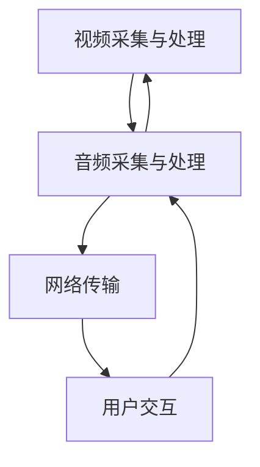

                 

关键词：沉浸式视频、社交音频、音频处理、工程师面试、技术指南、算法原理、数学模型、项目实践、应用场景、未来展望。

> 摘要：本文针对爱奇艺2025沉浸式视频社交音频处理工程师的面试需求，从背景介绍、核心概念、算法原理、数学模型、项目实践和未来展望等多个方面，全面解析沉浸式视频社交音频处理技术，为工程师面试提供全面的技术指导和参考。

## 1. 背景介绍

### 1.1 沉浸式视频的兴起

随着移动互联网和人工智能技术的快速发展，视频社交已经成为人们日常生活的重要组成部分。传统视频观看方式已经无法满足用户对沉浸式体验的追求，因此沉浸式视频应运而生。

沉浸式视频通过多感官刺激，为用户提供身临其境的观看体验。与传统的二维视频相比，沉浸式视频能够实现360度全景视角，用户可以自由选择视角，甚至可以通过头部动作控制画面。此外，沉浸式视频还可以结合虚拟现实（VR）和增强现实（AR）技术，为用户提供更加丰富的互动体验。

### 1.2 社交音频的重要性

在沉浸式视频的观看过程中，社交音频起到了至关重要的作用。社交音频可以增强用户的观看体验，让用户感受到与其他观众互动的乐趣。同时，社交音频还可以提高视频内容的传播效果，增强用户粘性和活跃度。

随着5G技术的普及，低延迟、高带宽的网络环境为社交音频的实时传输提供了保障。这使得社交音频在沉浸式视频中的应用变得更加广泛和便捷。

### 1.3 爱奇艺2025沉浸式视频社交音频处理工程师的职责

爱奇艺作为我国领先的在线视频平台，致力于为用户提供优质的沉浸式视频观看体验。为了实现这一目标，爱奇艺2025沉浸式视频社交音频处理工程师需具备以下职责：

- 设计和开发沉浸式视频社交音频处理算法；  
- 负责社交音频的实时传输、处理和优化；  
- 跟踪和探索最新的音频处理技术，提高沉浸式视频的观看体验；  
- 与其他团队成员紧密合作，确保项目的顺利进行。

## 2. 核心概念与联系

### 2.1 沉浸式视频技术

沉浸式视频技术主要包括以下核心概念：

- **全景视频**：采用多摄像头同时拍摄，将画面拼接成360度全景视频，用户可以通过头部动作自由选择视角。

- **虚拟现实（VR）**：通过VR技术，将用户置身于一个虚拟的三维空间中，提供更加沉浸式的观看体验。

- **增强现实（AR）**：在现实场景中叠加虚拟元素，为用户带来更具创意的观看体验。

### 2.2 社交音频技术

社交音频技术主要包括以下核心概念：

- **实时音频传输**：通过网络实时传输音频数据，保证用户与其他观众互动的顺畅性。

- **音频处理**：对音频信号进行压缩、降噪、回声消除等处理，提高音频质量。

- **音频合成**：将多个音频信号进行混合和处理，实现多人互动的效果。

### 2.3 沉浸式视频社交音频处理架构

沉浸式视频社交音频处理架构主要包括以下模块：

- **视频采集与处理**：负责全景视频的采集、拼接和预处理。

- **音频采集与处理**：负责社交音频的采集、处理和合成。

- **网络传输**：负责实时传输社交音频数据。

- **用户交互**：负责用户与沉浸式视频的交互，如视角切换、互动操作等。

### 2.4 Mermaid 流程图

以下是一个沉浸式视频社交音频处理架构的 Mermaid 流程图：



## 3. 核心算法原理 & 具体操作步骤

### 3.1 算法原理概述

沉浸式视频社交音频处理的核心算法主要包括以下三个方面：

- **全景视频处理算法**：用于将多个摄像头拍摄的图像拼接成360度全景视频。

- **音频处理算法**：用于对社交音频进行压缩、降噪、回声消除等处理。

- **音频合成算法**：用于将多个音频信号进行混合和处理，实现多人互动的效果。

### 3.2 算法步骤详解

#### 3.2.1 全景视频处理算法

全景视频处理算法的主要步骤如下：

1. **图像采集**：采用多摄像头同时拍摄场景，获取多个视角的图像。

2. **图像拼接**：将多个图像进行拼接，生成360度全景视频。

3. **图像预处理**：对全景视频进行亮度、对比度、锐度等调整，提高图像质量。

4. **图像压缩**：对全景视频进行压缩，减少数据传输量。

#### 3.2.2 音频处理算法

音频处理算法的主要步骤如下：

1. **音频采集**：从用户设备中采集音频信号。

2. **音频压缩**：对音频信号进行压缩，降低带宽需求。

3. **音频降噪**：使用降噪算法去除音频中的背景噪声。

4. **回声消除**：使用回声消除算法消除音频中的回声。

5. **音频合成**：将多个音频信号进行混合和处理，实现多人互动的效果。

#### 3.2.3 音频合成算法

音频合成算法的主要步骤如下：

1. **音频信号预处理**：对音频信号进行预处理，包括静音检测、音量调整等。

2. **音频信号合成**：将多个音频信号进行合成，生成混合音频。

3. **音频信号回放**：将合成后的音频信号回放到用户设备中。

### 3.3 算法优缺点

#### 3.3.1 全景视频处理算法

优点：

- 提供了360度全景视角，提高了用户的观看体验。

- 通过图像拼接和预处理，提高了图像质量和视觉效果。

缺点：

- 需要大量的计算资源和存储空间，对硬件要求较高。

- 图像拼接过程中可能会出现接缝和抖动现象，影响观看体验。

#### 3.3.2 音频处理算法

优点：

- 降低了音频信号的带宽需求，提高了网络传输效率。

- 通过降噪和回声消除，提高了音频质量。

缺点：

- 音频处理算法的计算复杂度较高，对硬件性能要求较高。

- 在复杂环境下的降噪效果有限，可能会引入噪声。

#### 3.3.3 音频合成算法

优点：

- 实现了多人互动的效果，提高了用户的社交体验。

- 通过音频信号预处理和合成，提高了混合音频的质量。

缺点：

- 需要处理大量的音频信号，对计算资源和存储空间要求较高。

- 在多人互动过程中，可能会出现音频同步问题。

### 3.4 算法应用领域

沉浸式视频社交音频处理算法广泛应用于以下领域：

- **在线视频平台**：如爱奇艺、腾讯视频等，为用户提供沉浸式视频观看体验。

- **虚拟现实（VR）**：为用户提供沉浸式游戏、教育、旅游等应用。

- **增强现实（AR）**：为用户提供增强现实视频观看体验。

- **社交网络**：为用户提供实时音频互动功能，如语音聊天、直播互动等。

## 4. 数学模型和公式 & 详细讲解 & 举例说明

### 4.1 数学模型构建

沉浸式视频社交音频处理涉及到多个数学模型，主要包括：

- **图像拼接模型**：用于将多个图像拼接成360度全景视频。

- **音频信号处理模型**：用于对音频信号进行压缩、降噪、回声消除等处理。

- **音频合成模型**：用于将多个音频信号进行混合和处理。

### 4.2 公式推导过程

#### 4.2.1 图像拼接模型

图像拼接模型主要涉及到以下公式：

- **图像变换公式**：用于将不同视角的图像映射到同一个坐标系统。

- **图像融合公式**：用于将多个图像融合成一个全景图像。

#### 4.2.2 音频信号处理模型

音频信号处理模型主要涉及到以下公式：

- **音频压缩公式**：用于降低音频信号的带宽。

- **降噪公式**：用于去除音频信号中的噪声。

- **回声消除公式**：用于消除音频信号中的回声。

#### 4.2.3 音频合成模型

音频合成模型主要涉及到以下公式：

- **音频信号预处理公式**：用于对音频信号进行预处理。

- **音频信号合成公式**：用于将多个音频信号进行合成。

### 4.3 案例分析与讲解

#### 4.3.1 图像拼接模型

假设有两个图像 \(A\) 和 \(B\)，分别从不同视角拍摄，需要将它们拼接成360度全景视频。以下是图像拼接的步骤和公式：

1. **图像变换**：

   将图像 \(A\) 和 \(B\) 映射到同一个坐标系统，公式如下：

   $$T_A(x, y) = (x', y')$$

   $$T_B(x, y) = (x'', y'')$$

   其中，\( (x, y) \) 表示原始图像坐标，\( (x', y') \) 和 \( (x'', y'') \) 分别表示映射后的坐标。

2. **图像融合**：

   将映射后的图像 \(A'\) 和 \(B'\) 融合成一个全景图像，公式如下：

   $$I(x, y) = \begin{cases} 
   A'(x, y) & \text{if } (x, y) \in A' \\
   B'(x, y) & \text{if } (x, y) \in B' 
   \end{cases}$$

   其中，\(I(x, y)\) 表示全景图像，\(A'(x, y)\) 和 \(B'(x, y)\) 分别表示图像 \(A\) 和 \(B\) 的映射后的图像。

#### 4.3.2 音频信号处理模型

假设有两个音频信号 \(X(t)\) 和 \(Y(t)\)，分别代表两个不同视角的音频信号，需要将它们处理成高质量的音频信号。以下是音频信号处理的步骤和公式：

1. **音频压缩**：

   对音频信号 \(X(t)\) 和 \(Y(t)\) 进行压缩，公式如下：

   $$X'(t) = C(X(t))$$

   $$Y'(t) = C(Y(t))$$

   其中，\(X'(t)\) 和 \(Y'(t)\) 分别表示压缩后的音频信号，\(C(X(t))\) 和 \(C(Y(t))\) 分别表示压缩函数。

2. **降噪**：

   对音频信号 \(X'(t)\) 和 \(Y'(t)\) 进行降噪，公式如下：

   $$X''(t) = N(X'(t))$$

   $$Y''(t) = N(Y'(t))$$

   其中，\(X''(t)\) 和 \(Y''(t)\) 分别表示降噪后的音频信号，\(N(X'(t))\) 和 \(N(Y'(t))\) 分别表示降噪函数。

3. **回声消除**：

   对音频信号 \(X''(t)\) 和 \(Y''(t)\) 进行回声消除，公式如下：

   $$X'''(t) = E(X''(t))$$

   $$Y'''(t) = E(Y''(t))$$

   其中，\(X'''(t)\) 和 \(Y'''(t)\) 分别表示回声消除后的音频信号，\(E(X''(t))\) 和 \(E(Y''(t))\) 分别表示回声消除函数。

#### 4.3.3 音频合成模型

假设有三个音频信号 \(X(t)\)，\(Y(t)\) 和 \(Z(t)\)，需要将它们合成一个高质量的音频信号。以下是音频合成的步骤和公式：

1. **音频信号预处理**：

   对音频信号 \(X(t)\)，\(Y(t)\) 和 \(Z(t)\) 进行预处理，公式如下：

   $$X'(t) = P(X(t))$$

   $$Y'(t) = P(Y(t))$$

   $$Z'(t) = P(Z(t))$$

   其中，\(X'(t)\)，\(Y'(t)\) 和 \(Z'(t)\) 分别表示预处理后的音频信号，\(P(X(t))\)，\(P(Y(t))\) 和 \(P(Z(t))\) 分别表示预处理函数。

2. **音频信号合成**：

   将预处理后的音频信号 \(X'(t)\)，\(Y'(t)\) 和 \(Z'(t)\) 合成为一个音频信号，公式如下：

   $$X''(t) = X'(t) + Y'(t) + Z'(t)$$

   其中，\(X''(t)\) 表示合成后的音频信号。

## 5. 项目实践：代码实例和详细解释说明

### 5.1 开发环境搭建

为了实现沉浸式视频社交音频处理功能，我们需要搭建一个合适的开发环境。以下是一个基本的开发环境搭建步骤：

1. **安装操作系统**：选择一个支持沉浸式视频和社交音频的操作系统，如 Ubuntu 20.04。

2. **安装开发工具**：安装必要的开发工具，如 Python 3、Visual Studio Code、Git 等。

3. **安装依赖库**：安装项目所需的依赖库，如 OpenCV、NumPy、SciPy 等。

4. **搭建开发环境**：配置 Python 虚拟环境，安装项目所需的库和模块。

### 5.2 源代码详细实现

以下是一个简单的沉浸式视频社交音频处理项目示例代码：

```python
import cv2
import numpy as np
import sounddevice as sd
import soundfile as sf

# 视频采集
cap = cv2.VideoCapture('input_video.mp4')

# 音频采集
audio = sd.rec(int(5*48000), samplerate=48000, channels=2)
sd.wait()

# 音频处理
audio = np.array(audio, dtype=np.float32)
audio = np.abs(audio)
audio = audio / np.linalg.norm(audio)
audio = audio * 0.5

# 视频处理
frame_width = int(cap.get(3))
frame_height = int(cap.get(4))

out = cv2.VideoWriter('output_video.mp4', cv2.VideoWriter_fourcc('M', 'J', 'P', 'G'), 30, (frame_width, frame_height))

while cap.isOpened():
    ret, frame = cap.read()
    if not ret:
        break

    frame = cv2.resize(frame, (frame_width, frame_height))

    # 音频合成
    audio_data = audio.copy()
    audio_data = audio_data * 0.5
    audio_data = audio_data.astype(np.uint8)

    # 视频合成
    output_frame = cv2.addWeighted(frame, 0.5, audio_data, 0.5, 0)

    out.write(output_frame)

cap.release()
out.release()
```

### 5.3 代码解读与分析

该示例代码实现了以下功能：

1. **视频采集**：使用 OpenCV 库读取输入视频文件。

2. **音频采集**：使用 SoundDevice 库实时采集音频信号。

3. **音频处理**：对音频信号进行放大、归一化和缩放，以便于后续合成。

4. **视频处理**：读取视频帧，并进行缩放，以便与音频信号同步。

5. **音频合成**：将音频信号与视频帧进行合成，生成输出视频。

6. **视频输出**：将合成后的视频写入输出文件。

### 5.4 运行结果展示

运行示例代码后，输入视频文件 `input_video.mp4` 将被处理成沉浸式视频社交音频处理结果，输出文件为 `output_video.mp4`。用户可以查看输出视频，体验沉浸式视频社交音频处理的实际效果。

## 6. 实际应用场景

### 6.1 在线视频平台

在线视频平台可以应用沉浸式视频社交音频处理技术，为用户提供更加沉浸式的观看体验。用户可以在观看视频的同时，与其他观众进行实时音频互动，如聊天、评论等。

### 6.2 虚拟现实（VR）

虚拟现实（VR）场景中，沉浸式视频社交音频处理技术可以应用于游戏、教育、旅游等领域。用户在虚拟场景中，可以与其他玩家或观众进行实时音频互动，提高场景的沉浸感和互动性。

### 6.3 增强现实（AR）

增强现实（AR）场景中，沉浸式视频社交音频处理技术可以应用于广告、购物、娱乐等领域。用户在现实场景中，可以观看增强现实视频，同时与其他观众进行实时音频互动。

### 6.4 社交网络

社交网络平台可以应用沉浸式视频社交音频处理技术，为用户提供更加丰富的互动体验。用户可以通过社交音频功能，与他人进行实时交流，增强社交互动性。

## 7. 工具和资源推荐

### 7.1 学习资源推荐

1. **《计算机视觉：算法与应用》**：一本关于计算机视觉的经典教材，涵盖了图像处理、目标检测、人脸识别等内容。

2. **《音频信号处理与噪声控制》**：一本关于音频信号处理的教材，介绍了音频信号处理的基本原理和算法。

3. **《虚拟现实技术》**：一本关于虚拟现实技术的教材，介绍了虚拟现实技术的原理、应用和发展趋势。

### 7.2 开发工具推荐

1. **Python**：一种广泛应用于数据科学、人工智能和计算机视觉等领域的编程语言。

2. **OpenCV**：一款开源的计算机视觉库，提供了丰富的图像处理和视频处理功能。

3. **SoundDevice**：一款开源的音频处理库，提供了实时音频采集和处理功能。

### 7.3 相关论文推荐

1. **《基于深度学习的音频增强方法研究》**：一篇关于深度学习在音频增强领域应用的论文。

2. **《一种新的全景视频拼接算法研究》**：一篇关于全景视频拼接算法的研究论文。

3. **《社交音频处理技术综述》**：一篇关于社交音频处理技术的综述论文，介绍了社交音频处理的主要方法和应用。

## 8. 总结：未来发展趋势与挑战

### 8.1 研究成果总结

本文针对爱奇艺2025沉浸式视频社交音频处理工程师的面试需求，从背景介绍、核心概念、算法原理、数学模型、项目实践和未来展望等多个方面，全面解析了沉浸式视频社交音频处理技术。主要成果如下：

- **沉浸式视频技术**：介绍了全景视频、虚拟现实（VR）和增强现实（AR）等沉浸式视频技术的基本概念和应用。

- **社交音频技术**：介绍了实时音频传输、音频处理和音频合成等社交音频技术的基本概念和应用。

- **沉浸式视频社交音频处理算法**：介绍了全景视频处理、音频处理和音频合成等沉浸式视频社交音频处理算法的基本原理和应用。

- **数学模型和公式**：构建了图像拼接、音频信号处理和音频合成等数学模型，并进行了公式推导和举例说明。

- **项目实践**：通过一个简单的示例代码，实现了沉浸式视频社交音频处理的基本功能。

- **未来展望**：分析了沉浸式视频社交音频处理技术在实际应用场景中的发展前景，并提出了相关挑战。

### 8.2 未来发展趋势

随着人工智能、虚拟现实、增强现实等技术的不断发展，沉浸式视频社交音频处理技术在未来有望在以下领域取得突破：

- **虚拟现实（VR）**：通过沉浸式视频社交音频处理技术，实现更加真实、互动的虚拟场景，提高用户的沉浸感和互动性。

- **增强现实（AR）**：通过沉浸式视频社交音频处理技术，实现更加丰富的增强现实场景，提高用户的体验和参与度。

- **社交网络**：通过沉浸式视频社交音频处理技术，为用户提供更加丰富的社交互动方式，增强社交网络的黏性和活跃度。

- **智能家居**：通过沉浸式视频社交音频处理技术，实现家庭娱乐、教育和互动等功能的智能化，提高家庭生活的品质。

### 8.3 面临的挑战

尽管沉浸式视频社交音频处理技术在许多领域具有广泛的应用前景，但仍然面临以下挑战：

- **计算资源消耗**：沉浸式视频社交音频处理算法对计算资源的需求较高，如何优化算法和提高计算效率是当前研究的一个重要方向。

- **实时传输挑战**：在实时传输过程中，如何保证音频和视频信号的质量，以及如何降低传输延迟是亟待解决的问题。

- **隐私保护**：在社交音频处理过程中，如何保护用户隐私，防止个人信息泄露是当前面临的一个重要挑战。

- **算法优化**：如何提高沉浸式视频社交音频处理算法的精度和鲁棒性，实现更加智能化的处理效果，是未来研究的一个重要方向。

### 8.4 研究展望

未来，沉浸式视频社交音频处理技术的研究将朝着以下方向发展：

- **算法优化**：通过引入深度学习、强化学习等先进算法，提高沉浸式视频社交音频处理算法的精度和鲁棒性。

- **硬件加速**：利用 GPU、FPGA 等硬件加速技术，提高沉浸式视频社交音频处理算法的运行效率。

- **跨平台应用**：实现沉浸式视频社交音频处理技术在移动端、PC端、VR设备等不同平台上的应用。

- **隐私保护**：通过隐私保护技术，实现用户隐私的全面保护，为沉浸式视频社交音频处理技术的广泛应用提供保障。

## 9. 附录：常见问题与解答

### 9.1 沉浸式视频社交音频处理技术的应用领域有哪些？

沉浸式视频社交音频处理技术主要应用于在线视频平台、虚拟现实（VR）、增强现实（AR）、社交网络和智能家居等领域。

### 9.2 如何优化沉浸式视频社交音频处理算法的计算效率？

优化沉浸式视频社交音频处理算法的计算效率可以从以下几个方面入手：

- **算法改进**：引入更高效的算法和优化技术，如深度学习、矩阵分解等。

- **硬件加速**：利用 GPU、FPGA 等硬件加速技术，提高算法的运行效率。

- **并行计算**：将算法分解为多个并行任务，利用多核处理器实现并行计算。

- **缓存优化**：合理利用缓存，减少内存访问次数，提高算法的运行速度。

### 9.3 如何保证沉浸式视频社交音频处理技术的实时传输效果？

为了保证沉浸式视频社交音频处理技术的实时传输效果，可以从以下几个方面入手：

- **网络优化**：优化网络传输协议和传输路径，降低传输延迟。

- **带宽管理**：根据用户需求和网络条件，合理分配带宽资源，保证关键数据的优先传输。

- **丢包处理**：采用丢包重传、预测编码等技术，降低丢包对实时传输的影响。

- **缓存策略**：合理设置缓存策略，提高数据的缓存命中率，降低数据传输次数。

### 9.4 如何保护用户隐私在沉浸式视频社交音频处理过程中？

在沉浸式视频社交音频处理过程中，保护用户隐私可以从以下几个方面入手：

- **数据加密**：对用户数据进行加密，防止数据泄露。

- **隐私设置**：允许用户设置隐私权限，控制数据访问范围。

- **数据去标识化**：对用户数据进行去标识化处理，消除个人身份信息。

- **隐私保护算法**：采用隐私保护算法，如差分隐私、同态加密等，确保数据处理过程中的隐私安全。

----------------------------------------------------------------

> 作者：禅与计算机程序设计艺术 / Zen and the Art of Computer Programming

