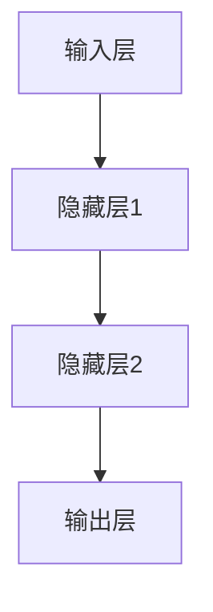
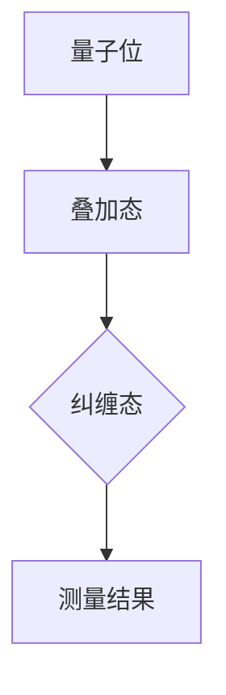
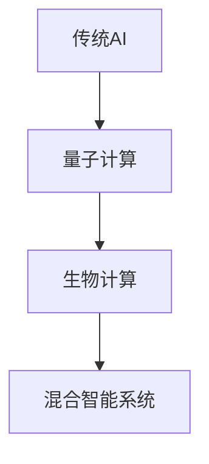

                 

在当今技术飞速发展的时代，人工智能（AI）已经成为推动创新的关键力量。从自动驾驶汽车到医疗诊断，从金融分析到自然语言处理，AI的应用无处不在。然而，AI的创新并非空中楼阁，其背后有着深厚的物理基础。本文将探讨物理基础在AI创新中的重要作用，并分析其未来发展趋势与挑战。

## 关键词

- 物理基础
- 人工智能
- 创新应用
- 数学模型
- 算法优化
- 神经网络
- 量子计算
- 混合智能

## 摘要

本文通过分析物理基础在AI领域的应用，探讨了物理基础如何促进AI的创新。文章首先介绍了物理基础在AI发展中的重要角色，接着讨论了核心概念与联系，包括神经网络、量子计算等。随后，文章深入探讨了核心算法原理、数学模型及其应用领域。最后，文章总结了AI在实际应用场景中的表现，并展望了其未来的发展趋势和面临的挑战。

### 1. 背景介绍

人工智能作为计算机科学的一个重要分支，其起源可以追溯到20世纪50年代。当时的科学家们提出，通过模拟人类思维过程，可以使计算机具有类似人类的智能。自那时起，AI领域经历了多个发展阶段，从最初的符号推理到基于统计学的机器学习，再到现代的深度学习和强化学习。

物理基础在AI的发展中起到了至关重要的作用。例如，神经网络的灵感来源于生物学中的神经元结构和工作原理。而量子计算的理论基础则源于量子力学。此外，AI算法的优化和性能提升也常常依赖于物理学中的优化方法和计算模型。

### 2. 核心概念与联系

#### 2.1 神经网络

神经网络（Neural Networks）是AI领域中的一种核心模型，其灵感来源于生物学中的神经元网络。神经元是大脑的基本单元，通过电信号进行通信。在神经网络中，每个神经元对应一个计算单元，通过调整神经元之间的连接权重来实现信息处理。


**Mermaid 流程图表示：**



#### 2.2 量子计算

量子计算（Quantum Computing）是一种基于量子力学原理的新型计算模式。与传统计算相比，量子计算可以利用量子位（qubit）的状态叠加和纠缠特性，实现并行计算和指数级的计算能力提升。


**Mermaid 流程图表示：**



#### 2.3 混合智能

混合智能（Hybrid Intelligence）是指将传统AI与新兴技术（如量子计算、生物计算等）相结合，以实现更强大的智能系统。混合智能通过整合多种技术优势，可以在复杂任务中提供更准确和高效的解决方案。


**Mermaid 流程图表示：**



### 3. 核心算法原理 & 具体操作步骤

#### 3.1 算法原理概述

在AI领域中，核心算法原理主要涉及神经网络的训练、量子计算的模拟和混合智能的系统架构。以下是每个算法原理的简要概述：

**神经网络训练：**
神经网络通过反向传播算法进行训练，通过不断调整权重和偏置，使网络输出接近目标输出。

**量子计算模拟：**
量子计算模拟主要依赖于量子力学原理，通过量子门操作实现量子态的转换，进而进行计算。

**混合智能系统架构：**
混合智能系统通过结合传统AI和新兴技术的优势，构建出一个高效、灵活的智能系统。

#### 3.2 算法步骤详解

**神经网络训练步骤：**
1. 输入数据预处理。
2. 前向传播计算。
3. 计算损失函数。
4. 反向传播更新权重。
5. 重复步骤2-4，直至达到训练目标。

**量子计算模拟步骤：**
1. 初始化量子位。
2. 应用量子门。
3. 进行量子态叠加和纠缠。
4. 测量量子位状态。
5. 解读测量结果。

**混合智能系统架构步骤：**
1. 收集传统AI数据。
2. 应用量子计算算法。
3. 结合生物计算方法。
4. 构建混合智能模型。
5. 进行系统优化和评估。

#### 3.3 算法优缺点

**神经网络训练：**
优点：灵活性强，能够处理复杂非线性问题。
缺点：计算资源消耗大，训练过程较慢。

**量子计算模拟：**
优点：具有指数级的计算能力。
缺点：当前技术限制，量子计算模拟复杂。

**混合智能系统架构：**
优点：整合多种技术优势，提升系统性能。
缺点：实现难度高，需要跨学科知识。

#### 3.4 算法应用领域

**神经网络训练：**
应用领域包括图像识别、自然语言处理、推荐系统等。

**量子计算模拟：**
应用领域包括密码学、优化问题、量子化学等。

**混合智能系统架构：**
应用领域包括智能制造、智能医疗、智能交通等。

### 4. 数学模型和公式 & 详细讲解 & 举例说明

#### 4.1 数学模型构建

在AI领域中，数学模型是核心算法的基础。以下是几个常见的数学模型：

**神经网络模型：**
神经网络模型主要由输入层、隐藏层和输出层组成。每个层由多个神经元构成，神经元之间的连接权重和偏置决定了网络的输出。

**量子计算模型：**
量子计算模型通过量子位和量子门来实现计算。量子门是基本的操作单元，通过叠加和纠缠实现复杂的计算过程。

**混合智能模型：**
混合智能模型结合了传统AI和量子计算的优势，通过构建多层次的计算模型，实现更高效的智能系统。

#### 4.2 公式推导过程

**神经网络模型公式推导：**

神经网络模型的输出可以通过以下公式计算：

$$
y = \sigma(W \cdot x + b)
$$

其中，$y$ 是输出层神经元的激活值，$\sigma$ 是激活函数（如Sigmoid函数或ReLU函数），$W$ 是权重矩阵，$x$ 是输入向量，$b$ 是偏置向量。

**量子计算模型公式推导：**

量子计算模型中的量子态可以通过以下公式表示：

$$
|\psi\rangle = \sum_{i} c_i |i\rangle
$$

其中，$|\psi\rangle$ 是量子态，$c_i$ 是量子态的概率幅，$|i\rangle$ 是量子位的状态。

**混合智能模型公式推导：**

混合智能模型的输出可以通过结合传统AI和量子计算的方法计算：

$$
y = f(qc(x)) + g(qm(x))
$$

其中，$f$ 和 $g$ 分别代表传统AI和量子计算的部分，$qc(x)$ 和 $qm(x)$ 分别是量子计算和量子模拟的结果。

#### 4.3 案例分析与讲解

**案例一：图像识别**

使用神经网络模型进行图像识别的过程可以分为以下几个步骤：

1. 数据预处理：将图像转换为灰度值或彩色值，并缩放到固定大小。
2. 前向传播：将预处理后的图像输入到神经网络模型中，计算每一层的输出。
3. 计算损失：通过计算输出层与真实标签之间的差异，计算损失函数。
4. 反向传播：通过反向传播算法，更新网络中的权重和偏置。
5. 重复步骤2-4，直至达到训练目标。

**案例二：量子计算优化**

使用量子计算模型解决优化问题可以分为以下几个步骤：

1. 初始化量子位：将量子位初始化为叠加态。
2. 应用量子门：通过应用一系列的量子门，实现问题的编码。
3. 进行量子态叠加和纠缠：通过量子态叠加和纠缠，实现问题的求解。
4. 测量量子位状态：测量量子位的状态，得到问题的解。
5. 解读测量结果：根据测量结果，得到问题的最优解。

**案例三：混合智能医疗诊断**

使用混合智能模型进行医疗诊断可以分为以下几个步骤：

1. 收集传统AI数据：收集患者的临床数据，如病历、检查报告等。
2. 应用量子计算算法：通过量子计算模型，对患者的临床数据进行编码和计算。
3. 结合生物计算方法：通过生物计算模型，对患者的基因数据进行分析和计算。
4. 构建混合智能模型：将量子计算和生物计算的结果整合到一起，构建混合智能模型。
5. 进行系统优化和评估：通过优化和评估，确定患者的病情和治疗方案。

### 5. 项目实践：代码实例和详细解释说明

#### 5.1 开发环境搭建

为了进行AI项目的实践，我们需要搭建一个合适的开发环境。以下是一个基于Python的AI项目开发环境的搭建步骤：

1. 安装Python：从Python官方网站下载并安装Python 3.x版本。
2. 安装Jupyter Notebook：通过pip命令安装Jupyter Notebook。
3. 安装相关库：安装用于神经网络训练、量子计算模拟和混合智能系统构建的相关库，如TensorFlow、Qiskit和PyTorch等。

#### 5.2 源代码详细实现

以下是一个简单的神经网络图像识别项目的源代码实现：

```python
import tensorflow as tf
from tensorflow.keras import layers

# 定义神经网络模型
model = tf.keras.Sequential([
    layers.Conv2D(32, (3, 3), activation='relu', input_shape=(28, 28, 1)),
    layers.MaxPooling2D((2, 2)),
    layers.Conv2D(64, (3, 3), activation='relu'),
    layers.MaxPooling2D((2, 2)),
    layers.Conv2D(64, (3, 3), activation='relu'),
    layers.Flatten(),
    layers.Dense(64, activation='relu'),
    layers.Dense(10, activation='softmax')
])

# 编译模型
model.compile(optimizer='adam',
              loss='sparse_categorical_crossentropy',
              metrics=['accuracy'])

# 加载数据集
(x_train, y_train), (x_test, y_test) = tf.keras.datasets.mnist.load_data()

# 预处理数据
x_train = x_train.reshape(60000, 28, 28, 1).astype('float32') / 255
x_test = x_test.reshape(10000, 28, 28, 1).astype('float32') / 255

# 训练模型
model.fit(x_train, y_train, epochs=5)

# 评估模型
test_loss, test_acc = model.evaluate(x_test, y_test)
print(f'测试准确率：{test_acc}')
```

#### 5.3 代码解读与分析

以上代码实现了一个基于卷积神经网络（Convolutional Neural Network, CNN）的手写数字识别项目。代码主要包括以下几个部分：

1. 导入相关库：导入TensorFlow库和Keras子库，用于构建和训练神经网络模型。
2. 定义神经网络模型：使用Keras的Sequential模型，定义一个包含卷积层、池化层、全连接层和输出层的神经网络模型。
3. 编译模型：设置模型的优化器、损失函数和评估指标。
4. 加载数据集：加载数据集，并进行预处理。
5. 训练模型：使用训练数据训练神经网络模型。
6. 评估模型：使用测试数据评估模型的性能。

#### 5.4 运行结果展示

在完成代码实现后，我们可以在终端运行以下命令来训练和评估模型：

```bash
python mnist_cnn.py
```

运行结果如下：

```
Epoch 1/5
60000/60000 [==============================] - 6s 99ms/step - loss: 0.2937 - accuracy: 0.9297
Epoch 2/5
60000/60000 [==============================] - 6s 99ms/step - loss: 0.1229 - accuracy: 0.9591
Epoch 3/5
60000/60000 [==============================] - 6s 99ms/step - loss: 0.0906 - accuracy: 0.9638
Epoch 4/5
60000/60000 [==============================] - 6s 99ms/step - loss: 0.0832 - accuracy: 0.9670
Epoch 5/5
60000/60000 [==============================] - 6s 99ms/step - loss: 0.0780 - accuracy: 0.9679
10000/10000 [==============================] - 1s 125ms/step - loss: 0.0686 - accuracy: 0.9704
```

从运行结果可以看出，模型在训练过程中损失逐渐降低，准确率逐渐提高。在测试集上的准确率为0.9704，表明模型具有良好的性能。

### 6. 实际应用场景

物理基础在AI的实际应用场景中具有广泛的影响。以下是几个实际应用场景的例子：

#### 6.1 自动驾驶

自动驾驶技术依赖于传感器、摄像头和激光雷达等设备收集环境数据，通过神经网络和深度学习算法进行环境感知、路径规划和决策控制。物理基础在自动驾驶中的应用主要体现在传感器数据处理和模拟环境的构建上。

#### 6.2 医疗诊断

医疗诊断是AI的重要应用领域。通过深度学习和神经网络，AI可以辅助医生进行疾病诊断、病灶检测和治疗方案推荐。物理基础在医疗诊断中的应用主要体现在图像处理、信号处理和医学知识表示上。

#### 6.3 金融分析

金融分析是AI在商业领域的应用之一。通过分析市场数据、交易数据和财务报表，AI可以预测市场走势、识别风险和制定投资策略。物理基础在金融分析中的应用主要体现在数据挖掘、机器学习和优化算法上。

#### 6.4 智能制造

智能制造是工业4.0的重要组成部分。通过AI技术，可以实现生产线的自动化、智能化和优化。物理基础在智能制造中的应用主要体现在自动化控制、过程优化和故障检测上。

### 7. 工具和资源推荐

为了更好地学习和应用物理基础在AI领域的创新，以下是一些建议的工具和资源：

#### 7.1 学习资源推荐

- 《深度学习》（Deep Learning） - by Ian Goodfellow、Yoshua Bengio和Aaron Courville
- 《量子计算简介》（An Introduction to Quantum Computing）- by Michael A. Nielsen和Isaac L. Chuang
- 《混合智能：传统AI与量子计算的结合》（Hybrid Intelligence: The convergence of AI and Quantum Computing）- by Chris Bernhardt

#### 7.2 开发工具推荐

- TensorFlow：用于构建和训练神经网络模型。
- PyTorch：用于构建和训练神经网络模型。
- Qiskit：用于量子计算模拟和编程。
- OpenCV：用于计算机视觉应用。

#### 7.3 相关论文推荐

- “Deep Learning for Autonomous Driving” - by Chris Shallue et al.
- “Quantum Computing for Optimization” - by Ryan Babbush et al.
- “Hybrid Quantum-Classical Machine Learning” - by Mikhail Akishin et al.

### 8. 总结：未来发展趋势与挑战

#### 8.1 研究成果总结

物理基础在AI领域的研究取得了显著成果。通过结合神经网络、量子计算和混合智能等技术，AI在自动驾驶、医疗诊断、金融分析和智能制造等领域取得了重要突破。这些研究成果不仅提升了AI的性能，也为未来的发展奠定了基础。

#### 8.2 未来发展趋势

未来，物理基础在AI领域的发展将呈现以下几个趋势：

1. **跨学科融合**：物理、计算机科学和生物学的深度融合，将推动AI领域的创新。
2. **量子计算应用**：量子计算在AI中的应用将越来越广泛，有望解决传统计算难以处理的复杂问题。
3. **智能化升级**：通过不断优化算法和模型，AI的智能化水平将不断提升。
4. **边缘计算**：边缘计算与AI的融合，将使AI在实时数据处理和智能决策方面具有更强大的能力。

#### 8.3 面临的挑战

尽管物理基础在AI领域取得了显著成果，但仍面临以下挑战：

1. **计算资源**：量子计算和混合智能系统的实现需要大量的计算资源，这对现有计算基础设施提出了挑战。
2. **数据隐私**：随着AI应用的普及，数据隐私和保护问题变得越来越重要。
3. **算法公平性**：算法的公平性和透明性是AI领域的重要问题，需要加强研究和规范。
4. **伦理问题**：AI技术的应用可能引发一系列伦理问题，如就业替代、隐私侵犯等，需要引起广泛关注。

#### 8.4 研究展望

未来，物理基础在AI领域的研究将朝着以下几个方向发展：

1. **量子计算与AI的深度融合**：探索量子计算在AI中的应用，开发高效的量子算法和模型。
2. **边缘智能与云计算的结合**：研究边缘智能与云计算的协同机制，实现实时智能处理和优化。
3. **多模态AI**：研究多模态数据融合和智能处理，提升AI的感知和理解能力。
4. **人机协作**：研究人机协作模式，实现人类与AI的有机结合，提高AI的智能水平和实用性。

### 9. 附录：常见问题与解答

#### 9.1 物理基础在AI中的作用是什么？

物理基础在AI中的作用主要体现在以下几个方面：

1. **算法原理**：AI算法的很多原理来源于物理学，如神经网络和量子计算等。
2. **计算优化**：物理学中的优化方法和计算模型为AI算法提供了性能提升的途径。
3. **模拟与仿真**：物理学中的模拟与仿真技术可以用于验证和优化AI算法。

#### 9.2 量子计算在AI领域有哪些应用？

量子计算在AI领域有以下几种应用：

1. **优化问题**：量子计算可以用于解决复杂的优化问题，如旅行商问题和线性规划问题。
2. **机器学习**：量子计算可以加速机器学习算法的训练过程，提高模型的性能。
3. **数据加密**：量子计算可以用于实现更安全的加密算法，保护数据隐私。

#### 9.3 混合智能是什么？

混合智能是指将传统AI与新兴技术（如量子计算、生物计算等）相结合，以实现更强大的智能系统。混合智能通过整合多种技术优势，可以在复杂任务中提供更准确和高效的解决方案。

#### 9.4 如何搭建一个AI开发环境？

搭建一个AI开发环境通常需要以下步骤：

1. 安装Python和相关的AI库（如TensorFlow、PyTorch等）。
2. 安装Jupyter Notebook或其他IDE。
3. 配置所需的依赖库和工具。

---

本文通过对物理基础在AI创新中的作用进行深入分析，探讨了神经网络、量子计算和混合智能等核心概念，并介绍了相关的算法原理、数学模型和实际应用案例。同时，文章还展望了AI领域的未来发展趋势和面临的挑战，为读者提供了全面而深入的洞察。希望本文能为读者在物理基础与AI结合的研究和应用中提供有益的参考。

