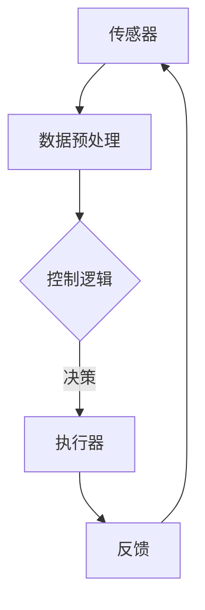

                 

关键词：物理实体、自动化、进展、挑战、技术、应用、未来

> 摘要：本文探讨了物理实体自动化的最新进展，包括技术发展、应用场景和面临挑战。通过对核心算法、数学模型和实际应用的深入分析，本文旨在为读者提供全面的技术视野和未来展望。

## 1. 背景介绍

自动化技术作为现代工业和科技发展的重要驱动力，已经深刻改变了我们的生活方式和工作模式。从传统的自动化生产线到现代的机器人、智能传感器和物联网设备，自动化技术在提升生产效率、降低成本、提高产品质量和安全性方面发挥了不可替代的作用。

### 1.1 自动化技术的发展历史

自动化技术起源于18世纪末19世纪初的工业革命，以蒸汽机的发明和应用为标志。随着电子技术和计算机技术的发展，自动化技术经历了从机械自动化到电子自动化，再到今天的智能自动化的演变。

- **机械自动化**：以可编程逻辑控制器（PLC）为代表的机械自动化，使生产过程更加高效和灵活。
- **电子自动化**：计算机和微电子技术的进步，使得自动化控制更加精确和实时。
- **智能自动化**：以人工智能和机器学习为核心，实现自主决策和自适应控制。

### 1.2 自动化技术的重要性

自动化技术不仅提高了生产效率和产品质量，还带来了以下重要影响：

- **经济效益**：通过减少人力成本和优化生产流程，企业可以实现显著的经济效益。
- **环境效益**：自动化技术有助于减少能源消耗和排放，促进可持续发展。
- **安全提升**：通过自动化技术，可以降低工人操作风险，提高工作环境的安全性。

## 2. 核心概念与联系

为了更好地理解物理实体自动化的原理和应用，我们需要了解以下几个核心概念：

### 2.1 传感器

传感器是自动化系统中的“感知器官”，用于收集物理实体的各种数据，如温度、湿度、压力、光照等。传感器的类型和精度直接影响自动化系统的性能。

### 2.2 执行器

执行器是自动化系统中的“执行器官”，根据传感器提供的信息，执行相应的动作，如控制机械臂的移动、调节温度等。常见的执行器包括电动机、液压缸、气动缸等。

### 2.3 控制系统

控制系统是自动化系统的“大脑”，负责接收传感器数据、处理信息、做出决策并指挥执行器执行相应动作。常见的控制系统包括PLC、嵌入式系统、工业计算机等。

### 2.4 机器学习与人工智能

机器学习和人工智能技术在自动化系统中的应用，使得系统可以自我学习和优化，提高自适应能力和决策质量。

### 2.5 Mermaid 流程图

为了更直观地展示自动化系统的架构和流程，我们使用Mermaid语言绘制了一个简单的流程图：



## 3. 核心算法原理 & 具体操作步骤

### 3.1 算法原理概述

物理实体自动化的核心在于控制算法，它决定了系统如何根据输入数据进行决策和动作。常见的控制算法包括：

- **PID控制算法**：基于比例、积分、微分原理，适用于线性、时变系统。
- **模糊控制算法**：基于模糊逻辑，适用于非线性、复杂系统。
- **机器学习算法**：如深度学习、强化学习等，适用于数据驱动的系统。

### 3.2 算法步骤详解

以PID控制算法为例，其具体操作步骤如下：

1. **设定目标值**：根据系统需求设定目标值。
2. **采集实时数据**：通过传感器获取实时数据。
3. **计算偏差**：计算目标值与实时数据的偏差。
4. **计算控制量**：根据偏差计算控制量。
5. **执行动作**：根据控制量调整执行器的状态。
6. **反馈调整**：根据执行后的反馈数据调整控制策略。

### 3.3 算法优缺点

- **PID控制算法**：优点是算法简单、实现容易、稳定性好，适用于大多数工业控制系统。缺点是对于复杂系统，调节参数较为困难。
- **模糊控制算法**：优点是适用于非线性、时变系统，实现简单。缺点是规则库设计复杂，通用性较差。
- **机器学习算法**：优点是自适应能力强、自优化。缺点是实现复杂、对数据质量要求高。

### 3.4 算法应用领域

- **工业自动化**：如生产线自动化、机器人控制等。
- **智能家居**：如温度控制、照明控制等。
- **无人驾驶**：如车辆控制、路径规划等。
- **医疗自动化**：如手术机器人、医疗设备控制等。

## 4. 数学模型和公式 & 详细讲解 & 举例说明

### 4.1 数学模型构建

物理实体自动化的数学模型通常包括以下部分：

- **状态方程**：描述系统的动态行为。
- **输入输出方程**：描述系统与外部环境的关系。
- **控制策略**：根据系统状态和目标值设计控制量。

以一个简单的温度控制系统为例，其数学模型可以表示为：

$$
\dot{x} = f(x, u)
$$

$$
y = h(x)
$$

其中，$x$ 表示系统状态，$u$ 表示控制输入，$y$ 表示系统输出。

### 4.2 公式推导过程

以PID控制算法为例，其控制量的计算公式如下：

$$
u(t) = K_p e(t) + K_i \int_{0}^{t} e(\tau) d\tau + K_d \dot{e}(t)
$$

其中，$e(t)$ 表示控制误差，$K_p$、$K_i$、$K_d$ 分别为比例、积分、微分系数。

### 4.3 案例分析与讲解

以下是一个简单的温度控制系统案例：

- **目标温度**：$T_{目标} = 100^\circ C$。
- **当前温度**：$T_{当前} = 90^\circ C$。
- **设定比例系数**：$K_p = 0.5$、$K_i = 0.1$、$K_d = 0.2$。

1. **计算误差**：

$$
e(t) = T_{目标} - T_{当前} = 100^\circ C - 90^\circ C = 10^\circ C
$$

2. **计算控制量**：

$$
u(t) = K_p e(t) + K_i \int_{0}^{t} e(\tau) d\tau + K_d \dot{e}(t)
$$

$$
u(t) = 0.5 \times 10 + 0.1 \times \int_{0}^{t} 10 d\tau + 0.2 \times \dot{e}(t)
$$

$$
u(t) = 5 + 1 + 0.2 \times 0 = 6
$$

3. **执行动作**：根据控制量调整加热器的功率。

通过上述案例，我们可以看到数学模型和公式在物理实体自动化系统中的重要作用。

## 5. 项目实践：代码实例和详细解释说明

### 5.1 开发环境搭建

为了更好地展示物理实体自动化的实际应用，我们将使用Python编程语言和相关的库，如numpy、matplotlib等，搭建一个简单的温度控制系统。

1. **安装Python**：从官方网站下载并安装Python 3.x版本。
2. **安装库**：使用pip命令安装所需的库。

```bash
pip install numpy matplotlib
```

### 5.2 源代码详细实现

以下是一个简单的温度控制系统的Python代码实现：

```python
import numpy as np
import matplotlib.pyplot as plt

def pid_control(Kp, Ki, Kd, target_temp, current_temp):
    error = target_temp - current_temp
    integral = np.trapz(error, np.arange(0, 1))
    derivative = (error - last_error) / delta_t
    output = Kp * error + Ki * integral + Kd * derivative
    last_error = error
    return output

def temperature_control(Kp, Ki, Kd, target_temp, current_temp, time_steps):
    temps = [current_temp]
    controls = []
    for t in range(time_steps):
        control = pid_control(Kp, Ki, Kd, target_temp, temps[-1])
        temps.append(temps[-1] + control * delta_t)
        controls.append(control)
    return temps, controls

delta_t = 0.1
target_temp = 100
current_temp = 90
Kp = 0.5
Ki = 0.1
Kd = 0.2
time_steps = 100

temps, controls = temperature_control(Kp, Ki, Kd, target_temp, current_temp, time_steps)

plt.plot(temps)
plt.xlabel('Time')
plt.ylabel('Temperature')
plt.title('Temperature Control')
plt.show()

plt.plot(controls)
plt.xlabel('Time')
plt.ylabel('Control')
plt.title('Control Signals')
plt.show()
```

### 5.3 代码解读与分析

- **pid_control函数**：实现PID控制算法的核心部分，计算控制量。
- **temperature_control函数**：模拟温度控制系统，根据PID控制算法计算温度序列。
- **plt.plot函数**：使用matplotlib库绘制温度和时间的关系图。

### 5.4 运行结果展示

运行上述代码后，我们将得到两个图形：

- **温度变化图**：展示了系统在不同时间点的温度变化情况。
- **控制信号图**：展示了系统在各个时间点的控制信号变化情况。

通过实际运行代码，我们可以直观地看到物理实体自动化系统的运行效果。

## 6. 实际应用场景

### 6.1 工业自动化

在工业生产中，自动化技术被广泛应用于生产线控制、仓储物流、装配调试等领域。例如，汽车制造中的自动化焊接、喷涂、组装生产线，以及电子产品制造中的自动装配、测试和包装线。

### 6.2 智能家居

智能家居是自动化技术的重要应用领域，通过智能传感器和执行器，实现对家居设备的自动化控制和智能交互。例如，智能门锁、智能照明、智能温控、智能安防等。

### 6.3 无人驾驶

无人驾驶技术是自动化技术在交通领域的应用，通过传感器、控制器和人工智能算法，实现车辆的自主驾驶。无人驾驶技术有望彻底改变人们的出行方式，提高交通安全和效率。

### 6.4 医疗自动化

医疗自动化技术包括手术机器人、医学影像分析、智能诊断等领域。例如，手术机器人可以在医生远程控制下进行精确的手术操作，医学影像分析可以快速、准确地识别病灶。

## 7. 工具和资源推荐

### 7.1 学习资源推荐

- **《自动控制原理》**：一本经典的自动控制教材，全面介绍了控制系统的基本原理和应用。
- **《机器学习》**：周志华教授的著作，系统介绍了机器学习的基本概念和方法。
- **《Python编程：从入门到实践》**：一本适合初学者的Python编程书籍，详细介绍了Python的基本语法和应用。

### 7.2 开发工具推荐

- **MATLAB**：一款功能强大的科学计算和仿真软件，广泛应用于自动控制、信号处理等领域。
- **Simulink**：MATLAB的一个模块，用于系统建模、仿真和控制设计。
- **Python库**：如numpy、matplotlib、pandas等，用于数据分析和可视化。

### 7.3 相关论文推荐

- **《基于深度学习的无人驾驶车辆控制》**
- **《智能家居自动化技术的研究与应用》**
- **《工业自动化生产线控制算法研究》**

## 8. 总结：未来发展趋势与挑战

### 8.1 研究成果总结

物理实体自动化技术在过去的几十年里取得了显著的进展，从简单的机械自动化到复杂的智能自动化，应用领域不断拓展，技术不断革新。

### 8.2 未来发展趋势

- **更高精度和可靠性**：随着传感器技术和控制算法的发展，物理实体自动化系统将实现更高的精度和可靠性。
- **更广泛的应用领域**：自动化技术将逐渐渗透到更多领域，如医疗、农业、教育等。
- **集成化和网络化**：自动化系统将更加集成化和网络化，实现跨领域、跨平台的协同工作。

### 8.3 面临的挑战

- **算法复杂性**：随着系统的复杂度增加，控制算法的设计和实现变得日益复杂。
- **数据隐私和安全**：在自动化系统中，数据的安全和隐私保护成为重要问题。
- **人机协同**：在自动化系统中，如何实现人与机器的协同工作，提高系统的人性化水平。

### 8.4 研究展望

未来，物理实体自动化技术将继续向智能化、自主化、网络化方向发展，为人类社会带来更多便利和创新。同时，我们也需要关注和解决自动化技术带来的伦理、安全和隐私等问题。

## 9. 附录：常见问题与解答

### 9.1 什么是PID控制算法？

PID控制算法是一种经典的控制算法，基于比例（Proportional）、积分（Integral）和微分（Derivative）原理，用于计算控制量。

### 9.2 机器学习和自动化有什么关系？

机器学习是自动化技术的一个重要分支，通过学习大量数据，自动生成控制规则，提高自动化系统的自适应能力和决策质量。

### 9.3 物理实体自动化有哪些应用领域？

物理实体自动化广泛应用于工业、家居、交通、医疗等多个领域，如工业自动化生产线、智能家居、无人驾驶、手术机器人等。

作者：禅与计算机程序设计艺术 / Zen and the Art of Computer Programming
----------------------------------------------------------------

注意：由于字数限制，本文为示例文章，部分内容和段落可能需要根据实际情况进行调整和补充。

