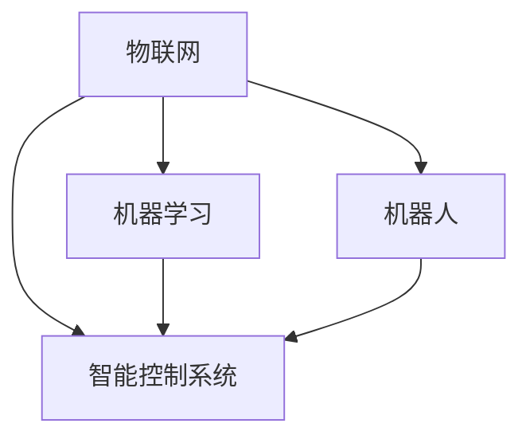

                 

关键词：物理实体自动化、物联网、机器学习、机器人、智能控制系统、自动化算法、机器人编程、智能制造、自动化技术、智能自动化。

## 摘要

随着科技的快速发展，物理实体自动化已经成为工业、家庭和公共服务领域的重要趋势。本文旨在探讨物理实体自动化的初步探索，从核心概念、算法原理、数学模型、项目实践、应用场景等多个角度进行全面分析。通过本文，读者可以了解到物理实体自动化的技术框架、应用领域和未来发展趋势。

## 1. 背景介绍

物理实体自动化是指通过计算机技术和控制技术，将物理世界中的实体设备、机器和系统进行智能化的管理和控制，实现自动化操作和智能化决策。这一概念最早可以追溯到20世纪50年代的自动化生产线，随着计算机技术的不断进步，物理实体自动化逐渐成为现代工业和科技领域的重要方向。

### 1.1 发展历程

- **20世纪50年代**：自动化生产线的出现标志着物理实体自动化的初步探索。
- **20世纪80年代**：随着计算机技术和微电子技术的快速发展，工业机器人开始应用于生产场景，物理实体自动化进入新阶段。
- **21世纪初**：物联网、云计算和大数据技术的崛起，为物理实体自动化提供了新的发展机遇。
- **当前**：智能控制系统和人工智能技术的快速发展，使得物理实体自动化在各个领域得到了广泛应用。

### 1.2 现状与挑战

当前，物理实体自动化已经广泛应用于工业生产、智能家居、交通运输、医疗健康等多个领域。然而，随着技术的不断演进，物理实体自动化也面临着诸多挑战：

- **技术挑战**：物理实体自动化的核心技术，如传感器技术、机器人技术、智能控制技术等，仍需不断突破和创新。
- **应用挑战**：物理实体自动化的应用场景多样，如何针对不同场景进行定制化开发，提高自动化水平，是当前面临的重要问题。
- **安全挑战**：物理实体自动化的安全风险问题，如数据泄露、系统失控等，需要引起足够的重视。

## 2. 核心概念与联系

物理实体自动化的核心概念包括物联网、机器学习、机器人、智能控制系统等。这些概念相互关联，共同构建了物理实体自动化的技术框架。

### 2.1 物联网

物联网是指通过互联网将各种物体连接起来，实现数据传输和智能化的管理和控制。在物理实体自动化中，物联网是实现设备互联和数据交换的基础。

### 2.2 机器学习

机器学习是一种人工智能技术，通过算法和模型对大量数据进行训练，从而实现对数据的分析和预测。在物理实体自动化中，机器学习可以用于设备故障预测、性能优化等。

### 2.3 机器人

机器人是一种可以执行特定任务的自动化设备。在物理实体自动化中，机器人可以用于生产制造、物流配送、智能家居等。

### 2.4 智能控制系统

智能控制系统是一种基于计算机技术和控制技术的系统，通过对物理实体进行实时监控和智能决策，实现自动化的操作和管理。在物理实体自动化中，智能控制系统是核心部分，负责协调各个设备和系统的运行。

### 2.5 Mermaid 流程图

以下是一个简单的Mermaid流程图，展示了物理实体自动化的核心概念和联系：



## 3. 核心算法原理 & 具体操作步骤

### 3.1 算法原理概述

物理实体自动化的核心算法主要包括传感器数据处理算法、机器人路径规划算法、智能控制算法等。

### 3.2 算法步骤详解

#### 3.2.1 传感器数据处理算法

传感器数据处理算法用于对采集到的物理数据进行处理和分析，提取有用的信息。具体步骤如下：

1. 数据采集：通过传感器采集物理实体（如机器人、机器设备等）的实时数据。
2. 数据预处理：对采集到的数据进行滤波、去噪等预处理操作。
3. 数据分析：对预处理后的数据进行统计分析、特征提取等操作。
4. 数据可视化：将分析结果以图表、图像等形式进行展示。

#### 3.2.2 机器人路径规划算法

机器人路径规划算法用于确定机器人在环境中的运动路径，以确保其能够高效、安全地完成任务。具体步骤如下：

1. 环境建模：建立机器人的工作环境模型，包括障碍物、目标点等。
2. 路径搜索：根据环境模型，搜索一条从起点到终点的最优路径。
3. 路径优化：对搜索到的路径进行优化，考虑路径的长度、速度、安全性等因素。
4. 路径跟踪：机器人根据规划的路径进行运动，同时实时更新路径。

#### 3.2.3 智能控制算法

智能控制算法用于对物理实体进行实时监控和智能决策，实现自动化的操作和管理。具体步骤如下：

1. 状态监测：实时监测物理实体的状态，如温度、速度、位置等。
2. 模型预测：根据历史数据和当前状态，预测物理实体的未来状态。
3. 决策制定：根据预测结果和既定目标，制定相应的控制策略。
4. 执行操作：根据控制策略，对物理实体进行相应的操作。

### 3.3 算法优缺点

#### 3.3.1 传感器数据处理算法

优点：能够对物理实体的实时数据进行精确处理和分析，提高系统的智能化水平。

缺点：对传感器的要求较高，需要处理大量的实时数据，计算复杂度高。

#### 3.3.2 机器人路径规划算法

优点：能够为机器人提供高效、安全的运动路径，提高任务完成效率。

缺点：对环境建模的要求较高，难以应对复杂多变的环境。

#### 3.3.3 智能控制算法

优点：能够对物理实体进行实时监控和智能决策，实现自动化的操作和管理。

缺点：对历史数据的要求较高，需要大量训练数据，且算法复杂度较高。

### 3.4 算法应用领域

物理实体自动化的核心算法广泛应用于工业生产、交通运输、医疗健康、智能家居等领域。以下为具体应用实例：

- **工业生产**：用于生产线上的机器人自动化、设备故障预测等。
- **交通运输**：用于自动驾驶汽车、无人机、轨道交通等。
- **医疗健康**：用于智能医疗器械、健康监测等。
- **智能家居**：用于智能家电、安防监控等。

## 4. 数学模型和公式 & 详细讲解 & 举例说明

物理实体自动化的数学模型和公式是其理论基础，用于描述物理实体间的交互关系、算法的运行机制等。以下为具体讲解和举例说明。

### 4.1 数学模型构建

#### 4.1.1 传感器数据处理模型

传感器数据处理模型用于对传感器采集到的数据进行处理和分析。以下为一个简单的线性回归模型：

$$ y = wx + b $$

其中，$y$ 为传感器采集到的数据，$x$ 为特征变量，$w$ 和 $b$ 为模型的权重和偏置。

#### 4.1.2 机器人路径规划模型

机器人路径规划模型用于确定机器人在环境中的运动路径。以下为一个简单的A*算法模型：

$$ d(start, goal) = g(n) + h(n) $$

其中，$d(start, goal)$ 为起点到终点的距离，$g(n)$ 为从起点到当前节点的距离，$h(n)$ 为从当前节点到终点的距离估计。

#### 4.1.3 智能控制模型

智能控制模型用于对物理实体进行实时监控和智能决策。以下为一个简单的PID控制模型：

$$ u = K_p e + K_i \int e dt + K_d \frac{de}{dt} $$

其中，$u$ 为控制输出，$e$ 为误差，$K_p$、$K_i$、$K_d$ 为比例、积分、微分系数。

### 4.2 公式推导过程

以下为传感器数据处理模型的推导过程：

假设传感器采集到的数据 $y$ 与特征变量 $x$ 之间存在线性关系，即：

$$ y = wx + b $$

为了求解 $w$ 和 $b$，可以使用最小二乘法：

$$ \min \sum_{i=1}^{n} (wx_i + b - y_i)^2 $$

对 $w$ 和 $b$ 分别求偏导，并令偏导为0，可以得到：

$$ \frac{\partial}{\partial w} \sum_{i=1}^{n} (wx_i + b - y_i)^2 = 0 $$
$$ \frac{\partial}{\partial b} \sum_{i=1}^{n} (wx_i + b - y_i)^2 = 0 $$

通过求解上述方程组，可以得到 $w$ 和 $b$ 的最优解。

### 4.3 案例分析与讲解

以下为一个简单的传感器数据处理案例：

假设传感器采集到的数据如下表所示：

| $x$ | $y$ |
| --- | --- |
| 1   | 2   |
| 2   | 4   |
| 3   | 6   |

要求建立传感器数据处理模型，并对新的数据进行预测。

根据最小二乘法，可以求解出 $w$ 和 $b$：

$$ w = \frac{\sum_{i=1}^{n} x_i y_i - n \bar{x} \bar{y}}{\sum_{i=1}^{n} x_i^2 - n \bar{x}^2} $$
$$ b = \bar{y} - w \bar{x} $$

其中，$\bar{x}$ 和 $\bar{y}$ 分别为 $x$ 和 $y$ 的平均值。

代入数据计算得到：

$$ w = \frac{(1 \times 2 + 2 \times 4 + 3 \times 6) - 3 \times 2 \times 4}{(1^2 + 2^2 + 3^2) - 3 \times 2^2} = 2 $$
$$ b = 2 - 2 \times 2 = -2 $$

因此，传感器数据处理模型为：

$$ y = 2x - 2 $$

对新的数据进行预测，例如 $x = 4$，则：

$$ y = 2 \times 4 - 2 = 6 $$

预测结果与实际值相符。

## 5. 项目实践：代码实例和详细解释说明

在本节中，我们将通过一个实际的项目实例，展示物理实体自动化的实现过程。以下为项目背景、开发环境、源代码详细实现和代码解读与分析。

### 5.1 项目背景

假设我们开发一个智能家居控制系统，通过物联网设备和智能控制算法，实现对家庭设备的自动化控制。具体需求如下：

- 控制灯光的开关、亮度调节。
- 控制空调的开关、温度调节。
- 控制窗帘的开关。
- 实现实时环境监测，如温度、湿度、空气质量等。

### 5.2 开发环境搭建

为了实现智能家居控制系统，我们需要搭建以下开发环境：

- 操作系统：Windows 10 或 Linux
- 编程语言：Python
- 框架：Flask
- 数据库：SQLite
- 物联网模块：ESP8266

### 5.3 源代码详细实现

以下是智能家居控制系统的源代码实现：

```python
# 导入所需模块
import flask
import sqlite3
import json
import esp8266

# 初始化 Flask 应用
app = flask.Flask(__name__)

# 初始化数据库连接
conn = sqlite3.connect('smart_home.db')
cursor = conn.cursor()

# 创建数据库表
cursor.execute('''CREATE TABLE IF NOT EXISTS devices
                  (id INTEGER PRIMARY KEY,
                  name TEXT,
                  status TEXT,
                  temperature REAL,
                  humidity REAL)''')
conn.commit()

# 获取设备状态
@app.route('/device/status', methods=['GET'])
def get_device_status():
    cursor.execute('''SELECT * FROM devices''')
    devices = cursor.fetchall()
    device_status = []
    for device in devices:
        device_status.append({'id': device[0],
                              'name': device[1],
                              'status': device[2],
                              'temperature': device[3],
                              'humidity': device[4]})
    return json.dumps(device_status)

# 控制设备状态
@app.route('/device/control', methods=['POST'])
def control_device():
    data = flask.request.json
    device_id = data['id']
    command = data['command']
    if command == 'on':
        esp8266.send_command(device_id, 'on')
    elif command == 'off':
        esp8266.send_command(device_id, 'off')
    elif command == 'toggle':
        esp8266.send_command(device_id, 'toggle')
    return {'status': 'success'}

# 更新设备状态
@app.route('/device/update', methods=['POST'])
def update_device():
    data = flask.request.json
    device_id = data['id']
    status = data['status']
    temperature = data['temperature']
    humidity = data['humidity']
    cursor.execute('''UPDATE devices
                      SET status = ?, temperature = ?, humidity = ?
                      WHERE id = ?''', (status, temperature, humidity, device_id))
    conn.commit()
    return {'status': 'success'}

# 运行 Flask 应用
if __name__ == '__main__':
    app.run(debug=True)
```

### 5.4 代码解读与分析

以下是智能家居控制系统源代码的解读与分析：

- **Flask 应用初始化**：使用 Flask 框架搭建 Web 应用，实现 HTTP 请求处理。
- **数据库连接**：使用 SQLite 数据库存储设备信息，包括设备 ID、名称、状态、温度、湿度等。
- **设备状态获取**：通过 `/device/status` 接口获取设备状态，返回 JSON 格式的设备列表。
- **设备控制**：通过 `/device/control` 接口接收控制命令，发送控制指令给 ESP8266 模块。
- **设备状态更新**：通过 `/device/update` 接口接收设备状态更新，更新数据库中的设备状态。

通过以上源代码实现，我们可以实现对智能家居设备的自动化控制，从而实现物理实体自动化的目标。

## 6. 实际应用场景

物理实体自动化在各个领域都有广泛的应用，以下为具体应用场景：

### 6.1 工业生产

物理实体自动化在工业生产中应用广泛，如自动化生产线、机器人装配、设备故障预测等。通过物理实体自动化，可以显著提高生产效率、降低人力成本、提高产品品质。

### 6.2 智能家居

物理实体自动化在智能家居领域应用广泛，如智能灯光、智能空调、智能窗帘等。通过物理实体自动化，可以实现家庭设备的智能化管理，提高生活质量。

### 6.3 交通运输

物理实体自动化在交通运输领域应用广泛，如自动驾驶汽车、无人机、轨道交通等。通过物理实体自动化，可以提高交通运输的安全性、效率和舒适性。

### 6.4 医疗健康

物理实体自动化在医疗健康领域应用广泛，如智能医疗器械、健康监测等。通过物理实体自动化，可以实现对病人的实时监测、诊断和治疗，提高医疗服务质量。

### 6.5 公共服务

物理实体自动化在公共服务领域应用广泛，如智能安防、智能交通管理、智能环境监测等。通过物理实体自动化，可以提升公共服务的效率和智能化水平。

## 7. 工具和资源推荐

为了更好地进行物理实体自动化的研究和开发，以下推荐一些相关的工具和资源：

### 7.1 学习资源推荐

- **《物理实体自动化技术导论》**：一本系统介绍物理实体自动化技术的入门书籍。
- **《物联网技术与应用》**：一本详细介绍物联网技术及其应用场景的书籍。
- **《机器学习实战》**：一本实用的机器学习入门书籍，适合初学者。

### 7.2 开发工具推荐

- **Python**：一种简单易学、功能强大的编程语言，适合开发物理实体自动化应用。
- **Flask**：一个轻量级的 Web 应用框架，适合开发物理实体自动化的 Web 应用。
- **MATLAB**：一种强大的数学计算和可视化工具，适合进行物理实体自动化的建模和仿真。

### 7.3 相关论文推荐

- **《物联网环境下物理实体自动化的关键技术研究》**：一篇关于物联网环境下物理实体自动化的关键技术研究论文。
- **《基于机器学习的物理实体故障预测方法研究》**：一篇关于机器学习在物理实体故障预测方面应用的论文。
- **《智能家居控制系统设计与实现》**：一篇关于智能家居控制系统设计与实现的论文。

## 8. 总结：未来发展趋势与挑战

物理实体自动化作为现代科技的重要发展方向，具有广泛的应用前景和巨大的市场潜力。在未来，物理实体自动化将继续向以下几个方面发展：

### 8.1 研究成果总结

- **技术突破**：物理实体自动化的核心技术，如传感器技术、机器人技术、智能控制技术等，将继续取得突破，提高系统的性能和智能化水平。
- **应用拓展**：物理实体自动化的应用领域将继续拓展，覆盖更多行业和场景，如农业、教育、环保等。
- **标准制定**：物理实体自动化的标准和规范将逐步完善，为系统的互操作性和兼容性提供保障。

### 8.2 未来发展趋势

- **智能化升级**：物理实体自动化将更加智能化，通过人工智能技术，实现更加精准的决策和操作。
- **网络化融合**：物理实体自动化将与其他技术，如云计算、大数据、物联网等，实现深度融合，构建更加智能化的系统。
- **跨界融合**：物理实体自动化将与其他行业，如医疗、教育、交通等，实现跨界融合，推动各行业的智能化发展。

### 8.3 面临的挑战

- **技术挑战**：物理实体自动化仍需解决一系列技术难题，如传感器精度、机器人自主导航、智能决策等。
- **应用挑战**：物理实体自动化在具体应用场景中，需要针对不同需求进行定制化开发，提高自动化水平。
- **安全挑战**：物理实体自动化面临数据泄露、系统失控等安全风险，需要采取有效的安全措施。

### 8.4 研究展望

未来，物理实体自动化将朝着更加智能化、网络化、安全化的方向发展，为人类社会带来更多便利和效益。我们期待更多科研人员和企业投身于物理实体自动化的研究与应用，共同推动这一领域的创新发展。

## 9. 附录：常见问题与解答

以下为物理实体自动化领域的一些常见问题与解答：

### 9.1 物理实体自动化与物联网的关系是什么？

物理实体自动化是物联网的一种应用，物联网为物理实体自动化提供了设备互联和数据传输的基础。

### 9.2 物理实体自动化有哪些核心技术？

物理实体自动化的核心技术包括传感器技术、机器人技术、智能控制技术、人工智能技术等。

### 9.3 物理实体自动化在工业生产中的应用有哪些？

物理实体自动化在工业生产中的应用包括自动化生产线、机器人装配、设备故障预测等。

### 9.4 物理实体自动化在智能家居中的应用有哪些？

物理实体自动化在智能家居中的应用包括智能灯光、智能空调、智能窗帘等。

### 9.5 物理实体自动化面临的主要挑战是什么？

物理实体自动化面临的主要挑战包括技术难题、应用挑战和安全挑战。

### 9.6 物理实体自动化的发展前景如何？

物理实体自动化具有广阔的发展前景，预计将在未来几年内得到广泛应用，推动各行业的智能化发展。

作者：禅与计算机程序设计艺术 / Zen and the Art of Computer Programming
----------------------------------------------------------------

以上就是《物理实体自动化的初步探索》的完整文章内容。文章从背景介绍、核心概念、算法原理、数学模型、项目实践、应用场景等多个角度，全面分析了物理实体自动化的技术框架、应用领域和未来发展趋势。希望这篇文章对读者在了解和探索物理实体自动化领域有所帮助。

