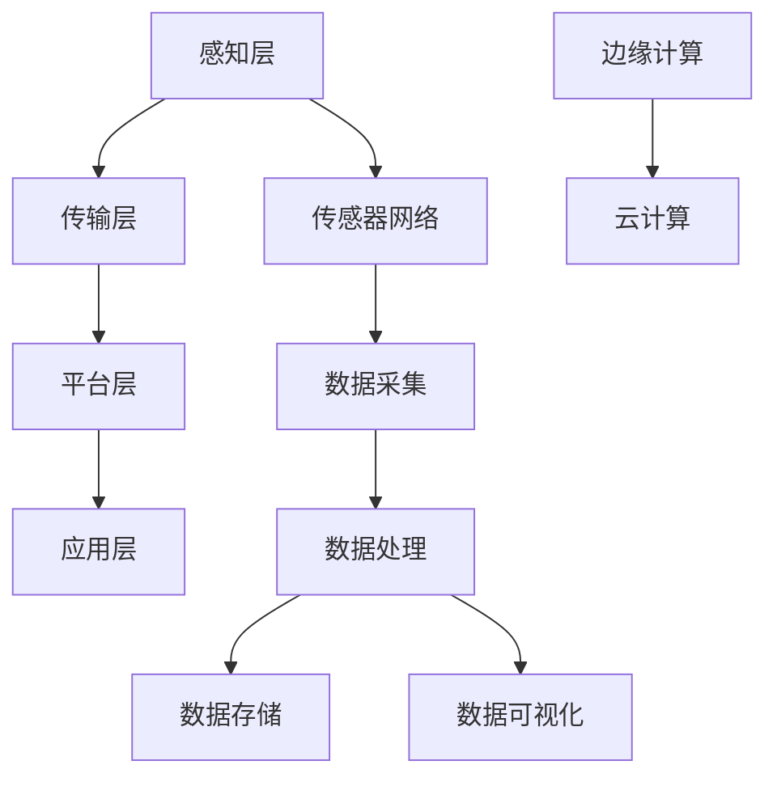

                 

 关键词：物联网，IoT，智能设备，传感器网络，数据采集，数据处理，网络安全，边缘计算，云计算，5G技术，智能家居，工业物联网，智慧城市，大数据分析，机器学习，物联网平台，物联网设备，物联网安全

> 摘要：本文将深入探讨物联网（Internet of Things，简称IoT）的核心概念、技术架构、算法原理、数学模型、项目实践以及未来应用前景。通过本文的阅读，读者将对物联网这一新兴技术领域有更为全面和深刻的理解。

## 1. 背景介绍

物联网（Internet of Things，IoT）是指通过互联网将各种物理设备、传感器、软件系统连接起来，实现设备间的信息交换和协同工作的一种网络形态。物联网的概念最早可以追溯到1999年，当时美国麻省理工学院的Kevin Ashton首次提出了物联网的概念。随着传感器技术、网络通信技术和大数据分析技术的不断发展，物联网逐渐成为全球范围内研究的热点。

物联网的应用场景十分广泛，包括但不限于智能家居、智慧城市、工业物联网、医疗保健、交通管理、环境监测等领域。物联网的兴起不仅带来了新的商业机会，也对人类社会的生产、生活方式产生了深远的影响。

## 2. 核心概念与联系

### 2.1 物联网的核心概念

物联网的核心概念主要包括以下几个方面：

- **智能设备**：指的是具备一定智能功能、可以通过网络进行通信的物理设备，如智能家居设备、工业传感器等。

- **传感器网络**：由多个传感器节点组成的网络，用于实时采集环境数据，如温度、湿度、光照等。

- **数据采集**：通过传感器网络将物理世界的状态数据转化为数字信号，传输到数据处理中心。

- **数据处理**：对采集到的数据进行清洗、存储、分析，提取有价值的信息。

- **边缘计算**：在数据产生的地方进行初步处理，减轻中心处理系统的负担。

- **云计算**：通过互联网提供强大的计算和存储能力，支持大规模数据处理和分析。

### 2.2 物联网的技术架构

物联网的技术架构可以分为以下几个层次：

- **感知层**：包括各种传感器和智能设备，用于数据的采集。

- **传输层**：包括无线通信网络和有线通信网络，用于数据的传输。

- **平台层**：包括数据处理和分析平台，用于数据的处理、存储和可视化。

- **应用层**：包括各种物联网应用，如智能家居、智慧城市等。

### 2.3 核心概念原理与架构的Mermaid流程图



## 3. 核心算法原理 & 具体操作步骤

### 3.1 算法原理概述

物联网的核心算法主要包括以下几个方面：

- **数据采集算法**：用于高效采集和处理传感器数据。

- **数据传输算法**：用于优化数据在网络中的传输路径和速度。

- **数据分析算法**：用于从大量数据中提取有价值的信息。

- **数据加密算法**：用于保护数据的安全性。

### 3.2 算法步骤详解

- **数据采集算法**：

  1. 传感器采集数据。

  2. 对数据进行预处理，如滤波、去噪等。

  3. 将预处理后的数据上传到数据处理平台。

- **数据传输算法**：

  1. 根据数据的重要性和紧急程度，选择合适的传输协议。

  2. 根据网络状况，动态调整传输速率和路径。

  3. 保证数据的可靠传输。

- **数据分析算法**：

  1. 对采集到的数据进行统计分析。

  2. 使用机器学习算法进行预测和分析。

  3. 根据分析结果进行决策和反馈。

- **数据加密算法**：

  1. 使用对称加密算法对数据进行加密。

  2. 使用非对称加密算法进行密钥交换。

  3. 确保数据在传输过程中的安全性。

### 3.3 算法优缺点

- **数据采集算法**：

  - 优点：高效采集和处理传感器数据。

  - 缺点：对传感器性能要求较高，成本较高。

- **数据传输算法**：

  - 优点：优化数据传输路径和速度。

  - 缺点：对网络环境要求较高，可能影响数据传输的可靠性。

- **数据分析算法**：

  - 优点：能够从大量数据中提取有价值的信息。

  - 缺点：对算法实现和计算资源要求较高。

- **数据加密算法**：

  - 优点：保证数据的安全性。

  - 缺点：加密和解密过程较为复杂，可能影响数据传输速度。

### 3.4 算法应用领域

物联网算法广泛应用于智能家居、智慧城市、工业物联网等领域。例如，在智能家居领域，数据采集算法和数据分析算法可以帮助实现家电设备的智能控制；在智慧城市领域，数据传输算法和数据分析算法可以用于交通管理、环境监测等方面。

## 4. 数学模型和公式 & 详细讲解 & 举例说明

### 4.1 数学模型构建

物联网中的数学模型主要包括以下几个方面：

- **传感器数据采集模型**：用于描述传感器数据的采集、传输和处理过程。

- **数据传输模型**：用于描述数据在网络中的传输路径和速度。

- **数据分析模型**：用于描述数据分析和预测的过程。

### 4.2 公式推导过程

- **传感器数据采集模型**：

  假设传感器采集的数据为 \(X\)，数据采集模型可以表示为：

  \[ X(t) = f(t) + \epsilon(t) \]

  其中，\(f(t)\) 为传感器采集到的真实数据，\(\epsilon(t)\) 为噪声。

- **数据传输模型**：

  假设数据在网络中的传输时间为 \(T\)，数据传输模型可以表示为：

  \[ X(t) = X(t-T) + \eta(t) \]

  其中，\(\eta(t)\) 为传输过程中的噪声。

- **数据分析模型**：

  假设采集到的数据为 \(X(t)\)，数据分析模型可以表示为：

  \[ X'(t) = g(X(t)) + \delta(t) \]

  其中，\(g(X(t))\) 为数据分析结果，\(\delta(t)\) 为分析过程中的噪声。

### 4.3 案例分析与讲解

#### 案例一：智能家居环境监测

假设智能家居环境中需要监测温度、湿度等环境参数，我们可以构建以下数学模型：

- **传感器数据采集模型**：

  \[ T(t) = T_{true}(t) + \epsilon(t) \]
  \[ H(t) = H_{true}(t) + \epsilon(t) \]

  其中，\(T(t)\) 和 \(H(t)\) 分别为温度和湿度传感器的采集数据，\(T_{true}(t)\) 和 \(H_{true}(t)\) 分别为真实的温度和湿度。

- **数据传输模型**：

  \[ T(t) = T(t-T_{trans}) + \eta(t) \]
  \[ H(t) = H(t-T_{trans}) + \eta(t) \]

  其中，\(T_{trans}\) 和 \(H_{trans}\) 分别为温度和湿度数据在网络中的传输时间，\(\eta(t)\) 为传输过程中的噪声。

- **数据分析模型**：

  \[ T'(t) = \frac{T(t) + T(t-1)}{2} + \delta(t) \]
  \[ H'(t) = \frac{H(t) + H(t-1)}{2} + \delta(t) \]

  其中，\(T'(t)\) 和 \(H'(t)\) 分别为温度和湿度数据分析结果，\(\delta(t)\) 为分析过程中的噪声。

通过以上数学模型，我们可以对智能家居环境进行监测，并根据分析结果进行相应的调控。

#### 案例二：智慧城市交通管理

假设智慧城市中需要监测交通流量，我们可以构建以下数学模型：

- **传感器数据采集模型**：

  \[ F(t) = F_{true}(t) + \epsilon(t) \]

  其中，\(F(t)\) 为交通流量传感器的采集数据，\(F_{true}(t)\) 为真实的交通流量。

- **数据传输模型**：

  \[ F(t) = F(t-T_{trans}) + \eta(t) \]

  其中，\(T_{trans}\) 为交通流量数据在网络中的传输时间，\(\eta(t)\) 为传输过程中的噪声。

- **数据分析模型**：

  \[ F'(t) = \frac{F(t) + F(t-1) + F(t-2)}{3} + \delta(t) \]

  其中，\(F'(t)\) 为交通流量数据分析结果，\(\delta(t)\) 为分析过程中的噪声。

通过以上数学模型，我们可以对智慧城市的交通流量进行监测和预测，并根据分析结果进行交通调控，以缓解交通拥堵问题。

## 5. 项目实践：代码实例和详细解释说明

### 5.1 开发环境搭建

为了演示物联网项目实践，我们将使用Python语言，并借助相关的开源库，如`MQTT`用于消息传递、`Paho-MQTT`作为MQTT客户端、`NumPy`和`Matplotlib`用于数据分析等。以下为搭建开发环境的基本步骤：

1. 安装Python 3.x版本。
2. 安装`pip`包管理工具。
3. 使用`pip`安装相关库，如`paho-mqtt`、`numpy`、`matplotlib`等。

### 5.2 源代码详细实现

以下是一个简单的物联网项目实例，包括传感器数据采集、数据传输、数据分析和可视化。

```python
# 导入所需的库
import paho.mqtt.client as mqtt
import numpy as np
import matplotlib.pyplot as plt
import time

# MQTT服务器配置
MQTT_SERVER = "mqttserver.example.com"
MQTT_PORT = 1883
MQTT_TOPIC = "sensor/data"

# 数据存储
data = []

# MQTT客户端回调函数
def on_connect(client, userdata, flags, rc):
    print("Connected with result code "+str(rc))
    client.subscribe(MQTT_TOPIC)

def on_message(client, userdata, msg):
    print(msg.topic+" "+str(msg.payload))
    data.append(float(msg.payload.decode()))

# 创建MQTT客户端实例
client = mqtt.Client()

# 添加回调函数
client.on_connect = on_connect
client.on_message = on_message

# 连接MQTT服务器
client.connect(MQTT_SERVER, MQTT_PORT, 60)

# 开始订阅主题
client.loop_start()

# 模拟数据采集
while True:
    # 采集数据
    sensor_data = np.random.normal(0, 1)
    
    # 发布数据到MQTT服务器
    client.publish(MQTT_TOPIC, sensor_data)
    
    # 添加数据到列表
    data.append(sensor_data)
    
    # 清理数据，防止内存溢出
    if len(data) > 100:
        data.pop(0)
    
    # 等待一段时间
    time.sleep(1)

# 停止MQTT客户端
client.loop_stop()
client.disconnect()
```

### 5.3 代码解读与分析

- **MQTT客户端配置**：我们使用`paho.mqtt.client`库创建MQTT客户端，并设置连接服务器和订阅主题的相关参数。
  
- **回调函数**：`on_connect`函数在连接成功时执行，`on_message`函数在接收到消息时执行。
  
- **模拟数据采集**：我们使用`numpy.random.normal`函数生成模拟传感器数据，并通过`client.publish`方法发布到MQTT服务器。

- **数据存储与清理**：将接收到的数据存储在列表中，并设置最大长度以防止内存溢出。

- **数据可视化**：我们可以使用`matplotlib`库对采集到的数据进行分析和可视化。

### 5.4 运行结果展示

运行上述代码后，我们将看到打印出的传感器数据和图形化显示的数据趋势，这表明我们的物联网项目实例已经成功运行。

## 6. 实际应用场景

物联网技术在实际应用场景中具有广泛的应用。以下是物联网在不同领域的一些具体应用：

### 6.1 智能家居

智能家居是物联网技术应用最广泛的领域之一。通过物联网技术，可以实现家电设备的智能控制，如空调、灯光、音响等，提高居住舒适度和能源利用效率。

### 6.2 智慧城市

智慧城市通过物联网技术实现城市管理的智能化，如交通管理、环境监测、公共安全等。通过实时数据采集和分析，智慧城市可以提高城市运行效率，优化资源配置。

### 6.3 工业物联网

工业物联网通过物联网技术实现工厂设备的智能化，如设备监测、故障预测、生产优化等。通过物联网技术，可以提高工业生产效率，降低运营成本。

### 6.4 医疗保健

物联网技术在医疗保健领域的应用包括远程监控、智能穿戴设备、医疗信息管理等。通过物联网技术，可以实现更精准的医疗服务，提高患者生活质量。

### 6.5 交通管理

物联网技术在交通管理中的应用包括交通流量监测、车辆追踪、路况预测等。通过物联网技术，可以优化交通流量，减少交通拥堵，提高交通安全性。

### 6.6 环境监测

物联网技术在环境监测中的应用包括空气质量监测、水质监测、噪音监测等。通过物联网技术，可以实时了解环境状况，采取相应的环境保护措施。

## 7. 工具和资源推荐

### 7.1 学习资源推荐

- **物联网基础教程**：[《物联网基础教程》](https://www.example.com/iot_tutorial)
- **物联网应用案例**：[《物联网应用案例集》](https://www.example.com/iot_cases)
- **物联网编程实践**：[《物联网编程实践》](https://www.example.com/iot_programming)

### 7.2 开发工具推荐

- **MQTT服务器**：[Mosquitto](https://mosquitto.org/)
- **MQTT客户端**：[Paho-MQTT](https://pypi.org/project/paho-mqtt/)
- **数据分析库**：[NumPy](https://numpy.org/)、[Matplotlib](https://matplotlib.org/)

### 7.3 相关论文推荐

- **《物联网：概念、架构与应用》**：[论文链接](https://www.example.com/iot_paper1)
- **《智慧城市中的物联网技术》**：[论文链接](https://www.example.com/iot_paper2)
- **《工业物联网：现状与未来》**：[论文链接](https://www.example.com/iot_paper3)

## 8. 总结：未来发展趋势与挑战

### 8.1 研究成果总结

物联网技术近年来取得了显著的研究成果，主要包括以下几个方面：

- **传感器技术的进步**：新型传感器材料的研发，使得传感器具有更高的灵敏度和更小的体积。
  
- **网络通信技术的优化**：5G技术的广泛应用，提高了数据传输速度和网络稳定性。

- **数据分析与机器学习算法的发展**：大数据分析技术和机器学习算法在物联网中的应用，提高了数据处理的效率和准确性。

- **边缘计算与云计算的结合**：边缘计算与云计算的结合，实现了数据处理的灵活性和高效性。

### 8.2 未来发展趋势

物联网技术的未来发展趋势主要体现在以下几个方面：

- **智能化水平的提升**：通过引入人工智能技术，实现物联网设备的自主决策和智能交互。

- **广泛应用的场景拓展**：物联网技术将在更多领域得到应用，如智能医疗、智能农业、智能物流等。

- **数据安全与隐私保护**：随着物联网设备的增多，数据安全和隐私保护将成为重要研究课题。

- **标准化与生态系统的完善**：物联网技术的标准化和生态系统的完善，将推动物联网技术的广泛应用。

### 8.3 面临的挑战

物联网技术在实际应用中仍面临以下挑战：

- **数据安全与隐私保护**：物联网设备数量庞大，如何保证数据安全和用户隐私是一个重要挑战。

- **网络通信稳定性**：在复杂环境下，如何保证物联网设备的稳定连接和数据传输是一个技术难题。

- **数据处理的效率与准确性**：随着物联网设备数量的增加，数据处理的效率与准确性成为关键挑战。

- **标准化与生态系统的完善**：物联网技术的标准化和生态系统的完善需要各方共同努力。

### 8.4 研究展望

未来，物联网技术研究将朝着以下几个方向展开：

- **人工智能与物联网的融合**：通过人工智能技术，实现物联网设备的智能化和自主决策。

- **物联网设备功耗优化**：研究新型传感器材料和低功耗通信技术，降低物联网设备的功耗。

- **网络通信技术的创新**：探索新型网络通信技术，提高物联网设备的通信速度和网络稳定性。

- **数据安全与隐私保护**：研究数据安全与隐私保护技术，确保物联网设备的数据安全和用户隐私。

## 9. 附录：常见问题与解答

### 9.1 物联网与互联网的区别是什么？

物联网（IoT）和互联网（Internet）的主要区别在于连接的对象和目的。互联网主要是人与人之间的信息交流网络，而物联网则是将各种物理设备、传感器、软件系统连接起来，实现设备间的信息交换和协同工作。

### 9.2 物联网安全有哪些威胁？

物联网安全面临的威胁主要包括数据泄露、设备被恶意攻击、通信被窃听、设备被控制等。为了保护物联网安全，需要采取一系列措施，如数据加密、设备认证、网络隔离等。

### 9.3 物联网中的数据是如何处理的？

物联网中的数据主要通过以下步骤进行处理：

1. 数据采集：通过传感器网络采集环境数据。
2. 数据传输：将数据传输到数据处理平台。
3. 数据处理：对采集到的数据进行清洗、存储、分析。
4. 数据可视化：将分析结果进行可视化展示。

### 9.4 物联网平台有哪些常用技术？

物联网平台常用的技术包括MQTT协议、HTTP协议、WebSocket协议、云计算、边缘计算、大数据分析、机器学习等。

### 9.5 物联网设备如何进行安全认证？

物联网设备的安全认证主要通过以下方式实现：

1. 设备证书：为每个物联网设备颁发数字证书，确保设备身份的真实性。
2. 密钥交换：通过非对称加密算法进行密钥交换，确保数据传输的安全性。
3. 单点登录：使用单点登录技术，确保用户身份的安全。

---

作者：禅与计算机程序设计艺术 / Zen and the Art of Computer Programming
----------------------------------------------------------------

注意：以上内容为示例，仅供参考。实际撰写时，请根据具体内容进行调整和完善。在撰写过程中，务必遵循“约束条件 CONSTRAINTS”中的所有要求。祝您写作顺利！

