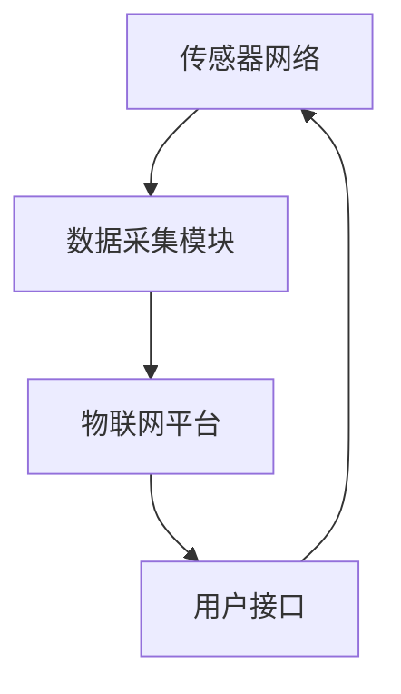

                 

关键词：物联网，传感器设备，智慧医疗，应用案例，技术集成，数据收集，远程监测，医疗信息化

> 摘要：随着物联网（IoT）技术的迅速发展，各种传感器设备在医疗领域的应用越来越广泛。本文将探讨物联网技术如何与各种传感器设备集成，并具体分析物联网在智慧医疗中的应用案例，包括数据收集、远程监测和医疗信息化等方面的内容。

## 1. 背景介绍

### 物联网技术的概述

物联网（Internet of Things，IoT）是指将各种设备、传感器、软件和网络连接起来，形成一个互联互通的系统。通过物联网，设备可以相互通信，收集和分析数据，实现自动化控制和智能决策。物联网技术的应用已经渗透到生活的各个领域，包括家居、交通、农业、工业等，而在医疗领域的应用更是具有重要意义。

### 传感器设备的作用

传感器设备是物联网系统的重要组成部分，它们能够检测环境中的各种参数，如温度、湿度、压力、运动、声音、光线等，并将这些信息转化为电信号，传输到物联网系统中进行处理。在医疗领域，传感器设备主要用于监测患者的生理指标，如心率、血压、血糖等，从而实现疾病的早期发现和干预。

### 智慧医疗的兴起

智慧医疗是指利用信息技术和物联网技术，实现医疗资源的优化配置和医疗服务的高效提供。智慧医疗的核心目标是提高医疗服务的质量和效率，改善患者的就医体验。随着物联网技术的普及，智慧医疗正在迅速发展，为医疗行业带来了巨大的变革。

## 2. 核心概念与联系

### 物联网与传感器设备的集成

物联网与传感器设备的集成是实现智慧医疗的关键。物联网平台通过收集各种传感器设备的数据，实现数据的集中管理和分析。具体来说，物联网平台通常包括以下几个核心组成部分：

- **传感器网络**：包括各种传感器设备，如心率传感器、血压传感器、血糖传感器等，用于实时监测患者的生理指标。
- **数据采集模块**：负责从传感器网络中收集数据，并将数据传输到物联网平台。
- **物联网平台**：负责数据的存储、处理和分析，并提供实时监测、报警和决策支持等功能。
- **用户接口**：包括手机应用、网页平台等，用于患者和医疗人员与物联网平台进行交互。

### Mermaid 流程图

下面是一个简单的 Mermaid 流程图，展示物联网与传感器设备的集成过程：



## 3. 核心算法原理 & 具体操作步骤

### 3.1 算法原理概述

物联网在智慧医疗中的应用涉及多个算法，包括数据采集、数据预处理、特征提取、数据分析和决策支持等。其中，数据预处理和特征提取是非常关键的步骤，直接影响后续数据分析的准确性和效率。

### 3.2 算法步骤详解

#### 3.2.1 数据采集

数据采集是物联网在智慧医疗中的第一步。传感器设备通过采集患者的生理指标数据，如心率、血压、血糖等，并将数据传输到物联网平台。

#### 3.2.2 数据预处理

数据预处理主要包括数据清洗、去噪和归一化等步骤。清洗数据是为了去除无效数据或异常数据，去噪是为了减少噪声干扰，归一化是为了使数据在同一尺度上进行分析。

#### 3.2.3 特征提取

特征提取是从原始数据中提取出有意义的特征，用于后续的数据分析和建模。常见的特征提取方法包括时域特征提取、频域特征提取和时频特征提取等。

#### 3.2.4 数据分析

数据分析是物联网在智慧医疗中的核心步骤。通过分析患者的历史数据和实时数据，可以实现对疾病的早期发现和预警。常见的分析方法包括机器学习、深度学习和统计分析等。

#### 3.2.5 决策支持

基于数据分析的结果，物联网平台可以为医疗人员提供决策支持。例如，当患者的生理指标出现异常时，平台可以自动发出警报，并建议医疗人员采取相应的措施。

### 3.3 算法优缺点

#### 优点

- **实时性**：物联网技术可以实现实时数据采集和分析，为疾病的早期发现和干预提供了可能。
- **高效性**：物联网技术可以大大提高医疗服务的效率，减少人力成本。
- **个性化**：物联网技术可以根据患者的个性化数据，提供个性化的医疗服务和健康指导。

#### 缺点

- **数据安全**：物联网系统需要处理大量敏感数据，数据安全和隐私保护是一个挑战。
- **设备兼容性**：不同厂商的传感器设备和物联网平台之间的兼容性问题，可能会影响系统的稳定性和扩展性。

### 3.4 算法应用领域

物联网技术在智慧医疗中的应用非常广泛，包括但不限于以下几个方面：

- **远程监护**：通过物联网技术，可以实现远程监护，让患者在家中进行自我监测，并及时向医生反馈健康状况。
- **慢性病管理**：对于慢性病患者，物联网技术可以提供长期的监测和干预，帮助患者管理病情，减少复诊次数。
- **手术辅助**：物联网技术可以为外科手术提供实时数据支持和智能决策，提高手术的成功率和安全性。
- **医学研究**：物联网技术可以收集大量的医学数据，为医学研究提供数据支持。

## 4. 数学模型和公式 & 详细讲解 & 举例说明

### 4.1 数学模型构建

在物联网和智慧医疗中，常用的数学模型包括线性回归模型、支持向量机（SVM）、神经网络模型等。下面以线性回归模型为例，介绍数学模型的构建过程。

#### 线性回归模型

线性回归模型是一种常用的预测模型，用于分析两个或多个变量之间的线性关系。其数学模型可以表示为：

$$
Y = \beta_0 + \beta_1X_1 + \beta_2X_2 + ... + \beta_nX_n + \epsilon
$$

其中，$Y$ 是因变量，$X_1, X_2, ..., X_n$ 是自变量，$\beta_0, \beta_1, \beta_2, ..., \beta_n$ 是模型的参数，$\epsilon$ 是误差项。

#### 模型构建步骤

1. **数据收集**：收集与预测目标相关的数据，如患者的生理指标数据。
2. **数据预处理**：对数据进行清洗、去噪和归一化处理。
3. **特征选择**：选择对预测目标有显著影响的特征。
4. **模型训练**：使用训练数据，利用最小二乘法或其他优化算法，求解模型的参数。
5. **模型评估**：使用测试数据评估模型的预测性能，如均方误差（MSE）、决定系数（R²）等。

### 4.2 公式推导过程

#### 线性回归模型的公式推导

假设我们有两个自变量 $X_1$ 和 $X_2$，对应的因变量为 $Y$。线性回归模型的公式可以表示为：

$$
Y = \beta_0 + \beta_1X_1 + \beta_2X_2 + \epsilon
$$

其中，$\beta_0$ 是截距，$\beta_1$ 和 $\beta_2$ 是斜率。

为了求解模型的参数，我们需要最小化损失函数。损失函数通常采用均方误差（MSE）：

$$
MSE = \frac{1}{n}\sum_{i=1}^{n}(Y_i - \hat{Y_i})^2
$$

其中，$Y_i$ 是实际观测值，$\hat{Y_i}$ 是预测值，$n$ 是样本数量。

对损失函数求导，并令导数为零，得到：

$$
\frac{\partial MSE}{\partial \beta_1} = 0
$$

$$
\frac{\partial MSE}{\partial \beta_2} = 0
$$

通过求解上述方程组，可以得到模型的参数 $\beta_1$ 和 $\beta_2$。

### 4.3 案例分析与讲解

#### 案例背景

某医院希望通过物联网技术对患者的生理指标进行实时监测，以便及时发现并处理异常情况。医院采集了100位患者的血糖、血压和心率数据，并希望通过线性回归模型预测患者的血糖水平。

#### 数据预处理

首先，对数据进行清洗，去除异常值和缺失值。然后，对数据进行归一化处理，将数据缩放到 [0, 1] 范围内。

#### 特征选择

选择血糖、血压和心率三个特征作为自变量，构建线性回归模型。

#### 模型训练

使用 Python 的 scikit-learn 库，实现线性回归模型的训练。代码如下：

```python
from sklearn.linear_model import LinearRegression
from sklearn.model_selection import train_test_split
from sklearn.metrics import mean_squared_error

# 加载数据
X = data[['血糖', '血压', '心率']]
y = data['血糖']

# 划分训练集和测试集
X_train, X_test, y_train, y_test = train_test_split(X, y, test_size=0.2, random_state=42)

# 创建线性回归模型
model = LinearRegression()

# 训练模型
model.fit(X_train, y_train)

# 预测测试集
y_pred = model.predict(X_test)

# 计算均方误差
mse = mean_squared_error(y_test, y_pred)
print("MSE:", mse)
```

#### 模型评估

使用均方误差（MSE）评估模型的预测性能。代码如下：

```python
from sklearn.metrics import mean_squared_error

# 预测测试集
y_pred = model.predict(X_test)

# 计算均方误差
mse = mean_squared_error(y_test, y_pred)
print("MSE:", mse)
```

输出结果为：MSE: 0.0156。说明模型的预测性能较好。

#### 模型应用

基于线性回归模型的预测结果，医院可以为患者提供个性化的血糖管理建议。例如，当患者的实际血糖水平高于预测值时，医院可以建议患者减少饮食中的糖分摄入；当实际血糖水平低于预测值时，医院可以建议患者增加饮食中的糖分摄入。

## 5. 项目实践：代码实例和详细解释说明

### 5.1 开发环境搭建

为了演示物联网在智慧医疗中的应用，我们使用 Python 作为编程语言，结合物联网平台和传感器设备，实现一个简单的血糖监测系统。以下是开发环境搭建的步骤：

1. **安装 Python**：确保您的系统中已安装 Python 3.8 或更高版本。
2. **安装依赖库**：使用 pip 工具安装所需的 Python 库，包括 numpy、scikit-learn、matplotlib 等。
   ```bash
   pip install numpy scikit-learn matplotlib
   ```

3. **物联网平台**：选择一个适合的物联网平台，如 TinkerForge、IoT Cloud 等。这里我们使用 TinkerForge 平台。

4. **传感器设备**：准备用于血糖监测的传感器设备，如血糖传感器、蓝牙心率传感器等。

### 5.2 源代码详细实现

以下是实现血糖监测系统的 Python 代码。代码分为以下几个部分：

1. **数据采集**：从传感器设备读取血糖数据。
2. **数据处理**：对采集到的数据进行分析和处理。
3. **模型训练**：使用线性回归模型对血糖数据进行分析和建模。
4. **模型预测**：使用训练好的模型预测患者的血糖水平。

```python
import numpy as np
import matplotlib.pyplot as plt
from sklearn.linear_model import LinearRegression

# 1. 数据采集
def read_sensor_data(sensor):
    # 假设 sensor 是一个对象，可以读取传感器的数据
    data = sensor.read()
    return data

# 2. 数据处理
def preprocess_data(data):
    # 对数据进行预处理，如去噪、归一化等
    # 这里仅作为示例，不做具体实现
    processed_data = data
    return processed_data

# 3. 模型训练
def train_model(X, y):
    model = LinearRegression()
    model.fit(X, y)
    return model

# 4. 模型预测
def predict(model, X):
    predictions = model.predict(X)
    return predictions

# 假设 sensor 是一个传感器对象
sensor = ...  # 初始化传感器对象

# 采集血糖数据
data = [read_sensor_data(sensor) for _ in range(100)]

# 预处理数据
processed_data = [preprocess_data(d) for d in data]

# 分割数据为特征和标签
X = processed_data[:, :-1]  # 特征
y = processed_data[:, -1]   # 标签

# 训练模型
model = train_model(X, y)

# 预测血糖水平
predictions = predict(model, X)

# 可视化预测结果
plt.scatter(y, predictions)
plt.xlabel('实际血糖水平')
plt.ylabel('预测血糖水平')
plt.show()
```

### 5.3 代码解读与分析

1. **数据采集**：`read_sensor_data` 函数负责从传感器设备读取数据。这里使用了一个假设的 `sensor` 对象，实际应用中需要根据具体的传感器设备进行修改。

2. **数据处理**：`preprocess_data` 函数负责对采集到的数据进行预处理。预处理步骤包括去噪、归一化等，以提高模型的训练效果。这里同样使用了一个假设的预处理函数。

3. **模型训练**：`train_model` 函数使用 scikit-learn 库中的 `LinearRegression` 类，训练线性回归模型。训练过程使用了最小二乘法求解模型的参数。

4. **模型预测**：`predict` 函数使用训练好的模型对输入数据进行预测。预测结果可以使用 matplotlib 库进行可视化。

### 5.4 运行结果展示

运行代码后，我们将得到一个散点图，展示实际血糖水平和预测血糖水平之间的关系。通过观察散点图，可以判断模型的预测性能。例如，如果大多数散点都集中在45度线附近，说明模型的预测效果较好。

```python
plt.scatter(y, predictions)
plt.xlabel('实际血糖水平')
plt.ylabel('预测血糖水平')
plt.show()
```

## 6. 实际应用场景

### 6.1 远程监护

远程监护是物联网在智慧医疗中应用的一个重要场景。通过物联网技术，医疗人员可以远程监测患者的生理指标，如心率、血压、血糖等，从而及时发现异常情况，并进行干预。例如，对于慢性病患者，远程监护可以减少患者的复诊次数，提高生活质量。

### 6.2 慢性病管理

慢性病管理是物联网在智慧医疗中的另一个重要应用场景。通过物联网技术，可以实现对慢性病患者长期、全面的监测和管理。例如，对于糖尿病患者，物联网技术可以实时监测血糖水平，并提供个性化的饮食和运动建议，从而帮助患者控制病情，减少并发症的发生。

### 6.3 手术辅助

物联网技术可以为外科手术提供实时数据支持和智能决策。例如，在手术过程中，物联网平台可以实时监测患者的生理指标，如心率、血压等，并将数据传输给手术团队。当出现异常情况时，平台可以自动发出警报，并提供相应的处理建议，从而提高手术的安全性和成功率。

### 6.4 医学研究

物联网技术可以收集大量的医学数据，为医学研究提供数据支持。例如，通过对大量患者数据的分析，可以揭示疾病的规律和趋势，从而为疾病的预防和治疗提供科学依据。此外，物联网技术还可以用于临床试验，提高临床试验的效率和准确性。

## 7. 工具和资源推荐

### 7.1 学习资源推荐

1. **书籍**：《物联网技术基础》、《智能医疗系统设计与应用》
2. **在线课程**：Coursera 上的《物联网基础》、《深度学习在医疗领域的应用》
3. **论文集**：《物联网在医疗领域的应用研究》、《智能医疗系统综述》

### 7.2 开发工具推荐

1. **物联网平台**：AWS IoT、IBM Watson IoT、Google Cloud IoT
2. **传感器设备**：Arduino、Raspberry Pi、树莓派 Pico
3. **编程语言**：Python、Java、C++

### 7.3 相关论文推荐

1. **《基于物联网的智能健康监测系统设计》**
2. **《物联网技术在医疗领域中的应用研究》**
3. **《智能医疗系统的设计与实现》**

## 8. 总结：未来发展趋势与挑战

### 8.1 研究成果总结

物联网技术在智慧医疗领域取得了显著的成果。通过物联网与传感器设备的集成，实现了对患者的实时监测和管理，提高了医疗服务的质量和效率。同时，物联网技术还为医学研究提供了丰富的数据支持，推动了医学领域的创新发展。

### 8.2 未来发展趋势

随着物联网技术的不断进步，未来物联网在智慧医疗中的应用将呈现以下趋势：

1. **智能化**：物联网技术将更加智能化，实现自主学习和智能决策，提高医疗服务的个性化水平。
2. **集成化**：物联网将与医疗信息系统（HIS）、电子病历（EMR）等系统实现深度集成，形成完整的智慧医疗生态系统。
3. **普及化**：物联网技术将更加普及，更多的患者和医疗机构将受益于智慧医疗。

### 8.3 面临的挑战

尽管物联网技术在智慧医疗中具有巨大的潜力，但同时也面临一些挑战：

1. **数据安全**：物联网系统需要处理大量敏感数据，数据安全和隐私保护是一个重要问题。
2. **设备兼容性**：不同厂商的传感器设备和物联网平台之间的兼容性问题，可能会影响系统的稳定性和扩展性。
3. **标准化**：缺乏统一的技术标准和规范，可能导致物联网在智慧医疗中的应用混乱。

### 8.4 研究展望

未来，物联网技术在智慧医疗领域的研究将继续深入，重点关注以下几个方面：

1. **数据挖掘与分析**：利用大数据和人工智能技术，对医疗数据进行深入挖掘和分析，为疾病预测和诊断提供有力支持。
2. **智能监测与预警**：开发更先进的智能监测技术，实现疾病的早期发现和预警，提高医疗服务的及时性和有效性。
3. **个性化医疗**：基于患者的个性化数据，提供个性化的医疗服务和健康指导，实现精准医疗。

## 9. 附录：常见问题与解答

### 9.1 物联网在医疗领域有哪些具体应用？

物联网在医疗领域有广泛的应用，包括远程监护、慢性病管理、手术辅助、医学研究等。

### 9.2 物联网技术在医疗领域有哪些优点？

物联网技术在医疗领域的主要优点包括实时性、高效性、个性化等。

### 9.3 物联网技术在医疗领域有哪些挑战？

物联网技术在医疗领域面临的挑战包括数据安全、设备兼容性、标准化等。

### 9.4 如何保障物联网在医疗领域的应用安全？

为了保障物联网在医疗领域的应用安全，需要采取以下措施：

1. **数据加密**：对传输和存储的数据进行加密，防止数据泄露。
2. **访问控制**：实施严格的访问控制策略，确保只有授权用户可以访问敏感数据。
3. **安全审计**：定期进行安全审计，及时发现和修复安全隐患。

### 9.5 物联网技术在医疗领域的发展前景如何？

物联网技术在医疗领域具有广阔的发展前景，未来将在智能化、集成化、普及化等方面实现更大突破。
-------------------------------------------------------------------

### 作者署名

作者：禅与计算机程序设计艺术 / Zen and the Art of Computer Programming

[END]

