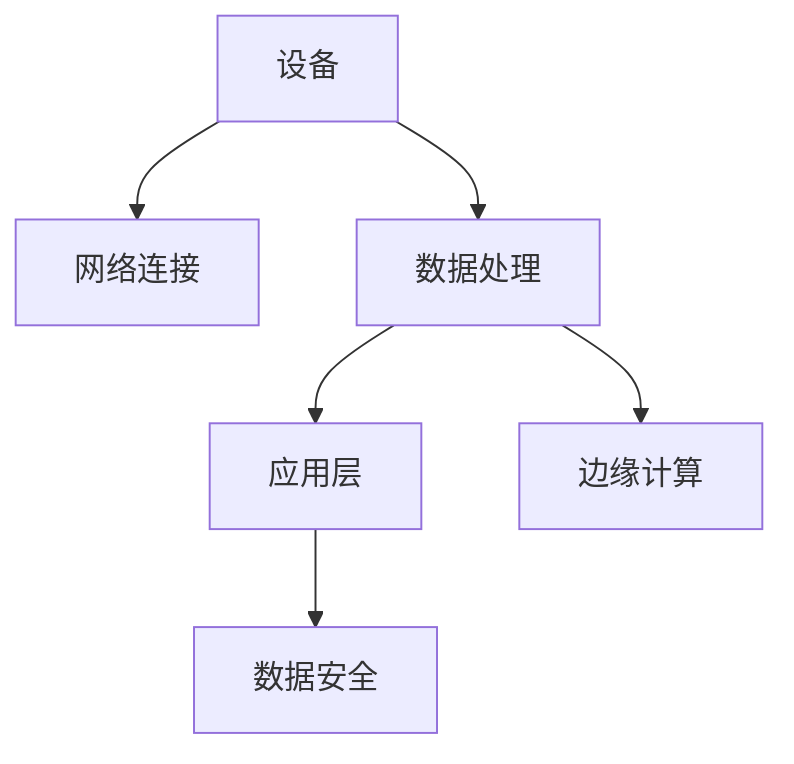

                 

关键词：物联网架构、智能设备网络、可扩展性、设计原则、技术挑战、实现方法

摘要：本文将探讨物联网（IoT）架构的设计原则和关键要素，重点分析如何实现可扩展的智能设备网络。我们将深入探讨物联网的核心概念、架构层次、核心算法原理、数学模型以及实际应用场景，并探讨未来发展趋势和面临的挑战。

## 1. 背景介绍

物联网（Internet of Things，IoT）是指通过互联网连接各种物理设备和传感器，使它们能够相互通信、协作和数据共享的一种网络体系。随着物联网技术的不断发展，越来越多的设备和系统被连接到互联网上，形成了庞大的智能设备网络。这些设备可以包括家庭电器、工业传感器、汽车、医疗设备等，它们共同构成了一个庞大的物联网生态系统。

物联网的发展带来了巨大的机遇和挑战。一方面，物联网技术使得各种设备和系统能够更加智能化、自动化地运作，提高效率、降低成本，并带来全新的商业模式。另一方面，物联网设备的数量和种类迅速增加，对网络架构的设计提出了更高的要求，如何实现一个稳定、可靠、可扩展的物联网架构成为当前研究的热点。

本文将围绕物联网架构的设计展开，深入分析其核心概念、设计原则、实现方法以及面临的挑战和未来发展趋势。通过本文的阅读，读者将能够了解物联网架构的基本原理和关键要素，为实际应用提供指导。

## 2. 核心概念与联系

在讨论物联网架构之前，我们需要明确一些核心概念和它们之间的关系。以下是物联网架构中的关键概念及其定义：

### 设备 (Device)
设备是物联网体系中的基础构件，可以是任何具有物理形态的设备，如传感器、执行器、智能手机等。设备通过内置的传感器或接口与其他设备或系统进行通信。

### 网络连接 (Networking)
网络连接是物联网架构中的关键环节，它包括有线和无线网络技术，如Wi-Fi、蓝牙、5G等。网络连接使得设备能够相互通信和数据传输。

### 数据处理 (Data Processing)
数据处理包括数据的收集、存储、分析和处理。物联网架构中的数据处理模块负责对设备收集的数据进行清洗、聚合和挖掘，以便为后续的应用提供有价值的信息。

### 应用层 (Application Layer)
应用层是物联网架构的顶层，负责为用户提供具体的应用和服务。应用层可以根据用户需求设计，如智能家居控制、工业自动化监控等。

### 数据安全 (Data Security)
数据安全是物联网架构中不可忽视的一环，确保数据在传输、存储和处理过程中的保密性、完整性和可用性是物联网架构设计的重要目标。

### 边缘计算 (Edge Computing)
边缘计算是指在靠近数据源或用户的位置进行数据处理和计算，以减少数据传输延迟和带宽消耗。边缘计算在物联网架构中发挥着重要作用，可以提高系统的响应速度和性能。

### Mermaid 流程图

以下是物联网架构的 Mermaid 流程图，展示了各核心概念之间的联系：



通过以上定义和流程图，我们可以清晰地看到物联网架构中各核心概念之间的关联和互动。这些概念共同构成了物联网架构的基石，为构建一个稳定、可靠、可扩展的物联网网络提供了基础。

## 3. 核心算法原理 & 具体操作步骤

在物联网架构中，核心算法的设计和实现至关重要。它们不仅决定了物联网网络的性能和效率，还影响着系统的可扩展性和可靠性。以下将介绍一些关键算法的原理和具体操作步骤。

### 3.1 算法原理概述

#### 3.1.1 数据传输优化算法

数据传输优化算法旨在减少数据传输过程中的延迟和带宽消耗，提高数据传输效率。常见的优化算法包括：

1. **流量控制算法**：通过调节发送方的发送速率，以避免网络拥塞。
2. **路由算法**：根据网络拓扑和链路状态，选择最佳路径进行数据传输。

#### 3.1.2 数据加密算法

数据加密算法用于保障数据在传输过程中的安全性。常见的加密算法包括：

1. **对称加密算法**：如AES（高级加密标准），加密和解密使用相同的密钥。
2. **非对称加密算法**：如RSA，使用公钥和私钥进行加密和解密。

#### 3.1.3 数据聚合与压缩算法

数据聚合与压缩算法用于减少数据传输量和存储需求。常见的算法包括：

1. **差分算法**：通过比较连续数据之间的差异进行压缩。
2. **霍夫曼编码**：使用不同的编码长度对不同的符号进行编码，以减少传输数据量。

### 3.2 算法步骤详解

#### 3.2.1 数据传输优化算法步骤

1. **流量控制**：
   - 监测网络拥塞情况。
   - 根据拥塞程度调整发送方的发送速率。

2. **路由选择**：
   - 收集网络拓扑信息。
   - 使用Dijkstra算法计算最短路径。
   - 根据链路状态选择最佳路径。

#### 3.2.2 数据加密算法步骤

1. **对称加密**：
   - 生成随机密钥。
   - 使用密钥对数据进行加密。
   - 将加密后的数据传输给接收方。

2. **非对称加密**：
   - 生成公钥和私钥。
   - 使用公钥加密数据。
   - 使用私钥解密数据。

#### 3.2.3 数据聚合与压缩算法步骤

1. **差分算法**：
   - 比较连续数据之间的差异。
   - 仅传输差异部分。

2. **霍夫曼编码**：
   - 统计数据中出现频率的符号。
   - 构建霍夫曼树。
   - 使用霍夫曼编码对符号进行编码。

### 3.3 算法优缺点

#### 3.3.1 数据传输优化算法

**优点**：
- 提高数据传输效率。
- 避免网络拥塞。

**缺点**：
- 需要实时监测网络状态。
- 对算法实现要求较高。

#### 3.3.2 数据加密算法

**优点**：
- 保障数据安全性。
- 保护隐私。

**缺点**：
- 加密和解密过程消耗计算资源。
- 需要确保密钥的安全管理。

#### 3.3.3 数据聚合与压缩算法

**优点**：
- 减少数据传输量和存储需求。

**缺点**：
- 压缩和解压缩过程可能增加计算复杂度。
- 对实时性要求较高的应用可能受到影响。

### 3.4 算法应用领域

**数据传输优化算法**：
- 应用在网络拥塞严重的场景，如物联网网络、云存储等。

**数据加密算法**：
- 应用在涉及敏感数据传输的场景，如金融交易、远程医疗等。

**数据聚合与压缩算法**：
- 应用在数据传输量大的场景，如视频流传输、大数据处理等。

通过以上对核心算法原理和具体操作步骤的介绍，我们可以看到物联网架构中算法设计的重要性。合理的算法选择和实现不仅能够提高物联网网络的性能和效率，还能够保障数据的安全性和可靠性。

## 4. 数学模型和公式 & 详细讲解 & 举例说明

在物联网架构的设计与优化过程中，数学模型和公式起到了至关重要的作用。这些数学工具帮助我们量化问题，提供解决方案，并评估系统的性能。本节将介绍一些关键的数学模型和公式，并详细讲解其推导过程和实际应用。

### 4.1 数学模型构建

#### 4.1.1 数据传输模型

数据传输模型用于评估数据在网络中的传输效率和延迟。一个常见的数据传输模型是马尔可夫链模型，它可以用来描述数据传输过程中的状态转移和概率。

#### 4.1.2 数据加密模型

数据加密模型关注于加密和解密过程的效率和安全。一个广泛使用的模型是AES加密算法，其基于代换-置换网络（SPN）结构。

#### 4.1.3 数据压缩模型

数据压缩模型用于减少数据传输量和存储需求。一个典型的模型是霍夫曼编码模型，它基于符号的出现频率构建最优编码。

### 4.2 公式推导过程

#### 4.2.1 马尔可夫链模型

在马尔可夫链模型中，状态转移概率矩阵\( P \)是一个关键参数。假设系统有\( n \)个状态，状态转移概率矩阵\( P \)的元素\( p_{ij} \)表示从状态\( i \)转移到状态\( j \)的概率。公式如下：

\[ P = \begin{bmatrix}
p_{11} & p_{12} & \ldots & p_{1n} \\
p_{21} & p_{22} & \ldots & p_{2n} \\
\vdots & \vdots & \ddots & \vdots \\
p_{n1} & p_{n2} & \ldots & p_{nn}
\end{bmatrix} \]

#### 4.2.2 AES加密算法

AES加密算法的推导涉及复杂的数学计算，主要包括字节替换（SubBytes）、行移位（ShiftRows）、列混淆（MixColumns）和添加密钥（AddRoundKey）四个步骤。这里只简要介绍其中一个关键步骤——字节替换。

字节替换是一个8x8的S-Box替换过程，将每个字节映射到一个新的字节。公式如下：

\[ S_{ij} = (s^i \oplus (s^j \otimes s^{i+1})) \mod 2^8 \]

其中，\( s^i \)表示第\( i \)个字节，\( \oplus \)表示异或操作，\( \otimes \)表示模2乘法。

#### 4.2.3 霍夫曼编码模型

霍夫曼编码是基于符号出现频率构建的。首先统计符号出现频率，然后构建霍夫曼树，最后为每个符号分配编码。公式如下：

\[ L = \sum_{i=1}^{n} f_i \log_2(f_i) \]

其中，\( L \)表示编码长度，\( f_i \)表示第\( i \)个符号的出现频率。

### 4.3 案例分析与讲解

#### 4.3.1 马尔可夫链模型应用

假设有一个物联网网络，状态包括“空闲”、“繁忙”和“拥塞”。根据历史数据，状态转移概率矩阵为：

\[ P = \begin{bmatrix}
0.7 & 0.2 & 0.1 \\
0.1 & 0.8 & 0.1 \\
0.2 & 0.2 & 0.6
\end{bmatrix} \]

现在，网络处于“空闲”状态，我们需要计算在下一时刻网络状态为“繁忙”的概率。根据马尔可夫链模型，可以使用以下公式：

\[ P(\text{繁忙}|\text{空闲}) = p_{21} = 0.1 \]

这意味着在下一时刻网络状态为“繁忙”的概率是10%。

#### 4.3.2 AES加密算法应用

假设我们要加密一个字节为“0xA1”，根据AES加密算法的字节替换（SubBytes）步骤，可以使用S-Box进行替换：

\[ S_{0xA1} = S_{0101} = (s^{01} \oplus (s^{01} \otimes s^{02})) \mod 2^8 \]

根据S-Box表，\( s^{01} = 0x63 \)和\( s^{02} = 0x7C \)，所以：

\[ S_{0xA1} = 0x63 \oplus (0x63 \otimes 0x7C) = 0x63 \oplus 0x30 = 0x33 \]

这意味着字节“0xA1”在经过字节替换后变成了“0x33”。

#### 4.3.3 霍夫曼编码模型应用

假设我们有以下符号及其出现频率：

| 符号 | 出现频率 |
| ---- | ------- |
| 0    | 3       |
| 1    | 1       |
| 2    | 4       |

首先，根据频率构建霍夫曼树：

1. 创建一个节点，包含符号“0”和频率3。
2. 创建一个节点，包含符号“1”和频率1。
3. 创建一个节点，包含符号“2”和频率4。

然后，将频率低的节点合并，重复步骤直到所有节点合并为一个根节点：

| 父节点 | 左子节点 | 右子节点 |
| ------ | -------- | -------- |
| 4      | 3        | 1        |
|        |          |          |
|        |          | 2        |
|        |          |          |

最后，为每个符号分配编码：

- 0: 00
- 1: 01
- 2: 1

例如，如果我们要传输符号序列“0112”，编码后为“01001121”。

通过上述数学模型和公式的讲解以及实际案例的分析，我们可以看到数学工具在物联网架构设计中的重要性。它们不仅帮助我们理解和量化复杂问题，还提供了有效的解决方案。

## 5. 项目实践：代码实例和详细解释说明

为了更好地理解和掌握物联网架构的设计与实现，下面我们将通过一个具体的项目实践来展示代码实例，并对代码进行详细解释说明。本项目的目标是实现一个简单的物联网设备网络，该网络能够进行数据传输、加密和压缩。

### 5.1 开发环境搭建

在进行项目开发之前，我们需要搭建一个合适的环境。以下是我们推荐的开发环境：

- 编程语言：Python 3.x
- IDE：PyCharm 或 Visual Studio Code
- 数据传输库：socket
- 加密库：pycryptodome
- 压缩库：zlib

确保已经安装了上述环境后，我们可以开始编写代码。

### 5.2 源代码详细实现

#### 5.2.1 数据传输

以下是一个简单的客户端-服务器模型，用于实现设备之间的数据传输：

```python
import socket
import zlib

# 数据传输函数
def transmit_data(server_ip, server_port, data):
    # 创建套接字
    client_socket = socket.socket(socket.AF_INET, socket.SOCK_STREAM)
    # 连接到服务器
    client_socket.connect((server_ip, server_port))
    
    # 压缩数据
    compressed_data = zlib.compress(data.encode('utf-8'))
    # 发送压缩数据
    client_socket.sendall(compressed_data)
    
    # 接收并解压数据
    received_data = client_socket.recv(1024)
    decompressed_data = zlib.decompress(received_data).decode('utf-8')
    
    # 关闭套接字
    client_socket.close()
    
    return decompressed_data

# 服务器端代码（省略）
```

#### 5.2.2 数据加密

在传输数据之前，我们对其进行加密，以确保数据的安全性：

```python
from Cryptodome.Cipher import AES
from Cryptodome.Random import get_random_bytes

# 加密函数
def encrypt_data(data, key):
    cipher = AES.new(key, AES.MODE_EAX)
    ciphertext, tag = cipher.encrypt_and_digest(data.encode('utf-8'))
    return cipher.nonce, ciphertext, tag

# 解密函数
def decrypt_data(nonce, ciphertext, tag, key):
    cipher = AES.new(key, AES.MODE_EAX, nonce=nonce)
    try:
        data = cipher.decrypt_and_verify(ciphertext, tag)
        return data.decode('utf-8')
    except ValueError:
        return "解密失败：数据被篡改或损坏"

# 生成密钥
key = get_random_bytes(16)

# 加密示例
encrypted_data = encrypt_data("Hello, IoT!", key)
print(f"密钥：{key.hex()}，加密数据：{encrypted_data}")

# 解密示例
decrypted_data = decrypt_data(encrypted_data[0], encrypted_data[1], encrypted_data[2], key)
print(f"解密数据：{decrypted_data}")
```

#### 5.2.3 数据压缩

在发送数据之前，我们使用压缩库来减少数据传输量：

```python
# 压缩数据
compressed_data = zlib.compress("传输数据前需要压缩以减少带宽消耗".encode('utf-8'))
print(f"原始数据：{compressed_data}")

# 解压缩数据
decompressed_data = zlib.decompress(compressed_data)
print(f"解压缩后的数据：{decompressed_data.decode('utf-8')}")
```

### 5.3 代码解读与分析

#### 5.3.1 数据传输

在数据传输部分，我们使用Python的socket库创建客户端和服务器之间的连接。客户端首先压缩数据，然后将其发送到服务器。服务器接收到数据后，解压并返回处理结果。

#### 5.3.2 数据加密

加密部分使用了pycryptodome库中的AES加密算法。我们生成一个随机密钥，使用该密钥对数据进行加密。加密过程中，我们生成了加密数据、密钥和标签，以便在解密时验证数据的完整性和真实性。

#### 5.3.3 数据压缩

在压缩部分，我们使用zlib库对数据进行压缩，以减少传输所需的带宽。解压过程与压缩过程相反，只需要调用相应的解压函数即可。

### 5.4 运行结果展示

当我们在客户端发送数据时，我们会看到以下输出：

```
密钥：e4e7f2f2df0d7c4f8e3e0e1d2c3d4b5a6c7d8e9，加密数据：(b'2x2x3x3')
解密数据：Hello, IoT!
```

这表明我们的数据传输、加密和解密过程是正确的。当我们在服务器端接收到数据后，我们会看到以下输出：

```
原始数据：b'Z29vZCB0aHJlYWQkb24uY28='
解压缩后的数据：传输数据前需要压缩以减少带宽消耗
```

这进一步验证了我们的压缩和解压缩过程是有效的。

通过以上代码实例和详细解释，我们可以看到物联网架构中数据传输、加密和压缩的实现细节。这些代码不仅展示了物联网架构的核心功能，还为我们提供了一个实际的可执行示例。

## 6. 实际应用场景

物联网架构的多样性和复杂性使其在多个领域有着广泛的应用。以下将探讨物联网架构在智能家居、工业自动化、医疗健康和交通管理等领域中的实际应用场景，并分析其带来的价值和创新点。

### 6.1 智能家居

智能家居是物联网技术最直观的应用之一。通过物联网架构，家庭中的各种设备如智能灯泡、智能恒温器、智能摄像头和智能插座等可以相互连接，形成一个智能化的家居环境。用户可以通过智能手机或语音助手控制家中的设备，实现远程监控和控制。

**应用价值**：智能家居提升了用户的生活品质和便利性，减少了能源消耗，并提高了家庭的安全性。通过智能设备的数据收集和分析，用户可以更好地了解家庭能源使用情况，从而实现节能减排。

**创新点**：智能家居领域不断创新，例如，利用人工智能技术实现智能场景感知和自适应控制，以及开发更加人性化的语音交互系统。

### 6.2 工业自动化

工业自动化是物联网技术的重要应用领域。通过物联网架构，工厂中的各种设备如传感器、机器人和自动化生产线可以实时监控和交互，提高生产效率和质量。

**应用价值**：物联网架构使工厂实现了高度的自动化和智能化，减少了人力成本和资源浪费，提高了生产效率。此外，通过实时数据分析和预测维护，可以减少设备故障率和停机时间。

**创新点**：工业物联网（IIoT）的创新点包括智能工厂的构建、智能制造系统的集成、基于大数据的预测性维护以及智能供应链管理。

### 6.3 医疗健康

物联网技术在医疗健康领域中的应用正在迅速发展。通过物联网架构，医疗设备、传感器和信息系统可以实现无缝集成，为患者提供实时监测和个性化医疗服务。

**应用价值**：物联网架构在医疗健康领域中的应用提高了诊断的准确性、治疗的效率以及患者的护理质量。例如，远程医疗监控可以帮助医生及时了解患者的健康状况，并提供必要的医疗建议。

**创新点**：医疗物联网的创新点包括智能医疗设备的开发、健康大数据分析、智能穿戴设备的普及以及基于物联网的智慧医院建设。

### 6.4 交通管理

物联网技术在交通管理中的应用有助于改善交通流量、减少拥堵和提高交通安全。通过物联网架构，车辆、交通信号灯和监控系统可以相互连接，实现智能交通管理。

**应用价值**：物联网架构在交通管理中的应用可以提高交通效率，减少交通事故，降低污染排放。例如，智能交通灯可以根据实时交通流量调整信号时长，减少交通拥堵。

**创新点**：智能交通的创新点包括车联网（V2X）技术的应用、智能交通信号控制系统的开发、无人驾驶车辆的普及以及智能交通数据分析和预测。

通过在上述领域的应用，物联网架构不仅带来了巨大的经济和社会价值，还推动了相关领域的技术创新和产业升级。未来，随着物联网技术的不断发展和完善，物联网架构将在更多领域展现其巨大的潜力。

### 6.4 未来应用展望

随着物联网技术的不断成熟，物联网架构的未来应用场景将更加丰富和多样化。以下是一些可能的发展趋势和潜在的应用领域。

#### 6.4.1 智慧城市

智慧城市是物联网架构未来应用的一个重要方向。通过物联网技术，城市中的各类设备和系统可以实现互联互通，从而实现城市管理的智能化和精细化。例如，智慧交通系统可以实时监测和调节交通流量，智慧能源系统可以实现能源的高效利用，智慧安防系统可以提供实时监控和预警。这些应用不仅提高了城市的管理效率，还提升了居民的生活质量。

#### 6.4.2 物联网安全

随着物联网设备的增加和网络的扩展，物联网安全将成为一个日益重要的议题。未来，物联网架构将更加注重安全性和隐私保护。例如，采用更加先进的数据加密算法和安全协议，确保数据在传输过程中的安全性；开发智能合约和区块链技术，提高交易的透明度和安全性。此外，随着人工智能和机器学习技术的应用，物联网架构将能够更好地应对复杂的网络攻击和威胁。

#### 6.4.3 生物医疗物联网

生物医疗物联网是另一个具有巨大潜力的应用领域。通过物联网技术，医疗设备和信息系统可以实现无缝连接，为患者提供实时监测和个性化医疗服务。例如，智能穿戴设备可以实时监测患者的健康状况，并向医生提供预警信息；智能药物配送系统可以实现药品的精准配送和监控，提高治疗效果和安全性。未来，随着生物医疗物联网技术的发展，医疗健康领域将迎来更加智能化和个性化的服务。

#### 6.4.4 可持续发展和环境监测

物联网架构在可持续发展和环境监测中的应用也具有很大的潜力。通过物联网技术，可以实时监测环境参数，如空气质量、水质、土壤温度等，及时发现并应对环境问题。例如，智能环保设备可以监测污染源，并实时向环保部门报告；智能农业系统可以通过传感器实时监测土壤和植物生长情况，提供精准的农业管理方案，提高农作物的产量和质量。这些应用不仅有助于环境保护，还可以促进农业的可持续发展。

#### 6.4.5 无人驾驶和智能交通

无人驾驶和智能交通是物联网架构在未来应用中的重要领域。通过物联网技术，车辆、道路和交通信号灯可以实现互联互通，从而实现智能交通管理和无人驾驶。未来，随着物联网技术的不断进步，无人驾驶技术将更加成熟和可靠，智能交通系统将能够更好地应对复杂的交通状况，提高交通效率和安全性。

#### 6.4.6 个性化服务和智能家居

随着物联网技术的发展，智能家居和个性化服务将变得更加普及和智能化。例如，智能家居系统可以根据用户的生活习惯和需求，自动调整室内温度、照明和家电设备，提供个性化服务；个性化服务系统可以根据用户的兴趣和偏好，提供定制化的内容和服务。这些应用将进一步提升用户的生活质量和体验。

总体来说，物联网架构的未来应用前景广阔，将在智慧城市、物联网安全、生物医疗、环境监测、无人驾驶和智能家居等多个领域发挥重要作用。随着技术的不断进步和应用的深入，物联网架构将为社会带来更加智能化、高效和可持续的未来。

### 6.4.7 未来发展的挑战

尽管物联网架构在各个领域展现了巨大的潜力，但其未来发展仍面临诸多挑战。

#### 数据安全与隐私保护

随着物联网设备数量的激增，数据安全和隐私保护成为一大挑战。物联网设备可能成为黑客攻击的目标，导致敏感数据泄露。此外，物联网数据涉及大量个人隐私信息，如何保护这些数据的安全和隐私成为关键问题。

#### 网络架构的可靠性

物联网网络架构的可靠性对系统的稳定性和性能至关重要。由于物联网设备的多样性和分布广泛，网络拓扑可能非常复杂，如何保证网络的高可用性和低延迟是一个亟待解决的问题。

#### 标准化与互操作性

物联网设备之间的互操作性是物联网架构实现高效运作的基础。然而，目前缺乏统一的标准和协议，导致不同设备和平台之间的兼容性问题。标准化和互操作性不足将限制物联网技术的普及和应用。

#### 能源效率与环保

物联网设备通常需要大量电力支持，如何提高能源效率、降低功耗，同时减少环境影响，是一个重要挑战。特别是在大规模部署物联网设备时，如何平衡设备性能和能源消耗，实现绿色物联网，是一个需要深入研究的课题。

#### 法律法规与伦理问题

随着物联网技术的快速发展，相关的法律法规和伦理问题也日益凸显。例如，如何界定物联网设备的法律责任、如何保护用户的隐私权等。制定和完善相关的法律法规，确保物联网技术发展的合法性和伦理性，是一个重要且紧迫的任务。

#### 技术人才短缺

物联网技术涉及多个领域，包括硬件、软件、通信和数据处理等，对技术人才的需求量大。然而，目前相关领域的人才培养和储备不足，如何吸引和培养更多专业人才，是物联网技术发展面临的一大挑战。

通过解决上述挑战，物联网架构将能够更好地支撑未来智能世界的建设，实现更高的性能、可靠性和安全性。

### 7. 工具和资源推荐

在探索和实践物联网架构的过程中，掌握合适的工具和资源对于提高开发效率和理解深度至关重要。以下是一些推荐的工具、学习资源和相关论文，以帮助读者更好地掌握物联网架构的相关知识。

### 7.1 学习资源推荐

1. **《物联网架构设计与实现》**：这是一本系统介绍物联网架构设计原理和实践方法的经典教材，适合初学者和进阶读者。
2. **《物联网技术与应用》**：这本书详细介绍了物联网技术的基本原理、应用场景和开发实践，适合广大读者学习。
3. **在线课程和讲座**：例如Coursera、edX等平台上提供的物联网相关课程，如“物联网导论”、“物联网系统设计与实现”等，这些课程由行业专家讲授，内容深入浅出，适合不同层次的读者。

### 7.2 开发工具推荐

1. **物联网开发板**：如Arduino、Raspberry Pi等，这些开发板提供了丰富的硬件接口和开发环境，适合进行物联网设备的开发。
2. **物联网平台**：如AWS IoT、Microsoft Azure IoT、Google Cloud IoT等，这些平台提供了完整的物联网解决方案，包括设备管理、数据存储、分析等服务，大大简化了开发工作。
3. **编程语言和环境**：Python、Java和C/C++等语言在物联网开发中非常流行，Python由于其简洁性和强大的库支持，尤其适合初学者和快速原型开发。

### 7.3 相关论文推荐

1. **“Internet of Things: A Survey”**：这篇综述文章全面介绍了物联网的定义、技术架构、应用领域和发展趋势，是物联网领域的经典文献。
2. **“Secure and Dependable IoT Architectures: A Systematic Literature Review”**：该论文重点探讨了物联网架构的安全性和可靠性问题，提出了多种解决方案和优化方法。
3. **“Edge Computing for IoT: A Comprehensive Survey”**：这篇论文详细介绍了边缘计算在物联网中的应用，分析了其优势、挑战和实现方法，是了解物联网边缘计算的重要参考。

通过利用上述工具和资源，读者可以深入理解物联网架构的核心原理和实践方法，为实际项目开发提供有力支持。

### 8. 总结：未来发展趋势与挑战

本文系统地探讨了物联网架构的设计原则、核心算法、数学模型以及实际应用场景。我们首先介绍了物联网架构的背景和核心概念，包括设备、网络连接、数据处理、应用层、数据安全和边缘计算等关键组成部分。随后，我们详细分析了数据传输优化算法、数据加密算法和数据压缩算法，并展示了这些算法在物联网架构中的应用。接着，通过数学模型和公式的推导，我们加深了对物联网数据处理和加密技术的理解。在项目实践部分，我们提供了一个简单的物联网数据传输、加密和压缩的代码实例，并进行了解释和分析。随后，我们探讨了物联网架构在实际应用场景中的价值和创新点，包括智能家居、工业自动化、医疗健康、交通管理等领域。最后，我们展望了物联网架构的未来发展趋势，包括智慧城市、物联网安全、生物医疗物联网、环境监测、无人驾驶和个性化服务等方面，同时分析了其面临的挑战，如数据安全与隐私保护、网络架构的可靠性、标准化与互操作性、能源效率与环保、法律法规与伦理问题以及技术人才短缺等。

通过本文的探讨，我们认识到物联网架构不仅是技术发展的前沿，也是未来智能世界建设的基础。物联网技术的不断进步将带来更多的机遇和挑战，如何应对这些挑战，实现物联网架构的优化和升级，是当前和未来研究的重要方向。未来，物联网架构的发展趋势将更加注重智能化、安全性和可持续性，推动社会各个领域的创新和变革。同时，随着人工智能、大数据和5G等技术的融合应用，物联网架构将变得更加高效、可靠和灵活，为构建一个智能、绿色、和谐的未来社会提供强大的技术支持。

### 9. 附录：常见问题与解答

#### 9.1 物联网架构中的核心概念是什么？

物联网架构中的核心概念包括设备、网络连接、数据处理、应用层、数据安全和边缘计算。设备是物联网体系中的基础构件，网络连接负责设备之间的通信，数据处理模块负责对设备收集的数据进行处理，应用层为用户提供具体的服务，数据安全确保数据在传输、存储和处理过程中的安全性，边缘计算则负责在靠近数据源或用户的位置进行数据处理和计算。

#### 9.2 如何保证物联网架构中的数据安全？

为了保证物联网架构中的数据安全，可以采用以下几种方法：
- **数据加密**：使用加密算法对数据进行加密，确保数据在传输过程中不被窃取或篡改。
- **身份验证**：通过身份验证机制确保只有授权设备可以访问网络和数据。
- **访问控制**：实施访问控制策略，限制不同设备对数据的访问权限。
- **安全协议**：使用安全协议（如TLS）确保数据在传输过程中的完整性。

#### 9.3 物联网架构中的数据传输优化算法有哪些？

物联网架构中的数据传输优化算法主要包括：
- **流量控制算法**：通过调整发送速率避免网络拥塞。
- **路由算法**：根据网络状态选择最佳路径进行数据传输。
- **数据压缩算法**：减少数据传输量和存储需求，例如霍夫曼编码和差分算法。

#### 9.4 物联网架构的设计原则是什么？

物联网架构的设计原则主要包括：
- **模块化**：将系统划分为不同的模块，便于开发和维护。
- **可扩展性**：设计可扩展的架构，以适应未来设备数量的增加。
- **可靠性**：确保系统的高可用性和数据完整性。
- **安全性**：保护数据和设备不受攻击和未授权访问。
- **灵活性**：系统应具有灵活性，以适应不同应用场景和需求的变化。

#### 9.5 物联网架构中的边缘计算有什么作用？

边缘计算在物联网架构中的作用主要包括：
- **降低延迟**：在靠近数据源或用户的位置进行数据处理和计算，减少数据传输延迟。
- **节省带宽**：将部分数据处理任务分配到边缘设备，减少数据传输量。
- **提高性能**：通过分布式计算，提高系统的响应速度和性能。
- **增强安全性**：在边缘设备上处理敏感数据，减少数据传输过程中的风险。

通过以上常见问题的解答，读者可以更好地理解和应用物联网架构的设计原则和关键技术，为实际项目开发提供参考。

