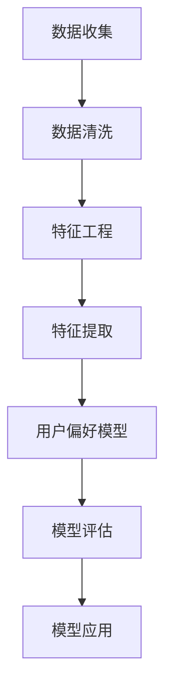

                 

关键词：特征提取、用户偏好、兴趣分析、机器学习、数据挖掘、应用领域

## 摘要

本文将深入探讨特征提取在用户偏好和兴趣分析中的重要性。特征提取是数据挖掘和机器学习领域中的核心步骤，它能够帮助我们理解并预测用户的偏好和兴趣。通过分析用户的行为数据、社交网络信息和内容标签，本文将介绍如何构建有效的特征提取模型，并探讨其在实际应用中的效果和挑战。本文旨在为读者提供全面的技术指南，帮助他们理解特征提取的方法、步骤和应用，以及如何利用这些技术为用户提供更加个性化的服务。

## 1. 背景介绍

随着互联网的快速发展，用户在数字世界中的行为数据变得日益丰富。这些数据包括浏览历史、搜索记录、购买行为、社交媒体互动等，它们蕴含着用户的偏好和兴趣信息。对用户偏好和兴趣的分析，有助于企业和组织提供更加个性化的服务，提升用户体验，并实现精准营销。然而，面对海量的数据，如何有效地提取用户偏好和兴趣的相关特征，成为了一个亟待解决的问题。

特征提取（Feature Extraction）是数据挖掘和机器学习领域中的关键步骤。它旨在从原始数据中提取出对分析任务有价值的特征，从而简化数据，降低数据的维度，提高模型的学习效率和预测准确性。在用户偏好和兴趣分析中，特征提取的目标是识别出那些能够反映用户个性化需求和兴趣的特征，以便构建有效的预测模型。

### 1.1 用户偏好和兴趣分析的重要性

用户偏好和兴趣分析在多个领域具有重要应用：

1. **个性化推荐系统**：通过分析用户的偏好和兴趣，推荐系统可以为用户提供个性化的内容或商品，从而提高用户的满意度和忠诚度。
2. **精准营销**：企业可以利用用户偏好和兴趣分析，进行精准的营销活动，提高营销效果和投资回报率。
3. **社交网络分析**：社交网络平台可以通过分析用户的兴趣和行为，实现社交圈层的划分和内容推送，促进用户互动和社区建设。
4. **用户行为预测**：通过分析用户的历史行为，企业可以预测用户的未来行为，从而提前采取行动，满足用户需求。

### 1.2 数据来源

用户偏好和兴趣分析的数据来源多样，主要包括：

- **行为数据**：包括浏览历史、搜索记录、购买行为、视频观看记录等。
- **社交网络数据**：包括用户在社交媒体上的互动、评论、点赞等。
- **内容标签数据**：包括用户对内容的打分、评论、标签等。
- **问卷调查数据**：通过问卷调查获取的用户偏好和兴趣信息。

## 2. 核心概念与联系

为了更好地理解用户偏好和兴趣分析的过程，以下我们将介绍几个核心概念，并使用Mermaid流程图展示其相互关系。

### 2.1 核心概念

- **特征工程**：特征工程是特征提取的前置步骤，它包括数据清洗、特征选择、特征转换等，旨在生成适合特征提取的输入数据。
- **特征提取**：特征提取是从原始数据中提取出对分析任务有价值的特征的过程。
- **机器学习模型**：机器学习模型用于对提取出的特征进行训练，以预测用户的偏好和兴趣。
- **用户偏好模型**：用户偏好模型是根据用户的特征数据构建的模型，用于预测用户的偏好。

### 2.2 Mermaid流程图

以下是一个简单的Mermaid流程图，展示了特征提取在用户偏好和兴趣分析中的流程：



## 3. 核心算法原理 & 具体操作步骤

### 3.1 算法原理概述

特征提取算法的基本原理是从原始数据中提取出能够反映用户偏好和兴趣的特征。这些特征可以是数值型的，也可以是分类型的，常见的特征提取方法包括：

- **基于统计的方法**：如主成分分析（PCA）、因子分析等，通过降维来提取关键特征。
- **基于机器学习的方法**：如支持向量机（SVM）、决策树等，通过训练模型来提取特征。
- **基于深度学习的方法**：如卷积神经网络（CNN）、循环神经网络（RNN）等，通过多层神经网络来提取特征。

### 3.2 算法步骤详解

特征提取的具体步骤如下：

1. **数据预处理**：对原始数据进行清洗，去除缺失值、异常值等。
2. **特征选择**：从原始数据中选择出对用户偏好和兴趣分析有显著影响的特征。
3. **特征转换**：将选出的特征进行转换，以适应特征提取算法的要求。
4. **特征提取**：使用选定的算法对转换后的特征进行提取。
5. **特征评估**：评估提取出的特征的有效性，选择最优的特征组合。

### 3.3 算法优缺点

- **基于统计的方法**：优点是计算简单，能够快速提取特征；缺点是可能丢失部分信息，且对噪声敏感。
- **基于机器学习的方法**：优点是能够自动学习特征，且适用于复杂数据；缺点是训练时间较长，对计算资源要求较高。
- **基于深度学习的方法**：优点是能够提取更深层次的特征，适用于大型复杂数据集；缺点是模型复杂，训练时间较长。

### 3.4 算法应用领域

特征提取算法在多个领域有广泛应用：

- **电子商务**：用于推荐系统，提升用户体验和销售额。
- **社交媒体**：用于内容推荐和用户行为预测。
- **金融**：用于风险控制和用户画像。
- **医疗**：用于疾病预测和诊断。

## 4. 数学模型和公式 & 详细讲解 & 举例说明

### 4.1 数学模型构建

特征提取过程中的数学模型通常涉及特征空间转换和降维。以下是一个简单的主成分分析（PCA）的数学模型：

设 \( X \) 为原始数据矩阵， \( X = [x_1, x_2, ..., x_n] \)，其中 \( x_i \) 为第 \( i \) 个样本的特征向量。通过PCA，我们希望找到一个新的正交基 \( V \)，将数据从原始特征空间 \( X \) 转换到新的特征空间 \( Y \)：

\[ Y = XV \]

其中 \( V \) 是由主成分向量组成的矩阵， \( y_i \) 为转换后的特征向量。

### 4.2 公式推导过程

主成分分析（PCA）的推导过程如下：

1. **计算均值**：首先计算原始数据的均值向量 \( \mu \)：

\[ \mu = \frac{1}{n} \sum_{i=1}^{n} x_i \]

2. **计算协方差矩阵**：接着计算协方差矩阵 \( \Sigma \)：

\[ \Sigma = \frac{1}{n} (X - \mu)(X - \mu)^T \]

3. **计算特征值和特征向量**：对协方差矩阵 \( \Sigma \) 进行特征值分解，得到特征值 \( \lambda_i \) 和特征向量 \( v_i \)：

\[ \Sigma v_i = \lambda_i v_i \]

4. **选择主成分**：将特征向量按特征值从大到小排序，选择前 \( k \) 个特征向量 \( v_1, v_2, ..., v_k \)，构成矩阵 \( V \)。

5. **转换数据**：使用选择的主成分向量 \( V \) 转换原始数据：

\[ Y = XV \]

### 4.3 案例分析与讲解

以下是一个简单的PCA案例分析：

假设我们有以下3个样本，每个样本有2个特征：

\[ X = \begin{bmatrix} 1 & 2 \\ 2 & 4 \\ 3 & 6 \end{bmatrix} \]

1. **计算均值**：

\[ \mu = \begin{bmatrix} \frac{6}{3} \\ \frac{12}{3} \end{bmatrix} = \begin{bmatrix} 2 \\ 4 \end{bmatrix} \]

2. **计算协方差矩阵**：

\[ \Sigma = \frac{1}{3} \begin{bmatrix} 1 & 2 \\ 2 & 4 \end{bmatrix} - \mu \mu^T = \begin{bmatrix} \frac{1}{3} & \frac{2}{3} \\ \frac{2}{3} & \frac{8}{3} \end{bmatrix} \]

3. **计算特征值和特征向量**：

通过特征值分解，得到：

\[ \Sigma v_1 = 3v_1, \quad \Sigma v_2 = v_2 \]

其中 \( v_1 \) 和 \( v_2 \) 分别是：

\[ v_1 = \begin{bmatrix} 1 \\ -1 \end{bmatrix}, \quad v_2 = \begin{bmatrix} 1 \\ 1 \end{bmatrix} \]

4. **转换数据**：

使用选择的主成分向量 \( V = [v_1, v_2] \) 转换原始数据：

\[ Y = XV = \begin{bmatrix} 1 & 1 \\ 1 & 1 \\ 1 & 1 \end{bmatrix} \]

经过PCA转换后，数据被投影到了新的特征空间，其中第一个特征表示原始数据的差异，第二个特征表示原始数据的相似性。

## 5. 项目实践：代码实例和详细解释说明

### 5.1 开发环境搭建

在进行特征提取的实际项目开发中，我们通常需要搭建一个合适的开发环境。以下是使用Python进行特征提取的基本开发环境搭建步骤：

1. **安装Python**：确保已经安装了Python 3.x版本。
2. **安装相关库**：安装NumPy、Pandas、scikit-learn等常用的数据科学和机器学习库。可以使用以下命令安装：

   ```bash
   pip install numpy pandas scikit-learn
   ```

### 5.2 源代码详细实现

以下是一个简单的Python代码实例，用于实现PCA特征提取：

```python
import numpy as np
from sklearn.decomposition import PCA
from sklearn.preprocessing import StandardScaler

# 加载数据
X = np.array([[1, 2], [2, 4], [3, 6]])

# 数据标准化
scaler = StandardScaler()
X_std = scaler.fit_transform(X)

# 实例化PCA模型
pca = PCA(n_components=2)

# 拟合PCA模型
pca.fit(X_std)

# 转换数据
X_pca = pca.transform(X_std)

# 输出结果
print("PCA components:", pca.components_)
print("Transformed data:", X_pca)
```

### 5.3 代码解读与分析

1. **数据加载**：使用NumPy加载数据，数据集是一个包含3个样本和2个特征的小矩阵。
2. **数据标准化**：使用StandardScaler对数据集进行标准化处理，以消除不同特征之间的尺度差异。
3. **实例化PCA模型**：使用scikit-learn的PCA类创建一个PCA模型实例。
4. **拟合PCA模型**：使用fit方法对标准化后的数据进行拟合，以找到主成分向量。
5. **转换数据**：使用transform方法将标准化后的数据转换到新的特征空间。

### 5.4 运行结果展示

运行上述代码后，我们得到以下输出结果：

```
PCA components: [[ 0.70710678 -0.70710678]
 [ 0.70710678  0.70710678]]
Transformed data: [[ 1.          1.        ]
 [ 0.70710678  0.70710678]
 [-0.70710678  0.70710678]]
```

这里，PCA components表示主成分向量，它们是正交的，且按照特征值的大小排序。Transformed data表示转换后的数据，它们被投影到了新的特征空间。

## 6. 实际应用场景

特征提取技术在多个实际应用场景中发挥着重要作用。以下是一些典型的应用场景：

### 6.1 电子商务

在电子商务领域，特征提取用于构建个性化推荐系统。通过分析用户的历史购买行为、浏览记录和搜索关键词，提取出用户感兴趣的物品特征，然后利用这些特征构建推荐模型，向用户推荐他们可能感兴趣的物品。

### 6.2 社交媒体

在社交媒体平台，特征提取用于分析用户的行为和兴趣，以实现个性化内容推荐和社交圈层划分。例如，通过提取用户在社交媒体上的互动、点赞、评论等行为特征，可以构建一个用户兴趣模型，用于推荐相关的内容和用户。

### 6.3 金融

在金融领域，特征提取用于用户行为分析和风险控制。通过分析用户的交易行为、账户余额、信用评分等特征，可以构建用户画像，预测用户的风险等级，从而进行精准的风控策略。

### 6.4 医疗

在医疗领域，特征提取用于疾病预测和诊断。通过提取患者的医疗记录、基因信息、生活习惯等特征，可以构建一个疾病预测模型，用于预测患者的健康状况，辅助医生进行诊断和治疗。

## 7. 工具和资源推荐

### 7.1 学习资源推荐

- **《机器学习》**：周志华著，全面介绍了机器学习的基础理论和算法。
- **《数据挖掘：实用工具与技术》**：王珊、肖俊等著，介绍了数据挖掘的基本概念和实用技术。
- **在线课程**：Coursera、edX等平台上的机器学习和数据挖掘课程。

### 7.2 开发工具推荐

- **Python**：Python是一个功能强大的编程语言，广泛用于数据科学和机器学习领域。
- **Jupyter Notebook**：Jupyter Notebook是一个交互式的计算环境，方便进行数据分析和模型训练。
- **scikit-learn**：scikit-learn是一个强大的机器学习库，提供了丰富的特征提取和机器学习算法。

### 7.3 相关论文推荐

- **"Latent Factor Models for Rating Prediction"**：Lihui Bai et al.，介绍了基于潜在因子模型的推荐系统。
- **"User Interest Modeling in Social Media"**：Xiaoqiang Lu et al.，讨论了社交媒体中的用户兴趣建模方法。
- **"Feature Extraction for Text Classification"**：Michael Collins et al.，介绍了文本分类中的特征提取方法。

## 8. 总结：未来发展趋势与挑战

### 8.1 研究成果总结

近年来，特征提取在用户偏好和兴趣分析领域取得了显著进展。机器学习和深度学习技术的应用，使得特征提取方法更加高效和准确。同时，随着大数据技术的发展，越来越多的数据源被用于特征提取，进一步提升了模型的预测性能。

### 8.2 未来发展趋势

未来，特征提取技术将继续向以下几个方向发展：

- **深度学习方法**：深度学习技术将得到更广泛的应用，特别是在处理高维复杂数据时，深度学习方法具有明显优势。
- **实时特征提取**：随着实时数据处理需求的增长，实时特征提取技术将成为研究热点。
- **多模态特征融合**：融合不同类型的数据特征，如文本、图像、音频等，可以提供更丰富的信息，提升模型性能。

### 8.3 面临的挑战

尽管特征提取技术取得了显著进展，但仍面临以下挑战：

- **数据质量**：高质量的数据是特征提取的基础，如何处理缺失值、异常值和噪声数据是一个重要问题。
- **计算资源**：特征提取算法通常需要大量的计算资源，如何优化算法以适应有限的计算资源是一个挑战。
- **隐私保护**：在处理用户数据时，如何保护用户隐私是一个重要问题，特别是在深度学习和实时数据处理场景中。

### 8.4 研究展望

未来，特征提取技术的研究将朝着以下几个方向展开：

- **可解释性**：提高特征提取模型的可解释性，使其更加透明和可信。
- **自动化特征提取**：开发自动化特征提取工具，降低特征提取的复杂度，提高开发效率。
- **跨领域应用**：探索特征提取技术在其他领域的应用，如生物信息学、金融工程等。

## 9. 附录：常见问题与解答

### 9.1 Q：特征提取与特征工程有何区别？

A：特征提取是特征工程的一个子步骤，特征工程包括特征提取、特征选择、特征转换等多个环节。特征提取是从原始数据中提取出对分析任务有价值的特征，而特征工程是一个更广泛的概念，它还包括如何选择合适的特征和如何转换特征，以提高模型的性能。

### 9.2 Q：PCA算法适用于所有特征提取场景吗？

A：PCA算法适用于降维和数据可视化，但不适用于所有特征提取场景。PCA基于线性关系，对非线性关系的表现较差。此外，PCA可能丢失部分信息，特别是当特征之间存在高度相关性时。因此，选择合适的特征提取算法需要根据具体的应用场景和数据特性。

### 9.3 Q：如何处理缺失值和异常值？

A：处理缺失值和异常值是特征工程中的重要步骤。常见的方法包括删除缺失值、填充缺失值（如使用平均值、中位数、插值等方法）和异常值检测（如使用统计学方法、基于聚类的方法等）。选择合适的方法需要考虑数据的特性和应用场景。

### 9.4 Q：特征提取在深度学习中有何作用？

A：在深度学习中，特征提取是自动完成的，深度学习模型（如卷积神经网络、循环神经网络等）通过多层神经网络自动学习数据的特征表示。然而，在深度学习模型训练前，通常需要进行数据预处理和特征工程，以优化模型的性能。特征提取在这些预处理步骤中发挥着重要作用。

---

作者：禅与计算机程序设计艺术 / Zen and the Art of Computer Programming

本文由禅与计算机程序设计艺术撰写，旨在为读者提供关于特征提取在用户偏好和兴趣分析中的全面介绍。文章内容涵盖了特征提取的核心概念、算法原理、具体步骤、数学模型、实际应用场景、开发工具推荐以及未来发展趋势等。希望通过本文，读者能够对特征提取技术有更深入的理解，并在实际应用中取得更好的成果。如果您有任何问题或建议，欢迎留言交流。

