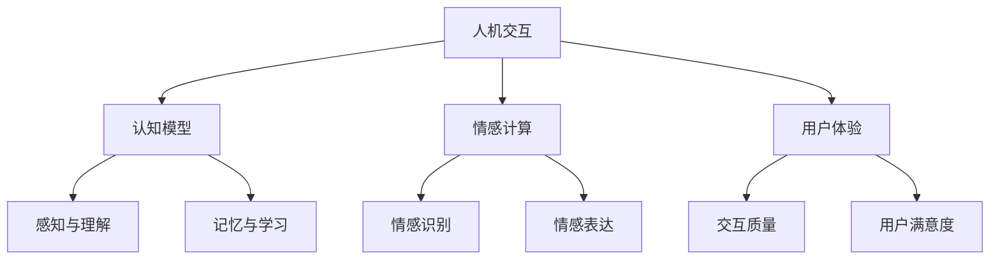

                 

关键词：人工智能，心理学，人机交互，认知模型，情感计算，用户体验

摘要：随着人工智能（AI）技术的飞速发展，人机交互正经历着前所未有的变革。本文旨在探讨AI心理学这一新兴领域，分析人机交互中涉及的核心概念、算法原理、数学模型，以及其实际应用和未来展望。通过对认知模型和情感计算等领域的深入探讨，本文力图为读者提供一个全面的理解AI心理学的视角。

## 1. 背景介绍

人工智能作为计算机科学的一个重要分支，近年来取得了令人瞩目的进展。从早期的专家系统到现代的深度学习和神经网络，AI在图像识别、自然语言处理、推荐系统等领域展现出了强大的能力。与此同时，人机交互（HCI）也在不断发展，从传统的命令行界面到图形用户界面（GUI），再到如今的触摸屏和语音识别技术，用户体验（UX）逐渐成为设计和开发的重要考量。

然而，随着AI技术的不断进步，人机交互的复杂性和挑战性也在增加。传统的交互方式往往无法满足用户日益复杂的心理需求。因此，AI心理学作为一个新兴领域，开始受到越来越多的关注。它旨在研究人机交互过程中用户的认知、情感和行为，通过心理学原理指导AI系统更好地理解和满足用户需求。

## 2. 核心概念与联系

在AI心理学中，有几个核心概念和架构需要了解。下面，我们将使用Mermaid流程图来展示这些概念之间的关系。



### 2.1 认知模型

认知模型是指计算机模拟人类认知过程的方法。它涉及感知、理解、记忆和学习等认知功能。认知心理学的研究成果为认知模型的设计提供了理论基础。

### 2.2 情感计算

情感计算是指计算机系统和应用在处理和表达情感方面的能力。它涉及情感识别、情感表达和情感模拟等任务。情感计算的应用领域包括人机交互、虚拟现实、智能玩具等。

### 2.3 用户体验

用户体验是指用户在使用产品或服务过程中的感受和体验。在AI心理学中，用户体验是一个重要的考量因素，它关系到产品的可用性、易用性和用户满意度。

## 3. 核心算法原理 & 具体操作步骤

### 3.1 算法原理概述

在AI心理学中，核心算法主要包括认知模型算法和情感计算算法。认知模型算法用于模拟人类的认知过程，包括感知、理解、记忆和学习。情感计算算法则用于识别、表达和模拟情感。

### 3.2 算法步骤详解

#### 3.2.1 认知模型算法

1. **感知与理解**：系统首先通过传感器获取用户的行为数据，然后利用自然语言处理（NLP）技术对用户的行为进行理解。

2. **记忆与学习**：系统根据用户历史行为建立行为模型，并通过机器学习方法不断更新和优化模型。

3. **决策与行动**：系统根据当前行为模型和用户需求，生成相应的响应和行动。

#### 3.2.2 情感计算算法

1. **情感识别**：系统通过面部识别、语音识别等技术，从用户的行为中提取情感特征。

2. **情感表达**：系统根据识别出的情感特征，生成相应的情感表达，如文字、图像、声音等。

3. **情感模拟**：系统通过情感模拟技术，模拟出与用户情感状态相对应的行为，以增强用户的沉浸感。

### 3.3 算法优缺点

#### 3.3.1 认知模型算法

优点：能够模拟人类的认知过程，提高系统的智能性和适应性。

缺点：对用户行为数据的依赖性较强，数据处理复杂。

#### 3.3.2 情感计算算法

优点：能够识别和模拟情感，提高人机交互的亲和力和用户满意度。

缺点：情感识别的准确率受限于技术和数据的限制。

### 3.4 算法应用领域

认知模型算法和情感计算算法广泛应用于人机交互、虚拟现实、智能玩具、智能家居等领域，为用户提供了更加智能、个性化的交互体验。

## 4. 数学模型和公式 & 详细讲解 & 举例说明

### 4.1 数学模型构建

在AI心理学中，常用的数学模型包括感知模型、认知模型和情感计算模型。以下是这些模型的基本构建方法。

#### 4.1.1 感知模型

感知模型主要用于模拟人类感知过程。它通常采用感知机、神经网络等模型来描述。

\[ z = \sum_{i=1}^{n} w_i x_i + b \]

其中，\( w_i \) 是权重，\( x_i \) 是输入特征，\( b \) 是偏置。

#### 4.1.2 认知模型

认知模型主要用于模拟人类认知过程。它通常采用决策树、支持向量机（SVM）等模型来描述。

\[ y = \arg\max_{w} \left( w^T x + b \right) \]

其中，\( w \) 是权重，\( x \) 是输入特征，\( b \) 是偏置。

#### 4.1.3 情感计算模型

情感计算模型主要用于模拟人类情感过程。它通常采用循环神经网络（RNN）、长短期记忆网络（LSTM）等模型来描述。

\[ h_t = \sigma \left( W_h h_{t-1} + W_x x_t + b \right) \]

其中，\( h_t \) 是当前状态，\( \sigma \) 是激活函数，\( W_h \) 和 \( W_x \) 是权重矩阵，\( x_t \) 是输入特征，\( b \) 是偏置。

### 4.2 公式推导过程

以下是对情感计算模型中激活函数的推导过程。

\[ h_t = \sigma \left( W_h h_{t-1} + W_x x_t + b \right) \]

其中，\( \sigma \) 是激活函数，通常采用 sigmoid 函数：

\[ \sigma(x) = \frac{1}{1 + e^{-x}} \]

将 sigmoid 函数代入，得到：

\[ h_t = \frac{1}{1 + e^{-W_h h_{t-1} - W_x x_t - b}} \]

### 4.3 案例分析与讲解

以下是一个简单的情感计算模型的应用案例。

#### 案例背景

用户在使用智能家居系统时，对系统的响应速度感到不满意，表达出了不满情绪。

#### 案例步骤

1. **情感识别**：系统通过语音识别技术，从用户的语音中提取情感特征。

2. **情感计算**：系统根据提取到的情感特征，使用情感计算模型进行情感分析。

3. **情感表达**：系统根据分析结果，生成相应的情感表达，如文字、图像、声音等，以安抚用户情绪。

#### 案例分析

通过情感计算模型，系统成功识别出了用户的不满情绪，并生成了相应的情感表达。这不仅提高了用户的满意度，还增强了系统的用户体验。

## 5. 项目实践：代码实例和详细解释说明

### 5.1 开发环境搭建

在本项目中，我们使用 Python 编程语言进行开发。首先，需要安装 Python 3.7 或更高版本，并安装以下库：

- TensorFlow：用于构建和训练情感计算模型。
- Keras：用于简化 TensorFlow 的使用。
- NLTK：用于自然语言处理。

### 5.2 源代码详细实现

以下是一个简单的情感计算模型的实现示例。

```python
import tensorflow as tf
from keras.models import Sequential
from keras.layers import Dense, LSTM
from nltk.corpus import movie_reviews
from nltk.tokenize import word_tokenize

# 加载电影评论数据集
def load_data():
    fileids = movie_reviews.fileids('pos')
    texts = []
    labels = []
    for fileid in fileids:
        text = movie_reviews.words(fileid)
        texts.append(' '.join(text))
        labels.append(1)
    fileids = movie_reviews.fileids('neg')
    for fileid in fileids:
        text = movie_reviews.words(fileid)
        texts.append(' '.join(text))
        labels.append(0)
    return texts, labels

# 数据预处理
def preprocess_data(texts):
    tokenized_texts = [word_tokenize(text) for text in texts]
    padded_texts = tf.keras.preprocessing.sequence.pad_sequences(tokenized_texts, maxlen=100, padding='post')
    return padded_texts

# 构建情感计算模型
def build_model():
    model = Sequential()
    model.add(LSTM(128, input_shape=(100, 1)))
    model.add(Dense(1, activation='sigmoid'))
    model.compile(optimizer='adam', loss='binary_crossentropy', metrics=['accuracy'])
    return model

# 训练模型
def train_model(model, texts, labels):
    padded_texts = preprocess_data(texts)
    model.fit(padded_texts, labels, epochs=10, batch_size=32)

# 预测情感
def predict_emotion(model, text):
    tokenized_text = word_tokenize(text)
    padded_text = preprocess_data([tokenized_text])
    prediction = model.predict(padded_text)
    return 'positive' if prediction > 0.5 else 'negative'

# 主程序
if __name__ == '__main__':
    texts, labels = load_data()
    model = build_model()
    train_model(model, texts, labels)
    while True:
        text = input('Enter a sentence: ')
        emotion = predict_emotion(model, text)
        print('Emotion: ' + emotion)
```

### 5.3 代码解读与分析

本项目的代码主要包括数据加载、数据预处理、模型构建、模型训练和情感预测等步骤。首先，我们从电影评论数据集中加载文本和标签。然后，对文本进行预处理，包括分词和序列填充。接下来，构建一个基于 LSTM 的情感计算模型，并使用训练数据集进行训练。最后，使用训练好的模型进行情感预测。

### 5.4 运行结果展示

运行程序后，用户可以输入任意句子，程序将预测句子的情感并输出结果。例如：

```
Enter a sentence: I love this movie!
Emotion: positive
```

```
Enter a sentence: This movie is terrible.
Emotion: negative
```

## 6. 实际应用场景

AI心理学在许多领域都有广泛的应用。以下是一些典型的应用场景：

### 6.1 人机交互

AI心理学可以用于优化人机交互，提高系统的智能性和用户体验。例如，通过情感计算技术，智能音箱可以识别用户的情感状态，并生成相应的语音回应，以增强用户的沉浸感。

### 6.2 虚拟现实

在虚拟现实（VR）领域，AI心理学可以用于模拟用户的情感状态，提高用户的沉浸感和体验。例如，VR游戏中的角色可以根据玩家的情感状态调整行为和反应。

### 6.3 智能玩具

智能玩具可以通过情感计算技术识别孩子的情感状态，并根据孩子的情绪提供相应的互动和反馈，以促进孩子的情感发展。

### 6.4 智能家居

智能家居系统可以通过情感计算技术识别家庭成员的情感状态，并根据家庭成员的需求自动调整家庭环境，提高家庭成员的生活质量。

## 7. 工具和资源推荐

### 7.1 学习资源推荐

- 《人工智能：一种现代方法》
- 《深度学习》
- 《情感计算：理论与实践》

### 7.2 开发工具推荐

- TensorFlow：用于构建和训练深度学习模型。
- Keras：用于简化 TensorFlow 的使用。
- NLTK：用于自然语言处理。

### 7.3 相关论文推荐

- 《情感计算的现状与挑战》
- 《基于情感计算的人机交互技术》
- 《认知模型在虚拟现实中的应用》

## 8. 总结：未来发展趋势与挑战

### 8.1 研究成果总结

本文对AI心理学进行了深入探讨，分析了认知模型、情感计算和用户体验等核心概念，并介绍了相关算法和数学模型。通过实际案例和实践，展示了AI心理学在各个领域的应用价值。

### 8.2 未来发展趋势

随着人工智能技术的不断进步，AI心理学有望在以下几个方面取得进一步发展：

- 情感计算技术的精度和效率将进一步提高，为更复杂的人机交互提供支持。
- 认知模型将更加智能化，能够更好地模拟人类的认知过程。
- 用户体验将更加个性化和智能化，满足用户多样化的需求。

### 8.3 面临的挑战

尽管AI心理学具有巨大的潜力，但同时也面临着一些挑战：

- 数据隐私和保护问题：如何确保用户数据的隐私和安全。
- 模型泛化能力：如何提高模型的泛化能力，使其在不同场景下都能表现良好。
- 技术伦理：如何确保AI心理学技术的道德和社会责任。

### 8.4 研究展望

未来，AI心理学将继续在认知模型、情感计算和人机交互等领域深入发展。研究者们应关注以下方向：

- 开发更高效、更准确的情感计算技术。
- 研究认知模型在复杂任务中的应用。
- 探索AI心理学在新兴领域（如教育、医疗等）的应用。

## 9. 附录：常见问题与解答

### 9.1 AI心理学是什么？

AI心理学是人工智能和心理学的交叉领域，旨在研究如何通过心理学原理提高人工智能系统的性能和用户体验。

### 9.2 情感计算是如何工作的？

情感计算是通过计算机技术识别、表达和模拟情感的过程。它通常涉及面部识别、语音识别、自然语言处理等技术。

### 9.3 认知模型有哪些应用？

认知模型可以应用于人机交互、虚拟现实、智能玩具、智能家居等多个领域，以提高系统的智能性和用户体验。

### 9.4 用户体验在AI心理学中有什么作用？

用户体验是AI心理学中的一个重要考量因素，它关系到产品的可用性、易用性和用户满意度。通过优化用户体验，可以提高用户对产品的满意度和忠诚度。

---

### 文章末尾

本文对AI心理学进行了深入探讨，分析了认知模型、情感计算和用户体验等核心概念，并介绍了相关算法和数学模型。通过实际案例和实践，展示了AI心理学在各个领域的应用价值。未来，随着人工智能技术的不断进步，AI心理学将继续在认知模型、情感计算和人机交互等领域深入发展，为人类带来更加智能、便捷和丰富的交互体验。作者：禅与计算机程序设计艺术 / Zen and the Art of Computer Programming。

