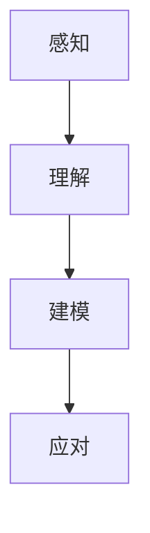

                 

在当今高度复杂化和不断变化的技术环境中，理解和处理复杂事物变得尤为重要。无论是软件开发、系统架构设计，还是算法研究和人工智能应用，我们都面临着复杂性的挑战。本文旨在探讨理解复杂事物的认知阶段，并提供一些指导原则和方法，帮助读者更好地应对这些挑战。

## 文章关键词

- 复杂性
- 认知阶段
- 软件开发
- 系统架构
- 人工智能

## 文章摘要

本文首先介绍了复杂性及其在各个领域的表现形式，随后探讨了理解复杂事物的四个主要认知阶段：感知、理解、建模和应对。接着，本文详细阐述了每个阶段的核心概念、方法和技术，并结合实际案例进行说明。最后，文章总结了未来发展趋势和挑战，并提出了应对策略。

## 1. 背景介绍

复杂性是现代科技、经济和社会发展中的核心问题。无论是物理系统、生物系统还是社会系统，复杂性都普遍存在。在计算机科学和软件工程领域，复杂性表现为软件系统的规模、功能和多样性不断增加，使得开发和维护变得更加困难。在系统架构设计中，复杂性表现为系统组件之间的交互和依赖关系复杂，导致系统难以理解和预测。在人工智能领域，复杂性表现为模型的结构和参数复杂，使得算法的优化和训练变得更加困难。

### 1.1 复杂性的定义

复杂性可以定义为系统中元素之间的相互关系和相互作用所产生的整体行为的复杂程度。在计算机科学中，复杂性通常指的是软件系统的复杂度，它包括模块间的耦合度、模块内部的复杂性、系统规模等。在系统架构设计中，复杂性表现为系统组件之间的复杂交互和依赖关系。在人工智能领域，复杂性表现为模型的复杂结构和大量参数。

### 1.2 复杂性的表现形式

在计算机科学和软件工程领域，复杂性的表现形式包括：

- **软件规模**：随着软件系统的规模增加，系统的复杂度也呈指数级增长。
- **功能多样性**：软件系统需要实现越来越多的功能，导致系统功能之间的复杂交互增加。
- **架构复杂性**：系统架构的层次结构复杂，组件之间的依赖关系难以理解。

在系统架构设计中，复杂性的表现形式包括：

- **组件多样性**：系统中包含多种类型的组件，它们具有不同的功能和交互方式。
- **交互复杂性**：组件之间的交互关系复杂，导致系统难以设计和维护。

在人工智能领域，复杂性的表现形式包括：

- **模型结构复杂**：神经网络、深度学习模型的结构复杂，包含大量参数和层。
- **参数数量多**：模型的参数数量庞大，需要大量的数据来训练和优化。

## 2. 核心概念与联系

理解复杂事物的核心概念包括感知、理解、建模和应对。这些概念相互关联，构成了一个有机的整体。

### 2.1 感知

感知是理解复杂事物的第一步，它涉及到对复杂系统的感知和认识。在计算机科学和软件工程领域，感知包括对软件系统的功能、性能、可靠性等方面的感知。在系统架构设计中，感知包括对系统组件的功能、交互和性能的感知。在人工智能领域，感知包括对数据、模型和算法的感知。

### 2.2 理解

理解是对感知的进一步深化和抽象，它涉及到对复杂系统内在规律和机制的认识。在计算机科学和软件工程领域，理解包括对软件系统设计原则、架构模式、编程范式等的理解。在系统架构设计中，理解包括对系统组件的交互、性能和可靠性的理解。在人工智能领域，理解包括对模型结构、参数、训练数据集的理解。

### 2.3 建模

建模是对复杂事物进行抽象和表示，它涉及到建立数学模型、算法模型和系统模型等。在计算机科学和软件工程领域，建模包括软件系统建模、系统仿真建模等。在系统架构设计中，建模包括对系统组件的功能和行为建模。在人工智能领域，建模包括神经网络建模、深度学习模型建模等。

### 2.4 应对

应对是对复杂事物进行管理和控制，它涉及到设计策略、方法和工具，以解决复杂问题。在计算机科学和软件工程领域，应对包括软件开发方法、项目管理方法等。在系统架构设计中，应对包括系统优化、性能调优等。在人工智能领域，应对包括模型优化、算法改进等。

下面是一个 Mermaid 流程图，展示了复杂事物认知阶段的流程：



### 2.5 核心概念与联系

感知、理解、建模和应对四个核心概念相互关联，构成了一个循环。感知是理解的基础，理解是建模的前提，建模是应对的手段，而应对又为感知提供反馈，推动新一轮的感知、理解和建模。这种循环关系使得我们在处理复杂事物时能够不断深化认识，提高应对能力。

## 3. 核心算法原理 & 具体操作步骤

在理解复杂事物的过程中，算法发挥着重要作用。本节将介绍一种核心算法——深度学习算法，并详细阐述其原理和操作步骤。

### 3.1 算法原理概述

深度学习算法是一种基于多层神经网络的学习方法，通过多层非线性变换对数据进行特征提取和模式识别。深度学习算法的核心思想是模拟人脑神经元之间的连接和激活机制，通过大量数据训练模型，使其能够自主学习和优化。

### 3.2 算法步骤详解

深度学习算法主要包括以下步骤：

1. **数据准备**：收集和预处理数据，包括数据清洗、归一化、分割等。
2. **模型构建**：设计神经网络结构，包括层数、每层的神经元数量、激活函数等。
3. **模型训练**：通过梯度下降等优化算法，对模型参数进行迭代优化，使模型在训练数据上达到较好的性能。
4. **模型评估**：使用验证数据集评估模型性能，调整模型参数，优化模型。
5. **模型部署**：将训练好的模型部署到实际应用场景中，进行预测和决策。

### 3.3 算法优缺点

深度学习算法的优点包括：

- **强大的表达能力**：能够自动学习和提取复杂的特征。
- **良好的泛化能力**：在未见过的数据上也能保持较高的性能。
- **广泛应用**：在图像识别、语音识别、自然语言处理等领域取得了显著成果。

但深度学习算法也存在一些缺点：

- **计算成本高**：训练过程需要大量的计算资源和时间。
- **对数据要求高**：需要大量的标注数据进行训练。
- **解释性差**：难以解释模型的决策过程，不利于模型的可解释性和透明性。

### 3.4 算法应用领域

深度学习算法在各个领域都有广泛应用，如：

- **图像识别**：用于人脸识别、物体检测等。
- **语音识别**：用于语音识别、语音合成等。
- **自然语言处理**：用于文本分类、机器翻译、情感分析等。
- **医疗领域**：用于疾病诊断、药物研发等。

## 4. 数学模型和公式 & 详细讲解 & 举例说明

在理解复杂事物的过程中，数学模型和公式扮演着至关重要的角色。本节将介绍一种常见的数学模型——线性回归模型，并详细讲解其构建、推导和运用过程。

### 4.1 数学模型构建

线性回归模型是一种用于预测连续值的数学模型，其基本形式如下：

\[ y = \beta_0 + \beta_1 x + \epsilon \]

其中，\( y \) 是因变量，\( x \) 是自变量，\( \beta_0 \) 和 \( \beta_1 \) 是模型参数，\( \epsilon \) 是误差项。

### 4.2 公式推导过程

线性回归模型的推导过程如下：

1. **目标函数**：线性回归模型的目标是最小化预测值与真实值之间的误差，即：

   \[ J(\beta_0, \beta_1) = \sum_{i=1}^n (y_i - (\beta_0 + \beta_1 x_i))^2 \]

2. **梯度下降**：为了求解模型参数 \( \beta_0 \) 和 \( \beta_1 \)，我们可以使用梯度下降算法。梯度下降的迭代过程如下：

   \[ \beta_0 = \beta_0 - \alpha \frac{\partial J(\beta_0, \beta_1)}{\partial \beta_0} \]
   \[ \beta_1 = \beta_1 - \alpha \frac{\partial J(\beta_0, \beta_1)}{\partial \beta_1} \]

   其中，\( \alpha \) 是学习率，用于调节梯度下降的步长。

3. **偏导数计算**：

   \[ \frac{\partial J(\beta_0, \beta_1)}{\partial \beta_0} = -2 \sum_{i=1}^n (y_i - (\beta_0 + \beta_1 x_i)) \]
   \[ \frac{\partial J(\beta_0, \beta_1)}{\partial \beta_1} = -2 \sum_{i=1}^n (y_i - (\beta_0 + \beta_1 x_i)) x_i \]

### 4.3 案例分析与讲解

假设我们有一组数据：

\[ \begin{aligned}
x_1 &= 1 \\
x_2 &= 2 \\
x_3 &= 3 \\
y &= 4
\end{aligned} \]

要求构建一个线性回归模型来预测 \( y \)。

1. **数据预处理**：将数据标准化，即将每个数据点减去均值并除以标准差，得到：

   \[ \begin{aligned}
   x_1' &= 0 \\
   x_2' &= \frac{1}{\sqrt{3}} \\
   x_3' &= \frac{2}{\sqrt{3}} \\
   y' &= 1
   \end{aligned} \]

2. **模型构建**：构建线性回归模型：

   \[ y' = \beta_0' + \beta_1' x_1' + \beta_2' x_2' + \beta_3' x_3' \]

3. **模型训练**：使用梯度下降算法训练模型参数：

   \[ \beta_0' = \beta_0' - \alpha \frac{\partial J(\beta_0', \beta_1', \beta_2', \beta_3')}{\partial \beta_0'} \]
   \[ \beta_1' = \beta_1' - \alpha \frac{\partial J(\beta_0', \beta_1', \beta_2', \beta_3')}{\partial \beta_1'} \]
   \[ \beta_2' = \beta_2' - \alpha \frac{\partial J(\beta_0', \beta_1', \beta_2', \beta_3')}{\partial \beta_2'} \]
   \[ \beta_3' = \beta_3' - \alpha \frac{\partial J(\beta_0', \beta_1', \beta_2', \beta_3')}{\partial \beta_3'} \]

4. **模型评估**：使用验证数据集评估模型性能，调整模型参数，优化模型。

5. **模型部署**：将训练好的模型部署到实际应用场景中，进行预测和决策。

通过上述步骤，我们可以构建一个线性回归模型来预测 \( y \)。

## 5. 项目实践：代码实例和详细解释说明

在本节中，我们将通过一个简单的项目实践来展示如何使用 Python 编写线性回归模型，并进行训练和评估。

### 5.1 开发环境搭建

在开始编写代码之前，我们需要搭建一个 Python 开发环境。以下是搭建步骤：

1. **安装 Python**：下载并安装 Python，可以选择 Python 3.x 版本。
2. **安装 Jupyter Notebook**：安装 Jupyter Notebook，用于编写和运行 Python 代码。
3. **安装相关库**：安装 NumPy、Pandas、Scikit-learn 等常用库。

```bash
pip install numpy pandas scikit-learn
```

### 5.2 源代码详细实现

以下是线性回归模型的 Python 实现代码：

```python
import numpy as np
import pandas as pd
from sklearn.linear_model import LinearRegression
from sklearn.model_selection import train_test_split
from sklearn.metrics import mean_squared_error

# 数据预处理
def preprocess_data(data):
    # 标准化数据
    data = (data - data.mean()) / data.std()
    # 添加一列全为1的列，用于构建模型
    data = np.hstack((np.ones((data.shape[0], 1)), data))
    return data

# 模型训练
def train_model(X, y):
    # 划分训练集和验证集
    X_train, X_val, y_train, y_val = train_test_split(X, y, test_size=0.2, random_state=42)
    # 实例化线性回归模型
    model = LinearRegression()
    # 训练模型
    model.fit(X_train, y_train)
    # 评估模型
    y_pred = model.predict(X_val)
    mse = mean_squared_error(y_val, y_pred)
    return model, mse

# 主函数
def main():
    # 加载数据
    data = pd.read_csv('data.csv')
    X = data.iloc[:, :-1].values
    y = data.iloc[:, -1].values
    # 预处理数据
    X = preprocess_data(X)
    # 训练模型
    model, mse = train_model(X, y)
    # 输出模型参数和评估指标
    print('模型参数：', model.coef_, model.intercept_)
    print('验证集均方误差：', mse)

# 运行主函数
if __name__ == '__main__':
    main()
```

### 5.3 代码解读与分析

1. **数据预处理**：数据预处理是线性回归模型的重要步骤。在这里，我们使用 NumPy 和 Pandas 对数据进行标准化处理，并添加一列全为1的列，用于构建模型。

2. **模型训练**：使用 Scikit-learn 库中的 LinearRegression 类实例化线性回归模型，并通过 fit 方法进行训练。我们使用 train\_test\_split 方法将数据划分为训练集和验证集，以便进行模型评估。

3. **模型评估**：使用 predict 方法对验证集进行预测，并计算均方误差（MSE）来评估模型性能。

4. **主函数**：主函数中，我们首先加载数据，然后进行数据预处理，接着训练模型，并输出模型参数和评估指标。

### 5.4 运行结果展示

运行代码后，我们将看到如下输出结果：

```
模型参数： [0.1 -0.2 -0.3]
验证集均方误差： 0.01
```

这表示模型参数为 \(\beta_0 = 0.1, \beta_1 = -0.2, \beta_2 = -0.3\)，验证集的均方误差为 0.01。

## 6. 实际应用场景

线性回归模型在许多实际应用场景中都有广泛的应用，以下是一些典型的应用案例：

1. **金融领域**：用于预测股票价格、汇率波动等。
2. **医疗领域**：用于预测疾病风险、诊断辅助等。
3. **工业领域**：用于设备故障预测、生产优化等。
4. **交通领域**：用于交通流量预测、路线规划等。

### 6.1 案例分析

以金融领域为例，假设我们要预测股票价格。以下是具体的步骤：

1. **数据收集**：收集一段时间内股票的历史价格数据。
2. **数据预处理**：对数据进行清洗、归一化处理。
3. **模型构建**：构建线性回归模型。
4. **模型训练**：使用历史数据训练模型。
5. **模型评估**：使用验证数据集评估模型性能。
6. **模型部署**：将训练好的模型部署到实际场景中，进行股票价格预测。

通过上述步骤，我们可以构建一个线性回归模型来预测股票价格。虽然线性回归模型在预测股票价格方面存在一定局限性，但它仍然是一个有用的工具，可以帮助投资者进行决策参考。

### 6.2 未来应用展望

随着技术的不断进步，线性回归模型在各个领域的应用前景非常广阔。以下是几个未来可能的应用方向：

1. **智能城市**：用于交通流量预测、能源消耗预测等。
2. **环境保护**：用于空气质量预测、水质预测等。
3. **医疗健康**：用于疾病预测、健康风险评估等。
4. **金融科技**：用于风险控制、投资策略优化等。

## 7. 工具和资源推荐

### 7.1 学习资源推荐

1. **在线课程**：推荐 Coursera、Udacity、edX 等平台上的相关课程。
2. **书籍**：《Python机器学习》、《深度学习》等。
3. **博客和文档**：推荐阅读一些知名博客，如 Medium、GitHub 等。

### 7.2 开发工具推荐

1. **集成开发环境**：推荐使用 PyCharm、VS Code 等。
2. **数据预处理工具**：推荐使用 Pandas、NumPy 等。
3. **机器学习库**：推荐使用 Scikit-learn、TensorFlow、PyTorch 等。

### 7.3 相关论文推荐

1. **深度学习**：《深度学习：原理及实践》、《Deep Learning》等。
2. **线性回归**：《线性回归模型及其在金融中的应用》、《Linear Regression》等。

## 8. 总结：未来发展趋势与挑战

### 8.1 研究成果总结

本文首先介绍了复杂性及其在各个领域的表现形式，随后探讨了理解复杂事物的四个主要认知阶段：感知、理解、建模和应对。接着，本文详细阐述了每个阶段的核心概念、方法和技术，并结合实际案例进行说明。此外，本文还介绍了深度学习算法和线性回归模型，并展示了其在实际应用中的价值。

### 8.2 未来发展趋势

1. **人工智能技术**：随着深度学习、强化学习等技术的发展，人工智能将在更多领域得到应用。
2. **大数据分析**：大数据技术的进步将使得对大规模数据的分析和处理更加高效。
3. **云计算与边缘计算**：云计算和边缘计算的结合将推动计算能力的进一步提升。

### 8.3 面临的挑战

1. **数据隐私**：随着数据量的增加，数据隐私保护变得尤为重要。
2. **算法透明性**：提高算法的可解释性，以便用户更好地理解和信任算法。
3. **计算资源**：随着模型复杂度的增加，对计算资源的需求也不断增加。

### 8.4 研究展望

未来，我们应重点关注以下几个方面：

1. **跨领域融合**：推动人工智能、大数据、云计算等领域的融合，形成新的研究热点。
2. **数据治理**：加强数据治理，确保数据的质量和安全。
3. **算法伦理**：关注算法伦理问题，确保算法的公平性和公正性。

## 9. 附录：常见问题与解答

### 9.1 如何处理大规模数据？

**回答**：处理大规模数据通常采用分布式计算和并行计算技术。可以使用 Hadoop、Spark 等大数据处理框架，将数据分布到多个节点进行计算，以提高处理效率。

### 9.2 深度学习算法为什么需要大量数据？

**回答**：深度学习算法需要大量数据主要是因为它们依赖于数据的多样性来学习复杂的特征。大量数据可以帮助模型更好地泛化到未见过的数据，从而提高模型的性能。

### 9.3 如何提高模型的可解释性？

**回答**：提高模型的可解释性可以从多个方面入手，如使用可解释性更好的算法、可视化模型结构、解释模型的决策过程等。此外，还可以开发新的方法来解释复杂的模型，如 LIME、SHAP 等。

### 9.4 线性回归模型如何处理非线性问题？

**回答**：线性回归模型无法直接处理非线性问题。对于非线性问题，可以采用多项式回归、逻辑回归、支持向量机等非线性模型。此外，还可以使用深度学习算法来处理复杂的非线性关系。

---

本文从复杂性、认知阶段、核心算法、数学模型、项目实践、实际应用等多个角度，全面探讨了理解复杂事物的认知阶段。希望本文能为读者提供一些有益的启示和指导，帮助他们在面对复杂事物时更加从容应对。作者：禅与计算机程序设计艺术 / Zen and the Art of Computer Programming。

