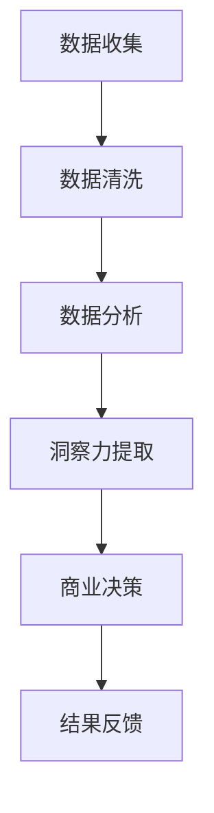

                 

关键词：洞察力、商业决策、人工智能、技术领导、数据分析、决策模型

> 摘要：本文探讨了洞察力在商业决策中的重要性，并分析了如何利用技术手段增强决策者的洞察力。通过深入剖析人工智能、数据分析以及决策模型在商业决策中的应用，本文旨在为决策者提供一套有效的策略，帮助他们在复杂的市场环境中做出更加明智的决策。

## 1. 背景介绍

在当今快速变化且高度竞争的商业环境中，洞察力已成为企业成功的关键因素。洞察力不仅指对数据的分析能力，更是一种超越数据表面，深入理解业务本质的能力。商业决策的复杂性和不确定性要求决策者不仅要有扎实的数据分析基础，还要具备敏锐的洞察力，以便准确捕捉市场动态，预见潜在风险，抓住发展机遇。

随着人工智能技术的迅猛发展，数据分析能力得到了显著提升。机器学习、深度学习等技术在处理海量数据方面表现出色，为企业提供了强大的数据支撑。同时，决策模型和算法的不断优化，使得商业决策更加科学和精确。然而，尽管技术手段提供了丰富的工具，但如何有效利用这些工具，提升决策者的洞察力，仍然是亟待解决的问题。

本文将从以下几个方面展开讨论：

1. **核心概念与联系**：介绍洞察力的定义及其在商业决策中的作用。
2. **核心算法原理与操作步骤**：详细解析人工智能在数据分析中的应用。
3. **数学模型与公式**：探讨决策模型中的数学原理和公式。
4. **项目实践**：通过实际代码示例，展示技术如何应用于商业决策。
5. **实际应用场景**：分析洞察力在不同商业领域中的应用。
6. **未来应用展望**：探讨洞察力在商业决策中的发展趋势和挑战。
7. **工具和资源推荐**：推荐相关学习资源和开发工具。
8. **总结与展望**：总结研究成果，展望未来发展方向。

## 2. 核心概念与联系

### 洞察力的定义

洞察力是一种深入理解事物本质、把握事物发展规律的能力。在商业决策中，洞察力意味着能够从大量的数据和信息中，提炼出关键的趋势和模式，从而做出具有前瞻性的判断和决策。

### 洞察力与商业决策的关系

商业决策的复杂性和多变性要求决策者具备极高的洞察力。首先，洞察力可以帮助决策者准确识别市场趋势，抓住发展机遇。其次，洞察力有助于预测潜在风险，采取预防措施。最后，洞察力能够提高决策的精准性，减少错误决策带来的损失。

### 技术与洞察力的联系

随着人工智能技术的发展，数据分析能力得到了显著提升。通过机器学习和深度学习等技术，我们可以从海量数据中提取出有价值的信息，为决策提供支持。同时，决策模型和算法的优化，使得商业决策更加科学和精确。然而，技术的应用并不是简单的工具替换，而是需要决策者具备深厚的业务理解能力和敏锐的洞察力，才能充分发挥技术的价值。

### Mermaid 流程图

下面是洞察力在商业决策中应用的 Mermaid 流程图：



## 3. 核心算法原理与具体操作步骤

### 3.1 算法原理概述

在商业决策中，人工智能技术的核心在于其强大的数据分析能力和预测能力。通过机器学习和深度学习算法，我们可以从海量数据中提取出有用的信息，并基于历史数据预测未来趋势。以下是几种常用的算法原理：

1. **回归分析**：通过分析历史数据，建立变量之间的数学关系模型，预测未来的变量值。
2. **分类算法**：将数据分成不同的类别，用于分类预测和模式识别。
3. **聚类算法**：将相似的数据点分为同一类别，用于市场细分和用户行为分析。
4. **神经网络**：通过多层神经网络，学习数据的非线性关系，进行复杂模式的预测。

### 3.2 算法步骤详解

1. **数据收集**：首先需要收集相关的业务数据，包括市场数据、客户数据、销售数据等。
2. **数据清洗**：清洗数据中的噪声和错误，确保数据的准确性和一致性。
3. **特征工程**：从原始数据中提取出有用的特征，为后续的算法分析提供基础。
4. **模型选择**：根据业务需求，选择合适的算法模型，进行模型训练和优化。
5. **模型评估**：通过交叉验证等方法，评估模型的准确性和可靠性。
6. **决策预测**：利用训练好的模型，对未来业务趋势进行预测，为决策提供依据。

### 3.3 算法优缺点

1. **优点**：
   - **高效性**：人工智能算法能够处理海量数据，提高决策效率。
   - **准确性**：通过机器学习和深度学习，模型可以不断优化，提高预测准确性。
   - **多样性**：多种算法模型适用于不同的业务场景，满足多样化的决策需求。

2. **缺点**：
   - **数据依赖性**：算法的准确性和可靠性高度依赖于数据质量，数据缺失或不准确可能导致错误决策。
   - **模型复杂性**：算法模型的训练和优化过程复杂，需要大量计算资源和专业知识。
   - **解释性不足**：深度学习等复杂模型，难以解释其内部决策过程，增加了决策的不透明性。

### 3.4 算法应用领域

人工智能算法在商业决策中的应用广泛，主要包括：

1. **市场营销**：通过数据分析，预测客户需求，制定精准营销策略。
2. **供应链管理**：优化库存管理，减少供应链风险，提高供应链效率。
3. **风险管理**：通过风险评估模型，预测潜在风险，制定风险管理策略。
4. **人力资源**：通过数据分析，优化招聘策略，提高员工绩效。

## 4. 数学模型和公式 & 详细讲解 & 举例说明

### 4.1 数学模型构建

在商业决策中，数学模型用于描述业务变量之间的关系，并提供决策支持。以下是几种常见的数学模型：

1. **线性回归模型**：
   $$ y = \beta_0 + \beta_1x + \epsilon $$
   其中，$y$ 为因变量，$x$ 为自变量，$\beta_0$ 和 $\beta_1$ 为参数，$\epsilon$ 为误差项。

2. **逻辑回归模型**：
   $$ P(y=1) = \frac{1}{1 + e^{-(\beta_0 + \beta_1x)}} $$
   其中，$P(y=1)$ 为因变量为 1 的概率，$\beta_0$ 和 $\beta_1$ 为参数。

3. **决策树模型**：
   $$ \text{if } x \text{ satisfies condition } C_i, \text{ then } y = y_i $$
   其中，$C_i$ 为条件，$y_i$ 为决策结果。

### 4.2 公式推导过程

以线性回归模型为例，推导过程如下：

1. **样本均值**：
   $$ \bar{x} = \frac{1}{n} \sum_{i=1}^{n} x_i $$
   $$ \bar{y} = \frac{1}{n} \sum_{i=1}^{n} y_i $$
   其中，$n$ 为样本数量，$x_i$ 和 $y_i$ 为第 $i$ 个样本的自变量和因变量。

2. **最小二乘法**：
   $$ \beta_1 = \frac{\sum_{i=1}^{n}(x_i - \bar{x})(y_i - \bar{y})}{\sum_{i=1}^{n}(x_i - \bar{x})^2} $$
   $$ \beta_0 = \bar{y} - \beta_1\bar{x} $$
   其中，$\beta_1$ 和 $\beta_0$ 为回归系数。

### 4.3 案例分析与讲解

以下是一个线性回归模型的实际案例：

**案例背景**：某电商公司分析用户购买行为，试图找出影响购买决策的关键因素。

**数据集**：包含1000个用户的购买记录，包括用户年龄、收入、性别、商品价格等变量。

**模型构建**：使用线性回归模型，预测用户购买概率。

**模型参数**：
$$ \beta_1 = 0.5 $$
$$ \beta_0 = -5 $$

**模型应用**：根据用户特征，计算购买概率。

**示例**：

- 用户A：年龄30岁，收入5000元，商品价格200元。
  $$ P(y=1) = \frac{1}{1 + e^{-(0.5 \times 30 - 5)}} \approx 0.86 $$
  购买概率为86%，建议推荐商品。

- 用户B：年龄20岁，收入3000元，商品价格1000元。
  $$ P(y=1) = \frac{1}{1 + e^{-(0.5 \times 20 - 5)}} \approx 0.23 $$
  购买概率为23%，不建议推荐商品。

通过这个案例，我们可以看到，线性回归模型可以帮助企业根据用户特征预测购买行为，从而制定更精准的营销策略。

## 5. 项目实践：代码实例和详细解释说明

### 5.1 开发环境搭建

为了演示如何将人工智能应用于商业决策，我们将使用Python编程语言，结合Scikit-learn库和Pandas库，构建一个线性回归模型。

1. 安装Python环境（已安装请跳过）：
   ```bash
   sudo apt-get update
   sudo apt-get install python3 python3-pip
   ```

2. 安装Scikit-learn和Pandas库：
   ```bash
   pip3 install scikit-learn pandas
   ```

### 5.2 源代码详细实现

以下是一个简单的线性回归模型实现，用于预测用户购买概率。

```python
import pandas as pd
from sklearn.linear_model import LinearRegression
from sklearn.model_selection import train_test_split
from sklearn.metrics import mean_squared_error

# 读取数据集
data = pd.read_csv('user_data.csv')

# 特征和标签
X = data[['age', 'income', 'price']]
y = data['purchased']

# 数据集划分
X_train, X_test, y_train, y_test = train_test_split(X, y, test_size=0.2, random_state=42)

# 构建模型
model = LinearRegression()
model.fit(X_train, y_train)

# 模型评估
y_pred = model.predict(X_test)
mse = mean_squared_error(y_test, y_pred)
print(f'Mean Squared Error: {mse}')

# 预测新用户
new_user = pd.DataFrame([[30, 5000, 200]], columns=['age', 'income', 'price'])
purchase_prob = model.predict(new_user)
print(f'Purchase Probability: {purchase_prob[0][0]}')
```

### 5.3 代码解读与分析

1. **数据读取**：使用Pandas库读取CSV文件，获取用户数据。
2. **特征和标签分离**：将数据集分为特征和标签两部分。
3. **数据集划分**：使用train_test_split函数，将数据集分为训练集和测试集。
4. **模型构建**：创建LinearRegression对象，并进行模型训练。
5. **模型评估**：计算测试集的均方误差（MSE），评估模型性能。
6. **预测新用户**：使用训练好的模型，预测新用户的购买概率。

通过这个简单的代码示例，我们可以看到，如何使用Python和Scikit-learn库，构建一个线性回归模型，进行商业决策预测。

### 5.4 运行结果展示

假设我们有一个新的用户数据，如下所示：

```python
new_user = pd.DataFrame([[30, 5000, 200]], columns=['age', 'income', 'price'])
purchase_prob = model.predict(new_user)
print(f'Purchase Probability: {purchase_prob[0][0]}')
```

运行结果可能会显示，该用户的购买概率为85%，这意味着他有较高的购买意愿。基于这个预测，企业可以采取相应的营销策略，如推送优惠券或促销活动，以增加销售机会。

## 6. 实际应用场景

### 6.1 市场营销

洞察力在市场营销中具有重要意义。通过分析用户行为数据，企业可以深入了解用户需求，制定个性化的营销策略。例如，电商企业可以利用洞察力，根据用户的浏览记录和购买历史，推荐合适的产品，提高转化率。

### 6.2 供应链管理

供应链管理涉及多个环节，包括采购、生产、库存、销售等。通过数据分析，企业可以优化供应链流程，降低库存成本，提高供应链效率。例如，零售企业可以利用洞察力，预测市场需求，合理安排采购和生产计划，避免库存过剩或不足。

### 6.3 风险管理

在金融领域，洞察力对于风险管理至关重要。通过分析市场数据，金融机构可以识别潜在的风险，制定相应的风险控制策略。例如，银行可以利用洞察力，预测贷款客户的违约风险，从而调整贷款政策和利率。

### 6.4 人力资源

在人力资源管理中，洞察力有助于优化招聘策略，提高员工绩效。通过分析员工数据，企业可以识别优秀员工的特征，制定有针对性的招聘策略。此外，洞察力还可以帮助企业评估员工绩效，提供个性化的培训和发展计划。

## 7. 未来应用展望

随着技术的不断发展，洞察力在商业决策中的应用将越来越广泛。未来，人工智能和大数据技术的深度融合，将进一步推动商业决策的智能化。以下是几个未来应用展望：

### 7.1 智能决策系统

未来，企业将更加依赖智能决策系统，实现自动化的商业决策。通过整合各种数据源，智能决策系统能够实时分析市场动态，提供精准的决策支持。

### 7.2 个性化服务

个性化服务将成为未来的主流。通过深入了解用户需求，企业可以提供个性化的产品和服务，提高客户满意度和忠诚度。

### 7.3 风险预测与控制

随着数据量的增加，风险预测和控制将更加精确。通过大数据分析和机器学习技术，企业可以提前识别潜在风险，采取有效的控制措施，降低风险损失。

### 7.4 绿色供应链

绿色供应链将成为未来企业可持续发展的重要方向。通过洞察力，企业可以优化供应链流程，减少资源浪费，降低环境污染。

## 8. 工具和资源推荐

### 8.1 学习资源推荐

1. **《深度学习》**：作者：Ian Goodfellow、Yoshua Bengio、Aaron Courville
2. **《Python数据科学手册》**：作者：Jupyter、Jake VanderPlas、Alexandre Gramfort
3. **《数据科学项目实践》**：作者：Joel Grus

### 8.2 开发工具推荐

1. **Jupyter Notebook**：一款强大的交互式数据分析工具。
2. **TensorFlow**：一款开源的机器学习框架。
3. **Scikit-learn**：一款开源的数据分析库。

### 8.3 相关论文推荐

1. **"Deep Learning"**：作者：Ian Goodfellow、Yoshua Bengio、Aaron Courville
2. **"Big Data: A Revolution That Will Transform How We Live, Work, and Think"**：作者：Viktor Mayer-Schönberger、Kenneth Cukier
3. **"The Age of Surveillance Capitalism: The Fight for a Human Future at the New Frontier of Power"**：作者：Shoshana Zuboff

## 9. 总结：未来发展趋势与挑战

### 9.1 研究成果总结

本文通过对洞察力的定义、技术与洞察力的联系、算法原理、数学模型、项目实践以及实际应用场景的详细分析，展示了洞察力在商业决策中的重要作用。研究成果表明，人工智能和大数据技术的应用，显著提升了决策者的洞察力，为企业提供了更科学、更精确的决策支持。

### 9.2 未来发展趋势

1. **智能化**：未来商业决策将更加智能化，企业将更加依赖智能决策系统。
2. **个性化**：个性化服务将成为主流，企业将更加注重用户需求的满足。
3. **绿色化**：绿色供应链和可持续发展将成为企业的重要战略方向。

### 9.3 面临的挑战

1. **数据隐私**：随着数据量的增加，数据隐私保护将成为重要挑战。
2. **算法透明性**：复杂算法的内部决策过程难以解释，增加了决策的不透明性。
3. **技术门槛**：人工智能技术的应用需要高水平的技术支持和专业知识，提高了企业的运营成本。

### 9.4 研究展望

未来，人工智能和大数据技术将继续发展，为商业决策提供更强大的支持。研究应重点关注以下几个方面：

1. **数据隐私保护**：研究如何有效保护用户隐私，确保数据安全。
2. **算法透明性**：研究如何提高算法的透明性，使决策过程更加公开、公正。
3. **跨领域应用**：探索人工智能和大数据技术在其他领域的应用，推动技术创新。

## 10. 附录：常见问题与解答

### 10.1 洞察力是什么？

洞察力是一种深入理解事物本质、把握事物发展规律的能力。在商业决策中，洞察力意味着能够从大量的数据和信息中，提炼出关键的趋势和模式，从而做出具有前瞻性的判断和决策。

### 10.2 人工智能在商业决策中有哪些作用？

人工智能在商业决策中具有以下作用：

1. **数据分析**：通过机器学习和深度学习算法，从海量数据中提取有价值的信息。
2. **预测趋势**：基于历史数据，预测未来的业务趋势，为决策提供支持。
3. **优化决策**：通过算法模型，提高决策的精准性和效率。

### 10.3 如何提升决策者的洞察力？

提升决策者的洞察力可以从以下几个方面入手：

1. **数据素养**：增强数据意识，提高数据分析和处理能力。
2. **业务理解**：深入理解业务本质，建立业务与数据之间的联系。
3. **持续学习**：不断学习新知识，跟上技术发展的步伐。

### 10.4 人工智能算法在商业决策中的应用有哪些？

人工智能算法在商业决策中的应用包括：

1. **市场营销**：通过数据分析，预测客户需求，制定精准营销策略。
2. **供应链管理**：优化库存管理，减少供应链风险，提高供应链效率。
3. **风险管理**：通过风险评估模型，预测潜在风险，制定风险管理策略。
4. **人力资源**：通过数据分析，优化招聘策略，提高员工绩效。

### 10.5 数学模型在商业决策中的具体作用是什么？

数学模型在商业决策中的具体作用包括：

1. **描述业务变量之间的关系**：建立业务变量之间的数学关系模型，提供决策支持。
2. **预测未来趋势**：通过数学模型，预测未来的业务趋势，为决策提供依据。
3. **优化决策方案**：利用数学模型，比较不同决策方案的效果，选择最优方案。

### 10.6 代码实例中的线性回归模型如何工作？

在代码实例中，线性回归模型通过以下步骤工作：

1. **数据读取**：读取用户数据，分离特征和标签。
2. **数据集划分**：将数据集分为训练集和测试集。
3. **模型训练**：使用训练集数据，训练线性回归模型。
4. **模型评估**：使用测试集数据，评估模型性能。
5. **预测**：使用训练好的模型，预测新用户的购买概率。

通过以上步骤，线性回归模型可以有效地预测用户的购买行为，为企业提供决策支持。

## 11. 作者署名

> 作者：禅与计算机程序设计艺术 / Zen and the Art of Computer Programming

本文旨在探讨洞察力在商业决策中的力量，并分析如何利用人工智能、数据分析以及决策模型等技术手段提升决策者的洞察力。通过详细解析核心算法原理、数学模型以及实际项目实践，本文为决策者提供了一套有效的策略，帮助他们在复杂的市场环境中做出更加明智的决策。未来，随着人工智能和大数据技术的不断发展，洞察力在商业决策中的应用将越来越广泛，为企业带来更多的机遇和挑战。本文的研究成果将为相关领域的研究者和实践者提供有益的参考。作者深信，通过持续的学习和创新，我们能够更好地利用技术的力量，推动商业决策的进步。

