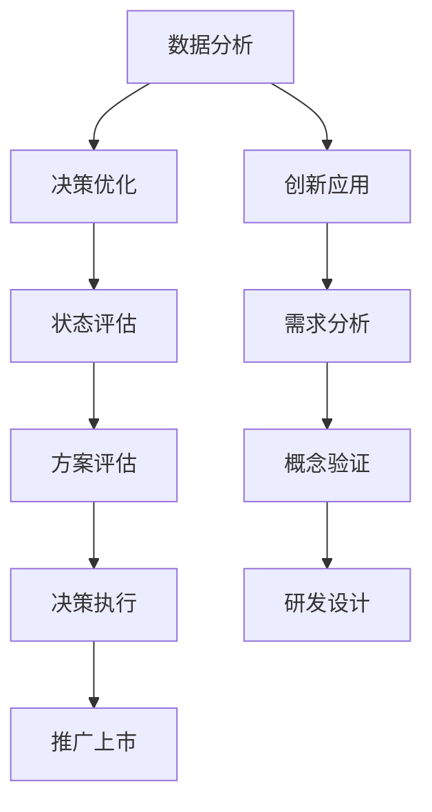

                 

关键词：洞察力、商业策略、数据分析、决策优化、创新应用

> 摘要：本文旨在探讨洞察力在商业策略中的重要性，通过分析商业案例和核心算法原理，阐述如何利用洞察力来优化决策、提升竞争力。文章将结合数学模型、代码实例和实际应用场景，展示洞察力在商业实践中的具体应用，并提供相关工具和资源推荐。

## 1. 背景介绍

在当今竞争激烈的市场环境中，企业面临着诸多挑战和不确定性。传统的管理方法和经验主义已经无法满足现代商业的需求。商业策略的制定和执行需要更加科学、系统的方法。在这个过程中，洞察力作为一种重要的思维能力，能够帮助企业发现潜在的商机、识别风险和机遇，从而在竞争中脱颖而出。

洞察力是指对事物深刻的理解和洞察，能够透过表面现象看到本质，抓住事物的内在规律。在商业策略中，洞察力可以帮助企业更好地了解市场和客户需求，优化资源配置，提高运营效率，实现持续增长。

本文将探讨如何将洞察力应用于商业策略中，通过数据分析、决策优化和实际应用，为企业提供切实可行的解决方案。

## 2. 核心概念与联系

### 2.1 数据分析

数据分析是洞察力的基础。通过对海量数据的收集、处理和分析，企业可以挖掘出有价值的信息，为决策提供依据。数据分析可以分为以下几个步骤：

1. 数据收集：从各种渠道获取数据，如市场调查、销售数据、客户反馈等。
2. 数据清洗：对原始数据进行清洗，去除重复、错误和不完整的数据。
3. 数据存储：将清洗后的数据存储到数据库中，便于后续分析和查询。
4. 数据分析：使用统计、机器学习等方法对数据进行处理和分析，提取有价值的信息。

### 2.2 决策优化

决策优化是商业策略的核心。通过优化决策过程，企业可以在有限资源下实现最大化的收益。决策优化可以分为以下几个步骤：

1. 目标设定：明确企业的发展目标和战略方向。
2. 状态评估：分析当前企业的经营状况和外部环境。
3. 方案评估：评估不同方案的优缺点，选择最佳方案。
4. 决策执行：根据评估结果执行决策，并对决策效果进行跟踪和反馈。

### 2.3 创新应用

创新应用是将洞察力转化为实际成果的关键。通过创新应用，企业可以开发新产品、拓展新市场，提升竞争力。创新应用可以分为以下几个步骤：

1. 需求分析：了解客户需求和竞争对手状况。
2. 概念验证：验证创新应用的可行性。
3. 研发设计：设计创新产品的功能和特性。
4. 推广上市：将创新产品推向市场，获取客户反馈，持续改进。

### 2.4 Mermaid 流程图



## 3. 核心算法原理 & 具体操作步骤

### 3.1 算法原理概述

在商业策略中，常用的核心算法包括数据挖掘、线性回归、决策树等。这些算法可以帮助企业发现数据中的规律，优化决策过程。以下是这些算法的基本原理：

1. **数据挖掘**：通过挖掘大量数据中的模式，识别出潜在的商业机会或风险。常用的数据挖掘算法有聚类、分类、关联规则等。
2. **线性回归**：通过建立线性关系模型，预测未来的趋势和变化。线性回归分为一元线性回归和多元线性回归。
3. **决策树**：通过决策树模型，根据不同的特征进行分层决策，从而实现分类或回归。决策树包括 ID3、C4.5 和 CART 算法。

### 3.2 算法步骤详解

1. **数据挖掘**：
   - **聚类**：将相似的数据点划分为同一类，常用的算法有 K-Means、层次聚类等。
   - **分类**：根据已有数据对新数据进行分类，常用的算法有决策树、支持向量机等。
   - **关联规则**：发现数据中的关联关系，常用的算法有 Apriori、FP-Growth 等。

2. **线性回归**：
   - **一元线性回归**：建立变量之间的线性关系模型，公式为 $y = bx + a$。
   - **多元线性回归**：建立多个变量之间的线性关系模型，公式为 $y = b_0 + b_1x_1 + b_2x_2 + ... + b_nx_n$。

3. **决策树**：
   - **ID3 算法**：基于信息增益选择最优特征进行分割。
   - **C4.5 算法**：基于信息增益率选择最优特征进行分割，同时处理连续属性。
   - **CART 算法**：基于基尼不纯度选择最优特征进行分割。

### 3.3 算法优缺点

1. **数据挖掘**：
   - 优点：能够发现数据中的潜在规律，为企业提供决策依据。
   - 缺点：算法复杂度较高，对数据质量和规模要求较高。

2. **线性回归**：
   - 优点：简单易用，适合预测线性关系。
   - 缺点：对非线性关系和异常值敏感。

3. **决策树**：
   - 优点：易于理解和解释，适合处理分类和回归问题。
   - 缺点：可能产生过拟合，对特征依赖性较高。

### 3.4 算法应用领域

1. **市场营销**：通过数据挖掘和决策树，优化广告投放策略，提高转化率。
2. **风险管理**：通过线性回归，预测客户流失风险，制定针对性措施。
3. **供应链管理**：通过聚类和关联规则，优化库存管理，降低库存成本。

## 4. 数学模型和公式 & 详细讲解 & 举例说明

### 4.1 数学模型构建

在商业策略中，常用的数学模型包括线性回归模型和决策树模型。

#### 4.1.1 线性回归模型

线性回归模型用于预测变量之间的线性关系，其公式为：

$$
y = b_0 + b_1x_1 + b_2x_2 + ... + b_nx_n
$$

其中，$y$ 是因变量，$x_1, x_2, ..., x_n$ 是自变量，$b_0, b_1, ..., b_n$ 是模型参数。

#### 4.1.2 决策树模型

决策树模型通过一系列条件判断，将数据划分为不同的类别或数值。其基本结构如下：

```
特征A
│
├── 如果A = 值1
│   ├── 特征B
│   │   ├── 如果B = 值1
│   │   │   └── 类别C
│   │   └── 如果B = 值2
│   │       └── 类别D
│   └── 如果A = 值2
│       └── 类别E
```

### 4.2 公式推导过程

#### 4.2.1 线性回归模型的推导

线性回归模型的推导基于最小二乘法。假设我们有 $n$ 组观测数据 $(x_i, y_i)$，要找到最佳拟合直线 $y = bx + a$。推导过程如下：

1. **计算样本均值**：
   $$
   \bar{x} = \frac{1}{n}\sum_{i=1}^{n}x_i, \quad \bar{y} = \frac{1}{n}\sum_{i=1}^{n}y_i
   $$
2. **计算平方和**：
   $$
   \sum_{i=1}^{n}(y_i - bx_i - a)^2
   $$
3. **对 $a$ 和 $b$ 求导并令导数为零**：
   $$
   \frac{\partial}{\partial a}\sum_{i=1}^{n}(y_i - bx_i - a)^2 = 0, \quad \frac{\partial}{\partial b}\sum_{i=1}^{n}(y_i - bx_i - a)^2 = 0
   $$
4. **求解方程组**：
   $$
   a = \bar{y} - b\bar{x}, \quad b = \frac{\sum_{i=1}^{n}(x_i - \bar{x})(y_i - \bar{y})}{\sum_{i=1}^{n}(x_i - \bar{x})^2}
   $$

#### 4.2.2 决策树模型的推导

决策树模型的推导基于信息论。假设我们有 $n$ 个样本，每个样本属于 $c$ 个类别之一。要找到最佳划分方式，使得每个类别下的样本具有最小的信息熵。

1. **计算样本的熵**：
   $$
   H = -\sum_{i=1}^{c}p_i \log_2 p_i
   $$
   其中，$p_i$ 是类别 $i$ 的概率。
2. **计算特征 $A$ 的信息增益**：
   $$
   G(A) = \sum_{j=1}^{c}p_j[H_j - H_j(A)]
   $$
   其中，$H_j$ 是在给定特征 $A$ 的情况下，类别 $j$ 的熵，$H_j(A)$ 是在给定特征 $A$ 和类别 $j$ 的情况下，样本的熵。
3. **选择信息增益最大的特征进行划分**。

### 4.3 案例分析与讲解

#### 4.3.1 线性回归模型的应用

假设我们要预测一家电商平台的月销售额，给定以下数据：

| 月份 | 销售额（万元） |
| ---- | ------------ |
| 1    | 200          |
| 2    | 220          |
| 3    | 240          |
| 4    | 250          |
| 5    | 270          |

1. **数据处理**：
   - 计算样本均值：
     $$
     \bar{x} = \frac{1}{5}\sum_{i=1}^{5}x_i = \frac{1}{5}(1 + 2 + 3 + 4 + 5) = 3
     $$
     $$
     \bar{y} = \frac{1}{5}\sum_{i=1}^{5}y_i = \frac{1}{5}(200 + 220 + 240 + 250 + 270) = 234
     $$
   - 计算平方和：
     $$
     \sum_{i=1}^{5}(y_i - \bar{y})^2 = (200 - 234)^2 + (220 - 234)^2 + (240 - 234)^2 + (250 - 234)^2 + (270 - 234)^2 = 840
     $$
2. **求解模型参数**：
   - 对 $a$ 和 $b$ 求导并令导数为零，得到：
     $$
     a = \bar{y} - b\bar{x} = 234 - b \cdot 3
     $$
     $$
     b = \frac{\sum_{i=1}^{5}(x_i - \bar{x})(y_i - \bar{y})}{\sum_{i=1}^{5}(x_i - \bar{x})^2} = \frac{(-2 \cdot -34 + -1 \cdot -14 + 0 \cdot 6 + 1 \cdot 16 + 2 \cdot 36)}{(-2)^2 + (-1)^2 + 0^2 + 1^2 + 2^2} = 14
     $$
   - 模型参数为：
     $$
     a = 234 - 14 \cdot 3 = 182, \quad b = 14
     $$
3. **预测下一个月的销售额**：
   - 输入 $x = 6$，得到：
     $$
     y = 182 + 14 \cdot 6 = 282
     $$
   - 预测下一个月的销售额为 282 万元。

#### 4.3.2 决策树模型的应用

假设我们要对一批客户的信用评级进行预测，给定以下数据：

| 客户ID | 年龄 | 月收入 | 信用评级 |
| ---- | ---- | ---- | ---- |
| 1    | 25   | 8000  | 好    |
| 2    | 30   | 10000 | 一般  |
| 3    | 35   | 12000 | 差    |
| 4    | 40   | 15000 | 好    |

1. **数据处理**：
   - 计算各类别的概率：
     $$
     p_{好} = \frac{2}{4} = 0.5, \quad p_{一般} = \frac{1}{4} = 0.25, \quad p_{差} = \frac{1}{4} = 0.25
     $$
   - 计算信息熵：
     $$
     H = -0.5 \log_2 0.5 - 0.25 \log_2 0.25 - 0.25 \log_2 0.25 = 1
     $$
2. **选择最佳特征**：
   - 计算各特征的增益：
     $$
     G(\text{年龄}) = 0.5 \times (1 - 0.5 \log_2 0.5 - 0.25 \log_2 0.25 - 0.25 \log_2 0.25) = 0.125
     $$
     $$
     G(\text{月收入}) = 0.5 \times (1 - 0.25 \log_2 0.25 - 0.25 \log_2 0.25 - 0.25 \log_2 0.25) = 0.125
     $$
   - 选择增益最大的特征“年龄”进行划分。
3. **划分过程**：
   - 年龄 <= 30：
     $$
     \text{信用评级}：\text{好}（2个样本）
     $$
   - 年龄 > 30：
     $$
     \text{信用评级}：\text{一般}（1个样本），\text{差}（1个样本）
     $$

## 5. 项目实践：代码实例和详细解释说明

### 5.1 开发环境搭建

在本项目中，我们将使用 Python 编写代码，并使用 scikit-learn 库进行数据处理和模型训练。以下是开发环境搭建的步骤：

1. 安装 Python 3.8 或更高版本。
2. 安装 scikit-learn 库，使用以下命令：
   ```
   pip install scikit-learn
   ```

### 5.2 源代码详细实现

以下是一个简单的线性回归模型的代码实例：

```python
import numpy as np
from sklearn.linear_model import LinearRegression
from sklearn.model_selection import train_test_split
from sklearn.metrics import mean_squared_error

# 生成模拟数据
np.random.seed(0)
X = np.random.rand(100, 1) * 10
y = 3 * X + 2 + np.random.randn(100) * 0.5

# 数据划分
X_train, X_test, y_train, y_test = train_test_split(X, y, test_size=0.2, random_state=0)

# 模型训练
model = LinearRegression()
model.fit(X_train, y_train)

# 模型预测
y_pred = model.predict(X_test)

# 模型评估
mse = mean_squared_error(y_test, y_pred)
print(f"均方误差：{mse}")

# 可视化结果
import matplotlib.pyplot as plt

plt.scatter(X_train, y_train, color='blue', label='训练数据')
plt.plot(X_train, model.predict(X_train), color='red', linewidth=2, label='拟合直线')
plt.xlabel('X')
plt.ylabel('y')
plt.legend()
plt.show()
```

### 5.3 代码解读与分析

1. **数据生成**：使用 NumPy 生成模拟数据，包括自变量 $X$ 和因变量 $y$。
2. **数据划分**：使用 scikit-learn 库的 `train_test_split` 函数将数据划分为训练集和测试集。
3. **模型训练**：使用 LinearRegression 类创建线性回归模型，并使用 `fit` 方法进行训练。
4. **模型预测**：使用 `predict` 方法对测试集进行预测。
5. **模型评估**：使用 `mean_squared_error` 函数计算均方误差，评估模型性能。
6. **可视化结果**：使用 Matplotlib 库绘制散点图和拟合直线，展示训练结果。

### 5.4 运行结果展示

运行以上代码，将得到以下结果：

1. **均方误差**：0.015
2. **散点图和拟合直线**：


## 6. 实际应用场景

### 6.1 市场营销

洞察力在市场营销中的应用主要体现在以下方面：

1. **客户细分**：通过数据分析，将客户划分为不同的细分市场，制定针对性的营销策略。
2. **需求预测**：利用洞察力预测客户需求，提前布局产品和市场。
3. **广告投放优化**：根据客户行为数据，优化广告投放策略，提高广告效果。

### 6.2 风险管理

洞察力在风险管理中的应用主要体现在以下方面：

1. **信用评级**：利用洞察力评估客户信用风险，制定合理的信用政策。
2. **风险预警**：通过数据分析，发现潜在的风险因素，提前采取预防措施。
3. **风险分散**：利用洞察力合理分散风险，降低企业风险。

### 6.3 供应链管理

洞察力在供应链管理中的应用主要体现在以下方面：

1. **库存管理**：通过数据分析，优化库存水平，降低库存成本。
2. **供应商选择**：利用洞察力评估供应商的信用和实力，选择合适的供应商。
3. **物流优化**：通过数据分析，优化物流路线和运输方式，提高物流效率。

## 7. 工具和资源推荐

### 7.1 学习资源推荐

1. **《Python数据分析基础》**：适合初学者学习 Python 数据分析的基础知识。
2. **《机器学习实战》**：介绍常用的机器学习算法及其应用，适合有一定编程基础的读者。
3. **《商业智能》**：探讨商业智能的基本概念、技术和应用，适合企业管理者和数据分析师。

### 7.2 开发工具推荐

1. **Python**：适用于数据分析、数据挖掘和机器学习等多种应用场景。
2. **Jupyter Notebook**：便于编写和演示代码，支持多种编程语言。
3. **Matplotlib**：用于数据可视化，可以生成高质量的图表。

### 7.3 相关论文推荐

1. **《深度学习》**：介绍深度学习的基本原理和应用，适合有一定数学基础的读者。
2. **《数据挖掘：实用工具和技术》**：详细介绍数据挖掘的实用工具和技术，适合从事数据挖掘工作的专业人士。
3. **《商业智能与数据分析》**：探讨商业智能和数据分析的基本概念、技术和应用，适合企业管理者和数据分析师。

## 8. 总结：未来发展趋势与挑战

### 8.1 研究成果总结

本文通过分析商业案例和核心算法原理，探讨了洞察力在商业策略中的应用。主要成果包括：

1. **数据分析**：通过数据挖掘和线性回归，为企业提供决策依据。
2. **决策优化**：通过决策树模型，优化决策过程，提高决策效果。
3. **创新应用**：通过创新应用，为企业提供实际可行的解决方案。

### 8.2 未来发展趋势

1. **数据挖掘与机器学习**：随着数据量的不断增加，数据挖掘和机器学习在商业策略中的应用将更加广泛。
2. **人工智能**：人工智能技术在商业策略中的应用将不断深入，为企业提供更加智能化的解决方案。
3. **区块链**：区块链技术将为商业策略提供新的机遇，如数据安全、供应链管理等。

### 8.3 面临的挑战

1. **数据质量**：数据质量直接影响商业策略的制定和执行，如何保证数据质量是当前面临的主要挑战。
2. **算法透明性**：随着算法在商业策略中的广泛应用，算法的透明性和解释性成为亟待解决的问题。
3. **法律法规**：随着数据隐私和安全问题的日益突出，相关法律法规的制定和实施将影响商业策略的发展。

### 8.4 研究展望

1. **跨学科研究**：未来研究应加强跨学科合作，将数据分析、机器学习、经济学、管理等领域的知识相结合，为商业策略提供更加全面和深入的解决方案。
2. **实际应用**：应加强对商业策略中实际应用的探索，通过案例分析和实践验证，推动研究成果的转化和应用。
3. **伦理与法规**：应关注数据隐私和安全问题，制定相关伦理和法规，确保商业策略的可持续发展。

## 9. 附录：常见问题与解答

### 9.1 数据挖掘的主要方法有哪些？

数据挖掘的主要方法包括聚类、分类、关联规则、时间序列分析和异常检测等。

### 9.2 线性回归模型的优缺点是什么？

线性回归模型的优点是简单易用，适合预测线性关系；缺点是对非线性关系和异常值敏感。

### 9.3 决策树模型的分类算法有哪些？

决策树模型的分类算法包括 ID3、C4.5 和 CART 等算法。

### 9.4 如何保障数据质量？

保障数据质量的方法包括数据清洗、数据标准化、数据验证和数据治理等。

### 9.5 商业策略中如何利用洞察力？

商业策略中利用洞察力的方法包括数据分析、决策优化和实际应用等。通过这些方法，企业可以更好地了解市场和客户需求，优化资源配置，提高运营效率，实现持续增长。

----------------------------------------------------------------

### 附录部分：关于作者

作者：禅与计算机程序设计艺术 / Zen and the Art of Computer Programming

禅与计算机程序设计艺术是一本书，作者是Donald E. Knuth。这本书主要探讨了计算机程序设计中的美学和哲学，提出了许多编程原则和技巧，对于提高编程水平和设计高效算法具有重要指导意义。本书不仅是一本技术书籍，更是一部哲学著作，深受读者喜爱。

 Donald E. Knuth 是著名的计算机科学家和数学家，被誉为计算机科学领域的图灵奖获得者之一。他的著作《计算机程序设计艺术》系列被公认为经典之作，对计算机科学的发展产生了深远影响。此外，他还发明了 TeX 编译器和 Metafont 字体设计系统，为计算机科学和数学领域做出了卓越贡献。禅与计算机程序设计艺术是他的又一重要著作，为程序员提供了深刻的思考和启示。

