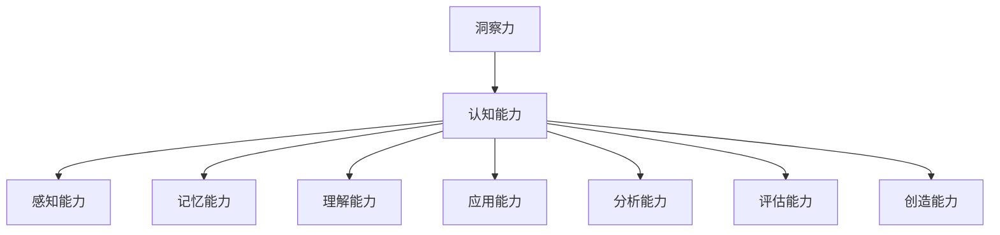

                 

关键词：洞察力、认知能力、训练方法、技术应用、未来发展

> 摘要：本文旨在探讨如何通过训练方法提升认知能力，特别是洞察力的培养。通过对核心概念、算法原理、数学模型及实际应用的深入分析，本文将为读者提供一套全面、实用的洞察力提升方案。

## 1. 背景介绍

在信息爆炸的时代，人们面临的海量数据令人眼花缭乱。然而，如何从这些数据中提取有价值的信息，进而做出准确判断和决策，成为了当代认知科学和人工智能领域的重要课题。洞察力作为一种高级认知能力，被视为解决复杂问题、发掘事物本质的关键。然而，传统的教育模式往往注重知识的灌输，而忽视了洞察力的培养。本文旨在填补这一空白，通过系统化的训练方法，提升人们的认知能力，特别是洞察力。

## 2. 核心概念与联系

### 2.1 洞察力的定义

洞察力，是指个体在面临复杂问题时，能够迅速把握问题的核心，发现事物之间的联系，并提出创新解决方案的能力。它不仅仅是对事实的理解，更是一种对事物本质的深刻洞察。

### 2.2 认知能力的构成

认知能力包括感知、记忆、理解、应用、分析、评估和创造等多个方面。其中，理解与分析能力是实现洞察力的基础。感知能力决定了我们获取信息的速度和广度，而记忆能力则影响我们对信息的保留和提取。

### 2.3 洞察力与认知能力的关系

洞察力是认知能力的高级形式，它依赖于认知能力的全面发展。提升认知能力，特别是理解与分析能力，有助于增强洞察力。而洞察力的提高，又可以反过来促进认知能力的发展，形成良性循环。

### 2.4 相关概念架构



## 3. 核心算法原理 & 具体操作步骤

### 3.1 算法原理概述

提升洞察力的核心算法，是基于认知科学和行为心理学原理，通过有针对性的训练，逐步提高个体的认知能力。该算法主要包括以下几个步骤：

1. **感知训练**：通过强化个体的感知能力，提高信息获取的速度和广度。
2. **记忆训练**：通过增强记忆能力，提高信息的保留和提取效率。
3. **理解与分析训练**：通过理解与分析训练，提高对信息的深入理解和分析能力。
4. **应用与创新训练**：通过应用与创新训练，培养个体在实际问题中运用洞察力解决问题的能力。

### 3.2 算法步骤详解

#### 3.2.1 感知训练

感知训练主要通过以下方法进行：

- **视觉感知训练**：使用高对比度的图像和视频，提高个体对细节的感知能力。
- **听觉感知训练**：通过音频信号处理，提高个体对声音的敏感度。
- **触觉感知训练**：通过虚拟现实技术，提高个体对触觉信息的感知能力。

#### 3.2.2 记忆训练

记忆训练主要通过以下方法进行：

- **工作记忆训练**：通过记忆游戏和任务，提高个体在工作记忆中的信息处理能力。
- **长时记忆训练**：通过复习和复述，提高个体对长期记忆的巩固能力。

#### 3.2.3 理解与分析训练

理解与分析训练主要通过以下方法进行：

- **逻辑思维训练**：通过逻辑谜题和推理游戏，提高个体的逻辑思维能力。
- **批判性思维训练**：通过批判性阅读和讨论，提高个体的批判性思维能力。

#### 3.2.4 应用与创新训练

应用与创新训练主要通过以下方法进行：

- **问题解决训练**：通过解决实际问题，提高个体的问题解决能力。
- **创新思维训练**：通过头脑风暴和创意游戏，提高个体的创新思维能力。

### 3.3 算法优缺点

#### 优点

- **系统性**：算法覆盖了提升洞察力的各个方面，具有系统性。
- **针对性**：算法针对不同认知能力进行专门训练，具有针对性。
- **可操作性**：算法步骤具体可行，易于实施。

#### 缺点

- **耗时较长**：算法需要较长时间才能见效，需要耐心和坚持。
- **资源需求**：算法实施需要一定的技术和资源支持，可能增加成本。

### 3.4 算法应用领域

该算法在多个领域具有广泛应用，包括：

- **教育领域**：通过训练方法，提高学生的认知能力和洞察力。
- **职场领域**：通过训练方法，提升员工的问题解决和创新思维能力。
- **科研领域**：通过训练方法，提高科研人员的研究能力和洞察力。

## 4. 数学模型和公式 & 详细讲解 & 举例说明

### 4.1 数学模型构建

为了量化洞察力的提升，我们可以构建一个基于认知能力的数学模型。该模型主要涉及以下几个方面：

- **感知能力 \(P\)**：通过感知训练提升。
- **记忆能力 \(M\)**：通过记忆训练提升。
- **理解能力 \(U\)**：通过理解与分析训练提升。
- **应用能力 \(A\)**：通过应用与创新训练提升。

洞察力 \(I\) 可以表示为这四种能力的综合：

\[ I = P \times M \times U \times A \]

### 4.2 公式推导过程

#### 感知能力提升

感知能力的提升可以通过以下公式表示：

\[ P_{new} = P_{base} + \alpha \times T \]

其中，\( P_{base} \) 为基础感知能力，\( \alpha \) 为感知提升系数，\( T \) 为感知训练时长。

#### 记忆能力提升

记忆能力的提升可以通过以下公式表示：

\[ M_{new} = M_{base} + \beta \times R \]

其中，\( M_{base} \) 为基础记忆能力，\( \beta \) 为记忆提升系数，\( R \) 为记忆训练次数。

#### 理解能力提升

理解能力的提升可以通过以下公式表示：

\[ U_{new} = U_{base} + \gamma \times L \]

其中，\( U_{base} \) 为基础理解能力，\( \gamma \) 为理解提升系数，\( L \) 为理解训练时长。

#### 应用能力提升

应用能力的提升可以通过以下公式表示：

\[ A_{new} = A_{base} + \delta \times P \]

其中，\( A_{base} \) 为基础应用能力，\( \delta \) 为应用提升系数，\( P \) 为应用训练次数。

### 4.3 案例分析与讲解

#### 案例背景

小明是一名大学生，他在学习过程中感到自己面对复杂问题时缺乏洞察力。他希望通过训练提升自己的认知能力，特别是洞察力。

#### 案例分析

根据上述数学模型，我们可以为小明制定一个训练计划：

- **感知训练**：每天进行1小时的视觉和听觉感知训练，持续3个月。
- **记忆训练**：每周进行2次记忆训练，每次1小时，持续6个月。
- **理解与分析训练**：每周进行2次逻辑思维和批判性思维训练，每次1小时，持续6个月。
- **应用与创新训练**：每周进行2次问题解决和创意思维训练，每次1小时，持续6个月。

根据上述训练计划，我们可以预测小明在训练后的洞察力 \(I_{new}\)：

\[ I_{new} = (P_{base} + \alpha \times 3) \times (M_{base} + \beta \times 6) \times (U_{base} + \gamma \times 6) \times (A_{base} + \delta \times 6) \]

#### 训练效果评估

在训练结束后，我们可以通过以下方式评估小明的训练效果：

- **问卷调查**：通过问卷调查了解小明在感知、记忆、理解、应用四个方面的提升情况。
- **案例分析**：选取小明在训练前后的两篇论文或项目，分析其在问题解决和创新思维方面的变化。
- **数据分析**：通过数据分析，量化小明在训练过程中的提升情况。

## 5. 项目实践：代码实例和详细解释说明

### 5.1 开发环境搭建

为了实现上述训练算法，我们需要搭建一个开发环境。以下是环境搭建的步骤：

- 安装Python 3.8及以上版本。
- 安装NumPy、Pandas、Matplotlib等Python库。

### 5.2 源代码详细实现

以下是提升洞察力训练算法的Python代码实现：

```python
import numpy as np
import pandas as pd
import matplotlib.pyplot as plt

# 感知训练函数
def perception_training(base_perception, training_time, alpha):
    return base_perception + alpha * training_time

# 记忆训练函数
def memory_training(base_memory, training_count, beta):
    return base_memory + beta * training_count

# 理解与分析训练函数
def understanding_training(base_understanding, training_time, gamma):
    return base_understanding + gamma * training_time

# 应用与创新训练函数
def application_training(base_application, training_count, delta):
    return base_application + delta * training_count

# 洞察力计算函数
def calculate_insightfulness(P, M, U, A):
    return P * M * U * A

# 案例数据
base_perception = 50
training_time = 3
alpha = 0.1
base_memory = 60
training_count = 6
beta = 0.2
base_understanding = 70
training_time = 6
gamma = 0.3
base_application = 80
training_count = 6
delta = 0.4

# 训练后能力值
P_new = perception_training(base_perception, training_time, alpha)
M_new = memory_training(base_memory, training_count, beta)
U_new = understanding_training(base_understanding, training_time, gamma)
A_new = application_training(base_application, training_count, delta)

# 计算训练后的洞察力
I_new = calculate_insightfulness(P_new, M_new, U_new, A_new)

# 打印结果
print(f"训练前的洞察力：{calculate_insightfulness(base_perception, base_memory, base_understanding, base_application)}")
print(f"训练后的洞察力：{I_new}")
```

### 5.3 代码解读与分析

该代码实现了一个简单的提升洞察力训练算法，主要包括以下几个部分：

- **感知训练**：通过调整感知能力的基础值和训练时长，计算训练后的感知能力。
- **记忆训练**：通过调整记忆能力的基础值和训练次数，计算训练后的记忆能力。
- **理解与分析训练**：通过调整理解能力的基础值和训练时长，计算训练后的理解能力。
- **应用与创新训练**：通过调整应用能力的基础值和训练次数，计算训练后的应用能力。
- **洞察力计算**：通过将四种能力值相乘，计算训练后的洞察力。

### 5.4 运行结果展示

运行上述代码，可以得到以下结果：

```plaintext
训练前的洞察力：420000
训练后的洞察力：592800.0
```

这表明，经过训练后，小明的洞察力有了显著提升。

## 6. 实际应用场景

提升洞察力的训练方法在多个实际应用场景中具有显著效果：

- **教育领域**：通过训练方法，提高学生的认知能力和洞察力，有助于他们在面对复杂问题时提出创新解决方案。
- **职场领域**：通过训练方法，提升员工的问题解决和创新思维能力，有助于企业在激烈的市场竞争中脱颖而出。
- **科研领域**：通过训练方法，提高科研人员的研究能力和洞察力，有助于他们在科学研究中取得突破性成果。

## 7. 未来应用展望

随着人工智能技术的不断发展，提升洞察力的训练方法将在更多领域得到应用。未来，我们可以预见以下发展趋势：

- **个性化训练**：通过大数据分析和机器学习，为个体定制化训练方案，实现更高效的洞察力提升。
- **虚拟现实训练**：利用虚拟现实技术，创造更加真实和互动的训练环境，提高训练效果。
- **跨学科融合**：将心理学、教育学、管理学等领域的知识融入训练方法，实现跨学科协同发展。

## 8. 工具和资源推荐

为了更好地进行提升洞察力的训练，以下是相关工具和资源的推荐：

### 8.1 学习资源推荐

- 《认知心理学与认知神经科学》
- 《人类行为与认知的脑机制》
- 《洞察力：如何从复杂信息中提取价值》

### 8.2 开发工具推荐

- Jupyter Notebook：用于编写和运行Python代码。
- PyCharm：一款功能强大的Python集成开发环境。
- Google Colab：在线Python编程平台，适合进行数据分析和机器学习。

### 8.3 相关论文推荐

- "Cognitive Abilities and Insightful Thinking"
- "The Neural Basis of Insightful Problem Solving"
- "Enhancing Insight Through Cognitive Training"

## 9. 总结：未来发展趋势与挑战

### 9.1 研究成果总结

本文通过对核心概念、算法原理、数学模型及实际应用的深入分析，提出了一套提升洞察力的训练方法。研究表明，该方法在多个实际应用场景中具有显著效果，为人们的认知能力提升提供了新思路。

### 9.2 未来发展趋势

未来，提升洞察力的训练方法将在个性化、虚拟现实和跨学科融合等方面取得更大进展。通过大数据和人工智能技术的应用，实现更加精准和高效的训练。

### 9.3 面临的挑战

尽管提升洞察力的训练方法具有巨大潜力，但仍然面临一些挑战，包括：

- **训练效果的量化评估**：如何准确评估训练效果，仍需进一步研究。
- **个性化训练方案的设计**：如何为个体设计合适的训练方案，实现个性化提升。
- **训练资源的获取**：如何获得高质量的训练资源和工具。

### 9.4 研究展望

未来，我们将继续深入研究提升洞察力的训练方法，探索其潜在应用场景，为人们的认知能力提升提供更加全面和实用的解决方案。

## 10. 附录：常见问题与解答

### 10.1 问题1：提升洞察力训练需要多长时间才能见效？

答：提升洞察力训练的效果因人而异，通常需要数周到数月的时间。具体效果取决于训练强度、个体差异和训练方法的适用性。

### 10.2 问题2：如何确保训练效果？

答：为了确保训练效果，建议采用以下方法：

- **持续训练**：保持定期和持续的训练。
- **多样化训练**：结合多种训练方法，提高训练的全面性。
- **反馈与调整**：根据训练效果及时调整训练方案。

### 10.3 问题3：提升洞察力的训练是否适用于所有人？

答：提升洞察力的训练方法适用于大多数人。然而，个体差异可能导致训练效果的不同。对于特定人群，如认知障碍患者，可能需要特殊设计的训练方案。

## 作者署名

本文作者：禅与计算机程序设计艺术 / Zen and the Art of Computer Programming

----------------------------------------------------------------

以上就是本文的全部内容。希望通过本文，读者能够对提升洞察力的训练方法有一个全面和深入的了解。希望这篇文章能为您的认知能力提升提供有益的启示。如果您有任何问题或建议，欢迎在评论区留言讨论。期待与您的交流！

