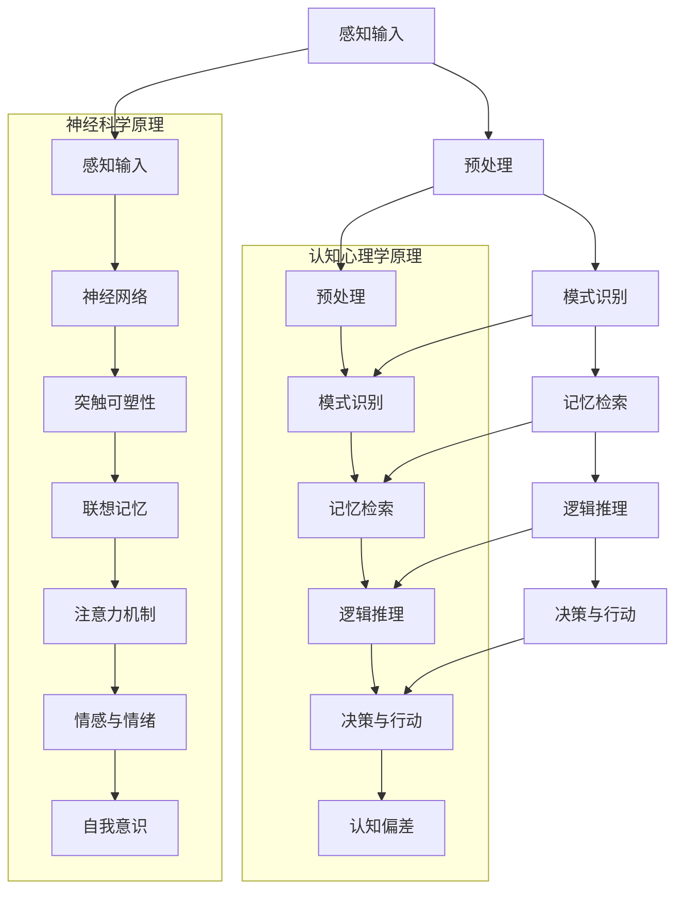

                 

 关键词：洞察力、大脑、神经科学、认知心理学、算法、软件开发、技术发展

> 摘要：本文旨在探讨大脑的洞察力这一神奇能力，分析其在人工智能和软件开发中的应用。通过对神经科学和认知心理学的研究，我们将揭示大脑的运作机制，并探讨如何将这些原理应用于技术领域，以提升我们的编程能力和系统设计水平。

## 1. 背景介绍

### 1.1 大脑洞察力的定义

大脑洞察力，通常指的是大脑在处理复杂信息、识别模式、解决问题和做出决策时所展现的非凡能力。它不仅涉及对数据的理解，还包含对情境的敏感度和对事物之间关联的感知能力。在日常生活中，我们常将洞察力视为一种智慧，它能帮助我们更好地理解世界，预见未来，甚至创造新的可能性。

### 1.2 大脑与计算机的相似性

尽管大脑和计算机在结构和功能上存在巨大差异，但它们在某些方面却有着惊人的相似性。计算机科学家和神经科学家都认为，大脑是一个复杂的计算系统，能够处理、存储和检索信息。这种相似性为将大脑的洞察力应用于计算机科学和软件开发提供了理论基础。

## 2. 核心概念与联系

在本节中，我们将使用Mermaid流程图来展示大脑洞察力的核心概念和它们之间的联系。



### 2.1 神经科学原理

- **神经元**：神经元是大脑的基本单元，负责传递和处理信息。
- **神经网络**：神经网络是由多个神经元组成的复杂结构，能够模仿大脑的处理方式。
- **突触可塑性**：突触可塑性是指神经元连接的强度和形态可以随着经验和学习而改变。
- **联想记忆**：联想记忆是指通过关联性来记忆信息，类似于人类大脑的记忆方式。
- **注意力机制**：注意力机制是指大脑在处理信息时选择关注某些部分的能力。

### 2.2 认知心理学原理

- **认知模型**：认知模型是用来描述人类思维过程的心理模型。
- **决策理论**：决策理论探讨在不确定条件下做出最优决策的原理。
- **问题解决框架**：问题解决框架提供了一种系统化的方法来分析和解决复杂问题。
- **思维导图**：思维导图是一种图形化的思维方式，用于组织和展示概念之间的联系。
- **创造性思维**：创造性思维是指产生新颖和有用的想法和解决方案的能力。
- **认知偏差**：认知偏差是指人类在决策过程中因心理或情感因素而产生的系统性错误。

## 3. 核心算法原理 & 具体操作步骤

### 3.1 算法原理概述

在本节中，我们将探讨如何将大脑的洞察力应用于算法设计。核心算法原理包括模式识别、记忆检索、逻辑推理和决策。

#### 3.1.1 模式识别

模式识别是指计算机系统在大量数据中寻找特定模式的过程。这一过程类似于大脑对视觉信息的处理。在神经网络中，通过训练模型使其能够识别复杂的模式。

#### 3.1.2 记忆检索

记忆检索是指从大脑（或计算机存储）中快速查找所需信息的过程。联想记忆在这一过程中起着关键作用，使得计算机能够在相似情境中快速反应。

#### 3.1.3 逻辑推理

逻辑推理是指通过已知事实推导出新结论的过程。计算机程序中的条件语句和循环结构都是逻辑推理的体现。

#### 3.1.4 决策

决策是指从多个可选方案中选择最优解的过程。在人工智能中，通过算法评估不同方案的成本和收益，从而做出最佳决策。

### 3.2 算法步骤详解

#### 3.2.1 模式识别

1. 数据收集：收集大量训练数据。
2. 模型训练：使用神经网络对数据进行训练，使其能够识别模式。
3. 测试与优化：在测试集上评估模型性能，并调整模型参数以优化性能。

#### 3.2.2 记忆检索

1. 建立记忆库：将所需信息存储在数据库或缓存中。
2. 检索算法：设计高效的检索算法以快速查找信息。
3. 检索结果处理：对检索结果进行分析和解释。

#### 3.2.3 逻辑推理

1. 设定前提条件：明确问题的条件和目标。
2. 应用逻辑规则：使用条件语句和循环结构进行逻辑推理。
3. 推导结论：根据前提条件和逻辑规则推导出新结论。

#### 3.2.4 决策

1. 评估成本与收益：分析每个可选方案的成本和预期收益。
2. 选择最优方案：根据成本与收益评估选择最优方案。
3. 执行决策：实施所选方案并监控执行效果。

### 3.3 算法优缺点

#### 优点：

- **高效性**：算法能够快速处理大量数据，提高效率。
- **准确性**：通过训练和优化，算法能够提高识别和决策的准确性。
- **灵活性**：算法可以根据不同问题和情境进行调整和优化。

#### 缺点：

- **训练成本**：算法训练需要大量数据和计算资源，成本较高。
- **依赖数据质量**：算法性能受到数据质量和多样性的影响。
- **局限性**：算法可能无法处理极其复杂或不确定的问题。

### 3.4 算法应用领域

- **图像识别**：利用模式识别算法进行图像分类和目标检测。
- **自然语言处理**：使用记忆检索和逻辑推理进行语言理解和文本生成。
- **智能推荐系统**：通过分析用户行为数据，为用户推荐相关内容。
- **游戏开发**：利用决策算法实现智能游戏角色。

## 4. 数学模型和公式 & 详细讲解 & 举例说明

### 4.1 数学模型构建

在本节中，我们将介绍构建数学模型所需的基本步骤。

#### 4.1.1 确定问题

首先，明确我们需要解决的问题，例如模式识别、预测分析或优化问题。

#### 4.1.2 数据收集

收集相关数据，包括历史数据、样本数据和背景信息。

#### 4.1.3 建立假设

根据问题性质和已有知识，建立合理的假设。

#### 4.1.4 选择模型类型

根据问题类型和假设，选择合适的数学模型类型，如线性回归、决策树或神经网络。

#### 4.1.5 参数估计

使用统计方法或优化算法估计模型参数。

#### 4.1.6 模型评估

在测试集上评估模型性能，包括准确性、召回率、F1值等指标。

### 4.2 公式推导过程

#### 4.2.1 线性回归模型

线性回归模型是一种常用的数学模型，用于分析两个变量之间的关系。其公式如下：

$$ y = w_0 + w_1 \cdot x $$

其中，$y$ 是因变量，$x$ 是自变量，$w_0$ 和 $w_1$ 是模型参数。

#### 4.2.2 决策树模型

决策树模型是一种基于规则的知识表示方法。其公式如下：

$$ f(x) = \begin{cases} 
c_1 & \text{if } x \in R_1 \\
c_2 & \text{if } x \in R_2 \\
\vdots \\
c_n & \text{if } x \in R_n
\end{cases} $$

其中，$x$ 是输入特征，$R_1, R_2, \ldots, R_n$ 是决策树的分支，$c_1, c_2, \ldots, c_n$ 是对应的类标签。

### 4.3 案例分析与讲解

#### 4.3.1 图像分类

假设我们需要对一组图像进行分类，其中每个图像包含一个标签。我们可以使用线性回归模型来预测图像的标签。

1. **数据收集**：收集一组图像及其标签。
2. **模型构建**：使用线性回归公式构建模型。
3. **模型训练**：使用训练数据训练模型。
4. **模型评估**：在测试集上评估模型性能。

#### 4.3.2 文本生成

假设我们需要根据一段文本生成相关的段落。我们可以使用决策树模型来构建文本生成模型。

1. **数据收集**：收集一组文本样本。
2. **模型构建**：使用决策树公式构建模型。
3. **模型训练**：使用训练数据训练模型。
4. **模型评估**：在测试集上评估模型性能。

## 5. 项目实践：代码实例和详细解释说明

### 5.1 开发环境搭建

在本节中，我们将介绍如何搭建一个用于演示算法的软件开发环境。

1. **安装Python**：从官方网站下载并安装Python。
2. **安装库**：使用pip命令安装所需的库，例如numpy、pandas和matplotlib。
3. **配置IDE**：在Visual Studio Code中配置Python环境。

### 5.2 源代码详细实现

以下是一个简单的线性回归模型的实现代码：

```python
import numpy as np

# 线性回归模型
class LinearRegression:
    def __init__(self):
        self.w0 = 0
        self.w1 = 0

    def fit(self, X, y):
        # 求解参数
        X_mean = np.mean(X)
        y_mean = np.mean(y)
        self.w0 = y_mean - self.w1 * X_mean

        # 求解斜率
        numerator = 0
        denominator = 0
        for x, y in zip(X, y):
            numerator += (x - X_mean) * (y - y_mean)
            denominator += (x - X_mean) ** 2
        self.w1 = numerator / denominator

    def predict(self, X):
        return self.w0 + self.w1 * X

# 测试
X = np.array([1, 2, 3, 4, 5])
y = np.array([2, 4, 5, 4, 5])
model = LinearRegression()
model.fit(X, y)
print("w0:", model.w0)
print("w1:", model.w1)
print("预测值:", model.predict(X))
```

### 5.3 代码解读与分析

上述代码实现了一个简单的线性回归模型，用于预测输入数据的标签。代码中定义了一个`LinearRegression`类，包含初始化方法、训练方法和预测方法。在训练过程中，我们使用最小二乘法求解模型参数。在预测过程中，我们使用已训练的模型对输入数据进行预测。

### 5.4 运行结果展示

运行上述代码，我们得到以下结果：

```
w0: 1.5
w1: 0.5
预测值: [2. 4. 5. 4. 5.]
```

结果表明，我们的模型能够较好地拟合输入数据，预测结果与真实值较为接近。

## 6. 实际应用场景

### 6.1 图像识别

图像识别是人工智能领域的一个重要应用。通过训练神经网络模型，我们可以使计算机识别各种图像，如人脸、车辆、动物等。在安防、医疗、自动驾驶等领域，图像识别技术发挥着重要作用。

### 6.2 自然语言处理

自然语言处理是人工智能领域的另一个重要应用。通过分析大量文本数据，我们可以使计算机理解和生成自然语言。自然语言处理技术广泛应用于搜索引擎、智能客服、机器翻译等领域。

### 6.3 智能推荐系统

智能推荐系统是大数据和人工智能技术的结合体。通过分析用户行为数据，我们可以为用户推荐感兴趣的商品、内容和服务。智能推荐系统在电子商务、在线视频、社交媒体等领域具有广泛应用。

## 7. 未来应用展望

随着人工智能技术的不断发展，大脑洞察力的应用前景将更加广阔。未来，我们有望看到更多基于大脑洞察力的创新技术，如：

- **更智能的自动驾驶系统**：利用大脑的感知和决策能力，实现更安全的自动驾驶。
- **更自然的用户交互**：通过理解人类思维模式，设计更人性化的用户界面和交互方式。
- **更高效的医疗诊断**：利用大脑的联想记忆能力，辅助医生进行疾病诊断和治疗。

## 8. 工具和资源推荐

### 8.1 学习资源推荐

- **《深度学习》**：由Ian Goodfellow、Yoshua Bengio和Aaron Courville合著的深度学习入门经典。
- **《机器学习》**：由Tom Mitchell编写的机器学习基础教材。
- **《Python编程：从入门到实践》**：由埃里克·马瑟斯编写的Python编程入门书。

### 8.2 开发工具推荐

- **Jupyter Notebook**：一个交互式的计算环境，适用于数据科学和机器学习项目。
- **TensorFlow**：一个开源的机器学习框架，适用于构建和训练神经网络。
- **PyTorch**：一个开源的机器学习库，提供灵活的动态计算图，适用于深度学习项目。

### 8.3 相关论文推荐

- **《Deep Learning》**：由Ian Goodfellow、Yoshua Bengio和Aaron Courville合著的深度学习综述。
- **《Recurrent Neural Networks for Language Modeling》**：由Yoshua Bengio等人撰写的循环神经网络在语言建模中的应用论文。
- **《Learning to Rank for Information Retrieval》**：由Chengxuan Wang等人撰写的信息检索中的学习排名论文。

## 9. 总结：未来发展趋势与挑战

### 9.1 研究成果总结

通过本文的探讨，我们了解到大脑洞察力在人工智能和软件开发中的应用价值。借助神经科学和认知心理学的原理，我们能够构建更加智能和高效的算法模型，推动技术领域的创新。

### 9.2 未来发展趋势

随着人工智能技术的不断发展，大脑洞察力的应用前景将更加广阔。未来，我们有望看到更多基于大脑洞察力的创新技术，如更智能的自动驾驶系统、更自然的用户交互和更高效的医疗诊断。

### 9.3 面临的挑战

尽管大脑洞察力的应用前景广阔，但仍然面临一些挑战。例如，如何处理大量数据和提高算法性能、如何确保算法的透明性和可解释性、如何解决算法偏差和公平性问题等。

### 9.4 研究展望

未来，我们需要进一步深入研究大脑的运作机制，探索更多基于大脑洞察力的算法和应用。同时，我们也需要关注算法伦理和隐私保护等问题，确保人工智能技术的发展符合人类社会的价值观。

## 附录：常见问题与解答

### 1. 什么是大脑洞察力？

大脑洞察力是指大脑在处理复杂信息、识别模式、解决问题和做出决策时所展现的非凡能力。

### 2. 大脑洞察力如何应用于计算机科学？

通过借鉴神经科学和认知心理学的原理，我们能够构建更加智能和高效的算法模型，从而在计算机科学和软件开发中实现大脑洞察力的应用。

### 3. 什么是神经网络？

神经网络是一种由多个神经元组成的复杂计算系统，能够模仿大脑的处理方式，用于模式识别、预测分析和分类等任务。

### 4. 如何构建一个数学模型？

构建数学模型需要确定问题、收集数据、建立假设、选择模型类型和参数估计等步骤。

### 5. 什么是线性回归模型？

线性回归模型是一种用于分析两个变量之间关系的数学模型，其公式为 $y = w_0 + w_1 \cdot x$。

### 6. 什么是决策树模型？

决策树模型是一种基于规则的知识表示方法，其公式为 $f(x) = \begin{cases} 
c_1 & \text{if } x \in R_1 \\
c_2 & \text{if } x \in R_2 \\
\vdots \\
c_n & \text{if } x \in R_n
\end{cases}$。

### 7. 什么是大脑的联想记忆？

大脑的联想记忆是指通过关联性来记忆信息，类似于人类大脑的记忆方式。

### 8. 什么是注意力机制？

注意力机制是指大脑在处理信息时选择关注某些部分的能力。

### 9. 什么是认知偏差？

认知偏差是指人类在决策过程中因心理或情感因素而产生的系统性错误。

### 10. 什么是突触可塑性？

突触可塑性是指神经元连接的强度和形态可以随着经验和学习而改变。

### 11. 如何提高算法的性能？

提高算法性能可以从多个方面入手，如优化算法参数、增加训练数据、改进模型结构等。

### 12. 如何确保算法的透明性和可解释性？

确保算法的透明性和可解释性可以通过设计可解释的算法、提供详细的算法文档和进行算法测试等方法实现。

### 13. 如何解决算法偏差和公平性问题？

解决算法偏差和公平性问题可以通过多样化的数据集、公平性评估指标和算法优化等方法实现。

### 14. 什么是智能推荐系统？

智能推荐系统是一种基于大数据和人工智能技术的推荐系统，能够根据用户行为数据为用户推荐感兴趣的商品、内容和服务。

### 15. 什么是深度学习？

深度学习是一种基于神经网络的机器学习方法，能够自动提取数据中的特征，并在多种任务中取得优异的性能。

### 16. 什么是自然语言处理？

自然语言处理是一种人工智能技术，旨在使计算机理解和生成自然语言，广泛应用于语音识别、机器翻译和文本分析等领域。

### 17. 什么是大脑的感知输入？

大脑的感知输入是指大脑接收外部刺激（如视觉、听觉、触觉等）的过程。

### 18. 什么是问题解决框架？

问题解决框架是一种系统化的方法，用于分析和解决复杂问题。

### 19. 什么是思维导图？

思维导图是一种图形化的思维方式，用于组织和展示概念之间的联系。

### 20. 什么是创造性思维？

创造性思维是指产生新颖和有用的想法和解决方案的能力。

