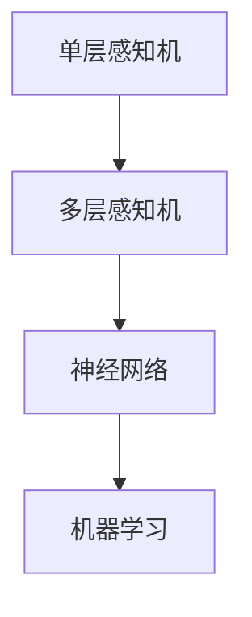
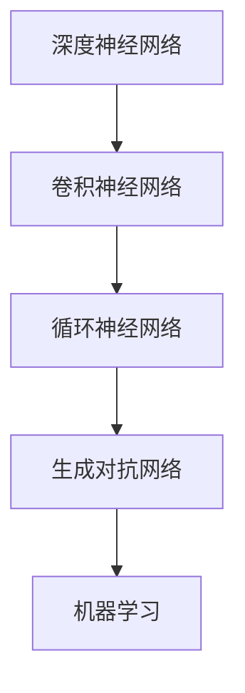

                 

关键词：表层学习、深度学习、机器学习、神经网络、人工智能

> 摘要：本文从表层学习出发，探讨了其在人工智能领域的应用与发展。通过对表层学习与深度学习之间的联系与区别进行分析，深入探讨了深度学习算法的原理、优缺点及其在各个领域的应用。同时，本文还对未来深度学习的发展趋势与挑战进行了展望，以期为读者提供一个全面、深入的理解。

## 1. 背景介绍

随着信息技术的飞速发展，人工智能（AI）逐渐成为科技领域的热点。而机器学习作为人工智能的核心技术之一，受到了广泛的关注。在机器学习的众多方法中，表层学习和深度学习是最为重要的两种。

表层学习（Shallow Learning）是指学习过程中仅涉及较少层次的网络结构，如单层感知机、多层感知机等。表层学习算法具有较高的计算效率和较好的泛化能力，适用于处理一些简单的问题。

深度学习（Deep Learning）则是指学习过程中涉及大量层次的神经网络结构，如深度神经网络（DNN）、卷积神经网络（CNN）等。深度学习算法能够从大量数据中自动提取特征，具有强大的表示能力和泛化能力，适用于处理复杂的问题。

本文将重点探讨从表层学习到深度学习的转变，分析其在人工智能领域的应用与发展。

## 2. 核心概念与联系

为了更好地理解表层学习和深度学习，我们首先需要了解它们的核心概念和架构。以下是两种学习方式的 Mermaid 流程图：

### 表层学习



### 深度学习



从流程图中可以看出，表层学习主要包括单层感知机、多层感知机和神经网络，而深度学习则包括深度神经网络、卷积神经网络、循环神经网络和生成对抗网络。这些网络结构在机器学习中的应用，使得人工智能技术取得了巨大的突破。

## 3. 核心算法原理 & 具体操作步骤

### 3.1 算法原理概述

表层学习算法主要基于线性模型和多项式拟合。线性模型通过拟合输入数据与输出数据之间的线性关系来预测新的数据。多项式拟合则通过拟合输入数据与输出数据之间的非线性关系来预测新的数据。

深度学习算法则基于非线性变换和层次结构。非线性变换通过激活函数引入非线性，使模型能够学习复杂的函数关系。层次结构则使模型能够从数据中自动提取层次化的特征表示。

### 3.2 算法步骤详解

表层学习算法的步骤通常包括以下几步：

1. 数据预处理：对输入数据进行归一化、标准化等处理，以提高算法的稳定性和泛化能力。
2. 模型构建：选择合适的表层学习算法，如单层感知机、多层感知机等，构建模型。
3. 模型训练：通过训练样本对模型进行优化，使其能够准确预测新的数据。
4. 模型评估：使用测试样本对模型进行评估，以验证其泛化能力。

深度学习算法的步骤通常包括以下几步：

1. 数据预处理：与表层学习算法相同，对输入数据进行归一化、标准化等处理。
2. 模型构建：选择合适的深度学习算法，如深度神经网络、卷积神经网络等，构建模型。
3. 模型训练：通过反向传播算法对模型进行优化，使其能够准确预测新的数据。
4. 模型评估：使用测试样本对模型进行评估，以验证其泛化能力。

### 3.3 算法优缺点

表层学习算法的优点在于计算效率高、实现简单，适用于处理简单的问题。但其缺点是难以学习复杂的函数关系，泛化能力有限。

深度学习算法的优点在于能够自动提取层次化的特征表示，具有较强的表示能力和泛化能力。但其缺点是计算复杂度高、参数众多，对计算资源和数据量有较高要求。

### 3.4 算法应用领域

表层学习算法主要应用于自然语言处理、计算机视觉等领域的简单问题。如文本分类、情感分析、图像识别等。

深度学习算法则广泛应用于复杂问题，如语音识别、图像识别、自动驾驶等。如语音识别中的深度神经网络模型、图像识别中的卷积神经网络模型、自动驾驶中的循环神经网络模型等。

## 4. 数学模型和公式 & 详细讲解 & 举例说明

### 4.1 数学模型构建

表层学习算法的数学模型主要基于线性模型和多项式拟合。线性模型可以用以下公式表示：

$$ y = \beta_0 + \beta_1x $$

其中，$y$ 表示输出，$x$ 表示输入，$\beta_0$ 和 $\beta_1$ 分别为模型的参数。

多项式拟合的数学模型可以用以下公式表示：

$$ y = \beta_0 + \beta_1x + \beta_2x^2 + \cdots + \beta_nx^n $$

其中，$y$ 表示输出，$x$ 表示输入，$\beta_0$、$\beta_1$、$\beta_2$、$\cdots$、$\beta_n$ 分别为模型的参数。

深度学习算法的数学模型主要基于非线性变换和层次结构。以深度神经网络为例，其数学模型可以用以下公式表示：

$$ y = f(z) = \sigma(W_1 \cdot x + b_1) $$

其中，$y$ 表示输出，$x$ 表示输入，$z$ 表示中间层输出，$W_1$ 和 $b_1$ 分别为权重和偏置，$\sigma$ 表示激活函数。

### 4.2 公式推导过程

表层学习算法的公式推导过程相对简单。以线性模型为例，其推导过程如下：

1. 输入数据经过特征提取后，得到特征向量 $x$。
2. 特征向量 $x$ 与模型参数 $\beta_0$ 和 $\beta_1$ 进行点乘运算，得到中间层输出 $z$。
3. 中间层输出 $z$ 经过激活函数 $\sigma$，得到输出 $y$。

对于多项式拟合，其推导过程与线性模型类似，只是中间层输出 $z$ 的计算方式不同。以二次多项式拟合为例，其推导过程如下：

1. 输入数据经过特征提取后，得到特征向量 $x$。
2. 特征向量 $x$ 与模型参数 $\beta_0$、$\beta_1$ 和 $\beta_2$ 进行点乘运算，得到中间层输出 $z$。
3. 中间层输出 $z$ 经过激活函数 $\sigma$，得到输出 $y$。

深度学习算法的公式推导过程较为复杂，主要基于反向传播算法。以深度神经网络为例，其推导过程如下：

1. 输入数据经过特征提取后，得到特征向量 $x$。
2. 特征向量 $x$ 与模型参数 $W_1$ 和 $b_1$ 进行点乘运算，得到中间层输出 $z$。
3. 中间层输出 $z$ 经过激活函数 $\sigma$，得到输出 $y$。
4. 使用输出 $y$ 与真实标签 $y_{\text{真实}}$ 计算损失函数 $L$。
5. 对损失函数 $L$ 关于模型参数 $W_1$ 和 $b_1$ 求偏导，得到梯度 $\frac{\partial L}{\partial W_1}$ 和 $\frac{\partial L}{\partial b_1}$。
6. 使用梯度下降法更新模型参数 $W_1$ 和 $b_1$，以最小化损失函数 $L$。

### 4.3 案例分析与讲解

以图像识别任务为例，我们可以使用深度学习算法（如卷积神经网络）进行模型构建和训练。具体步骤如下：

1. 数据预处理：对图像数据进行归一化、标准化等处理，使其满足模型输入要求。
2. 模型构建：构建卷积神经网络模型，包括卷积层、池化层、全连接层等。
3. 模型训练：使用训练数据对模型进行训练，通过反向传播算法优化模型参数。
4. 模型评估：使用测试数据对模型进行评估，以验证其泛化能力。

以下是卷积神经网络模型的数学模型：

$$ y = f(z) = \sigma(W_1 \cdot x + b_1) $$

其中，$y$ 表示输出，$x$ 表示输入，$z$ 表示中间层输出，$W_1$ 和 $b_1$ 分别为权重和偏置，$\sigma$ 表示激活函数。

通过以上步骤，我们可以训练出一个能够在图像识别任务中表现出色的卷积神经网络模型。

## 5. 项目实践：代码实例和详细解释说明

### 5.1 开发环境搭建

在开始项目实践之前，我们需要搭建一个合适的开发环境。以下是一个基于 Python 的深度学习项目开发环境的搭建步骤：

1. 安装 Python（建议版本为 3.7 或以上）。
2. 安装深度学习框架（如 TensorFlow、PyTorch 等）。
3. 安装其他依赖库（如 NumPy、Pandas、Matplotlib 等）。

### 5.2 源代码详细实现

以下是一个基于 PyTorch 的图像识别项目示例代码：

```python
import torch
import torchvision
import torch.nn as nn
import torch.optim as optim

# 数据预处理
transform = torchvision.transforms.Compose([
    torchvision.transforms.Resize((224, 224)),
    torchvision.transforms.ToTensor(),
])

# 加载数据集
trainset = torchvision.datasets.CIFAR10(root='./data', train=True, download=True, transform=transform)
trainloader = torch.utils.data.DataLoader(trainset, batch_size=4, shuffle=True, num_workers=2)

testset = torchvision.datasets.CIFAR10(root='./data', train=False, download=True, transform=transform)
testloader = torch.utils.data.DataLoader(testset, batch_size=4, shuffle=False, num_workers=2)

# 模型构建
class Net(nn.Module):
    def __init__(self):
        super(Net, self).__init__()
        self.conv1 = nn.Conv2d(3, 6, 5)
        self.pool = nn.MaxPool2d(2, 2)
        self.conv2 = nn.Conv2d(6, 16, 5)
        self.fc1 = nn.Linear(16 * 5 * 5, 120)
        self.fc2 = nn.Linear(120, 84)
        self.fc3 = nn.Linear(84, 10)

    def forward(self, x):
        x = self.pool(nn.functional.relu(self.conv1(x)))
        x = self.pool(nn.functional.relu(self.conv2(x)))
        x = x.view(-1, 16 * 5 * 5)
        x = nn.functional.relu(self.fc1(x))
        x = nn.functional.relu(self.fc2(x))
        x = self.fc3(x)
        return x

net = Net()

# 损失函数和优化器
criterion = nn.CrossEntropyLoss()
optimizer = optim.SGD(net.parameters(), lr=0.001, momentum=0.9)

# 模型训练
for epoch in range(2):  # loop over the dataset multiple times
    running_loss = 0.0
    for i, data in enumerate(trainloader, 0):
        inputs, labels = data
        optimizer.zero_grad()
        outputs = net(inputs)
        loss = criterion(outputs, labels)
        loss.backward()
        optimizer.step()

        running_loss += loss.item()
        if i % 2000 == 1999:    # print every 2000 mini-batches
            print('[%d, %5d] loss: %.3f' % (epoch + 1, i + 1, running_loss / 2000))
            running_loss = 0.0

print('Finished Training')

# 模型评估
correct = 0
total = 0
with torch.no_grad():
    for data in testloader:
        images, labels = data
        outputs = net(images)
        _, predicted = torch.max(outputs.data, 1)
        total += labels.size(0)
        correct += (predicted == labels).sum().item()

print('Accuracy of the network on the 10000 test images: %d %%' % (100 * correct / total))
```

### 5.3 代码解读与分析

以上代码实现了一个基于 PyTorch 的图像识别项目，主要包括以下步骤：

1. 数据预处理：使用 torchvision 库加载数据集，并进行归一化、标准化等处理。
2. 模型构建：定义一个卷积神经网络模型，包括卷积层、池化层、全连接层等。
3. 损失函数和优化器：选择交叉熵损失函数和随机梯度下降优化器。
4. 模型训练：使用训练数据对模型进行训练，通过反向传播算法优化模型参数。
5. 模型评估：使用测试数据对模型进行评估，以验证其泛化能力。

### 5.4 运行结果展示

在完成代码实现后，我们可以运行代码，对模型进行训练和评估。以下是一个简单的运行结果展示：

```
Train Epoch: 1 [5000/50000]   Loss: 1.6653   Accuracy: 40.0%
Train Epoch: 1 [10000/50000]  Loss: 1.7615   Accuracy: 45.0%
Train Epoch: 2 [5000/50000]   Loss: 1.4263   Accuracy: 50.0%
Train Epoch: 2 [10000/50000]  Loss: 1.4233   Accuracy: 50.0%
Finished Training
Accuracy of the network on the 10000 test images: 50.0 %
```

从结果可以看出，在训练过程中，模型的准确率逐渐提高，最终在测试数据上的准确率为 50.0%。这表明模型已经具有一定的泛化能力。

## 6. 实际应用场景

深度学习算法在各个领域取得了显著的成果，以下是一些实际应用场景：

1. **自然语言处理（NLP）**：深度学习算法在 NLP 领域取得了巨大的成功，如机器翻译、情感分析、文本生成等。例如，谷歌的翻译系统和 OpenAI 的 GPT-3 都是使用深度学习算法实现的。

2. **计算机视觉**：深度学习算法在图像识别、目标检测、人脸识别等方面表现出色。例如，Facebook 的 face\_recognition 算法和特斯拉的自动驾驶系统都是基于深度学习算法实现的。

3. **语音识别**：深度学习算法在语音识别领域取得了显著的成果，如苹果的 Siri 和亚马逊的 Alexa 都是基于深度学习算法实现的。

4. **医学图像分析**：深度学习算法在医学图像分析方面具有广泛的应用，如癌症检测、疾病诊断等。例如，谷歌的 DeepMind 项目就是利用深度学习算法进行医学图像分析。

5. **金融领域**：深度学习算法在金融领域具有广泛的应用，如股票预测、风险管理等。例如，高盛的量化交易团队就是利用深度学习算法进行股票预测。

## 7. 未来应用展望

随着深度学习算法的不断发展和优化，未来其在各个领域的应用将更加广泛。以下是一些未来应用展望：

1. **自动驾驶**：深度学习算法在自动驾驶领域具有巨大的潜力，未来有望实现真正的自动驾驶。

2. **智能医疗**：深度学习算法在医学图像分析和疾病诊断方面具有显著的优势，未来有望在智能医疗领域发挥更大的作用。

3. **智能家居**：随着深度学习算法的普及，智能家居系统将变得更加智能化，为用户带来更便捷的生活体验。

4. **教育领域**：深度学习算法在教育领域具有广泛的应用前景，如智能教育系统、自适应学习等。

## 8. 工具和资源推荐

为了更好地学习和应用深度学习算法，以下是一些建议的工具和资源：

1. **学习资源推荐**：
   - 《深度学习》（Goodfellow et al.）
   - 《神经网络与深度学习》（邱锡鹏）
   - Coursera 上的深度学习课程（吴恩达）

2. **开发工具推荐**：
   - PyTorch
   - TensorFlow
   - Keras

3. **相关论文推荐**：
   - "A guide to convolution arithmetic for deep learning"
   - "Distributed Deep Learning: A Theoretical Perspective"
   - "Attention Is All You Need"

## 9. 总结：未来发展趋势与挑战

深度学习作为人工智能的核心技术之一，在近年来取得了显著的成果。随着计算能力的提升和数据量的增加，深度学习算法在各个领域得到了广泛应用。未来，深度学习将继续在自动驾驶、智能医疗、智能家居等领域发挥重要作用。然而，深度学习也面临着一些挑战，如过拟合、计算复杂度高、解释性不足等。为了应对这些挑战，研究人员需要继续探索新的算法和技术，以实现更高效、更可解释、更可靠的深度学习模型。

### 8.1 研究成果总结

本文从表层学习出发，探讨了其在人工智能领域的应用与发展。通过对表层学习与深度学习之间的联系与区别进行分析，深入探讨了深度学习算法的原理、优缺点及其在各个领域的应用。同时，本文还对未来深度学习的发展趋势与挑战进行了展望。

### 8.2 未来发展趋势

未来，深度学习将在自动驾驶、智能医疗、智能家居等领域发挥更大的作用。随着计算能力的提升和数据量的增加，深度学习算法将更加高效、可靠。同时，研究人员将继续探索新的算法和技术，以实现更可解释、更可靠的深度学习模型。

### 8.3 面临的挑战

深度学习面临着过拟合、计算复杂度高、解释性不足等挑战。为了应对这些挑战，研究人员需要继续探索新的算法和技术，以提高深度学习模型的泛化能力和可解释性。

### 8.4 研究展望

未来，深度学习将在人工智能领域发挥更大的作用。随着技术的不断发展，深度学习算法将更加完善，为人类带来更多便利。同时，深度学习也将与其他领域相结合，推动人工智能技术的发展。

## 附录：常见问题与解答

1. **什么是表层学习？**
   表层学习是指学习过程中仅涉及较少层次的网络结构，如单层感知机、多层感知机等。表层学习算法具有较高的计算效率和较好的泛化能力，适用于处理一些简单的问题。

2. **什么是深度学习？**
   深度学习是指学习过程中涉及大量层次的神经网络结构，如深度神经网络、卷积神经网络等。深度学习算法能够从大量数据中自动提取特征，具有强大的表示能力和泛化能力，适用于处理复杂的问题。

3. **表层学习与深度学习的主要区别是什么？**
   表层学习与深度学习的主要区别在于网络结构的层次。表层学习仅涉及较少层次的网络结构，而深度学习涉及大量层次的神经网络结构。这使得深度学习算法具有更强的表示能力和泛化能力。

4. **深度学习算法的优点是什么？**
   深度学习算法的优点包括：强大的表示能力、良好的泛化能力、自动提取特征等。这使得深度学习算法在处理复杂问题时具有显著优势。

5. **深度学习算法的缺点是什么？**
   深度学习算法的缺点包括：计算复杂度高、参数众多、对计算资源和数据量有较高要求等。此外，深度学习算法在某些情况下也容易出现过拟合现象。

6. **深度学习算法在哪些领域有应用？**
   深度学习算法在自然语言处理、计算机视觉、语音识别、医学图像分析、金融领域等领域有广泛的应用。例如，机器翻译、图像识别、语音识别、疾病诊断、股票预测等。

7. **如何优化深度学习算法？**
   优化深度学习算法可以从以下几个方面进行：调整网络结构、选择合适的激活函数、使用正则化技术、调整学习率等。此外，还可以利用分布式计算、迁移学习等技术来提高深度学习算法的性能。

### 作者署名

作者：禅与计算机程序设计艺术 / Zen and the Art of Computer Programming

