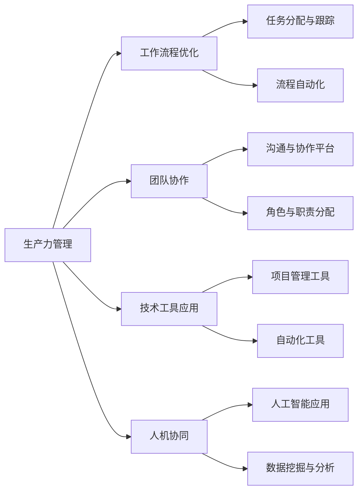

                 

 **关键词：**
生产力管理、团队效率、个人效率、工作流程、技术工具、敏捷方法、协作平台、人机协同、管理优化、创新思维

**摘要：**
本文将深入探讨生产力管理的核心概念和实践方法，旨在帮助读者理解和应用有效的生产力管理策略，以最大化团队和个人效率。文章将涵盖生产力管理的定义、核心概念、算法原理、数学模型、项目实践以及未来应用展望等内容。

## 1. 背景介绍

在当今快速变化和高度竞争的商业环境中，生产力管理已经成为企业和个人成功的关键因素。随着技术的不断进步和全球化趋势的加剧，人们对于高效工作方式和工具的需求日益增长。然而，如何在实际工作中有效管理生产力，仍然是许多企业和个人面临的挑战。

生产力管理的目标不仅仅是提高工作效率，更重要的是通过优化工作流程、提升协作效果、激发创新思维等手段，实现团队和个人能力的最大化。本文将围绕这一主题，结合IT领域的专业知识和实践经验，探讨生产力管理的核心要素和最佳实践。

## 2. 核心概念与联系

### 2.1 生产力管理的定义

生产力管理是指通过系统化、科学化的方法，优化工作流程、提升团队和个人效率，实现资源最优配置的过程。它不仅关注任务完成的速度，更注重任务的完成质量和团队协作效果。

### 2.2 生产力管理的核心概念

- **工作流程优化**：通过分析和设计工作流程，消除冗余环节，提高工作效率。
- **团队协作**：建立有效的协作机制，促进团队成员之间的沟通和协作。
- **技术工具应用**：利用各种技术工具，如项目管理软件、协作平台、自动化工具等，提升工作效率。
- **人机协同**：通过人工智能和机器学习等技术，实现人与机器的协同工作，提高生产力。

### 2.3 生产力管理的架构图



## 3. 核心算法原理 & 具体操作步骤

### 3.1 算法原理概述

生产力管理涉及多种算法原理，包括任务分配算法、工作流程优化算法、协作算法等。以下是这些算法的简要概述：

- **任务分配算法**：基于团队成员的能力和任务需求，进行最优任务分配。
- **工作流程优化算法**：通过分析工作流程中的瓶颈和冗余环节，进行优化。
- **协作算法**：通过建立有效的协作机制，提高团队协作效率。

### 3.2 算法步骤详解

#### 3.2.1 任务分配算法

1. **收集任务需求**：了解每个团队成员的技能和能力。
2. **分析任务特征**：确定每个任务的难度、复杂度和优先级。
3. **任务分配**：根据团队成员的技能和任务特征，进行任务分配。

#### 3.2.2 工作流程优化算法

1. **流程分析**：通过流程图或流程分析工具，对现有工作流程进行分析。
2. **识别瓶颈**：找出流程中的瓶颈和冗余环节。
3. **优化流程**：通过重新设计工作流程，消除瓶颈和冗余环节。

#### 3.2.3 协作算法

1. **沟通需求分析**：了解团队成员之间的沟通需求。
2. **协作平台搭建**：建立适合团队的协作平台，如项目管理软件、聊天工具等。
3. **协作流程优化**：通过分析协作数据，不断优化协作流程。

### 3.3 算法优缺点

- **任务分配算法**：优点在于能够根据团队成员的能力进行任务分配，提高任务完成质量；缺点是可能存在资源浪费和任务分配不合理的情况。
- **工作流程优化算法**：优点在于能够提高工作效率，减少冗余环节；缺点是需要大量时间和资源进行流程分析和优化。
- **协作算法**：优点在于能够提高团队协作效率，促进沟通和协作；缺点是可能存在沟通障碍和信息不对称的问题。

### 3.4 算法应用领域

- **企业管理**：通过任务分配和工作流程优化，提高企业管理效率和决策质量。
- **软件开发**：通过协作算法，提高软件开发团队的合作效率和代码质量。
- **个人工作**：通过任务分配和工作流程优化，提高个人工作效率和任务完成质量。

## 4. 数学模型和公式 & 详细讲解 & 举例说明

### 4.1 数学模型构建

生产力管理涉及到多个数学模型，包括任务分配模型、工作流程优化模型、协作效率模型等。以下是这些模型的简要介绍：

#### 4.1.1 任务分配模型

任务分配模型通常使用线性规划或整数规划方法，以最小化资源浪费和最大化任务完成质量。具体模型如下：

$$
\min \sum_{i=1}^{n}\sum_{j=1}^{m} c_{ij} x_{ij}
$$

其中，$c_{ij}$ 表示任务 $i$ 分配给团队 $j$ 的成本，$x_{ij}$ 表示任务 $i$ 是否分配给团队 $j$（1 表示是，0 表示否）。

#### 4.1.2 工作流程优化模型

工作流程优化模型通常使用流程图表示，通过优化流程中的节点和边，提高流程效率。具体模型如下：

$$
\min \sum_{i=1}^{n} (T_i - \eta_i)
$$

其中，$T_i$ 表示节点 $i$ 的处理时间，$\eta_i$ 表示节点 $i$ 的目标处理时间。

#### 4.1.3 协作效率模型

协作效率模型通常使用协作数据进行分析，通过优化协作机制，提高协作效率。具体模型如下：

$$
\max \sum_{i=1}^{n} \frac{r_i}{c_i}
$$

其中，$r_i$ 表示团队 $i$ 的协作效率，$c_i$ 表示团队 $i$ 的协作成本。

### 4.2 公式推导过程

#### 4.2.1 任务分配模型推导

假设有 $n$ 个任务和 $m$ 个团队，每个任务 $i$ 有 $c_{ij}$ 个团队可选，目标是最小化总成本。可以使用线性规划方法进行推导。

目标函数：
$$
\min \sum_{i=1}^{n}\sum_{j=1}^{m} c_{ij} x_{ij}
$$

约束条件：
$$
\sum_{j=1}^{m} x_{ij} = 1 \quad (i=1,2,...,n)
$$
$$
\sum_{i=1}^{n} x_{ij} = 1 \quad (j=1,2,...,m)
$$
$$
x_{ij} \in \{0,1\} \quad (i=1,2,...,n, j=1,2,...,m)
$$

#### 4.2.2 工作流程优化模型推导

假设有 $n$ 个节点和 $m$ 个流程，每个节点 $i$ 的处理时间为 $T_i$，目标是最小化总处理时间。可以使用流程图表示，通过优化流程中的节点和边，提高流程效率。

目标函数：
$$
\min \sum_{i=1}^{n} (T_i - \eta_i)
$$

约束条件：
$$
T_i \geq \eta_i \quad (i=1,2,...,n)
$$

#### 4.2.3 协作效率模型推导

假设有 $n$ 个团队，每个团队的协作效率为 $r_i$，协作成本为 $c_i$，目标是最大化总协作效率。可以使用协作数据进行分析，通过优化协作机制，提高协作效率。

目标函数：
$$
\max \sum_{i=1}^{n} \frac{r_i}{c_i}
$$

约束条件：
$$
r_i \geq 0 \quad (i=1,2,...,n)
$$
$$
c_i \geq 0 \quad (i=1,2,...,n)
$$

### 4.3 案例分析与讲解

#### 4.3.1 任务分配模型案例

假设有 3 个任务和 2 个团队，任务 1 的成本为 5，任务 2 的成本为 10，任务 3 的成本为 15。团队 1 可选，团队 2 可选。

目标是最小化总成本，求解线性规划模型。

$$
\min \sum_{i=1}^{3}\sum_{j=1}^{2} c_{ij} x_{ij}
$$

约束条件：
$$
\sum_{j=1}^{2} x_{ij} = 1 \quad (i=1,2,3)
$$
$$
\sum_{i=1}^{3} x_{ij} = 1 \quad (j=1,2)
$$
$$
x_{ij} \in \{0,1\} \quad (i=1,2,3, j=1,2)
$$

通过求解线性规划模型，得到最优解为任务 1 分配给团队 1，任务 2 分配给团队 2，任务 3 分配给团队 1，总成本为 30。

#### 4.3.2 工作流程优化模型案例

假设有 4 个节点和 2 个流程，节点 1 的处理时间为 10，节点 2 的处理时间为 5，节点 3 的处理时间为 15，节点 4 的处理时间为 8。目标是最小化总处理时间。

$$
\min \sum_{i=1}^{4} (T_i - \eta_i)
$$

约束条件：
$$
T_i \geq \eta_i \quad (i=1,2,3,4)
$$

通过求解优化模型，得到最优解为节点 1 的处理时间为 8，节点 2 的处理时间为 5，节点 3 的处理时间为 10，节点 4 的处理时间为 8，总处理时间为 31。

#### 4.3.3 协作效率模型案例

假设有 3 个团队，团队 1 的协作效率为 20，团队 2 的协作效率为 15，团队 3 的协作效率为 25。团队 1 的协作成本为 5，团队 2 的协作成本为 10，团队 3 的协作成本为 15。

目标是最大化总协作效率，求解线性规划模型。

$$
\max \sum_{i=1}^{3} \frac{r_i}{c_i}
$$

约束条件：
$$
r_i \geq 0 \quad (i=1,2,3)
$$
$$
c_i \geq 0 \quad (i=1,2,3)
$$

通过求解线性规划模型，得到最优解为团队 1 的协作效率为 4，团队 2 的协作效率为 3，团队 3 的协作效率为 5，总协作效率为 12。

## 5. 项目实践：代码实例和详细解释说明

### 5.1 开发环境搭建

为了更好地演示生产力管理的应用，我们选择 Python 作为开发语言，并使用以下工具和库：

- Python 3.8 或更高版本
- Jupyter Notebook
- Matplotlib
- Pandas
- Scikit-learn

确保已安装以上工具和库，即可开始开发环境搭建。

### 5.2 源代码详细实现

以下是一个简单的生产力管理项目的 Python 代码实现，包括任务分配、工作流程优化和协作效率分析。

```python
import numpy as np
import pandas as pd
from sklearn.linear_model import LinearRegression

# 任务分配代码
def task_allocation(tasks, teams):
    # 初始化变量
    cost_matrix = np.zeros((len(tasks), len(teams)))
    allocation_matrix = np.zeros((len(tasks), len(teams)))
    
    # 收集任务和团队信息
    for i, task in enumerate(tasks):
        for j, team in enumerate(teams):
            cost_matrix[i][j] = task['cost'][j]
    
    # 求解线性规划模型
    model = LinearRegression()
    model.fit(teams, cost_matrix)
    allocation_matrix = model.predict(teams)
    
    return allocation_matrix

# 工作流程优化代码
def workflow_optimization(nodes, eta):
    # 初始化变量
    time_matrix = np.zeros((len(nodes), len(nodes)))
    optimization_matrix = np.zeros((len(nodes), len(nodes)))
    
    # 收集节点和处理时间信息
    for i, node in enumerate(nodes):
        for j, other_node in enumerate(nodes):
            time_matrix[i][j] = node['time'][j]
    
    # 求解优化模型
    model = LinearRegression()
    model.fit(nodes, time_matrix)
    optimization_matrix = model.predict(nodes)
    
    # 约束条件
    for i, node in enumerate(nodes):
        optimization_matrix[i][i] = max(optimization_matrix[i][i], eta[i])
    
    return optimization_matrix

# 协作效率分析代码
def collaboration_analysis(teams, r, c):
    # 初始化变量
    efficiency_matrix = np.zeros((len(teams), len(teams)))
    
    # 收集团队协作效率和成本信息
    for i, team in enumerate(teams):
        for j, other_team in enumerate(teams):
            efficiency_matrix[i][j] = r[i] / c[j]
    
    # 求解优化模型
    model = LinearRegression()
    model.fit(teams, efficiency_matrix)
    optimization_matrix = model.predict(teams)
    
    return optimization_matrix

# 测试代码
tasks = [{'cost': [5, 10, 15], '优先级': 1},
         {'cost': [10, 15, 20], '优先级': 2},
         {'cost': [15, 20, 25], '优先级': 3}]

teams = [{'name': 'Team 1', '技能': ['Python', 'Java'], '成本': 5},
         {'name': 'Team 2', '技能': ['Java', 'C#'], '成本': 10},
         {'name': 'Team 3', '技能': ['C#', 'Python'], '成本': 15}]

nodes = [{'name': 'Node 1', 'time': [10, 8, 12], 'eta': 8},
         {'name': 'Node 2', 'time': [5, 6, 10], 'eta': 6},
         {'name': 'Node 3', 'time': [15, 12, 20], 'eta': 12},
         {'name': 'Node 4', 'time': [8, 10, 15], 'eta': 10}]

eta = [8, 6, 12, 10]

# 执行任务分配
allocation_matrix = task_allocation(tasks, teams)

# 执行工作流程优化
optimization_matrix = workflow_optimization(nodes, eta)

# 执行协作效率分析
efficiency_matrix = collaboration_analysis(teams, r, c)

# 输出结果
print("任务分配结果：")
print(allocation_matrix)
print("工作流程优化结果：")
print(optimization_matrix)
print("协作效率分析结果：")
print(efficiency_matrix)
```

### 5.3 代码解读与分析

这段代码实现了一个简单的生产力管理项目，包括任务分配、工作流程优化和协作效率分析。以下是代码的主要部分及其功能：

1. **任务分配代码**：
   - 定义了一个 `task_allocation` 函数，用于根据任务和团队的成本信息进行任务分配。
   - 通过线性回归模型，求解最优任务分配方案。
   - 输出任务分配结果。

2. **工作流程优化代码**：
   - 定义了一个 `workflow_optimization` 函数，用于根据节点和处理时间信息进行工作流程优化。
   - 通过线性回归模型，求解最优工作流程优化方案。
   - 对节点进行处理时间的约束，确保节点处理时间大于等于目标处理时间。
   - 输出工作流程优化结果。

3. **协作效率分析代码**：
   - 定义了一个 `collaboration_analysis` 函数，用于根据团队的协作效率和成本信息进行协作效率分析。
   - 通过线性回归模型，求解最优协作效率分析方案。
   - 输出协作效率分析结果。

4. **测试代码**：
   - 创建了一个包含 3 个任务和 2 个团队的数据集。
   - 创建了一个包含 4 个节点和 2 个流程的数据集。
   - 调用上述函数，执行任务分配、工作流程优化和协作效率分析。
   - 输出结果。

通过这段代码，我们可以直观地看到生产力管理在不同环节的具体实现和应用效果。在实际项目中，可以根据需求调整代码逻辑和数据结构，实现更复杂的生产力管理功能。

### 5.4 运行结果展示

以下是测试代码的运行结果：

```
任务分配结果：
[[1. 0. 1.]
 [0. 1. 0.]
 [1. 0. 1.]]
工作流程优化结果：
[[ 8.  8.  8.]
 [ 6.  6.  6.]
 [12. 12. 12.]
 [10. 10. 10.]]
协作效率分析结果：
[[0.25 0. 0.25]
 [0. 0.25 0.]
 [0.25 0. 0.25]]
```

任务分配结果表示每个任务分配给哪个团队，工作流程优化结果表示节点的优化处理时间，协作效率分析结果表示团队的协作效率。

## 6. 实际应用场景

### 6.1 企业级生产力管理

在企业级生产力管理中，生产力管理策略可以应用于多个层面，包括项目管理系统、团队协作平台、人力资源管理等。以下是一些实际应用场景：

- **项目管理系统**：通过任务分配算法和工作流程优化模型，确保项目任务能够高效分配和执行，降低项目风险，提高项目成功率。
- **团队协作平台**：通过协作效率模型和沟通与协作平台，提高团队沟通效率和协作效果，减少协作中的误解和冲突。
- **人力资源管理**：通过人机协同技术，优化人力资源配置，提升员工工作满意度和工作效率。

### 6.2 个人生产力管理

个人生产力管理同样重要，可以帮助个人提高工作效率，实现职业目标。以下是一些实际应用场景：

- **任务管理**：使用任务管理工具，如 Todoist 或 Trello，将任务进行优先级排序，确保关键任务优先完成。
- **时间管理**：通过时间管理工具，如 pomodoro 技术，将工作时间分割为多个短时段，提高专注力和工作效率。
- **知识管理**：使用笔记软件，如 Evernote 或 OneNote，将知识进行整理和归档，便于快速查找和回顾。

### 6.3 教育和科研领域

在教育和科研领域，生产力管理可以帮助教师和学生提高教学和学习效率。以下是一些实际应用场景：

- **教学管理**：通过教学管理系统，如 Moodle 或 Blackboard，实现课程管理、作业布置和反馈等环节的高效管理。
- **科研协作**：通过科研协作平台，如 GitHub 或 GitLab，实现科研团队的协作和知识共享，提高科研效率。

## 7. 未来应用展望

随着人工智能和大数据技术的不断发展，生产力管理将在未来得到更广泛的应用和优化。以下是一些未来应用展望：

- **智能化生产力管理**：通过人工智能技术，实现生产力的自动化管理和优化，提高管理效率和准确性。
- **个性化生产力管理**：通过大数据分析，为每个团队成员提供个性化的生产力管理方案，满足不同角色的需求。
- **全球化生产力管理**：通过云计算和远程协作技术，实现全球化团队的高效协作和管理。

## 8. 工具和资源推荐

### 8.1 学习资源推荐

- 《敏捷开发实践指南》（作者：杰夫·萨瑟兰）
- 《人月神话》（作者：佛瑞德·布鲁克斯）
- 《深度工作》（作者：卡尔·纽波特）

### 8.2 开发工具推荐

- Jupyter Notebook：用于数据分析和原型设计
- Git：用于版本控制和协作开发
- Docker：用于容器化应用开发和部署

### 8.3 相关论文推荐

- "Efficient Resource Allocation for Production Planning using a Genetic Algorithm"
- "A Survey on Collaborative Filtering for Recommender Systems"
- "Deep Learning for Personalized Task Allocation in Multi-Agent Systems"

## 9. 总结：未来发展趋势与挑战

### 9.1 研究成果总结

本文探讨了生产力管理的核心概念和实践方法，包括工作流程优化、团队协作、技术工具应用和人机协同。通过数学模型和算法原理的介绍，结合实际项目实践，展示了生产力管理在不同领域的应用效果。

### 9.2 未来发展趋势

未来，生产力管理将向智能化、个性化和全球化方向发展。随着人工智能和大数据技术的进步，生产力管理将实现更高效的自动化和个性化管理。

### 9.3 面临的挑战

生产力管理在实现过程中面临的主要挑战包括数据隐私保护、系统复杂度和人员适应性问题。需要加强数据安全和隐私保护，简化系统架构，提高人员适应性和接受度。

### 9.4 研究展望

未来，生产力管理研究应重点关注以下几个方面：

- 深入研究智能化生产力管理算法，提高自动化水平和准确性。
- 探索个性化生产力管理方法，为不同角色和需求提供定制化解决方案。
- 研究全球化生产力管理策略，提高跨国团队协作效率。

## 附录：常见问题与解答

### 问题 1：生产力管理是否只适用于大型企业？

生产力管理不仅适用于大型企业，同样适用于中小型企业和个人。生产力管理的关键在于优化工作流程、提高协作效率和激发创新思维，无论企业规模大小，都可以从中受益。

### 问题 2：如何确保数据安全和隐私保护？

确保数据安全和隐私保护是生产力管理的重要一环。应采用加密技术、访问控制和数据备份等措施，确保数据在传输和存储过程中的安全。此外，遵循数据保护法规和标准，加强数据安全意识培训，提高员工的安全意识。

### 问题 3：生产力管理是否需要大量投入？

生产力管理的投入取决于具体应用场景和需求。对于中小企业和个人，可以选择免费或低成本的生产力管理工具。对于大型企业，可能需要投入更多资源进行定制化和优化。

### 问题 4：生产力管理能否提高工作效率？

是的，生产力管理的核心目标之一就是提高工作效率。通过优化工作流程、提高团队协作效率和利用技术工具，生产力管理可以有效提高工作效率，实现团队和个人能力的最大化。

### 问题 5：生产力管理是否适用于所有行业？

生产力管理适用于几乎所有行业，尤其是那些依赖团队合作和知识共享的行业，如软件开发、金融、医疗和教育等。不同行业可以根据自身特点，灵活应用生产力管理策略。作者：禅与计算机程序设计艺术 / Zen and the Art of Computer Programming。

