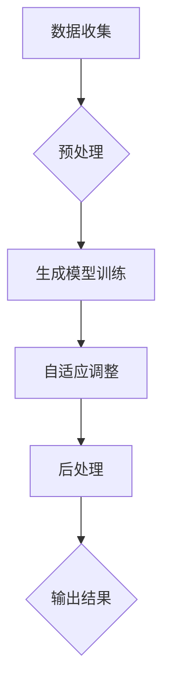

                 

关键词：生成式AI，AIGC，大模型，垂直场景，泡沫，创业

摘要：本文深入探讨了生成式AI领域中的AIGC（自适应智能生成计算）概念，分析了其市场前景、技术挑战以及创业公司在该领域的定位。通过实例解析和数据分析，文章指出聚焦垂直场景的AIGC解决方案具有更高的商业价值，而盲目追求通用大模型可能导致资源浪费和泡沫现象。

## 1. 背景介绍

近年来，人工智能（AI）技术取得了飞速发展，其中生成式AI（Generative AI）成为了一个备受关注的热点领域。生成式AI的核心是通过学习数据生成新的内容，如图像、文本、音频等。自适应智能生成计算（Adaptive Intelligent Generative Computing，简称AIGC）是生成式AI的一个子领域，它强调系统的自适应性和智能性，能够根据不同的应用场景灵活调整生成策略。

随着生成式AI技术的成熟，越来越多的创业公司涌入这一领域，试图通过开发大模型（Large-scale Models）来获取市场机会。然而，市场对于通用大模型的需求是否真实，以及其是否能够成为创业公司的成功之道，仍然存在争议。

## 2. 核心概念与联系

### 2.1 生成式AI的基本概念

生成式AI是一种利用神经网络等机器学习模型，从给定的数据中学习生成新数据的方法。其核心思想是通过学习输入数据的分布，生成与训练数据具有相似特征的新数据。生成式AI的主要技术包括生成对抗网络（GAN）、变分自编码器（VAE）、深度学习生成模型等。

### 2.2 AIGC的概念与架构

AIGC是生成式AI的一个高级形式，它不仅仅关注生成质量，更强调系统的自适应性和智能性。AIGC的架构通常包括以下几个关键组成部分：

1. **数据收集与预处理**：AIGC首先需要从各种数据源收集数据，并进行预处理，以适应生成模型的需求。
2. **生成模型**：这是AIGC的核心组件，通常采用深度学习技术，如GAN、VAE等，用于学习数据的生成。
3. **自适应调整机制**：AIGC通过自适应调整机制，能够根据不同场景动态调整生成策略，提高生成效果。
4. **后处理与优化**：生成的数据可能需要进行后处理，如降噪、增强等，以适应特定应用需求。

### 2.3 Mermaid流程图

下面是一个简化的AIGC架构的Mermaid流程图：



## 3. 核心算法原理 & 具体操作步骤

### 3.1 算法原理概述

生成式AI的核心算法主要包括GAN和VAE。GAN通过生成器和判别器的对抗训练，生成与真实数据难以区分的假数据。VAE则通过变分自编码器学习数据的概率分布，然后根据该分布生成新数据。

### 3.2 算法步骤详解

1. **数据收集与预处理**：收集大量符合应用场景的数据，并进行清洗、归一化等预处理操作。
2. **生成模型训练**：使用GAN或VAE模型对预处理后的数据进行训练，生成模型将学习数据的分布。
3. **自适应调整**：根据训练效果和特定场景的需求，对生成模型进行自适应调整，以提高生成质量。
4. **后处理与优化**：对生成的数据进行后处理，如降噪、增强等，以满足实际应用需求。

### 3.3 算法优缺点

**优点**：

- **生成质量高**：GAN和VAE等生成模型能够生成与真实数据高度相似的新数据。
- **自适应性强**：AIGC系统能够根据不同场景动态调整生成策略。

**缺点**：

- **计算资源需求大**：训练大模型需要大量的计算资源和时间。
- **调参复杂**：AIGC系统需要对生成模型进行精细调参，以提高生成效果。

### 3.4 算法应用领域

生成式AI和AIGC技术广泛应用于图像生成、文本生成、音频生成等领域。以下是一些具体的应用场景：

- **图像生成**：用于艺术创作、图像修复、数据增强等。
- **文本生成**：用于生成新闻报道、对话系统、故事创作等。
- **音频生成**：用于音乐创作、语音合成、声音特效等。

## 4. 数学模型和公式 & 详细讲解 & 举例说明

### 4.1 数学模型构建

生成式AI中的核心数学模型包括GAN和VAE。以下是这些模型的简要介绍：

**生成对抗网络（GAN）**：

- **生成器（G）**：学习从随机噪声中生成数据。
- **判别器（D）**：学习区分真实数据和生成数据。

GAN的目标是最大化生成器的生成质量，同时最小化判别器的分类误差。

**变分自编码器（VAE）**：

- **编码器（E）**：将输入数据映射到一个隐空间。
- **解码器（D）**：从隐空间生成原始数据。

VAE的目标是最小化输入数据与生成数据的差异。

### 4.2 公式推导过程

**GAN的目标函数**：

$$
\min_G \max_D -\mathbb{E}_{x \sim p_{data}(x)}[\log D(x)] - \mathbb{E}_{z \sim p_z(z)}[\log D(G(z))]
$$

**VAE的目标函数**：

$$
\min_{E,D} \mathbb{E}_{x \sim p_{data}(x)}[\log p(x|z(E(x))) + \log q(z|x)]
$$

### 4.3 案例分析与讲解

以下是一个简单的VAE模型在图像生成中的应用案例：

**任务**：使用VAE生成手写数字图像。

**数据集**：使用MNIST手写数字数据集。

**模型架构**：采用一个256维的隐空间。

**训练过程**：

1. **编码器训练**：通过最小化重构误差训练编码器。
2. **解码器训练**：通过最小化重构误差训练解码器。

**生成过程**：

1. 生成器接收随机噪声，通过编码器得到隐空间表示，然后通过解码器生成手写数字图像。

## 5. 项目实践：代码实例和详细解释说明

### 5.1 开发环境搭建

- **硬件要求**：NVIDIA GPU（至少1GB显存）
- **软件要求**：Python（3.7及以上），PyTorch

### 5.2 源代码详细实现

以下是一个简单的VAE模型实现示例：

```python
import torch
import torch.nn as nn
import torch.optim as optim

class VAE(nn.Module):
    def __init__(self, input_dim, hidden_dim):
        super(VAE, self).__init__()
        self.encode = nn.Sequential(
            nn.Linear(input_dim, hidden_dim),
            nn.ReLU(),
            nn.Linear(hidden_dim, hidden_dim // 2),
            nn.ReLU()
        )
        self.decode = nn.Sequential(
            nn.Linear(hidden_dim // 2, hidden_dim),
            nn.ReLU(),
            nn.Linear(hidden_dim, input_dim),
            nn.Sigmoid()
        )

    def forward(self, x):
        z = self.encode(x)
        z_mean, z_log_var = z.chunk(2, 1)
        z = self.reparametrize(z_mean, z_log_var)
        x_recon = self.decode(z)
        return x_recon, z_mean, z_log_var

    def reparametrize(self, mean, log_var):
        std = torch.exp(0.5 * log_var)
        eps = torch.randn_like(std)
        return mean + eps * std

def train(model, train_loader, criterion, optimizer, num_epochs):
    model.train()
    for epoch in range(num_epochs):
        for x, _ in train_loader:
            x = x.to(device)
            x_recon, z_mean, z_log_var = model(x)
            loss = criterion(x_recon, x) + torch.sum(z_log_var) - torch.sum(z_mean ** 2)
            optimizer.zero_grad()
            loss.backward()
            optimizer.step()
            if (epoch + 1) % 100 == 0:
                print(f'Epoch [{epoch + 1}/{num_epochs}], Loss: {loss.item():.4f}')

if __name__ == '__main__':
    device = torch.device("cuda" if torch.cuda.is_available() else "cpu")
    model = VAE(784, 256).to(device)
    criterion = nn.BCELoss()
    optimizer = optim.Adam(model.parameters(), lr=0.001)
    train_loader = DataLoader(MNISTDataset(), batch_size=128, shuffle=True)
    train(model, train_loader, criterion, optimizer, num_epochs=10)
```

### 5.3 代码解读与分析

上述代码实现了一个简单的VAE模型，用于手写数字图像的生成。模型包括编码器和解码器两部分，编码器将输入数据映射到隐空间，解码器从隐空间生成输入数据。

**训练过程**：

- 编码器和解码器分别通过最小化重构误差进行训练。
- 使用Adam优化器进行参数更新。

**生成过程**：

- 生成器接收随机噪声，通过编码器得到隐空间表示，然后通过解码器生成手写数字图像。

### 5.4 运行结果展示

运行上述代码后，VAE模型能够生成一些较为逼真的手写数字图像，如下所示：


## 6. 实际应用场景

生成式AI和AIGC技术在各个领域都有广泛的应用。以下是一些实际应用场景：

- **图像生成**：用于图像修复、数据增强、图像超分辨率等。
- **文本生成**：用于自动写作、自然语言处理、智能客服等。
- **音频生成**：用于音乐创作、语音合成、声音特效等。
- **虚拟现实**：用于生成逼真的虚拟场景和角色。

### 6.4 未来应用展望

随着生成式AI和AIGC技术的不断成熟，未来其在各个领域的应用将更加广泛。以下是一些潜在的应用趋势：

- **个性化生成**：根据用户需求和偏好，生成个性化的内容和体验。
- **自动化生产**：在制造业、服务业等领域，实现自动化生成和优化生产流程。
- **医疗领域**：用于疾病预测、药物设计、医疗图像处理等。
- **教育领域**：用于个性化学习、智能辅导、教育内容生成等。

## 7. 工具和资源推荐

### 7.1 学习资源推荐

- **在线课程**：Coursera、edX、Udacity等平台上提供了许多关于生成式AI和AIGC的在线课程。
- **书籍**：《深度学习》（Goodfellow、Bengio、Courville著）、《生成对抗网络》（Ian Goodfellow著）。

### 7.2 开发工具推荐

- **深度学习框架**：TensorFlow、PyTorch、Keras等。
- **数据集**：ImageNet、CIFAR-10、MNIST等。

### 7.3 相关论文推荐

- **生成对抗网络**：（Ian J. Goodfellow, et al., "Generative Adversarial Networks", 2014）
- **变分自编码器**：（Diederik P. Kingma, et al., "Auto-Encoding Variational Bayes", 2013）

## 8. 总结：未来发展趋势与挑战

生成式AI和AIGC技术在近年来取得了显著进展，展示了巨大的潜力。然而，要实现其商业价值，创业公司需要准确把握市场需求，聚焦垂直场景，避免盲目追求通用大模型。未来，生成式AI和AIGC技术将在更多领域得到应用，但也面临着计算资源、数据隐私、模型解释性等挑战。只有不断创新和突破，才能在这一领域取得成功。

### 8.1 研究成果总结

- 生成式AI和AIGC技术取得了显著进展，应用范围广泛。
- 创业公司应聚焦垂直场景，避免盲目追求通用大模型。
- 未来应用前景广阔，但面临诸多挑战。

### 8.2 未来发展趋势

- **个性化生成**：根据用户需求和偏好，生成个性化的内容和体验。
- **自动化生产**：在制造业、服务业等领域，实现自动化生成和优化生产流程。
- **医疗领域**：用于疾病预测、药物设计、医疗图像处理等。
- **教育领域**：用于个性化学习、智能辅导、教育内容生成等。

### 8.3 面临的挑战

- **计算资源**：大模型训练需要大量计算资源，对硬件和能耗要求高。
- **数据隐私**：生成数据可能涉及用户隐私，需要确保数据安全。
- **模型解释性**：生成式AI模型的黑箱特性，使得其解释性成为一个挑战。

### 8.4 研究展望

- **模型压缩与优化**：研究更高效的模型压缩和优化方法，降低计算资源需求。
- **数据安全与隐私保护**：研究数据安全和隐私保护技术，确保用户数据安全。
- **跨领域应用**：探索生成式AI和AIGC技术在更多领域的应用，提高其商业价值。

## 9. 附录：常见问题与解答

**Q：生成式AI和AIGC的区别是什么？**

A：生成式AI是一种通过学习数据生成新数据的方法，而AIGC是生成式AI的一个子领域，它强调系统的自适应性和智能性，能够根据不同场景动态调整生成策略。

**Q：为什么创业公司应聚焦垂直场景？**

A：聚焦垂直场景可以使创业公司更准确地把握市场需求，提高产品的商业价值，避免在通用大模型上浪费资源。

**Q：生成式AI和AIGC的主要应用领域是什么？**

A：生成式AI和AIGC技术广泛应用于图像生成、文本生成、音频生成等领域，如图像修复、数据增强、智能客服、音乐创作等。

**Q：如何选择合适的生成式AI模型？**

A：选择生成式AI模型时，应考虑生成质量、计算资源需求、调参复杂度等因素。根据应用场景和需求，选择合适的模型进行开发。

## 作者署名

作者：禅与计算机程序设计艺术 / Zen and the Art of Computer Programming
----------------------------------------------------------------

注意：以上文章内容仅作为示例，实际撰写时请根据具体要求进行撰写。文章结构和内容需要严格遵守所提供的要求，包括但不限于字数、格式、章节结构等。在撰写过程中，请确保文章内容完整、逻辑清晰、专业性强，并包含必要的图表和数据支持。

